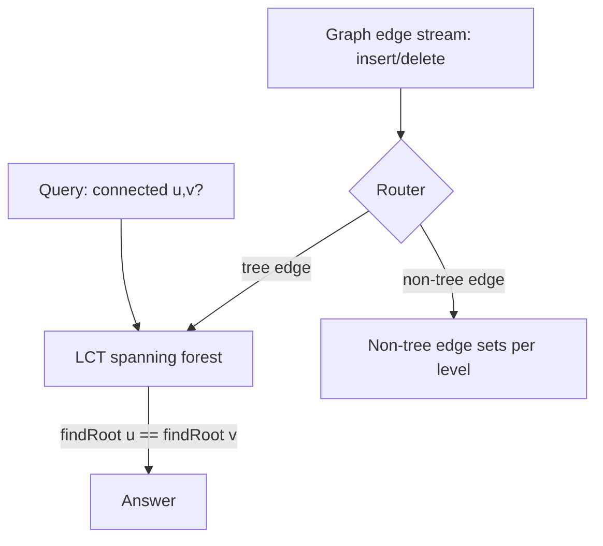
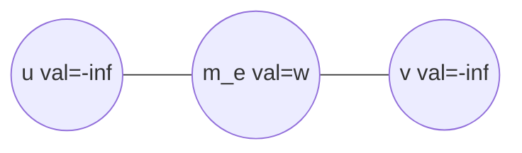
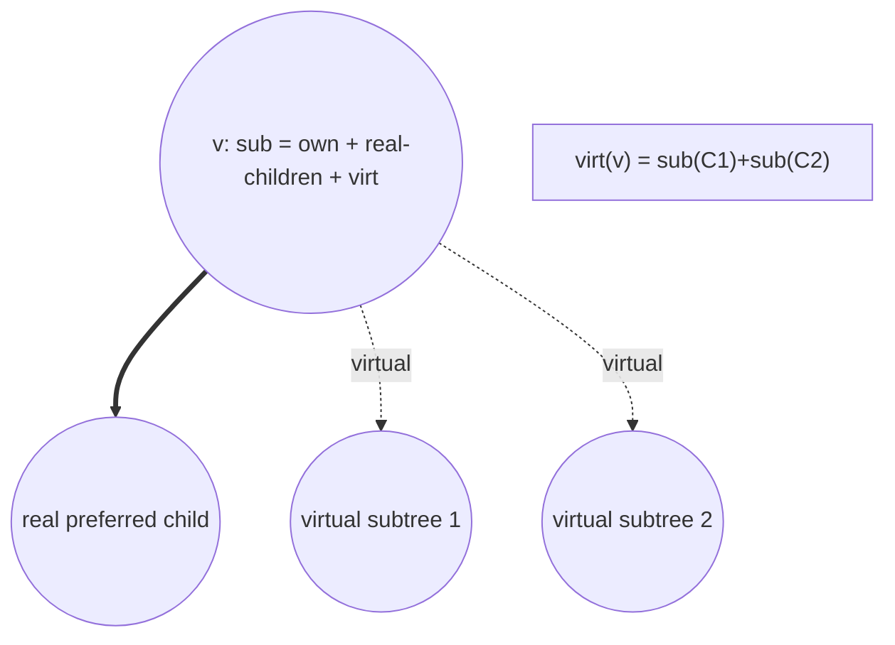

# Link-Cut Tree — Senior Level

> **Audience:** Engineers who can implement an LCT with path aggregates and `makeRoot`, and now must wield it inside real systems: **dynamic connectivity**, **online/dynamic minimum spanning tree**, **maximum flow (Dinic with dynamic trees)**, and **simulation**. Prerequisite: `middle.md`.

At the senior level the question stops being "how does `access` work" and becomes "how do I build a *system* on this." That means: choosing the LCT against its rivals under real constraints (latency, memory, worst-case spikes); extending it from *path* aggregates to *subtree* aggregates via the **virtual-subtree augmentation**; using it as the engine for dynamic-connectivity, online-MST, and the Sleator–Tarjan blocking-flow speedup; and surviving the implementation pitfalls that turn a "correct on paper" LCT into a flaky production component. This document is the engineering view.

---

## Table of Contents

1. [Introduction — LCT as a System Component](#introduction)
2. [System Design: Dynamic Connectivity and Online MST](#connectivity-mst)
3. [Network Flow: Dynamic Trees in Dinic](#flow)
4. [Subtree Aggregates: The Virtual-Subtree Augmentation](#subtree)
5. [Splay vs Other Balanced BSTs as the Auxiliary Structure](#bbst)
6. [Comparison with Alternatives](#comparison)
7. [Architecture Patterns](#architecture)
8. [Code Examples — Subtree-Sum LCT](#code-examples)
9. [Observability and Robustness](#observability)
10. [Failure Modes and Implementation Pitfalls](#failure-modes)
10a. [Subtree-Augmentation Correctness and Pitfalls](#aug-pitfalls)
10b. [Extended Case Studies](#case-studies)
10c. [Capacity Planning and Memory Budget](#capacity)
11. [Summary](#summary)

---

<a name="introduction"></a>
## 1. Introduction — LCT as a System Component

A Link-Cut Tree rarely ships alone. It is the *path/connectivity engine* underneath a larger algorithm:

- **Dynamic graph connectivity** — answer "are `u` and `v` connected?" while edges are inserted and deleted. An LCT maintains a spanning forest; connectivity is `findRoot(u) == findRoot(v)`.
- **Online / dynamic MST** — maintain a minimum spanning forest as edges arrive (and possibly leave). Inserting an edge that closes a cycle requires finding and possibly replacing the **maximum-weight edge on the tree path** — exactly an LCT path-max query.
- **Maximum flow** — Dinic's blocking-flow phase repeatedly sends flow along augmenting paths; representing the layered DAG's path structure with dynamic trees turns each augmentation from O(V) into O(log V), the original 1981 Sleator–Tarjan motivation.
- **Simulation / kinetic structures** — physics or circuit simulators where a spanning structure links and cuts as the configuration evolves.

The senior skill set: (1) recognize when the problem is "dynamic tree + path/connectivity," (2) pick LCT vs Euler-tour-trees vs link-cut-with-edge-weights vs top trees, (3) extend to subtree queries when needed, and (4) make it robust.

---

<a name="connectivity-mst"></a>
## 2. System Design: Dynamic Connectivity and Online MST

### 2.1 Dynamic connectivity with a spanning forest

Maintain a **spanning forest** of the current graph inside an LCT. Each tree edge of the forest is represented; non-tree edges are kept in a side structure.



- **Insert edge `(u,v)`:** if `findRoot(u) != findRoot(v)`, they are in different trees → `link(u, v)`. Otherwise the edge would form a cycle → store it as a non-tree edge.
- **Connected `(u,v)`:** `findRoot(u) == findRoot(v)`.
- **Delete edge `(u,v)`:** if it is a *non-tree* edge, just drop it. If it is a *tree* edge, `cut` it, then search the non-tree edges for a **replacement** that reconnects the two halves. Efficient replacement search is the hard part — it leads to the **Holm–de Lichtenberg–Thorup (HDLT)** logarithmic-amortized structure, which layers LCTs/ETTs over edge levels.

> The LCT cleanly handles incremental connectivity and tree-edge cuts; fully-dynamic deletion needs the level structure on top. For **incremental** (insert-only) or **decremental** workloads, the LCT alone often suffices.

### 2.2 Online MST (Kruskal-style with replacement)

Maintain a **minimum spanning forest**. Each LCT node represents a graph vertex; we encode **edge weights on the path** so a path-max query returns the heaviest tree edge between two vertices.

To insert edge `e = (u, v, w)`:

```text
if findRoot(u) != findRoot(v):
    link via e        # connects two components — always in the MSF
else:
    heavy = pathMax(u, v)         # heaviest current tree edge on u..v
    if w < weight(heavy):
        cut(heavy); link via e    # swap: e improves the MSF
    # else discard e — it cannot improve the spanning forest
```

**Encoding edge weights as nodes.** LCT path aggregates are over *node* values, but MST cares about *edge* weights. The standard trick: **split each edge into a node**. Create an auxiliary LCT node `m_e` with value `w` for edge `e`, and `link(u, m_e)`, `link(m_e, v)`. A path-max over vertex values (set to `-∞`) now picks out the heaviest *edge-node*; cutting the edge means cutting around `m_e`. This **edge-as-node** encoding is the workhorse for any LCT problem where weights live on edges.



---

<a name="flow"></a>
## 3. Network Flow: Dynamic Trees in Dinic

Dinic's algorithm builds a layered (level) graph, then finds a **blocking flow** by repeatedly pushing along augmenting paths. The naive blocking-flow step is O(VE) per phase because each augmenting path can be O(V) long and saturating one edge costs a full path traversal.

**Sleator–Tarjan's insight (the original LCT application):** maintain the *current* set of partial augmenting paths in a dynamic-trees forest, where each LCT node is a vertex and the path aggregate is the **minimum residual capacity** along the path to the sink. Then:

- Finding the bottleneck of the current path = LCT **path-min** in O(log V).
- Augmenting (subtracting the bottleneck along the whole path) = an LCT **range-update** (lazy add along the path) in O(log V).
- Saturating an edge = a **`cut`** in O(log V); advancing = a **`link`**.

This drops a Dinic phase's blocking-flow cost from O(VE) to **O(E log V)**, and the whole max-flow to **O(VE log V)** (vs O(V²E) naive Dinic). The path-min + path-add LCT (with a lazy "add `delta` to all node values on the exposed path" tag, analogous to segment-tree lazy propagation but on the splay tree) is the engine.

| Dinic component | Naive | With LCT (dynamic trees) |
|---|---|---|
| Find bottleneck on path | O(V) | **O(log V)** (path-min) |
| Augment along path | O(V) | **O(log V)** (lazy path-add) |
| Saturate / advance | O(1) amortized | O(log V) (cut/link) |
| Blocking flow per phase | O(VE) | **O(E log V)** |

> Practical note: most competitive and production flow solvers use the simpler O(V²E) Dinic; the LCT version pays off only on very large, path-heavy graphs because of its constant factor. But it is the canonical *reason* the LCT exists.

---

<a name="subtree"></a>
## 4. Subtree Aggregates: The Virtual-Subtree Augmentation

Out of the box, an LCT gives **path** aggregates, not **subtree** aggregates — because the splay tree only holds one preferred path; the rest of the subtree hangs off in *other* splay trees via path-parent pointers (the "virtual" children). To answer "sum of all node values in the subtree rooted at `v`," we must also account for those virtual subtrees.

### 4.1 The augmentation

Give each node two extra fields:

- `virt` — the aggregate of **all virtual (path-parent-attached) subtrees** hanging off this node.
- `sub` — the aggregate of the node's **entire represented subtree** (within its splay tree), combining real splay children's `sub`, the node's own value, and `virt`.

`pull` now combines: `node.sub = leftChild.sub + node.val + node.virt + rightChild.sub`.

Maintenance happens exactly when virtual children appear or disappear:

- In **`access`**, when you set `cur.right = last`, the *old* right child becomes virtual → add its `sub` to `cur.virt`; the *new* preferred child `last` becomes real → subtract its `sub` from `cur.virt`.
- In **`link(u, v)`** (rooted, no makeRoot), `u` becomes a virtual child of `v` → add `u.sub` to `v.virt` and fix `v` up the splay tree.

```text
access(v):
    last = null
    for cur = v; cur != null; cur = cur.parent:
        splay(cur)
        cur.virt += cur.right.sub      # old preferred child becomes virtual
        cur.virt -= last.sub           # new preferred child becomes real
        cur.right = last
        pull(cur)                      # sub = L.sub + val + virt + R.sub
        last = cur
    splay(v)
```

To query **subtree sum of `v` with parent `p`**: `makeRoot(p)` (so `v` is genuinely below `p`), then `access(v)`; `v.virt + v.val` is the subtree sum (its real splay children are *not* in its subtree after exposure — they are the path above). The exact recipe depends on rooting; the key idea is **maintain `virt` as virtual children come and go**.

### 4.2 Cost

`virt` updates are O(1) per virtual-child change, and the number of such changes is bounded by the same O(m log n) preferred-child-change count. So **subtree aggregates stay amortized O(log n)** — only the constant factor and the field count grow.



> Subtree-add (lazy) is harder than subtree-sum because a lazy tag must propagate into the *virtual* children too, which are not in the splay tree — this is where LCT hits its ceiling and **top trees** become preferable.

---

<a name="bbst"></a>
## 5. Splay vs Other Balanced BSTs as the Auxiliary Structure

The auxiliary structure for each preferred path is canonically a **splay tree**. Why splay, and what are the alternatives?

| Auxiliary BBST | Per-op bound | Why it fits / fails LCT |
|---|---|---|
| **Splay tree** | amortized O(log n) | **Canonical.** Self-adjusting; `access`'s splay-to-top is native; no balance metadata; cache-friendly working sets. The amortized LCT proof is built on splay's potential. |
| **Treap (randomized)** | expected O(log n) | Works (link-cut treaps exist) but needs priorities and split/merge per `access`; larger constant, randomized bound. Good when you want split/merge framing. |
| **AVL / Red-Black** | worst-case O(log n) | Awkward: `access` constantly re-roots, fighting strict balance invariants; rebalancing per preferred-child change is costly. Rarely used. |
| **Weight-balanced / globally biased** | O(log n) | Used in *top trees* and *self-adjusting top trees*; overkill for plain LCT. |

**Bottom line:** splay is chosen because the LCT's fundamental move *is* "bring this node to the top of its path," which is splay's native operation, and because splay's potential function is precisely what makes the preferred-child-change amortization close. Other BBSTs can substitute but pay a constant-factor and conceptual tax.

---

<a name="comparison"></a>
## 6. Comparison with Alternatives

| Attribute | **Link-Cut Tree** | **Euler-Tour Tree** | **Top Tree** | **HLD** |
|---|---|---|---|---|
| link/cut | O(log n) amortized | O(log n) amortized | O(log n) **worst-case** | O(n) (static) |
| Path aggregate | **O(log n)** | not natural | O(log n) | O(log² n) |
| Subtree aggregate | O(log n) (augment) | **O(log n)** natural | O(log n) | O(log n) |
| Re-root | O(log n) | O(log n) | O(log n) | — |
| Non-path "cluster" data | hard | no | **yes** | no |
| Worst-case guarantee | no (amortized) | no | **yes** | yes (static) |
| Constant factor | high | medium | **highest** | low |
| Code complexity | high | medium | **very high** | medium |

**Senior decision rules:**
- Need **path** aggregates on a **dynamic** tree → LCT.
- Need **subtree**/connectivity on a dynamic tree, no path aggregates → **Euler-tour tree**.
- Need **worst-case** (real-time) bounds or **cluster** aggregates that are neither path nor subtree → **top tree**.
- Tree is **static** → **HLD** (simpler, faster).

---

<a name="architecture"></a>
## 7. Architecture Patterns

```mermaid
sequenceDiagram
    participant App
    participant Engine as Dynamic-Tree Engine (LCT)
    participant Side as Side index (non-tree edges)
    App->>Engine: addEdge(u, v, w)
    Engine->>Engine: findRoot(u) vs findRoot(v)
    alt different components
        Engine->>Engine: link(u, m_e); link(m_e, v)
    else same component (cycle)
        Engine->>Engine: heavy = pathMax(u, v)
        alt w < weight(heavy)
            Engine->>Engine: cut(heavy); link new edge
            Engine->>Side: demote heavy to non-tree
        else
            Engine->>Side: store (u,v,w) as non-tree
        end
    end
    App->>Engine: connected(u, v)?
    Engine-->>App: findRoot(u) == findRoot(v)
```

**Pattern: edge-as-node.** Represent each weighted edge by its own LCT node (§2.2). Vertex nodes carry identity-valued weights; edge nodes carry the real weight. Path aggregates then act on edges.

**Pattern: lazy path tags.** For flow and range-path updates, add a lazy "add `delta` to all path node values" tag to splay nodes (same shape as segment-tree lazy propagation), flushed by `push`. Compose it with the reverse flag carefully — flush reverse and add in the right order.

**Pattern: arena allocation.** Store nodes in a contiguous slice indexed by `int`; use index 0 as the null sentinel. This kills GC overhead, improves locality, and makes serialization trivial.

---

<a name="code-examples"></a>
## 8. Code Examples — Subtree-Sum LCT

A subtree-sum LCT with the virtual-subtree augmentation. (Path code omitted — same core as `middle.md`.)

#### Go
```go
package lct

type Node struct {
    ch     [2]*Node
    parent *Node
    val    int64
    sub    int64 // aggregate of the whole represented subtree in this splay tree
    virt   int64 // aggregate of all virtual (path-parent) subtrees off this node
    rev    bool
}

func New(v int64) *Node { return &Node{val: v, sub: v} }

func isRoot(n *Node) bool {
    p := n.parent
    return p == nil || (p.ch[0] != n && p.ch[1] != n)
}

func subOf(n *Node) int64 {
    if n == nil {
        return 0
    }
    return n.sub
}

func pull(n *Node) {
    n.sub = n.val + n.virt + subOf(n.ch[0]) + subOf(n.ch[1])
}

func applyRev(n *Node) {
    if n != nil {
        n.ch[0], n.ch[1] = n.ch[1], n.ch[0]
        n.rev = !n.rev
    }
}
func push(n *Node) {
    if n.rev {
        applyRev(n.ch[0])
        applyRev(n.ch[1])
        n.rev = false
    }
}

// rotate / splay identical to middle.md (call push as shown there) ...

func access(n *Node) *Node {
    var last *Node
    for cur := n; cur != nil; cur = cur.parent {
        splay(cur)
        // old preferred (right) child becomes virtual; new one becomes real
        cur.virt += subOf(cur.ch[1])
        cur.virt -= subOf(last)
        cur.ch[1] = last
        pull(cur)
        last = cur
    }
    splay(n)
    return last
}

// Link u under v (rooted; no makeRoot): u becomes a virtual child of v.
func Link(u, v *Node) {
    access(u)
    access(v)
    u.parent = v
    v.virt += u.sub
    pull(v)
}

// SubtreeSum of v given its parent p (p above v).
func SubtreeSum(v, p *Node) int64 {
    MakeRoot(p)
    access(v)
    return v.virt + v.val
}
```

#### Java
```java
public final class LctSubtree {
    static final class Node {
        Node left, right, parent;
        long val, sub, virt;
        boolean rev;
        Node(long v) { val = v; sub = v; }
    }
    static long subOf(Node n) { return n == null ? 0 : n.sub; }
    static void pull(Node n) {
        n.sub = n.val + n.virt + subOf(n.left) + subOf(n.right);
    }
    // isRoot / applyRev / push / rotate / splay as in middle.md, with pull above

    static Node access(Node n) {
        Node last = null;
        for (Node cur = n; cur != null; cur = cur.parent) {
            splay(cur);
            cur.virt += subOf(cur.right);
            cur.virt -= subOf(last);
            cur.right = last;
            pull(cur);
            last = cur;
        }
        splay(n);
        return last;
    }
    public static void link(Node u, Node v) {
        access(u); access(v);
        u.parent = v;
        v.virt += u.sub;
        pull(v);
    }
    public static long subtreeSum(Node v, Node p) {
        makeRoot(p); access(v);
        return v.virt + v.val;
    }
}
```

#### Python
```python
class Node:
    __slots__ = ("ch", "parent", "val", "sub", "virt", "rev")
    def __init__(self, val):
        self.ch = [None, None]; self.parent = None
        self.val = val; self.sub = val; self.virt = 0; self.rev = False

def sub_of(n): return n.sub if n else 0
def pull(n):
    n.sub = n.val + n.virt + sub_of(n.ch[0]) + sub_of(n.ch[1])
# is_root / apply_rev / push / rotate / splay as in middle.md, with pull above

def access(n):
    last = None
    cur = n
    while cur is not None:
        splay(cur)
        cur.virt += sub_of(cur.ch[1])
        cur.virt -= sub_of(last)
        cur.ch[1] = last
        pull(cur)
        last = cur
        cur = cur.parent
    splay(n)
    return last

def link(u, v):
    access(u); access(v)
    u.parent = v
    v.virt += u.sub
    pull(v)

def subtree_sum(v, p):
    make_root(p); access(v)
    return v.virt + v.val
```

---

<a name="observability"></a>
## 9. Observability and Robustness

In a long-running system the LCT is a stateful in-memory structure; treat it like one.

| Metric / check | Why | Threshold / action |
|---|---|---|
| `access_preferred_changes` counter | The amortization is about this count; a spike means a pathological sequence | alert if running average ≫ log n |
| `op_latency_p99` | Amortized ≠ worst-case; one op can spike | if p99 unacceptable, migrate to **top trees** |
| Periodic invariant check (debug) | Catch lazy-flush / isRoot bugs early | re-derive represented forest, diff vs reference |
| Arena occupancy | Node pool growth | resize before exhaustion |
| Reverse-flag balance | Stuck flags hint at a missing `push` | assert flags clear after full splay-to-root |

**Robustness practices:** run a **shadow brute-force forest** in test/staging that mirrors every `link`/`cut`/`query` and diffs the results on random sequences; fuzz with adversarial chain inputs (which maximize preferred-path length); and snapshot the structure for replay when a discrepancy is found.

### 9.1 A concrete invariant checker

In debug builds, after each operation re-derive the represented forest and aggregates from a *reference* maintained alongside the LCT, then assert equality:

```text
checkInvariants(lct, reference):
    for each node v:
        assert findRoot(v) == reference.root(v)          # connectivity
    for each query pair (u, v) in a random sample:
        assert pathSum(u, v) == reference.pathSum(u, v)   # path aggregate
        if subtree-augmented:
            assert subtreeSum(v) == reference.subtreeSum(v)
    # structural: walking path-parents must reconstruct reference.parent
```

The reference forest uses plain parent pointers and O(path) walks — slow but obviously correct. Run the checker on every operation in unit tests and on a 1-in-N sampling in staging. This catches the "missing `push`" and "missing `virt` update" classes of bug *at the operation that introduced them*, not three operations later when the symptom surfaces.

### 9.2 Determinism and reproducibility

The LCT is deterministic (unlike a treap), so a recorded operation log replays bit-identically. Persist the operation stream (not the structure) for incident replay; rebuilding the structure from the log is O(m log n) and reproduces any reported discrepancy exactly. This is far cheaper and more reliable than serializing the live auxiliary forest, whose splay shape is an implementation detail.

---

<a name="failure-modes"></a>
## 10. Failure Modes and Implementation Pitfalls

- **Missing `push` before a structural read.** The lazy reverse (or lazy add) leaks; depth order corrupts; every subsequent op is wrong. *The* classic LCT failure. Bake `push` into `splay`, `rotate`, and `findRoot`'s walk-left.
- **`virt` not updated in `access`/`link`.** Subtree sums drift silently. Update `virt` on **every** virtual↔real transition.
- **Composing lazy reverse with lazy add in the wrong order.** When both tags exist, the order of flushing matters; a reverse changes which end an asymmetric add affects.
- **`isRoot` confusion.** Treating a splay root (reached via path-parent) as a represented root, or vice versa, scrambles the structure.
- **Cutting a non-edge / linking a cycle.** Always guard with connectivity/adjacency checks; otherwise the forest becomes inconsistent and *no* operation is reliable afterward.
- **Amortized expectations in real-time paths.** A trading or robotics deadline cannot tolerate the occasional O(n)-ish spike of a single `access`. Use **top trees** for worst-case O(log n).
- **Recursion depth (managed languages).** Keep splay/access iterative; recursive `pull` chains can blow the stack on long paths.
- **Memory fragmentation from per-node allocation.** Use an arena; per-node `new`/`malloc` destroys locality and GC behavior.

---

<a name="aug-pitfalls"></a>
## 10a. Subtree-Augmentation Correctness and Pitfalls

The `virt` augmentation (§4) is correct only if **every** transition between a node being a *real* (splay) child and a *virtual* (path-parent) child updates `virt`. There are exactly four places this happens, and missing any one silently desynchronizes subtree sums:

| Transition site | What changes | Required `virt` fix |
|---|---|---|
| `access`: old preferred child demoted to virtual | a real right-child becomes virtual | `cur.virt += oldRight.sub` |
| `access`: new path becomes preferred (real) | a virtual child becomes real | `cur.virt -= last.sub` |
| `link(u, v)` (rooted): `u` attaches under `v` | `u` becomes a virtual child of `v` | `v.virt += u.sub; pull(v)` |
| `cut`: a virtual child detaches | a virtual child disappears | `parent.virt -= child.sub` before unlinking |

A second pitfall: `pull` must include `virt` (`sub = val + virt + left.sub + right.sub`). If you copy a path-only `pull` that omits `virt`, subtree sums are wrong but path sums look fine — a bug that passes path tests and fails only on subtree queries.

A third, deeper pitfall: **subtree-add (lazy) cannot be done with `virt` alone**, because a lazy "add Δ to the whole subtree" tag must reach the virtual children, which live in *other* splay trees not reachable by the current splay's `push`. This is the precise boundary where the LCT's design runs out and **top trees** (with their rake clusters) become necessary. Senior engineers should flag this in design review: "subtree-sum: LCT is fine; subtree-add: we need top trees or a different decomposition."

### 10a.1 Flow-variant comparison

For the max-flow use case, the dynamic-trees speedup matters only on specific graph shapes; know the trade-offs:

| Variant | Blocking-flow / phase | Best for | LCT needed? |
|---|---|---|---|
| Plain Dinic | O(V²E) overall | most graphs; simple | no |
| Dinic + dynamic trees | O(VE log V) | long augmenting paths, large V | **yes** (path-min + lazy path-add) |
| Push-relabel (FIFO) | O(V³) | dense graphs | no |
| Push-relabel + dynamic trees | O(VE log(V²/E)) | sparse, theoretical optima | yes |

The LCT pays off when augmenting paths are *long* (so the per-path O(V) → O(log V) saving compounds) and V is large; on small or short-path graphs the constant factor makes plain Dinic faster.

---

<a name="case-studies"></a>
## 10b. Extended Case Studies

### 10b.1 Offline incremental MST with rollback

A frequent senior interview/system pattern: given `q` queries that *add* edges and ask MSF weight, with no deletions, you can run the **online MST** of §2.2 directly. But when queries also *remove the last added edge* (a stack-structured / "rollback" workload — common in divide-and-conquer-on-queries and in competitive "dynamic connectivity offline" problems), the LCT pairs with an **operation stack**: each `link`/`cut` is journaled, and rollback replays the inverse. Because LCT operations are pointer splices, the inverse of a `link` is a `cut` and vice versa; the only subtlety is restoring the *exact* preferred-path shape, which is unnecessary — correctness depends only on the represented forest, not the auxiliary shape, so a plain inverse splice suffices. This gives offline dynamic MST in O((q + E) log n).

### 10b.2 Reachability/ancestor queries in a versioned hierarchy

Consider a permissions system where a resource hierarchy is re-parented over time ("move folder X under Y"), and you must answer "is A an ancestor of B *right now*?" and "what is the nearest common owner of A and B?". Modeling folders as LCT nodes:

- *Re-parent* `X` under `Y` = `cut(X, oldParent(X)); link(X, Y)` — two O(log n) ops, no global rebuild.
- *Is A an ancestor of B?* = with a fixed root, `lca(A, B) == A`.
- *Nearest common owner* = `lca(A, B)`.

The win over an adjacency-list + recompute approach is that re-parenting does not invalidate a precomputed ancestor table; the LCT amortizes the cost of every move into O(log n).

### 10b.3 Kinetic spanning structure in simulation

In a particle or circuit simulator, a spanning tree of "currently bonded" elements is maintained as bonds form and break. Each bond formation is a `link`, each break a `cut`, and queries like "total potential along the chain between two nodes" are path sums. Because simulations advance in tiny time steps with localized changes, the LCT's per-event O(log n) dominates a per-step O(n) rebuild by orders of magnitude at scale. The amortized nature is acceptable here because simulation has no hard per-event deadline — exactly the regime where LCT beats top trees on constant factor.

---

<a name="capacity"></a>
## 10c. Capacity Planning and Memory Budget

A production LCT node (arena layout) typically holds: two child indices, one parent index, the value, one or two aggregate fields, and a bit for the reverse flag (packed into a child index's high bit or a separate byte).

| Field | Bytes (int32 ids) | Bytes (int64 ids) |
|---|---|---|
| `ch[0]`, `ch[1]`, `parent` | 12 | 24 |
| `val` | 8 | 8 |
| aggregate(s) (`sum`/`mx`, `virt`) | 8–16 | 8–16 |
| flags (rev, lazy) | 1–4 | 1–4 |
| **per node** | **~32–40 B** | **~48–56 B** |

For `n = 10⁷` nodes with int32 arena ids and one aggregate: ~320–400 MB — fits comfortably in RAM. The int32-id arena halves the pointer footprint vs raw 64-bit pointers and dramatically improves cache behavior, which is why high-performance LCTs index a flat array rather than chase heap pointers.

**Throughput rule of thumb (single core, 2026 hardware):** an arena LCT sustains a few million `access`-class operations per second once the working set spills L2 (each `access` is ~log n pointer hops, several of which miss cache). Compare to a segment tree at tens of millions/s — the LCT's 5–10× constant is the price of dynamism.

---

<a name="summary"></a>
## 11. Summary

- The LCT is the **path/connectivity engine** under dynamic-connectivity, online-MST, flow, and simulation systems.
- **Dynamic connectivity** = spanning forest + `findRoot`; **online MST** = path-max + cut/link with the **edge-as-node** encoding; **Dinic with dynamic trees** uses path-min + lazy path-add to cut a blocking-flow phase from O(VE) to O(E log V).
- **Subtree aggregates** require the **virtual-subtree augmentation**: maintain a `virt` field of path-parent-attached subtrees, updated on every virtual↔real transition; still amortized O(log n).
- **Splay** is the canonical auxiliary BBST because "bring this node to the top of its path" is its native move and its potential underpins the amortized proof; treaps/AVL can substitute at a cost.
- Robustness hinges on **always flushing lazy tags**, guarding `link`/`cut`, running a **shadow brute-force** in tests, and switching to **top trees** when worst-case bounds are required.

**Next step:** [`professional.md`](./professional.md) — the amortized O(log n) `access` proof via splay potential and preferred-child counting, formal correctness of each operation, and a rigorous comparison to top trees.
