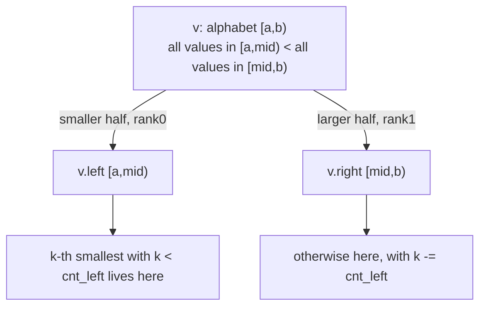

# Wavelet Tree — Middle Level

> **Read time: ~55 minutes** · **Audience:** Engineers who already understand the alphabet split, bitvectors, `access`, `rank_c`, and `quantile` from `junior.md`, and now want the full query suite (`select`, range count `[lo, hi]`, range distinct, "how many ≤ x") plus a rigorous comparison against the **merge sort tree** and the **persistent segment tree**.

At the junior level we learned the wavelet tree's spine: split the alphabet, store a bitvector per node, and descend remapping positions through `rank`. At the middle level we ask *why* it works, *when* to reach for it over its two great rivals — the **merge sort tree** and the **persistent segment tree** — and we fill out the rest of the query family that makes it indispensable for range analytics.

---

## Table of Contents

1. [Introduction — Why and When](#introduction)
2. [Deeper Concepts — Stable Partition as the Invariant](#deeper-concepts)
3. [select_c(j) — The Bottom-Up Walk](#select)
4. [Range Count `[lo, hi]` and "How Many ≤ x"](#range-count)
5. [Range Distinct, Mode-Adjacent, and Top-k Sketches](#more-queries)
6. [Comparison with Alternatives — Merge Sort Tree, Persistent Segment Tree](#comparison)
7. [Advanced Patterns — Carrying Ranges, Coordinate Compression](#patterns)
8. [Code Examples — select, range count, "k-th + count"](#code-examples)
9. [Error Handling](#errors)
10. [Performance Analysis](#performance)
11. [Best Practices](#best-practices)
12. [Visual Animation](#animation)
13. [Summary](#summary)

---

<a name="introduction"></a>
## 1. Introduction — Why and When

The wavelet tree earns its place when **three conditions** hold at once:

1. The sequence is **static** (or rebuilt rarely) and **queried heavily**.
2. The **alphabet is small or compressible** (σ ≪ n after coordinate compression), so `log σ < log n`.
3. You need a **mix** of order-statistics and counting queries — range k-th, range count, rank/select — not just one of them.

If you only need one query (say, range k-th, offline), a merge sort tree is simpler. If you need **historical versions** (range k-th *as of* an earlier prefix), a persistent segment tree is the natural fit. The wavelet tree's superpower is that **one structure** in `n log σ` bits answers the *entire family* online. That is why it sits at the heart of compressed text indexes, where the same structure must support pattern search (`rank`), extraction (`access`), and analytics (`quantile`, `range count`) simultaneously.

---

<a name="deeper-concepts"></a>
## 2. Deeper Concepts — Stable Partition as the Invariant

### 2.1 The structural invariant

The wavelet tree maintains one invariant at every node `v` with alphabet `[a, b)`:

> **Invariant.** The sequence stored (conceptually) at `v` is exactly the subsequence of `S` consisting of all elements whose value lies in `[a, b)`, **in their original relative order**.

The bitvector `B_v` partitions this subsequence by the midpoint `mid = (a+b)/2`, and — critically — the partition is **stable**: elements that go left keep their order, elements that go right keep theirs. Stability is what makes `rank` a valid index map:

> **Mapping lemma.** If element at position `i` in node `v` has bit `0`, its position in `v.left` is `rank0(B_v, i)`. If bit `1`, its position in `v.right` is `rank1(B_v, i)`.

Both follow because "how many elements before `i` also went left" is precisely `rank0(B_v, i)` (counting `0`-bits in the prefix), and a stable partition preserves their relative order. This lemma is used by **every** query; it is the wavelet tree's engine.

### 2.2 The order property

A second property powers the order-statistics queries:

> **Order property.** For any node, **every** value in its left subtree is strictly smaller than **every** value in its right subtree (lower alphabet half vs upper half).

This is what lets `quantile` decide "the k-th smallest is in the left half iff `k < cnt_left`": the left half contains exactly the smallest values of the range. It also powers **range count** (next section): "values `< x`" are exactly those that, level by level, would route into the appropriate sub-alphabets.



---

<a name="select"></a>
## 3. select_c(j) — The Bottom-Up Walk

`select_c(j)` returns the **position** of the `j`-th occurrence (1-indexed) of symbol `c` in `S`. It is the inverse of `rank_c`. Whereas `rank` and `access` walk **top-down**, `select` walks **bottom-up**: it first descends to the leaf of `c` to *locate* the occurrence, then climbs back up, using `select` on each bitvector to map a child position back into its parent.

The parent map is the inverse of the child map:

- If a position `p` in `v.left` corresponds to the `(p+1)`-th `0`-bit of `B_v`, then its parent position is `select0(B_v, p+1)`.
- Symmetrically for `v.right` and `select1`.

### Bottom-up algorithm

```
select_c(j):              # j is 1-indexed
    # Step 1: descend to the leaf of c, recording the path (left/right per level)
    path = []
    nd = root
    while nd is internal:
        mid = (nd.a + nd.b) / 2
        if c < mid: path.push((nd, LEFT));  nd = nd.left
        else:       path.push((nd, RIGHT)); nd = nd.right
    # at the leaf, the j-th occurrence is simply position (j-1)
    p = j - 1
    # Step 2: climb back up, mapping child position p to parent position
    for (nd, dir) in reverse(path):
        if dir == LEFT:  p = select0(B_nd, p + 1)   # (p+1)-th 0-bit, 0-indexed result
        else:            p = select1(B_nd, p + 1)   # (p+1)-th 1-bit
    return p
```

`select0(B, k)` = index of the `k`-th `0`-bit; `select1(B, k)` = index of the `k`-th `1`-bit. With a plain prefix array you can binary-search for these in `O(log n)`, giving `select` in `O(log σ · log n)`; with a true succinct `select` structure it is `O(log σ)`. At the middle level, the binary-search version is fine and easy to reason about.

> **Mnemonic.** `rank` goes **down** (map a prefix into a child). `select` goes **up** (map an occurrence index back into the parent). Together they make the wavelet tree fully invertible.

---

<a name="range-count"></a>
## 4. Range Count `[lo, hi]` and "How Many ≤ x"

**Range count** answers: *how many elements of `S[l..r)` have value in `[lo, hi]`?* This is the workhorse of range analytics ("how many requests between 50 ms and 100 ms in this window?").

The idea: recurse the tree, and whenever a node's alphabet `[a, b)` is **fully inside** `[lo, hi]`, the count of range elements landing in that node — namely `r − l` after remapping — contributes entirely. When the node's alphabet is **disjoint** from `[lo, hi]`, contribute 0. When **partial**, recurse into both children with the remapped ranges.

```
rangeCount(nd, l, r, lo, hi):
    if l >= r: return 0
    a, b = nd.a, nd.b
    if hi < a or b <= lo: return 0           # disjoint
    if lo <= a and b - 1 <= hi: return r - l # fully inside
    mid = (a + b) / 2
    l0, r0 = rank0(B_nd, l), rank0(B_nd, r)  # range in left child
    l1, r1 = l - l0, r - r0                  # range in right child (rank1)
    return rangeCount(nd.left,  l0, r0, lo, hi)
         + rangeCount(nd.right, l1, r1, lo, hi)
```

This visits `O(log σ)` nodes (it is the same "trichotomy" as a segment tree, but on the alphabet axis), so it is **O(log σ)**. As special cases:

- **count ≤ x** in `S[l..r)`: `rangeCount(l, r, 0, x)`.
- **count == c** in `S[l..r)`: `rangeCount(l, r, c, c)` — or directly `rank_c(r) − rank_c(l)`.
- **count in `(lo, hi)`**: adjust the inclusive bounds.

A cleaner, often-used variant computes **"number of elements `< x` in `S[l..r)`"** with a single descent (no branching), accumulating left-subtree counts whenever `x` routes right:

```
countLess(l, r, x):        # elements in S[l..r) strictly less than x
    nd, a, b = root, 0, sigma
    cnt = 0
    while nd is internal and l < r:
        mid = (a + b) / 2
        l0, r0 = rank0(B_nd, l), rank0(B_nd, r)
        if x <= mid:                 # x routes left: ignore right subtree entirely
            l, r, b, nd = l0, r0, mid, nd.left
        else:                        # x routes right: ALL left elements are < x
            cnt += r0 - l0
            l, r, a, nd = l - l0, r - r0, mid, nd.right
    return cnt
```

This single-path version is `O(log σ)` with the smallest constant and is the one you will most often ship. Range count `[lo, hi]` is then `countLess(l, r, hi+1) − countLess(l, r, lo)`.

---

<a name="more-queries"></a>
## 5. Range Distinct, Mode-Adjacent, and Top-k Sketches

The wavelet tree composes into several richer analytics:

- **Range k-th largest:** symmetric to k-th smallest — replace `cnt_left` with `cnt_right` and flip the comparison, or call `quantile(l, r, (r−l)−1−k)`.
- **Range median:** `quantile(l, r, (r−l)/2)`.
- **Range "value at percentile p":** `quantile(l, r, floor(p·(r−l)))`.
- **Count of a value in a range:** `rank_c(r) − rank_c(l)` in `O(log σ)`.
- **Range count `[lo, hi]`** and **count `< x`** as above.
- **Top frequent in a range (approximate):** repeatedly split alphabet, descending into the denser half, to find heavy hitters; exact mode needs more (the *range mode* problem is harder and usually solved with offline / sqrt techniques — see `19-... ` topics).
- **2D dominance / point counting:** map points `(x, y)` so `x` is position and `y` is the symbol; `rangeCount` then counts points in an axis-aligned rectangle in `O(log σ)`. This is the classic "wavelet tree as a 2D grid" use.

These all reuse the **same bitvectors** — no extra structure — which is exactly why the wavelet tree is favored when many query *types* must coexist.

---

<a name="comparison"></a>
## 6. Comparison with Alternatives — Merge Sort Tree, Persistent Segment Tree

The three structures all answer **range k-th smallest** and **range count**, but with different trade-offs.

### 6.1 The contenders in one sentence each

- **Merge sort tree (MST):** a segment tree over positions where each node stores its segment's elements **sorted**. Range count `< x` = sum of `upper_bound` over `O(log n)` nodes → `O(log² n)`. Range k-th needs binary search on the answer → `O(log³ n)` or parallel-binary-search/offline tricks.
- **Persistent segment tree (PST):** build `n` versions of a value-indexed count segment tree, version `i` = "counts of values in `S[0..i)`". Range k-th in `S[l..r)` walks versions `r` minus `l` simultaneously → `O(log σ)` per query, with persistence giving "as-of-prefix" history for free. (See `../11-persistent-segment-tree/`.)
- **Wavelet tree (WT):** alphabet-split; range k-th, range count, rank/select all `O(log σ)`, online, in `n log σ` bits.

### 6.2 Head-to-head table

| Attribute | Wavelet Tree | Merge Sort Tree | Persistent Segment Tree |
|---|---|---|---|
| Range k-th smallest | **O(log σ)** | O(log³ n) naive / O(log² n) w/ tricks | **O(log σ)** |
| Range count `[lo,hi]` / `< x` | **O(log σ)** | O(log² n) | O(log σ) |
| rank_c / select_c | **O(log σ)** | not native | not native |
| access(i) | O(log σ) | O(1) | O(1) (keep original array) |
| Space | **n·log₂σ bits** (+o()) | **O(n log n) ints** | **O(n log σ) nodes** (pointers) |
| Build time | O(n log σ) | O(n log n) | O(n log σ) |
| Persistence / history | No (static) | No | **Yes** (as-of-prefix) |
| Online queries | **Yes** | Range k-th often offline | **Yes** |
| Cache locality | Medium (tree) / **good (matrix)** | Good | Poor (pointer-chasing) |
| Code complexity | Medium | **Low** | Medium-high |
| Best at | many query types, small σ, succinct | one-off range count, easy to write | versioned/as-of queries, large σ |

### 6.3 Decision guidance

- **Choose the wavelet tree** when σ is small or compressible, the data is static, and you need a **variety** of queries (rank/select/quantile/range-count) from one compact structure — e.g., text indexes, genomics, analytics snapshots.
- **Choose the merge sort tree** when you need only range count / range k-th, the queries can be offline or `log² n` is acceptable, and you want the **least code**.
- **Choose the persistent segment tree** (`../11-persistent-segment-tree/`) when you need **historical / as-of-prefix** queries, or σ is large (≈ n distinct values) so the alphabet advantage of the wavelet tree disappears. PST's `O(log σ)` here is `O(log n)` and it gives you versioning the wavelet tree cannot.

> **Key intuition.** WT and PST both achieve `O(log σ)` range k-th, but for *different reasons*: PST splits **values** across **time versions**; WT splits **values** across **tree levels**, throwing away the per-version overhead and keeping only bits. The WT is more space-efficient and supports rank/select; the PST adds persistence.

### 6.4 Worked size comparison (n = 10⁶, σ = 256)

| Structure | Memory estimate |
|---|---|
| Wavelet tree (bit-packed) | ≈ `10⁶ × 8` bits = **1 MB** + ~6% rank overhead |
| Merge sort tree | `10⁶ × log₂10⁶` ints ≈ `2×10⁷` × 4 B = **80 MB** |
| Persistent segment tree | ≈ `10⁶ × log₂256` nodes × ~16 B = **~32 MB** |

The wavelet tree is roughly **30–80× smaller** here — the whole reason it underlies compressed indexes.

---

<a name="patterns"></a>
## 7. Advanced Patterns — Carrying Ranges, Coordinate Compression

### 7.1 Carry a range, not a point

The order-statistics queries (`quantile`, `rangeCount`) carry a **half-open range `[l, r)`** down the tree and remap **both endpoints** through `rank0`/`rank1` each level. Because `rank` is monotone, `[l0, r0) = [rank0(l), rank0(r))` is always a valid (possibly empty) range in the child. This "carry the range" pattern is the analytic core; memorize the two-line remap.

### 7.2 Coordinate compression as a precondition

If raw values are large or sparse, sort the distinct values, assign each an index in `[0, m)`, and build over the compressed sequence with σ = m. Keep the sorted array `vals[]` to translate any answer (a compressed symbol) back to the real value `vals[symbol]`. This guarantees `log σ = log(#distinct) ≤ log n` height with no wasted empty alphabet ranges.

```
distinct = sorted(set(S))
index = {v: i for i, v in enumerate(distinct)}
compressed = [index[x] for x in S]
WT over (compressed, sigma = len(distinct))
# answer symbol s -> real value distinct[s]
```

### 7.3 Range k-th + its frequency in one pass

A common extension: return both the k-th smallest value **and** how many times it occurs in `[l, r)`. Run `quantile` to find the value `vv`; the carried range at the leaf has width `r − l`, which is exactly the count of `vv` in `[l, r)`. So you get the count for free at no extra cost.

---

<a name="code-examples"></a>
## 8. Code Examples — select, range count, "k-th + count"

These build on the `WaveletTree` of `junior.md` (per-node `prefix` array for O(1) `rank`). We add `select`, `countLess`, `rangeCount`, and a combined `quantileWithCount`. For `select` we binary-search the prefix array (`O(log σ · log n)` total at this level).

### Go
```go
package wavelet

// select0 returns the index of the (k)-th 0-bit (1-indexed k) in this node, or n if absent.
func (nd *node) select0(k int) int {
	// find smallest p in [0, n] with rank0(p) == k and bit at p-1 is 0
	lo, hi := 0, len(nd.prefix)-1 // n
	for lo < hi {
		mid := (lo + hi) / 2
		if nd.rank0(mid) >= k {
			hi = mid
		} else {
			lo = mid + 1
		}
	}
	return lo - 1 // position of that 0-bit
}

func (nd *node) select1(k int) int {
	lo, hi := 0, len(nd.prefix)-1
	for lo < hi {
		mid := (lo + hi) / 2
		if nd.rank1(mid) >= k {
			hi = mid
		} else {
			lo = mid + 1
		}
	}
	return lo - 1
}

// SelectC returns the position of the j-th (1-indexed) occurrence of c, or -1 if fewer than j.
func (t *Tree) SelectC(c, j int) int {
	// descend to record the path of c
	type step struct {
		nd  *node
		dir int // 0 left, 1 right
	}
	var path []step
	nd := t.root
	for nd != nil {
		mid := (nd.a + nd.b) / 2
		if c < mid {
			path = append(path, step{nd, 0})
			nd = nd.left
		} else {
			path = append(path, step{nd, 1})
			nd = nd.right
		}
	}
	p := j - 1
	for k := len(path) - 1; k >= 0; k-- {
		s := path[k]
		if s.dir == 0 {
			p = s.nd.select0(p + 1)
		} else {
			p = s.nd.select1(p + 1)
		}
	}
	return p
}

// CountLess returns the number of elements in S[l..r) strictly less than x.
func (t *Tree) CountLess(l, r, x int) int {
	nd := t.root
	a, b := 0, t.sigma
	cnt := 0
	for nd != nil && l < r {
		mid := (a + b) / 2
		l0, r0 := nd.rank0(l), nd.rank0(r)
		if x <= mid {
			l, r, b, nd = l0, r0, mid, nd.left
		} else {
			cnt += r0 - l0
			l, r, a, nd = l-l0, r-r0, mid, nd.right
		}
	}
	return cnt
}

// RangeCount returns #elements in S[l..r) with value in [lo, hi].
func (t *Tree) RangeCount(l, r, lo, hi int) int {
	return t.CountLess(l, r, hi+1) - t.CountLess(l, r, lo)
}

// QuantileWithCount returns the k-th smallest value in S[l..r) and its frequency there.
func (t *Tree) QuantileWithCount(l, r, k int) (val, freq int) {
	nd := t.root
	a := 0
	for nd != nil {
		cntLeft := nd.rank0(r) - nd.rank0(l)
		if k < cntLeft {
			l, r = nd.rank0(l), nd.rank0(r)
			if nd.left == nil {
				return nd.a, r - l
			}
			nd = nd.left
		} else {
			k -= cntLeft
			l, r = nd.rank1(l), nd.rank1(r)
			a = (nd.a + nd.b) / 2
			if nd.right == nil {
				return a, r - l
			}
			nd = nd.right
		}
	}
	return a, r - l
}
```

### Java
```java
public final class WaveletTreeMid extends WaveletTreeBase {
    // assumes Node with rank0/rank1 and prefix[] of length n+1 (as in junior.md)

    private int select0(Node nd, int k) {        // index of k-th 0-bit (1-indexed)
        int lo = 0, hi = nd.prefix.length - 1;   // n
        while (lo < hi) {
            int mid = (lo + hi) >>> 1;
            if (nd.rank0(mid) >= k) hi = mid; else lo = mid + 1;
        }
        return lo - 1;
    }

    private int select1(Node nd, int k) {
        int lo = 0, hi = nd.prefix.length - 1;
        while (lo < hi) {
            int mid = (lo + hi) >>> 1;
            if (nd.rank1(mid) >= k) hi = mid; else lo = mid + 1;
        }
        return lo - 1;
    }

    /** Position of the j-th (1-indexed) occurrence of c, or -1. */
    public int selectC(int c, int j) {
        java.util.ArrayDeque<int[]> path = new java.util.ArrayDeque<>(); // {nodeId/dir}
        java.util.List<Node> nodes = new java.util.ArrayList<>();
        java.util.List<Integer> dirs = new java.util.ArrayList<>();
        Node nd = root;
        while (nd != null) {
            int mid = (nd.a + nd.b) >>> 1;
            if (c < mid) { nodes.add(nd); dirs.add(0); nd = nd.left; }
            else         { nodes.add(nd); dirs.add(1); nd = nd.right; }
        }
        int p = j - 1;
        for (int kk = nodes.size() - 1; kk >= 0; kk--) {
            Node cur = nodes.get(kk);
            p = (dirs.get(kk) == 0) ? select0(cur, p + 1) : select1(cur, p + 1);
        }
        return p;
    }

    /** #elements in S[l..r) strictly < x. */
    public int countLess(int l, int r, int x) {
        Node nd = root; int a = 0, b = sigma, cnt = 0;
        while (nd != null && l < r) {
            int mid = (a + b) >>> 1;
            int l0 = nd.rank0(l), r0 = nd.rank0(r);
            if (x <= mid) { l = l0; r = r0; b = mid; nd = nd.left; }
            else { cnt += r0 - l0; l -= l0; r -= r0; a = mid; nd = nd.right; }
        }
        return cnt;
    }

    /** #elements in S[l..r) with value in [lo, hi]. */
    public int rangeCount(int l, int r, int lo, int hi) {
        return countLess(l, r, hi + 1) - countLess(l, r, lo);
    }
}
```

### Python
```python
import bisect


class WaveletTreeMid:
    """Adds select, countLess, rangeCount, quantile+count to the junior WaveletTree."""

    def __init__(self, base):
        self.root = base.root
        self.sigma = base.sigma
        self.n = base.n

    @staticmethod
    def _select_bit(nd, k, want_one):
        # smallest p in [0, n] with rank{0/1}(p) == k; returns p-1 (the bit position)
        lo, hi = 0, len(nd.prefix) - 1
        rankf = nd.rank1 if want_one else nd.rank0
        while lo < hi:
            mid = (lo + hi) // 2
            if rankf(mid) >= k:
                hi = mid
            else:
                lo = mid + 1
        return lo - 1

    def select_c(self, c, j):
        """Position of the j-th (1-indexed) occurrence of c, or -1."""
        path = []
        nd = self.root
        while nd is not None:
            mid = (nd.a + nd.b) // 2
            if c < mid:
                path.append((nd, 0)); nd = nd.left
            else:
                path.append((nd, 1)); nd = nd.right
        p = j - 1
        for nd, d in reversed(path):
            p = self._select_bit(nd, p + 1, want_one=(d == 1))
        return p

    def count_less(self, l, r, x):
        """#elements in S[l..r) strictly < x."""
        nd, a, b, cnt = self.root, 0, self.sigma, 0
        while nd is not None and l < r:
            mid = (a + b) // 2
            l0, r0 = nd.rank0(l), nd.rank0(r)
            if x <= mid:
                l, r, b, nd = l0, r0, mid, nd.left
            else:
                cnt += r0 - l0
                l, r, a, nd = l - l0, r - r0, mid, nd.right
        return cnt

    def range_count(self, l, r, lo, hi):
        """#elements in S[l..r) with value in [lo, hi]."""
        return self.count_less(l, r, hi + 1) - self.count_less(l, r, lo)

    def quantile_with_count(self, l, r, k):
        """k-th smallest in S[l..r) and its frequency there."""
        nd, a = self.root, 0
        while nd is not None:
            cnt_left = nd.rank0(r) - nd.rank0(l)
            if k < cnt_left:
                l, r = nd.rank0(l), nd.rank0(r)
                if nd.left is None:
                    return nd.a, r - l
                nd = nd.left
            else:
                k -= cnt_left
                l, r = nd.rank1(l), nd.rank1(r)
                a = (nd.a + nd.b) // 2
                if nd.right is None:
                    return a, r - l
                nd = nd.right
        return a, r - l
```

---

<a name="errors"></a>
## 9. Error Handling

| Scenario | What goes wrong | Correct approach |
|---|---|---|
| `select_c(j)` with `j` > total count of `c` | Walks past the last occurrence, returns garbage or `n` | Check `j <= rank_c(n)` first; return -1 otherwise. |
| `rangeCount` with `lo > hi` | Negative or nonsense count | Reject; require `lo <= hi`. |
| `countLess` with `x <= 0` | Returns 0 (correct) but caller may misuse | Document `x` is exclusive upper bound. |
| Mixing inclusive/half-open | Off-by-one in every query | Standardize on half-open `[l, r)`; `rangeCount` bounds inclusive `[lo, hi]`. |
| `select` slow on large n | Binary search per level = `O(log σ log n)` | Use a succinct `select` structure (`senior.md`) for `O(log σ)`. |
| Comparing against PST/MST wrongly | Picking WT when σ ≈ n | If almost all values distinct, prefer PST (`log σ ≈ log n`, plus persistence). |

---

<a name="performance"></a>
## 10. Performance Analysis

### 10.1 Query cost by structure (range k-th, n=10⁶, σ=256)

| Structure | Node touches per query | Notes |
|---|---|---|
| Wavelet tree | `log₂256 = 8` rank ops | tightest constant with bit-packed rank |
| Merge sort tree | `~log₂10⁶ × log` ≈ 20 × 20 = 400 ops | `upper_bound` per node, plus answer binary search |
| Persistent segment tree | `8` node steps × 2 versions | pointer-chasing hurts cache |

### 10.2 Microbenchmark harness

#### Go
```go
import (
	"fmt"
	"math/rand"
	"time"
)

func benchmark() {
	for _, n := range []int{1000, 10000, 100000, 1000000} {
		sigma := 256
		S := make([]int, n)
		for i := range S {
			S[i] = rand.Intn(sigma)
		}
		t := New(S, sigma)
		start := time.Now()
		const Q = 100000
		acc := 0
		for q := 0; q < Q; q++ {
			l := rand.Intn(n)
			r := l + 1 + rand.Intn(n-l)
			k := rand.Intn(r - l)
			acc += t.Quantile(l, r, k)
		}
		el := time.Since(start)
		fmt.Printf("n=%8d: %.1f ns/quantile (sink=%d)\n", n, float64(el.Nanoseconds())/Q, acc)
	}
}
```

#### Java
```java
import java.util.Random;

static void benchmark() {
    Random rng = new Random(1);
    for (int n : new int[]{1000, 10000, 100000, 1000000}) {
        int sigma = 256;
        int[] s = new int[n];
        for (int i = 0; i < n; i++) s[i] = rng.nextInt(sigma);
        WaveletTree t = new WaveletTree(s, sigma);
        long start = System.nanoTime();
        final int Q = 100000; long acc = 0;
        for (int q = 0; q < Q; q++) {
            int l = rng.nextInt(n);
            int r = l + 1 + rng.nextInt(n - l);
            int k = rng.nextInt(r - l);
            acc += t.quantile(l, r, k);
        }
        long el = System.nanoTime() - start;
        System.out.printf("n=%8d: %.1f ns/quantile (sink=%d)%n", n, el / 100000.0, acc);
    }
}
```

#### Python
```python
import random
import time


def benchmark(WaveletTree):
    for n in (1000, 10000, 100000):
        sigma = 256
        s = [random.randrange(sigma) for _ in range(n)]
        t = WaveletTree(s, sigma)
        Q, acc = 20000, 0
        start = time.perf_counter()
        for _ in range(Q):
            l = random.randrange(n)
            r = l + 1 + random.randrange(n - l)
            k = random.randrange(r - l)
            acc += t.quantile(l, r, k)
        el = time.perf_counter() - start
        print(f"n={n:>8}: {el / Q * 1e9:.0f} ns/quantile (sink={acc})")
```

### 10.3 What to expect

Quantile time is **flat in n** (depends on `log σ`), which the benchmark confirms: rows for `n=1000` and `n=10⁶` show nearly the same ns/query. The merge-sort tree, by contrast, grows with `log² n`. This flatness is the wavelet tree's signature.

---

<a name="best-practices"></a>
## 11. Best Practices

- **Standardize on half-open `[l, r)`** for ranges and inclusive `[lo, hi]` for value bounds; convert at the API edge.
- **Use `countLess` as your primitive**; build `rangeCount`, "count == c", and percentile queries on top of it.
- **Get `quantile`'s frequency for free** by reading the carried range width at the leaf.
- **Coordinate-compress** unless σ is already small and dense; store the inverse map.
- **Bound `select` cost**: if you call `select` heavily, invest in a succinct `select` structure (`senior.md`) instead of binary search.
- **Benchmark flatness**: verify quantile time is ~constant in n — if it grows, you accidentally built something position-bound.
- **Pick the right rival**: WT for many query types + small σ; MST for one-off simple range count; PST for persistence / huge σ.

---

<a name="animation"></a>
## 12. Visual Animation

> See [`animation.html`](./animation.html) for the interactive visualization.
>
> Middle-level usage:
> - Run **rank_c** and **select_c** and watch the top-down vs bottom-up walks.
> - Run **range count `[lo, hi]`** and see which nodes are fully-inside (counted whole) vs partial (recursed).
> - Toggle a side-by-side **"vs merge sort tree"** annotation that shows how many nodes each structure would touch for the same range-k-th query.
> - The log records each `rank0/rank1` remap so you can replay the carried-range arithmetic.

---

<a name="summary"></a>
## 13. Summary

- The wavelet tree's correctness rests on two invariants: the **stable-partition mapping lemma** (rank is a valid child index map) and the **order property** (left subtree values < right subtree values).
- `select_c` is the **bottom-up** inverse of `rank_c`: descend to the leaf, then climb using `select0`/`select1` per level.
- **Range count `[lo, hi]`** and **count `< x`** reduce to a single `O(log σ)` `countLess` descent that accumulates whole left-subtree counts whenever the threshold routes right.
- Against the **merge sort tree**, the wavelet tree wins on space and on online `O(log σ)` range-k-th; against the **persistent segment tree** (`../11-persistent-segment-tree/`), it wins on space and rank/select but **lacks persistence** and loses its edge when σ ≈ n.
- Reach for the wavelet tree when the data is **static**, the **alphabet is small/compressible**, and you need **many query types** from one succinct structure.

**Next step:** [senior.md](./senior.md) — succinct rank/select bitvectors, the wavelet matrix, FM-index / text-indexing systems, and memory engineering.
