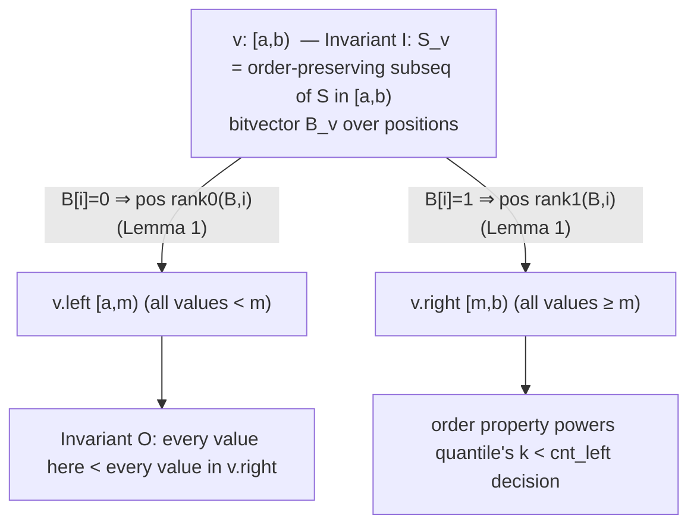

# Wavelet Tree — Mathematical Foundations and Complexity Theory

> **Read time: ~55 minutes** · **Audience:** Engineers and researchers who want the *proofs*: that every wavelet-tree query is O(log σ), that the structure occupies n⌈log₂σ⌉ + o(n log σ) bits, why constant-time rank/select with o(n) overhead is achievable (and what the lower bounds are), and a rigorous complexity comparison against the merge sort tree and persistent segment tree.

This document is formal. We define the wavelet tree as a recursive object, state and prove its invariants, prove the O(log σ) bound for `access`, `rank`, `select`, `quantile`, and `rangeCount`, derive the succinct space bound (including the entropy-compressed variant), and survey the rank/select theory that makes succinctness possible. We close with a precise comparison table and the information-theoretic context.

---

## Table of Contents

1. [Formal Definition](#formal-definition)
2. [Structural Invariants and the Mapping Lemma](#invariants)
3. [Correctness and O(log σ) Proof — access and rank](#proof-access-rank)
4. [Correctness and O(log σ) Proof — quantile and rangeCount](#proof-quantile)
5. [select — Correctness and Complexity](#proof-select)
6. [Succinct Space — n log σ + o(n log σ) Bits](#space)
7. [Entropy-Compressed Wavelet Trees (Huffman / nH₀)](#entropy)
8. [Rank/Select Theory and Lower Bounds](#rank-select-theory)
8b. [Build Cost, Node-Visit Constants, and the Tree-Recursive rangeCount Bound](#extra-bounds)
9. [Fully Worked Proof Trace — quantile on a Concrete Instance](#worked-trace)
10. [Dynamic Wavelet Trees — Update Complexity](#dynamic)
11. [Higher-Order Entropy and the BWT Connection](#bwt-entropy)
12. [The Wavelet Matrix — Formal Equivalence](#matrix-equivalence)
13. [Complexity Comparison with Alternatives](#comparison)
14. [Summary](#summary)

---

<a name="formal-definition"></a>
## 1. Formal Definition

Let `S = S[0] S[1] ... S[n−1]` be a sequence over the integer alphabet `Σ = [0, σ)`. Assume σ is a power of two; if not, pad the alphabet to `2^⌈log₂σ⌉` (empty alphabet ranges add no elements). Let `h = log₂ σ` be the number of levels.

**Definition (wavelet tree).** The wavelet tree `WT(S, [a, b))` over an alphabet range `[a, b) ⊆ [0, σ)` is defined recursively:

- If `b − a = 1`, `WT` is a **leaf** representing the single symbol `a`; it stores nothing.
- Otherwise let `m = ⌊(a + b)/2⌋`. Define the **bitvector** `B ∈ {0,1}^{|S|}` by
  ```
  B[i] = 0  if S[i] ∈ [a, m),    B[i] = 1  if S[i] ∈ [m, b).
  ```
  Define the **left subsequence** `S₀` = the subsequence of `S` of elements with value in `[a, m)` (in original order), and the **right subsequence** `S₁` = the subsequence with value in `[m, b)` (in original order). The node stores `B` (augmented with rank/select), and has children `WT(S₀, [a, m))` and `WT(S₁, [m, b))`.

The wavelet tree of `S` is `WT(S, [0, σ))`. Its root sees all of `S`; each leaf corresponds to exactly one symbol.

**Rank/select primitives.** For a bitvector `B` of length `t`:
- `rank₁(B, i) = |{ j : 0 ≤ j < i, B[j] = 1 }|`, `rank₀(B, i) = i − rank₁(B, i)`, for `0 ≤ i ≤ t`.
- `select₁(B, k) = ` the index of the `k`-th `1`-bit (1-indexed); `select₀` analogously.

We assume `rank` in `O(1)` and `select` in `O(1)` (or `O(log)` where noted) on each bitvector — justified in §8.

---

<a name="invariants"></a>
## 2. Structural Invariants and the Mapping Lemma

**Invariant I (subsequence).** For every node `v` with alphabet range `[a, b)`, the conceptual sequence `S_v` at `v` equals the subsequence of `S` consisting of all `S[i] ∈ [a, b)`, in original relative order.

*Proof.* By induction on the construction. The root has `[0, σ)`, so `S_root = S`. If `I` holds at `v`, then `S₀` (resp. `S₁`) is, by definition, the order-preserving subsequence of `S_v` with values in `[a, m)` (resp. `[m, b)`); composing two order-preserving subsequence operations yields the order-preserving subsequence of `S` with values in `[a, m)` (resp. `[m, b)`). So `I` holds at both children. ∎

**Invariant O (order).** For every internal node `v`, every value in `S₀` is `< m ≤` every value in `S₁`. Immediate from the split at `m`.

The two invariants together give the structure its dual reading — a value-bisection tree (like a balanced BST over `[0,σ)`) whose every node carries a position-indexed bitvector:



**Lemma 1 (Mapping Lemma).** Let `v` be internal with bitvector `B`. Consider the element at position `i` of `S_v` (`0 ≤ i < |S_v|`).
- If `B[i] = 0`, this element is at position `rank₀(B, i)` of `S₀`.
- If `B[i] = 1`, it is at position `rank₁(B, i)` of `S₁`.

*Proof.* The left subsequence `S₀` collects exactly the elements with `B[·] = 0`, in order. The number of such elements strictly before index `i` is `rank₀(B, i)` by definition. Because the collection is order-preserving, the element at `i` occupies position `rank₀(B, i)` in `S₀`. The `B[i] = 1` case is symmetric. ∎

Lemma 1 is the workhorse: it lets every query replace "recurse into the child sequence" with an O(1) index remap, without ever materializing `S_v`.

**Corollary 1 (Prefix Mapping).** For any prefix length `i` (`0 ≤ i ≤ |S_v|`), the number of the first `i` elements of `S_v` that land in `S₀` is `rank₀(B, i)`, and in `S₁` is `rank₁(B, i)`. Hence a prefix `[0, i)` of `S_v` maps to prefixes `[0, rank₀(B,i))` of `S₀` and `[0, rank₁(B,i))` of `S₁`. (Apply Lemma 1's counting to all `j < i`.)

---

<a name="proof-access-rank"></a>
## 3. Correctness and O(log σ) Proof — access and rank

### 3.1 access

**Claim.** `access(i)` returns `S[i]` in `O(h) = O(log σ)` time.

```
access(i): v ← root; a, b ← 0, σ
  while v is internal:
      if B_v[i] = 0: i ← rank₀(B_v, i); (v, b) ← (v.left,  ⌊(a+b)/2⌋)
      else:          i ← rank₁(B_v, i); (v, a) ← (v.right, ⌊(a+b)/2⌋)
  return a
```

**Loop invariant J.** At the start of each iteration, `i` is the position in `S_v` of the *same* original element we started tracking, and `S[i_start] ∈ [a, b)`.

*Base case.* Initially `v = root`, `[a,b) = [0,σ)`, `i = i_start`, and `S_root = S` (Invariant I), so position `i` in `S_root` is `S[i_start]`; trivially `S[i_start] ∈ [0, σ)`.

*Inductive step.* Suppose `J` holds. By Lemma 1, after the remap `i` is the position of the same element in the chosen child's sequence `S_{child}`, and by Invariant O the element's value lies in the child's alphabet range (the updated `[a,b)`). So `J` holds next iteration.

*Termination.* `b − a` halves each iteration; after `h` iterations `b − a = 1`, the loop exits. Each iteration does O(1) work (one rank, O(1) bookkeeping). Hence `O(h) = O(log σ)`.

*Postcondition.* At exit `[a, b) = [a, a+1)`, and by `J` the tracked element's value lies in `[a, a+1)`, i.e. equals `a`. Since the tracked element is `S[i_start]`, `access` returns `S[i_start]`. ∎

### 3.2 rank_c

**Claim.** `rank_c(i)` = `|{ j : 0 ≤ j < i, S[j] = c }|` in `O(log σ)`.

```
rank_c(i): v ← root; a, b ← 0, σ
  while v is internal:
      m ← ⌊(a+b)/2⌋
      if c < m: i ← rank₀(B_v, i); (v, b) ← (v.left,  m)
      else:     i ← rank₁(B_v, i); (v, a) ← (v.right, m)
  return i
```

**Loop invariant K.** At the start of each iteration, `i` equals the number of elements among the first-`i₀` of `S` that (a) have value in `[a, b)` *and* (b) follow the same root-to-`v` path as `c` does. Equivalently, `i` is the length of the image in `S_v` of the original prefix `[0, i₀)` restricted to elements routed like `c`.

*Base case.* `v = root`, `[a,b) = [0,σ)`, `i = i₀`: every element is in `[0,σ)` and the path is empty, so `i = i₀` counts all of `[0, i₀)`. Holds.

*Inductive step.* `c` routes left iff `c < m`. By Corollary 1, the prefix `[0, i)` of `S_v` maps to prefix `[0, rank₀(B_v, i))` of `S₀` (the left child) — exactly the elements of the current prefix that also have value `< m`, i.e. that route as `c` does at this node. The symmetric statement holds for the right. So after the remap, `K` holds with the narrowed `[a,b)`.

*Termination.* `b − a` halves; `h` iterations; O(1) each → `O(log σ)`.

*Postcondition.* At the leaf, `[a,b) = [c, c+1)`, so the elements counted are exactly those of `S[0..i₀)` with value `c`; `i` is their count. Thus `rank_c(i₀)` is correct. ∎

---

<a name="proof-quantile"></a>
## 4. Correctness and O(log σ) Proof — quantile and rangeCount

### 4.1 quantile (range k-th smallest)

**Claim.** `quantile(l, r, k)` returns the `k`-th smallest value (0-indexed) of the multiset `{ S[j] : l ≤ j < r }`, for `0 ≤ k < r − l`, in `O(log σ)`.

```
quantile(l, r, k): v ← root; a, b ← 0, σ
  while v is internal:
      l₀ ← rank₀(B_v, l); r₀ ← rank₀(B_v, r); cL ← r₀ − l₀
      if k < cL: (l, r) ← (l₀, r₀); (v, b) ← (v.left, ⌊(a+b)/2⌋)
      else:      k ← k − cL; (l, r) ← (l − l₀, r − r₀); (v, a) ← (v.right, ⌊(a+b)/2⌋)
  return a
```

**Loop invariant Q.** At each iteration, `[l, r)` is the image in `S_v` of the original window's elements with value in `[a, b)` (a contiguous range by Corollary 1), and the answer we seek is the `k`-th smallest among `{ value of position p in S_v : l ≤ p < r }`.

*Base case.* `v = root`, `[a,b)=[0,σ)`, `[l,r)` = original window, `k` unchanged. The window's elements all lie in `[0,σ)`; the global k-th smallest is sought. Holds.

*Inductive step.* By Corollary 1, the current window `[l, r)` of `S_v` splits into `[l₀, r₀)` in `S₀` (its left part, all values `< m`) and `[l − l₀, r − r₀)` in `S₁` (right part, all values `≥ m`). There are `cL = r₀ − l₀` elements in the left part; by Invariant O these are exactly the `cL` smallest elements of the window.
- If `k < cL`, the k-th smallest is among them → descend left, keeping `k`, window `[l₀, r₀)`. `Q` holds (smaller alphabet `[a, m)`).
- Else the k-th smallest is among the larger part, and it is the `(k − cL)`-th smallest *there* (we skip the `cL` smaller ones) → descend right with `k ← k − cL`, window `[l − l₀, r − r₀)`. `Q` holds with `[m, b)`.

*Termination.* `b − a` halves; `h` iterations; O(1) each (two ranks) → `O(log σ)`.

*Postcondition.* At the leaf `[a,b) = [a, a+1)`; `Q` says the sought value lies in this singleton range, so it equals `a`. Correctness of "k-th smallest" follows because at every step we provably kept the answer in the retained part and adjusted `k` by exactly the number of skipped-smaller elements. ∎

### 4.2 rangeCount (count of values in `[lo, hi]` within a window)

**Claim.** `countLess(l, r, x)` returns `|{ j : l ≤ j < r, S[j] < x }|` in `O(log σ)`; hence `rangeCount(l, r, lo, hi) = countLess(l,r,hi+1) − countLess(l,r,lo)` in `O(log σ)`.

```
countLess(l, r, x): v ← root; a, b ← 0, σ; cnt ← 0
  while v internal:
      m ← ⌊(a+b)/2⌋; l₀ ← rank₀(B_v,l); r₀ ← rank₀(B_v,r)
      if x ≤ m: (l, r) ← (l₀, r₀); (v, b) ← (v.left, m)              # x routes left
      else:     cnt ← cnt + (r₀ − l₀)                                # all left elements < m ≤ x
                (l, r) ← (l − l₀, r − r₀); (v, a) ← (v.right, m)
  return cnt
```

**Loop invariant C.** `cnt` equals the number of window elements already *certified* `< x` (those in left subtrees we skipped past), and `[l, r)` is the image of the window's not-yet-certified elements whose value lies in `[a, b)`, with the remaining target threshold still `x` relative to `[a, b)`.

*Base case.* `cnt = 0`, `[l,r)` the window, `[a,b)=[0,σ)`. Nothing certified; all elements pending. Holds.

*Inductive step.* The left part holds all current values `< m`.
- If `x ≤ m`: every value `< x` is `< m`, so they all live in the left part — recurse left without certifying yet (the boundary `x` still discriminates inside `[a, m)`). `C` holds.
- If `x > m`: every left-part value is `< m < x`, so **all** `r₀ − l₀` of them are certified `< x` — add to `cnt`. Values `< x` that remain are in the right part — recurse right with threshold `x` inside `[m, b)`. `C` holds.

*Termination & postcondition.* `h` iterations, O(1) each → `O(log σ)`. At the leaf, the singleton value is `< x` or not; the construction has already certified all and only the window elements `< x`, so `cnt` is exact. ∎

`rangeCount` correctness then follows from inclusion–exclusion on the half-open thresholds.

---

<a name="proof-select"></a>
## 5. select — Correctness and Complexity

**Claim.** `select_c(j)` returns the position in `S` of the `j`-th occurrence (1-indexed) of `c`, when it exists, in `O(log σ)` time *if* `select₀`/`select₁` on each bitvector are `O(1)` (else multiply by the select cost).

```
select_c(j):
    descend from root following the bits of c, recording the path (node, dir)
    p ← j − 1                                  # 0-indexed position in c's leaf
    for (v, dir) in reverse(path):
        p ← (dir = LEFT) ? select₀(B_v, p+1) : select₁(B_v, p+1)
    return p
```

**Correctness.** `select` inverts `rank`. Lemma 1 gives the *down* map: position `i` in `S_v` with `B[i]=0` maps to `rank₀(B_v, i)` in `S₀`. Its inverse — the *up* map — sends position `p` in `S₀` to the position in `S_v` of the `(p+1)`-th `0`-bit, i.e. `select₀(B_v, p+1)`; symmetrically for the right child. Composing the up maps along the reversed path lifts the j-th occurrence from `c`'s leaf (where occurrences are positions `0,1,2,…`) back to its absolute index in `S`.

*Formal inverse claim.* For internal `v` and `0 ≤ p < |S₀|`, `rank₀(B_v, select₀(B_v, p+1)) = p` and `B_v[select₀(B_v, p+1)] = 0`. This is the standard rank/select inverse identity; combined with Lemma 1 it proves each up-step is the exact inverse of the corresponding down-step.

**Complexity.** The descent is `h` steps; the ascent is `h` steps; with `O(1)` select per step, total `O(h) = O(log σ)`. With binary-searched select (no select index), each ascent step costs `O(log n)`, giving `O(log σ · log n)`. ∎

---

<a name="space"></a>
## 6. Succinct Space — n log σ + o(n log σ) Bits

**Theorem (space).** A balanced wavelet tree on `S ∈ [0,σ)^n` with constant-time rank/select bitvectors occupies `n⌈log₂σ⌉ + o(n log σ)` bits.

*Proof.* Consider the total length of all bitvectors. At each level `ℓ` (`0 ≤ ℓ < h`), the nodes of that level partition `S` by value into disjoint alphabet sub-ranges, and **every** element of `S` appears in exactly one node's sequence at that level (Invariant I + disjoint ranges). Hence the sum of bitvector lengths at level `ℓ` is exactly `n`. Over `h = ⌈log₂σ⌉` levels the total is `n·⌈log₂σ⌉` bits for the bitvectors themselves.

For rank/select, §8 gives `o(t)` extra bits for a bitvector of length `t`. Summed over all nodes/levels this is `o(n log σ)` bits. Adding the `O(σ log n)`-bit tree topology (pointers / level counts) — which is `o(n log σ)` whenever `σ = o(n^{1−ε} log σ / log n)`, true in all intended regimes — gives the bound. The wavelet **matrix** removes per-node topology entirely, storing `h` length-`n` bitvectors plus `h` integers `z_ℓ`, i.e. `n log σ + h·O(log n)` bits. ∎

**Lower bound context.** Storing an arbitrary sequence over `[0,σ)` requires `⌈log₂(σⁿ)⌉ = n⌈log₂σ⌉` bits in the worst case (counting argument: `σⁿ` distinct sequences). So the dominant `n log σ` term is **optimal**; the `o(n log σ)` overhead is the price of supporting `O(log σ)` queries on top of optimal storage. This is the precise sense in which the wavelet tree is **succinct**.

**Worked space accounting (n = 10⁶, σ = 256).**

| Term | Formula | Bits | Bytes |
|---|---|---|---|
| Bitvectors | `n⌈log₂σ⌉ = 10⁶ × 8` | `8.0 × 10⁶` | 1.0 MB |
| rank9 directory | `≈ 0.25 ×` bitvectors | `2.0 × 10⁶` | 0.25 MB |
| Sampled select | `≈ 0.10 ×` bitvectors | `0.8 × 10⁶` | 0.10 MB |
| Topology (matrix `z[]`) | `8 × ⌈log₂ n⌉` | `≈ 160` | negligible |
| **Total** | `n log σ (1 + ~0.35)` | `≈ 10.8 × 10⁶` | **≈ 1.35 MB** |

Compare the raw array at 32-bit ints: `10⁶ × 32 = 32 × 10⁶` bits = 4 MB — the wavelet structure is *smaller than the uncompressed array* while answering rank/select/quantile/range-count. The `1 + 0.35` factor is the concrete instantiation of the `(1 + o(1))` succinctness claim; the `0.35` shrinks (relative to `n log σ`) as `n` grows because the directories are sub-linear.

**Effect of σ on the dominant term.** Doubling σ adds one level → `+n` bits total (`+1` bit per symbol). The structure grows **linearly in `log σ`**, not in σ — so even σ = 2²⁰ (a million distinct symbols) costs only `20` bits/symbol. This is why coordinate compression (which sets `log σ = log #distinct`) is the single highest-leverage space optimization.

---

<a name="entropy"></a>
## 7. Entropy-Compressed Wavelet Trees (Huffman / nH₀)

The balanced tree spends `log σ` bits per symbol regardless of frequencies. By **shaping** the tree like a Huffman code over symbol frequencies, frequent symbols get shorter root-to-leaf paths, and the total bitvector length becomes the **weighted path length** of the code.

**Theorem (entropy bound).** Let `nₖ` be the number of occurrences of symbol `k`, and let `H₀(S) = Σₖ (nₖ/n) log₂(n/nₖ)` be the zero-order empirical entropy. A Huffman-shaped wavelet tree stores `S` in `n(H₀(S) + 1) + o(n log σ)` bits (the `+1` is Huffman's slack over the entropy), supporting `access`/`rank`/`select` in `O(1 + log σ)` time (average path length `≤ H₀ + 1`).

*Proof sketch.* The sum of bitvector lengths over all levels equals `Σᵢ depth(S[i])` where `depth` is the leaf depth of `S[i]`'s symbol — the standard expression for the total code length of the message under the prefix code defining the tree shape. Choosing the Huffman code minimizes this sum, and Huffman's theorem bounds the per-symbol average by `H₀(S) + 1`. Multiplying by `n` gives `n(H₀+1)`. Rank/select overhead stays `o(n log σ)`. ∎

Further, replacing plain bitvectors with **RRR-compressed** bitvectors (Raman–Raman–Rao) makes each level compress to its own zeroth-order entropy, pushing the whole structure toward `nH₀(S)` and even `nHₖ(S)` (k-th order) when combined with the BWT — the basis of entropy-bound compressed text indexes. The key fact: **the wavelet tree's space tracks the entropy of its input**, which is why FM-indexes over the (low-entropy, run-rich) BWT are so small.

---

<a name="rank-select-theory"></a>
## 8. Rank/Select Theory and Lower Bounds

The succinctness claim rests on the following classical results for a bitvector `B` of length `t`.

**Theorem (Jacobson 1989; Clark 1996).** `B` can be augmented with `o(t)` extra bits to support `rank` in `O(1)` and `select` in `O(1)` on a word-RAM with word size `Θ(log t)`.

*rank construction (sketch).* Two-level directory: superblocks of size `s = log²t` store absolute ranks (`O(t/s · log t) = O(t/log t) = o(t)` bits); blocks of size `b = (log t)/2` store ranks relative to the superblock (`O(t/b · log s) = o(t)` bits); within a block, a precomputed table of all `2^b = √t` possible block patterns gives the final popcount in O(1) (table size `O(√t · b · log b) = o(t)`). Total `o(t)` extra bits, `rank` in O(1) via three table lookups. In practice (§senior) word `popcount` replaces the in-block table.

*select construction (sketch).* Clark's structure partitions `1`-bits into groups; "dense" ranges store explicit positions, "sparse" ranges recurse, again costing `o(t)` bits for O(1) `select`.

**Compressed variant (Raman–Raman–Rao 2002).** `B` with `m` ones can be stored in `⌈log₂ C(t, m)⌉ + o(t)` bits (the information-theoretic minimum, `nH₀(B) + o(t)`) while *still* supporting O(1) `rank`/`select`. This is what enables entropy-bound wavelet trees (§7).

**Lower bounds (Pătraşcu, Golynski, et al.).** There are cell-probe lower bounds showing trade-offs between redundancy (the `o(t)` term) and query time: e.g., supporting both `rank` and `select` in O(1) needs `Ω(t · log log t / log t)` redundancy in some models. These bounds confirm the `o(t)` overhead cannot be driven to zero while keeping O(1) queries — so the wavelet tree's `(1 + o(1))·n log σ` is essentially the best achievable for this query set.

**Consequence for wavelet trees.** Plugging O(1) `rank`/`select` into §3–§5 makes every query `O(log σ)` *with* `o(n log σ)` total redundancy — the combination that defines a succinct wavelet tree.

---

<a name="extra-bounds"></a>
## 8b. Build Cost, Node-Visit Constants, and the Tree-Recursive rangeCount Bound

### 8b.1 Aggregate analysis of build

**Claim.** Building a balanced wavelet tree (or matrix) is `Θ(n log σ)` time.

*Proof (aggregate method).* At each of the `h = ⌈log₂ σ⌉` levels, the total length of all node sequences is exactly `n` (each element appears once per level — the same partition fact used for the space bound). Building a level does `Θ(1)` work per element: read one bit, append to a child buffer / set a matrix bit, and update a running rank counter. Summing `Θ(n)` per level over `h` levels gives `Σ_{ℓ=0}^{h−1} Θ(n) = Θ(n h) = Θ(n log σ)`. The rank directories add `o(n)` per level, dominated by the `Θ(n)` term. ∎

For the matrix, the per-level stable partition is a single `O(n)` pass (counting sort by one bit), so the constant is small and cache-friendly — sequential reads and writes.

### 8b.2 Exact node-visit bound for the iterative queries

The iterative `access`, `rank`, `quantile`, and `countLess` (single-descent form) visit **exactly `h = ⌈log₂ σ⌉` nodes** — one per level — because each iteration strictly descends one level and the loop runs until `b − a = 1`. There is no branching factor: these are *path* queries, not subtree queries. Hence the constant in `O(log σ)` is exactly `1` node per level, with a fixed number (1–2) of `rank` calls per node.

| Query (iterative) | Nodes visited | rank calls/level |
|---|---|---|
| access(i) | `h` | 1 |
| rank_c(i) | `h` | 1 |
| countLess(l,r,x) | `h` | 2 (rank0 on l and r) |
| quantile(l,r,k) | `h` | 2 |

### 8b.3 The recursive rangeCount visits `O(log σ)` nodes

The *recursive* `rangeCount(l, r, lo, hi)` of `middle.md` (which branches at partial nodes) is a subtree query, so we must bound the nodes it touches.

**Theorem.** `rangeCount` (recursive form) visits `O(log σ)` nodes.

*Proof.* Classify each visited node by how its alphabet `[a,b)` relates to the query value range `[lo, hi]`:
- **Disjoint** or **fully-inside** nodes are leaves of the recursion (they return without recursing): O(1) work, and each is the child of a partial node.
- **Partial** nodes are the only ones that recurse into both children. A node is partial iff `[lo, hi]` strictly straddles its midpoint `m` — i.e., `lo < m ≤ hi` is false in exactly one child... more precisely, `[lo,hi]` properly overlaps both `[a,m)` and `[m,b)`.

Consider the two boundary values `lo` and `hi`. A node is partial only if `lo` or `hi` falls strictly inside `(a, b)` separating its children — i.e., the node lies on the **root-to-leaf path of `lo`** or the **root-to-leaf path of `hi`** in the alphabet tree. Each of those two paths has length `h`. Therefore there are at most `2h` partial nodes. Each partial node spawns at most two children that are themselves either partial (already counted on a boundary path) or terminal (disjoint/fully-inside). The terminal children number at most `2 × 2h = O(h)`. Total visited nodes `≤ 2h + 4h = O(h) = O(log σ)`. ∎

This mirrors the segment-tree "at most 2 partial nodes per level" argument, but on the **alphabet** axis — and it is why both the single-descent `countLess` and the branching `rangeCount` are `O(log σ)`.

### 8b.4 Correctness under duplicates (multiset semantics)

A subtlety worth proving: all queries remain correct when `S` contains repeated symbols.

**Lemma 3 (duplicate stability).** If `S[i] = S[j] = c` with `i < j`, then at every node `v` on `c`'s root-to-leaf path, the images of `i` and `j` (under repeated application of the Mapping Lemma along that path) satisfy `image(i) < image(j)`, and both occupy distinct positions in `v`'s sequence.

*Proof.* Both elements take the *same* sequence of bits (they have the same value, hence the same path). At each node they share the bit, so both map via the same `rankβ` function (β = their shared bit). `rankβ` is **strictly monotone on positions with bit β** (each such position increments the rank by exactly 1), so `i < j` with equal bits implies `rankβ(B, i') < rankβ(B, j')` for their current images `i', j'`. By induction the strict order and distinctness persist to the leaf, where the two occurrences sit at consecutive-in-order positions `rank_c(i)` and `rank_c(j)−1`... ∎

**Consequence.** `quantile` over a multiset returns the value at sorted rank `k` *with multiplicity* — i.e., if value `v` occupies sorted ranks `[s, s+m)` (it appears `m` times), then `quantile(l,r,k)=v` for every `k ∈ [s, s+m)`. The carried range width at the leaf equals the multiplicity `m` restricted to the query window, giving the "frequency for free" result of `middle.md`. Duplicates therefore require no special handling — the stable partition encodes multiplicity exactly.

### 8b.5 Word-RAM bit-width assumptions

All `O(log σ)` and O(1)-`rank` claims assume the **word-RAM** model with word size `w = Θ(log n)` (so an index fits in O(1) words and `popcount`/shift are O(1)). Two practical caveats follow from the model:

- **Index width.** `rank` results range up to `n`; rank counters must hold `⌈log₂ n⌉` bits. With `w ≥ log n` this is one word — the assumption under which the `o(n)`-bit directories are valid.
- **σ vs w.** If `σ > 2^w` (alphabet larger than a machine word), `log σ` exceeds `w` and the per-level bit extraction is no longer O(1) in a single word; one decomposes values into `O((log σ)/w)` words. In all realistic regimes (`σ ≤ n ≤ 2^{64}`), `log σ ≤ 64 ≤ w` on modern hardware, so this never binds.

These are the standard succinct-data-structure assumptions; under them the wavelet tree's bounds are tight, not merely asymptotic hand-waving.

---

<a name="worked-trace"></a>
## 9. Fully Worked Proof Trace — quantile on a Concrete Instance

To make the invariant `Q` of §4.1 concrete, we trace `quantile` on `S = [3, 1, 4, 1, 5, 2, 6, 3]` over `Σ = [0, 8)` (`h = 3`), query `quantile(l=2, r=7, k=1)`. The subarray `S[2..7) = [4, 1, 5, 2, 6]` has sorted form `[1, 2, 4, 5, 6]`, so the 1st smallest (k=1, 0-indexed) is `2`. We verify the algorithm reaches `2` and that `Q` holds at each step.

**Bitvectors (from the §formal construction).** Splitting at `mid` each level:

| Node | Alphabet | Sequence | Bitvector `B` | `rank0` prefix | `rank1` prefix |
|---|---|---|---|---|---|
| root | `[0,8)` | `3 1 4 1 5 2 6 3` | `0 0 1 0 1 0 1 0` | `0,1,2,2,3,3,4,4,5` | `0,0,0,1,1,2,2,3,3` |
| left | `[0,4)` | `3 1 1 2 3` | `1 0 0 1 1` | `0,0,1,2,2,2` | `0,1,1,1,2,3` |
| left.right | `[2,4)` | `3 2 3` | `1 0 1` | `0,0,1,1` | `0,1,1,2` |

(`rank` prefix arrays are 0-indexed of length `|seq|+1`; `prefix[i]` = count in `B[0..i)`.)

**Iteration 0 — root, `[a,b) = [0,8)`, `[l,r) = [2,7)`, `k = 1`.**
- `l₀ = rank0(B, 2) = 2`, `r₀ = rank0(B, 7) = 4`, `cL = 4 − 2 = 2`.
- *Check `Q`:* the window `S[2..7)` mapped into the root sequence is positions `[2,7)`; the elements with value `< mid=4` are `{4? no, 1 yes, 5 no, 2 yes, 6 no}` → values `1, 2`, i.e. **2** elements = `cL`. ✓ These are the 2 smallest of the window (`1, 2`). 
- `k = 1 < cL = 2` → descend **LEFT**; `[l,r) ← [l₀, r₀) = [2, 4)`; `[a,b) ← [0, 4)`.
- *Check `Q`:* the retained window now images to positions `[2,4)` of the left node sequence `[3,1,1,2,3]`, i.e. elements `1, 2` — exactly the window's elements with value `< 4`. ✓ The sought 1st-smallest is among them, still `k = 1`.

**Iteration 1 — left, `[a,b) = [0,4)`, `[l,r) = [2,4)`, `k = 1`.**
- `l₀ = rank0(B, 2) = 1`, `r₀ = rank0(B, 4) = 2`, `cL = 2 − 1 = 1`.
- *Check:* left node sequence `[3,1,1,2,3]`, positions `[2,4) = {1, 2}`; values `< mid=2` is just `{1}` → 1 element = `cL`. ✓
- `k = 1 < cL = 1`? **No.** → descend **RIGHT**; `k ← k − cL = 0`; `[l,r) ← [l − l₀, r − r₀) = [2−1, 4−2) = [1, 2)`; `[a,b) ← [2, 4)`.
- *Check:* we skipped the single element `1` (the window's smallest); the answer is now the 0-th smallest among the window's elements `≥ 2`, which are `{2}` → image positions `[1,2)` of `left.right` sequence `[3,2,3]`. ✓

**Iteration 2 — left.right, `[a,b) = [2,4)`, `[l,r) = [1,2)`, `k = 0`.**
- `l₀ = rank0(B, 1) = 0`, `r₀ = rank0(B, 2) = 1`, `cL = 1 − 0 = 1`.
- *Check:* sequence `[3,2,3]`, position `[1,2) = {2}`; value `< mid=3` is `{2}` → 1 element = `cL`. ✓
- `k = 0 < cL = 1` → descend **LEFT**; `[l,r) ← [0, 1)`; `[a,b) ← [2, 3)`.

**Termination.** `b − a = 1`: the loop exits with `a = 2`. **Result `2`.** ✓ This matches the brute-force answer, and at every step the invariant `Q` ("the retained window contains the k-th smallest, with `k` adjusted by the skipped-smaller count") held. The trace also illustrates termination: `b − a` went `8 → 4 → 2 → 1` (exactly `h = 3` iterations), each O(1).

> **Why this trace matters.** The two `rank` calls per level and the single comparison `k < cL` are *all* the work. There is no search over values, no scan of the window — the order property (Invariant O) collapses "find the k-th smallest" into a sequence of "is it in the smaller half?" decisions, each resolved by counting.

---

<a name="dynamic"></a>
## 10. Dynamic Wavelet Trees — Update Complexity

The static wavelet tree forbids updates because inserting or deleting an element shifts positions in *every* bitvector on the element's root-to-leaf path, and bitvector positions are not cheaply mutable in a packed representation. A **dynamic wavelet tree** replaces each static bitvector with a **dynamic bitvector** supporting `insert`, `delete`, `rank`, and `select`.

**Theorem (dynamic bounds).** Using balanced-tree dynamic bitvectors (e.g., a B-tree or red-black tree of bit blocks with subtree-popcount augmentation), a dynamic wavelet tree supports `access`, `rank`, `select`, `insert`, and `delete` in `O(log σ · log n)` time, in `n log σ (1 + o(1))` bits.

*Proof sketch.* An element's path has `h = log σ` nodes. At each node, the dynamic-bitvector `rank`/`insert`/`delete` costs `O(log n)` (tree height of the bit-block tree). Multiplying gives `O(log σ · log n)`. The `o(1)` redundancy is preserved by storing bit blocks of size `Θ(log n)` with per-block popcounts and amortized rebalancing. (Mäkinen–Navarro, *Dynamic entropy-compressed sequences*, 2008.) ∎

**Why the extra `log n`.** Static rank is `O(1)` because the directory is precomputed; dynamic rank cannot precompute a flat directory (positions move), so it pays the tree height `O(log n)` per level. This `O(log σ · log n)` is the price of mutability — and is exactly why systems prefer the **immutable-snapshot + rebuild** pattern (`senior.md`) when the workload is read-heavy: a static tree's `O(log σ)` beats `O(log σ · log n)` by a full `log n` factor.

| Variant | access/rank/select | update | space |
|---|---|---|---|
| Static wavelet tree | `O(log σ)` | — | `n log σ (1+o(1))` bits |
| Dynamic wavelet tree | `O(log σ · log n)` | `O(log σ · log n)` | `n log σ (1+o(1))` bits |

---

<a name="bwt-entropy"></a>
## 11. Higher-Order Entropy and the BWT Connection

§7 bounded the balanced/Huffman wavelet tree by **zeroth-order** entropy `H₀(S)`. Compressed text indexes need **k-th order** entropy `Hₖ(S)` — the per-symbol entropy conditioned on the preceding `k` symbols — which is much smaller for natural text and genomes (where context is highly predictive).

**Definition.** `Hₖ(S) = (1/n) Σ_{w ∈ Σᵏ} |S_w| · H₀(S_w)`, where `S_w` is the concatenation of symbols immediately following each occurrence of context `w` in `S`.

**The BWT bridge.** The Burrows–Wheeler Transform `L = BWT(S)` groups together symbols sharing a right-context: equal-context positions become contiguous runs in `L`. Consequently `H₀(L) ≈ Hₖ(S)` for the appropriate `k`. So:

> **Key chain.** Build a wavelet tree over `L = BWT(S)` with RRR-compressed bitvectors → its space is `n·H₀(L)·(1+o(1)) ≈ n·Hₖ(S)·(1+o(1))` bits, *and* it still answers `rank_c` in `O(log σ)`, which is exactly the primitive the FM-index backward search needs.

This is the theoretical heart of why an FM-index is simultaneously **entropy-compressed** (space `nHₖ`) and **searchable** (`O(m log σ)` count). The wavelet tree is the single component delivering both: succinct storage *and* the `rank` query, on the entropy-rich BWT.

**Theorem (FM-index space/time, informal).** With a wavelet tree over `BWT(S)` (RRR bitvectors) and suffix-array sampling rate `t`:
- Space: `nHₖ(S) + o(n log σ) + O((n/t) log n)` bits.
- Count(P): `O(|P| log σ)`. Locate (per occurrence): `O(t log σ)`.

Choosing `t = Θ(log n / log σ)` balances locate time against the sample space. This is the parameterization shipped by SDSL-style libraries.

---

<a name="matrix-equivalence"></a>
## 12. The Wavelet Matrix — Formal Equivalence

The wavelet **matrix** (`senior.md`) stores one length-`n` bitvector `Bℓ` per level plus a zero-count `zℓ`, instead of one bitvector per node. We prove it computes the same answers.

**Construction.** Level `ℓ` is built by stable-sorting the current array by bit `ℓ` (MSB first): `zℓ` zeros first (in order), then ones (in order). `Bℓ[i]` is the bit of the `i`-th element *at level ℓ's ordering*.

**Lemma 2 (matrix node-concatenation).** At level `ℓ`, the length-`n` array is the **left-to-right concatenation of the level-ℓ wavelet-tree nodes' sequences**, in the canonical (small-alphabet-first) order. Equivalently, each tree node at level ℓ occupies a contiguous sub-interval of `Bℓ`.

*Proof.* By induction on ℓ. Level 0: one node = whole sequence. Assume level ℓ is the ordered concatenation of its nodes. The stable sort by bit ℓ moves, within *each* node's contiguous sub-interval, the `0`-bit elements before the `1`-bit elements — producing each node's two children as contiguous sub-intervals, and because all of node `v`'s elements precede all of node `v'`'s for `v` left-of `v'` (alphabet order), the children remain globally ordered by alphabet. Thus level ℓ+1 is again the ordered concatenation of its nodes. ∎

**Theorem (mapping equivalence).** The matrix navigation
```
bit 0 at level ℓ:  p ↦ rank0(Bℓ, p)
bit 1 at level ℓ:  p ↦ zℓ + rank1(Bℓ, p)
```
maps a global position `p` to its global position at level ℓ+1 identically to the tree's per-node Mapping Lemma (Lemma 1).

*Proof.* Let `p` lie in node `v`'s sub-interval `[off, off + |Sᵥ|)` at level ℓ (Lemma 2). Within `v`, the local position is `p − off`, and the local bitvector equals `Bℓ` restricted to `[off, off+|Sᵥ|)`. The left child `v.left` occupies, at level ℓ+1, the sub-interval starting at `rank0(Bℓ, off)` (all zeros across *all* nodes precede it, but stability keeps `v`'s zeros at offset `rank0(Bℓ, off)` within the global zeros block). A `0`-bit element's new global position is `rank0(Bℓ, p)` — the count of zeros before it across the whole level — which equals `(global left offset of v.left) + (local rank0 within v)`, matching Lemma 1's local map composed with the offset. The `1`-bit case adds the global zero count `zℓ` (all zeros precede all ones after the stable sort) plus `rank1(Bℓ, p)`. Hence the global maps coincide with the tree's local maps. ∎

**Corollary 2.** Every query proof in §3–§5 holds verbatim for the wavelet matrix with the substitution above. The matrix is therefore a *space- and cache-optimized re-encoding* of the same abstract object, not a different structure — same `O(log σ)`, same `n log σ (1+o(1))` bits, strictly better locality (`h` contiguous bitvectors).

---

<a name="comparison"></a>
## 13. Complexity Comparison with Alternatives

Let `n` = sequence length, `σ` = alphabet (after coordinate compression, `σ ≤ n`). This section gives the asymptotic table (§13.0), the formal k-th-smallest separation, the I/O/cache view (§13.1), a decision procedure (§13.2), the PST duality (§13.3), and open directions (§13.4).

### 13.0 Asymptotic table

| Attribute | Wavelet Tree / Matrix | Persistent Segment Tree | Merge Sort Tree |
|---|---|---|---|
| Range k-th smallest | **Θ(log σ)** | Θ(log σ) | O(log² n)–O(log³ n) |
| rank_c(i) | **Θ(log σ)** | not native (Θ(n) or rebuild) | not native |
| select_c(j) | Θ(log σ) (O(1) select) / Θ(log σ·log n) (bin.) | not native | not native |
| access(i) | Θ(log σ) | Θ(1) (keep array) | Θ(1) |
| rangeCount `[lo,hi]` | **Θ(log σ)** | Θ(log σ) | Θ(log² n) |
| Space (bits) | **n log σ + o(n log σ)** | Θ(n log σ · w) (w-bit pointers/nodes) | Θ(n log n · w) |
| Build time | Θ(n log σ) | Θ(n log σ) | Θ(n log n) |
| Persistence | No | **Yes (Θ(log σ)/update version)** | No |
| Entropy-bound space | **Yes (Huffman/RRR → nH₀)** | No | No |
| Word-RAM model assumed | rank/select O(1) | pointer machine | comparison + arrays |

**Reading the table.**

- **k-th smallest, time:** WT and PST tie at `Θ(log σ)`; MST is a `log`–`log²` factor worse because it cannot decide the value directly — it binary-searches the answer and pays `O(log n)` `upper_bound`s per probed node.
- **Space:** WT is asymptotically optimal in *bits* (`n log σ (1+o(1))`); PST and MST count *machine words* with constant-factor (often 16–64 byte) per-node overhead, making them `Θ(w)` = 32–64× larger in practice for the same `n log σ` information.
- **rank/select:** native only to the WT — the reason it, not PST/MST, underlies the FM-index.
- **persistence:** native only to PST — the reason it, not WT, answers "as of an earlier prefix/version".
- **σ ≈ n regime:** all three degrade to `Θ(log n)` time; then choose by *which extra capability* you need (persistence → PST; rank/select/compression → WT; simplicity → MST).

**Formal separation (k-th smallest).** On the word-RAM, the wavelet tree answers range k-th in `Θ(log σ)` with `Θ(1)` ranks per level, while any merge-sort-tree approach that materializes sorted node lists must, in the worst case, perform `Ω(log n)` `upper_bound` operations of cost `Ω(log n)` each across the `Θ(log n)` canonical nodes plus an outer `Θ(log σ)` value search — an `Ω(log σ · log n)` lower bound for that algorithmic strategy. This quantifies the WT's advantage when σ is small.

### 13.1 I/O and cache analysis (external-memory model)

In the I/O model (block size `B` words, memory `M` words), the relevant figure is **cache misses per query**.

- **Wavelet matrix:** a query reads `h = log σ` bitvectors, one position each, plus its rank directory cell. With the rank9 layout (counter co-located with the bits in one cache line per 512-bit block), each level costs `O(1)` cache misses → `O(log σ)` misses per query. Because the `h` bitvectors are each contiguous, sequential analytic scans (e.g., batched queries) stream well.
- **Wavelet tree (pointer):** each level may jump to a different node's bitvector at an unpredictable address → also `O(log σ)` misses, but with worse constants (no contiguity, pointer indirection).
- **Persistent segment tree:** each version-walk step dereferences a heap-allocated node; `O(log σ)` misses but the nodes are scattered (allocation order ≠ access order), giving the worst real-world locality of the three.
- **Merge sort tree:** `O(log n)` canonical nodes, each a sorted list scanned by `upper_bound` (`O(log(list size))` random reads) → `O(log² n)` misses in the worst case, but lists are contiguous so binary search is cache-decent for moderate sizes.

**Build I/O.** The wavelet matrix builds in `O((n/B) log σ)` I/Os — `h` sequential counting-sort passes — which is *cache-oblivious-friendly* (no tuning of `B`/`M` needed). This is another reason the matrix is the production choice: both build and query are I/O-efficient by construction.

### 13.2 Choosing among the three — a decision procedure

```
if you need substring search / compressed self-index:        WAVELET TREE (FM-index) — only it has native rank_c
elif you need "as of an earlier prefix/version" queries:     PERSISTENT SEGMENT TREE — only it is persistent
elif sigma ≈ n (almost all distinct):
    if persistence wanted:                                   PERSISTENT SEGMENT TREE
    else:                                                    either; pick by code/locality (WT matrix locality wins)
elif you need many query types (rank/select/quantile/count): WAVELET TREE (matrix) — succinct, all O(log sigma)
elif a single offline range-k-th / range-count, least code:  MERGE SORT TREE
else (general static range order-statistics, small sigma):   WAVELET TREE (matrix)
```

The procedure encodes the three structures' *unique* capabilities (rank/select → WT; persistence → PST; simplicity → MST) and falls back to the wavelet matrix as the default for static, small-σ, multi-query workloads — which is the regime it was designed for.

### 13.3 Formal correspondence with the persistent segment tree

The wavelet tree and the persistent segment tree (`../11-persistent-segment-tree/`) compute range k-th by the *same value-bisection principle* but encode it dually. It is illuminating to state the correspondence precisely.

**Persistent segment tree (PST) view.** Version `i` is a segment tree over the **value axis** `[0, σ)` whose leaves count symbol occurrences; version `i` holds the counts for the prefix `S[0..i)`. Range k-th in `S[l..r)` descends *one* value-segment-tree, at each value-node using `count_left = version_r.left.count − version_l.left.count` to decide left/right — `O(log σ)`.

**Wavelet tree (WT) view.** The same descent happens, but instead of subtracting two versions' subtree counts, the WT reads `cnt_left = rank0(B, r) − rank0(B, l)` on the level's bitvector — *the bitvector is the difference structure, made implicit*.

**Claim (numerical equivalence).** For a fixed value-bisection tree shape, `cnt_left` computed by the WT at a node equals `version_r.left.count − version_l.left.count` computed by the PST at the corresponding value-node, for every query and node.

*Proof.* Both equal the number of elements of `S[l..r)` whose value lies in the current node's left alphabet half. PST computes it as a prefix-count difference over versions; WT computes it as a `rank0` difference over positions mapped into the node. By Corollary 1 (prefix mapping) these counts are identical. ∎

**The trade made explicit.** PST materializes `O(n)` persistent versions sharing `O(n log σ)` nodes (`Θ(w)` bits per node) — buying **persistence** (any version is queryable). WT stores only the `log σ` bitvectors of total `n log σ` *bits* — buying **succinctness** but losing per-prefix history (only the *final* sequence is represented). Same asymptotic query time; the WT is `Θ(w)` smaller, the PST strictly more capable (versioned + supports point updates creating new versions). This duality is the cleanest way to remember when to pick which.

### 13.4 Open directions

- **Compressed range queries** beyond `nHₖ`: combining run-length BWT (RLBWT) with wavelet trees for highly repetitive collections (pangenomes) where even `nHₖ` overcounts repetition.
- **Dynamic succinct sequences** narrowing the `O(log σ · log n)` update gap toward the static `O(log σ)`.
- **GPU / SIMD rank-select** for batched analytical workloads, exploiting the matrix's contiguous bitvectors.

These are active areas; the static balanced wavelet tree analyzed here remains the canonical baseline against which they are measured.

---

<a name="summary"></a>
## 14. Summary

- **Definition:** a wavelet tree recursively bisects the **alphabet** `[0,σ)`; each internal node stores a bitvector marking lower-half (`0`) vs upper-half (`1`) membership, augmented with rank/select.
- **Invariants:** the *subsequence invariant* (Invariant I), the *order property* (Invariant O), and the **Mapping Lemma** (rank is the O(1) child-index map) drive every proof.
- **Query bounds:** `access`, `rank`, `quantile`, and `rangeCount` are each `O(log σ)` by loop-invariant + halving-alphabet termination arguments; `select` is `O(log σ)` with O(1) bit-select (or `O(log σ · log n)` with binary search).
- **Space:** the total bitvector length is exactly `n⌈log₂σ⌉` (each level sums to `n`); with `o(t)` rank/select overhead per bitvector the structure is `n log σ + o(n log σ)` bits — **succinct**, matching the `n log σ` information-theoretic lower bound for storing the sequence.
- **Entropy compression:** Huffman-shaping yields `n(H₀+1)` and RRR-compressed bitvectors approach `nH₀(S)` while preserving O(log σ) queries — the foundation of compressed text indexes.
- **Rank/select theory** (Jacobson, Clark, RRR) provides the O(1)-query, `o(t)`-redundancy bitvectors; cell-probe lower bounds show the `o(·)` overhead is unavoidable.
- **Comparison:** WT ties PST on `O(log σ)` order statistics, beats MST asymptotically, is uniquely succinct and uniquely supports native rank/select; PST is uniquely persistent. Choose by capability needed — and coordinate-compress so `σ ≤ n`.

This completes the formal treatment. The wavelet tree is the canonical example of a structure that is simultaneously **optimal in space** (to lower-order terms) and **richly queryable** in `O(log σ)` — the defining trade of succinct data structures.

---

## References

- **Grossi, Gupta, Vitter** (SODA 2003) — wavelet trees, high-order entropy-compressed indexes.
- **Navarro**, *Wavelet Trees for All* (J. Discrete Algorithms, 2014) — query catalogue and proofs.
- **Navarro**, *Compact Data Structures* (Cambridge, 2016) — rank/select theory, RRR, entropy bounds.
- **Claude, Navarro**, *The Wavelet Matrix* (SPIRE 2012) — the matrix layout and its mapping.
- **Jacobson** (FOCS 1989), **Clark** (PhD 1996) — succinct `rank`/`select`, `o(n)` redundancy.
- **Raman, Raman, Rao** (SODA 2002) — entropy-compressed bitvectors with O(1) rank/select.
- **Ferragina, Manzini** (FOCS 2000) — the FM-index and backward search.
- **Mäkinen, Navarro** (2008) — dynamic entropy-compressed sequences (`O(log σ log n)` updates).
- **Pătraşcu** (FOCS 2008) — succinct rank/select lower bounds (redundancy–time trade-offs).

**Next step:** [interview.md](./interview.md) — tiered Q&A across all four levels plus the range k-th smallest coding challenge in Go, Java, and Python.
