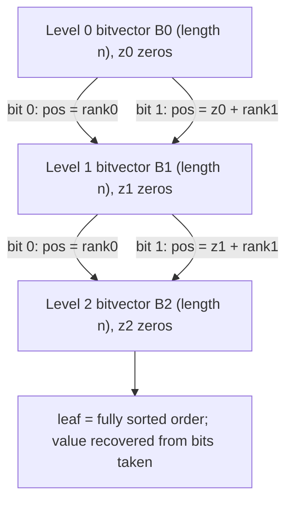

# Wavelet Tree — Senior Level

> **Read time: ~55 minutes** · **Audience:** Engineers building or operating systems on top of wavelet trees — succinct text indexes (FM-index), genomics pipelines, columnar range analytics — who need to make the structure *actually small and fast* in production: succinct rank/select bitvectors, the wavelet matrix reorganization, memory layout, and failure modes.

At the senior level the question is no longer "what query?" but "how do I make this fit in RAM, stay in cache, and serve millions of queries per second — and where does it break?". The naive per-node `int prefix[]` of the earlier levels uses `O(n log σ)` *words* (32× the bits it should). To be genuinely **succinct** — `n log σ + o(n log σ)` bits — we need real **rank/select on bitvectors**, and to be **fast** we want the **wavelet matrix** instead of a pointer tree. This document covers both, then the systems that depend on them.

---

## Table of Contents

1. [Introduction — Succinctness Is the Point](#introduction)
2. [Rank/Select on Bitvectors — The Real Engine](#rank-select)
3. [The Wavelet Matrix — Flatter, Faster, Cache-Friendly](#wavelet-matrix)
4. [Memory Engineering and Layout](#memory)
5. [System Design — FM-Index and Text Indexing](#system-design)
6. [System Design — Columnar Range Analytics](#analytics)
7. [Comparison with Alternatives (Production View)](#comparison)
8. [Code — Succinct Bitvector + Wavelet Matrix](#code)
9. [Observability](#observability)
10. [Failure Modes](#failure-modes)
11. [Summary](#summary)

---

<a name="introduction"></a>
## 1. Introduction — Succinctness Is the Point

A wavelet tree's headline claim is **succinct space**: it stores a sequence of `n` symbols over alphabet σ in `n⌈log₂σ⌉` bits plus a lower-order term, while supporting `access`, `rank`, `select`, `quantile`, and `range count` in `O(log σ)`. That claim only holds if two things are true in the implementation:

1. The bitvectors are **bit-packed** (one bit per element, not one int).
2. `rank` (and ideally `select`) on those bitvectors is **O(1)** using only `o(n)` extra bits — not an `int prefix[]` that doubles or 32×'s the memory.

If you skip these, you have a *correct* wavelet tree that is **bigger than the raw data** — defeating the entire purpose. Senior work on wavelet trees is mostly about getting (1) and (2) right, then choosing the **wavelet matrix** layout so the bits stay in cache during a query.

The payoff is dramatic: a human genome (~3.1 Gbp over σ=4) compresses into a wavelet-tree-backed FM-index of a few hundred MB that answers "where does this 100-bp read occur?" in time proportional to the read length — the foundation of read aligners like **bowtie2** and **BWA** and of compressed search in tools like the **succinct** library and **SDSL**.

---

<a name="rank-select"></a>
## 2. Rank/Select on Bitvectors — The Real Engine

Everything in a wavelet tree reduces to `rank1(B, i)` (count of 1-bits in `B[0..i)`) and `select1(B, j)` (position of the j-th 1-bit). Doing these in `O(1)` with `o(|B|)` extra bits is a classic succinct-data-structures result (**Jacobson 1989**, **Clark 1996**, **Vigna 2008**).

### 2.1 Constant-time rank — the two-level (superblock/block) index

Pack `B` into 64-bit words. Build two precomputed arrays:

- **Superblocks:** every `s` bits (e.g., `s = 512`), store the cumulative rank up to that superblock as a full 32/64-bit integer.
- **Blocks:** within a superblock, every 64-bit word stores the cumulative rank *relative to the superblock start* in a small integer (fits in `log₂ s` bits).

Then:

```
rank1(B, i):
    sb = i / 512                       # superblock index
    blk = (i % 512) / 64               # block (word) index within superblock
    base = superblock[sb] + block[sb*8 + blk]
    # popcount of the partial last word, masked to i % 64 bits
    word = B.words[i / 64]
    partial = popcount(word & ((1 << (i % 64)) - 1))
    return base + partial
```

Three array reads + one hardware `popcount`. The extra space is `superblock` (`n/512 × 64` bits) + `block` (`n/64 × 9` bits) ≈ **0.2 n bits** — comfortably `o(n)`. Modern CPUs have a `POPCNT` instruction (Go: `math/bits.OnesCount64`, Java: `Long.bitCount`, Python: `int.bit_count`), so the partial popcount is one cycle.

> **Practical note.** A common engineering choice is the "rank9" layout (Vigna): 64-bit superblock counters interleaved with 9-bit block counters, all in one cache line per 512 bits, giving rank in a single cache miss. This is what high-performance libraries ship.

### 2.2 Constant-time select — harder, often binary-searched

`select1(B, j)` is genuinely harder. Options, in increasing sophistication:

- **Binary search on rank** — `O(log n)` per call. Simple; fine if `select` is rare. (This is what `middle.md` used.)
- **Sampled select** — store every `t`-th 1-bit's position; binary-search only within a sampled gap. `O(log t)` typical.
- **Clark's select / "select9"** — true `O(1)` with `o(n)` extra bits, but intricate (dense vs sparse subranges handled differently).

Most production wavelet trees use **rank9 + a sampled select**, accepting that `select` is slightly slower than `rank`. Because `rank` dominates text-index inner loops, this is the right trade.

### 2.3 The space accounting

| Component | Bits |
|---|---|
| Bitvectors across all levels | exactly **n⌈log₂σ⌉** |
| Rank index (rank9) | ≈ 0.25 × n⌈log₂σ⌉ |
| Select samples | ≈ 0.05–0.20 × n⌈log₂σ⌉ |
| **Total** | **n log σ · (1 + o(1))** |

That `(1 + o(1))` is what "succinct" means: dominant term equals the information-theoretic content of the sequence; overhead is a constant fraction (here ~30%) that you tune.

---

<a name="wavelet-matrix"></a>
## 3. The Wavelet Matrix — Flatter, Faster, Cache-Friendly

The **wavelet matrix** (Claude & Navarro, 2012) is a reorganization of the wavelet tree that keeps the **same query semantics and `O(log σ)` cost** but stores, per **level**, a *single* bitvector of length `n` (instead of one fragmented bitvector per node). This is faster (one contiguous bitvector per level → great locality) and removes per-node bookkeeping.

### 3.1 Construction

For each level `ℓ` from most-significant bit down to least:

1. Write `B_ℓ[i] = (bit ℓ of value at current position)` — the bit that decides left/right at that level.
2. **Stable-sort** the sequence by that bit: all `0`-bit elements first (preserving order), then all `1`-bit elements. Record `z_ℓ` = number of `0`-bits at level ℓ.

After all levels, the sequence is fully sorted (radix-sort by value, MSB first). You store only the per-level bitvectors `B_ℓ` and the counts `z_ℓ`.

### 3.2 Navigation (the matrix mapping)

At level ℓ, a position `p`:

- If `B_ℓ[p] = 0`: its position at level ℓ+1 is `rank0(B_ℓ, p)` (the 0s stay at the front).
- If `B_ℓ[p] = 1`: its position at level ℓ+1 is `z_ℓ + rank1(B_ℓ, p)` (the 1s move past all `z_ℓ` zeros).

Compare to the tree, where the child was a different array; here the "child" is just **the same level-(ℓ+1) bitvector**, with the `z_ℓ` offset distinguishing the two halves. That single global offset is the matrix's trick.



### 3.3 Queries on the matrix

- **access(i):** at each level read `B_ℓ[p]`, append the bit to the answer, remap `p`. After `log σ` levels you have all bits of `S[i]`.
- **rank_c(i):** follow the bits of `c`, mapping `i` with the same rule.
- **quantile / range count:** carry `[l, r)` and map both endpoints; left-subtree count at level ℓ is `rank0(B_ℓ, r) − rank0(B_ℓ, l)`.

Same `O(log σ)`, but each level is a **single contiguous bitvector** — far fewer cache misses than chasing tree nodes. **Use the wavelet matrix in production.** The pointer tree is for teaching.

| Aspect | Wavelet Tree | Wavelet Matrix |
|---|---|---|
| Bitvectors | one per node (fragmented) | **one per level** (contiguous) |
| Per-level offset | implicit in node boundaries | explicit global `z_ℓ` |
| Cache behavior | medium | **good** |
| Query cost | O(log σ) | O(log σ) (smaller constant) |
| Code complexity | tree pointers / arithmetic | flat arrays + `z[]` |

---

<a name="memory"></a>
## 4. Memory Engineering and Layout

- **Bit-pack into 64-bit words.** Never store a bit as a byte or int. `n log σ` bits means `n log σ / 64` words per the whole matrix.
- **Interleave rank metadata** (rank9) so each `rank` is one cache line.
- **One allocation per level** (matrix) — contiguous bitvector + its rank index — to avoid pointer chasing and fragmentation.
- **mmap for read-only indexes.** Text indexes are built once and queried for years; memory-map the serialized structure so the OS page cache shares it across processes.
- **Coordinate compression up front** sets σ = #distinct, minimizing both height (`log σ`) and total bits (`n log σ`).
- **Huffman-shaped wavelet tree** for skewed alphabets: give frequent symbols shorter root-to-leaf paths, lowering *average* query cost and total bits to `nH₀(S)` (zero-order empirical entropy) instead of `n log σ`. This is how compressed text indexes hit entropy bounds.

### Memory budget example (human genome FM-index)

| Quantity | Value |
|---|---|
| n (with BWT) | ~3.1 × 10⁹ |
| σ | 4 (ACGT) + sentinel → 3 levels |
| Bitvector bits | ~3.1e9 × 2 = 6.2 Gbit ≈ **775 MB** |
| + rank9 (~25%) | ≈ **970 MB** total wavelet structure |
| Suffix-array samples, etc. | extra, tunable |

With Huffman shaping and 2-bit packing tricks, real aligners get this well under 1 GB.

---

<a name="system-design"></a>
## 5. System Design — FM-Index and Text Indexing

The **FM-index** (Ferragina–Manzini, 2000) is the killer application. It indexes a text `T` for substring search using:

1. The **Burrows–Wheeler Transform** `BWT(T)` — a permutation of `T`'s characters.
2. A **wavelet tree over `BWT(T)`** providing `rank_c(i)` in `O(log σ)`.
3. A small **C[]** table: `C[c]` = number of characters in `T` smaller than `c`.

### 5.1 Backward search (the LF-mapping loop)

To count occurrences of a pattern `P[0..m)`, scan `P` **right to left**, maintaining a half-open suffix-array interval `[sp, ep)`:

```
sp, ep = 0, n
for k = m-1 down to 0:
    c = P[k]
    sp = C[c] + rank_c(sp)      # rank on the wavelet tree over BWT
    ep = C[c] + rank_c(ep)
    if sp >= ep: return 0       # pattern absent
return ep - sp                  # number of occurrences
```

Each step is **one `rank_c` on the wavelet tree** = `O(log σ)`, so searching for a length-`m` pattern is `O(m log σ)` — independent of the text length `n`. That is the entire reason genomics and full-text search use this: search time scales with the **query**, not the **corpus**, in **near-compressed space**.

```mermaid
sequenceDiagram
    participant Q as Query P (reversed)
    participant FM as FM-Index
    participant WT as Wavelet Tree over BWT
    Q->>FM: char c, interval [sp, ep)
    FM->>WT: rank_c(sp), rank_c(ep)
    WT-->>FM: counts (O(log sigma))
    FM->>FM: sp = C[c]+rank_c(sp); ep = C[c]+rank_c(ep)
    FM-->>Q: narrowed interval (or empty = no match)
```

### 5.2 Locating and extracting

- **Locate** (where, not just how many): sample the suffix array every `t` positions; for an interval entry, LF-step until you hit a sampled position. Trade space (`n/t` samples) for locate time (`O(t log σ)`).
- **Extract** a substring `T[i..j)`: use `access` on the wavelet tree plus LF-mapping to walk the BWT.

### 5.3 Where wavelet trees show up in real systems

- **Read aligners** (BWA, bowtie2) — DNA/RNA short-read mapping.
- **Compressed full-text search** — `SDSL-lite`, `succinct`, `rust-bio`, `vg` (variation graphs).
- **Self-indexes** — the index *is* the (compressed) data; no separate copy of the text.
- **Pangenomics / metagenomics** — indexing huge reference collections.

---

<a name="analytics"></a>
## 6. System Design — Columnar Range Analytics

Outside text, wavelet trees serve **immutable analytical columns**:

- Quantize a numeric column (latency, price, score) into σ buckets, coordinate-compress to σ = #distinct, and build a wavelet matrix over the row order.
- **`quantile(l, r, k)`** → "p50/p95/p99 of this column over a row range (e.g., a time window)" without scanning.
- **`rangeCount(l, r, lo, hi)`** → "how many rows in this window fall in `[lo, hi]`".
- **`rank_c(r) − rank_c(l)`** → "how many rows equal value `c` in this window".

```mermaid
graph TD
    Ingest["Append-only event log"] --> Snapshot["Immutable column snapshot"]
    Snapshot --> Build["Build wavelet matrix per column (offline)"]
    Build --> Serve["Query service"]
    Serve -->|p99 over window| Q1["quantile(l,r,k)"]
    Serve -->|count in [lo,hi]| Q2["rangeCount"]
    Serve -->|exact value count| Q3["rank_c"]
```

Because wavelet matrices are static, the architecture is **immutable snapshot + rebuild**: ingest appends, periodically you seal a snapshot and build (or merge) wavelet matrices offline, then atomically swap the served version. This mirrors LSM-style segment lifecycles (`../04-lsm-tree/`) and persistent/immutable design (`../11-persistent-segment-tree/`).

---

<a name="comparison"></a>
## 7. Comparison with Alternatives (Production View)

| Attribute | Wavelet Matrix | Persistent Segment Tree | Merge Sort Tree |
|---|---|---|---|
| Range k-th | O(log σ) | O(log σ) | O(log² n)–O(log³ n) |
| rank_c / select_c | **O(log σ)** | not native | not native |
| Space | **n log σ (1+o(1)) bits** | O(n log σ) pointer nodes (~32× bits) | O(n log n) ints |
| Persistence | No | **Yes** | No |
| Mutability | rebuild snapshot | append new version | rebuild |
| Cache locality | **excellent (flat)** | poor (pointers) | good |
| Text indexing (FM) | **yes (core)** | no | no |
| Build | O(n log σ) | O(n log σ) | O(n log n) |
| Production niche | compressed indexes, immutable analytics columns | as-of/version queries, large σ | quick offline range stats |

**Senior takeaways:**
- For **compressed text / genomics**, the wavelet tree/matrix is essentially mandatory (FM-index).
- For **immutable analytics columns with small σ**, the wavelet matrix gives the best space and flat-in-n latency.
- For **versioned ("as of time T") order statistics** or **σ ≈ n**, choose the persistent segment tree (`../11-persistent-segment-tree/`).
- For a **quick one-off offline range stat**, a merge sort tree is least effort.

---

<a name="code"></a>
## 8. Code — Succinct Bitvector + Wavelet Matrix

A production-shaped, bit-packed **succinct bitvector** (block rank) plus a **wavelet matrix**. Rank is O(1) via word popcount over precomputed block sums; we omit a full select index for brevity (binary-search fallback).

### Go
```go
package wm

import "math/bits"

// BitVector is a bit-packed vector with O(1) rank via per-block (64-bit word) prefix sums.
type BitVector struct {
	words []uint64
	rankS []int32 // rankS[w] = #1-bits in words[0..w)
	n     int
}

func NewBitVector(n int) *BitVector {
	nw := (n + 63) / 64
	return &BitVector{words: make([]uint64, nw), rankS: make([]int32, nw+1), n: n}
}

func (b *BitVector) Set(i int)        { b.words[i>>6] |= 1 << uint(i&63) }
func (b *BitVector) Get(i int) int    { return int((b.words[i>>6] >> uint(i&63)) & 1) }

// Build the rank index after all Set calls.
func (b *BitVector) Build() {
	acc := int32(0)
	for w := range b.words {
		b.rankS[w] = acc
		acc += int32(bits.OnesCount64(b.words[w]))
	}
	b.rankS[len(b.words)] = acc
}

// Rank1 returns #1-bits in [0, i).
func (b *BitVector) Rank1(i int) int {
	w := i >> 6
	base := int(b.rankS[w])
	if r := i & 63; r > 0 {
		base += bits.OnesCount64(b.words[w] & ((1 << uint(r)) - 1))
	}
	return base
}
func (b *BitVector) Rank0(i int) int { return i - b.Rank1(i) }
func (b *BitVector) Zeros() int      { return b.n - int(b.rankS[len(b.words)]) }

// Matrix is a wavelet matrix over alphabet [0, 1<<bitsLen).
type Matrix struct {
	bv      []*BitVector
	z       []int // z[l] = #zeros at level l
	bitsLen int
	n       int
}

// NewMatrix builds a wavelet matrix; values in [0, 1<<bitsLen).
func NewMatrix(data []int, bitsLen int) *Matrix {
	n := len(data)
	m := &Matrix{bitsLen: bitsLen, n: n, bv: make([]*BitVector, bitsLen), z: make([]int, bitsLen)}
	cur := append([]int(nil), data...)
	for level := 0; level < bitsLen; level++ {
		shift := uint(bitsLen - 1 - level) // MSB first
		bv := NewBitVector(n)
		for i, x := range cur {
			if (x>>shift)&1 == 1 {
				bv.Set(i)
			}
		}
		bv.Build()
		m.bv[level] = bv
		m.z[level] = bv.Zeros()
		// stable partition: zeros first, then ones
		next := make([]int, 0, n)
		for i, x := range cur {
			if bv.Get(i) == 0 {
				next = append(next, x)
			}
		}
		for i, x := range cur {
			if bv.Get(i) == 1 {
				next = append(next, x)
			}
		}
		_ = next
		cur = next
	}
	return m
}

// Access returns data[i].
func (m *Matrix) Access(i int) int {
	val := 0
	for level := 0; level < m.bitsLen; level++ {
		b := m.bv[level]
		if b.Get(i) == 0 {
			i = b.Rank0(i)
		} else {
			val |= 1 << uint(m.bitsLen-1-level)
			i = m.z[level] + b.Rank1(i)
		}
	}
	return val
}

// RangeCount: #elements in [l, r) with value < x (single descent).
func (m *Matrix) CountLess(l, r, x int) int {
	cnt := 0
	for level := 0; level < m.bitsLen; level++ {
		b := m.bv[level]
		bit := (x >> uint(m.bitsLen-1-level)) & 1
		l0, r0 := b.Rank0(l), b.Rank0(r)
		if bit == 1 {
			cnt += r0 - l0 // all left (0-bit) elements are < x here
			l = m.z[level] + (l - l0)
			r = m.z[level] + (r - r0)
		} else {
			l, r = l0, r0
		}
	}
	return cnt
}

// Quantile: k-th smallest (0-indexed) in [l, r).
func (m *Matrix) Quantile(l, r, k int) int {
	val := 0
	for level := 0; level < m.bitsLen; level++ {
		b := m.bv[level]
		l0, r0 := b.Rank0(l), b.Rank0(r)
		cntLeft := r0 - l0
		if k < cntLeft {
			l, r = l0, r0
		} else {
			k -= cntLeft
			val |= 1 << uint(m.bitsLen-1-level)
			l = m.z[level] + (l - l0)
			r = m.z[level] + (r - r0)
		}
	}
	return val
}
```

### Java
```java
public final class WaveletMatrix {
    static final class BitVector {
        final long[] words;
        final int[] rankS;   // prefix popcount per word
        final int n;
        BitVector(int n) { this.n = n; words = new long[(n + 63) >> 6]; rankS = new int[words.length + 1]; }
        void set(int i) { words[i >> 6] |= 1L << (i & 63); }
        int get(int i)  { return (int) ((words[i >> 6] >>> (i & 63)) & 1); }
        void build() {
            int acc = 0;
            for (int w = 0; w < words.length; w++) { rankS[w] = acc; acc += Long.bitCount(words[w]); }
            rankS[words.length] = acc;
        }
        int rank1(int i) {
            int w = i >> 6, base = rankS[w], r = i & 63;
            if (r > 0) base += Long.bitCount(words[w] & ((1L << r) - 1));
            return base;
        }
        int rank0(int i) { return i - rank1(i); }
        int zeros() { return n - rankS[words.length]; }
    }

    private final BitVector[] bv;
    private final int[] z;
    private final int bitsLen, n;

    public WaveletMatrix(int[] data, int bitsLen) {
        this.bitsLen = bitsLen; this.n = data.length;
        bv = new BitVector[bitsLen]; z = new int[bitsLen];
        int[] cur = data.clone();
        for (int level = 0; level < bitsLen; level++) {
            int shift = bitsLen - 1 - level;
            BitVector b = new BitVector(n);
            for (int i = 0; i < n; i++) if (((cur[i] >> shift) & 1) == 1) b.set(i);
            b.build(); bv[level] = b; z[level] = b.zeros();
            int[] next = new int[n]; int p = 0;
            for (int i = 0; i < n; i++) if (b.get(i) == 0) next[p++] = cur[i];
            for (int i = 0; i < n; i++) if (b.get(i) == 1) next[p++] = cur[i];
            cur = next;
        }
    }

    public int access(int i) {
        int val = 0;
        for (int level = 0; level < bitsLen; level++) {
            BitVector b = bv[level];
            if (b.get(i) == 0) i = b.rank0(i);
            else { val |= 1 << (bitsLen - 1 - level); i = z[level] + b.rank1(i); }
        }
        return val;
    }

    public int countLess(int l, int r, int x) {
        int cnt = 0;
        for (int level = 0; level < bitsLen; level++) {
            BitVector b = bv[level];
            int bit = (x >> (bitsLen - 1 - level)) & 1;
            int l0 = b.rank0(l), r0 = b.rank0(r);
            if (bit == 1) { cnt += r0 - l0; l = z[level] + (l - l0); r = z[level] + (r - r0); }
            else { l = l0; r = r0; }
        }
        return cnt;
    }

    public int quantile(int l, int r, int k) {
        int val = 0;
        for (int level = 0; level < bitsLen; level++) {
            BitVector b = bv[level];
            int l0 = b.rank0(l), r0 = b.rank0(r), cntLeft = r0 - l0;
            if (k < cntLeft) { l = l0; r = r0; }
            else { k -= cntLeft; val |= 1 << (bitsLen - 1 - level); l = z[level] + (l - l0); r = z[level] + (r - r0); }
        }
        return val;
    }
}
```

### Python
```python
class _BitVector:
    __slots__ = ("words", "rankS", "n")

    def __init__(self, n):
        self.n = n
        self.words = [0] * ((n + 63) // 64)
        self.rankS = [0] * (len(self.words) + 1)

    def set(self, i):
        self.words[i >> 6] |= 1 << (i & 63)

    def get(self, i):
        return (self.words[i >> 6] >> (i & 63)) & 1

    def build(self):
        acc = 0
        for w in range(len(self.words)):
            self.rankS[w] = acc
            acc += self.words[w].bit_count()
        self.rankS[len(self.words)] = acc

    def rank1(self, i):
        w = i >> 6
        base = self.rankS[w]
        r = i & 63
        if r:
            base += (self.words[w] & ((1 << r) - 1)).bit_count()
        return base

    def rank0(self, i):
        return i - self.rank1(i)

    def zeros(self):
        return self.n - self.rankS[-1]


class WaveletMatrix:
    """Succinct wavelet matrix over alphabet [0, 1<<bits_len)."""

    def __init__(self, data, bits_len):
        self.bits_len = bits_len
        self.n = len(data)
        self.bv = []
        self.z = []
        cur = list(data)
        for level in range(bits_len):
            shift = bits_len - 1 - level
            b = _BitVector(self.n)
            for i, x in enumerate(cur):
                if (x >> shift) & 1:
                    b.set(i)
            b.build()
            self.bv.append(b)
            self.z.append(b.zeros())
            zeros = [x for x in cur if not ((x >> shift) & 1)]
            ones = [x for x in cur if (x >> shift) & 1]
            cur = zeros + ones

    def access(self, i):
        val = 0
        for level in range(self.bits_len):
            b = self.bv[level]
            if b.get(i) == 0:
                i = b.rank0(i)
            else:
                val |= 1 << (self.bits_len - 1 - level)
                i = self.z[level] + b.rank1(i)
        return val

    def count_less(self, l, r, x):
        cnt = 0
        for level in range(self.bits_len):
            b = self.bv[level]
            bit = (x >> (self.bits_len - 1 - level)) & 1
            l0, r0 = b.rank0(l), b.rank0(r)
            if bit == 1:
                cnt += r0 - l0
                l = self.z[level] + (l - l0)
                r = self.z[level] + (r - r0)
            else:
                l, r = l0, r0
        return cnt

    def quantile(self, l, r, k):
        val = 0
        for level in range(self.bits_len):
            b = self.bv[level]
            l0, r0 = b.rank0(l), b.rank0(r)
            cnt_left = r0 - l0
            if k < cnt_left:
                l, r = l0, r0
            else:
                k -= cnt_left
                val |= 1 << (self.bits_len - 1 - level)
                l = self.z[level] + (l - l0)
                r = self.z[level] + (r - r0)
        return val
```

---

<a name="observability"></a>
## 9. Observability

| Metric | Why it matters | Alert threshold |
|---|---|---|
| `bits_per_symbol` (structure size / n) | Detects regressions where overhead creeps above succinct | > 1.5 × log₂σ |
| `rank_index_overhead_ratio` | Tracks `o(n)` term staying small | > 0.35 |
| `query_latency_p99` (quantile/rank) | Should be flat in n | > 2 µs |
| `cache_miss_per_query` | Wavelet matrix should be ~`log σ` lines | > 2 × log σ |
| `build_throughput` (MB/s) | Rebuild/snapshot SLOs | < target for snapshot window |
| `alphabet_size σ` | Sudden growth (failed compression) inflates height | unexpected jump |

Because queries are flat in n, a **latency that grows with data size is a red flag** — usually a position-bound structure crept in, or rank degraded to linear scan.

---

<a name="failure-modes"></a>
## 10. Failure Modes

- **σ explosion (no coordinate compression).** If raw values are used and σ ≈ n, height becomes `log n` and bits balloon to `n log n`. *Fix:* always coordinate-compress; monitor σ.
- **Rank degraded to O(log n) or O(n).** Forgetting to build the rank index, or using binary search where O(1) rank was assumed, makes every query slower by a `log` factor. *Fix:* build rank9; benchmark single `rank` in isolation.
- **Memory bigger than the data.** Storing `int prefix[]` per node (the teaching layout) in production. *Fix:* bit-pack; switch to the wavelet matrix.
- **Cache thrashing on the pointer tree.** Fragmented per-node bitvectors miss cache repeatedly. *Fix:* use the matrix (one contiguous bitvector per level).
- **Update attempts.** Treating the structure as mutable corrupts it. *Fix:* immutable snapshot + offline rebuild/merge; or a dedicated dynamic wavelet tree (rare, slow).
- **Select assumed O(1) but is binary search.** A select-heavy workload (e.g., locate in FM-index without SA samples) tanks. *Fix:* add sampled/Clark select, or suffix-array samples for locate.
- **Skewed alphabet wasting depth.** Balanced split wastes levels on rare symbols. *Fix:* Huffman-shaped wavelet tree for entropy-bound space and average cost.

---

<a name="summary"></a>
## 11. Summary

- **Succinctness is the whole point.** A wavelet tree is only worthwhile in production if its bitvectors are **bit-packed** and `rank` is **O(1)** via a two-level (rank9) index using `o(n)` extra bits — total `n log σ (1+o(1))` bits.
- The **wavelet matrix** is the production layout: one contiguous bitvector per **level** with a global `z_ℓ` zero-count offset, giving the same `O(log σ)` queries with far better cache locality. Ship the matrix; teach the tree.
- The **FM-index** is the headline system: a wavelet tree over `BWT(T)` plus a `C[]` table answers substring search in `O(m log σ)` — time scaling with the *query*, not the *corpus* — in near-compressed space, powering BWA/bowtie2 and compressed full-text search.
- For **immutable analytics columns** with small σ, the wavelet matrix gives flat-in-n p50/p95/p99 and range-count queries; manage it as immutable snapshots + offline rebuild.
- Choose the **persistent segment tree** (`../11-persistent-segment-tree/`) for versioned/as-of queries or σ ≈ n; choose the **merge sort tree** for quick offline range stats.
- Watch **bits-per-symbol**, **rank overhead**, and **flat-in-n latency** in production; σ explosion, un-built rank, and pointer-tree cache misses are the classic failures.

**Next step:** [professional.md](./professional.md) — the O(log σ) query proofs, the succinct-space theorem (n log σ + o(·) bits), rank/select lower/upper bounds, and a rigorous complexity comparison.
