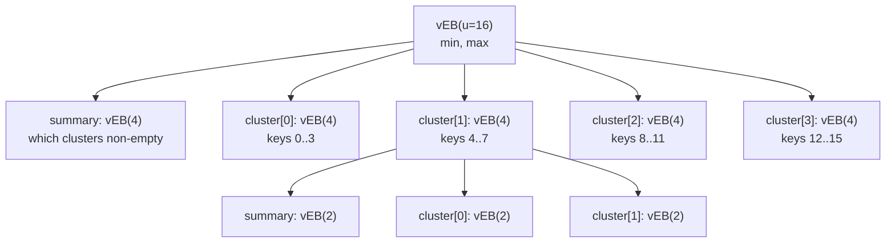
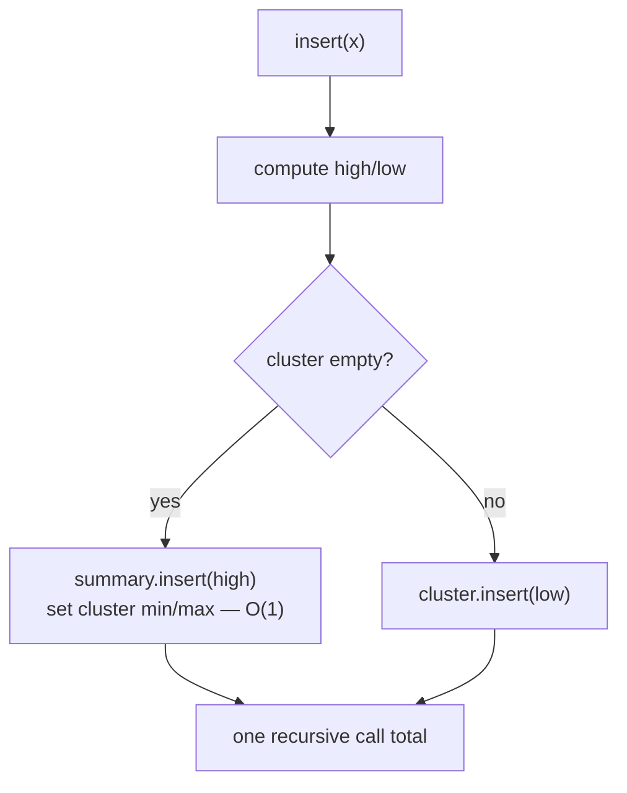

# van Emde Boas Tree (vEB) — Junior Level

> **Read time: ~40 minutes** · **Audience:** Engineers who know arrays, recursion, and a little bit math (`>>`, `&`, integer division) and want to learn an ordered dictionary that beats balanced trees when the keys are bounded integers.

A **van Emde Boas tree** (vEB tree, named after Peter van Emde Boas, who introduced it in 1975) is an **ordered dictionary** over a fixed integer universe `{0, 1, 2, ..., u-1}`. It supports a rich set of operations — `insert`, `delete`, `member`, `min`, `max`, `successor`, `predecessor` — and the headline fact is that **every one of those operations runs in `O(log log u)` time**, not `O(log n)`. On a universe of `u = 2^32` (all 32-bit integers), `log log u = log 32 = 5`. Five steps. A balanced binary search tree holding the same `n` keys would need `log n` comparisons, which for a million keys is about 20. The vEB tree turns the cost of an ordered-dictionary operation into a function of the **universe size**, not the **number of elements**, and then makes that function double-logarithmic.

The price is **space**: a basic vEB tree uses `O(u)` memory whether you store one key or a billion. So it is the right tool precisely when the universe is bounded and reasonably dense, or when you can afford the space, or when you replace the inner arrays with hash tables to bring the space down to `O(n)` (covered in `senior.md`). Typical homes for vEB-style structures: **integer priority queues**, **bounded-universe ordered sets**, **IP routing tables** (longest-prefix-match style lookups over a bounded address space), and any place where keys are small integers and you need fast successor/predecessor queries.

This document teaches you the vEB tree **from the ground up**: what the universe is, how a key splits into a **high half** and a **low half**, how the structure recursively builds a **summary** plus a row of **clusters**, how `successor` jumps into exactly one cluster, and why the recursion bottoms out in `O(log log u)` steps. We use small universes (`u = 16`) throughout so you can trace every operation by hand.

---

## Table of Contents

1. [Introduction — Ordered Dictionary over a Bounded Universe](#introduction)
2. [Prerequisites — Bit Splitting with high/low/index](#prerequisites)
3. [Glossary](#glossary)
4. [Core Concepts — Summary, Clusters, and the min/max Aside](#core-concepts)
5. [Big-O Summary](#big-o-summary)
6. [Real-World Analogies](#real-world-analogies)
7. [Pros & Cons](#pros--cons)
8. [Code Examples — Go, Java, Python](#code-examples)
9. [Coding Patterns — The high/low/index Trio](#coding-patterns)
10. [Error Handling](#error-handling)
11. [Performance Tips](#performance-tips)
12. [Best Practices](#best-practices)
13. [Edge Cases & Pitfalls](#edge-cases--pitfalls)
14. [Common Mistakes](#common-mistakes)
15. [Cheat Sheet](#cheat-sheet)
16. [Visual Animation](#visual-animation)
17. [Summary](#summary)
18. [Further Reading](#further-reading)

---

<a name="introduction"></a>
## 1. Introduction — Ordered Dictionary over a Bounded Universe

An **ordered dictionary** (also called an ordered set or sorted set) stores a collection of keys and answers questions that depend on the *order* of those keys:

- `member(x)`: is `x` in the set?
- `insert(x)`: add `x` to the set.
- `delete(x)`: remove `x`.
- `min()` / `max()`: the smallest / largest key.
- `successor(x)`: the smallest key strictly greater than `x`.
- `predecessor(x)`: the largest key strictly less than `x`.

You already know structures that do this. A **balanced binary search tree** (red-black tree, AVL tree) gives `O(log n)` for all of them, where `n` is the number of stored keys. A **sorted array** gives `O(log n)` lookup but `O(n)` insert/delete. A **hash table** gives `O(1)` membership but **cannot do `successor`/`predecessor`** at all, because hashing destroys order.

The vEB tree makes a different trade. It assumes the keys come from a **bounded universe**: every key is an integer in `{0, ..., u-1}`, and `u` is fixed up front (say `u = 2^16` or `u = 2^32`). Under that assumption it delivers **`O(log log u)`** for *every* operation in the list above, including `successor` and `predecessor`. That is dramatically faster than `O(log n)`:

| universe `u` | `log u` (BST-ish over full universe) | `log log u` (vEB) |
|---|---|---|
| 16 | 4 | 2 |
| 256 | 8 | 3 |
| 65,536 (2^16) | 16 | 4 |
| 4,294,967,296 (2^32) | 32 | 5 |
| 2^64 | 64 | 6 |

The catch — and there is always a catch — is **space**. A basic vEB tree allocates structure proportional to the universe size, `O(u)`, not the element count `O(n)`. Storing a single key in a `u = 2^32` vEB tree would, naively, want billions of cells. That is why in practice we either (a) keep `u` modest, (b) replace the cluster array with a hash map so unused clusters cost nothing (`O(n)` space, see `senior.md`), or (c) reach for the closely related **y-fast trie**, which achieves the same `O(log log u)` in `O(n)` space.

For a junior engineer the goal is simpler: understand the *shape* of the structure and trace one `insert` and one `successor` by hand. Everything else builds on that.

---

<a name="prerequisites"></a>
## 2. Prerequisites — Bit Splitting with high/low/index

The entire vEB tree rests on **splitting a key into two halves**. Fix a universe size `u` that is a power of two, and let `s = sqrt(u)` (we will always choose `u` so that `sqrt(u)` is itself a power of two, e.g. `u = 16 → s = 4`, `u = 256 → s = 16`). Any key `x` in `{0, ..., u-1}` is split as:

```
high(x) = x / s       (integer division)  — which cluster x lives in
low(x)  = x % s       (remainder)         — x's position inside that cluster
index(h, l) = h * s + l                   — rebuild x from its two halves
```

Think of writing `x` in **base `s`**: `high(x)` is the leading "digit", `low(x)` is the trailing "digit". Because `s = sqrt(u)`, each half is itself a number in `{0, ..., sqrt(u)-1}`, i.e. a key in a *smaller* universe of size `sqrt(u)`. That is the seed of the recursion.

Worked example with `u = 16`, so `s = sqrt(16) = 4`:

| key `x` | binary (4 bits) | `high(x) = x/4` | `low(x) = x%4` | check `index = 4*high + low` |
|---|---|---|---|---|
| 0 | `0000` | 0 | 0 | 4·0 + 0 = 0 |
| 3 | `0011` | 0 | 3 | 4·0 + 3 = 3 |
| 4 | `0100` | 1 | 0 | 4·1 + 0 = 4 |
| 6 | `0110` | 1 | 2 | 4·1 + 2 = 6 |
| 9 | `1001` | 2 | 1 | 4·2 + 1 = 9 |
| 13 | `1101` | 3 | 1 | 4·3 + 1 = 13 |
| 15 | `1111` | 3 | 3 | 4·3 + 3 = 15 |

Notice the pattern in binary: with `u = 16` (4 bits), `high(x)` is the **top 2 bits** and `low(x)` is the **bottom 2 bits**. In general `high(x)` is the upper half of the bits and `low(x)` is the lower half. When `s` is a power of two you can compute these with shifts and masks (`x >> halfBits` and `x & (s-1)`), which is why implementations often store a `shift` and a `mask` instead of dividing.

If you can compute `high`, `low`, and `index` and verify `index(high(x), low(x)) == x`, you have the only arithmetic the vEB tree needs.

**Other prerequisites:**

- **Recursion.** The structure is defined recursively, and so are its operations.
- **Arrays.** Clusters are stored in an array indexed by `high`.
- **Sentinel values.** We use a "nothing here" marker (we will write `NIL` or `-1`) for empty `min`/`max`.

---

<a name="glossary"></a>
## 3. Glossary

| Term | Definition |
|---|---|
| **Universe `u`** | The fixed range `{0, ..., u-1}` of possible keys. Always a power of two in our examples. |
| **`sqrt(u)`** | The branching factor. We split each universe into `sqrt(u)` clusters of size `sqrt(u)`. |
| **`high(x)`** | `x / sqrt(u)` — which cluster key `x` belongs to. |
| **`low(x)`** | `x % sqrt(u)` — `x`'s position within its cluster. |
| **`index(h, l)`** | `h * sqrt(u) + l` — reconstructs a key from cluster number `h` and position `l`. |
| **Cluster** | One of the `sqrt(u)` child vEB trees, each over a universe of size `sqrt(u)`. `cluster[i]` holds all keys whose `high` equals `i`. |
| **Summary** | A single child vEB tree of size `sqrt(u)` that records **which clusters are non-empty**. `i` is in the summary iff `cluster[i]` is non-empty. |
| **`min` / `max`** | Stored **directly on the node** (not recursively), the smallest and largest keys in this subtree. This is the trick that makes `O(log log u)` possible. |
| **Base case** | A vEB tree of size `u = 2`. It stores everything in `min`/`max` only; it has no summary and no clusters. |
| **`successor(x)`** | The smallest stored key strictly greater than `x`. |
| **`predecessor(x)`** | The largest stored key strictly less than `x`. |
| **`NIL`** | Sentinel meaning "empty" or "no such key" (we use `-1` in code). |
| **y-fast trie** | An alternative structure with the same `O(log log u)` time but only `O(n)` space (see `senior.md`/`professional.md`). |

---

<a name="core-concepts"></a>
## 4. Core Concepts — Summary, Clusters, and the min/max Aside

### 4.1 The recursive shape

A vEB tree of universe size `u` is **not** a binary tree of `u` nodes. It is a small, fat, recursive object:

```
vEB(u):
    min           # smallest key here (or NIL)
    max           # largest key here  (or NIL)
    summary       # a vEB(sqrt(u))  — tracks which clusters are non-empty
    cluster[0..sqrt(u)-1]   # each is a vEB(sqrt(u))
```

So a node of size `u` contains `sqrt(u) + 1` child nodes (one summary plus `sqrt(u)` clusters), each of size `sqrt(u)`. The recursion shrinks the universe by a **square root** at every level: `u → sqrt(u) → sqrt(sqrt(u)) → ...`. Taking square roots repeatedly, you reach the base case `u = 2` after only `log log u` levels. That is where the `O(log log u)` comes from — but only if each operation descends into **one** child per level, which the `min`/`max` trick guarantees (Section 4.4).



### 4.2 Clusters: where keys actually live

For `u = 16`, the universe `{0..15}` is partitioned into `sqrt(16) = 4` clusters of 4 keys each:

```
cluster[0] = {0, 1, 2, 3}      (keys with high = 0)
cluster[1] = {4, 5, 6, 7}      (keys with high = 1)
cluster[2] = {8, 9, 10, 11}    (keys with high = 2)
cluster[3] = {12, 13, 14, 15}  (keys with high = 3)
```

To find whether key `x` is present, you look at `cluster[high(x)]` and ask whether `low(x)` is in it. Key `13`: `high(13) = 3`, `low(13) = 1`, so you check whether `1` is in `cluster[3]`.

### 4.3 Summary: a directory of non-empty clusters

The **summary** is itself a vEB tree of size `sqrt(u)`. Its job is to remember **which clusters have anything in them**. If `cluster[2]` becomes non-empty, we `insert(2)` into the summary; when `cluster[2]` empties out, we `delete(2)` from the summary.

Why bother? Because of `successor`. Suppose you ask for `successor(7)`. `high(7) = 1`, so `7` lives at the top of `cluster[1]`. If `cluster[1]` has no key larger than `low(7) = 3`, you must jump to the **next non-empty cluster to the right**. Scanning clusters `2, 3, 4, ...` one by one would be `O(sqrt(u))` — too slow. Instead you ask the summary for `successor(1)`: the summary instantly tells you the next non-empty cluster (say cluster `3`), and you take *its* `min`. One recursive call into the summary, one into a cluster — that is the heart of the speed.

### 4.4 The min/max trick — why recursion stays single-branch

Here is the cleverest idea in the whole structure. **The minimum key of a vEB node is stored only in the node's `min` field — it is NOT also stored down in any cluster.** The `min` is held "aside".

Why does that matter? Two reasons:

1. **`min` and `max` are `O(1)`.** Just read the field. No recursion at all.
2. **`insert` and `successor` make only ONE recursive call.** When you insert into an *empty* cluster, you do not recurse into the cluster to place the element — you just set the cluster's `min`/`max` and update the summary. Recursing into the summary is the *only* recursive call. Similarly `successor` either finds the answer in the current cluster (one recursive call) or finds the next cluster via the summary and reads its `min` in `O(1)` (one recursive call). **Never two.**

If every operation recursed into *both* the summary and a cluster, the recurrence would be `T(u) = 2·T(sqrt(u)) + O(1) = O(log u)` — no better than a BST. The `min`-aside trick collapses the two potential recursive calls into one, giving:

```
T(u) = T(sqrt(u)) + O(1) = O(log log u)
```

The full proof of that recurrence is in `professional.md`; for now, hold onto the slogan: **store the min aside, recurse into one child, win.**

### 4.5 The base case

The recursion stops at `u = 2`. A vEB tree of size 2 holds keys from `{0, 1}` and stores them **entirely in `min`/`max`** — no summary, no clusters. Membership, insert, delete, successor are all trivial constant-time `if` statements on two fields. Every recursive operation eventually reaches a size-2 node and returns.

---

<a name="big-o-summary"></a>
## 5. Big-O Summary

| Operation | Time | Space | Notes |
|---|---|---|---|
| `member(x)` | O(log log u) | — | recurse into one cluster per level |
| `min()` / `max()` | O(1) | — | stored on the node |
| `insert(x)` | O(log log u) | — | one recursive call (min-aside trick) |
| `delete(x)` | O(log log u) | — | at most two recursive calls in the rare cluster-emptied case; still O(log log u) |
| `successor(x)` | O(log log u) | — | one cluster call, or one summary call + O(1) min read |
| `predecessor(x)` | O(log log u) | — | symmetric to successor |
| **Space (basic)** | — | **O(u)** | clusters allocated whether used or not |
| Space (hashed clusters) | — | O(n) | replace cluster array with a hash map (senior.md) |

For a universe of `u = 2^32`, `O(log log u)` is at most **5** recursion levels. Compare to `O(log n) = 20+` for a balanced BST with a million keys.

---

<a name="real-world-analogies"></a>
## 6. Real-World Analogies

| Concept | Analogy |
|---|---|
| **high/low split** | A **phone number**: area code (`high`) picks the region; the local number (`low`) picks the house. To find "the next phone in service after this one", first check the rest of this area code, then jump to the next area code that has any phones. |
| **summary** | The **floor directory** in an office building. Instead of walking every floor to find an occupied office, you read the lobby directory ("which floors are occupied?") and go straight to the right floor. |
| **min stored aside** | A **VIP guest list at the door**. The smallest/most-important entry is written on a card at the entrance, so you never walk inside just to learn who the smallest is. |
| **clusters of clusters** | **Country → state → city → street** addressing. Each level narrows the search by a fixed factor, so very few levels cover an enormous address space. |
| **base case (u=2)** | A **light switch**: only two states, fully described by reading it once. |

> Where the analogies break: the phone-number analogy suggests two equal halves, but the vEB recursion is what makes "jump to the next area code" itself fast — area codes are themselves looked up by a smaller vEB tree (the summary). Real directories are flat; vEB is recursive.

---

<a name="pros--cons"></a>
## 7. Pros & Cons

| Pros | Cons |
|------|------|
| `O(log log u)` for *all* ordered-dictionary ops — beats BST's `O(log n)` for large universes | `O(u)` space in the basic form — huge for sparse data |
| `min`/`max` in `O(1)` | Cache-unfriendly: pointer-chasing through many small nodes (often slower than a flat sorted array in practice) |
| Supports `successor`/`predecessor`, which hashing cannot | Keys must be **bounded integers** — no strings, no floats, no unbounded ints |
| Time depends on `u`, not `n` — great when `n` is large and `u` is moderate | Implementation is intricate (recursion, base case, min-aside delete logic) |
| Foundation for fast integer priority queues | y-fast trie or a 4-ary heap is often simpler and competitive |

**When to use:** keys are integers in a known bounded range, the range is dense or you can afford `O(u)` space (or hash the clusters), and you need fast `successor`/`predecessor` or an integer priority queue.

**When NOT to use:** keys are not small integers; the universe is astronomically larger than the element count and you cannot hash clusters; cache performance dominates and a flat structure (sorted array, B-tree) would be faster in practice.

---

<a name="code-examples"></a>
## 8. Code Examples — Go, Java, Python

We implement a **recursive vEB tree** for a universe `u` that is a power of two. `NIL = -1` means "empty". For clarity we use ordinary recursion and an array of cluster nodes; space-optimized (hashed) clusters are in `senior.md`.

> **Note on `sqrt(u)`:** When `u` is a power of two whose exponent is itself a power of two (16, 256, 65536, ...), `sqrt(u)` is an exact power of two. For a general power-of-two `u` we split into a "high sqrt" `2^ceil(k/2)` and "low sqrt" `2^floor(k/2)`. The code below uses the simple exact-square-root universes for teaching; the general split is shown in `middle.md`.

### Example 1: vEB tree with insert, member, min, max, successor

#### Go

```go
package veb

// NIL marks an empty min/max or "no such key".
const NIL = -1

// VEB is a van Emde Boas tree over the universe {0 .. u-1}.
type VEB struct {
    u       int     // universe size (power of two)
    sqrtU   int     // sqrt(u): branching factor (also size of each child)
    min     int     // smallest key, or NIL
    max     int     // largest key, or NIL
    summary *VEB    // vEB(sqrt(u)) tracking which clusters are non-empty
    cluster []*VEB  // sqrt(u) children, each a vEB(sqrt(u))
}

func isqrt(u int) int { // exact integer sqrt for our power-of-two universes
    s := 1
    for s*s < u {
        s++
    }
    return s
}

func New(u int) *VEB {
    t := &VEB{u: u, min: NIL, max: NIL}
    if u <= 2 {
        return t // base case: no summary, no clusters
    }
    t.sqrtU = isqrt(u)
    t.summary = New(t.sqrtU)
    t.cluster = make([]*VEB, t.sqrtU)
    for i := range t.cluster {
        t.cluster[i] = New(t.sqrtU)
    }
    return t
}

func (t *VEB) high(x int) int       { return x / t.sqrtU }
func (t *VEB) low(x int) int        { return x % t.sqrtU }
func (t *VEB) index(h, l int) int   { return h*t.sqrtU + l }

func (t *VEB) Min() int { return t.min }
func (t *VEB) Max() int { return t.max }

func (t *VEB) Member(x int) bool {
    if x == t.min || x == t.max {
        return true
    }
    if t.u <= 2 {
        return false // base case: only min/max exist
    }
    return t.cluster[t.high(x)].Member(t.low(x))
}

// emptyInsert sets the lone element of an empty node.
func (t *VEB) emptyInsert(x int) {
    t.min, t.max = x, x
}

func (t *VEB) Insert(x int) {
    if t.min == NIL { // node is empty
        t.emptyInsert(x)
        return
    }
    if x < t.min {
        x, t.min = t.min, x // new key becomes min; push old min down
    }
    if t.u > 2 {
        h, l := t.high(x), t.low(x)
        if t.cluster[h].min == NIL { // cluster was empty
            t.summary.Insert(h)        // ONLY recursive call on the empty path
            t.cluster[h].emptyInsert(l)
        } else {
            t.cluster[h].Insert(l)
        }
    }
    if x > t.max {
        t.max = x
    }
}

func (t *VEB) Successor(x int) int {
    if t.u <= 2 { // base case
        if x == 0 && t.max == 1 {
            return 1
        }
        return NIL
    }
    if t.min != NIL && x < t.min {
        return t.min
    }
    h, l := t.high(x), t.low(x)
    maxLow := t.cluster[h].max
    if maxLow != NIL && l < maxLow { // answer is inside this cluster
        offset := t.cluster[h].Successor(l)
        return t.index(h, offset)
    }
    // jump to the next non-empty cluster via the summary
    succCluster := t.summary.Successor(h)
    if succCluster == NIL {
        return NIL
    }
    offset := t.cluster[succCluster].min
    return t.index(succCluster, offset)
}
```

#### Java

```java
public final class VEB {
    static final int NIL = -1;

    final int u, sqrtU;
    int min = NIL, max = NIL;
    VEB summary;
    VEB[] cluster;

    public VEB(int u) {
        this.u = u;
        if (u <= 2) { this.sqrtU = 0; return; } // base case
        this.sqrtU = isqrt(u);
        this.summary = new VEB(sqrtU);
        this.cluster = new VEB[sqrtU];
        for (int i = 0; i < sqrtU; i++) cluster[i] = new VEB(sqrtU);
    }

    static int isqrt(int u) { int s = 1; while (s * s < u) s++; return s; }

    int high(int x)  { return x / sqrtU; }
    int low(int x)   { return x % sqrtU; }
    int index(int h, int l) { return h * sqrtU + l; }

    public int min() { return min; }
    public int max() { return max; }

    public boolean member(int x) {
        if (x == min || x == max) return true;
        if (u <= 2) return false;
        return cluster[high(x)].member(low(x));
    }

    private void emptyInsert(int x) { min = x; max = x; }

    public void insert(int x) {
        if (min == NIL) { emptyInsert(x); return; }
        if (x < min) { int t = min; min = x; x = t; } // swap; old min goes down
        if (u > 2) {
            int h = high(x), l = low(x);
            if (cluster[h].min == NIL) {
                summary.insert(h);          // only recursive call on empty path
                cluster[h].emptyInsert(l);
            } else {
                cluster[h].insert(l);
            }
        }
        if (x > max) max = x;
    }

    public int successor(int x) {
        if (u <= 2) {
            if (x == 0 && max == 1) return 1;
            return NIL;
        }
        if (min != NIL && x < min) return min;
        int h = high(x), l = low(x);
        int maxLow = cluster[h].max;
        if (maxLow != NIL && l < maxLow) {
            int offset = cluster[h].successor(l);
            return index(h, offset);
        }
        int succCluster = summary.successor(h);
        if (succCluster == NIL) return NIL;
        int offset = cluster[succCluster].min;
        return index(succCluster, offset);
    }
}
```

#### Python

```python
class VEB:
    """van Emde Boas tree over universe {0 .. u-1}. NIL = -1 means empty."""
    NIL = -1

    def __init__(self, u: int) -> None:
        self.u = u
        self.min = self.NIL
        self.max = self.NIL
        if u <= 2:                       # base case: no summary/clusters
            self.sqrt_u = 0
            self.summary = None
            self.cluster = []
            return
        s = self._isqrt(u)
        self.sqrt_u = s
        self.summary = VEB(s)
        self.cluster = [VEB(s) for _ in range(s)]

    @staticmethod
    def _isqrt(u: int) -> int:
        s = 1
        while s * s < u:
            s += 1
        return s

    def high(self, x):  return x // self.sqrt_u
    def low(self, x):   return x % self.sqrt_u
    def index(self, h, l): return h * self.sqrt_u + l

    def minimum(self): return self.min
    def maximum(self): return self.max

    def member(self, x) -> bool:
        if x == self.min or x == self.max:
            return True
        if self.u <= 2:
            return False
        return self.cluster[self.high(x)].member(self.low(x))

    def _empty_insert(self, x):
        self.min = self.max = x

    def insert(self, x):
        if self.min == self.NIL:
            self._empty_insert(x)
            return
        if x < self.min:
            x, self.min = self.min, x    # new key is min; old min goes down
        if self.u > 2:
            h, l = self.high(x), self.low(x)
            if self.cluster[h].min == self.NIL:
                self.summary.insert(h)   # only recursive call on empty path
                self.cluster[h]._empty_insert(l)
            else:
                self.cluster[h].insert(l)
        if x > self.max:
            self.max = x

    def successor(self, x):
        if self.u <= 2:
            if x == 0 and self.max == 1:
                return 1
            return self.NIL
        if self.min != self.NIL and x < self.min:
            return self.min
        h, l = self.high(x), self.low(x)
        max_low = self.cluster[h].max
        if max_low != self.NIL and l < max_low:
            offset = self.cluster[h].successor(l)
            return self.index(h, offset)
        succ_cluster = self.summary.successor(h)
        if succ_cluster == self.NIL:
            return self.NIL
        offset = self.cluster[succ_cluster].min
        return self.index(succ_cluster, offset)
```

**What it does:** builds a recursive vEB tree and supports `insert`, `member`, `min`, `max`, `successor`. Trace it on `u = 16`: insert 2, 3, 4, 6, 9, 13, then ask `successor(7)` — you will land in cluster 3 (the next non-empty cluster after cluster 1) and read its `min = 1`, giving `index(3, 1) = 13`.

**Run:** `go test ./...` | `javac VEB.java` | `python veb.py`

---

<a name="coding-patterns"></a>
## 9. Coding Patterns — The high/low/index Trio

### Pattern 1: split, recurse into one child, rebuild

**Intent:** every operation computes `high`/`low`, recurses into exactly one child (a cluster *or* the summary), then rebuilds the answer with `index`.

```text
op(x):
    h, l = high(x), low(x)
    if answer is local to cluster[h]:
        offset = cluster[h].op(l)        # ONE recursive call
        return index(h, offset)
    else:
        h2 = summary.op(h)               # ONE recursive call
        return index(h2, cluster[h2].min)  # O(1) read
```

The discipline is: **never recurse into both a cluster and the summary on the same path.** If you do, you have an `O(log u)` structure, not `O(log log u)`.

### Pattern 2: min stored aside

**Intent:** the node's `min` is *not* duplicated in any cluster. Inserting into an empty cluster sets only `min`/`max` and updates the summary; it does **not** recurse to "place" the element.

```text
insert(x):
    if cluster[h] is empty:
        summary.insert(h)         # recurse (cheap: empty cluster below)
        cluster[h].min = cluster[h].max = l   # O(1), no recursion
    else:
        cluster[h].insert(l)      # recurse into a non-empty cluster
```

Exactly one branch runs, so exactly one recursive call happens.



---

<a name="error-handling"></a>
## 10. Error Handling

| Error | Cause | Fix |
|---|---|---|
| Key out of range | Inserting `x >= u` or `x < 0` | Validate `0 <= x < u` before any op; vEB universes are fixed |
| Treating NIL as a real key | Forgetting `min == NIL` means empty | Always check `min == NIL` before using `min`/`max` |
| Stack overflow | Recursing past the base case | Ensure `u <= 2` short-circuits before touching `summary`/`cluster` |
| Wrong `sqrt(u)` | Universe not a power of two | Use the high-sqrt/low-sqrt split (see middle.md) or pad `u` up to a power of two |
| Successor returns garbage | Reading `cluster.min` when cluster is empty | Only read `cluster[c].min` after the summary confirms `c` is non-empty |

---

<a name="performance-tips"></a>
## 11. Performance Tips

1. **Use shifts, not division.** When `sqrt(u)` is a power of two, `high(x) = x >> halfBits` and `low(x) = x & (sqrtU - 1)` are far faster than `/` and `%`.
2. **Precompute `sqrtU`, `shift`, `mask`** once per node instead of recomputing each call.
3. **Hash the clusters** when the data is sparse — an empty cluster should cost nothing (see `senior.md`). The basic array form wastes `O(u)` memory.
4. **Beware cache misses.** vEB nodes are tiny and scattered; pointer chasing kills cache locality. For small `u`, a flat sorted array or bitset often wins despite worse Big-O.
5. **Stop recursion early.** Many ops can answer from `min`/`max` without descending at all (`x < min` → successor is `min`).
6. **Pool node allocations** if you build/destroy vEB trees frequently — allocation dominates for small universes.

---

<a name="best-practices"></a>
## 12. Best Practices

- **Validate the universe is a power of two** (or pad it) at construction; the split math assumes it.
- **Keep `NIL` a single named constant** (`-1`) and check it consistently.
- **Implement `member` and `insert` first**, test them against a `set`, then add `successor`/`predecessor`, then `delete` last (delete is the trickiest).
- **Unit-test against a sorted reference set**: random insert/delete/successor on a brute-force `TreeSet`/`sorted list` and compare.
- **Document the min-aside invariant loudly** — future readers will be confused that the min is "missing" from clusters.
- **Prefer the y-fast trie or a bucketed structure** if `O(u)` space is unacceptable and you cannot hash clusters.

---

<a name="edge-cases--pitfalls"></a>
## 13. Edge Cases & Pitfalls

- **Empty tree:** `min == NIL`. `successor` / `min` / `max` must return `NIL` cleanly.
- **Single element:** stored only in `min == max`; clusters are all empty. `member(x)` must check `min`/`max` first.
- **Insert smallest key:** the new key replaces `min`, and the *old* min gets pushed down into a cluster. Forgetting the swap corrupts the structure.
- **Successor of the max:** returns `NIL` (nothing larger).
- **Base case `u = 2`:** handled entirely by `min`/`max`; no summary/cluster access allowed.
- **Duplicate insert:** the basic vEB tree assumes a *set*; inserting an existing key can corrupt min/max bookkeeping unless you `member`-check first.

---

<a name="common-mistakes"></a>
## 14. Common Mistakes

1. **Recursing into both summary and a cluster on one path** — silently turns `O(log log u)` into `O(log u)`.
2. **Storing the min down in a cluster** (not aside) — breaks the single-recursive-call argument and the delete logic.
3. **Reading `cluster[c].min` when `c` is empty** — returns `NIL` and produces garbage indices.
4. **Forgetting the old-min swap on insert** — the smallest key is lost.
5. **Not short-circuiting the base case** — infinite recursion / null pointer on `summary`.
6. **Assuming `u` need not be a power of two** — `sqrt(u)` math breaks.
7. **Using vEB for sparse huge universes without hashing clusters** — `O(u)` memory blows up.
8. **Comparing keys with `<` while NIL = -1 is a valid-looking small number** — always test `== NIL` first.

---

<a name="cheat-sheet"></a>
## 15. Cheat Sheet

```text
SPLIT (u a power of two, s = sqrt(u))
    high(x) = x / s        low(x) = x % s        index(h,l) = h*s + l

STRUCTURE  vEB(u):  min, max, summary:vEB(s), cluster[0..s-1]:vEB(s)
BASE CASE  u = 2 : only min/max

MEMBER(x)
    if x == min or x == max: return true
    if u == 2: return false
    return cluster[high(x)].member(low(x))

MIN() -> min        MAX() -> max          # O(1), stored aside

INSERT(x)
    if empty: min = max = x; return
    if x < min: swap(x, min)              # push old min down
    if u > 2:
        if cluster[high(x)] empty:
            summary.insert(high(x))       # ONLY recursive call
            cluster[high(x)].min = cluster[high(x)].max = low(x)
        else:
            cluster[high(x)].insert(low(x))
    if x > max: max = x

SUCCESSOR(x)
    if x < min: return min
    if low(x) < cluster[high(x)].max:     # answer in this cluster
        return index(high(x), cluster[high(x)].successor(low(x)))
    c = summary.successor(high(x))        # next non-empty cluster
    if c == NIL: return NIL
    return index(c, cluster[c].min)

COMPLEXITY  member/insert/delete/succ/pred = O(log log u)
            min/max = O(1)    space = O(u)  (O(n) with hashed clusters)
            recurrence: T(u) = T(sqrt(u)) + O(1) = O(log log u)
```

---

<a name="visual-animation"></a>
## 16. Visual Animation

> See [`animation.html`](./animation.html) for an interactive visualization of a vEB tree on `u = 16`.
>
> The animation demonstrates:
> - The recursive **summary + clusters** layout drawn as boxes
> - An **insert** splitting a key into `high`/`low` and updating one cluster + the summary
> - A **successor** query: splitting `high`/`low`, checking the local cluster, then jumping via the summary into exactly one other cluster
> - The highlighted **`O(log log u)` path** (only one branch per level)
> - Controls, an info panel, a Big-O table, and an operation log

---

<a name="summary"></a>
## 17. Summary

- A **vEB tree** is an ordered dictionary over a bounded integer universe `{0..u-1}` with **`O(log log u)`** insert/delete/member/successor/predecessor and **`O(1)`** min/max.
- A key `x` splits into `high(x) = x / sqrt(u)` (which cluster) and `low(x) = x % sqrt(u)` (position inside), rebuilt by `index(h, l) = h·sqrt(u) + l`.
- The structure is recursive: each `vEB(u)` holds a **summary** `vEB(sqrt(u))` (which clusters are non-empty) plus `sqrt(u)` **clusters** each `vEB(sqrt(u))`. The recursion shrinks the universe by a square root each level, bottoming out at `u = 2`.
- The **min stored aside** trick keeps `min`/`max` at `O(1)` *and* guarantees each operation recurses into only **one** child, giving the recurrence `T(u) = T(sqrt(u)) + O(1) = O(log log u)`.
- The cost is **`O(u)` space** in the basic form (improvable to `O(n)` by hashing clusters, or use a y-fast trie).
- Best for **integer priority queues**, **bounded-universe ordered sets**, and **routing-style lookups** where keys are small integers and successor/predecessor matter.

**Next step:** Continue with [`middle.md`](./middle.md) to see *why* the recursion gives `O(log log u)`, the full `delete`, the space analysis, and head-to-head comparisons with balanced BSTs and hashing.
