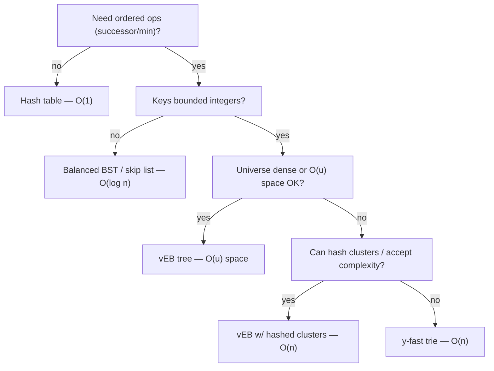
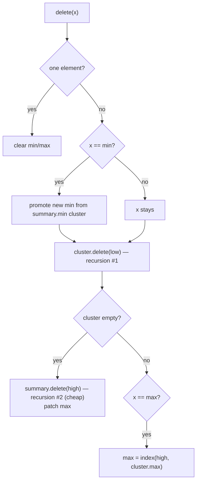

# van Emde Boas Tree (vEB) — Middle Level

> **Read time: ~40 minutes** · **Audience:** Engineers who have read `junior.md` and can trace an `insert` and a `successor` on `u = 16`. Here we explain *why* the structure achieves `O(log log u)`, implement the full `delete`, analyze the `O(u)` space, and compare vEB head-to-head with balanced BSTs and hashing so you know **when** to reach for it.

At the junior level you saw *what* a vEB tree is and *how* the high/low split, summary, and clusters fit together. At the middle level we answer the harder questions: **Why** does recursing into a single child per level produce `O(log log u)` instead of `O(log u)`? **Why** must the minimum be stored aside? **When** is `O(u)` space acceptable, and when does a plain red-black tree or a hash table win? We also implement the operation that junior deferred — `delete` — which is where the min-aside trick earns its keep and pays its tax.

---

## Table of Contents

1. [Introduction](#introduction)
2. [Deeper Concepts — The Recurrence and the min-Aside Invariant](#deeper-concepts)
3. [Comparison with Alternatives](#comparison-with-alternatives)
4. [Advanced Patterns — Full delete, predecessor, the general sqrt split](#advanced-patterns)
5. [Tree Applications — Integer Priority Queue and Sorting](#tree-applications)
6. [Dynamic Programming / Streaming Integration](#dp-integration)
7. [Code Examples — Go, Java, Python](#code-examples)
8. [Error Handling](#error-handling)
9. [Performance Analysis](#performance-analysis)
10. [Best Practices](#best-practices)
11. [Visual Animation](#visual-animation)
12. [Summary](#summary)

---

<a name="introduction"></a>
## 1. Introduction

> Focus: "Why does it work?" and "When should I choose this?"

The vEB tree is a structure that engineers *admire* more often than they *deploy*. It is the textbook example of beating the comparison-based `O(log n)` lower bound by exploiting the fact that keys are integers — the same family of ideas as radix sort, tries, and y-fast tries. To use it well you need three things: a precise understanding of the recurrence, the full `delete` implementation, and an honest picture of the space cost and cache behavior so you can decide when a humbler structure is the better engineering choice.

The single most important invariant to internalize is:

> **The minimum of a vEB node is stored only in its `min` field and is NOT present in any of its clusters. The maximum, by contrast, IS duplicated down in its cluster.**

That asymmetry is deliberate. Holding the min aside is what guarantees a single recursive call on `insert` and `successor`; keeping the max *in* its cluster is what lets `successor` cheaply test "is there anything to my right in this cluster?" by reading `cluster.max`. Everything else follows from these two choices.

---

<a name="deeper-concepts"></a>
## 2. Deeper Concepts — The Recurrence and the min-Aside Invariant

### 2.1 The recurrence, intuitively

Every operation on a `vEB(u)` does `O(1)` local work (splitting `high`/`low`, reading a field) and then makes **at most one** recursive call on a child of size `sqrt(u)`. That gives the recurrence:

```text
T(u) = T(sqrt(u)) + O(1)
```

To solve it, substitute `m = log2(u)`, so `u = 2^m` and `sqrt(u) = 2^(m/2)`. Define `S(m) = T(2^m)`. Then:

```text
S(m) = S(m/2) + O(1)
```

This is the classic "halve the parameter each step, do constant work" recurrence whose solution is `S(m) = O(log m)`. Substituting back, `m = log2(u)`, so:

```text
T(u) = O(log m) = O(log log u)
```

The square-root shrinkage of the *universe* becomes a halving of the *exponent*, and halving until you hit 1 takes `log` steps — hence `log log u`. (The full formal proof, including the careful "at most one recursive call" argument for `delete`, lives in `professional.md`.)

### 2.2 Why a single recursive call is mandatory

Suppose we were sloppy and an operation recursed into **both** the summary and a cluster:

```text
T(u) = 2·T(sqrt(u)) + O(1)
```

With `S(m) = 2·S(m/2) + O(1)`, the Master Theorem gives `S(m) = O(m)`, so `T(u) = O(log u)` — exactly a balanced BST, no improvement. The entire advantage of vEB hinges on never doing two recursive calls on the same code path. The min-aside trick is the mechanism that enforces it:

- **`insert`:** if the target cluster is empty, we update the summary (recurse) and set the cluster's `min`/`max` directly in `O(1)` — no recursion into the cluster. If the cluster is non-empty, the summary already knows it is non-empty, so we skip the summary and only recurse into the cluster. **Either way, one recursion.**
- **`successor`:** either the answer is inside the current cluster (recurse into the cluster) or it is in a later cluster (recurse into the summary, then read that cluster's `min` in `O(1)`). **One recursion.**

### 2.3 The asymmetry: min out, max in

| Field | Stored aside on the node? | Also stored in a cluster? | Why |
|---|---|---|---|
| `min` | Yes | **No** | So inserting into an empty cluster is `O(1)` and `successor` recurses once |
| `max` | Yes | **Yes** (it lives as the max of its cluster too) | So `successor` can test `low(x) < cluster.max` to decide whether to stay |

Because the min is held out, an `insert` into an empty cluster does not have to descend. Because the max is kept in, `successor` can ask a cluster "do you have anything past position `l`?" by comparing against `cluster.max` without descending. This asymmetry is the cleverest single design decision in the structure and the one most often gotten wrong on the first implementation.

### 2.4 `delete` — the one operation that can recurse twice (and why it is still fine)

`delete` is the hard case. Removing the *minimum* means promoting a new minimum from a cluster, which itself can empty a cluster and force a summary delete. The worst path looks like it recurses twice:

```text
delete(x):
    ... delete low(x) from cluster[high(x)]   (recursion #1)
    if cluster[high(x)] is now empty:
        delete high(x) from summary           (recursion #2)
```

The saving grace: **recursion #2 only happens when recursion #1 emptied the cluster**, and a cluster becomes empty only when it held exactly one element. Deleting from a one-element vEB node is `O(1)` (it just clears `min`/`max` and returns immediately — the base of recursion #1 is trivial). So although two recursive *calls* appear in the code, they cannot *both* be expensive: one of them always terminates in `O(1)`. The careful amortized/worst-case argument (in `professional.md`) shows the total stays `T(u) = T(sqrt(u)) + O(1) = O(log log u)`.

---

<a name="comparison-with-alternatives"></a>
## 3. Comparison with Alternatives

| Attribute | vEB tree | Balanced BST (red-black/AVL) | Hash table | y-fast trie |
|---|---|---|---|---|
| `member` | O(log log u) | O(log n) | **O(1)** avg | O(log log u) |
| `insert` / `delete` | O(log log u) | O(log n) | **O(1)** avg | O(log log u) amortized |
| `min` / `max` | **O(1)** | O(log n) (or O(1) with cached pointer) | not supported | O(1)* |
| `successor` / `predecessor` | O(log log u) | O(log n) | **not supported** | O(log log u) |
| Space | **O(u)** | O(n) | O(n) | **O(n)** |
| Key type | bounded integers | any comparable | any hashable | bounded integers |
| Cache behavior | poor (pointer chasing) | moderate | good | moderate |
| Implementation effort | high | medium | low | very high |

\* with an auxiliary structure.

**Choose vEB when:** keys are integers in a known bounded universe `u`; you need fast `successor`/`predecessor` (or an integer priority queue); and either the universe is dense (so `O(u)` ≈ `O(n)`) or you hash the clusters to get `O(n)` space; and `log log u` is meaningfully smaller than `log n`.

**Choose a balanced BST when:** keys are arbitrary comparables (strings, floats, big integers); `n` is small or moderate; you want predictable, cache-reasonable performance and a far simpler implementation. For most production sorted-set needs (Redis ZSET, Java `TreeMap`), a balanced tree or skip list is the pragmatic winner.

**Choose a hash table when:** you only need membership/insert/delete and **never** need order. Hashing is `O(1)` and trivial but cannot answer `successor`.

**Choose a y-fast trie when:** you want vEB's `O(log log u)` but cannot afford `O(u)` space and prefer not to hash vEB clusters. The y-fast trie achieves `O(log log u)` in guaranteed `O(n)` space by combining an x-fast trie (a hashed bit-trie) with `O(log u)`-sized balanced-BST "leaf bags". It is more complex to build but space-optimal (see `senior.md`/`professional.md`).

### Quick decision tree



---

<a name="advanced-patterns"></a>
## 4. Advanced Patterns — Full delete, predecessor, the general sqrt split

### 4.1 The general high/low split (universe = any power of two)

For a teaching universe like `u = 16` or `256`, `sqrt(u)` is an exact power of two. For a general power-of-two `u = 2^k` (e.g. `2^32`), the square root is not integral when `k` is odd. The standard fix is to split into a **high square root** and a **low square root**:

```text
upperSqrt(u) = 2^ceil(k/2)      # number of clusters
lowerSqrt(u) = 2^floor(k/2)     # size of each cluster
high(x) = x / lowerSqrt(u)
low(x)  = x % lowerSqrt(u)
index(h, l) = h * lowerSqrt(u) + l
```

When `k` is even these coincide with `sqrt(u)`. The summary has `upperSqrt(u)` slots; each cluster has size `lowerSqrt(u)`. The asymptotics are unchanged: `T(u) = T(sqrt(u)) + O(1)`.

### 4.2 `predecessor` (mirror of successor)

`predecessor(x)` is symmetric, with one extra subtlety: after failing to find a smaller cluster, you must check whether the node's own `min` is below `x` (because the min is stored aside and is not in any cluster):

```text
predecessor(x):
    if x > max: return max
    if low(x) > cluster[high(x)].min:        # answer in this cluster
        return index(high(x), cluster[high(x)].predecessor(low(x)))
    c = summary.predecessor(high(x))         # previous non-empty cluster
    if c == NIL:
        if min != NIL and x > min: return min   # the aside min!
        return NIL
    return index(c, cluster[c].max)
```

The `min`-aside special case in the `c == NIL` branch is the classic predecessor bug — forget it and `predecessor` of small keys returns `NIL` incorrectly.

### 4.3 Full `delete`

```text
delete(x):
    if min == max:               # only one element
        min = max = NIL
        return
    if u == 2:                   # base case, two possible elements
        min = max = (x == 0 ? 1 : 0)
        return
    if x == min:                 # deleting the aside min: promote a new one
        firstCluster = summary.min
        x = index(firstCluster, cluster[firstCluster].min)
        min = x                  # new min is the smallest real element
    cluster[high(x)].delete(low(x))          # recursion #1
    if cluster[high(x)].min == NIL:          # cluster became empty
        summary.delete(high(x))              # recursion #2 (cheap path only)
        if x == max:                         # fix max if we removed it
            summaryMax = summary.max
            if summaryMax == NIL: max = min
            else: max = index(summaryMax, cluster[summaryMax].max)
    else if x == max:                        # max was in a still-nonempty cluster
        max = index(high(x), cluster[high(x)].max)
```

The structure of `delete`:

1. Handle the one-element and base cases up front.
2. If deleting the **aside min**, promote the smallest real element to be the new `min`, and continue deleting *that* element from its cluster (it is a duplicate down there once promoted).
3. Delete from the cluster.
4. If the cluster emptied, remove it from the summary, and patch `max` if necessary.



---

<a name="tree-applications"></a>
## 5. Tree Applications — Integer Priority Queue and Sorting

### 5.1 Integer priority queue

A min-priority-queue over integer keys is just a vEB tree:

- `push(x)` = `insert(x)`
- `peekMin()` = `min()` — **O(1)**
- `popMin()` = read `min()`, then `delete(min())` — **O(log log u)**

For `u = 2^16`, every push/pop is at most 4 levels. Compared to a binary heap (`O(log n)` push/pop, no ordered iteration) the vEB PQ additionally gives you `successor`/`predecessor` and `max` for free.

### 5.2 Sorting bounded integers

Insert all `n` distinct integers from `{0..u-1}`, then walk `min, successor(min), successor(...), ...` to emit them in order:

```text
veb-sort(keys):
    for k in keys: T.insert(k)
    x = T.min()
    while x != NIL:
        emit(x)
        x = T.successor(x)
```

This is `O(n · log log u)` time (plus `O(u)` build/space) — competitive with comparison sorts for large `n` when `u` is bounded, and it gives an *online* sorted structure as a bonus.

---

<a name="dp-integration"></a>
## 6. Dynamic Programming / Streaming Integration

vEB trees shine in **streaming / online** settings where you must repeatedly query the nearest neighbor of an integer.

**Problem.** A stream of integer events in `{0..u-1}`; after each event, report the closest already-seen event (nearest neighbor by value). Maintain a vEB tree; for each new `x`, compute `predecessor(x)` and `successor(x)` and take whichever is closer — each query `O(log log u)`.

#### Go

```go
func nearestSoFar(stream []int, u int) []int {
    t := New(u)
    out := make([]int, len(stream))
    for i, x := range stream {
        p, s := t.Predecessor(x), t.Successor(x)
        out[i] = closer(x, p, s)
        t.Insert(x)
    }
    return out
}

func closer(x, p, s int) int {
    if p == NIL { return s }
    if s == NIL { return p }
    if x-p <= s-x { return p }
    return s
}
```

#### Java

```java
static int[] nearestSoFar(int[] stream, int u) {
    VEB t = new VEB(u);
    int[] out = new int[stream.length];
    for (int i = 0; i < stream.length; i++) {
        int x = stream[i];
        int p = t.predecessor(x), s = t.successor(x);
        out[i] = closer(x, p, s);
        t.insert(x);
    }
    return out;
}
static int closer(int x, int p, int s) {
    if (p == VEB.NIL) return s;
    if (s == VEB.NIL) return p;
    return (x - p <= s - x) ? p : s;
}
```

#### Python

```python
def nearest_so_far(stream, u):
    t = VEB(u)
    out = []
    for x in stream:
        p, s = t.predecessor(x), t.successor(x)
        out.append(_closer(x, p, s))
        t.insert(x)
    return out

def _closer(x, p, s):
    if p == VEB.NIL: return s
    if s == VEB.NIL: return p
    return p if x - p <= s - x else s
```

---

<a name="code-examples"></a>
## 7. Code Examples — Go, Java, Python

Below is the **complete** vEB tree (member, insert, delete, min, max, successor, predecessor) using the general high-sqrt/low-sqrt split, so it works for any power-of-two universe.

#### Go

```go
package veb

const NIL = -1

type VEB struct {
    u, lowerSqrt, upperSqrt int
    min, max                int
    summary                 *VEB
    cluster                 []*VEB
}

func New(u int) *VEB {
    t := &VEB{u: u, min: NIL, max: NIL}
    if u <= 2 {
        return t
    }
    k := bitsOf(u)               // u = 2^k
    t.lowerSqrt = 1 << (k / 2)   // 2^floor(k/2): cluster size
    t.upperSqrt = 1 << ((k + 1) / 2) // 2^ceil(k/2): number of clusters
    t.summary = New(t.upperSqrt)
    t.cluster = make([]*VEB, t.upperSqrt)
    for i := range t.cluster {
        t.cluster[i] = New(t.lowerSqrt)
    }
    return t
}

func bitsOf(u int) int { b := 0; for (1 << b) < u { b++ }; return b }

func (t *VEB) high(x int) int     { return x / t.lowerSqrt }
func (t *VEB) low(x int) int      { return x % t.lowerSqrt }
func (t *VEB) index(h, l int) int { return h*t.lowerSqrt + l }

func (t *VEB) Min() int { return t.min }
func (t *VEB) Max() int { return t.max }

func (t *VEB) Member(x int) bool {
    if x == t.min || x == t.max {
        return true
    }
    if t.u <= 2 {
        return false
    }
    return t.cluster[t.high(x)].Member(t.low(x))
}

func (t *VEB) emptyInsert(x int) { t.min, t.max = x, x }

func (t *VEB) Insert(x int) {
    if t.min == NIL {
        t.emptyInsert(x)
        return
    }
    if x < t.min {
        x, t.min = t.min, x
    }
    if t.u > 2 {
        h, l := t.high(x), t.low(x)
        if t.cluster[h].min == NIL {
            t.summary.Insert(h)
            t.cluster[h].emptyInsert(l)
        } else {
            t.cluster[h].Insert(l)
        }
    }
    if x > t.max {
        t.max = x
    }
}

func (t *VEB) Successor(x int) int {
    if t.u <= 2 {
        if x == 0 && t.max == 1 {
            return 1
        }
        return NIL
    }
    if t.min != NIL && x < t.min {
        return t.min
    }
    h, l := t.high(x), t.low(x)
    if t.cluster[h].max != NIL && l < t.cluster[h].max {
        return t.index(h, t.cluster[h].Successor(l))
    }
    c := t.summary.Successor(h)
    if c == NIL {
        return NIL
    }
    return t.index(c, t.cluster[c].min)
}

func (t *VEB) Predecessor(x int) int {
    if t.u <= 2 {
        if x == 1 && t.min == 0 {
            return 0
        }
        return NIL
    }
    if t.max != NIL && x > t.max {
        return t.max
    }
    h, l := t.high(x), t.low(x)
    if t.cluster[h].min != NIL && l > t.cluster[h].min {
        return t.index(h, t.cluster[h].Predecessor(l))
    }
    c := t.summary.Predecessor(h)
    if c == NIL {
        if t.min != NIL && x > t.min {
            return t.min
        }
        return NIL
    }
    return t.index(c, t.cluster[c].max)
}

func (t *VEB) Delete(x int) {
    if t.min == t.max {
        t.min, t.max = NIL, NIL
        return
    }
    if t.u <= 2 {
        if x == 0 {
            t.min = 1
        } else {
            t.min = 0
        }
        t.max = t.min
        return
    }
    if x == t.min {
        first := t.summary.min
        x = t.index(first, t.cluster[first].min)
        t.min = x
    }
    h := t.high(x)
    t.cluster[h].Delete(t.low(x))
    if t.cluster[h].min == NIL {
        t.summary.Delete(h)
        if x == t.max {
            sm := t.summary.max
            if sm == NIL {
                t.max = t.min
            } else {
                t.max = t.index(sm, t.cluster[sm].max)
            }
        }
    } else if x == t.max {
        t.max = t.index(h, t.cluster[h].max)
    }
}
```

#### Java

```java
public final class VEB {
    static final int NIL = -1;
    final int u, lowerSqrt, upperSqrt;
    int min = NIL, max = NIL;
    VEB summary; VEB[] cluster;

    public VEB(int u) {
        this.u = u;
        if (u <= 2) { lowerSqrt = upperSqrt = 0; return; }
        int k = bitsOf(u);
        lowerSqrt = 1 << (k / 2);
        upperSqrt = 1 << ((k + 1) / 2);
        summary = new VEB(upperSqrt);
        cluster = new VEB[upperSqrt];
        for (int i = 0; i < upperSqrt; i++) cluster[i] = new VEB(lowerSqrt);
    }
    static int bitsOf(int u){ int b=0; while((1<<b)<u) b++; return b; }

    int high(int x){ return x / lowerSqrt; }
    int low(int x){ return x % lowerSqrt; }
    int index(int h,int l){ return h*lowerSqrt + l; }

    public int min(){ return min; }
    public int max(){ return max; }

    public boolean member(int x){
        if (x==min || x==max) return true;
        if (u<=2) return false;
        return cluster[high(x)].member(low(x));
    }
    private void emptyInsert(int x){ min=x; max=x; }

    public void insert(int x){
        if (min==NIL){ emptyInsert(x); return; }
        if (x<min){ int t=min; min=x; x=t; }
        if (u>2){
            int h=high(x), l=low(x);
            if (cluster[h].min==NIL){ summary.insert(h); cluster[h].emptyInsert(l); }
            else cluster[h].insert(l);
        }
        if (x>max) max=x;
    }

    public int successor(int x){
        if (u<=2){ return (x==0 && max==1) ? 1 : NIL; }
        if (min!=NIL && x<min) return min;
        int h=high(x), l=low(x);
        if (cluster[h].max!=NIL && l<cluster[h].max)
            return index(h, cluster[h].successor(l));
        int c=summary.successor(h);
        if (c==NIL) return NIL;
        return index(c, cluster[c].min);
    }

    public int predecessor(int x){
        if (u<=2){ return (x==1 && min==0) ? 0 : NIL; }
        if (max!=NIL && x>max) return max;
        int h=high(x), l=low(x);
        if (cluster[h].min!=NIL && l>cluster[h].min)
            return index(h, cluster[h].predecessor(l));
        int c=summary.predecessor(h);
        if (c==NIL){ return (min!=NIL && x>min) ? min : NIL; }
        return index(c, cluster[c].max);
    }

    public void delete(int x){
        if (min==max){ min=max=NIL; return; }
        if (u<=2){ min = (x==0)?1:0; max=min; return; }
        if (x==min){ int first=summary.min; x=index(first, cluster[first].min); min=x; }
        int h=high(x);
        cluster[h].delete(low(x));
        if (cluster[h].min==NIL){
            summary.delete(h);
            if (x==max){
                int sm=summary.max;
                max = (sm==NIL) ? min : index(sm, cluster[sm].max);
            }
        } else if (x==max){
            max = index(h, cluster[h].max);
        }
    }
}
```

#### Python

```python
class VEB:
    NIL = -1
    def __init__(self, u):
        self.u = u
        self.min = self.max = self.NIL
        if u <= 2:
            self.lower = self.upper = 0
            self.summary = None; self.cluster = []
            return
        k = (u - 1).bit_length()           # u = 2^k
        self.lower = 1 << (k // 2)
        self.upper = 1 << ((k + 1) // 2)
        self.summary = VEB(self.upper)
        self.cluster = [VEB(self.lower) for _ in range(self.upper)]

    def high(self, x): return x // self.lower
    def low(self, x):  return x % self.lower
    def index(self, h, l): return h * self.lower + l

    def member(self, x):
        if x == self.min or x == self.max: return True
        if self.u <= 2: return False
        return self.cluster[self.high(x)].member(self.low(x))

    def _empty_insert(self, x): self.min = self.max = x

    def insert(self, x):
        if self.min == self.NIL: self._empty_insert(x); return
        if x < self.min: x, self.min = self.min, x
        if self.u > 2:
            h, l = self.high(x), self.low(x)
            if self.cluster[h].min == self.NIL:
                self.summary.insert(h); self.cluster[h]._empty_insert(l)
            else:
                self.cluster[h].insert(l)
        if x > self.max: self.max = x

    def successor(self, x):
        if self.u <= 2:
            return 1 if (x == 0 and self.max == 1) else self.NIL
        if self.min != self.NIL and x < self.min: return self.min
        h, l = self.high(x), self.low(x)
        if self.cluster[h].max != self.NIL and l < self.cluster[h].max:
            return self.index(h, self.cluster[h].successor(l))
        c = self.summary.successor(h)
        if c == self.NIL: return self.NIL
        return self.index(c, self.cluster[c].min)

    def predecessor(self, x):
        if self.u <= 2:
            return 0 if (x == 1 and self.min == 0) else self.NIL
        if self.max != self.NIL and x > self.max: return self.max
        h, l = self.high(x), self.low(x)
        if self.cluster[h].min != self.NIL and l > self.cluster[h].min:
            return self.index(h, self.cluster[h].predecessor(l))
        c = self.summary.predecessor(h)
        if c == self.NIL:
            return self.min if (self.min != self.NIL and x > self.min) else self.NIL
        return self.index(c, self.cluster[c].max)

    def delete(self, x):
        if self.min == self.max: self.min = self.max = self.NIL; return
        if self.u <= 2:
            self.min = 1 if x == 0 else 0
            self.max = self.min; return
        if x == self.min:
            first = self.summary.min
            x = self.index(first, self.cluster[first].min)
            self.min = x
        h = self.high(x)
        self.cluster[h].delete(self.low(x))
        if self.cluster[h].min == self.NIL:
            self.summary.delete(h)
            if x == self.max:
                sm = self.summary.max
                self.max = self.min if sm == self.NIL else self.index(sm, self.cluster[sm].max)
        elif x == self.max:
            self.max = self.index(h, self.cluster[h].max)
```

---

<a name="error-handling"></a>
## 8. Error Handling

| Scenario | What goes wrong | Correct approach |
|---|---|---|
| Universe not a power of two | `bitsOf`/sqrt split misbehaves | Pad `u` up to the next power of two at construction |
| Deleting absent key | Corrupts min/max bookkeeping | `member`-check before delete, or document delete-must-exist precondition |
| Inserting a duplicate | Min/max double-counted | `member`-check first; vEB models a set |
| Predecessor forgets aside-min | Small keys return NIL wrongly | Add the `x > min` special case in the `c == NIL` branch |
| Promoting min on delete forgets to continue | New min still duplicated in cluster | After promoting, continue deleting the promoted value from its cluster |

---

<a name="performance-analysis"></a>
## 9. Performance Analysis

### 9.1 Time: the numbers

| `u` | `log log u` (vEB ops) | `log n` for `n = 10^6` (BST) |
|---|---|---|
| 2^16 | 4 | ~20 |
| 2^32 | 5 | ~20 |
| 2^64 | 6 | ~20 |

On paper vEB crushes the BST. In practice the constant factor and cache behavior often erase the win — see 9.3.

### 9.2 Space: where it hurts

A basic `vEB(u)` allocates `sqrt(u)` cluster objects, each `vEB(sqrt(u))`, recursively. Solving the space recurrence `Space(u) = (sqrt(u)+1)·Space(sqrt(u)) + O(sqrt(u))` yields **`Space(u) = O(u)`**. Concretely, a `vEB(2^32)` would want on the order of billions of node objects whether you store one key or a billion. That is why the basic form is only usable for modest `u` (say up to `2^20`–`2^24`), and why **hashed clusters** (allocate a cluster only when first used → `O(n)` space) or the **y-fast trie** are the real-world choices for large universes.

### 9.3 Cache behavior — the practical caveat

vEB nodes are tiny and heap-scattered; each level of recursion is a pointer dereference to a fresh cache line. For the universes where `log log u` is small (4–6), a **flat sorted array with binary search** (`O(log n)` but contiguous, cache-friendly) or a **B-tree / 4-ary heap** frequently *outperforms* a vEB tree on real hardware, because the vEB's pointer chasing incurs more cache misses than its asymptotic advantage saves. The cache-friendly cousin — the **van Emde Boas memory layout** — borrows the recursive-split idea purely for data placement and is genuinely fast, but that is a layout technique, not the dynamic dictionary studied here. Senior-level guidance: **benchmark before deploying a vEB tree; it often loses to simpler structures in practice.**

### 9.4 Benchmark harness

#### Go

```go
func benchmark() {
    u := 1 << 16
    t := New(u)
    for i := 0; i < 30000; i++ {
        t.Insert((i * 2654435761) % u) // pseudo-random keys
    }
    start := time.Now()
    sum := 0
    for q := 0; q < 1_000_000; q++ {
        sum += t.Successor(q % u)
    }
    fmt.Printf("1e6 successors: %v (checksum %d)\n", time.Since(start), sum)
}
```

#### Java

```java
static void benchmark() {
    int u = 1 << 16;
    VEB t = new VEB(u);
    for (int i = 0; i < 30000; i++) t.insert((int)(((long)i * 2654435761L) % u));
    long start = System.nanoTime();
    long sum = 0;
    for (int q = 0; q < 1_000_000; q++) sum += t.successor(q % u);
    System.out.printf("1e6 successors: %.1f ms (cs %d)%n",
        (System.nanoTime()-start)/1e6, sum);
}
```

#### Python

```python
import time
def benchmark():
    u = 1 << 16
    t = VEB(u)
    for i in range(30000):
        t.insert((i * 2654435761) % u)
    start = time.perf_counter()
    s = 0
    for q in range(1_000_000):
        s += t.successor(q % u)
    print(f"1e6 successors: {(time.perf_counter()-start)*1000:.1f} ms (cs {s})")
```

---

<a name="best-practices"></a>
## 10. Best Practices

- **Implement and test in order:** member → insert → successor → predecessor → delete. Delete is the bug magnet.
- **Always test against a reference `TreeSet`/sorted list** with randomized op sequences.
- **Prefer hashed clusters or a y-fast trie** for any universe larger than ~`2^24`.
- **Benchmark vs a sorted array / B-tree** for your real `u` and access pattern before committing — vEB frequently loses on cache.
- **Use shift/mask, not divide/mod**, when `lowerSqrt` is a power of two.
- **Document the min-aside and max-in-cluster invariants** at the top of the file.

---

<a name="visual-animation"></a>
## 11. Visual Animation

> See [`animation.html`](./animation.html) for the interactive vEB visualization.
>
> Middle-level focus:
> - The **summary + clusters** recursion, with the aside `min`/`max` shown on each node
> - An **insert** that lands in an empty cluster (summary update + O(1) cluster set) vs a non-empty cluster (recurse)
> - A **successor** that jumps to the next non-empty cluster via the summary
> - The single-recursive-call path highlighted to show why it is `O(log log u)` and not `O(log u)`

---

<a name="summary"></a>
## 12. Summary

- The recurrence `T(u) = T(sqrt(u)) + O(1)` solves to **`O(log log u)`** because the square-root shrink of the universe is a halving of the exponent, and halving takes `log` steps.
- That recurrence holds **only because each operation makes a single recursive call**, which the **min-aside** invariant guarantees. The **max stays in its cluster** so `successor` can test "anything to my right?" in `O(1)`.
- `delete` is the subtle operation: it can appear to recurse twice, but the second recursion only fires when the first emptied a one-element cluster (an `O(1)` path), so the total is still `O(log log u)`.
- Basic vEB uses **`O(u)` space**; use **hashed clusters** or a **y-fast trie** for `O(n)`.
- vEB beats a BST asymptotically for bounded-integer keys, but **cache behavior often makes simpler structures faster in practice** — benchmark first.

**Next step:** Continue with [`senior.md`](./senior.md) to architect integer-priority-queue and routing systems around vEB, reduce space with hashed clusters and the y-fast trie, and weigh cache behavior in production.
