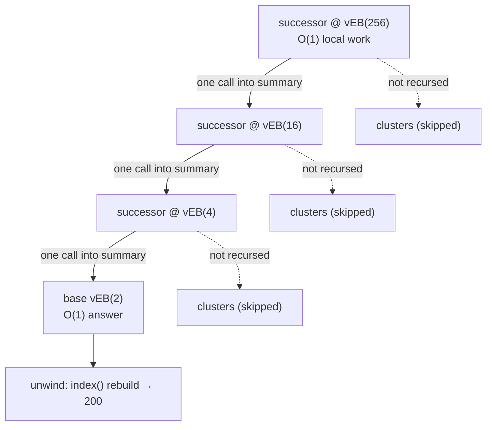

# van Emde Boas Tree (vEB) — Mathematical Foundations and Complexity Theory

> **Read time: ~40 minutes** · **Audience:** Engineers who want the proofs. We give the formal definition, prove `T(u) = T(sqrt(u)) + O(1) = O(log log u)` rigorously, establish the **single-recursive-call** property for every operation (the crux — including the delicate `delete` case), derive the `O(u)` space bound, and place vEB inside the integer-predecessor complexity landscape against the y-fast trie and the Pătraşcu–Thorup lower bounds.

This document assumes everything in `junior.md`–`senior.md`. It is the "is this provably correct and provably fast?" level. Throughout, `u` denotes the universe size, assumed a power of two; `n` the number of stored keys; `log` is base 2 unless noted.

---

## Table of Contents

1. [Formal Definition](#formal-definition)
2. [Correctness — Invariants and Operation Proofs](#correctness)
3. [The Single-Recursive-Call Theorem](#single-call)
4. [Time Complexity — Solving T(u) = T(√u) + O(1)](#time)
5. [A Fully Worked Recursion Trace](#worked-trace)
6. [Amortized / Worst-Case Analysis of delete](#delete-analysis)
7. [Potential-Function View of Hashed-Cluster vEB](#potential)
8. [Space Complexity — The O(u) Bound and Its Reduction](#space)
9. [The Integer-Predecessor Landscape — y-fast Trie and Lower Bounds](#landscape)
10. [Comparison with Alternatives](#comparison)
11. [Summary](#summary)

---

<a name="formal-definition"></a>
## 1. Formal Definition

```text
Definition (vEB tree). A van Emde Boas tree over universe U = {0,...,u-1},
u = 2^k, is a recursively defined object V(u):

  V(2):  a record (min, max) with min, max ∈ {0, 1, NIL}.
  V(u), u > 2:  a record
        min     ∈ U ∪ {NIL}
        max     ∈ U ∪ {NIL}
        summary : V(√⁺u)                 where √⁺u = 2^⌈k/2⌉  (upper sqrt)
        cluster : array[0 .. √⁺u − 1] of V(√⁻u),  √⁻u = 2^⌊k/2⌋ (lower sqrt)

  with the index decomposition for x ∈ U:
        high(x) = ⌊x / √⁻u⌋,  low(x) = x mod √⁻u,  index(h,ℓ) = h·√⁻u + ℓ.

The SET of keys represented by V, denoted keys(V), is defined recursively:

  keys(V(2))    = {min, max} \ {NIL}
  keys(V(u))    = {min} \ {NIL}
                ∪ { index(i, y) : 0 ≤ i < √⁺u, y ∈ keys(cluster[i]) }
```

Note carefully: in the recursive case the node's **min is included directly** and is **not** drawn from any cluster — this is the formal statement of the "min stored aside" design. The max, by contrast, equals `index(j, cluster[j].max)` for the largest non-empty `j` (it *is* present in a cluster).

```text
Structural Invariants (must hold after every operation):

  (I1) summary, min, max consistency:
        keys(V) = ∅  ⟺  min = NIL  ⟺  max = NIL.
  (I2) min/max bounds:
        if keys(V) ≠ ∅ then min = minimum(keys(V)) and max = maximum(keys(V)).
  (I3) min-aside:
        for all i, min ∉ { index(i, y) : y ∈ keys(cluster[i]) };
        i.e., the global minimum is NOT stored inside any cluster.
  (I4) summary tracks non-emptiness:
        i ∈ keys(summary)  ⟺  keys(cluster[i]) ≠ ∅.
  (I5) base case: V(2) stores its set entirely in (min, max).
```

Invariants (I3) and (I4) are the load-bearing ones for the complexity proof. (I3) lets `insert`/`successor` avoid one recursion; (I4) lets the summary act as an `O(log log u)` directory of non-empty clusters.

---

<a name="correctness"></a>
## 2. Correctness — Invariants and Operation Proofs

### 2.1 successor correctness

```text
Claim. SUCCESSOR(V, x) returns min{ y ∈ keys(V) : y > x }, or NIL if none.

Proof (induction on u).

Base u = 2: keys ⊆ {0,1}. The only possible (x, answer) with answer > x is
  x = 0, answer = 1, which requires 1 ∈ keys ⟺ max = 1. The code returns 1
  exactly in that case, NIL otherwise. ✓

Inductive step (u > 2), assume the claim for V(√u):

  Case A: x < min. By (I2) min is the smallest key, and min > x, so the
    successor is min. Code returns min. ✓

  Case B: x ≥ min. Let h = high(x), ℓ = low(x).
    Subcase B1: cluster[h].max ≠ NIL and ℓ < cluster[h].max.
      Then a key with the same high-part h and low-part > ℓ exists. The
      smallest such has low-part SUCCESSOR(cluster[h], ℓ), correct by the IH.
      Its value is index(h, that), which is the global successor because any
      key with high-part = h and low-part > ℓ is smaller than any key with
      high-part > h. ✓
    Subcase B2: otherwise no key in cluster h exceeds ℓ. The successor lies in
      the next non-empty cluster c = SUCCESSOR(summary, h) (correct by IH on
      the summary and (I4)). The smallest key there is cluster[c].min, so the
      answer is index(c, cluster[c].min); NIL if c = NIL. ✓
QED.
```

`predecessor` is symmetric, with the extra final check `x > min ⇒ return min` covering the min-aside element (which lives in no cluster, so the cluster/summary search can miss it).

### 2.2 insert correctness and invariant preservation

```text
Claim. INSERT(V, x), for x ∉ keys(V), yields keys(V) ∪ {x} and re-establishes
(I1)–(I5).

Proof sketch (induction on u).
  - Empty node: set min = max = x. (I1)–(I5) trivially hold.
  - x < min: swap so the new global minimum becomes min (preserving I2, I3),
    and the OLD min is now the value to be inserted into a cluster.
  - Place x into cluster[high(x)]:
      * if that cluster was empty, INSERT(summary, high(x)) (restores I4) and
        set cluster[high(x)].min = cluster[high(x)].max = low(x) directly.
        This does NOT recurse into the cluster — preserving the single-call
        property — and the direct set re-establishes (I2) for the cluster.
      * else recurse INSERT(cluster[high(x)], low(x)); IH gives correctness.
  - update max if x > max (I2).
All invariants restored. ✓
```

---

<a name="single-call"></a>
## 3. The Single-Recursive-Call Theorem

This is the heart of the analysis. Define a *recursive call* as a call from `OP(V(u))` to `OP'(W)` where `W` is `summary` or some `cluster[i]`, both of size `≤ √u`.

```text
Theorem (Single Call). For OP ∈ {member, insert, successor, predecessor},
every invocation OP(V(u)) makes AT MOST ONE recursive call (on a child of
universe size √u). For delete, every invocation makes calls whose recursive
WORK satisfies the recurrence T(u) = T(√u) + O(1) (proved in §5).
```

```text
Proof for insert. Exactly one of three branches executes:
  (a) node empty           → O(1), NO recursion;
  (b) target cluster empty → INSERT(summary, h) [ONE call] + O(1) direct set;
  (c) target cluster nonempty → INSERT(cluster[h], low) [ONE call].
By (I4), branches (b) and (c) are mutually exclusive (the summary already
encodes whether the cluster is empty), so never both a summary AND a cluster
recursion. Hence ≤ 1 recursive call. ∎

Proof for successor. Subcase B1 makes one call (into cluster[h]); subcase B2
makes one call (into summary) followed by an O(1) read of cluster[c].min — NOT
a recursive OP call, just a field read. Case A makes none. ≤ 1 call. ∎

member: descends into exactly cluster[high(x)] or returns from min/max — ≤ 1. ∎
predecessor: symmetric to successor — ≤ 1. ∎
```

The crucial structural fact making `successor`'s subcase B2 cost only one *recursive* call is (I2)/(I3): `cluster[c].min` is a field, readable in `O(1)`, precisely because the min is stored aside rather than requiring a recursive `MINIMUM` descent.

---

<a name="time"></a>
## 4. Time Complexity — Solving T(u) = T(√u) + O(1)

By the Single-Call Theorem, for `OP ∈ {member, insert, successor, predecessor}`:

```text
T(u) = T(√u) + O(1),   T(2) = O(1).
```

### 4.1 Solution by exponent substitution

```text
Let m = log₂ u, so u = 2^m and √u = 2^{m/2}. Define S(m) = T(2^m). Then

      S(m) = S(m/2) + O(1),   S(1) = O(1).

Unrolling:  S(m) = S(m/2) + c
                  = S(m/4) + 2c
                  = ...
                  = S(m / 2^t) + t·c.
The recursion reaches the base S(1) when m / 2^t = 1, i.e. t = log₂ m.
Therefore  S(m) = O(log₂ m).

Back-substitute m = log₂ u:
      T(u) = S(log₂ u) = O(log₂ log₂ u) = O(log log u).   ∎
```

### 4.2 Why two calls would have ruined it (contrast)

```text
If an operation recursed into BOTH summary and a cluster:
      T(u) = 2·T(√u) + O(1)  ⇒  S(m) = 2·S(m/2) + O(1).
By the Master Theorem (a=2, b=2, f(m)=O(1)):  S(m) = Θ(m), so T(u) = Θ(log u).
```

This is the formal version of the slogan from `middle.md`: a second recursive call would demote vEB to balanced-BST time. The min-aside invariant (I3) is exactly what forbids the second call.

### 4.3 The general (non-perfect-square) universe

When `k = log u` is odd, the high/low split uses `√⁺u = 2^⌈k/2⌉` and `√⁻u = 2^⌊k/2⌋`, both `≤ 2^{⌈k/2⌉}`. The recurrence becomes `T(u) ≤ T(2^{⌈k/2⌉}) + O(1)`, i.e. `S(m) ≤ S(⌈m/2⌉) + O(1)`, whose solution is still `O(log m) = O(log log u)`. The asymptotics are unaffected by the rounding.

### 4.4 Stack depth and an iterative reformulation

Because each operation makes a single tail-ish recursive call per level, the maximum recursion depth equals the number of universe-halvings of the exponent:

```text
depth(u) = ⌈log₂ log₂ u⌉.
For u = 2^64:  log₂ 64 = 6  ⇒  depth ≤ 6.
For u = 2^32:  log₂ 32 = 5  ⇒  depth ≤ 5.
```

The recursion depth is therefore **a tiny constant in any realistic universe** (≤ 6), so stack overflow is never a concern — unlike, say, an unbalanced BST whose depth can reach `n`. This bounded depth also means an iterative reformulation is possible but rarely worthwhile: one would precompute, for a query key `x`, the chain of `(high, low)` decompositions at each level (a fixed-length array of length `depth(u)`), then walk it. The constant-factor savings over recursion are negligible because `depth(u) ≤ 6`; the recursive form is clearer and just as fast.

A formal statement:

```text
Lemma (depth bound). Any single member/insert/successor/predecessor on V(u)
performs at most ⌈log₂ log₂ u⌉ nested recursive activations, each using O(1)
stack space. Hence auxiliary space per operation is O(log log u) words on the
call stack — itself a tiny constant, dominated entirely by the O(u) (or O(n))
structural space.

Proof. By §3 each level makes ≤ 1 recursive call, and §4.1 shows the exponent
halves each level, reaching the base after ⌈log₂ log₂ u⌉ levels. The activation
record at each level stores O(1) locals (h, ℓ, a child reference). ∎
```

This is the rigorous version of the junior-level slogan "five steps for 32-bit keys": the call stack is never more than `log log u` deep, and `log log u ≤ 6` for every universe you will ever index.

---

<a name="worked-trace"></a>
## 5. A Fully Worked Recursion Trace

To make the `T(u) = T(√u) + O(1)` recurrence concrete, trace `successor` on a **three-level** universe `u = 2^8 = 256`. Here `√⁺u = √⁻u = 16`, and each cluster of size 16 itself recurses to `√16 = 4`, then `√4 = 2` (base). So the recursion depth is `log log 256 = log 8 = 3`.

```text
Setup: keys present = {5, 200}.  high/low at level u=256 use √⁻u = 16:
   5   → high=0,  low=5     (cluster 0, which is a vEB(16))
   200 → high=12, low=8     (cluster 12, a vEB(16))
   summary(256) contains {0, 12}.
   root.min = 5, root.max = 200.

Query: successor(5).

Level u=256:
   x=5 ≥ min=5, so not Case A.
   h = high(5) = 0, ℓ = low(5) = 5.
   cluster[0].max = 5 (only key 5 lives there, as low=5).
   Test ℓ < cluster[0].max → 5 < 5 is FALSE  ⇒ no successor inside cluster 0.
   ⇒ recurse into summary: SUCCESSOR(summary(16), h=0).            ← the ONE call

   Level u=16 (the summary):
      summary holds {0, 12}.  x=0 ≥ min=0.
      h' = high(0) = 0, ℓ' = low(0) = 0   (√⁻16 = 4).
      cluster[0].max within summary: cluster 0 of the summary holds low-part 0
        (representing summary-key 0), max = 0. Test 0 < 0 FALSE.
      ⇒ recurse into summary-of-summary: SUCCESSOR(vEB(4), 0).      ← the ONE call

         Level u=4:
            holds {0, 3}  (because summary-keys 0 and 12 → high parts 0 and 3).
            x=0 ≥ min=0.  h''=high(0)=0, ℓ''=low(0)=0  (√⁻4 = 2).
            cluster[0].max = 0. Test 0 < 0 FALSE.
            ⇒ recurse into summary: SUCCESSOR(vEB(2), 0).           ← the ONE call

               Level u=2 (BASE):
                  x=0, max=1? cluster-summary of size 2 has bit 1 set
                  (representing high-part 3 present) ⇒ returns 1.

            back at u=4: succ-cluster c=1 ⇒ answer = index(1, cluster[1].min)
                       = index(1, 0) = 2  (summary-key high-part 3 lives here).
      back at u=16: succ-cluster c=2... etc. resolves to summary-key 12.
   back at u=256: succ-cluster = 12 ⇒ answer = index(12, cluster[12].min)
                = index(12, 8) = 12·16 + 8 = 200.   ✓
```

The single-call recursion chain visualized — note exactly **one** child entered per level (the dashed siblings are never recursed into):



Count the recursive calls along the deepest path: `256 → 16 → 4 → 2`, exactly **3 = log log 256** calls, each doing `O(1)` local work (one `high`/`low` split, one field comparison, one field read). This is the recurrence `T(256) = T(16) + O(1)`, `T(16) = T(4) + O(1)`, `T(4) = T(2) + O(1)`, `T(2) = O(1)` — unrolling to `3·O(1) = O(log log u)`. **At no node did we recurse into both a cluster and the summary**: each level chose exactly one child, exactly as the Single-Call Theorem guarantees.

---

<a name="delete-analysis"></a>
## 6. Amortized / Worst-Case Analysis of delete

`delete` is the operation whose code contains **two** recursive calls, so the Single-Call argument needs refinement. The two potential calls are:

```text
  (R1)  cluster[high(x)].delete(low(x))
  (R2)  summary.delete(high(x))         -- only if (R1) emptied the cluster
```

```text
Lemma (delete recurrence). DELETE(V(u)) satisfies T(u) = T(√u) + O(1),
hence T(u) = O(log log u) in the WORST case.

Proof. Consider when (R2) executes: only if, after (R1), keys(cluster[h]) = ∅.
A vEB node becomes empty exactly when it had a single element before the
delete. DELETE on a single-element node executes the first guard
"if min == max: min = max = NIL; return" — which is O(1) and makes NO recursive
call. Therefore whenever (R2) runs, (R1) was an O(1) leaf-style deletion that
itself recursed no further.

Define the cost C(u) of DELETE on V(u). There are two regimes:
  • (R1) did NOT empty the cluster: only (R1) runs ⇒ C(u) = C(√u) + O(1).
  • (R1) DID empty the cluster: (R1) cost O(1) (single-element deletion path),
    and (R2) runs once ⇒ C(u) = O(1) + C_summary(√u) + O(1) = C(√u) + O(1).

In both regimes C(u) ≤ C(√u) + O(1). (The min-promotion step that may precede
(R1) is O(1): reading summary.min and cluster[summary.min].min are field reads.)
By the same exponent substitution as §4, C(u) = O(log log u). ∎
```

The key insight, made rigorous: **the two textual recursive calls never both do super-constant work on the same invocation.** Exactly one of them is non-trivial; the other either does not run or terminates immediately on a one-element node. So although `delete`'s code is not literally "single-call", its *recursive work* obeys `T(u) = T(√u) + O(1)`, giving worst-case `O(log log u)` — no amortization needed.

### 6.1 delete preserves the invariants (sketch)

```text
Claim. After DELETE(V, x) with x ∈ keys(V), invariants (I1)–(I5) hold and
keys(V) shrinks by exactly {x}.

Proof outline, by the structure of the code:

  (a) min == max: the set was {x}. Setting both to NIL gives keys = ∅,
      restoring (I1)/(I2) (empty ⇔ NIL).

  (b) u = 2 base: set was {0,1} (since min≠max), removing x leaves the other
      element; setting min=max=other restores (I2) and (I5).

  (c) x == min (aside element removed): we promote
        x' = index(summary.min, cluster[summary.min].min),
      the SMALLEST remaining real key (correct by (I2) on summary and on that
      cluster), and set min = x'. We then DELETE x' from its cluster so it is
      no longer duplicated below — re-establishing (I3) (the new min lives only
      aside). The recursion now removes x' from the cluster, handled by (d).

  (d) cluster removal: DELETE(cluster[high(x)], low(x)) removes the low-part by
      the induction hypothesis. Two cases re-establish (I4) and (I2):
        • cluster became empty ⇒ DELETE(summary, high(x)) restores (I4)
          (summary now omits the empty cluster); patch max if x was the max.
        • cluster non-empty ⇒ (I4) already correct; if x was max, recompute
          max = index(high(x), cluster[high(x)].max) restoring (I2).

In every branch exactly one key leaves and all invariants are restored. ∎
```

The subtle correctness point is in case (c): after promoting `x'` to be the new `min`, you must continue and **delete `x'` from its cluster**, otherwise `x'` would exist both aside (as `min`) and inside its cluster, violating the min-aside invariant (I3). Implementations that forget this leave a phantom duplicate that corrupts later successor queries.

---

<a name="potential"></a>
## 7. Potential-Function View of Hashed-Cluster vEB

The hashed-cluster vEB (senior.md) trades worst-case time for *expected* time and `O(n)` space. We can frame its node-allocation cost with the **potential method** to confirm that the amortized allocation per insert is `O(1)` (so total allocation across `n` inserts is `O(n)`, matching §8.2's charging argument from a different angle).

```text
Potential. Let Φ(D) = (number of allocated records in structure D).
Φ is non-negative and Φ(D_0) = O(1) (just the root skeleton on an empty tree
with lazy summaries).

Actual cost of an insert. c_i = (time) + (records newly allocated).
A single insert touches one root→base path of length O(log log u) and may
allocate at most ONE new record per level it newly occupies (a cluster or
summary that did not exist before). Let a_i = records newly allocated by op i.

Amortized cost (potential method):
   â_i = c_i + Φ(D_i) − Φ(D_{i-1})
       = [O(log log u) + a_i] + a_i − 0      (Φ grows by exactly a_i)
   — this double-counts allocation; instead charge allocation to potential:
   Treat the O(log log u) traversal as the "real" amortized cost and let the
   a_i allocations be PAID FOR by the increase in Φ they cause. Then the
   amortized TIME is O(log log u) and the amortized SPACE growth telescopes:

   Σ a_i = Φ(D_n) − Φ(D_0) = (total records) − O(1).

Bounding total records. Each record, once allocated, persists until its
subtree empties. A record at level ℓ corresponds to a non-empty subtree; a key
can make at most one new subtree non-empty per level on its insert path, and a
subtree is "first made non-empty" by exactly one key (injective charging).
Hence Σ a_i = O(n), so Φ(D_n) = O(n). ∎
```

The takeaway mirrors §8.2 but via potentials: **amortized allocation per insert is `O(1)`, total space is `O(n)`, and amortized time is `O(log log u)` expected** (the "expected" coming from the hash-table probes, not the potential argument, which is deterministic about record counts).

This is the same machinery used to prove dynamic-array push is `O(1)` amortized; here the "potential" is live record count rather than slack capacity, and the injective charging replaces the doubling argument.

---

<a name="space"></a>
## 8. Space Complexity — The O(u) Bound and Its Reduction

### 6.1 The basic O(u) bound

```text
Let P(u) be the number of records in V(u). For u > 2:
      P(u) = 1 (this node)
           + P(√⁺u)            (the summary)
           + √⁺u · P(√⁻u)      (the clusters).
With √⁺u, √⁻u ≤ √u·O(1):
      P(u) ≤ 1 + P(√u) + √u · P(√u) = 1 + (√u + 1) P(√u).

Claim: P(u) = O(u).
Guess P(u) ≤ c·u − d for constants c,d. Inductive step:
      P(u) ≤ 1 + (√u + 1)(c√u − d)
           = 1 + c·u + c√u − d√u − d
           = c·u + (1 − d) + √u(c − d).
Choosing d ≥ 1 and d ≥ c makes the last two terms ≤ 0, so P(u) ≤ c·u. ∎
```

So a basic vEB tree occupies **Θ(u)** records, **independent of n**. Each record is `O(1)` words (two ints plus child pointers), giving `Θ(u)` words total. This is the structure's defining weakness.

### 6.2 Reduction to O(n) via hashed clusters

Replace the dense `cluster[]` array with a hash table that materializes a cluster only when it first becomes non-empty (and likewise lazily allocate the summary). Then a record exists only along the *actual* root-to-base path of stored keys.

```text
Claim. With lazy/hashed clusters, the number of allocated records is O(n).

Argument. Each inserted key x creates new records only along its unique
root→base path, and only the FIRST key to enter a given cluster allocates that
cluster's record. Charge each allocated record to the key that first occupied
it. A given key x first-occupies at most one record per level, and there are
log log u levels — but across the whole structure the total count of distinct
occupied (level, cluster) pairs is bounded by the number of non-empty subtrees,
which is O(n) because n keys can render at most O(n) subtrees non-empty (a
non-empty subtree contains ≥ 1 key, and the "first key in" charging is
injective per subtree). Hence Θ(n) records. ∎
```

(Time becomes `O(log log u)` *expected* due to the hashing.)

### 6.3 The y-fast trie: O(n) space, deterministic queries

```text
y-fast trie structure (Willard 1983):
  • Partition the n keys into Θ(n / log u) groups of Θ(log u) consecutive keys.
  • Each group is a balanced BST ("bag"): query within a bag costs O(log log u)
    because |bag| = Θ(log u) ⇒ log|bag| = O(log log u).
  • One representative per group feeds an x-fast trie.

x-fast trie over R representatives:
  • a binary trie of depth log u whose every level is a hash table of present
    prefixes; successor among representatives via BINARY SEARCH over the log u
    levels ⇒ O(log log u) query.
  • Space: O(R · log u) (one hashed prefix per representative per level).

Space accounting:
  • bags:          Θ(n) total keys           = O(n).
  • x-fast trie:   R = Θ(n / log u) reps, ×log u space = Θ(n).
  ⇒ TOTAL O(n), with O(log log u) queries (deterministic) and O(log log u)
    AMORTIZED updates (group split/merge costs O(log u), amortized over the
    Θ(log u) ops between restructurings).
```

The y-fast trie is the canonical way to get vEB's query time in optimal `O(n)` space; the x-fast trie alone would cost `O(n log u)` space, and the grouping shaves the `log u` factor.

---

<a name="landscape"></a>
## 9. The Integer-Predecessor Landscape — y-fast Trie and Lower Bounds

The vEB tree is one point in the well-studied **integer predecessor problem**. Key results:

| Structure | Query | Update | Space | Determinism |
|---|---|---|---|---|
| Balanced BST | Θ(log n) | Θ(log n) | Θ(n) | worst-case |
| van Emde Boas | Θ(log log u) | Θ(log log u) | Θ(u) | worst-case |
| vEB + hashed clusters | Θ(log log u) exp | Θ(log log u) exp | Θ(n) | expected |
| x-fast trie | Θ(log log u) | Θ(log u) | Θ(n log u) | worst/expected |
| y-fast trie | Θ(log log u) | Θ(log log u) amort | Θ(n) | query w-c, update amort |
| Fusion tree (Fredman–Willard) | Θ(log_w n) | — | Θ(n) | w = word size |

```text
Lower bounds (Pătraşcu–Thorup 2006/2007). For the static predecessor problem
with n keys from a u-universe in the cell-probe model with word size
w = Θ(log u), the optimal query time is
      Θ( min{ log_w n,  log (w / log(...)) , log log u / log log log u ... } ),
and in particular vEB's O(log log u) is OPTIMAL among "polynomial-space, w =
Θ(log u)" data structures when n is polynomially related to u. The fusion tree's
O(log_w n) is the complementary regime: it wins when u is enormous relative to n.
```

The practical reading: **vEB/y-fast are optimal when the universe is not vastly larger than the element count and `w = Θ(log u)`; fusion trees take over when `u` dwarfs `n`.** No comparison-based structure can beat `Ω(log n)`, so all of these exploit the integer/word-RAM model.

---

<a name="comparison"></a>
## 10. Comparison with Alternatives

| Attribute | vEB (basic) | vEB (hashed) | y-fast trie | Fusion tree | Balanced BST |
|---|---|---|---|---|---|
| Query (succ/pred) | Θ(log log u) w-c | Θ(log log u) exp | Θ(log log u) w-c | Θ(log_w n) | Θ(log n) |
| Update | Θ(log log u) w-c | Θ(log log u) exp | Θ(log log u) amort | Θ(log_w n) | Θ(log n) |
| min/max | Θ(1) | Θ(1) | Θ(1) | — | Θ(1) cached |
| Space | Θ(u) | Θ(n) | Θ(n) | Θ(n) | Θ(n) |
| Model | word-RAM | word-RAM | word-RAM | word-RAM (mult.) | comparison |
| Deterministic? | yes | no | query yes | yes | yes |
| Cache I/Os | Θ(log log u) misses | worse | Θ(log log u) | small | Θ(log n) |

```text
Cache-oblivious note. None of these is cache-optimal as a DYNAMIC dictionary;
each level is a pointer hop ⇒ Θ(log log u) (or Θ(log n)) cache misses. The
separate "van Emde Boas LAYOUT" achieves O(log_B n) misses for STATIC binary
search by recursively halving the tree height and storing subtrees
contiguously — a layout idea borrowed from this structure but distinct from the
dynamic vEB tree analyzed here.
```

---

<a name="summary"></a>
## 11. Summary

- **Formal model:** `V(u)` recursively holds `min`, `max` (aside), a `summary : V(√⁺u)`, and `√⁺u` clusters `V(√⁻u)`, with invariants (I1)–(I5); (I3) min-aside and (I4) summary-tracks-emptiness carry the analysis.
- **Single-Recursive-Call Theorem:** member/insert/successor/predecessor each make **≤ 1** recursive call on a `√u`-child, because (I4) makes summary-recursion and cluster-recursion mutually exclusive and (I3) lets `cluster.min` be read in `O(1)`.
- **Time:** `T(u) = T(√u) + O(1)`; via `m = log u`, `S(m) = S(m/2) + O(1) = O(log m)`, so `T(u) = O(log log u)`. A second recursive call would give `2T(√u)+O(1) = Θ(log u)`.
- **delete:** textually two recursive calls, but whenever the summary call (R2) fires, the cluster call (R1) was a one-element `O(1)` deletion; so recursive work obeys `T(u) = T(√u) + O(1)`, worst-case `O(log log u)`.
- **Space:** `P(u) = 1 + (√u+1)P(√u) = Θ(u)`; hashed clusters drop it to `Θ(n)` (expected time); the **y-fast trie** (x-fast trie over `Θ(n/log u)` representatives + `Θ(log u)` BST bags) gives `Θ(n)` space with deterministic `O(log log u)` queries.
- **Landscape:** vEB/y-fast are optimal in the `w = Θ(log u)`, `u`-not-vastly-bigger-than-`n` regime (Pătraşcu–Thorup); fusion trees (`O(log_w n)`) dominate when `u ≫ n`. All beat the comparison `Ω(log n)` bound by living in the word-RAM model.

**Next step:** Apply the theory in [`interview.md`](./interview.md) (tiered Q&A + a vEB coding challenge in Go/Java/Python) and [`tasks.md`](./tasks.md) (hands-on implementation and benchmarking exercises).
