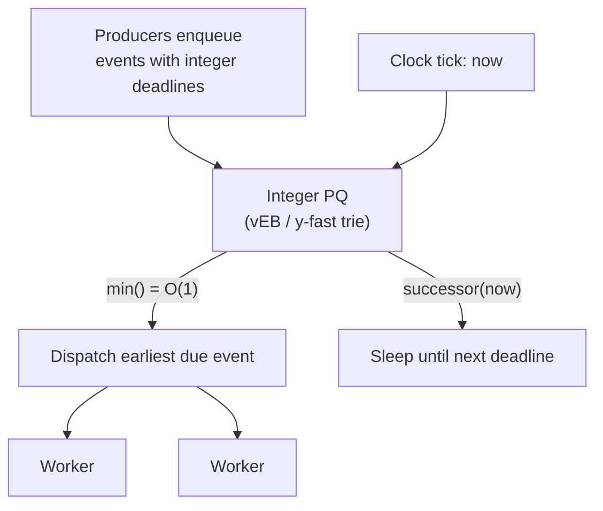
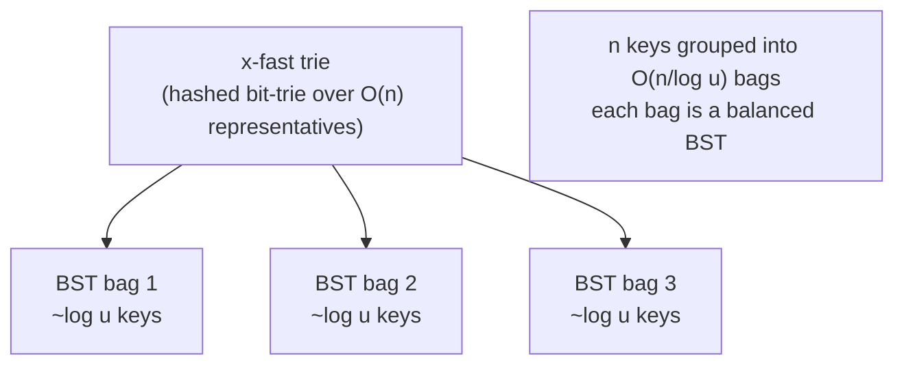
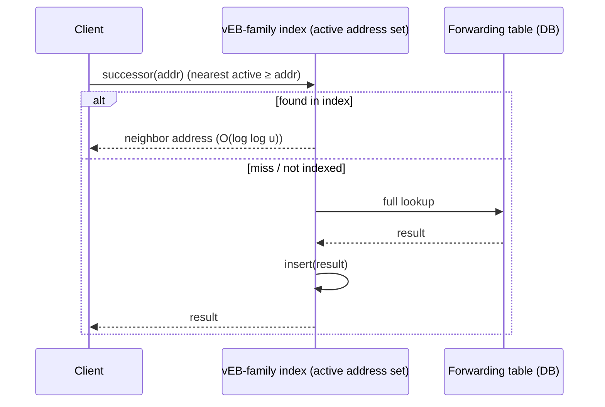
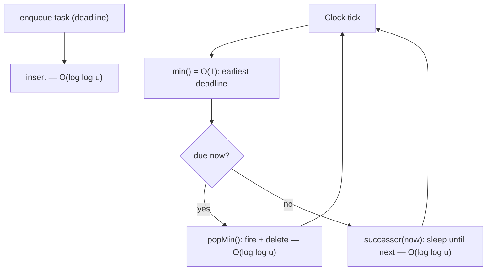

# van Emde Boas Tree (vEB) — Senior Level

> **Read time: ~40 minutes** · **Audience:** Engineers who understand the vEB recurrence and full delete (from `middle.md`) and now need to decide whether — and how — to deploy vEB-style structures in real systems: integer priority queues, packet schedulers, IP routing tables. The senior question is not "how does it work?" but "what does it cost in memory, cache, and complexity, and what should I use instead?"

A senior engineer's relationship with the vEB tree is mostly **skeptical respect**. The asymptotics are beautiful — `O(log log u)` for every ordered-dictionary operation — but the constant factors, the `O(u)` space, and the cache-hostile pointer chasing mean that in production you almost always deploy a *relative* of the pure vEB tree rather than the textbook version: hashed-cluster vEB, a y-fast trie, a stratified-tree timer wheel, or a multi-level bitmap. This document covers (1) the systems where vEB-style structures genuinely earn their place, (2) the space-reduction techniques that make them deployable, (3) the y-fast trie as the space-optimal alternative, (4) concurrency, and (5) the cache reality that decides most real choices.

---

## Table of Contents

1. [Introduction](#introduction)
2. [System Design with vEB — Integer Priority Queues & Routing](#system-design)
3. [Space Reduction — Hashed Clusters and the y-fast Trie](#space-reduction)
4. [Comparison with Alternatives](#comparison-with-alternatives)
5. [Architecture Patterns](#architecture-patterns)
6. [Capacity Planning & Cache Modeling](#capacity-planning)
7. [Case Study — A Deadline Scheduler](#case-study)
8. [Code Examples — Hashed-Cluster vEB](#code-examples)
9. [Observability](#observability)
10. [Failure Modes](#failure-modes)
11. [Summary](#summary)

---

<a name="introduction"></a>
## 1. Introduction

> Focus: "How do I architect a system around (a relative of) the vEB tree, and when should I not?"

The vEB tree solves the **integer predecessor/successor problem**: given a dynamic set of integers from a bounded universe, find the nearest stored neighbor of a query in `O(log log u)`. That problem is the beating heart of several real systems:

- **Event/timer scheduling:** "what is the next timer to fire after time `t`?" is a successor query over an integer time universe.
- **Network packet scheduling and QoS:** rate limiters and fair-queueing schedulers pick the next packet by deadline (an integer), a min-priority-queue / successor query.
- **IP routing:** longest-prefix-match and "next reachable address" lookups over a bounded address universe.
- **Integer priority queues** inside graph algorithms (Dijkstra with integer weights, where vEB or a Thorup-style PQ beats the `O(m log n)` binary-heap bound).

In each case the senior decision is which *member of the vEB family* to deploy. Pure vEB is rarely it; the contenders are hashed-cluster vEB, the y-fast trie, hierarchical timing wheels, and multi-level bitmaps. We weigh all of them.

---

<a name="system-design"></a>
## 2. System Design with vEB — Integer Priority Queues & Routing

### 2.1 Integer priority queue for a scheduler

A scheduler needs: `add(deadline)`, `peekEarliest()` (O(1) ideally), `popEarliest()`, and "what fires next after now?" (`successor(now)`). Map deadlines to a bounded integer universe (e.g. milliseconds within a 2^24-ms horizon) and back the queue with a vEB tree:



`min()` in `O(1)` is the killer feature here: the dispatch loop reads the earliest deadline without any tree descent, sleeps until then, fires, and `popMin`s. For very large horizons, a **hierarchical timing wheel** (O(1) amortized) usually beats vEB, but when you need *exact* ordered successor queries across the whole horizon (not just bucketed firing), the vEB-family structure is the cleaner fit.

### 2.2 IP routing / address-set queries

Treat the IPv4 space as the universe `u = 2^32`. A set of "interesting" addresses (e.g., active flows, blocked ranges, allocated prefixes) lives in a vEB-family structure. Queries like "next allocated address ≥ X" or "is this address in an active flow set, and what is the nearest neighbor?" are successor/predecessor queries answered in `O(log log 2^32) = 5` steps. Because `u = 2^32` makes basic vEB's `O(u)` space impossible (4 billion cells), production uses **hashed clusters** or a **y-fast trie** to get `O(n)` space, or a **multi-bit trie / LC-trie** which the routing community generally prefers for cache reasons.

### 2.3 Dijkstra with integer weights

For graphs with integer edge weights bounded by `C`, the priority queue universe is bounded, and a vEB-based PQ gives Dijkstra a running time of `O(m log log C)` per the classic Thorup line of work — asymptotically better than the `O(m log n)` binary-heap version when `C` is small relative to `n`. In practice a radix heap or a simple bucket queue (Dial's algorithm) is usually chosen for its cache friendliness, but vEB is the theoretical milestone these build on.

---

<a name="space-reduction"></a>
## 3. Space Reduction — Hashed Clusters and the y-fast Trie

### 3.1 The problem

Basic vEB allocates **every** cluster eagerly: `O(u)` objects regardless of `n`. For `u = 2^32` that is fatal. Two standard fixes:

### 3.2 Hashed clusters → O(n) space

Replace the dense `cluster[]` array (and eager allocation) with a **hash map** keyed by cluster index `high(x)`. A cluster object is created lazily the first time a key lands in it. Since at most `n` clusters can ever be non-empty across all levels, and the recursion has `log log u` levels, the total number of allocated nodes is `O(n · log log u)` worst case, commonly summarized as `O(n)` for practical purposes (the recursive structure stays `O(n)` because each inserted key creates `O(1)` amortized new nodes along its single root-to-base path). Time is unchanged at `O(log log u)` expected (the hash lookups are `O(1)` expected).

Trade-offs:
- **Pro:** space drops from `O(u)` to roughly `O(n)`; enables `u = 2^32` and beyond.
- **Con:** hashing adds constant-factor overhead and makes timing *expected* rather than worst-case; even more cache-hostile (hash probes + pointer chases).

### 3.3 The y-fast trie → O(n) space, deterministic structure

The **y-fast trie** (Willard, 1983) achieves `O(log log u)` time in **`O(n)` space** without hashing the vEB recursion. It is built in two layers:



- The `n` keys are partitioned into `O(n / log u)` **groups** of about `log u` consecutive keys; each group is stored in a small balanced BST ("bag").
- One **representative** per group is inserted into an **x-fast trie** — a bit-trie of depth `log u` whose levels are stored in hash tables, giving `O(log log u)` successor on the *representatives* via binary search over the trie levels.
- A query first finds the right group via the x-fast trie in `O(log log u)`, then searches the `O(log u)`-sized BST in `O(log log u)`.
- Insert/delete are `O(log log u)` **amortized** (occasionally a group splits/merges, costing `O(log u)`, amortized down by the group size).

The x-fast trie alone is `O(n log u)` space (a trie node per representative per level); wrapping it in y-fast's grouping reduces the representative count by a `log u` factor, yielding **`O(n)` total**. This is the structure of choice when you need vEB asymptotics in linear space with deterministic worst-case bounds on queries.

### 3.4 Summary of the space ladder

| Variant | Time | Space | Notes |
|---|---|---|---|
| Basic vEB | O(log log u) worst | **O(u)** | only small/dense `u` |
| Hashed-cluster vEB | O(log log u) expected | **O(n)** | randomized; simplest space fix |
| x-fast trie | O(log log u) query, O(log u) update | O(n log u) | the building block |
| **y-fast trie** | O(log log u) (amortized update) | **O(n)** | space-optimal deterministic-query choice |

---

<a name="comparison-with-alternatives"></a>
## 4. Comparison with Alternatives

| Attribute | Basic vEB | Hashed-cluster vEB | y-fast trie | B-tree / sorted array | Hash table |
|---|---|---|---|---|---|
| successor/predecessor | O(log log u) | O(log log u) exp | O(log log u) | O(log n) | not supported |
| min/max | O(1) | O(1) | O(1) | O(1) (ends) | not supported |
| insert/delete | O(log log u) | O(log log u) exp | O(log log u) amort | O(log n) | O(1) |
| space | O(u) | O(n) | O(n) | O(n) | O(n) |
| cache behavior | poor | very poor | poor–moderate | **good** | good |
| worst-case guaranteed | yes | no (expected) | query yes, update amort | yes | no |
| key type | bounded int | bounded int | bounded int | any comparable | any hashable |
| typical production use | rare | rare | rare | **very common** | common |

The blunt senior takeaway: **for most ordered-integer workloads, a cache-friendly B-tree, sorted array, radix heap, or timing wheel outperforms any vEB variant in wall-clock time**, despite worse Big-O, because `log log u` is a tiny constant (4–6) and the vEB family pays for it in cache misses. vEB-family structures win when (a) `n` is large, `u` is bounded, and (b) you genuinely need many successor/predecessor queries where the `log n` vs `log log u` gap matters *and* you have engineered around the cache cost.

---

<a name="architecture-patterns"></a>
## 5. Architecture Patterns

### 5.1 Read-mostly successor cache in front of a router



The vEB-family structure acts as an in-memory ordered index over a bounded address universe; the authoritative forwarding table sits behind it.

### 5.2 Sharding by `high` bits

A natural way to scale a vEB-family index across cores or nodes: shard by the **top bits** of the key (the `high` of the root). Each shard owns a contiguous range of the universe and runs its own vEB tree; a thin router dispatches a query to the owning shard by computing `high(x)`. Successor queries that fall off the end of a shard continue to the next shard — exactly the cross-cluster jump, lifted to the distribution layer.

| Shard strategy | Pro | Con |
|---|---|---|
| By top `high` bits | aligns with vEB structure; min/max per shard O(1) | hot shards if keys skew to one range |
| By hash of key | even load | destroys order — successor needs scatter-gather |

Because successor/predecessor need order, **range sharding (by `high` bits)** is the only option that keeps queries cheap; hash sharding forces a fan-out across all shards for every successor query.

---

<a name="capacity-planning"></a>
## 6. Capacity Planning & Cache Modeling

Before deploying any vEB variant, a senior engineer does back-of-the-envelope math on **memory** and **cache misses** — these, not Big-O, decide the outcome.

### 6.1 Memory budget for basic vEB

A basic `vEB(u)` allocates roughly `Θ(u)` node records. With a node footprint of ~48 bytes (two ints, a summary pointer, a cluster-slice header, alignment), the memory ladder is:

| universe `u` | approx. records | approx. memory (basic vEB) | viable? |
|---|---|---|---|
| 2^16 = 65,536 | ~10^5 | ~5 MB | yes |
| 2^20 ≈ 10^6 | ~10^6 | ~50 MB | borderline |
| 2^24 ≈ 1.7·10^7 | ~10^7 | ~800 MB | no (use hashed/y-fast) |
| 2^32 | ~10^9+ | tens of GB | impossible |

The rule of thumb: **basic vEB is only deployable up to about `u = 2^20`–`2^22`.** Past that you *must* hash the clusters (`O(n)`) or use a y-fast trie. The element count `n` is irrelevant to basic-vEB memory — even an empty `vEB(2^24)` allocates the full skeleton.

### 6.2 Cache-miss model

Model wall-clock cost as `levels × miss_penalty`. With `log log u` levels each touching a fresh, scattered node:

| structure | "levels" | cache-line locality | est. misses per query |
|---|---|---|---|
| basic vEB, `u=2^32` | 5 | poor (scattered nodes) | ~5 |
| sorted array, `n=10^6` | 20 (binary search) | excellent (contiguous, prefetch-friendly) | ~3–4 (last few steps) |
| B-tree (B=64), `n=10^6` | ~4 nodes | good (each node a cache line) | ~4 |

This is why a sorted array or B-tree frequently *matches or beats* vEB despite `O(log n)` vs `O(log log u)`: a vEB query incurs roughly one **full** cache miss per level, while binary search's early steps stay in cache and the array prefetches well. The asymptotic win of `5` vs `20` *comparisons* evaporates once you count **memory stalls**, where the numbers are closer to `5` vs `4`.

### 6.3 The decision formula

Deploy a vEB variant only when **all** hold:
1. Keys are bounded integers with a known `u`.
2. You need `successor`/`predecessor`/`min` (not just membership — else hash).
3. Either `u ≤ 2^20` (basic) or you have committed to hashed clusters / y-fast trie.
4. A benchmark on **your** universe and access pattern shows it beats a B-tree / sorted array / radix heap.

If (4) fails — and it often does — pick the cache-friendly structure.

---

<a name="case-study"></a>
## 7. Case Study — A Deadline Scheduler

Concrete scenario: a job runner schedules up to ~50,000 in-flight tasks, each with a millisecond deadline within a rolling 16-second horizon (`u = 2^24` ms ≈ 16.7 s). The dispatch loop must repeatedly answer "what is the earliest deadline?" and "what is the next deadline after `now`?"

**Why a vEB-family structure fits:** `peekEarliest()` is `min()` — `O(1)`, read on every tick with zero descent. `successor(now)` finds the next firing in `O(log log u) = O(5)`. Both are ordered queries hashing cannot serve.

**Which variant:** `u = 2^24` makes basic vEB's ~800 MB skeleton wasteful for only 50k live tasks. So **hashed clusters** (or a y-fast trie) bring memory to `O(n) ≈ a few MB`.

**The honest alternative considered:** a **hierarchical timing wheel** gives `O(1)` amortized insert and tick, with far better cache behavior, and is the industry-standard scheduler structure (used in Linux kernel timers, Kafka, Netty). The timing wheel *wins* if you only need bucketed firing. The vEB-family structure is chosen *only* if the scheduler must answer **exact ordered successor queries** across the whole horizon (e.g. "give me the next 100 deadlines in order, regardless of bucket"), which a wheel cannot do cheaply.



**Outcome of the decision:** for this workload the team would likely ship a **timing wheel** unless the "ordered next-N deadlines" requirement is real; if it is, a **hashed-cluster vEB** or **y-fast trie** is the right tool. This is the senior pattern: the vEB tree is the *correct* answer to a *specific* ordered-integer requirement, and the wrong answer to the general case where a wheel or B-tree is simpler and faster.

---

<a name="code-examples"></a>
## 8. Code Examples — Hashed-Cluster vEB (O(n) space)

A space-reduced vEB that allocates clusters lazily via a hash map. Time stays `O(log log u)` expected; space drops to `O(n)`.

#### Go

```go
package veb

const NIL = -1

// HVEB is a hashed-cluster vEB tree: clusters allocated lazily → O(n) space.
type HVEB struct {
    u, lower, upper int
    min, max        int
    summary         *HVEB
    cluster         map[int]*HVEB // lazily created; absent key ⇒ empty cluster
}

func NewH(u int) *HVEB {
    t := &HVEB{u: u, min: NIL, max: NIL}
    if u > 2 {
        k := bits(u)
        t.lower = 1 << (k / 2)
        t.upper = 1 << ((k + 1) / 2)
        t.cluster = make(map[int]*HVEB)
        // summary is created lazily too, on first non-empty cluster
    }
    return t
}

func bits(u int) int { b := 0; for (1 << b) < u { b++ }; return b }

func (t *HVEB) high(x int) int     { return x / t.lower }
func (t *HVEB) low(x int) int      { return x % t.lower }
func (t *HVEB) index(h, l int) int { return h*t.lower + l }

func (t *HVEB) clusterAt(h int) *HVEB { // read-only; nil ⇒ empty
    return t.cluster[h]
}
func (t *HVEB) ensureCluster(h int) *HVEB {
    c := t.cluster[h]
    if c == nil {
        c = NewH(t.lower)
        t.cluster[h] = c
    }
    return c
}
func (t *HVEB) ensureSummary() *HVEB {
    if t.summary == nil {
        t.summary = NewH(t.upper)
    }
    return t.summary
}

func clusterMin(c *HVEB) int { if c == nil { return NIL }; return c.min }
func clusterMax(c *HVEB) int { if c == nil { return NIL }; return c.max }

func (t *HVEB) Min() int { return t.min }
func (t *HVEB) Max() int { return t.max }

func (t *HVEB) Member(x int) bool {
    if x == t.min || x == t.max {
        return true
    }
    if t.u <= 2 {
        return false
    }
    return t.clusterAt(t.high(x)).MemberSafe(t.low(x))
}
func (t *HVEB) MemberSafe(x int) bool {
    if t == nil {
        return false
    }
    return t.Member(x)
}

func (t *HVEB) Insert(x int) {
    if t.min == NIL {
        t.min, t.max = x, x
        return
    }
    if x < t.min {
        x, t.min = t.min, x
    }
    if t.u > 2 {
        h, l := t.high(x), t.low(x)
        if clusterMin(t.clusterAt(h)) == NIL {
            t.ensureSummary().Insert(h)
            c := t.ensureCluster(h)
            c.min, c.max = l, l
        } else {
            t.ensureCluster(h).Insert(l)
        }
    }
    if x > t.max {
        t.max = x
    }
}

func (t *HVEB) Successor(x int) int {
    if t.u <= 2 {
        if x == 0 && t.max == 1 {
            return 1
        }
        return NIL
    }
    if t.min != NIL && x < t.min {
        return t.min
    }
    h, l := t.high(x), t.low(x)
    cmax := clusterMax(t.clusterAt(h))
    if cmax != NIL && l < cmax {
        return t.index(h, t.clusterAt(h).Successor(l))
    }
    if t.summary == nil {
        return NIL
    }
    c := t.summary.Successor(h)
    if c == NIL {
        return NIL
    }
    return t.index(c, t.cluster[c].min)
}
```

#### Java

```java
import java.util.HashMap;
import java.util.Map;

public final class HVEB {
    static final int NIL = -1;
    final int u, lower, upper;
    int min = NIL, max = NIL;
    HVEB summary;                       // lazy
    Map<Integer, HVEB> cluster;        // lazy entries → O(n) space

    public HVEB(int u) {
        this.u = u;
        if (u > 2) {
            int k = bits(u);
            lower = 1 << (k / 2);
            upper = 1 << ((k + 1) / 2);
            cluster = new HashMap<>();
        } else { lower = upper = 0; }
    }
    static int bits(int u){ int b=0; while((1<<b)<u) b++; return b; }

    int high(int x){ return x/lower; }
    int low(int x){ return x%lower; }
    int index(int h,int l){ return h*lower+l; }

    HVEB clusterAt(int h){ return cluster.get(h); }
    HVEB ensureCluster(int h){
        return cluster.computeIfAbsent(h, k -> new HVEB(lower));
    }
    HVEB ensureSummary(){ if (summary==null) summary=new HVEB(upper); return summary; }
    static int cmin(HVEB c){ return c==null?NIL:c.min; }
    static int cmax(HVEB c){ return c==null?NIL:c.max; }

    public int min(){ return min; }
    public int max(){ return max; }

    public boolean member(int x){
        if (x==min || x==max) return true;
        if (u<=2) return false;
        HVEB c = clusterAt(high(x));
        return c != null && c.member(low(x));
    }

    public void insert(int x){
        if (min==NIL){ min=max=x; return; }
        if (x<min){ int t=min; min=x; x=t; }
        if (u>2){
            int h=high(x), l=low(x);
            if (cmin(clusterAt(h))==NIL){
                ensureSummary().insert(h);
                HVEB c = ensureCluster(h); c.min=l; c.max=l;
            } else ensureCluster(h).insert(l);
        }
        if (x>max) max=x;
    }

    public int successor(int x){
        if (u<=2) return (x==0 && max==1) ? 1 : NIL;
        if (min!=NIL && x<min) return min;
        int h=high(x), l=low(x);
        int cmx = cmax(clusterAt(h));
        if (cmx!=NIL && l<cmx) return index(h, clusterAt(h).successor(l));
        if (summary==null) return NIL;
        int c = summary.successor(h);
        if (c==NIL) return NIL;
        return index(c, cluster.get(c).min);
    }
}
```

#### Python

```python
class HVEB:
    """Hashed-cluster vEB tree: clusters in a dict → O(n) space."""
    NIL = -1
    def __init__(self, u):
        self.u = u
        self.min = self.max = self.NIL
        self.summary = None
        self.cluster = {}
        if u > 2:
            k = (u - 1).bit_length()
            self.lower = 1 << (k // 2)
            self.upper = 1 << ((k + 1) // 2)
        else:
            self.lower = self.upper = 0

    def high(self, x): return x // self.lower
    def low(self, x):  return x % self.lower
    def index(self, h, l): return h * self.lower + l

    def _cmin(self, h): c = self.cluster.get(h); return c.min if c else self.NIL
    def _cmax(self, h): c = self.cluster.get(h); return c.max if c else self.NIL
    def _ensure_cluster(self, h):
        c = self.cluster.get(h)
        if c is None:
            c = HVEB(self.lower); self.cluster[h] = c
        return c
    def _ensure_summary(self):
        if self.summary is None: self.summary = HVEB(self.upper)
        return self.summary

    def member(self, x):
        if x == self.min or x == self.max: return True
        if self.u <= 2: return False
        c = self.cluster.get(self.high(x))
        return c.member(self.low(x)) if c else False

    def insert(self, x):
        if self.min == self.NIL: self.min = self.max = x; return
        if x < self.min: x, self.min = self.min, x
        if self.u > 2:
            h, l = self.high(x), self.low(x)
            if self._cmin(h) == self.NIL:
                self._ensure_summary().insert(h)
                c = self._ensure_cluster(h); c.min = c.max = l
            else:
                self._ensure_cluster(h).insert(l)
        if x > self.max: self.max = x

    def successor(self, x):
        if self.u <= 2:
            return 1 if (x == 0 and self.max == 1) else self.NIL
        if self.min != self.NIL and x < self.min: return self.min
        h, l = self.high(x), self.low(x)
        cmx = self._cmax(h)
        if cmx != self.NIL and l < cmx:
            return self.index(h, self.cluster[h].successor(l))
        if self.summary is None: return self.NIL
        c = self.summary.successor(h)
        if c == self.NIL: return self.NIL
        return self.index(c, self.cluster[c].min)
```

---

<a name="observability"></a>
## 9. Observability

| Metric | What it tells you | Alert threshold |
|---|---|---|
| `veb_node_count` | live cluster nodes — proxy for memory | > memory budget / node-size |
| `veb_op_latency_p99` | tail latency of successor/insert | > a few µs (else cache thrash) |
| `veb_cluster_fill_ratio` | non-empty / allocated clusters | < 0.1 ⇒ very sparse, prefer hashed/y-fast |
| `veb_cache_miss_rate` (perf counters) | the real cost driver | high ⇒ consider B-tree/array |
| `universe_utilization` = n / u | density | tiny ⇒ basic vEB wastes O(u) |

The two numbers that should drive an architectural decision: **universe utilization** (`n/u` — if tiny, never use basic vEB) and **cache-miss rate** (if high, a flat structure likely wins).

---

<a name="failure-modes"></a>
## 10. Failure Modes

- **Memory blow-up (basic vEB, large `u`):** `O(u)` allocation OOMs the process. *Mitigation:* hashed clusters or y-fast trie; bound `u`.
- **Cache thrash:** pointer chasing through scattered tiny nodes makes p99 latency worse than a `O(log n)` B-tree. *Mitigation:* benchmark; prefer cache-friendly structures; consider the vEB *layout* (not the dynamic tree) if it is really a static-search workload.
- **Skewed sharding:** range-sharding by `high` bits overloads one shard if keys cluster. *Mitigation:* adaptive range boundaries / split hot ranges.
- **Universe overflow:** a key arrives outside `[0, u)` (e.g. timestamps past the horizon). *Mitigation:* validate and rebase/rescale; timing wheels handle wraparound more gracefully.
- **Hash-cluster adversarial keys:** worst-case hash collisions degrade the expected bound. *Mitigation:* randomized hashing; or use y-fast trie for deterministic query bounds.
- **Concurrency:** the recursive mutation paths (especially `delete`'s min-promotion) are not atomic. *Mitigation:* coarse `RWMutex` (readers share, writers exclusive), or shard so each shard is single-writer.

### Minimal thread-safe wrapper

#### Go

```go
type SafeVEB struct {
    mu sync.RWMutex
    t  *VEB
}
func (s *SafeVEB) Insert(x int)        { s.mu.Lock(); defer s.mu.Unlock(); s.t.Insert(x) }
func (s *SafeVEB) Successor(x int) int { s.mu.RLock(); defer s.mu.RUnlock(); return s.t.Successor(x) }
```

#### Java

```java
final class SafeVEB {
    private final java.util.concurrent.locks.ReentrantReadWriteLock lock =
        new java.util.concurrent.locks.ReentrantReadWriteLock();
    private final VEB t;
    SafeVEB(int u){ t = new VEB(u); }
    void insert(int x){ lock.writeLock().lock(); try { t.insert(x); } finally { lock.writeLock().unlock(); } }
    int successor(int x){ lock.readLock().lock(); try { return t.successor(x); } finally { lock.readLock().unlock(); } }
}
```

#### Python

```python
import threading
class SafeVEB:
    def __init__(self, u):
        self._lock = threading.RLock()
        self._t = VEB(u)
    def insert(self, x):
        with self._lock: self._t.insert(x)
    def successor(self, x):
        with self._lock: return self._t.successor(x)
```

---

<a name="summary"></a>
## 11. Summary

- vEB-family structures solve the **integer successor/predecessor problem** that underlies timer schedulers, packet/QoS schedulers, IP-address indexing, and integer-weight Dijkstra.
- **Basic vEB's `O(u)` space is a non-starter for large universes.** Production uses **hashed clusters** (`O(n)` space, expected time) or the **y-fast trie** (`O(n)` space, deterministic query time via x-fast trie + `log u`-sized BST bags).
- The **y-fast trie** = x-fast trie over `O(n/log u)` representatives + balanced-BST bags of size `~log u`; it is the space-optimal way to get `O(log log u)`.
- **Cache behavior usually decides real deployments:** because `log log u` is a tiny constant (4–6), cache-friendly B-trees, sorted arrays, radix heaps, and timing wheels frequently beat any vEB variant in wall-clock time. Benchmark before deploying.
- Scale by **range-sharding on the `high` bits** (order-preserving); never hash-shard, which breaks successor queries.
- Make it concurrent with a coarse reader-writer lock or single-writer shards; the recursive mutation paths are not lock-free-friendly.

**Next step:** Continue with [`professional.md`](./professional.md) for the formal `T(u) = T(sqrt(u)) + O(1) = O(log log u)` proof, the rigorous single-recursive-call argument (including delete), the `O(u)` space derivation, and a formal comparison with the y-fast trie.
