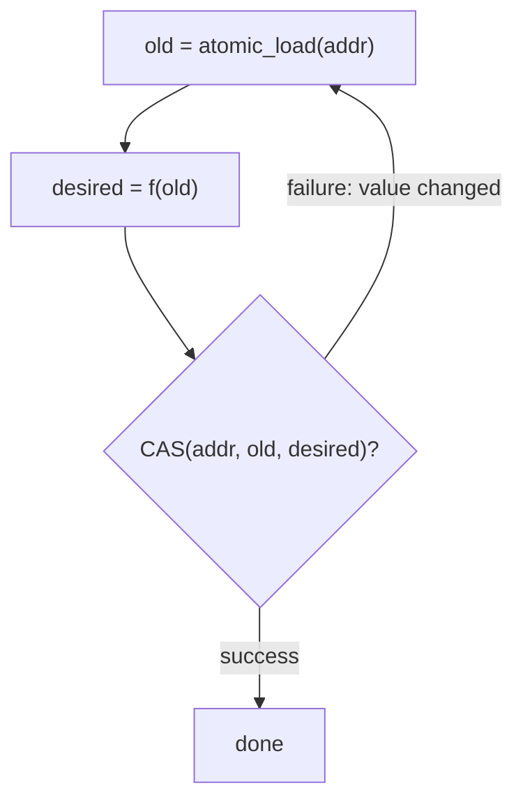
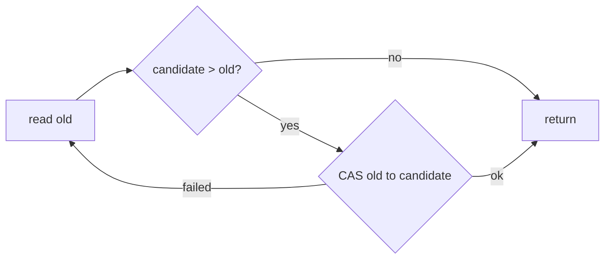

# CAS and Atomic Primitives — Junior Level

> **Read time: ~40 minutes** · **Audience:** Engineers who can write a loop and have heard the words "thread" and "race condition" but have never used an atomic operation directly. By the end you will understand what *atomic* means, what **compare-and-swap (CAS)** does, how the **CAS loop** works, and how to build a correct lock-free counter.

**Atomic primitives** are the lowest-level building blocks of concurrent programming. They are special CPU instructions — exposed by your language as library calls — that read and modify a piece of shared memory **as a single, indivisible step** that no other thread can interrupt or observe halfway through. The single most important one is **compare-and-swap (CAS)**: "if this variable still equals the value I expect, replace it with my new value; otherwise tell me you failed and leave it alone." That one instruction, applied in a retry loop, is enough to build counters, stacks, queues, and locks that never block a thread — the entire field of **lock-free programming** rests on it.

CAS exists because ordinary code is *not* atomic. The innocent-looking statement `counter = counter + 1` is actually three machine steps: **read** `counter` into a register, **add** one, **write** the register back. If two threads run those three steps interleaved, both can read the same old value, both add one, and both write back the same result — one increment silently vanishes. This is a **lost update**, the canonical concurrency bug. A mutex fixes it by forcing threads to take turns, but locks have costs: a thread that loses the race **blocks** (goes to sleep), and if the lock holder dies or is delayed, everyone waits. CAS fixes the same bug *without blocking*: each thread reads, computes, then atomically checks-and-writes; if someone beat it to the punch, it simply re-reads and tries again.

This document teaches you the atomic operations **so concretely** that you can read and write `sync/atomic` in Go, `java.util.concurrent.atomic` in Java, and understand why Python's threads behave differently because of the **GIL**. You will hand-trace a CAS loop, see exactly why the lost-update bug happens, and write a counter that is correct under any number of threads.

---

## Table of Contents

1. [Introduction — Why `counter++` Is Broken](#introduction)
2. [Prerequisites](#prerequisites)
3. [Glossary](#glossary)
4. [Core Concepts — Atomicity, CAS, the CAS Loop](#core-concepts)
5. [The Atomic Operation Family](#atomic-family)
6. [Big-O and Cost Summary](#big-o-summary)
7. [Real-World Analogies](#analogies)
8. [Pros and Cons vs Locks](#pros-and-cons)
9. [Step-by-Step Walkthrough of a CAS Loop](#walkthrough)
10. [Code Examples — Go, Java, Python](#code-examples)
11. [Coding Patterns — The Canonical CAS Loop](#patterns)
12. [Error Handling — What Goes Wrong](#errors)
13. [Performance Tips](#performance-tips)
14. [Best Practices](#best-practices)
15. [Edge Cases](#edge-cases)
16. [Common Mistakes](#common-mistakes)
17. [Cheat Sheet](#cheat-sheet)
18. [Visual Animation Reference](#animation)
19. [Summary](#summary)
20. [Further Reading](#further-reading)

---

<a name="introduction"></a>
## 1. Introduction — Why `counter++` Is Broken

Imagine a global counter that two threads each increment one million times. You expect the final value to be **2,000,000**. Run it with a plain `int` and no synchronization, and you will reliably get something *less* — maybe 1,300,000, maybe 1,870,000, a different wrong number every run. Increments are vanishing. Where do they go?

The statement `counter = counter + 1` compiles to roughly three machine instructions:

```text
LOAD  R1, [counter]   ; read counter into register R1
ADD   R1, R1, 1       ; R1 = R1 + 1
STORE [counter], R1   ; write R1 back to counter
```

Now interleave two threads, A and B, with `counter` starting at 41:

```text
Thread A: LOAD R1, [counter]   -> R1 = 41
Thread B: LOAD R1, [counter]   -> R1 = 41   (B read BEFORE A wrote)
Thread A: ADD  R1, 1           -> R1 = 42
Thread B: ADD  R1, 1           -> R1 = 42
Thread A: STORE [counter], 42  -> counter = 42
Thread B: STORE [counter], 42  -> counter = 42   (overwrites A's work)
```

Two increments happened. The counter rose by **one**. This is the **lost update** bug, and it is the reason atomic operations exist. The window between *read* and *write* is a **critical section**: if any other thread modifies the variable while we are inside that window, our write is based on stale data.

There are two families of fix:

1. **Locks (blocking).** Wrap the three instructions in `mutex.Lock()` / `mutex.Unlock()`. Now only one thread is ever inside the window. Correct, but a thread that arrives while the lock is held must **block** — the OS may put it to sleep and wake it later, costing thousands of nanoseconds. If the lock holder is paused (page fault, preemption, even death), *everyone* waits indefinitely.

2. **Atomic read-modify-write (non-blocking).** Use a hardware instruction that does read-modify-write **as one indivisible step**. The most flexible such instruction is **compare-and-swap (CAS)**. With CAS you don't take turns by sleeping; you optimistically compute a new value and atomically install it *only if nobody changed it underneath you*. If someone did, you retry. No thread ever sleeps; the system as a whole always makes progress. This is **lock-free programming**.

This junior document focuses on family 2 at the simplest possible level: what atomic means, what CAS does, and how to spin it into a correct counter.

---

<a name="prerequisites"></a>
## 2. Prerequisites

- **Required:** You can read a `for` loop and a function in at least one of Go / Java / Python.
- **Required:** You know that a program can run multiple **threads** (or goroutines) that execute concurrently.
- **Helpful:** A vague sense that "shared memory between threads is dangerous." We will make that precise.
- **Not required:** Any prior use of mutexes, channels, or atomics. We build from zero.

The one mental model you must internalize: **a normal read and a normal write are two separate events.** Anything can happen between them. An atomic operation collapses a read *and* a write into one event that nothing can split.

---

<a name="glossary"></a>
## 3. Glossary

| Term | Definition |
|---|---|
| **Atomic** | Indivisible. An atomic operation completes entirely or not at all; no other thread can observe an intermediate state or interleave with it. |
| **Race condition** | A bug where the result depends on the unpredictable timing/interleaving of threads. The lost-update counter is the classic example. |
| **Critical section** | A region of code that must not be executed by two threads at the same time (e.g., the read-modify-write of a counter). |
| **Read-modify-write (RMW)** | An operation that atomically reads a value, computes a new one, and writes it back. CAS, fetch-add, exchange, and test-and-set are all RMW operations. |
| **Compare-and-swap (CAS)** | An atomic RMW: `CAS(addr, expected, new)` writes `new` into `addr` *only if* `addr` currently holds `expected`, and reports whether it succeeded. |
| **CAS loop** | The pattern: read current value → compute desired new value → CAS; if CAS fails (someone changed it), loop and retry. |
| **fetch-add** | Atomic "add `delta` and return the old value." Equivalent to `AddAndGet`/`getAndAdd`. The simplest way to make a counter. |
| **exchange (swap)** | Atomic "store `new`, return the old value." Unconditional, unlike CAS. |
| **test-and-set** | Atomic "set a flag to 1, return its old value." The classic primitive for building a spinlock. |
| **Lock-free** | A property: the system as a whole always makes progress; no thread can be blocked indefinitely by another that is merely *slow*. |
| **Spin / busy-wait** | Repeatedly retrying in a tight loop instead of sleeping. CAS loops spin on contention. |
| **GIL (Python)** | The Global Interpreter Lock — a CPython lock that lets only one thread execute Python bytecode at a time. It changes how atomicity works in Python (see §10). |
| **Shared variable** | A memory location reachable by more than one thread. Only shared, *mutable* state needs synchronization. |

---

<a name="core-concepts"></a>
## 4. Core Concepts — Atomicity, CAS, the CAS Loop

### 4.1 Atomicity: one indivisible step

A single-threaded program never worries about half-finished operations because there is nobody to observe them. The instant you have **two threads touching one memory location**, every non-atomic operation has a *visible middle*. "Atomic" means that middle does not exist for observers: from every other thread's point of view, the operation either has not happened yet or has fully happened.

Hardware gives us a small set of memory locations and operations that are guaranteed atomic: aligned word-sized loads and stores, plus the special RMW instructions. On x86 the RMW instruction is `LOCK CMPXCHG` (locked compare-exchange); on ARM it is the `LDXR`/`STXR` load-link/store-conditional pair (more on that in middle/senior). Your language wraps these in a clean API.

### 4.2 Compare-and-swap (CAS): the universal primitive

CAS is the Swiss-army knife. Its contract, in pseudocode, **executed atomically as one step**:

```text
function CAS(addr, expected, new) -> bool:
    if *addr == expected:
        *addr = new
        return true          # success: we installed our value
    else:
        return false         # failure: someone else changed *addr
```

The crucial part is "**executed atomically as one step**." The comparison and the conditional write cannot be split. No thread can sneak in between the `if` and the assignment. That is what makes CAS a hardware primitive rather than something you could write in plain code.

Why is the *compare* part there? Because it lets a thread say: *"I will only write my new value if the world is still in the state I based my computation on."* If the world changed (someone else wrote), CAS fails, and the thread knows its computation is stale and must be redone. This is **optimistic concurrency**: assume no conflict, detect it after the fact, retry if it happened.

### 4.3 The CAS loop: read, compute, swap, retry

A single CAS is rarely enough, because if it fails you still have work to do. The standard idiom wraps it in a loop:

```text
loop:
    old     = atomic_load(addr)      # 1. read the current value
    desired = f(old)                 # 2. compute the new value from old
    if CAS(addr, old, desired):      # 3. try to install it atomically
        break                        #    success — done
    # else: someone changed addr between steps 1 and 3; retry
```

Read it slowly:

1. **Read** the current value into a local `old`.
2. **Compute** what you want the new value to be, based on `old`.
3. **CAS**: install `desired` *only if* the variable still equals `old`. If it does, you win and exit. If it doesn't, another thread modified it after your read; your `desired` is based on stale data, so you loop and re-read.

For a counter, `f(old) = old + 1`. For a max-tracker, `f(old) = max(old, candidate)`. For pushing onto a lock-free stack, `f(old)` builds a new node pointing at `old`. The *shape* is always identical; only `f` changes.



### 4.4 Why the loop is correct

When CAS *succeeds*, it has proven two things at once: the variable equaled `old` at the instant of the write, **and** it now equals `desired`. Because the compare-and-write was atomic, no update was lost — if anyone had changed the variable since our read, the compare would have failed. So every successful CAS corresponds to exactly one clean read-modify-write with no lost updates. When CAS *fails*, nothing was written, and we just try again with fresh data. The counter can never lose an increment.

---

<a name="atomic-family"></a>
## 5. The Atomic Operation Family

CAS is the most general, but several narrower RMW operations exist because they are simpler and sometimes faster.

| Operation | Pseudocode (atomic) | Returns | Typical use |
|---|---|---|---|
| **load** | `return *addr` | current value | Read a shared flag/value safely |
| **store** | `*addr = v` | nothing | Write a shared flag/value safely |
| **exchange (swap)** | `old=*addr; *addr=v; return old` | old value | Unconditionally replace, grab previous |
| **fetch-add** | `old=*addr; *addr=old+d; return old` | old value | Counters, sequence numbers |
| **test-and-set** | `old=*flag; *flag=1; return old` | old flag | Build a spinlock |
| **compare-and-swap** | the `CAS` shown above | success bool (or old value) | Everything else; the universal primitive |

Key relationships:

- **fetch-add is just a specialized CAS loop done in hardware.** `fetch_add(addr, 1)` does exactly what our CAS-loop counter does, but the CPU implements it directly, so it never has to retry in your code. If all you need is `+= delta`, prefer fetch-add — it is simpler and on modern CPUs often faster under contention.
- **exchange** is CAS without the compare: it always writes and returns what was there. Useful when you want to "take" a value and leave a replacement.
- **test-and-set** is exchange specialized to a boolean flag. `old = test_and_set(flag)` — if `old` was 0, you "acquired" the flag (it was free, now it's set by you); if `old` was 1, someone else holds it.

> **Rule of thumb for juniors:** if the new value depends *only* on a fixed delta, use **fetch-add**. If the new value depends on the *old value in a non-trivial way* (max, conditional, pointer rewiring), use a **CAS loop**.

---

<a name="big-o-summary"></a>
## 6. Big-O and Cost Summary

Atomics are about *latency and contention*, not asymptotic complexity, but here is the cost picture.

| Operation | Uncontended cost | Under heavy contention |
|---|---|---|
| Atomic load | ~1 cache hit (cheap) | cheap (read-shared) |
| Atomic store | a few ns | causes cache-line invalidation on other cores |
| fetch-add | ~10–25 ns (one locked RMW) | serializes on the cache line; throughput drops |
| CAS (success) | ~10–25 ns | same line-bounce cost |
| CAS loop | O(1) *expected* iterations | O(contending threads) retries in the worst burst |

The headline: an uncontended atomic costs roughly the price of one cache access plus a memory fence — call it **tens of nanoseconds**. A mutex lock/unlock with no contention is similar; a mutex *with* contention that puts a thread to sleep costs **thousands** of nanoseconds (a context switch). That gap is why atomics matter.

The CAS loop does **not** have a guaranteed bound on iterations for a *single* thread — under adversarial contention one unlucky thread could retry many times. But the *system* always progresses: every failed CAS means some *other* thread succeeded. (This distinction — lock-free vs wait-free — is a senior/professional topic.)

---

<a name="analogies"></a>
## 7. Real-World Analogies

| Concept | Analogy | Where it breaks down |
|---|---|---|
| **Atomic operation** | A vending machine: you put in coins and it dispenses or refuses *as one transaction* — never "took coins, gave nothing." | Real machines do jam; hardware atomics truly never "jam." |
| **CAS** | Editing a shared Google Doc with optimistic locking: "save my edit only if the document hasn't changed since I opened it; otherwise reload and redo." | Docs merge; CAS just fails and you redo from scratch. |
| **CAS loop** | Re-shelving a library book: you walk to where it goes, but if someone slid a book in first, you re-find the spot and try again. | A real librarian eventually gives up; the CAS loop keeps trying. |
| **fetch-add** | A "take a number" ticket dispenser at the deli: each pull atomically hands you the next integer; no two customers get the same number. | None significant — this is a very faithful analogy. |
| **test-and-set spinlock** | A single restroom with an OCCUPIED sign: you flip it and check the old state; if it was already OCCUPIED, you wait by the door (spin). | A person waiting outside eventually leaves; a spinning thread burns CPU. |
| **Lost update** | Two cashiers updating the same paper ledger from memory of the old total, each overwriting the other. | — |

---

<a name="pros-and-cons"></a>
## 8. Pros and Cons vs Locks

| | Atomics / CAS (lock-free) | Mutex (lock-based) |
|---|---|---|
| **Blocking** | Never blocks; threads spin or retry | Losing thread sleeps (context switch) |
| **Progress if a thread stalls** | System still progresses | Everyone waits for the stalled holder |
| **Latency (uncontended)** | Very low (tens of ns) | Low, comparable |
| **Latency (contended)** | Retries / cache-line bouncing | Context-switch cost (thousands of ns) |
| **Code complexity** | Higher — must reason about retries & ordering | Lower — straightforward critical sections |
| **Composability** | Hard — two lock-free ops aren't atomic together | Easy — hold one lock across several ops |
| **Deadlock risk** | None (no locks held) | Yes (lock ordering bugs) |
| **Best for** | Single small shared word (counter, flag, stack head) | Larger or multi-variable critical sections |

**When to use atomics:** a *single* shared word that many threads hammer — a counter, a sequence number, a flag, the head pointer of a lock-free stack.

**When NOT to use atomics (yet):** when a critical section spans *multiple* variables that must change together. A CAS can only atomically update one word; protecting "transfer money from account A to account B" with raw CAS is hard. Reach for a mutex there until you are comfortable with lock-free design (senior level).

---

<a name="walkthrough"></a>
## 9. Step-by-Step Walkthrough of a CAS Loop

Two threads, A and B, both run `increment()` on a shared counter that starts at **5**. Let's trace one possible interleaving.

```text
Shared: counter = 5

Step 1  A: old = load(counter)       -> A.old = 5
Step 2  B: old = load(counter)       -> B.old = 5
Step 3  A: desired = 5 + 1 = 6
Step 4  B: desired = 5 + 1 = 6
Step 5  A: CAS(counter, 5, 6)        -> counter was 5 == A.old, SUCCESS, counter = 6
Step 6  B: CAS(counter, 5, 6)        -> counter is 6 != B.old (5), FAIL, return to loop
        --- B retries ---
Step 7  B: old = load(counter)       -> B.old = 6   (fresh read)
Step 8  B: desired = 6 + 1 = 7
Step 9  B: CAS(counter, 6, 7)        -> counter was 6 == B.old, SUCCESS, counter = 7

Final: counter = 7   (started at 5, two increments, correct!)
```

Notice what saved us: at **Step 6**, B's CAS *failed* because A had already changed `counter` from 5 to 6. B did **not** blindly overwrite — it noticed the world changed and re-read. Compare this to the broken plain-`counter++` from §1, where B *did* blindly overwrite and an increment vanished. The compare in CAS is exactly the guard that prevents the lost update.

Also notice: B spun **one extra iteration**. That is the cost of contention. With two threads it is rare to spin more than once or twice; with hundreds of threads on one counter, spinning grows and you'd switch to fetch-add or shard the counter (middle/senior).

---

<a name="code-examples"></a>
## 10. Code Examples — Go, Java, Python

We build the same thing three ways: a **lock-free counter** using both fetch-add and an explicit CAS loop.

### Example 1: The bug — racy counter (do NOT do this)

#### Go

```go
package main

import (
	"fmt"
	"sync"
)

func main() {
	var counter int // plain int, NOT atomic — buggy on purpose
	var wg sync.WaitGroup
	for i := 0; i < 2; i++ {
		wg.Add(1)
		go func() {
			defer wg.Done()
			for j := 0; j < 1_000_000; j++ {
				counter++ // read-modify-write: LOST UPDATES happen here
			}
		}()
	}
	wg.Wait()
	fmt.Println("counter =", counter) // almost never 2000000
}
```

#### Java

```java
public class RacyCounter {
    static int counter = 0; // plain int — buggy on purpose

    public static void main(String[] args) throws InterruptedException {
        Runnable task = () -> {
            for (int j = 0; j < 1_000_000; j++) {
                counter++; // LOST UPDATES
            }
        };
        Thread a = new Thread(task), b = new Thread(task);
        a.start(); b.start();
        a.join(); b.join();
        System.out.println("counter = " + counter); // almost never 2000000
    }
}
```

#### Python

```python
import threading

counter = 0  # plain int

def task():
    global counter
    for _ in range(1_000_000):
        counter += 1  # read-modify-write across bytecodes

threads = [threading.Thread(target=task) for _ in range(2)]
for t in threads: t.start()
for t in threads: t.join()
print("counter =", counter)  # under CPython's GIL often correct-looking, but NOT guaranteed
```

> **Python note:** Because of the **GIL**, only one thread runs Python bytecode at a time, so the window for interleaving is narrow. `counter += 1` still compiles to several bytecodes (`LOAD`, `ADD`, `STORE`) and the GIL *can* be released between them, so this is still technically a race — it just *manifests* far less often. Never rely on the GIL for correctness.

### Example 2: The fix with fetch-add (simplest)

#### Go

```go
package main

import (
	"fmt"
	"sync"
	"sync/atomic"
)

func main() {
	var counter atomic.Int64 // Go 1.19+ typed atomic
	var wg sync.WaitGroup
	for i := 0; i < 2; i++ {
		wg.Add(1)
		go func() {
			defer wg.Done()
			for j := 0; j < 1_000_000; j++ {
				counter.Add(1) // atomic fetch-add — never loses an update
			}
		}()
	}
	wg.Wait()
	fmt.Println("counter =", counter.Load()) // always 2000000
}
```

#### Java

```java
import java.util.concurrent.atomic.AtomicLong;

public class AtomicCounter {
    static final AtomicLong counter = new AtomicLong(0);

    public static void main(String[] args) throws InterruptedException {
        Runnable task = () -> {
            for (int j = 0; j < 1_000_000; j++) {
                counter.incrementAndGet(); // atomic fetch-add (+1)
            }
        };
        Thread a = new Thread(task), b = new Thread(task);
        a.start(); b.start();
        a.join(); b.join();
        System.out.println("counter = " + counter.get()); // always 2000000
    }
}
```

#### Python

```python
import multiprocessing as mp

# Real parallelism in Python needs processes, not threads (GIL).
# multiprocessing.Value with a lock gives an atomic-like counter.
def task(counter, lock):
    for _ in range(1_000_000):
        with lock:                 # lock makes the +=1 atomic across processes
            counter.value += 1

if __name__ == "__main__":
    counter = mp.Value('q', 0)     # 'q' = signed 64-bit
    lock = mp.Lock()
    procs = [mp.Process(target=task, args=(counter, counter.get_lock()))
             for _ in range(2)]
    for p in procs: p.start()
    for p in procs: p.join()
    print("counter =", counter.value)  # 2000000
```

> **Python reality:** CPython exposes no true lock-free atomic-int API. For correctness you either use a lock (as above) or `multiprocessing.Value` (which carries its own lock). True hardware CAS is reachable only via `ctypes`/C extensions. We show the lock form because it is what real Python code uses; the *concept* — making read-modify-write indivisible — is identical.

### Example 3: The fix with an explicit CAS loop

This is the form you must understand, because everything lock-free is built on it. Here `f(old) = old + 1`, but you could swap in any function.

#### Go

```go
package main

import (
	"fmt"
	"sync"
	"sync/atomic"
)

func casIncrement(c *atomic.Int64) {
	for {
		old := c.Load()                 // 1. read
		desired := old + 1              // 2. compute (f(old))
		if c.CompareAndSwap(old, desired) { // 3. CAS
			return                      //    success
		}
		// CAS failed: someone changed c. Loop and retry.
	}
}

func main() {
	var counter atomic.Int64
	var wg sync.WaitGroup
	for i := 0; i < 4; i++ {
		wg.Add(1)
		go func() {
			defer wg.Done()
			for j := 0; j < 100_000; j++ {
				casIncrement(&counter)
			}
		}()
	}
	wg.Wait()
	fmt.Println("counter =", counter.Load()) // always 400000
}
```

#### Java

```java
import java.util.concurrent.atomic.AtomicLong;

public class CasLoopCounter {
    static final AtomicLong counter = new AtomicLong(0);

    static void casIncrement() {
        while (true) {
            long old = counter.get();            // 1. read
            long desired = old + 1;              // 2. compute
            if (counter.compareAndSet(old, desired)) { // 3. CAS
                return;                          //    success
            }
            // failed -> retry
        }
    }

    public static void main(String[] args) throws InterruptedException {
        Runnable task = () -> { for (int j = 0; j < 100_000; j++) casIncrement(); };
        Thread[] ts = new Thread[4];
        for (int i = 0; i < 4; i++) { ts[i] = new Thread(task); ts[i].start(); }
        for (Thread t : ts) t.join();
        System.out.println("counter = " + counter.get()); // always 400000
    }
}
```

#### Python

```python
import threading

class CasIntSim:
    """
    A teaching simulation of a CAS loop. Python has no real lock-free CAS,
    so we make compare_and_set itself atomic with a lock. The LOOP STRUCTURE
    around it is exactly what Go/Java do at the hardware level.
    """
    def __init__(self, value=0):
        self._v = value
        self._guard = threading.Lock()

    def load(self):
        with self._guard:
            return self._v

    def compare_and_set(self, expected, new):
        with self._guard:                # the compare+write is the atomic unit
            if self._v == expected:
                self._v = new
                return True
            return False

def cas_increment(cell):
    while True:
        old = cell.load()                # 1. read
        desired = old + 1                # 2. compute
        if cell.compare_and_set(old, desired):  # 3. CAS
            return                       #    success
        # failed -> retry

cell = CasIntSim(0)
def task():
    for _ in range(100_000):
        cas_increment(cell)

ts = [threading.Thread(target=task) for _ in range(4)]
for t in ts: t.start()
for t in ts: t.join()
print("counter =", cell.load())          # 400000
```

**What all three share:** the *load → compute → CAS → retry* skeleton. In Go and Java the CAS is a single hardware instruction; in Python we simulate it with a lock so you can study the loop. The loop is the universal pattern of lock-free programming.

**Run:** `go run main.go` · `javac CasLoopCounter.java && java CasLoopCounter` · `python cas.py`

---

<a name="patterns"></a>
## 11. Coding Patterns — The Canonical CAS Loop

### Pattern 1: Atomic update of a value derived from itself

**Intent:** apply any function `f` to a shared variable atomically when no single-instruction RMW exists for `f`.

```text
for {
    old := atomic_load(addr)
    new := f(old)            // f can be max, min, clamp, conditional, etc.
    if compare_and_swap(addr, old, new) { break }
}
```

### Pattern 2: Atomic maximum (a real use of CAS over fetch-add)

You cannot fetch-add your way to "keep the largest value seen." You need CAS.

#### Go

```go
func atomicMax(addr *atomic.Int64, candidate int64) {
	for {
		old := addr.Load()
		if candidate <= old {
			return // nothing to do; current max already >= candidate
		}
		if addr.CompareAndSwap(old, candidate) {
			return
		}
	}
}
```

#### Java

```java
static void atomicMax(java.util.concurrent.atomic.AtomicLong addr, long candidate) {
    while (true) {
        long old = addr.get();
        if (candidate <= old) return;
        if (addr.compareAndSet(old, candidate)) return;
    }
}
```

#### Python

```python
def atomic_max(cell, candidate):       # cell is a CasIntSim from Example 3
    while True:
        old = cell.load()
        if candidate <= old:
            return
        if cell.compare_and_set(old, candidate):
            return
```



### Pattern 3: Test-and-set spinlock (a peek ahead)

```text
acquire(flag):
    while test_and_set(flag) == 1 { /* spin: someone holds it */ }
release(flag):
    atomic_store(flag, 0)
```

This builds a mutex out of one atomic flag. We cover its subtleties (memory ordering, backoff) at middle/senior level.

---

<a name="errors"></a>
## 12. Error Handling — What Goes Wrong

| Symptom | Cause | Fix |
|---|---|---|
| Counter is less than expected | Plain `++` on shared variable (lost updates) | Use `atomic.Add` / `AtomicLong` / lock |
| CAS loop never terminates for one thread | Pathological contention (rare) or a bug where `f(old)` doesn't depend on `old` correctly | Add backoff; verify `desired` is computed from the *just-read* `old` |
| `desired` computed from a stale read outside the loop | Reading `old` *before* the loop, not inside it | Re-read `old` at the **top of every iteration** |
| Works on x86, breaks on ARM | Missing memory ordering (relaxed where acquire/release needed) | Use correct memory order (middle level) |
| Python "atomic" counter sometimes wrong | Relying on the GIL instead of a lock | Use a lock or `multiprocessing.Value` |
| Updating two fields, only one is atomic | CAS covers one word, not a multi-field invariant | Pack into one word, or use a lock for the compound update |

The single most common junior mistake: **reading `old` once, outside the loop.** The read *must* be inside the loop so that each retry uses fresh data.

```text
WRONG:                          RIGHT:
old = load(addr)                for {
for {                               old = load(addr)   // re-read every time
    if CAS(addr, old, f(old)) {     if CAS(addr, old, f(old)) { break }
        break                   }
    }
}
```

---

<a name="performance-tips"></a>
## 13. Performance Tips

- **Prefer fetch-add over a CAS loop when you can.** If you only need `+= delta`, `atomic.Add` / `incrementAndGet` is one hardware instruction with no user-space retries.
- **Don't atomic-ize what isn't shared.** Atomics carry a memory-fence cost. A loop-local variable should be a plain variable.
- **Beware the single hot counter.** Hundreds of threads all CAS-ing one variable serialize on that cache line. If you only need an approximate or eventually-summed count, give each thread its *own* counter and sum at the end (a "sharded" or "striped" counter — Java's `LongAdder` does this automatically).
- **Atomic load/store are cheap; use them instead of locks for single flags.** A boolean "should I stop?" flag wants an atomic, not a mutex.

---

<a name="best-practices"></a>
## 14. Best Practices

- Always read the current value *inside* the CAS loop, never before it.
- Use the *typed* atomics (`atomic.Int64`, `AtomicLong`) over raw word operations — they prevent mixing atomic and non-atomic access to the same variable.
- Comment every CAS loop with the three steps: read / compute / swap.
- Never mix atomic and plain access to the same variable. If one thread does `atomic.Add` and another does `x++` on the same `x`, behavior is undefined.
- Start with a mutex; move to atomics only when profiling shows the lock is a bottleneck. Correct-and-simple beats clever-and-buggy.

---

<a name="edge-cases"></a>
## 15. Edge Cases

- **Single thread:** atomics still work, just with no contention — they behave like ordinary operations (plus a fence).
- **`f(old) == old`:** if your computation yields the same value, the CAS still "succeeds" trivially; usually harmless, sometimes wasteful — short-circuit (as in `atomicMax`).
- **Counter overflow:** a 64-bit atomic counter wraps at `2^63-1` like any integer; atomicity doesn't prevent overflow.
- **Many writers, one reader:** an atomic load by the reader always sees a complete value, never a torn half-write (for word-sized atomics).
- **Zero / nil expected value:** CAS works fine with 0 or nil as the `expected` value; useful for "claim this slot if empty" patterns.

---

<a name="common-mistakes"></a>
## 16. Common Mistakes

- **Reading `old` outside the loop** (covered above) — the #1 bug.
- **Using fetch-add when you needed CAS**, e.g., trying to compute a running max with `Add`. Add only does `+`.
- **Assuming a single atomic makes a compound operation safe.** Two atomic calls are two separate atomic events; the gap between them is not protected.
- **Relying on Python's GIL** for atomicity of `+=`. It is not guaranteed.
- **Forgetting memory ordering** — on Go/Java the default atomics are strongly ordered, but in C/C++ and Java's `VarHandle` you can choose `relaxed` and get surprised. (Middle level.)
- **Spinning forever with no backoff** under extreme contention, melting a CPU core.

---

<a name="cheat-sheet"></a>
## 17. Cheat Sheet

| Need | Operation | Go | Java | Python (practical) |
|---|---|---|---|---|
| Read shared value | load | `v.Load()` | `a.get()` | `cell.load()` (lock) |
| Write shared value | store | `v.Store(x)` | `a.set(x)` | with lock |
| `+= delta` | fetch-add | `v.Add(d)` | `a.getAndAdd(d)` | `mp.Value` + lock |
| `+1` | fetch-add | `v.Add(1)` | `a.incrementAndGet()` | lock |
| Replace, get old | exchange | `v.Swap(x)` | `a.getAndSet(x)` | lock |
| Conditional update | CAS | `v.CompareAndSwap(old,new)` | `a.compareAndSet(old,new)` | lock-simulated |
| Custom `f(old)` | CAS loop | loop + `CompareAndSwap` | loop + `compareAndSet` | loop + lock |
| Spinlock flag | test-and-set | `atomic.Bool` + CAS | `AtomicBoolean` | `threading.Lock` |

**The CAS loop, memorized:**

```text
for { old = load(); if CAS(old, f(old)) { break } }
```

---

<a name="animation"></a>
## 18. Visual Animation Reference

> See [`animation.html`](./animation.html) for an interactive visualization of two threads running a CAS loop on a shared counter.
>
> The animation demonstrates:
> - Two threads each reading, computing, and attempting CAS
> - One thread **succeeding** (CAS sees the expected value) and one **failing and retrying** (value changed underneath it)
> - A step-by-step log of every load / compute / CAS-success / CAS-fail
> - A separate **ABA scenario** where a value goes A → B → A and a naive CAS wrongly succeeds (preview of the middle level)
> - Live stats: successes, retries, final value

---

<a name="summary"></a>
## 19. Summary

A plain `counter++` on shared memory is **three** machine steps, and threads interleaving those steps cause **lost updates**. The cure is an **atomic** operation — one indivisible read-modify-write. The most general is **compare-and-swap (CAS)**: install a new value *only if* the variable still holds the value you expected, otherwise report failure. Wrapped in a **CAS loop** — *read, compute, swap, retry* — CAS can apply any function to a shared variable without ever losing an update and without ever blocking a thread. For pure `+= delta`, the specialized **fetch-add** is simpler and faster. In Go you use `sync/atomic`, in Java `java.util.concurrent.atomic`, and in Python — constrained by the **GIL** — you use locks or `multiprocessing` because there is no true lock-free atomic-int. Master the load-compute-CAS-retry skeleton: it is the foundation of every lock-free data structure you will meet next.

---

<a name="further-reading"></a>
## 20. Further Reading

- *The Art of Multiprocessor Programming* (Herlihy & Shavit) — Chapters 5 & 7, the definitive treatment of atomics and CAS.
- Go: the `sync/atomic` package documentation and the memory model at go.dev/ref/mem.
- Java: `java.util.concurrent.atomic` package summary; `AtomicLong`, `LongAdder`, `AtomicReference`.
- Python: the `multiprocessing` docs (`Value`, `Lock`); PEP 703 on removing the GIL.
- Maurice Herlihy, *"Wait-Free Synchronization"* (1991) — why CAS is universal (you'll meet this at professional level).
- preshing.com — Jeff Preshing's blog on lock-free programming and memory ordering.

---

**Next step:** [middle.md](./middle.md) — the ABA problem and its fixes, fetch-add vs CAS in depth, memory ordering basics (acquire/release/relaxed), and building a spinlock.
