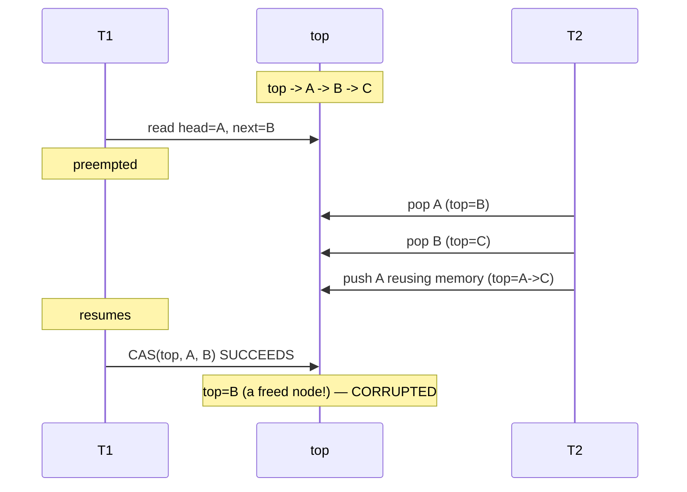
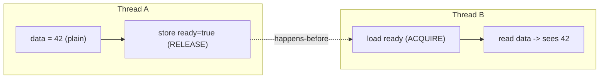

# CAS and Atomic Primitives — Middle Level

> **Read time: ~45 minutes** · **Audience:** Engineers who can already write a CAS loop and want to understand *why* it sometimes goes wrong (the **ABA problem**), *when* to pick fetch-add over CAS, what **memory ordering** (relaxed / acquire / release) actually buys you, and how to build a correct **spinlock**.

At the junior level you learned the load-compute-CAS-retry skeleton and used it to build a correct counter. That skeleton hides three subtleties that bite every intermediate engineer. First, CAS compares **values**, not **identities** — so a value that changes A → B → A looks unchanged to CAS even though the world *did* change underneath you. This is the famous **ABA problem**, and it is silently lethal in pointer-based lock-free structures. Second, there is more than one atomic operation, and choosing **fetch-add vs CAS** has real throughput consequences under contention. Third, and most importantly, atomicity is only half the story: the *other* half is **memory ordering** — the rules that govern *when* one thread's writes become visible to another. Get the ordering wrong and your code passes a thousand tests on x86, then corrupts data on ARM.

This document makes all three precise. You will construct an ABA failure by hand and fix it three ways (tagged pointers, hazard pointers cross-referenced from topic 20, double-width CAS). You will see why `LongAdder` crushes `AtomicLong` under contention. You will learn the **acquire/release** discipline that makes a spinlock actually protect the data inside it, and you will build that spinlock in all three languages.

---

## Table of Contents

1. [Introduction — Three Things Juniors Miss](#introduction)
2. [The ABA Problem](#aba)
3. [Fixing ABA — Tags, Hazard Pointers, Double-Width CAS](#aba-fixes)
4. [fetch-add vs CAS — When Each Wins](#fetchadd-vs-cas)
5. [Memory Ordering Basics — Relaxed, Acquire, Release](#memory-ordering)
6. [Comparison with Alternatives](#comparison)
7. [Building a Spinlock](#spinlock)
8. [Code Examples — Go, Java, Python](#code-examples)
9. [Error Handling](#error-handling)
10. [Performance Analysis](#performance-analysis)
11. [Best Practices](#best-practices)
12. [Visual Animation](#animation)
13. [Summary](#summary)

---

<a name="introduction"></a>
## 1. Introduction — Three Things Juniors Miss

A CAS loop that increments an integer is bulletproof: integers have no identity, so "the value is still 5" means exactly what you think. The trouble starts when CAS guards a **pointer**. Now "the pointer is still `0x1000`" does *not* mean "the structure is unchanged" — the node at `0x1000` could have been freed, reused, and re-inserted while you blinked. CAS sees the same bits and happily succeeds, corrupting your structure. That gap between *value equality* and *logical unchanged-ness* is the ABA problem.

Even when ABA isn't in play, picking the wrong primitive costs throughput. A single `AtomicLong` under a hundred contending threads becomes a bottleneck: every increment must win the cache line, so increments serialize. Knowing **why** and **what to use instead** (fetch-add semantics, striped counters) separates middle from junior.

Finally, atomicity guarantees an operation is indivisible, but says nothing about *ordering* — whether thread B, after seeing your atomic flag flip, also sees the *data you wrote before flipping it*. **Memory ordering** is the contract that ties an atomic operation to the surrounding ordinary memory accesses. It is the part everyone underestimates.

---

<a name="aba"></a>
## 2. The ABA Problem

### 2.1 The definition

> **ABA problem:** A thread reads a shared value `A`. Before it performs its CAS, other threads change the value to `B` and then back to `A`. The first thread's `CAS(addr, A, new)` **succeeds** — the value *is* `A` again — but the intervening changes have invalidated the assumption the thread based its computation on.

CAS asks "is it still `A`?" It cannot ask "has it been `A` *the whole time*?" Those are different questions, and the difference is the bug.

### 2.2 A concrete failure: lock-free stack pop

Consider a lock-free (Treiber) stack. `pop` does:

```text
loop:
    head    = load(top)          # head points to node A
    next    = head.next          # remember A's successor
    if CAS(top, head, next):     # if top still == A, set top = A.next
        return head
```

Now interleave three threads on a stack `top -> A -> B -> C`:

```text
T1: head = A; next = A.next = B          # T1 is about to CAS(top, A, B)
        --- T1 is preempted right here ---
T2: pop() -> removes A      (top = B)
T2: pop() -> removes B      (top = C)
T2: push(A) -> reuses the SAME memory for A   (top = A -> C)
        --- T1 resumes ---
T1: CAS(top, A, C? no — T1 thinks next is B!)
T1: CAS(top, A, B)  SUCCEEDS  (top really is A again)
    -> top is now set to B, but B was already popped and may be freed!
```

T1's CAS succeeds because `top` equals `A` again, but `A.next` is no longer `B` — T1 sets `top` to a node (`B`) that has already been removed and possibly freed. The stack is corrupted. This is ABA, and it is *the* reason naive lock-free structures crash in production but pass casual tests (the bad interleaving is rare).



### 2.3 Why integers are immune

For a plain counter, ABA is harmless: if the value cycled 5 → 6 → 5, the *meaning* of "5" is identical and the increment is still correct. ABA only bites when the value is a **reference whose identity carries hidden state** (like "this node and its `.next`"). Rule: **scalar CAS loops are ABA-safe; pointer CAS loops are not, unless you add protection.**

---

<a name="aba-fixes"></a>
## 3. Fixing ABA — Tags, Hazard Pointers, Double-Width CAS

There are three production techniques. Each attacks ABA from a different angle.

### 3.1 Tagged / versioned pointers (stamped reference)

Attach a **monotonically increasing counter** to the pointer. CAS the (pointer, tag) pair together. Every successful modification bumps the tag, so A-with-tag-7 ≠ A-with-tag-9 even though the pointer bits match. ABA is defeated because the tag never repeats.

```text
struct StampedPtr { ptr; tag }   // fits in one word-pair

pop:
loop:
    (head, t) = load(top)
    next = head.ptr.next
    if CAS(top, (head, t), (next, t+1)):  # compare BOTH ptr and tag
        return head
```

In Java this is **`AtomicStampedReference`** (a reference + an `int` stamp). In Go you typically pack a pointer and a 16-bit counter, or use a struct with `atomic.Pointer` plus a version field guarded together. The cost: you need a CAS wide enough to swap both fields (see double-width CAS).

### 3.2 Hazard pointers (cross-link → topic 20)

> See **`20-hazard-pointers`** for the full treatment.

A hazard pointer is a per-thread published pointer that says "I am currently using node X; do not free it." Before any thread reclaims a node, it scans all published hazard pointers; if X is hazardous, reclamation is deferred. This doesn't stop the ABA *value* from recurring, but it guarantees the **memory is never reused while a thread holds a reference to it**, which removes the *consequence* of ABA (use-after-free). Hazard pointers trade a small per-access publish cost for safe memory reclamation without a garbage collector.

### 3.3 Double-width CAS (DCAS / CMPXCHG16B)

Many CPUs offer a CAS over **two** contiguous words (x86 `CMPXCHG16B`, ARM `CASP`). This lets you atomically swap a *(pointer, counter)* pair as a single 128-bit operation — the hardware version of the tagged-pointer trick, without splitting the pointer's bits. It is the highest-performance ABA fix where available.

### 3.4 Comparison of the three fixes

| Fix | Defeats ABA by | Needs | Cost | Used by |
|---|---|---|---|---|
| **Tagged/versioned pointer** | Making the value never repeat (tag++) | Wide CAS or packed word | Tag bits; possible wraparound | `AtomicStampedReference` (Java) |
| **Hazard pointers** | Preventing memory reuse while referenced | Per-thread published slots + scan | Publish + periodic scan | Folly, concurrent C++ libs |
| **Double-width CAS** | Atomically swapping ptr+counter together | CPU support (`CMPXCHG16B`/`CASP`) | Limited platforms | Lock-free allocators, queues |

> In **garbage-collected** languages (Go, Java), use-after-free can't happen — the GC won't free a node anyone still references. This *masks* the most dangerous ABA consequence. But ABA can still corrupt *logical* invariants (the stack pointing at a logically-removed node), so tagged references remain necessary for correctness, not just memory safety.

---

<a name="fetchadd-vs-cas"></a>
## 4. fetch-add vs CAS — When Each Wins

Both can increment a counter. They differ in *guarantees* and *contention behavior*.

| | fetch-add (`Add` / `getAndAdd`) | CAS loop |
|---|---|---|
| **Retries in user code** | None — single hardware RMW | Possibly many under contention |
| **Progress guarantee** | **Wait-free** (bounded steps) | **Lock-free** (system progresses, individual thread may retry) |
| **Operation generality** | Only `+= delta` | Any `f(old)` |
| **Throughput under heavy contention** | Higher (no spin), but still serializes on the line | Lower (spin + line bounce) |
| **Use for** | Counters, sequence numbers, ring-buffer indices | Max/min, conditional updates, pointer swaps |

**Key insight:** fetch-add is **wait-free** — every thread finishes in a bounded number of steps regardless of contention, because the CPU does the add-and-return atomically with no looping. A CAS loop is only **lock-free** — the *system* always progresses, but one unlucky thread can be starved by a stream of successful competitors. When the operation is a pure add, prefer fetch-add for both simplicity *and* a stronger progress guarantee.

### 4.1 The hot-counter problem and striping

Even wait-free fetch-add serializes when *all* threads hammer *one* cache line: only one core can own a cache line in modify state at a time, so increments queue. The fix is **striping**: keep N counters (one per thread/CPU), each on its own cache line; increment your own stripe (no contention); sum all stripes on read. This is exactly what Java's **`LongAdder`** does — it trades a slightly more expensive `sum()` for near-linear write scalability.

```text
AtomicLong:  all threads -> [ one counter ]      (contended)
LongAdder:   thread i     -> [ counter[i] ]      (uncontended) ; read = sum(counters)
```

---

<a name="memory-ordering"></a>
## 5. Memory Ordering Basics — Relaxed, Acquire, Release

Atomicity says an operation is indivisible. **Memory ordering** says *which other memory operations are guaranteed visible* around it. Modern CPUs and compilers **reorder** memory accesses for speed. Without ordering rules, thread B could see your "ready" flag set *before* it sees the data the flag was supposed to announce.

### 5.1 The motivating bug

```text
Thread A:                      Thread B:
data = 42                      while (!ready) {}       // spin until ready
ready = true                   print(data)             // expects 42
```

With *no* ordering guarantees, the compiler/CPU may reorder A's two writes (store `ready` before `data`), or B may load `data` from a stale cache. B could print `0`. The flag flipped, but the data wasn't visible yet.

### 5.2 The three orderings you need

| Ordering | Meaning | Use on |
|---|---|---|
| **relaxed** | Atomic (no torn values) but **no** ordering vs other accesses. Fastest. | Pure counters where only the final total matters |
| **release** (store) | All memory writes *before* this store become visible to any thread that later *acquires* this variable. | The store that *publishes* data (`ready = true`) |
| **acquire** (load) | All memory writes that happened *before* the matching release become visible *after* this load. | The load that *consumes* the flag (reading `ready`) |
| **seq_cst** | Sequential consistency: a single global total order over all seq_cst ops. Strongest, default in Java/Go. | When in doubt; simplest to reason about |

The fix for §5.1: store `ready` with **release**, load `ready` with **acquire**. The release/acquire pair creates a **happens-before** edge: everything A wrote before the release is visible to B after the acquire. The data write is now guaranteed published.



### 5.3 What each language gives you by default

- **Go:** `sync/atomic` operations are **sequentially consistent** — you get the strong ordering automatically; there is no relaxed/acquire/release knob. Simpler, slightly less tunable.
- **Java:** `AtomicLong` etc. are **seq_cst** (volatile semantics). For finer control, **`VarHandle`** exposes `getAcquire`, `setRelease`, `getOpaque`, `compareAndExchangeAcquire`, etc.
- **Python:** the GIL serializes bytecode, and `multiprocessing` primitives use OS locks (full barriers), so you rarely choose orderings — but the *concept* still governs what C extensions must do.
- **C/C++/Rust:** you choose explicitly (`memory_order_relaxed`, `_acquire`, `_release`, `_seq_cst`) — maximum power, maximum footguns.

> **Middle-level rule:** use **relaxed** only for counters whose intermediate visibility doesn't matter. Use **acquire/release** to publish/consume data through a flag or pointer. Use **seq_cst** when unsure. In Go you get seq_cst for free; in Java reach for `VarHandle` only when profiling demands it.

---

<a name="comparison"></a>
## 6. Comparison with Alternatives

| Attribute | CAS loop | fetch-add | Mutex | Channel (Go) |
|---|---|---|---|---|
| Blocking | No | No | Yes (sleeps) | Yes (may block) |
| Progress | Lock-free | Wait-free | Blocking | Blocking |
| Generality | Any `f(old)`, one word | `+= delta` only | Any critical section | Message passing |
| Contention cost | Spin + retry | Line serialize | Context switch | Scheduler |
| Composability | Poor | Poor | Good | Good |
| ABA risk | Yes (pointers) | No | No | No |
| Best for | Lock-free heads, max/min | Counters, sequences | Multi-var invariants | Pipelines, ownership transfer |

**Choose a CAS loop when:** updating a single shared word with a value-dependent function and you must not block.
**Choose fetch-add when:** the update is a pure add — you gain wait-freedom and simplicity.
**Choose a mutex when:** the critical section spans multiple variables or is long.

---

<a name="spinlock"></a>
## 7. Building a Spinlock

A spinlock is a mutex built from one atomic flag: acquire by CAS-ing the flag 0 → 1; if that fails, spin until it's free. It is appropriate when critical sections are *very short* and you'd rather burn a few cycles spinning than pay a context switch.

```text
acquire:
    while !CAS(flag, 0, 1) { pause() }   // spin until we flip 0->1
    // ACQUIRE ordering: subsequent reads see the protected data
release:
    store(flag, 0)                       // RELEASE ordering: prior writes published
```

The **memory ordering is not optional**: the acquire must have *acquire* semantics (so the critical section can't be reordered before the lock is taken) and the release must have *release* semantics (so writes inside the section are visible to the next acquirer). Get this wrong and the lock "works" but fails to publish the data it protects.

The `pause()` (x86 `PAUSE`, ARM `YIELD`) hint tells the CPU you're spinning, reducing power and memory-order-violation penalties. Under long contention a pure spinlock wastes CPU — senior level covers backoff and adaptive locks.

---

<a name="code-examples"></a>
## 8. Code Examples — Go, Java, Python

### Example 1: Tagged-pointer fix for ABA (stamped reference)

#### Go

```go
package main

import (
	"sync/atomic"
)

// Pack a *node and a 64-bit tag together via a heap-allocated snapshot
// swapped with atomic.Pointer. The tag increments on every push/pop.
type node struct {
	val  int
	next *node
}
type stamped struct {
	head *node
	tag  uint64
}
type Stack struct {
	top atomic.Pointer[stamped] // swap (head, tag) as one unit -> defeats ABA
}

func (s *Stack) Push(v int) {
	for {
		old := s.top.Load()
		var oldHead *node
		var oldTag uint64
		if old != nil {
			oldHead, oldTag = old.head, old.tag
		}
		n := &node{val: v, next: oldHead}
		neu := &stamped{head: n, tag: oldTag + 1} // bump tag
		if s.top.CompareAndSwap(old, neu) {
			return
		}
	}
}

func (s *Stack) Pop() (int, bool) {
	for {
		old := s.top.Load()
		if old == nil || old.head == nil {
			return 0, false
		}
		neu := &stamped{head: old.head.next, tag: old.tag + 1}
		if s.top.CompareAndSwap(old, neu) { // compares ptr+tag identity
			return old.head.val, true
		}
	}
}
```

#### Java

```java
import java.util.concurrent.atomic.AtomicStampedReference;

class TreiberStack<T> {
    static class Node<T> { T val; Node<T> next; Node(T v){val=v;} }

    // AtomicStampedReference = (reference, int stamp). Stamp bump defeats ABA.
    private final AtomicStampedReference<Node<T>> top =
        new AtomicStampedReference<>(null, 0);

    void push(T v) {
        Node<T> n = new Node<>(v);
        int[] stampHolder = new int[1];
        while (true) {
            Node<T> oldTop = top.get(stampHolder);
            int stamp = stampHolder[0];
            n.next = oldTop;
            if (top.compareAndSet(oldTop, n, stamp, stamp + 1)) return;
        }
    }

    T pop() {
        int[] stampHolder = new int[1];
        while (true) {
            Node<T> oldTop = top.get(stampHolder);
            int stamp = stampHolder[0];
            if (oldTop == null) return null;
            if (top.compareAndSet(oldTop, oldTop.next, stamp, stamp + 1))
                return oldTop.val;
        }
    }
}
```

#### Python

```python
import threading

class TreiberStack:
    """
    Python has no lock-free CAS, so the compare+swap is made atomic with a lock.
    We still carry a 'tag' to illustrate how a versioned pointer defeats ABA:
    the tag changes on every mutation even if the head reference repeats.
    """
    def __init__(self):
        self._head = None          # head node (a tuple: (value, next))
        self._tag = 0
        self._guard = threading.Lock()

    def push(self, v):
        while True:
            with self._guard:
                old_head, old_tag = self._head, self._tag
            new_head = (v, old_head)
            with self._guard:                       # the CAS unit
                if self._head is old_head and self._tag == old_tag:
                    self._head = new_head
                    self._tag = old_tag + 1         # bump version -> ABA-proof
                    return

    def pop(self):
        while True:
            with self._guard:
                old_head, old_tag = self._head, self._tag
            if old_head is None:
                return None
            value, nxt = old_head
            with self._guard:
                if self._head is old_head and self._tag == old_tag:
                    self._head = nxt
                    self._tag = old_tag + 1
                    return value
```

### Example 2: A spinlock with correct acquire/release ordering

#### Go

```go
package main

import (
	"runtime"
	"sync/atomic"
)

// Go's sync/atomic is sequentially consistent, so CAS gives us the needed
// acquire on lock and the Store gives release on unlock — automatically.
type SpinLock struct{ flag atomic.Bool }

func (s *SpinLock) Lock() {
	for !s.flag.CompareAndSwap(false, true) { // acquire: flip 0->1
		runtime.Gosched() // yield instead of busy-burning (poor-man's pause)
	}
}
func (s *SpinLock) Unlock() { s.flag.Store(false) } // release
```

#### Java

```java
import java.util.concurrent.atomic.AtomicBoolean;

public class SpinLock {
    private final AtomicBoolean flag = new AtomicBoolean(false);

    public void lock() {
        // compareAndSet has volatile (seq_cst) semantics => acquire on success
        while (!flag.compareAndSet(false, true)) {
            Thread.onSpinWait(); // JDK 9+: emits PAUSE/YIELD hint
        }
    }
    public void unlock() {
        flag.set(false); // volatile write => release
    }
}
```

#### Python

```python
import threading
# Python: a "spinlock" using a busy CAS loop is pointless under the GIL
# (spinning just hogs the GIL). The idiomatic primitive is threading.Lock,
# which sleeps the waiter. Shown for completeness:
class PySpinLock:
    def __init__(self):
        self._held = False
        self._guard = threading.Lock()
    def lock(self):
        while True:
            with self._guard:           # compare-and-set the flag
                if not self._held:
                    self._held = True
                    return
            # spinning here wastes the GIL; real code uses threading.Lock()
    def unlock(self):
        with self._guard:
            self._held = False
```

### Example 3: fetch-add vs striped counter

#### Go

```go
import "sync/atomic"

// fetch-add: wait-free, but contended on one line
var hot atomic.Int64
func incHot() { hot.Add(1) }

// striped: each goroutine bumps its own line; sum on read (sketch)
type Striped struct{ cells [64]struct{ v atomic.Int64; _ [56]byte } } // pad to a cache line
func (s *Striped) Inc(id int) { s.cells[id&63].v.Add(1) }
func (s *Striped) Sum() int64 {
	var t int64
	for i := range s.cells { t += s.cells[i].v.Load() }
	return t
}
```

#### Java

```java
import java.util.concurrent.atomic.AtomicLong;
import java.util.concurrent.atomic.LongAdder;

AtomicLong hot = new AtomicLong();   // contended under many threads
hot.incrementAndGet();               // wait-free fetch-add

LongAdder adder = new LongAdder();   // striped internally, scales with cores
adder.increment();                   // near-uncontended write
long total = adder.sum();            // sums the stripes
```

#### Python

```python
# True parallel counters need processes. multiprocessing.Value is one shared
# cell with a lock (the "hot" case). For scalability you shard per-process and
# sum at the end.
import multiprocessing as mp
def worker(local):                   # each process keeps a private int (a stripe)
    c = 0
    for _ in range(1_000_000):
        c += 1
    local.value = c
# parent sums local.value across processes -> the striped pattern
```

---

<a name="error-handling"></a>
## 9. Error Handling

| Scenario | What goes wrong | Correct approach |
|---|---|---|
| Pointer CAS succeeds wrongly | ABA: value cycled A→B→A | Tagged pointer / hazard pointers / DCAS |
| Flag set but data not visible | Missing acquire/release ordering | Publish with release, consume with acquire |
| Spinlock never releases the data it guards | Used relaxed instead of acquire/release | Use seq_cst or proper acquire/release |
| Counter scales poorly | One hot cache line | Stripe (`LongAdder`-style) |
| CAS loop livelocks | Two threads endlessly undoing each other | Backoff; ensure progress invariant |
| Tag wraps around | 16-bit tag repeats under heavy churn | Use a wider tag (32/48 bit) or DCAS |
| Mixed atomic/plain access | Undefined behavior / torn reads | Access the variable atomically *everywhere* |

---

<a name="performance-analysis"></a>
## 10. Performance Analysis

The dominant cost of contended atomics is **cache-line ping-pong**: when core 1 modifies a line, the line must be invalidated in cores 2..N and shipped to core 1 in *modified* state. That cross-core transfer costs tens to hundreds of nanoseconds, and only one core can hold the line modified at a time, so contended atomics *serialize*.

#### Go

```go
import ("fmt"; "sync"; "sync/atomic"; "time")

func benchCounter(threads int) {
	var c atomic.Int64
	var wg sync.WaitGroup
	start := time.Now()
	for i := 0; i < threads; i++ {
		wg.Add(1)
		go func() { defer wg.Done(); for j := 0; j < 1_000_000; j++ { c.Add(1) } }()
	}
	wg.Wait()
	fmt.Printf("threads=%2d: %v\n", threads, time.Since(start))
}
// Expect time to grow as threads contend the single cache line.
```

#### Java

```java
import java.util.concurrent.atomic.*;
public class Bench {
    static long time(Runnable r) { long t=System.nanoTime(); r.run(); return (System.nanoTime()-t)/1_000_000; }
    public static void main(String[] a) {
        AtomicLong al = new AtomicLong();
        LongAdder la  = new LongAdder();
        // Compare al.incrementAndGet() vs la.increment() across N threads;
        // LongAdder stays flat while AtomicLong degrades with contention.
    }
}
```

#### Python

```python
import timeit
# Threads can't run Python in parallel (GIL) so contention shows up as GIL
# hand-off cost, not cache-line cost. Measure multiprocessing instead.
print(timeit.timeit("x.value += 1",
      setup="import multiprocessing as mp; x=mp.Value('q',0)", number=100_000))
```

**Takeaway:** measure on the *target* architecture. x86 (TSO, strong memory model) hides many ordering bugs that ARM (weaker model) exposes — and contention curves differ across CPUs.

---

<a name="best-practices"></a>
## 11. Best Practices

- For pointer-based lock-free structures, **always** plan an ABA defense before writing the CAS — tagged reference is the simplest.
- Prefer **fetch-add** over a CAS loop for pure counters: it is wait-free and faster.
- Stripe hot counters (`LongAdder` in Java; pad-per-cache-line in Go) when many threads write.
- Pair every **release** store with an **acquire** load — they only work together.
- In Go, lean on the seq_cst default; reach for relaxed only with a measured reason.
- In Java, reach for `VarHandle` (acquire/release/opaque) only when `AtomicX` is a proven bottleneck.
- Keep spinlock critical sections *tiny*; otherwise use a real mutex.
- Add a `pause`/`onSpinWait`/`Gosched` hint inside spin loops.

---

<a name="animation"></a>
## 12. Visual Animation

> See [`animation.html`](./animation.html).
>
> Middle-level focus in the animation:
> - Two threads in a CAS loop: watch one **succeed** and one **fail-and-retry**
> - The dedicated **ABA scenario**: a value goes A → B → A and a naive CAS *wrongly* succeeds — the exact bug from §2
> - Toggle a "tagged pointer" mode to see the version bump *defeat* ABA
> - Log of every load / compute / CAS-success / CAS-fail with tags shown

---

<a name="summary"></a>
## 13. Summary

CAS compares **values, not history**, so a pointer that cycles A → B → A fools it — the **ABA problem**, which corrupts pointer-based lock-free structures while leaving scalar counters untouched. Fix it with **tagged/versioned pointers** (bump a counter so the value never repeats — Java's `AtomicStampedReference`), **hazard pointers** (topic 20 — prevent memory reuse while referenced), or **double-width CAS** (swap pointer+tag atomically in hardware). Choose **fetch-add** over a CAS loop for pure counters: it is **wait-free**, not merely lock-free, and faster — and stripe hot counters (`LongAdder`) to avoid one contended cache line. Finally, atomicity is only half the contract; **memory ordering** is the other half. Use **release** to publish data through a flag and **acquire** to consume it, forming a happens-before edge; use **relaxed** only when intermediate visibility is irrelevant. A correct **spinlock** depends entirely on getting that acquire/release pairing right. Go gives you seq_cst for free; Java exposes finer control through `VarHandle`; Python's GIL pushes you toward locks and `multiprocessing`.

---

**Next step:** [senior.md](./senior.md) — building real lock-free data structures, contention and backoff strategies, memory-model pitfalls across languages and hardware, and false sharing.
