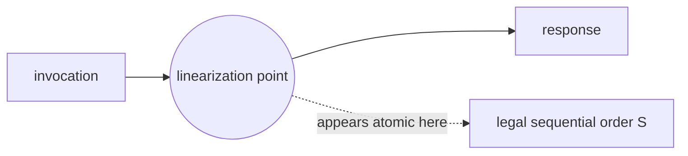
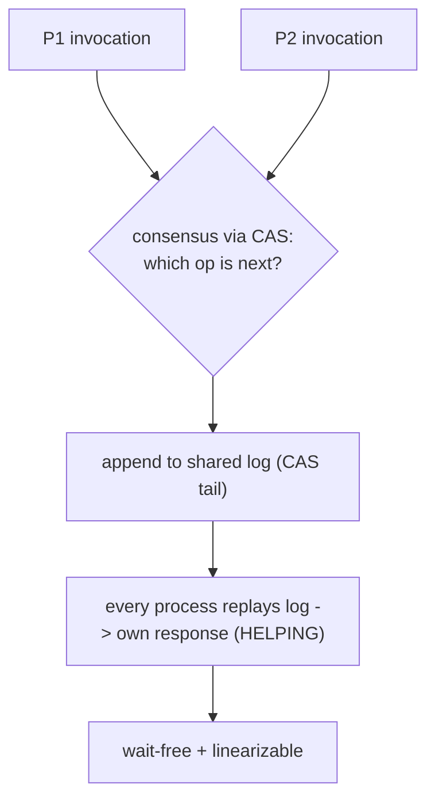

# CAS and Atomic Primitives — Theoretical Foundations

> **Read time: ~50 minutes** · **Audience:** Engineers and theorists who want the *formal* underpinnings: what **linearizability** means precisely, the rigorous definitions of **wait-free / lock-free / obstruction-free**, Herlihy's **consensus number** result proving **CAS is universal**, and the **memory-model formalism** (happens-before, axiomatic relations) that makes weak-memory reasoning sound.

This document treats concurrency as a mathematical object. We define **histories** and the **linearizability** correctness condition that explains in what sense a concurrent object "behaves like" a sequential one. We give the precise progress-condition hierarchy and locate every primitive in it. We then prove the deepest result in the field: Maurice Herlihy's **consensus hierarchy**, which assigns each synchronization primitive a *consensus number* — the maximum number of threads for which it can solve wait-free consensus — and shows that **compare-and-swap has consensus number ∞**, making it **universal**: any sequential object has a wait-free concurrent implementation using only CAS. This is the theorem that justifies CAS's central place in hardware and in this entire topic. Finally we sketch the **axiomatic memory-model** machinery (sequenced-before, reads-from, happens-before, coherence) that turns "acquire/release" from folklore into a verifiable relation.

---

## Table of Contents

1. [Formal Model — Histories and Linearizability](#linearizability)
2. [Progress Guarantees — Formal Definitions](#progress)
3. [The Consensus Hierarchy](#consensus)
4. [Why Registers Have Consensus Number 1 — The Bivalency Argument](#bivalency)
5. [CAS Is Universal — Herlihy's Universal Construction](#universal)
6. [Memory-Model Formalism](#memory-formalism)
7. [The ABA Problem, Formally](#aba-formal)
8. [Correctness Proof — Treiber Stack Linearizability](#proof)
9. [Wait-Free Bounds and the Cost of Universality](#bounds)
10. [Comparison with Alternatives](#comparison)
11. [Summary](#summary)

---

<a name="linearizability"></a>
## 1. Formal Model — Histories and Linearizability

### 1.1 Histories

A **history** `H` is a finite sequence of **invocation** and **response** events on a set of concurrent objects by a set of processes. Each method call contributes an invocation `<x.op(args) by P>` and a later response `<x: result by P>`.

```text
A method call is COMPLETE in H if both its invocation and matching response appear.
A method call is PENDING if only its invocation appears.
H is SEQUENTIAL if it alternates invocation/matching-response with no overlap.
H | P  = the subsequence of H consisting only of events by process P.
H | x  = the subsequence of events on object x.
```

A **sequential specification** of an object is the set of legal sequential histories (e.g., a stack obeys LIFO).

### 1.2 The precedence (real-time) order

Define a partial order `<_H` on complete method calls: `m0 <_H m1` iff the response of `m0` precedes the invocation of `m1` in `H` (they do **not** overlap in real time). Overlapping calls are unordered.

### 1.3 Linearizability (Herlihy & Wing, 1990)

> **Definition.** A history `H` is **linearizable** if it can be extended (by appending responses to some pending calls and discarding the rest) to a history `H'` such that there exists a **legal sequential history** `S` with:
> 1. `H'` and `S` are **equivalent** (same events per process: `H' | P = S | P` for all `P`), and
> 2. `S` respects the real-time order: `<_H ⊆ <_S`.
>
> An object is **linearizable** if every one of its histories is.

Intuitively: each operation appears to take effect **instantaneously at some single point** (the **linearization point**) between its invocation and its response, and the resulting point-order forms a legal sequential execution. Linearizability is:

- **Local (composable):** `H` is linearizable iff `H | x` is linearizable for every object `x`. This is *huge* — you can verify each object independently and compose them, which mutual-exclusion-based correctness conditions do **not** give you.
- **Nonblocking:** a pending invocation never *forces* another to block to remain linearizable.

Contrast with **sequential consistency** (program order preserved per process, but *not* real-time order across processes): sequential consistency is **not** composable. Linearizability is the gold standard for concurrent data structures precisely because of locality.



### 1.4 A worked linearizability check

Consider a shared FIFO queue with two processes. The history (time flows downward; `inv` = invocation, `res` = response):

```text
P:  inv enq(1)            res enq:void
Q:        inv enq(2)  res enq:void
P:  inv deq()                         res deq:1
```

`enq(1)` and `enq(2)` OVERLAP in real time, so `<_H` does not order them — we are free to linearize either first. `deq()` starts after both enqueues complete, so it is `<_H`-after both. To check linearizability we seek a legal sequential `S` respecting `<_H`. Two candidate orders honor the real-time edges: `enq(1), enq(2), deq()->1` and `enq(2), enq(1), deq()->?`. The observed `deq` returned **1**, so we pick `S = enq(1), enq(2), deq()->1` — a legal FIFO history (first-in 1 comes out first). It respects `<_H` (deq after both enqs), and matches the observed response. **Linearizable.** Had `deq` returned **2**, we'd choose `S = enq(2), enq(1), deq()->2`, also legal — overlapping enqueues let *either* order win, and the implementation's choice (visible in the deq result) fixes which. This freedom-within-real-time-constraints is the essence of the definition.

### 1.5 Why sequential consistency is not composable (counterexample)

```text
Two SC queues p and q. Each is individually sequentially consistent.
Process A: p.enq(x); then reads q -> EMPTY
Process B: q.enq(y); then reads p -> EMPTY

Each object's local history is SC-legal. But COMBINED, there is no single
program order making both "read EMPTY" results consistent: A's enq(x) must
precede B's read-of-p-EMPTY (so B missed it) AND B's enq(y) must precede A's
read-of-q-EMPTY — a cyclic constraint. No global sequential order exists.
=> SC of the parts does NOT compose to SC of the whole.
```

Linearizability avoids exactly this because its real-time order is a single global partial order that *does* compose. This composability is why concurrent-data-structure literature standardizes on linearizability rather than the (cheaper-to-implement) sequential consistency.

---

<a name="progress"></a>
## 2. Progress Guarantees — Formal Definitions

Linearizability is a **safety** property (nothing bad happens). Progress is a **liveness** property (something good eventually happens). The hierarchy, strongest to weakest:

| Guarantee | Formal definition | Implies |
|---|---|---|
| **Wait-free** | Every call by *every* process completes in a **bounded** number of its own steps, regardless of other processes' speeds (even if they halt). | Lock-free, obstruction-free |
| **Lock-free** | At least **one** process makes progress in a bounded number of *system* steps; the system as a whole never stalls, though individual processes may starve. | Obstruction-free |
| **Obstruction-free** | A process completes in bounded steps **if it eventually runs in isolation** (all others paused). Concurrent execution may livelock. | — |
| **Blocking (lock-based)** | No nonblocking guarantee; a delayed/halted process can block others indefinitely. | — |

Formal phrasing of wait-freedom: *there exists a bound B such that any process completes any operation within B of its own steps, irrespective of the scheduler.* Lock-freedom weakens "every process" to "some process," allowing individual starvation but forbidding system-wide stalls. Obstruction-freedom weakens further to "runs alone."

**Placements:**
- A `fetch-add` instruction is **wait-free** (one hardware step, bounded).
- A CAS *loop* (e.g., Treiber push) is **lock-free** (some thread always succeeds, but a given thread may retry unboundedly).
- A naive CAS retry without helping can be only **obstruction-free** if two threads can perpetually abort each other; adding **helping** (Michael–Scott) restores lock-freedom.
- A mutex-guarded structure is **blocking**.

A key theorem: **wait-freedom is strictly stronger than lock-freedom**, and any lock-free object can be made wait-free via a (costly) **universal construction with helping** (next section).

### 2.1 Separating the classes by counterexample

The hierarchy is *strict* — each level admits objects that satisfy it but not the next:

```text
Lock-free but NOT wait-free:
   The bare Treiber stack. Some thread always completes a push (its CAS or a
   competitor's succeeds), but an adversary scheduler can let two threads take
   turns winning forever while a THIRD thread's every CAS fails -> that thread
   never finishes -> not wait-free. Add a helping/announce array -> wait-free.

Obstruction-free but NOT lock-free:
   A pair of threads each repeatedly setting then clearing a flag the other
   needs can livelock: run concurrently, neither completes; run EITHER alone,
   it completes -> obstruction-free, but no system-wide progress under
   concurrency -> not lock-free. Software transactional memory (STM) without
   contention management is the canonical example; a contention manager
   (backoff/priority) upgrades it to lock-free in practice.
```

The practical consequence: **obstruction-freedom is cheap but fragile** (needs a contention manager to be useful), **lock-freedom is the sweet spot** (system progress with simple backoff), and **wait-freedom is expensive** (the helping tax — §9). Most production lock-free code targets lock-freedom and accepts that an individual operation has no hard latency bound, mitigating tail latency with backoff and bounded-retry fallbacks to a lock.

---

<a name="consensus"></a>
## 3. The Consensus Hierarchy

### 3.1 The consensus problem

`n` processes each **propose** a value; they must all **decide** on one common value satisfying:

```text
Validity:    the decided value was proposed by some process.
Agreement:   all deciding processes decide the SAME value.
Wait-free Termination: every nonfaulty process decides in bounded steps.
```

### 3.2 Consensus number

> **Definition (Herlihy 1991).** The **consensus number** of a synchronization object type `T` is the largest `n` for which `T` (together with atomic registers) can solve **wait-free consensus** among `n` processes. If there is no largest, the consensus number is **∞**.

This number is a *robust complexity measure of synchronization power*: an object with consensus number `n` **cannot** wait-free implement any object with a higher consensus number.

### 3.3 The hierarchy

| Object | Consensus number |
|---|---|
| Atomic read/write registers | **1** |
| `test-and-set`, `swap`, `fetch-add`, stack, queue | **2** |
| `(m,j)`-assignment / `m`-register CAS | **2m − 2** |
| **`compare-and-swap` (CAS)**, LL/SC, memory-to-memory move | **∞** |

The landmark facts:

1. **Atomic registers have consensus number 1.** Mere reads and writes **cannot** solve wait-free consensus for even *two* processes. (Proof: a bivalent-state / valency argument shows an adversary scheduler can always keep the decision undecided.)
2. **FIFO queues, stacks, test-and-set, fetch-add have consensus number 2.** They solve 2-process consensus but provably *not* 3.
3. **CAS has consensus number ∞.** It solves wait-free consensus for *any* number of processes.

```text
2-process consensus from CAS:
  shared C := ⊥                         (⊥ = "no decision yet")
  decide(myVal):
      if CAS(C, ⊥, myVal): return myVal     # I won; my value is the decision
      else:                return C          # someone won first; adopt theirs

  This is wait-free AND works for ANY n, not just 2 -> consensus number ∞.
```

The `n`-process version is identical: the *first* process whose CAS on `⊥` succeeds fixes the decision; everyone else reads it. One CAS, bounded steps, any `n`. Hence **∞**.

### 3.4 Why FIFO queue is only 2

Sketch: with two queues you can solve 2-consensus (dequeue from a pre-loaded queue to learn who went first), but a valency argument shows no protocol using queues/stacks solves 3-consensus wait-free — there's always a "critical state" where one process's step makes the outcome ambiguous to a third. The consensus number is thus a *hard separation*: no construction, however clever, lifts a power-2 object to power-∞.

---

<a name="bivalency"></a>
## 4. Why Registers Have Consensus Number 1 — The Bivalency Argument

The claim "atomic read/write registers cannot solve wait-free consensus for even 2 processes" is the foundational impossibility, proved by the **bivalency / critical-state** technique (the same machinery behind FLP). It is worth seeing in outline because it is *why* hardware must provide something stronger than load/store.

```text
Setup: 2 processes P and Q run a wait-free consensus protocol using only
       atomic registers. A protocol state is the contents of all registers
       plus each process's local state. A state is:
   - BIVALENT  if both decisions (0 and 1) are still reachable from it;
   - UNIVALENT if only one decision is reachable (0-valent or 1-valent).

Step 1 (initial bivalence): there is an initial bivalent state.
   If P proposes 0 and Q proposes 1, the outcome depends on scheduling, so
   neither decision is forced -> the start is bivalent.

Step 2 (a critical state exists): starting from a bivalent state and applying
   steps, there must be a CRITICAL state s: s is bivalent, but every single
   next step (P moves, or Q moves) leads to a univalent state. (If no such s
   existed, an adversary could keep the protocol bivalent forever, violating
   wait-free termination.)

Step 3 (contradiction at the critical state): at s, suppose P's move makes it
   0-valent and Q's move makes it 1-valent. Case-analyze the two moves:
   - If P and Q act on DIFFERENT registers, the moves COMMUTE: s.P.Q == s.Q.P,
     so the result is simultaneously 0-valent and 1-valent. Contradiction.
   - If both READ, a read changes no register; the other process cannot tell
     which read happened first, so it cannot distinguish 0-valent from
     1-valent successors. Contradiction.
   - If P WRITES a register and Q READS or WRITES the SAME register, run P's
     write, then immediately schedule P SOLELY to a decision. Q cannot have
     observed anything between, so Q's view is identical in both the 0-valent
     and 1-valent runs -> Q would decide the same value in both -> the two
     successors are NOT oppositely-valent. Contradiction.

Every case contradicts s being critical. Therefore no wait-free 2-consensus
protocol using only registers exists.  => consensus number of registers = 1. ∎
```

The decisive case is the third: a **write followed by a solo run** hides the write from the other process, so registers cannot create an *irrevocable, mutually-visible* decision point. CAS *can* — its compare-and-write is a single event that is simultaneously a read and a write, leaving an observable, atomic trace that the bivalency argument cannot erase. This is the precise sense in which CAS is "more powerful" than load/store.

---

<a name="universal"></a>
## 5. CAS Is Universal — Herlihy's Universal Construction

> **Theorem (Herlihy 1991).** Any object with consensus number ∞ (in particular **CAS**) can implement **any** sequentially-specified object in a **wait-free** manner, for any number of processes.

This is the **universality of consensus**: solving consensus is *equivalent* to implementing arbitrary shared objects wait-free. CAS, having consensus number ∞, is therefore a **universal synchronization primitive** — the theoretical justification for why CPUs ship CAS and why this entire roadmap topic centers on it.

### 4.1 The construction (sketch)

Model the object as a deterministic state machine. Maintain a shared, growing **log of invocations** as a linked structure. To apply an operation, a process:

```text
1. Create a cell for its invocation.
2. Use n-process CONSENSUS (built from CAS) to agree on which invocation
   is appended next to the shared log (resolving concurrent contenders).
3. Append the agreed cell (CAS the log tail).
4. HELP: every process replays the agreed log against a local copy of the
   state machine to compute its own response — so a slow/halted process's
   operation is still completed by others.
```

The **helping** mechanism is what upgrades lock-freedom to **wait-freedom**: because every process completes *every* pending operation it sees (not just its own), no operation can be starved. Consensus (CAS) at each step guarantees all processes agree on a single total order of operations — which is exactly a **linearization**. Thus the construction is both **linearizable** and **wait-free**.

The construction is `O(n)`-space-per-op and impractical as-is, but it is a *constructive proof*: anything you can specify sequentially, CAS can implement wait-free. Practical lock-free structures are hand-optimized specializations of this idea.



### 5.1 Why the construction yields linearizability

The log's total order *is* a linearization. Each operation's **linearization point** is the moment consensus fixes its position in the log:

```text
- All processes agree (via consensus) on ONE successor at each log slot
  => the log is a single TOTAL order of operations.
- Replaying a deterministic state machine against that order gives every
  process the SAME response for the same operation (determinism).
- The log order respects real-time: an op announced after another op's
  response is appended later (it could not have been agreed earlier).
  => <_H ⊆ <_log.
Hence the log order is a legal sequential history equivalent to H respecting
real-time order — the definition of linearizability. And because every process
HELPS complete every pending op it sees, no op is starved => wait-free. ∎(sketch)
```

This is the deep unification: **consensus produces a total order, a total order is a linearization, and helping makes it wait-free.** CAS supplies the consensus, so CAS supplies all three.

### 5.2 Practical reading of universality

Universality does **not** mean "use the universal construction." It is an *existence* theorem with a steep cost (§9). What it tells the practitioner: any object you can specify sequentially *has* a correct wait-free CAS-based implementation, so when you hand-design a lock-free queue or stack, you are building an *optimized special case* of a guaranteed-possible construction — and any "this can't be done lock-free" intuition about a sequentially-specifiable object is simply wrong. The engineering question is never *whether* but *at what cost*.

---

<a name="memory-formalism"></a>
## 6. Memory-Model Formalism

Weak-memory correctness is made rigorous by an **axiomatic model** over relations on memory events. The C++11/Java/LKMM models share this skeleton.

### 6.1 Base relations

```text
Events: reads (R), writes (W), RMWs, fences — each on a location.

sb  (sequenced-before): program order within a single thread.
rf  (reads-from):       links each read to the write it observes (W -rf-> R).
mo  (modification order / coherence): a per-location total order of writes.
sw  (synchronizes-with): a release write linked via rf to an acquire read on
                         the same location creates a cross-thread edge.
```

### 6.2 Happens-before

```text
hb (happens-before) = transitive closure of ( sb ∪ sw ).

Release/acquire rule:
  W_release(x, v)  -rf->  R_acquire(x)  ==>  W_release  -sw->  R_acquire
  Hence everything sb-before the release hb-before everything sb-after the acquire.
```

This is the *formal* meaning of the §middle "publish with release, consume with acquire": it constructs an `hb` edge so the publisher's prior writes are visible to the consumer.

### 6.3 Coherence and consistency axioms

A program is well-defined iff its event graph admits relations satisfying axioms such as:

```text
(Coherence)   hb is consistent with mo per location: no read sees a write that
              is mo-later than a write it hb-after-observes.
(No-thin-air) rf must not form a self-justifying cycle (the hardest axiom;
              cause of the "out-of-thin-air" problem in relaxed atomics).
(SC-per-loc)  per single location, all accesses appear in one consistent order.
(RMW-atomicity) a CAS/RMW reads the IMMEDIATELY mo-preceding write — no write
              may be inserted between its read and its write in mo.
```

The **RMW-atomicity** axiom is exactly what makes CAS atomic in the model: its read and write are adjacent in modification order, so no update can be "lost" between them — the formal counterpart of the §junior lost-update argument.

### 6.4 Data race

```text
Two accesses CONFLICT if same location, at least one is a write, not both atomic.
A DATA RACE = two conflicting accesses not ordered by hb.
A program with a data race on non-atomic locations has UNDEFINED behavior (C++);
correctly-synchronized (data-race-free) programs behave sequentially consistently
  -> the DRF-SC theorem: if you fence properly, you may reason as if SC.
```

The **DRF-SC guarantee** is the practical payoff of the formalism: get the release/acquire fences right (no data races), and you are entitled to reason about your program as if memory were sequentially consistent — recovering the simple intuition while running on weak hardware.

### 6.5 Standalone fences vs ordered atomics

The model also admits **fences** (memory barriers) as first-class events that constrain reordering *without* being tied to a specific load/store:

```text
fence(acquire):  no load/store AFTER the fence may be reordered before a prior
                 atomic LOAD that the fence pairs with.
fence(release):  no load/store BEFORE the fence may be reordered after a later
                 atomic STORE that the fence pairs with.
fence(seq_cst):  a full barrier; participates in the single total order S of
                 all seq_cst operations.

Hardware mapping:
   x86:   most fences are no-ops (TSO already orders all but store->load);
          only seq_cst needs an MFENCE / a LOCK-prefixed RMW.
   ARMv8: DMB ISH (inner-shareable) for release/acquire; LDAR/STLR give
          acquire/release loads/stores directly without a separate fence.
   POWER: lwsync for release/acquire; hwsync (sync) for seq_cst.
```

The cost asymmetry is the formal counterpart of §senior's "works on x86, breaks on ARM": on x86 a release store is *free* (no instruction), so omitting it is invisible; on ARM it compiles to `STLR` or a `DMB`, and omitting it lets the hardware reorder — surfacing the missing-fence bug. The abstract model is identical across architectures; only the *compiled cost of being correct* differs, which is precisely why testing on the weak architecture is mandatory.

A **standalone fence** is at least as strong as the equivalent ordered atomic and is sometimes the only way to express a pattern (e.g., a release fence ordering a *group* of prior relaxed stores against one later release store), but it is a heavier hammer; prefer ordered atomics (`getAcquire`/`setRelease`) when they suffice.

---

<a name="aba-formal"></a>
## 7. The ABA Problem, Formally

The §middle ABA problem has a precise statement in terms of the modification order `mo` of the shared location.

```text
Let x be the CAS target. A CAS by process P is the pair (read of x, write of x).
P's loop: r = read(x) returning value A; later P executes cas = CAS(x, A, new).

ABA condition: between r and cas there exist writes w1, w2, ... in mo(x) such
  that the value of x changes A -> ... -> A (returns to A) before cas executes.
  Then cas sees x == A and SUCCEEDS, yet x's HISTORY since r is non-trivial.

Why CAS cannot detect it: the CAS predicate is "current value == expected",
  a function of x's CURRENT mo-position only, NOT of the mo-segment traversed
  since r. CAS tests a point, not an interval.
```

**Soundness condition (when ABA is harmless).** Let `inv` be the data-structure invariant the algorithm relies on. ABA is *benign* iff the operation's correctness depends only on `x`'s *value*, not on the identity/history of the object `x` references:

```text
ABA-benign  iff  for all reachable states, value(x)=A  =>  the operation's
            postcondition holds regardless of intervening mo on x.

- Scalar counter (f(old)=old+1): postcondition depends only on the value A.
  => ABA-benign.  (5->6->5 then +1 still yields the correct increment.)
- Pointer pop (uses A.next read earlier): postcondition depends on A.next,
  which the intervening writes may have changed.  => NOT ABA-benign.
```

**The tag fix, formally.** Replace `x` with `x' = (ptr, tag)` and the invariant `tag strictly increases on every successful CAS` (a monotone counter). Then `value(x')=A` at `cas` *implies* no write occurred since `r` (else the tag would differ), restoring the interval property:

```text
With monotone tag t:  CAS(x', (A,t), (new, t+1)) succeeds
   =>  x' has tag t at cas-time  =>  (by monotonicity) no successful CAS
       occurred between r and cas  =>  no ABA.  ∎  (modulo tag wraparound:
       choose tag width so 2^w exceeds the max successful CASes in any
       thread's loop-window; in practice 48–64 bits is safe.)
```

LL/SC defeats ABA *structurally* instead: the store-conditional fails if **any** write touched the reservation since the load-linked, so it tests the interval directly — at the cost of spurious failures (a reservation can break with no real conflict, e.g., a cache eviction). The two fixes — monotone tag vs reservation — are the value-based and event-based duals of the same interval-detection requirement.

---

<a name="proof"></a>
## 8. Correctness Proof — Treiber Stack Linearizability

**Claim.** The CAS-based Treiber stack (push/pop) is linearizable to the sequential LIFO stack specification.

```text
Linearization points (LP):
  push: the successful CAS(top, t, n).
  pop (nonempty): the successful CAS(top, t, t.next).
  pop (empty): the load of top that returns nil (no mutation).

Lemma (single-point effect): each operation's effect on `top` occurs
  atomically at its LP and nowhere else.
  Proof: top is only ever modified by a successful CAS; between an operation's
  read of top and its successful CAS, top is unchanged (else CAS fails and we
  retry). So the net state change is exactly the CAS, an atomic event. ∎

Ordering: order operations by the real-time instants of their LPs. Because each
  LP is a single atomic CAS on the same word `top`, the LPs are totally ordered
  by mo(top). This total order is a SEQUENTIAL history S.

Legality of S: at each push LP, n.next was set to the value of top read in the
  SAME iteration, and the CAS succeeded only because top still equaled that
  value -> n is pushed onto the current top: LIFO preserved. At each pop LP,
  top advances to t.next of the node being removed -> LIFO removal. Hence S
  obeys the stack specification.

Real-time respect: if op A completes before op B starts, A's successful CAS
  precedes B's invocation, hence precedes B's LP -> A <_S B. So <_H ⊆ <_S.

By the three conditions, every history is linearizable to S. ∎
```

**Progress.** Each failed CAS by some process is caused by a *successful* CAS of another process (top changed). So in any window where the system takes steps, some operation's LP fires — **lock-free**. It is *not* wait-free: an unlucky thread can be overtaken indefinitely (no helping in the bare Treiber stack).

---

<a name="bounds"></a>
## 9. Wait-Free Bounds and the Cost of Universality

Universality (CAS implements anything wait-free) is a *possibility* result; it says nothing about *cost*. The complexity-theoretic picture is sobering and explains why hand-tuned lock-free structures, not the universal construction, are what ships.

```text
Space lower bound (Jayanti, Tan, Toueg / Fich, Hendler, Shavit):
   Any WAIT-FREE implementation of many common objects (counters, stacks,
   queues, snapshots) from CAS/registers requires Ω(n) space for n processes
   in the worst case — you cannot get below per-process state for helping.

Step-complexity of the universal construction:
   Each operation does O(n) work in the worst case: it may help (replay)
   pending operations of all n processes against its local state copy.
   => universal construction is correct but O(n)-per-op and O(n)-space —
      a constructive PROOF, not a practical implementation.

Lock-free vs wait-free cost gap:
   Lock-free Treiber push is O(1) amortized work per successful op (just a
   CAS), but UNBOUNDED retries for an individual unlucky thread.
   Making it wait-free (bounded per-thread) requires HELPING, which adds the
   O(n) bookkeeping above. This is the fundamental wait-free TAX.
```

The **fast-path/slow-path** design pattern reconciles the two: run a cheap lock-free fast path (a bare CAS), and fall back to a wait-free slow path (with helping) only after a thread has been starved past a threshold. The result is wait-free *in the worst case* but pays the O(n) tax *only* when starvation actually occurs — common operations stay O(1). This is how real wait-free queues (e.g., the Kogan–Petrank queue) achieve practical performance.

```text
fast-path/slow-path (schematic):
   op():
       for i in 1..K:                # K cheap lock-free attempts
           if try_cas_fast(): return
       publish_request()             # announce to others (helping array)
       run_slow_wait_free_with_help()  # bounded; others help complete it
```

The lesson: **CAS's consensus-number-∞ guarantees wait-freedom is *achievable*; engineering decides whether you pay its price.** Most systems correctly choose lock-free + backoff (cheaper, "good enough" liveness) and reserve true wait-freedom for hard-real-time or starvation-sensitive paths.

---

<a name="comparison"></a>
## 10. Comparison with Alternatives

| Attribute | CAS | LL/SC | fetch-add | test-and-set | atomic register |
|---|---|---|---|---|---|
| Consensus number | ∞ | ∞ | 2 | 2 | 1 |
| Universal? | Yes | Yes | No | No | No |
| ABA-prone | Yes | No (SC fails on any write) | N/A | N/A | N/A |
| Hardware | x86 `CMPXCHG` | ARM/POWER/RISC-V `LDxR/STxR` | x86 `XADD` | x86 `XCHG`/`BTS` | aligned mov |
| Spurious failure | No | **Yes** (any intervening event) | No | No | No |
| Builds wait-free arbitrary objects | Yes | Yes | No | No | No |

**LL/SC vs CAS:** Load-Linked/Store-Conditional reserves a location on load; the conditional store succeeds only if *nothing* wrote the location since — so it is **immune to ABA** (an A→B→A cycle still triggers a write that breaks the reservation). The price is **spurious failures** (a cache eviction or context switch can break the reservation with no actual conflict), so LL/SC also lives inside a retry loop. Both have consensus number ∞ and are interconvertible in theory.

---

<a name="summary"></a>
## 11. Summary

Formally, a concurrent object is correct iff every history is **linearizable** — extendable to a legal sequential history that respects real-time order, with each operation taking effect at a single **linearization point**; linearizability's **locality** lets us verify and compose objects independently, which sequential consistency cannot. Liveness is graded by the **progress hierarchy**: **wait-free** (bounded steps for *every* process) ⊃ **lock-free** (some process always progresses) ⊃ **obstruction-free** (progress in isolation) ⊃ blocking. Herlihy's **consensus number** measures synchronization power: registers = 1, queues/stacks/test-and-set/fetch-add = 2, and **CAS (and LL/SC) = ∞**. Consensus number ∞ means CAS is **universal** — Herlihy's **universal construction**, powered by consensus and **helping**, implements *any* sequential object in a **wait-free, linearizable** way, which is the theoretical reason CAS is the primitive hardware exposes and software builds on. The **axiomatic memory model** (sb, rf, mo, sw, hb, plus the RMW-atomicity and coherence axioms) turns acquire/release into a verifiable `happens-before` relation and delivers the **DRF-SC** payoff: a data-race-free program may be reasoned about as sequentially consistent. We proved the **Treiber stack linearizable and lock-free** directly from these definitions — the bridge from the §junior lost-update intuition to a rigorous correctness argument.

---

**Next step:** [interview.md](./interview.md) — tiered interview questions across all four levels plus a lock-free counter / Treiber-stack coding challenge in Go, Java, and Python.
