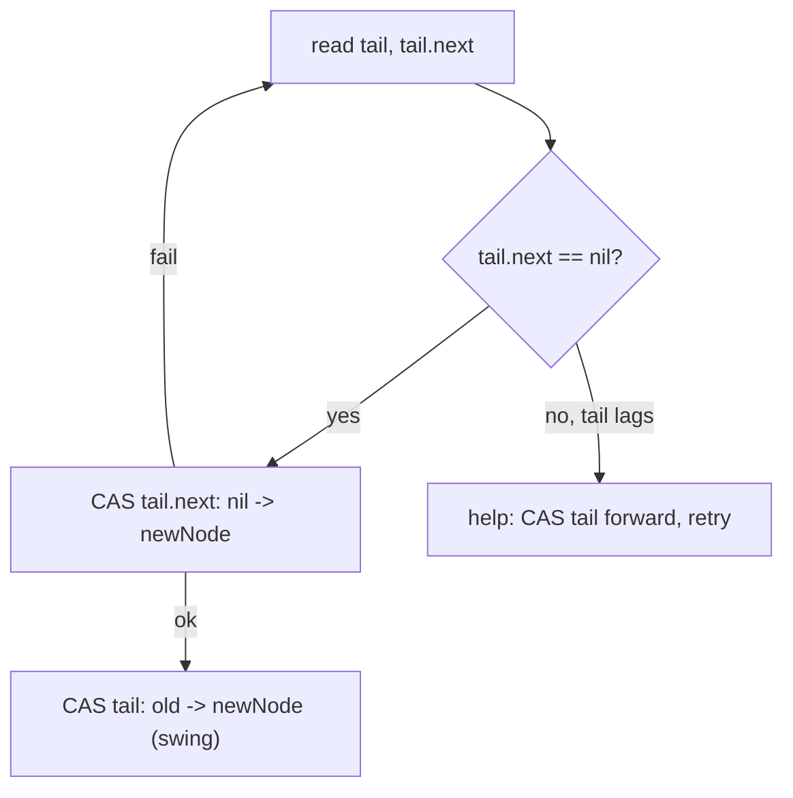
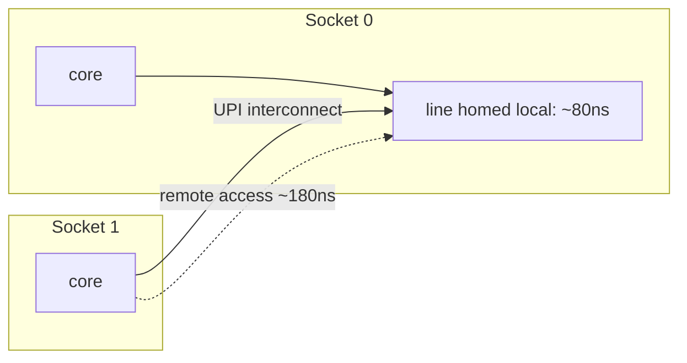
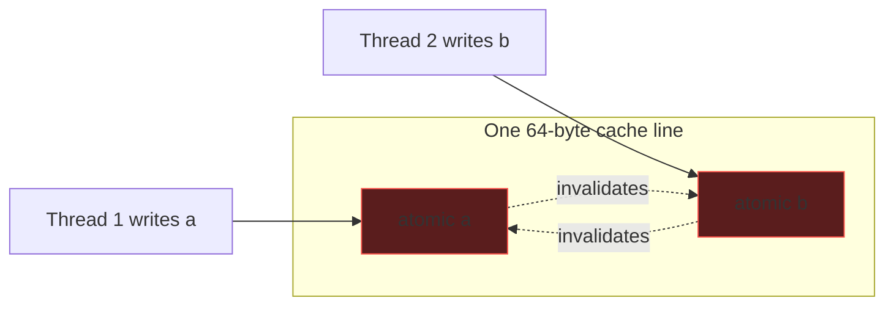
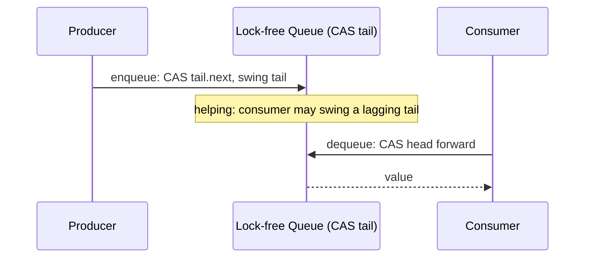

# CAS and Atomic Primitives — Senior Level

> **Read time: ~50 minutes** · **Audience:** Engineers who already understand CAS loops, ABA, and acquire/release, and now need to *build* lock-free structures, tame **contention** with backoff, navigate **memory-model differences** across languages and CPUs, and eliminate **false sharing**. This is where atomics meet real production constraints: tail latency, NUMA, and observability.

At senior level the question stops being "what does CAS do?" and becomes "**how do I architect a concurrent component around CAS so it stays fast and correct under production load, on the hardware I actually ship to?**" Three forces dominate. First, **contention**: a single shared word that hundreds of cores hammer becomes a serialization point whose throughput *collapses* as you add cores — you must back off, stripe, or restructure. Second, **memory-model heterogeneity**: x86's strong TSO model forgives ordering bugs that ARM, POWER, and RISC-V will surface in production; code that "works" in your AWS x86 staging can corrupt data on Graviton. Third, **cache-line economics**: two unrelated atomics on the same 64-byte line silently destroy each other's performance through **false sharing**, a bug invisible in code review and only findable with perf counters.

This document builds a complete **Treiber stack** and a **Michael–Scott queue** (cross-linked to topics 16 and 17), shows exponential **backoff** and the **elimination** optimization, dissects the Go and Java memory models side by side, and demonstrates how to find and fix false sharing with padding. You'll leave able to ship a lock-free component and defend it in design review.

---

## Table of Contents

1. [Introduction — From Primitive to System](#introduction)
2. [Building Lock-Free Structures (cross-link 16, 17)](#building)
3. [Safe Memory Reclamation in Depth](#smr)
4. [Contention and Backoff](#contention)
5. [NUMA and the Cost of a Cache Line](#numa)
6. [Batching, Flat Combining, and Sharding](#batching)
7. [Memory-Model Pitfalls Across Languages and Hardware](#memory-model)
8. [False Sharing](#false-sharing)
9. [Comparison with Alternatives](#comparison)
10. [Architecture Patterns](#architecture)
11. [Code Examples](#code-examples)
12. [Observability](#observability)
13. [Failure Modes](#failure-modes)
14. [Migration and Rollout Strategy](#migration)
15. [Summary](#summary)

---

<a name="introduction"></a>
## 1. Introduction — From Primitive to System

A CAS instruction is ~20 nanoseconds uncontended. Put 64 cores on it and the *effective* throughput can fall below a mutex, because every successful CAS must first pull the cache line into the writing core's L1 in *exclusive* state, invalidating it everywhere else. The line ping-pongs across the interconnect, and on a NUMA box it crosses sockets. Senior engineering is largely about *avoiding* that ping-pong: pushing contention off the hot path with backoff, striping, batching, and elimination.

Correctness gets harder too. The atomics you wrote against the x86 you develop on carry *stronger* ordering than the abstract language memory model promises. Deploy the same binary, recompiled, to ARM Graviton or Apple Silicon, and reorderings the x86 never performed suddenly happen — exposing missing fences as data corruption that appears only under load, only on that hardware, and never reproduces locally. You must reason at the level of the *language memory model*, not the CPU you happen to use.

---

<a name="building"></a>
## 2. Building Lock-Free Structures (cross-link 16, 17)

> Full treatments live in **`16-lock-free-stack`** and **`17-lock-free-queue`**. Here we focus on the CAS reasoning that underlies both.

### 2.1 The Treiber stack (cross-link 16)

A lock-free stack: `push` and `pop` both CAS the `top` pointer.

```text
push(v):                          pop():
  n = newNode(v)                    loop:
  loop:                               t = load(top)
    t = load(top)                     if t == nil: return empty
    n.next = t                        next = t.next
    if CAS(top, t, n): return         if CAS(top, t, next): return t.val
```

The push is straightforward and ABA-immune *for push* (we install a fresh node). The **pop is where ABA bites** (§ middle): if `top` cycles A→B→A, `t.next` may be stale. In GC languages the GC prevents use-after-free; you still need a tag for logical correctness if nodes can be re-pushed. Push/pop also need **release on the CAS that publishes the new node** and **acquire on the load of `top`** so a popper sees the pusher's fully-initialized node.

### 2.2 The Michael–Scott queue (cross-link 17)

A two-lock-free FIFO using `head` and `tail` pointers with a sentinel node. The subtlety: `tail` may lag one node behind reality, so enqueue does a *two-step* CAS — first CAS the last node's `next`, then try to **swing `tail` forward** (and *helps* swing it if it finds tail lagging). This **helping** pattern — a thread completes another thread's half-finished operation — is the hallmark of robust lock-free design and is what makes the structure lock-free rather than merely obstruction-free.



### 2.3 The reclamation problem

The deepest hazard in lock-free structures is **safe memory reclamation (SMR)**: when can you free a node nobody can reach? In non-GC languages a popped node might still be read by a stalled thread. Solutions — **hazard pointers** (topic 20), **epoch-based reclamation (EBR)**, and **RCU** — are mandatory production machinery. In Go/Java the GC solves this for you, which is a major reason lock-free code is *more* practical in managed languages.

---

<a name="smr"></a>
## 3. Safe Memory Reclamation in Depth

A lock-free pop *logically* removes a node, but it cannot immediately `free` it: another thread that read `top` a microsecond earlier may still dereference it. Reclaiming too early is a **use-after-free**; never reclaiming is a leak. The three industrial answers trade differently.

| Scheme | Idea | Reader cost | Reclaim latency | Bounded memory? | Used by |
|---|---|---|---|---|---|
| **Hazard pointers** (topic 20) | Each thread *publishes* the pointer it's using; reclaimers skip published nodes | One store + fence per access | Low | Yes (bounded retired list) | Folly, libcds |
| **Epoch-based (EBR)** | Threads enter an epoch; a node retired in epoch E is freed once all threads pass E+2 | Very low (epoch bump) | Medium (depends on stragglers) | No (a stalled thread pins memory) | Crossbeam (Rust), ck |
| **RCU** | Readers run lock-free; a writer waits for a *grace period* (all readers depart) before reclaiming | Near-zero | High (grace period) | No | Linux kernel |
| **Quiescent-state (QSBR)** | Threads declare "quiescent" points; reclaim when all have quiesced | Near-zero | Medium | No | userspace-rcu |
| **GC** (Go/Java) | The runtime never frees a reachable node | Zero (amortized into GC) | GC-cycle | Yes | Go, Java |

The senior decision: **in Go/Java, lean on the GC** — it is the single biggest reason lock-free code is tractable there, because the entire SMR problem evaporates (a node referenced by *any* thread is never collected). In C/C++/Rust you must pick a scheme; **hazard pointers** give bounded memory at a per-access cost, **EBR/RCU** give near-free reads but let a stalled thread pin unbounded memory. Choose hazard pointers when memory is tight and threads may stall; choose EBR/RCU for read-mostly, well-behaved workloads.

> **Subtle trap even with a GC:** the GC prevents *use-after-free*, but it does **not** prevent *logical* ABA. A node can be popped, become collectible, *not yet collected*, and re-pushed — `top` cycles to the same reference and a stale CAS corrupts the *structure* without any memory error. That's why §middle's tagged pointers remain necessary in Go/Java for correctness, not just safety.

---

<a name="contention"></a>
## 4. Contention and Backoff

When a CAS fails, retrying *immediately* is often the worst choice — you slam the contended line again, increasing the chance everyone fails again (a livelock-ish thrash). The cure is **backoff**.

| Strategy | Behavior | When |
|---|---|---|
| **Spin (no backoff)** | Retry instantly | Very low contention, very short sections |
| **Exponential backoff** | Wait 1,2,4,8… (capped) before retry, with jitter | Moderate–high contention |
| **CPU pause hint** | `PAUSE`/`onSpinWait`/`Gosched` between tries | Always, inside any spin |
| **Yield to scheduler** | Give up the core after N spins | Oversubscribed (threads > cores) |
| **Elimination** | Pair a push with a concurrent pop, skip the stack entirely | Stack under symmetric push/pop load |

**Exponential backoff with jitter** mirrors network retry: after each failed CAS, sleep a random time in `[0, 2^attempt * base)`, capped. Jitter de-synchronizes contenders so they stop colliding in lock-step. This is the single highest-leverage tweak for a contended CAS loop.

**Elimination** (Hendler–Shavit–Yahalom) is cleverer: a push and a pop that collide can *cancel out* — the push hands its value directly to the pop via a side "elimination array," and neither touches the stack. Under balanced load this makes a stack scale almost linearly, because most operations never reach the contended `top`.

```text
casLoopWithBackoff(addr, f):
    attempt = 0
    for:
        old = load(addr)
        if CAS(addr, old, f(old)): return
        backoff(attempt)           # sleep random in [0, 2^attempt * base), capped
        attempt = min(attempt+1, CAP)
```

### 4.1 Why immediate retry is harmful

Retrying instantly after a failed CAS means you re-issue the locked read-modify-write the moment the line is contended, *maximizing* coherence traffic. Worse, under symmetric contention threads can fall into lock-step: all fail, all retry simultaneously, all fail again. Backoff with **jitter** breaks the symmetry. The geometric growth bounds the *number* of collisions to `O(log contenders)` in expectation, while jitter ensures contenders spread out in time rather than re-colliding.

### 4.2 Choosing a backoff cap

Too small a cap and you still thrash; too large and lightly-contended operations eat needless latency. A practical recipe: `base ≈ 1–5 µs`, `cap = base * 2^10`, reset `attempt` to 0 on every success. Adaptive variants (TCP-like additive-increase/multiplicative-decrease) tune the cap from observed failure rate. For oversubscribed systems (threads > cores) prefer **yielding** the core after a few spins over sleeping, so the lock holder can run.

---

<a name="numa"></a>
## 5. NUMA and the Cost of a Cache Line

On a multi-socket server, memory is **non-uniform**: a core accessing a cache line *homed* on its own socket pays ~80 ns; a line homed on a remote socket pays ~140–200+ ns, traversing the inter-socket interconnect (UPI/Infinity Fabric). A single hot atomic doesn't just serialize — under NUMA it serializes *across sockets*, the most expensive coherence path in the machine.

Consequences for CAS-heavy design:

- **A global counter on a 2-socket box can be ~2× slower than on a single socket**, purely from cross-socket line transfers — the same binary, different topology.
- **Per-socket (or per-core) striping** keeps each stripe's cache line homed near its writers, collapsing cross-socket traffic. The read-side `sum()` pays the cross-socket cost, but reads are rare.
- **NUMA-aware allocation** (pin a stripe's memory to the socket whose threads touch it, via `numactl`/`libnuma`/`madvise`) turns remote accesses into local ones.
- **Thread pinning** (CPU affinity) keeps a thread on the socket that owns its data, so striping actually pays off.



The senior takeaway: **measure on the production topology.** A lock-free design validated on a laptop (one socket, one NUMA node) can regress badly on a 2- or 4-socket server. Sharding + NUMA-aware placement + affinity is the standard mitigation.

---

<a name="batching"></a>
## 6. Batching, Flat Combining, and Sharding

Sometimes the best way to win a contention war is to *not fight it*. Three techniques amortize or eliminate the hot CAS.

**Batching.** Instead of N threads each CAS-ing once, accumulate work locally and apply it in bulk. A producer that has 100 items to enqueue can build a local chain and splice it in with a *single* CAS, turning 100 contended operations into one. Throughput rises because the contended line is touched 100× less.

**Flat combining** (Hendler, Incze, Shavit, Tzafrir). Threads publish their operations into a per-thread slot; one thread becomes the temporary **combiner**, scans the slots, and applies *all* pending operations to the structure under a single lock/CAS, then publishes results back. Counterintuitively, serializing through one combiner can beat fine-grained lock-free CAS, because it eliminates cache-line bouncing: the structure stays hot in *one* core's cache while the combiner drains the queue. It shines on contended stacks, queues, and priority queues.

**Sharding (revisited).** For commutative aggregates, the cleanest answer is to never share the word at all — per-thread/per-core cells summed on read (`LongAdder`, sharded metrics). Sharding turns a contended write into an uncontended one; the cost moves to the (rare) read.

| Technique | Best when | Cost moved to | Example |
|---|---|---|---|
| Batching | Operations arrive in bursts | Local accumulation | Bulk enqueue, log appends |
| Flat combining | High contention, sequential bottleneck acceptable | Combiner thread | Contended stack/queue/PQ |
| Sharding | Commutative aggregate | Read/aggregation | `LongAdder`, counters |

---

<a name="memory-model"></a>
## 7. Memory-Model Pitfalls Across Languages and Hardware

### 4.1 Hardware models, weakest to strongest

| Architecture | Model | Reorders allowed |
|---|---|---|
| **x86 / x86-64** | TSO (Total Store Order) | Only store→load (store buffer); loads not reordered with loads |
| **ARMv8 / AArch64** | Weak | Loads and stores freely reordered unless fenced |
| **POWER** | Very weak | Even more aggressive; needs explicit `lwsync`/`hwsync` |
| **RISC-V (RVWMO)** | Weak | Similar to ARM |

The trap: **x86 almost never reorders**, so a program missing an acquire/release fence often *appears* correct on x86. The same logic on ARM reorders and breaks. Senior rule: **reason at the language memory model, test on weak hardware (ARM) in CI.**

### 4.2 Language memory models

| | Go | Java (JMM) | C/C++/Rust |
|---|---|---|---|
| Default atomic ordering | Sequentially consistent | seq_cst (volatile) for `AtomicX` | You choose per op |
| Acquire/release knobs | No (seq_cst only) | Yes, via `VarHandle` | Yes (`memory_order_*`) |
| Happens-before source | channel send/recv, mutex, atomics | volatile, locks, `Thread.start/join`, finals | atomics + fences |
| Data race = | undefined behavior | benign-ish for some, UB for others | undefined behavior |

- **Go** keeps it simple: all `sync/atomic` ops are sequentially consistent. You cannot accidentally pick a too-weak ordering. The cost is you can't hand-tune to relaxed for a hot counter. The Go memory model defines happens-before via channels, mutexes, and atomics.
- **Java**'s JMM gives `AtomicX` volatile (seq_cst) semantics. `VarHandle` (JDK 9+) unlocks `getAcquire`/`setRelease`/`getOpaque`/`compareAndExchangeRelease`, letting experts shave fences — at the risk of subtle bugs. `final` fields have special publication guarantees.
- **C++/Rust** give the full `memory_order` menu — maximum control and maximum danger; a single misplaced `relaxed` is a heisenbug.

### 4.3 The canonical cross-hardware bug

```text
// Publishing a pointer to an initialized object
Thread A:  obj.field = 42;            // (1) plain write
           atomic_store(ptr, obj, RELAXED);   // (2) WRONG ordering
Thread B:  o = atomic_load(ptr, RELAXED);     // (3)
           if o: read o.field          // (4) may see field == 0 on ARM!
```

With `relaxed`, nothing orders (1) before (2), nor (3) before (4). On x86, store buffering still roughly preserves order and it usually works. On ARM, B can observe the pointer before the field write — classic partial-initialization bug. **Fix:** `release` on (2), `acquire` on (3). In Go you'd use a seq_cst atomic store/load (automatic). In Java, a volatile/`setRelease`+`getAcquire` pair.

---

<a name="false-sharing"></a>
## 8. False Sharing

Cache coherence operates at **cache-line granularity** (typically 64 bytes), not per-variable. If two atomics that *different threads* update land on the *same line*, every update to one invalidates the other in the other core's cache — even though the variables are logically independent. Throughput craters. This is **false sharing**.

```text
struct { atomic int a; atomic int b; }   // a and b share one 64-byte line
Thread 1 hammers a;  Thread 2 hammers b;
-> the line ping-pongs between cores on EVERY update, as if they shared one variable.
```

**Fix: pad each hot atomic to its own cache line.**

```text
struct Padded { atomic int v; byte _pad[56]; }   // 8 + 56 = 64 bytes
```

A striped counter (§ middle) is *only* effective if its stripes are padded — otherwise the stripes false-share and you've gained nothing. Java offers `@Contended` (with `-XX:-RestrictContended`) to auto-pad; Go uses manual `[N]byte` padding; C++ uses `alignas(64)`.



Finding it: false sharing shows up as high `LLC` / `cache-misses` and HITM (hit-modified) events in `perf c2c` on Linux, with no obvious cause in code. It is one of the most common "we added atomics and it got *slower*" surprises.

---

<a name="comparison"></a>
## 9. Comparison with Alternatives

| Attribute | Lock-free (CAS) | Mutex-guarded | Striped/sharded | Channel/actor |
|---|---|---|---|---|
| Throughput under contention | Good *with* backoff + padding | Falls off (context switches) | Best for counters | Good (no shared mutation) |
| Tail latency p99 | No blocking → low, but retry spikes | Lock convoy spikes | Low | Scheduler-bound |
| Correctness difficulty | High (ABA, ordering, SMR) | Low | Medium | Low |
| Composability | Poor | Good | Poor | Good |
| Memory reclamation | Hard (HP/EBR/RCU) or GC | Trivial | Trivial | Trivial |
| Production examples | Java `ConcurrentLinkedQueue`, Go runtime scheduler, Disruptor | Most app code | `LongAdder`, sharded metrics | Go channels, Akka |

**Choose lock-free when:** a small hot structure (queue head/tail, free list, counter) is a proven bottleneck and blocking is unacceptable (low-latency trading, runtime internals).
**Choose a mutex when:** the section is non-trivial or spans state — simpler and usually fast enough.
**Choose striping when:** the operation is a commutative aggregate (count, sum).

---

<a name="architecture"></a>
## 10. Architecture Patterns



- **Disruptor / ring buffer:** a pre-allocated array with atomic sequence counters; producers `fetch-add` a claim index, consumers track a published cursor. Avoids node allocation and pointer-chasing; used in LMAX, log4j2, Aeron. Sequences are cache-line padded to kill false sharing.
- **Sharded counters / metrics:** per-core atomic cells, summed on scrape. Standard for high-cardinality metrics.
- **Seqlock:** an even-numbered version counter; writers bump it odd→write→even; readers retry if the version changed or is odd. Read-mostly data with cheap reads (no CAS on the read path).
- **RCU (read-copy-update):** readers never synchronize; writers publish a new version and defer reclamation until all readers depart. Linux-kernel staple.

---

<a name="code-examples"></a>
## 11. Code Examples

### Michael–Scott lock-free queue enqueue with helping (Go)

```go
// The two-step enqueue: CAS the last node's next, then swing tail.
// If tail lags (tail.next != nil), HELP by swinging it before retrying.
type msNode struct {
	val  int
	next atomic.Pointer[msNode]
}
type MSQueue struct {
	head atomic.Pointer[msNode]
	tail atomic.Pointer[msNode]
}

func NewMSQueue() *MSQueue {
	sentinel := &msNode{}
	q := &MSQueue{}
	q.head.Store(sentinel)
	q.tail.Store(sentinel)
	return q
}

func (q *MSQueue) Enqueue(v int) {
	n := &msNode{val: v}
	for {
		tail := q.tail.Load()
		next := tail.next.Load()
		if tail == q.tail.Load() { // tail still consistent?
			if next == nil {
				// try to link the new node after tail
				if tail.next.CompareAndSwap(nil, n) {
					// success: try to swing tail forward (ok if it fails — someone helps)
					q.tail.CompareAndSwap(tail, n)
					return
				}
			} else {
				// tail is lagging — HELP swing it forward, then retry
				q.tail.CompareAndSwap(tail, next)
			}
		}
	}
}
```

The **helping** in the `else` branch is what keeps the queue lock-free: a thread that finds the tail lagging doesn't wait for the original enqueuer to finish — it completes the swing itself, then retries. No single stalled thread can stall the structure.

### Treiber stack with backoff (Go)

```go
package main

import (
	"math/rand"
	"runtime"
	"sync/atomic"
	"time"
)

type node struct {
	val  int
	next *node
}
type Stack struct{ top atomic.Pointer[node] }

func backoff(attempt int) {
	if attempt == 0 {
		runtime.Gosched()
		return
	}
	cap := 1 << min(attempt, 10)
	time.Sleep(time.Duration(rand.Intn(cap)) * time.Microsecond) // jittered
}
func min(a, b int) int { if a < b { return a }; return b }

func (s *Stack) Push(v int) {
	n := &node{val: v}
	for attempt := 0; ; attempt++ {
		t := s.top.Load()              // acquire (seq_cst in Go)
		n.next = t
		if s.top.CompareAndSwap(t, n) { // release on success
			return
		}
		backoff(attempt)
	}
}

func (s *Stack) Pop() (int, bool) {
	for attempt := 0; ; attempt++ {
		t := s.top.Load()
		if t == nil {
			return 0, false
		}
		if s.top.CompareAndSwap(t, t.next) {
			return t.val, true
		}
		backoff(attempt)
	}
}
```

### Treiber stack (Java, with VarHandle for explicit ordering)

```java
import java.lang.invoke.MethodHandles;
import java.lang.invoke.VarHandle;

public class TreiberStack<T> {
    static final class Node<T> { T val; Node<T> next; Node(T v){val=v;} }

    private volatile Node<T> top;      // volatile => seq_cst baseline
    private static final VarHandle TOP;
    static {
        try {
            TOP = MethodHandles.lookup()
                .findVarHandle(TreiberStack.class, "top", Node.class);
        } catch (ReflectiveOperationException e) { throw new ExceptionInInitializerError(e); }
    }

    public void push(T v) {
        Node<T> n = new Node<>(v);
        int attempt = 0;
        while (true) {
            Node<T> t = (Node<T>) TOP.getAcquire(this); // acquire load
            n.next = t;
            // compareAndSet on a VarHandle has volatile (release+acquire) semantics
            if (TOP.compareAndSet(this, t, n)) return;
            onBackoff(attempt++);
        }
    }

    public T pop() {
        int attempt = 0;
        while (true) {
            Node<T> t = (Node<T>) TOP.getAcquire(this);
            if (t == null) return null;
            if (TOP.compareAndSet(this, t, t.next)) return t.val;
            onBackoff(attempt++);
        }
    }

    private static void onBackoff(int a) {
        Thread.onSpinWait();
        if (a > 6) Thread.yield();
    }
}
```

### Cache-line padded striped counter (Go)

```go
type paddedCell struct {
	v    atomic.Int64
	_pad [56]byte // 8 (Int64) + 56 = 64 bytes -> own cache line, no false sharing
}
type StripedCounter struct{ cells [64]paddedCell }

func (s *StripedCounter) Inc() {
	id := runtime_procPin()       // pin to a P; sketch — real code uses a hash
	s.cells[id&63].v.Add(1)
}
func (s *StripedCounter) Sum() (t int64) {
	for i := range s.cells {
		t += s.cells[i].v.Load()
	}
	return
}
```

### Python — process-based, since the GIL precludes lock-free threading

```python
import multiprocessing as mp

# Senior reality in Python: you do NOT build lock-free structures in pure
# Python — the GIL serializes bytecode and there is no atomic CAS. For real
# parallelism, shard across PROCESSES and combine results. The CAS/backoff
# theory still governs any C extension or the CPython interpreter internals.
def worker(idx, return_dict):
    local = 0
    for _ in range(2_000_000):
        local += 1          # private accumulator = a padded stripe, no contention
    return_dict[idx] = local

if __name__ == "__main__":
    with mp.Manager() as mgr:
        rd = mgr.dict()
        ps = [mp.Process(target=worker, args=(i, rd)) for i in range(4)]
        for p in ps: p.start()
        for p in ps: p.join()
        print("total =", sum(rd.values()))   # combine stripes
```

---

<a name="observability"></a>
## 12. Observability

| Signal | Tool / metric | What it tells you |
|---|---|---|
| CAS retry rate | App counter incremented on each failed CAS | Contention hotness; if high → backoff/stripe |
| Cache-line bouncing | `perf c2c`, HITM events | False sharing or hot atomic |
| L2/LLC miss spike | `perf stat -e cache-misses` | Memory-bound contention |
| Spin time | Time-in-spin histogram | Whether spinning should become blocking |
| NUMA cross-socket traffic | `numastat`, `perf` remote-access counters | Atomic on a line owned by another socket |
| Throughput vs core count | Load test sweeping thread count | Detects negative scaling (the contention cliff) |

**Golden rule:** instrument the **retry count**. A lock-free structure whose CAS-failure rate climbs with load is telling you it's about to fall off the contention cliff. Alert on it.

---

<a name="failure-modes"></a>
## 13. Failure Modes

- **Contention cliff:** throughput *decreases* as cores increase past a point. Mitigate with backoff, striping, elimination, or batching.
- **False sharing:** unrelated atomics share a line; pad to 64 bytes.
- **Memory-model heisenbug:** works on x86, corrupts on ARM. Reason at the language model; CI on ARM.
- **Livelock:** two threads endlessly invalidate each other's progress with no backoff. Add jittered backoff.
- **ABA in production:** rare interleaving corrupts a pointer structure under load only. Use tags/hazard pointers/DCAS; rely on GC for memory safety.
- **Tail-latency spikes:** a thread that retries many times sees a latency outlier even though throughput is fine. Bound retries or fall back to a lock.
- **Unsafe reclamation:** freeing a node still referenced by a stalled thread (non-GC). Use HP/EBR/RCU.

---

<a name="migration"></a>
## 14. Migration and Rollout Strategy

Replacing a mutex-guarded component with a lock-free one is a *risky* change — bugs are timing-dependent and may not appear in tests. A disciplined rollout:

1. **Start with the simplest correct thing.** Ship the mutex version first. Only move to lock-free when profiling proves the lock is the bottleneck (high lock-wait time, convoying). Premature lock-free is the classic senior mistake.
2. **Prefer the library.** `java.util.concurrent.ConcurrentLinkedQueue`, `LongAdder`, Go channels, and the Disruptor are battle-tested. Hand-rolled lock-free code should be a last resort with a strong justification.
3. **Property-test the linearizability.** Use a tool (jcstress for the JVM, `go test -race`, loom/litmus-style harnesses) to bombard the structure with randomized concurrent histories and check them against a sequential reference. A single missing fence is a needle a unit test will never find.
4. **CI on weak hardware.** Run the concurrency suite on ARM (Graviton, Apple Silicon) — not just x86 — so weak-memory reorderings surface in CI rather than in production.
5. **Shadow / canary.** Run the new structure alongside the old, comparing outputs (shadow mode), or roll out to a small fraction of traffic with a fast rollback. Watch the **CAS-retry-rate** and tail-latency metrics.
6. **Keep a fallback.** Feature-flag the implementation so you can revert to the mutex version instantly if corruption or a latency cliff appears.

The meta-principle: lock-free code's failure modes are *probabilistic and load-dependent*, so your safety net must be *observability plus instant rollback*, not just pre-merge testing.

---

<a name="summary"></a>
## 15. Summary

At senior level, CAS is a *system* concern. Building lock-free structures — the **Treiber stack** (topic 16) and **Michael–Scott queue** (topic 17) — turns on the **helping** pattern, correct **acquire/release** publication, and a memory-reclamation scheme (hazard pointers/EBR/RCU, or the GC in Go/Java). The enemy is **contention**: a single hot word serializes on its cache line, so you apply **exponential backoff with jitter**, **striping**, and **elimination** to push work off the hot path. **Memory-model heterogeneity** is the silent correctness killer — x86's strong TSO hides missing fences that ARM/POWER will expose, so you must reason at the *language* memory model (Go: seq_cst-only and simple; Java: `VarHandle` for tuned acquire/release; C++/Rust: full control, full danger) and test on weak hardware. **False sharing** — independent atomics colliding on one 64-byte line — quietly destroys scalability and is fixed by padding each hot atomic to its own line. Always instrument the **CAS retry rate**: it is your early warning for the contention cliff.

---

**Next step:** [professional.md](./professional.md) — linearizability, the formal progress hierarchy (wait-free / lock-free / obstruction-free), Herlihy's consensus number showing CAS is universal, and memory-model formalism.
