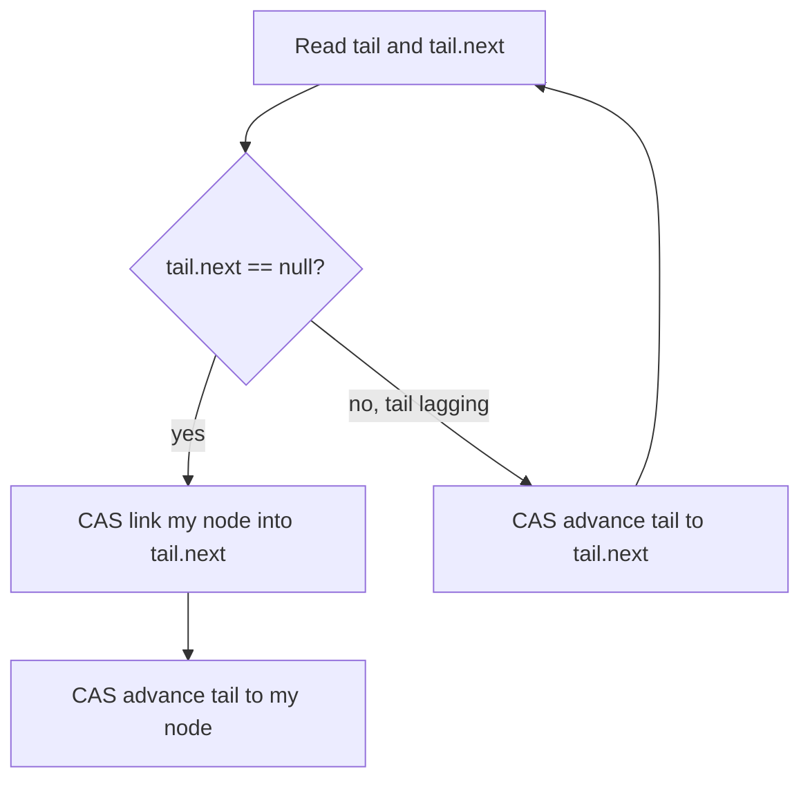

# Michael-Scott Lock-Free Queue — Junior Level

> Focus: **"What is it?"** and **"How does it work?"** — a FIFO queue that many threads can use at the same time, without locks, using a linked list and atomic compare-and-swap (CAS).

The Michael-Scott queue (often "MS-queue") is the most famous **lock-free** queue. It was published by Maged Michael and Michael Scott in 1996, and it is the algorithm behind Java's `ConcurrentLinkedQueue`. At the junior level you should walk away knowing four things: what a lock-free queue *is*, how a singly linked list with a **head** and **tail** pointer models a queue, how **CAS** lets two threads cooperate without a lock, and why there is a **dummy (sentinel) node** at the front.

---

## Table of Contents

1. [Introduction](#introduction)
2. [Prerequisites](#prerequisites)
3. [Glossary](#glossary)
4. [Core Concepts](#core-concepts)
5. [Big-O Summary](#big-o-summary)
6. [Real-World Analogies](#real-world-analogies)
7. [Pros & Cons](#pros--cons)
8. [A Small Worked Example](#a-small-worked-example)
9. [Code Examples](#code-examples)
10. [Coding Patterns](#coding-patterns)
11. [Error Handling](#error-handling)
12. [Performance Tips](#performance-tips)
13. [Best Practices](#best-practices)
14. [Edge Cases & Pitfalls](#edge-cases--pitfalls)
15. [Common Mistakes](#common-mistakes)
16. [Cheat Sheet](#cheat-sheet)
17. [Visual Animation](#visual-animation)
18. [Summary](#summary)
19. [Further Reading](#further-reading)

---

## Introduction

A **queue** is a first-in-first-out (FIFO) container: the first item you put in is the first item you take out, like a line at a coffee shop. You **enqueue** (add) at the back and **dequeue** (remove) from the front.

A normal queue assumes only **one thread** touches it at a time. The moment two threads `enqueue` simultaneously, the data structure can be corrupted — two appends can overwrite each other, and one item is silently lost.

The usual fix is a **lock** (mutex). A thread grabs the lock, does its operation, releases the lock. Only one thread is inside at a time. This works, but it has costs: threads waiting for the lock are blocked (they sleep), a thread that is paused by the OS while holding the lock blocks *everyone*, and under heavy contention the lock becomes a bottleneck.

The **Michael-Scott lock-free queue** removes the lock. Instead of "stop everyone else, then edit," each thread reads the queue's current state, builds the change it wants, and **atomically swaps it in** using a hardware instruction called **compare-and-swap (CAS)**. If another thread changed the state first, the CAS fails, and the thread simply **retries**. No thread ever sleeps holding a resource that others need.

> Key promise of "lock-free": even if some threads are paused arbitrarily, **at least one thread always makes progress**. The whole system never freezes because one thread stalled.

---

## Prerequisites

- **Required:** Basic linked lists — nodes with a `value` and a `next` pointer.
- **Required:** Queues — the FIFO idea, `enqueue` and `dequeue`.
- **Required:** Pointers / references (Go pointers, Java references, Python object identity).
- **Helpful:** A first idea of "threads run at the same time and can interfere."
- **Helpful:** [`15-cas-atomic-primitives`](../15-cas-atomic-primitives/) — what CAS is at the hardware level.

---

## Glossary

| Term | Definition |
|------|-----------|
| **FIFO** | First-In-First-Out ordering: items leave in the order they arrived. |
| **Enqueue** | Add an item to the **back** (tail) of the queue. |
| **Dequeue** | Remove and return the item at the **front** (head) of the queue. |
| **Node** | A linked-list cell holding a `value` and a `next` pointer. |
| **head** | Atomic pointer to the front of the list (points at the dummy node). |
| **tail** | Atomic pointer to the last node (sometimes lagging by one — see middle.md). |
| **Sentinel / dummy node** | A valueless node always present at the front so head and tail are never `null`. |
| **CAS** | Compare-And-Swap: atomically set a memory cell to a new value *only if* it still holds an expected old value. |
| **Lock-free** | A progress guarantee: the system as a whole always advances; some thread always finishes in a bounded number of steps. |
| **Atomic** | An operation that happens all-at-once; other threads never see it half-done. |
| **Contention** | Multiple threads trying to modify the same cell at the same time. |

---

## Core Concepts

### Concept 1: A queue is a linked list with head and tail pointers

Picture a singly linked list. `head` points at the front, `tail` points at the back. To **enqueue**, you attach a new node after the last node and move `tail` forward. To **dequeue**, you read the value just after `head` and move `head` forward. Each operation touches only one end, so we never walk the whole list — both are O(1).

### Concept 2: The dummy (sentinel) node

The MS-queue always keeps **one extra node** at the very front that holds no real value. `head` always points at this dummy. The first *real* item is the dummy's `next`. Why bother? Because it removes a nasty special case: an empty queue still has a node (the dummy), so `head` and `tail` are **never null**, and enqueue/dequeue code does not need a separate "is this the first element?" branch. Empty means `head == tail` (both at the dummy).

### Concept 3: CAS — change something only if nobody beat you to it

`CAS(address, expected, new)` reads the memory at `address`. If it equals `expected`, it writes `new` and returns `true`. Otherwise it writes nothing and returns `false`. It does all of this **as one atomic step**, so no other thread can sneak in between the read and the write. This is the single tool that lets the MS-queue replace locks: "I think the tail's `next` is still `null`; if so, link my node in."

### Concept 4: Retry loops

Because a CAS can fail (someone else moved first), every MS-queue operation lives inside a `for { ... }` loop: read the current pointers, try a CAS, and if it fails, loop back and read fresh values. Failure is normal and cheap; it just means "try again with up-to-date information."

### Concept 5: The two-step tail (a quick preview)

Enqueue does **two** CASes: first link the new node after the last one, then move `tail` to point at it. These are separate steps, so for a brief moment `tail` can lag one node behind the real end. The MS-queue handles this by letting any thread **help** push a lagging tail forward. The deep mechanics are in [`middle.md`](./middle.md); for now, just remember: enqueue = link, then advance tail.

---

## Big-O Summary

| Operation | Complexity | Notes |
|-----------|-----------|-------|
| Enqueue (uncontended) | O(1) | A couple of reads + 1–2 CAS. |
| Dequeue (uncontended) | O(1) | A couple of reads + 1 CAS. |
| Enqueue / Dequeue (contended) | O(1) *expected*, amortized | Retries add a constant factor; lock-free guarantees *some* thread finishes each round. |
| Peek front | O(1) | Read `head.next.value`. |
| Search / index access | O(n) | Not supported as a fast op — a queue is end-only. |
| Space | O(n) | One node per element, plus the dummy. |

> "O(1)" here means a bounded number of steps **per successful operation**. A thread might retry under contention, but each retry is constant work, and the lock-free guarantee bounds how long the whole system can go without progress.

---

## Real-World Analogies

| Concept | Analogy |
|---------|--------|
| **FIFO queue** | A line at a ticket counter — first to arrive is first served. |
| **Lock vs lock-free** | Lock = one shared pen everyone must grab to sign a guest book (others wait). Lock-free = everyone writes their entry on a sticky note and races to slap it on the board; if two slap the same spot, one wins and the other re-aims. |
| **CAS** | A vending slot that only accepts your coin "if the slot is still empty"; if someone filled it first, your coin bounces back and you try the next slot. |
| **Dummy node** | A permanent "RESERVED — staff" card at the head of every line so the line is never literally empty; the first customer stands *behind* it. |
| **Helping the tail** | You walk up to a half-pushed shopping cart someone abandoned and give it the final shove yourself instead of waiting. |

> Where analogies break: real CAS is a single hardware instruction with no "trying" delay, and "helping" is not politeness — it is a *correctness requirement* so a stalled enqueuer never blocks everyone.

---

## Pros & Cons

| Pros | Cons |
|------|------|
| No locks — a stalled/descheduled thread cannot freeze the queue. | Much harder to implement correctly than a locked queue. |
| Strong progress guarantee (lock-free): the system always advances. | The **ABA problem** and **memory reclamation** are genuinely hard (see middle/senior). |
| Great under high contention for producer-consumer workloads. | Per-op constant factor higher than a single-threaded queue. |
| O(1) enqueue and dequeue, only the ends are touched. | Unbounded by default — needs care to avoid memory blowup. |
| Battle-tested: it *is* Java's `ConcurrentLinkedQueue`. | No O(1) `size()`; counting is approximate or costly. |

**When to use:** many threads producing and consuming work items (thread pools, message passing, task queues) where you cannot afford a lock bottleneck.

**When NOT to use:** single-threaded code (a plain slice/`ArrayDeque` is far simpler and faster), or when a fixed-capacity ring buffer (LMAX Disruptor) fits better — see senior.md.

---

## A Small Worked Example

Let us enqueue `A`, then `B`, then dequeue once. We draw `head` (H) and `tail` (T). `D` is the dummy node.

**Start (empty):** head and tail both at the dummy.

```
H,T
[D]->null
```

**Enqueue A.** Make node A. Step 1: CAS the dummy's `next` from `null` to `A`. Step 2: CAS `tail` from `D` to `A`.

```
 H        T
[D]----->[A]->null
```

**Enqueue B.** Make node B. Step 1: CAS A's `next` from `null` to `B`. Step 2: CAS `tail` from `A` to `B`.

```
 H               T
[D]----->[A]--->[B]->null
```

**Dequeue.** The value to return is `head.next.value` = `A`'s value. CAS `head` from `D` to `A`. Node `A` becomes the **new dummy** (its old value is no longer used). We return `A`'s value.

```
         H       T
        [A]--->[B]->null      (returned: value of A)
```

Notice: dequeue does not free the old dummy `D` immediately in a real implementation — *when* it is safe to free a removed node is the hard part (memory reclamation), covered in middle/senior.

---

## Code Examples

We show a **simplified** MS-queue. The structure and CAS retry loops are real; the hard reclamation problem (when to free nodes) is deferred to later levels — here we never free, which leaks but is correct and easy to read.

### Example 1: Minimal MS-queue (enqueue + dequeue)

#### Go

```go
package main

import (
	"fmt"
	"sync/atomic"
)

type node struct {
	value int
	next  atomic.Pointer[node] // atomic *node
}

type MSQueue struct {
	head atomic.Pointer[node]
	tail atomic.Pointer[node]
}

func NewMSQueue() *MSQueue {
	dummy := &node{}            // sentinel: no value
	q := &MSQueue{}
	q.head.Store(dummy)
	q.tail.Store(dummy)
	return q
}

func (q *MSQueue) Enqueue(v int) {
	n := &node{value: v}
	for { // retry loop
		tail := q.tail.Load()
		next := tail.next.Load()
		if tail == q.tail.Load() { // tail still consistent?
			if next == nil {
				// Step 1: link new node after the last node.
				if tail.next.CompareAndSwap(nil, n) {
					// Step 2: advance tail (may fail; that's fine).
					q.tail.CompareAndSwap(tail, n)
					return
				}
			} else {
				// tail was lagging — help advance it, then retry.
				q.tail.CompareAndSwap(tail, next)
			}
		}
	}
}

func (q *MSQueue) Dequeue() (int, bool) {
	for {
		head := q.head.Load()
		tail := q.tail.Load()
		next := head.next.Load()
		if head == q.head.Load() {
			if head == tail { // empty, or tail lagging
				if next == nil {
					return 0, false // truly empty
				}
				q.tail.CompareAndSwap(tail, next) // help lagging tail
			} else {
				v := next.value           // read value BEFORE moving head
				if q.head.CompareAndSwap(head, next) {
					return v, true
				}
			}
		}
	}
}

func main() {
	q := NewMSQueue()
	q.Enqueue(10)
	q.Enqueue(20)
	v, ok := q.Dequeue()
	fmt.Println(v, ok) // 10 true
	v, ok = q.Dequeue()
	fmt.Println(v, ok) // 20 true
	v, ok = q.Dequeue()
	fmt.Println(v, ok) // 0 false
}
```

#### Java

```java
import java.util.concurrent.atomic.AtomicReference;

public class MSQueue<T> {
    static final class Node<T> {
        final T value;
        final AtomicReference<Node<T>> next = new AtomicReference<>(null);
        Node(T value) { this.value = value; }
    }

    private final AtomicReference<Node<T>> head;
    private final AtomicReference<Node<T>> tail;

    public MSQueue() {
        Node<T> dummy = new Node<>(null); // sentinel
        head = new AtomicReference<>(dummy);
        tail = new AtomicReference<>(dummy);
    }

    public void enqueue(T v) {
        Node<T> n = new Node<>(v);
        while (true) {
            Node<T> t = tail.get();
            Node<T> next = t.next.get();
            if (t == tail.get()) {
                if (next == null) {
                    if (t.next.compareAndSet(null, n)) { // step 1: link
                        tail.compareAndSet(t, n);        // step 2: advance
                        return;
                    }
                } else {
                    tail.compareAndSet(t, next);         // help lagging tail
                }
            }
        }
    }

    public T dequeue() {
        while (true) {
            Node<T> h = head.get();
            Node<T> t = tail.get();
            Node<T> next = h.next.get();
            if (h == head.get()) {
                if (h == t) {
                    if (next == null) return null; // empty
                    tail.compareAndSet(t, next);   // help lagging tail
                } else {
                    T v = next.value;              // read before CAS
                    if (head.compareAndSet(h, next)) return v;
                }
            }
        }
    }

    public static void main(String[] args) {
        MSQueue<Integer> q = new MSQueue<>();
        q.enqueue(10);
        q.enqueue(20);
        System.out.println(q.dequeue()); // 10
        System.out.println(q.dequeue()); // 20
        System.out.println(q.dequeue()); // null
    }
}
```

#### Python

```python
# NOTE: CPython has a Global Interpreter Lock (GIL): only one bytecode
# runs at a time, so true parallel CAS contention does not happen the
# way it does in Go/Java. This code is CONCEPTUAL — it shows the SHAPE of
# the MS-queue (sentinel, head/tail, CAS retry loops) using a lock to
# emulate atomic CAS. For real multithreaded FIFO work, use queue.Queue.
import threading


class _Node:
    __slots__ = ("value", "next")

    def __init__(self, value=None):
        self.value = value
        self.next = None


class MSQueue:
    def __init__(self):
        dummy = _Node()          # sentinel
        self._head = dummy
        self._tail = dummy
        self._cas_lock = threading.Lock()  # emulates hardware CAS atomicity

    def _cas(self, holder, attr, expected, new):
        # Atomic compare-and-swap on getattr(holder, attr).
        with self._cas_lock:
            if getattr(holder, attr) is expected:
                setattr(holder, attr, new)
                return True
            return False

    def enqueue(self, v):
        n = _Node(v)
        while True:
            tail = self._tail
            nxt = tail.next
            if tail is self._tail:
                if nxt is None:
                    if self._cas(tail, "next", None, n):       # step 1
                        self._cas(self, "_tail", tail, n)      # step 2
                        return
                else:
                    self._cas(self, "_tail", tail, nxt)        # help

    def dequeue(self):
        while True:
            head = self._head
            tail = self._tail
            nxt = head.next
            if head is self._head:
                if head is tail:
                    if nxt is None:
                        return None  # empty
                    self._cas(self, "_tail", tail, nxt)        # help
                else:
                    v = nxt.value
                    if self._cas(self, "_head", head, nxt):
                        return v


if __name__ == "__main__":
    q = MSQueue()
    q.enqueue(10)
    q.enqueue(20)
    print(q.dequeue())  # 10
    print(q.dequeue())  # 20
    print(q.dequeue())  # None
```

**What it does:** Implements a concurrent FIFO with a sentinel node, head/tail atomic pointers, the two-step tail update, the "help advance tail" rule, and retry loops.
**Run:** `go run main.go` | `javac MSQueue.java && java MSQueue` | `python msqueue.py`

---

## Coding Patterns

### Pattern 1: The read-check-CAS-retry loop

**Intent:** Every lock-free operation snapshots the pointers, validates them, attempts a CAS, and loops on failure.

#### Go

```go
for {
	t := q.tail.Load()           // snapshot
	next := t.next.Load()
	if t == q.tail.Load() {      // re-validate snapshot
		// ... try CAS; return on success ...
	}
	// fall through -> loop and re-snapshot
}
```

#### Java

```java
while (true) {
    Node<T> t = tail.get();
    Node<T> next = t.next.get();
    if (t == tail.get()) {       // re-validate
        // ... try CAS; return on success ...
    }
}
```

#### Python

```python
while True:
    t = self._tail               # snapshot
    nxt = t.next
    if t is self._tail:          # re-validate
        ...                      # try cas; return on success
```

### Pattern 2: Help-the-other-thread

**Intent:** If you notice `tail` is lagging (its `next` is not null), you push `tail` forward yourself before doing your own work. This keeps a stalled enqueuer from blocking the world.



---

## Error Handling

| Error | Cause | Fix |
|-------|-------|-----|
| Lost item on enqueue | Forgot the dummy node / null head | Always start with one sentinel; `head`/`tail` never null. |
| Dequeue returns garbage | Read `head.value` instead of `head.next.value` | The front *value* lives in the node **after** head. |
| Reads value after moving head | Value read post-CAS — node may be recycled | Read `next.value` **before** the `head` CAS. |
| Infinite loop, never returns empty | Missing the `next == nil` empty check | When `head == tail` and `next == nil`, return "empty". |
| Tail stuck forever | Forgot the second CAS / helping rule | Advance tail after linking; help a lagging tail. |

---

## Performance Tips

- Under low contention, an MS-queue is nearly as fast as a locked queue and far better when threads would otherwise block.
- Reuse the same queue object; do not recreate it per operation.
- Prefer the language's built-in: Java `ConcurrentLinkedQueue` *is* an MS-queue; Go's channels cover most needs; Python should use `queue.Queue` (the GIL makes a hand-rolled lock-free queue pointless).
- Keep node payloads small; large values copied around hurt cache behavior (see senior.md on false sharing).

---

## Best Practices

- Implement it once from scratch to truly understand head/tail and the two CASes, then **use the standard library** in production.
- Always read the dequeued value **before** the CAS that moves `head`.
- Test with empty, single-element, and many-producer/many-consumer cases.
- Do not try to add an O(1) `size()` — it fights the lock-free design.
- Leave real memory reclamation (hazard pointers / epochs) for when you understand the ABA problem (middle.md).

---

## Edge Cases & Pitfalls

- **Empty queue:** `head == tail` and `head.next == null`. Dequeue must return "empty," not crash.
- **One element:** after dequeue it becomes empty again; tail must still be valid.
- **Tail lagging:** between the two enqueue CASes, `tail` points one node behind. Other threads must tolerate and help.
- **Spurious CAS failures under contention:** normal; just retry.
- **Memory growth:** never-freed nodes leak; production code needs reclamation.

---

## Common Mistakes

- Forgetting the **sentinel** node and then crashing on the empty queue.
- Doing only the **first** CAS (link) and forgetting to advance `tail`.
- Not handling the **lagging tail** in dequeue (causes wrong "empty" results).
- Reading `next.value` **after** moving `head` (the node may already be reused).
- Assuming O(1) means "one CAS" — under contention there can be retries.
- Trying to write this in Python for real parallelism — the GIL defeats the point.

---

## Cheat Sheet

| Operation | Time | Space | Notes |
|-----------|------|-------|-------|
| Enqueue | O(1) | O(1) extra | link CAS + tail-advance CAS |
| Dequeue | O(1) | O(1) | read `next.value`, then head CAS |
| Peek | O(1) | O(1) | `head.next.value` |
| Empty? | O(1) | O(1) | `head == tail && head.next == null` |
| Size | O(n) | O(1) | avoid; not a natural op |

**Mental model:** `[dummy] -> [a] -> [b] -> null`, `head` at dummy, `tail` at last. Enqueue: link then advance. Dequeue: read `head.next.value`, move head.

---

## Visual Animation

> See [`animation.html`](./animation.html) for an interactive visual of the MS-queue.
>
> The animation demonstrates:
> - The linked list with the dummy node, `head` (blue), and `tail` (orange) pointers
> - Two threads enqueuing/dequeuing via CAS
> - The two-step tail update and a thread **helping** advance a lagging tail
> - A **contention retry** when a CAS fails
> - An operation log, a Big-O table, and an info panel

---

## Summary

The Michael-Scott queue is a FIFO queue built from a singly linked list with atomic `head` and `tail` pointers and a permanent **dummy node**. Enqueue links a new node with a CAS, then advances `tail` with a second CAS; dequeue reads `head.next.value` and advances `head` with a CAS. Failed CASes mean another thread moved first, so you **retry**. No locks are used, so a stalled thread never freezes the queue. The catch — when it is safe to *free* removed nodes — is the hard part you will study next.

---

## Further Reading

- M. Michael & M. Scott, *"Simple, Fast, and Practical Non-Blocking and Blocking Concurrent Queue Algorithms"* (PODC 1996) — the original paper.
- Java: `java.util.concurrent.ConcurrentLinkedQueue` (it is an MS-queue) — JDK docs.
- Go: `sync/atomic` package docs (`atomic.Pointer[T]`, `CompareAndSwap`).
- Maurice Herlihy & Nir Shavit, *The Art of Multiprocessor Programming*, ch. 10 (concurrent queues).
- Cross-link: [`15-cas-atomic-primitives`](../15-cas-atomic-primitives/), [`17-lock-free-stack`](../17-lock-free-stack/).

---

**Next step:** [middle.md](./middle.md) — why the two-step tail needs *helping*, the **ABA problem**, why memory reclamation is hard, and MS-queue vs the two-lock queue.
