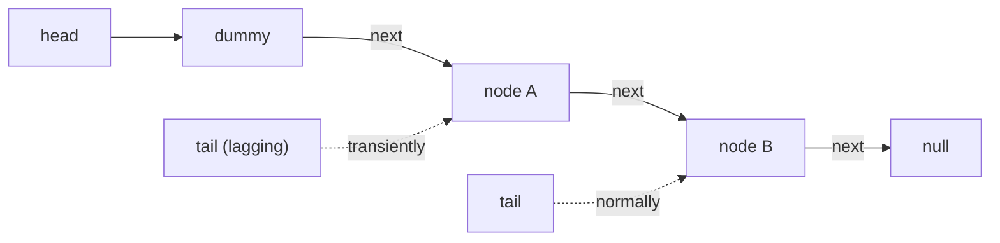

# Michael-Scott Lock-Free Queue — Middle Level

> Focus: **"Why does it work?"** and **"When should I choose it?"** — the helping mechanism behind the lagging tail, the **ABA problem**, why **memory reclamation** is the real difficulty, and how the MS-queue compares to a two-lock queue and a blocking queue.

At the junior level you saw the *shape* of the algorithm: a sentinel node, head/tail atomic pointers, two CASes for enqueue, one for dequeue, all inside retry loops. Now we explain *why* each piece is there and *what would break* if it were missing. The two themes are **progress** (the helping mechanism makes the algorithm lock-free instead of merely "mostly works") and **safety under reuse** (ABA and reclamation, which is where almost every hand-rolled lock-free queue goes wrong).

---

## Table of Contents

1. [Introduction](#introduction)
2. [The Invariants That Make It Correct](#the-invariants-that-make-it-correct)
3. [The Two-Step Tail and Why Helping Is Required](#the-two-step-tail-and-why-helping-is-required)
4. [The ABA Problem](#the-aba-problem)
5. [Why Memory Reclamation Is Hard](#why-memory-reclamation-is-hard)
6. [Comparison with Alternatives](#comparison-with-alternatives)
7. [Advanced Patterns](#advanced-patterns)
8. [Code Examples](#code-examples)
9. [Error Handling](#error-handling)
10. [Performance Analysis](#performance-analysis)
11. [Best Practices](#best-practices)
12. [Visual Animation](#visual-animation)
13. [Summary](#summary)

---

## Introduction

The MS-queue is "simple, fast, and practical" — that is literally the title of the 1996 paper — *relative to other non-blocking queues*. It is still subtle. Two questions separate someone who copied the code from someone who understands it:

1. **Why does enqueue need two CASes instead of one, and why must other threads "help"?**
2. **Why can't I just `free(node)` after I dequeue it?**

The answers are the heart of this level. The first is about the **lock-freedom progress guarantee**; the second is about the **ABA problem** and **safe memory reclamation**, which is the single hardest part of writing real lock-free data structures.

---

## The Invariants That Make It Correct

The MS-queue maintains a handful of invariants. If you can state them, you can reason about the code.

| Invariant | Statement | Why it matters |
|-----------|-----------|----------------|
| **I1 — Sentinel always present** | `head` always points to a node; that node is the current dummy. | `head`/`tail` are never null; no empty special case. |
| **I2 — Reachability** | All enqueued nodes are reachable from `head` via `next` links. | Nothing is "lost"; the list is a single chain. |
| **I3 — Tail lags by at most one** | `tail` points either to the last node or to its immediate predecessor. | Bounds the inconsistency; one help step fixes it. |
| **I4 — Links are append-only-then-frozen** | A node's `next` goes from `null` to a real node exactly once and never changes back. | The link CAS (`null -> n`) can succeed at most once per node. |
| **I5 — head only moves forward** | `head` advances along `next` links, never backward. | FIFO order; dequeues never re-read an item. |

The link CAS in enqueue, `tail.next.CompareAndSwap(nil, n)`, relies on **I4**: a node's `next` is `null` until exactly one thread wins the link. The "help" step relies on **I3**: tail is never more than one behind, so `CompareAndSwap(tail, next)` is always a valid single-step fix.



---

## The Two-Step Tail and Why Helping Is Required

Enqueue does two things that *cannot* be merged into one atomic step on normal hardware:

1. **Link:** make the last node's `next` point at the new node — `CAS(last.next, null, n)`.
2. **Advance:** make `tail` point at the new node — `CAS(tail, last, n)`.

Hardware CAS touches **one word**. We must change two words (`last.next` and `tail`), so two CASes. Between them there is a window where the node is **linked but tail still points at the old last node**. That is the "lagging tail."

### Why not just retry until both succeed?

Imagine thread P does step 1 (links its node) and is then **descheduled by the OS** — paused for milliseconds — right before step 2. If the rule were "only the enqueuer may advance tail," then `tail` stays stale until P wakes up. Every other thread that wants to enqueue would have to **wait** for P. That is exactly the blocking behavior a lock would give us, defeating the entire purpose.

### The helping rule

The MS-queue's fix: **any thread that observes a lagging tail must try to advance it.** Concretely, when a thread reads `tail` and finds `tail.next != null`, it performs `CAS(tail, tail, tail.next)` to push it forward, *then* retries its own operation.

```mermaid
sequenceDiagram
    participant P as Thread P (enqueuer)
    participant Q as Thread Q (helper)
    P->>P: CAS(last.next, null, X)  [step 1 OK]
    Note over P: OS pauses P (tail now lags)
    Q->>Q: read tail, see tail.next = X (lagging!)
    Q->>Q: CAS(tail, last, X)  [Q helps advance]
    Note over Q: tail fixed; Q proceeds with its own op
    P->>P: wakes up, CAS(tail, last, X) fails (already done) — harmless
```

This is what upgrades the algorithm from "works when threads are cooperative" to **lock-free**: even if P sleeps forever after step 1, the queue keeps making progress because anyone can finish P's tail-advance. The dequeue path includes the *same* helping step (when `head == tail` but `next != null`, it means tail is lagging — help it before deciding the queue is empty).

> Takeaway: the second CAS is opportunistic — it may fail, and that is fine, because it only fails when *someone already did it*. Helping turns a 2-word update into a recoverable, wait-tolerant sequence.

---

## The ABA Problem

CAS checks "is this word still `expected`?" by **value**. It cannot tell the difference between "unchanged" and "changed to something else and then changed back." This is the **ABA problem**, and lock-free queues are a textbook victim.

### A concrete ABA scenario

1. Thread T1 in dequeue reads `head = A`, `head.next = B`. It is about to do `CAS(head, A, B)`. **T1 is paused here.**
2. Other threads dequeue A (head moves to B), dequeue B (head moves to C). Node A's memory is **freed**.
3. The allocator **reuses A's memory** for a brand-new node — and, by bad luck, the new node is enqueued and ends up at `head` again. Call it `A'`, but it lives at the *same address* `A`.
4. T1 resumes. Its `CAS(head, A, B)` compares the current head (address `A'` == `A`) to its expected `A` — **they match by value!** The CAS *succeeds*, setting `head` to `B`. But `B` was freed long ago. The queue is now corrupted: head points into reclaimed memory.

The value went A → B → C → ... → A (same address reused). CAS saw "A then A" and assumed nothing happened. It did.

### Classic mitigations

| Technique | Idea | Cost / limitation |
|-----------|------|-------------------|
| **Tagged / versioned pointer** | Pack a counter into the pointer word: `CAS((ptr, tag), (A, 7), (B, 8))`. Reuse bumps the tag so ABA is detected. | Needs double-width CAS (DCAS / 128-bit) or pointer-tag bits; the tag can still wrap. |
| **Hazard pointers** | Threads publish pointers they are about to dereference; memory is not freed while hazarded. | Per-access bookkeeping; see [`20-hazard-pointers`](../20-hazard-pointers/). |
| **Epoch / RCU reclamation** | Defer freeing until all threads have passed a "grace period." | Memory held longer; see [`19-rcu`](../19-rcu/). |
| **Never free (leak / pool)** | Recycle nodes from a free-list owned per-thread, or just don't free. | Unbounded memory or complex pooling. |

The original 1996 paper uses **tagged pointers** (a modification counter beside each pointer) precisely to defeat ABA. Java sidesteps the whole thing because the **garbage collector** never reuses an address while any reference (including a stale local in a paused thread) still points to it — so ABA-by-address-reuse cannot happen in managed languages.

---

## Why Memory Reclamation Is Hard

ABA is a symptom of the deeper disease: **you don't know when it's safe to free a removed node.**

In a single-threaded queue, dequeue can `free(oldDummy)` immediately. In the MS-queue, after you CAS `head` forward, **another thread may still be holding a pointer into the node you just removed** — for example, a thread that read `head = A` and `head.next = B` a microsecond ago and is about to dereference `B`. If you free `B` now, that thread reads freed memory (use-after-free). 

So the question "when can I free node X?" becomes "when can I prove **no other thread** holds or will dereference a pointer to X?" That is a **distributed, lock-free agreement problem**, and it is genuinely hard:

- You cannot take a lock to answer it (that would reintroduce blocking).
- You cannot ask every thread "are you using X?" atomically.
- The answer changes constantly as threads load and discard pointers.

The three real answers all live in sibling topics:

- **[`20-hazard-pointers`](../20-hazard-pointers/):** each thread publishes the pointer it is about to use. A reclaimer scans all published hazards; if X is not among them, X is safe to free. Bounded memory, O(1)-ish per op, but per-access stores.
- **[`19-rcu`](../19-rcu/) / epoch-based reclamation:** threads enter/exit "read sections." A removed node is freed only after a **grace period** in which every thread has exited and re-entered (so no one can still hold the old pointer). Very cheap reads, but memory is held longer and a stalled reader delays reclamation.
- **[`15-cas-atomic-primitives`](../15-cas-atomic-primitives/):** the tagged-pointer trick prevents the *ABA* corruption but does **not** by itself solve use-after-free; you still need one of the above to know when to release memory.

> The honest summary: writing the MS-queue logic is a weekend project. Writing a *correct, leak-free, ABA-safe* MS-queue in an unmanaged language is a research-grade task — which is why production unmanaged systems lean on hazard pointers or epochs, and why managed languages (Java/Go with GC) get the easy version for free.

### The dangling-pointer window, drawn

The window of danger is precise: it opens when a thread reads a pointer into a node and closes when that thread stops using it. Any free of the node during that window is a bug.

```mermaid
sequenceDiagram
    participant T1 as Thread T1 (dequeuing)
    participant T2 as Thread T2 (also dequeuing)
    T1->>T1: read h = Head = A
    T1->>T1: read next = A.next = B, v = B.value
    Note over T1: ↑ window OPENS — T1 holds A and B
    T2->>T2: dequeue: Head A→B
    T2->>T2: dequeue: Head B→C
    T2->>T2: free(A); free(B)   ← UNSAFE: T1 still holds B
    T1->>T1: CAS(Head, A, B)  reads freed B → use-after-free / ABA
    Note over T1: ↑ window should not close until here
```

The fix every scheme implements is the same idea: **do not free a node while any thread is inside its window for that node.** Hazard pointers make the window explicit (publish on open, clear on close); epochs over-approximate the window with a grace period; a GC tracks it precisely via reachability.

### Why a `size()` is fundamentally racy

A natural request is an O(1) `size()`. The MS-queue cannot give an accurate one without defeating its own design. Any count you compute (walking the list, or reading a separate counter) reflects a moment that is already stale by the time you return — other threads enqueue and dequeue concurrently. Worse, a counter updated alongside the pointer CASes would need to be updated *atomically with* the structural change, which would require a multi-word atomic (or a lock) the algorithm specifically avoids. The pragmatic answer is an **approximate** size: a separate atomic counter, incremented on enqueue and decremented on successful dequeue, understood to be momentarily wrong. This is fine for back-pressure heuristics ("roughly how full are we?") but never for correctness decisions.

---

## Comparison with Alternatives

| Attribute | MS-queue (lock-free) | Two-lock queue | Single-lock blocking queue | LMAX Disruptor (ring buffer) |
|-----------|----------------------|----------------|----------------------------|------------------------------|
| Synchronization | CAS, no locks | 2 mutexes (head lock + tail lock) | 1 mutex | CAS on sequence counters |
| Enqueue/dequeue parallelism | Full (different threads, different ends) | Enqueuers and dequeuers don't contend | None — serialized | Producers/consumers via claimed slots |
| Progress guarantee | **Lock-free** | Blocking | Blocking | Lock-free-ish (bounded) |
| Stalled-thread effect | None (helping) | A stalled holder blocks its end | Blocks everyone | Bounded by ring size |
| Capacity | Unbounded | Unbounded | Unbounded | **Bounded** (fixed ring) |
| Memory reclamation | **Hard** (ABA/HP/epoch) | Trivial (free under lock) | Trivial | None — slots reused |
| Throughput under contention | High | Medium-high | Low | **Very high** (cache-friendly) |
| Implementation difficulty | High | Medium | Low | High (but library exists) |
| Real-world example | Java `ConcurrentLinkedQueue` | Michael-Scott "two-lock" variant | `java.util.concurrent` `LinkedBlockingQueue` (loosely) | LMAX trading engine |

**Choose the MS-queue when:** you need an **unbounded**, lock-free FIFO with independent producers and consumers, and you have a reclamation story (GC, hazard pointers, or epochs).

**Choose the two-lock queue when:** lock-free is overkill but you still want enqueuers and dequeuers not to contend — it is far simpler and reclamation is trivial. The same 1996 paper presents it as the "blocking" companion.

**Choose a blocking queue when:** simplicity matters most, contention is low, and you want built-in back-pressure (`put`/`take` that block when full/empty).

**Choose the Disruptor / ring buffer when:** you can fix the capacity, want the lowest latency and best cache behavior, and can tolerate back-pressure when full. It avoids node allocation and reclamation entirely.

---

## Advanced Patterns

### Pattern: Backoff on repeated CAS failure

Under heavy contention, spinning a tight retry loop wastes cycles and worsens cache-line ping-pong. Add **exponential backoff** between failed attempts.

#### Go

```go
import (
	"math/rand"
	"runtime"
	"time"
)

func backoff(attempt *int) {
	*attempt++
	spins := 1 << min(*attempt, 10) // cap the exponent
	for i := 0; i < spins; i++ {
		runtime.Gosched() // yield; real code may busy-spin a bit first
	}
	_ = rand.Int
	_ = time.Now
}
func min(a, b int) int { if a < b { return a }; return b }
```

#### Java

```java
final class Backoff {
    private int limit = 1, max = 1 << 16;
    private final java.util.Random rnd = new java.util.Random();
    void backoff() {
        int delay = rnd.nextInt(limit);
        if (limit < max) limit <<= 1;
        for (int i = 0; i < delay; i++) Thread.onSpinWait();
    }
}
```

#### Python

```python
# Conceptual: under the GIL there is no true CAS contention, but the
# pattern is: grow the spin/sleep window after each failed attempt.
import time

def backoff(attempt, base=1e-6, cap=1e-3):
    time.sleep(min(base * (2 ** attempt), cap))
```

### Pattern: Help-then-act

Every operation begins by checking for and fixing a lagging tail (helping) before attempting its own CAS. Dequeue and enqueue share this prologue. This is the structural reason the algorithm is lock-free, not just "usually fast."

### Pattern: Snapshot-and-revalidate

Because several pointers (`head`, `tail`, `head.next`) must be read together but can change between reads, the MS-queue takes a snapshot then **re-validates** the anchor pointer hasn't moved (`if head == headSnapshot`). If it moved, the snapshot is inconsistent and the loop restarts. This guards against torn reads of the trio. It is cheap — one extra load — and it is the reason dequeue checks `head == q.head.Load()` after reading `tail` and `next`. Skipping this revalidation is a subtle, hard-to-reproduce bug: most of the time the trio is consistent, but under contention you can read a `next` that belongs to an already-advanced `head`, leading to a wrong "empty" result or a value from the wrong node.

---

## Code Examples

### MS-queue with a tag counter to mitigate ABA (concept)

Below, dequeue uses a **(pointer, tag)** pair so reuse of an address is detected. Real hardware needs a 128-bit CAS (`CMPXCHG16B`); here we model it.

#### Go

```go
package main

import "sync/atomic"

type node struct {
	value int
	next  atomic.Pointer[node]
}

// taggedHead bundles a generation counter with the head pointer.
// On 64-bit hardware you'd use a 128-bit CAS; we model with a struct
// behind a mutex-free atomic.Pointer to an immutable snapshot.
type tagged struct {
	ptr *node
	tag uint64
}

type MSQueue struct {
	head atomic.Pointer[tagged]
	tail atomic.Pointer[node]
}

func New() *MSQueue {
	d := &node{}
	q := &MSQueue{}
	q.head.Store(&tagged{ptr: d, tag: 0})
	q.tail.Store(d)
	return q
}

func (q *MSQueue) Dequeue() (int, bool) {
	for {
		h := q.head.Load()        // snapshot {ptr, tag}
		next := h.ptr.next.Load()
		if next == nil {
			return 0, false       // empty
		}
		v := next.value
		// CAS replaces the whole {ptr,tag}; a reused address gets a new tag,
		// so a stale snapshot's tag won't match -> ABA defeated.
		if q.head.CompareAndSwap(h, &tagged{ptr: next, tag: h.tag + 1}) {
			return v, true
		}
	}
}
```

#### Java

```java
import java.util.concurrent.atomic.AtomicStampedReference;

// AtomicStampedReference packs an int "stamp" (the tag) with the reference,
// directly giving us ABA detection without a 128-bit CAS.
class TaggedDequeue<T> {
    static final class Node<T> {
        final T value;
        final java.util.concurrent.atomic.AtomicReference<Node<T>> next =
            new java.util.concurrent.atomic.AtomicReference<>(null);
        Node(T v) { value = v; }
    }

    private final AtomicStampedReference<Node<T>> head;

    TaggedDequeue(Node<T> dummy) {
        head = new AtomicStampedReference<>(dummy, 0);
    }

    T dequeue() {
        int[] stamp = new int[1];
        while (true) {
            Node<T> h = head.get(stamp);
            Node<T> next = h.next.get();
            if (next == null) return null;       // empty
            T v = next.value;
            if (head.compareAndSet(h, next, stamp[0], stamp[0] + 1)) {
                return v;                         // tag bump defeats ABA
            }
        }
    }
}
```

#### Python

```python
# Conceptual: the GIL means ABA-by-address-reuse does not bite in CPython,
# and object identity (is) already behaves like a GC'd reference. We still
# show the tag idea for completeness.
class _Node:
    __slots__ = ("value", "next")
    def __init__(self, v=None):
        self.value, self.next = v, None

class TaggedQueue:
    def __init__(self):
        self._dummy = _Node()
        self._head = (self._dummy, 0)  # (node, tag)

    def dequeue(self):
        # Single-threaded under the GIL; tag shown only to mirror Go/Java.
        node, tag = self._head
        nxt = node.next
        if nxt is None:
            return None
        self._head = (nxt, tag + 1)
        return nxt.value
```

---

## Error Handling

| Scenario | What goes wrong | Correct approach |
|----------|-----------------|------------------|
| ABA on dequeue | CAS sees a reused address, corrupts head | Tagged pointer / hazard pointers / GC |
| Use-after-free | Freed a node another thread still reads | Hazard pointers or epoch reclamation before `free` |
| Tail never advances | No helping step | Both enqueue and dequeue must help a lagging tail |
| Reads value after head CAS | Node may be recycled between CAS and read | Read `next.value` before the head CAS |
| Livelock under extreme contention | Threads keep failing CAS in lockstep | Exponential backoff with jitter |

---

## Performance Analysis

The MS-queue's cost is dominated by **cache-coherence traffic**, not instruction count. Each successful enqueue/dequeue is a handful of loads and one or two CASes, but every CAS on `head`/`tail` invalidates that cache line on all other cores. Under N producers all hammering `tail`, the tail cache line bounces between cores ("cache-line ping-pong"), and throughput can *fall* as N grows.

#### Go

```go
import (
	"fmt"
	"sync"
	"time"
)

func bench(q *MSQueue, producers, perProducer int) {
	var wg sync.WaitGroup
	start := time.Now()
	for p := 0; p < producers; p++ {
		wg.Add(1)
		go func() {
			defer wg.Done()
			for i := 0; i < perProducer; i++ {
				q.Enqueue(i)
			}
		}()
	}
	wg.Wait()
	total := producers * perProducer
	fmt.Printf("producers=%d ops=%d: %.2f Mops/s\n",
		producers, total, float64(total)/time.Since(start).Seconds()/1e6)
}
```

#### Java

```java
import java.util.concurrent.ConcurrentLinkedQueue;

public class Bench {
    public static void main(String[] a) throws InterruptedException {
        var q = new ConcurrentLinkedQueue<Integer>();
        for (int producers : new int[]{1, 2, 4, 8}) {
            int per = 1_000_000;
            Thread[] ts = new Thread[producers];
            long start = System.nanoTime();
            for (int p = 0; p < producers; p++) {
                ts[p] = new Thread(() -> { for (int i = 0; i < per; i++) q.offer(i); });
                ts[p].start();
            }
            for (Thread t : ts) t.join();
            double s = (System.nanoTime() - start) / 1e9;
            System.out.printf("producers=%d: %.2f Mops/s%n",
                producers, producers * per / s / 1e6);
        }
    }
}
```

#### Python

```python
# Under the GIL, threads do not run Python bytecode in parallel, so a
# hand-rolled lock-free queue gains nothing. Benchmark queue.Queue instead.
import queue, threading, time

def bench(producers, per):
    q = queue.Queue()
    def work():
        for i in range(per):
            q.put(i)
    threads = [threading.Thread(target=work) for _ in range(producers)]
    t0 = time.perf_counter()
    for t in threads: t.start()
    for t in threads: t.join()
    dt = time.perf_counter() - t0
    print(f"producers={producers}: {producers*per/dt/1e6:.2f} Mops/s")
```

> Expect single-producer to be fastest per-op; throughput plateaus or dips as producers rise due to contention on the `tail` line. Senior.md covers **padding/false-sharing** fixes.

---

## When to Choose the MS-Queue — A Decision Walkthrough

Suppose you are building the task buffer for a thread pool. Walk the decision:

1. **Is it concurrent at all?** If a single thread touches the queue, stop — use a plain deque. The MS-queue's machinery is pure overhead here.
2. **One producer or one consumer?** If exactly one of each (SPSC) or one consumer (MPSC), a specialized queue is simpler and faster; the full MPMC MS-queue is overkill.
3. **Can a stalled thread freezing the queue be tolerated?** If a brief lock is acceptable (low contention, no real-time SLA), a **two-lock queue** is far easier to get right and reclaims memory trivially. Choose it.
4. **Must the fast path never block, even if a thread is descheduled?** Now lock-free earns its keep — pick the MS-queue.
5. **Do you have GC?** If yes, you're done — the standard library's `ConcurrentLinkedQueue` (Java) or channels (Go) cover it. If no (C/C++/Rust-unsafe), commit to a reclamation scheme **before** writing code.
6. **Is capacity fixed and latency critical?** Reconsider a **Disruptor** ring buffer — no allocation, no reclamation, better cache behavior, explicit back-pressure.

The honest middle-level takeaway: the MS-queue is the right answer to a *narrow* question — "I need an unbounded, lock-free, multi-producer/multi-consumer FIFO and I have a reclamation story." For everything outside that box, a simpler structure usually wins.

## Best Practices

- Default to your platform's queue (`ConcurrentLinkedQueue`, Go channels) unless profiling proves you need a custom one.
- If you hand-roll it in an unmanaged language, decide your reclamation strategy **first** (hazard pointers or epochs) — it is not an afterthought.
- Add exponential backoff for high-contention workloads.
- Keep the operation logic exactly as the paper specifies; "optimizations" that drop the helping step silently break lock-freedom.
- Document the invariants (I1–I5) next to the code; they are the proof.

---

## A Worked Trace of Helping

Let us trace two threads where helping is essential. Start with `dummy → A`, tail at `dummy` (a lagging tail left by a paused enqueuer).

```text
State:  head→[D]→[A]→null    tail→[D]   (tail LAGS: D.next = A ≠ null)

Thread P (enqueue B):
  read tail = D, tail.next = A   → A ≠ null → tail is lagging
  HELP: CAS(tail, D, A) → SUCCESS     [tail now at A]
  retry: read tail = A, tail.next = null
  CAS(A.next, null, B) → SUCCESS      [link B]
  CAS(tail, A, B) → SUCCESS           [advance]
  done. State: head→[D]→[A]→[B]→null  tail→[B]

Thread Q (dequeue), running concurrently and reaching the queue first:
  read head = D, tail = D, head.next = A
  head == tail but head.next ≠ null   → tail lagging
  HELP: CAS(tail, D, A)               [may win or lose to P's help — both target D→A]
  retry: read head = D, tail = A, head.next = A
  v = A.value
  CAS(head, D, A) → SUCCESS           [dequeue A]
  done.
```

Two lessons: (1) **both** P and Q try the same helping CAS `CAS(tail, D, A)`; exactly one wins and the other's identical CAS harmlessly fails — the *outcome* (tail at A) is what matters, not who did it. (2) Q, a *dequeuer*, helped an *enqueuer's* unfinished work. Helping is symmetric across operation types: anyone who sees the lagging tail fixes it. This is precisely why no single stalled thread can wedge the queue.

## Common Pitfalls at This Level

- **Dropping the revalidation** (`if head == headSnapshot`) to "optimize" — introduces rare torn-read bugs.
- **Skipping the help branch in dequeue** — a lagging tail makes dequeue wrongly report empty.
- **Freeing nodes eagerly** — the classic use-after-free; you have no proof another thread isn't mid-dereference.
- **Assuming x86 behavior is portable** — the algorithm needs release/acquire ordering that x86 gives implicitly but ARM/POWER do not.
- **Adding a lock for `size()` or fairness** — quietly reintroduces the blocking you removed.

## Visual Animation

> See [`animation.html`](./animation.html).
>
> Middle-level focus: watch the **two-step tail** open a lagging window, see a second thread **help** advance the tail, and watch a **CAS retry** when two threads target the same link. The log narrates each CAS success/failure.

---

## Summary

The MS-queue is correct because of invariants I1–I5, and it is *lock-free* (not just fast) because of the **helping mechanism**: any thread that sees a lagging tail advances it, so a stalled enqueuer never blocks others. The hard part is not the algorithm but **memory safety**: CAS compares by value, so reusing a freed node's address triggers the **ABA problem**, and more generally you cannot safely `free` a removed node until you can prove no thread still references it — the reclamation problem solved by hazard pointers, epochs/RCU, or a GC. Pick the MS-queue for unbounded lock-free FIFO; pick a two-lock queue, blocking queue, or Disruptor when their trade-offs fit better.

---

**Next step:** [senior.md](./senior.md) — high-throughput messaging and thread pools, hazard-pointer/epoch reclamation in practice, backoff strategies, **false sharing / padding**, and the Disruptor alternative.
