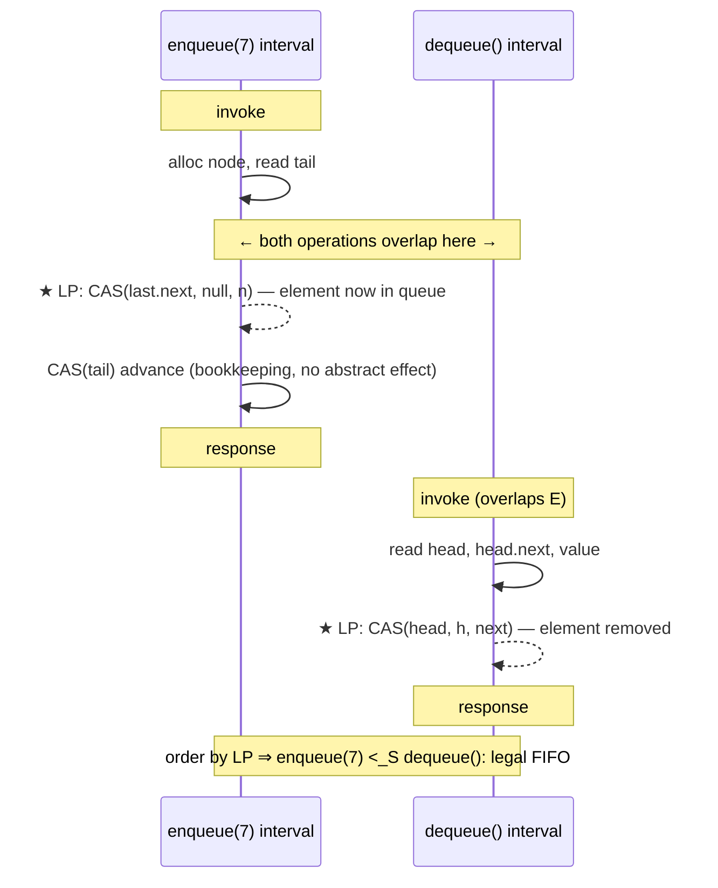

# Michael-Scott Lock-Free Queue — Formal Foundations and Correctness Proofs

> Focus: **"Is this provably correct?"** — the precise correctness condition (**linearizability**), a linearization-point proof for the MS-queue, the **lock-freedom** progress proof, a formal statement of the **safe memory reclamation** problem, and the progress-guarantee hierarchy (wait-free ⊃ lock-free ⊃ obstruction-free).

This document treats the MS-queue as a formal object. We define the abstract FIFO specification, fix the concurrent execution model, identify the **linearization points** of each operation, prove the algorithm is a correct (linearizable) FIFO queue, prove it is **lock-free**, and then state precisely why naive reclamation is unsafe and what a correct reclamation scheme must guarantee.

---

## Table of Contents

1. [Abstract Specification of a FIFO Queue](#abstract-specification-of-a-fifo-queue)
2. [Execution Model and Correctness Conditions](#execution-model-and-correctness-conditions)
3. [Structural Invariants (Formal)](#structural-invariants-formal)
4. [Linearizability Proof — Linearization Points](#linearizability-proof)
5. [Lock-Freedom Proof](#lock-freedom-proof)
6. [The Safe Memory Reclamation Problem (Formal)](#the-safe-memory-reclamation-problem)
7. [Progress-Guarantee Hierarchy](#progress-guarantee-hierarchy)
8. [Comparison with Alternatives](#comparison-with-alternatives)
9. [Summary](#summary)

---

## Abstract Specification of a FIFO Queue

```text
A sequential FIFO queue is an object with state q ∈ Values* (a finite sequence)
and two operations:

  enqueue(v):  q ← q · v             (append v to the right)        returns ⊥
  dequeue():   if q = ε: return EMPTY
               else: let q = v · q'; q ← q'; return v               (remove left)

Sequential specification SeqQ = set of all legal sequences of
(operation, response) pairs consistent with the above state machine.
```

A concurrent implementation is **correct** iff every concurrent history it produces is equivalent (in the linearizability sense, below) to some sequence in `SeqQ`.

```text
Implementation state (MS-queue), as a tuple:
   (N, Head, Tail, next, value)  where
   N      : finite set of allocated node identities
   Head   : N            (shared register)
   Tail   : N            (shared register)
   next   : N → N ∪ {⊥}  (per-node register; ⊥ = null)
   value  : N → Values ∪ {⊥}  (immutable after construction; ⊥ for the dummy)

Abstraction function α mapping implementation state to abstract queue:
   Let the chain be Head = n0 → n1 → … → nk (nk.next = ⊥).
   α(state) = (value(n1), value(n2), …, value(nk))   ∈ Values*
   (the dummy n0 contributes no element; empty ⇔ k = 0 ⇔ Head.next = ⊥).
```

The abstraction function `α` is the formal bridge: it says *which* abstract FIFO each concrete pointer configuration represents. The linearizability proof shows each linearization point transforms `α(state)` exactly as the corresponding sequential operation transforms `q`.

---

## Execution Model and Correctness Conditions

```text
Model: asynchronous shared memory; P processes; atomic primitives
  read, write, and CAS(addr, exp, new) on single words.
  Each process executes a sequence of these steps; the scheduler interleaves
  steps arbitrarily (adversarial, but each enabled step eventually... only
  for stronger guarantees — see lock-freedom).

History H: a finite sequence of invocation and response events.
  An operation op is "complete" in H if both its invocation and response appear.
  op1 precedes op2 (op1 <_H op2) if op1's response precedes op2's invocation.
  Operations that overlap are incomparable under <_H.

Linearizability (Herlihy & Wing, 1990):
  H is linearizable iff there exists a sequential history S such that
    (L1) S is legal — S ∈ SeqQ (respects the sequential spec), and
    (L2) S is consistent with the real-time order <_H:
         op1 <_H op2  ⇒  op1 <_S op2.
  Equivalently: each operation appears to take effect ATOMICALLY at some
  single instant (its "linearization point") between its invocation and response.
```

Linearizability is the gold-standard safety condition for concurrent objects: it is **local** (a system of linearizable objects is linearizable) and **non-blocking-compatible** (it does not force any operation to wait). We prove the MS-queue linearizable by exhibiting a linearization point for each operation.

The following diagram shows two overlapping operations and their linearization points. Although the operations' *intervals* overlap in real time, each takes effect at a single instant (its LP); ordering the operations by LP yields a legal sequential history.



Why linearizability and not a weaker condition? **Sequential consistency** would allow re-ordering operations as long as each thread's program order is preserved, but it is *not local* — composing sequentially-consistent objects need not be sequentially consistent. **Quiescent consistency** only constrains behavior across periods of no activity. For a general-purpose concurrent queue that programs compose freely, linearizability is the condition that lets callers reason about the queue as if it were a simple atomic FIFO.

---

## Structural Invariants (Formal)

Let `Head`, `Tail` be the shared pointer cells, and for a node `x`, `x.next` its successor cell. Let `D₀` denote the initial dummy. Define the *list* as the chain reachable from `Head` via `next`. The implementation maintains, at every quiescent point and indeed after every atomic step:

```text
(I1) Head ≠ null ∧ Tail ≠ null.                          [sentinel present]
(I2) The nodes reachable from Head form a simple null-terminated chain
     n₀ → n₁ → ... → n_k → null, with n₀ = the node Head points to.
(I3) Tail ∈ {n_{k-1}, n_k}   (Tail points to the last node OR its predecessor).
                                                          [tail lags ≤ 1]
(I4) For every node x ever linked: x.next transitions null → y at most once,
     and never changes thereafter.                        [single-assignment links]
(I5) Head only advances along next-links: if Head = n_i at time t and
     Head = n_j at time t' > t, then j ≥ i.                [monotone head]
```

**Lemma (I4 ⇒ link uniqueness).** Because `enqueue` links via `CAS(x.next, null, n)` and (I4) says `x.next` leaves `null` exactly once, **at most one** enqueuer succeeds in linking after any given last node. ∎

**Lemma (I3 maintained).** A successful link CAS sets `n_k.next = n_{k+1}`, momentarily making `Tail = n_k = n_{(k+1)-1}` — still within (I3). The subsequent (possibly by a helper) `CAS(Tail, n_k, n_{k+1})` restores `Tail = n_{k+1}` (last). No step makes Tail lag by 2: a second link cannot occur until Tail is advanced, because the new last node's `next` is `null` and a fresh enqueuer that reads `Tail = n_k` with `n_k.next ≠ null` is *required to help-advance Tail first*, not link. ∎

---

## Linearizability Proof

We assign a **linearization point (LP)** — a single atomic step — to each operation, then show the resulting order is legal and respects real time.

### Enqueue(v)

```text
LP(enqueue) = the successful CAS(x.next, null, n) that links the new node n
              (where x is the node that was last when the CAS succeeded).
```

**Justification.** Before this CAS, `n` is unreachable from `Head` (not in the abstract queue). Immediately after, by (I2) the chain is extended by `n` at the tail end, so `n` is the new last element of the abstract sequence `q`. The *second* CAS (advancing `Tail`) is a pure **helping/bookkeeping** step: it changes no abstract state (the element was already in the queue at the link CAS), and it may be performed by any thread. Thus enqueue takes effect atomically at LP(enqueue). Note LP(enqueue) lies between the operation's invocation (the enqueuer allocated `n` earlier) and its response (it returns only after, possibly, the helping CAS) — so the LP is within the operation's interval. For a *helper* that completes a different enqueuer's tail-advance, that helper does not own any enqueue LP; it merely assists.

### Dequeue() returning v

```text
LP(successful dequeue) = the successful CAS(Head, h, next) that advances Head,
                         where next = h.next and v = next.value (read earlier).
```

**Justification.** By (I2)/(I5), the element logically at the front of `q` is `Head.next.value` (the value in the node *after* the current dummy). Advancing `Head` from `h` to `next` removes exactly that front element and promotes `next` to the new dummy. The value `v = next.value` was read **before** the CAS; since (I4) freezes `value` for the life of a node and the CAS succeeded (so no other dequeuer removed `next` first), `v` is precisely the front element at the instant of the CAS. Hence dequeue takes effect atomically at LP. The LP lies within the operation's interval (read of `next.value` precedes it; the return follows it).

### Dequeue() returning EMPTY

```text
LP(empty dequeue) = the atomic read of h.next (= null) in the iteration that
                    returns EMPTY, given the prior re-validation Head = h and
                    the observation Head = Tail.
```

**Justification.** At this read, `Head = Tail = h` and `h.next = null`. By (I2)/(I3), the chain is exactly `[h]` (only the dummy), so the abstract queue is empty `q = ε`. The read witnesses an instant at which `q = ε`, which is a legal point to return EMPTY per `SeqQ`. The re-validation `Head == h` rules out the case where Head advanced between the loads, ensuring the snapshot is coherent.

### Legality and real-time order

```text
Construct S by ordering all completed operations by their LP timestamps
(LPs are distinct atomic steps; ties impossible since each is a CAS/read on
a specific cycle).

(L1 legality) Enqueue LPs append in CAS order; by (I4) appends are totally
ordered and never lost, and dequeue LPs remove from the front in Head-advance
order, which by (I5) is monotone. Therefore S obeys FIFO: the i-th dequeue
returns the i-th enqueued value. Empty-dequeue LPs occur only when the chain
is the lone dummy, consistent with q = ε. Hence S ∈ SeqQ.

(L2 real-time) Each LP lies strictly between its operation's invocation and
response (shown per case above). If op1 <_H op2 (op1 responded before op2 was
invoked), then LP(op1) < response(op1) ≤ invocation(op2) < LP(op2), so
op1 <_S op2.

By L1 ∧ L2, every history is linearizable. ∎  (MS-queue is a linearizable FIFO queue.)
```

### A fully worked linearization trace

To see the proof "in motion," here is a concrete concurrent history `H` with three threads and the unique legal `S` it linearizes to. Steps are labeled with global time `t₁ < t₂ < …` at which each thread's atomic step executes.

```text
Threads: P (enqueue 1), Q (enqueue 2), R (dequeue).
Initial: Head = Tail = D₀ (empty).

t1  P: alloc n1, read Tail = D₀, D₀.next = null
t2  Q: alloc n2, read Tail = D₀, D₀.next = null
t3  P: CAS(D₀.next, null, n1) → SUCCESS        ★ LP(enqueue 1)   [queue: (1)]
t4  Q: CAS(D₀.next, null, n2) → FAIL (now n1)  ... Q retries
t5  R: read Head=D₀, Tail=D₀, D₀.next=n1; Head≠... (Head==Tail but next≠null)
t6  R: help-advance: CAS(Tail, D₀, n1) → SUCCESS                  (bookkeeping)
t7  P: CAS(Tail, D₀, n1) → FAIL (already n1)    ... P returns (enqueue done)
t8  R: re-read Head=D₀, Tail=n1, next=n1; read v=n1.value=1
t9  R: CAS(Head, D₀, n1) → SUCCESS              ★ LP(dequeue→1)   [queue: ()]
t10 Q: re-read Tail=n1, n1.next=null
t11 Q: CAS(n1.next, null, n2) → SUCCESS         ★ LP(enqueue 2)   [queue: (2)]
t12 Q: CAS(Tail, n1, n2) → SUCCESS                                (bookkeeping)

LP order:  enqueue1 (t3)  <  dequeue→1 (t9)  <  enqueue2 (t11)
Sequential S:  enqueue(1); dequeue()→1; enqueue(2)
Check legality: enqueue 1 then dequeue returns 1 (FIFO ✓); enqueue 2 leaves (2).
Check real-time: no two completed ops were non-overlapping in a way that
contradicts S (Q's enqueue overlapped both, R's dequeue overlapped Q).  S ∈ SeqQ. ∎
```

Notice three things the proof predicted: (a) Q's *failed* link CAS at t4 produced no LP — only the successful one at t11 did; (b) the tail-advances at t6 and t12 are pure bookkeeping with no LP; (c) the helping step at t6, performed by the *dequeuer* R, completed the *enqueuer* P's pending tail-advance — yet it created no enqueue LP, because LP(enqueue 1) already fired at t3.

---

## Lock-Freedom Proof

```text
Definition (lock-free). An implementation is lock-free iff in every infinite
execution in which some processes take infinitely many steps, INFINITELY MANY
operations complete (system-wide progress). Equivalently: it is impossible
for all processes to run forever without any operation finishing.

Claim. The MS-queue enqueue and dequeue are lock-free.

Proof. Suppose, for contradiction, an infinite execution E in which after some
time t no operation ever completes, yet some process keeps taking steps. Every
operation is a loop whose only way to *not* return is to (a) fail a CAS, or
(b) take a help branch and loop. We show a CAS failure of one process implies a
CAS SUCCESS of another, which forces progress.

Consider the shared cells Head, Tail, and the per-node next cells. Each is
modified only by a successful CAS. A process P's retry happens only when:

  (1) P's link CAS  CAS(x.next, null, n) fails
        ⇒ some other process Q succeeded in CAS(x.next, null, n').
          By LP(enqueue), Q LINEARIZED an enqueue — an operation completed
          (its effect took place). Contradiction with "no op completes".
  (2) P's tail-advance CAS(Tail, t, next) fails
        ⇒ Tail already moved past t, i.e., some process advanced Tail —
          a bounded bookkeeping step that strictly increases Tail's position
          along the (monotone, finite-per-enqueue) chain.
  (3) P's head-advance CAS(Head, h, next) fails
        ⇒ some process succeeded CAS(Head, h, next'), which by LP(dequeue) is
          a COMPLETED dequeue. Contradiction.

Cases (1) and (3) directly contradict the assumption (an operation completed).
Case (2) cannot recur unboundedly without an intervening (1) or (3): Tail can be
advanced at most one step per linked node, and a new node is linked only by a
successful link CAS (case (1) success = a completed enqueue). Likewise the
re-validation checks (Head==h, Tail==t) only cause a re-loop when Head/Tail
moved — again, caused by another process's successful CAS that advances global
state.

Therefore some process's CAS must succeed infinitely often, and each such
success on Head/next corresponds to a completed operation. This contradicts
"no operation completes after t". Hence infinitely many operations complete:
the MS-queue is lock-free. ∎

Remark (not wait-free). A single slow process can fail its CAS arbitrarily many
times while others race ahead — an individual operation has no finite step bound.
So the MS-queue is lock-free but NOT wait-free.
```

---

## The Safe Memory Reclamation Problem (Formal)

Linearizability and lock-freedom above were proven in a model where **nodes are never reused** (e.g., a garbage collector, or an idealized infinite address space). Real unmanaged implementations must reclaim memory, and reclamation can break **both** safety (use-after-free, ABA) and the very proofs above. State the problem precisely:

```text
Setup. A node, once dequeued (its Head-advance LP has occurred), is logically
removed. We wish to RETURN its memory to the allocator (free) and possibly
REUSE that address for a future node.

Hazard. A process P may hold a local pointer p = x (read before x's removal)
and intend to dereference p.next or p.value AFTER x has been removed. If x has
been freed and the address reused as x', then:
  • use-after-free: reading freed memory is undefined; OR
  • ABA: CAS(Head, x, next) by P succeeds because the CURRENT Head equals x by
    ADDRESS (reused), though it is a different logical node x' — violating the
    linearization argument (the LP no longer corresponds to the intended op).

Safety requirement (SMR correctness).
  A node x may be freed at time t only if:
    NO process holds, or will dereference, a pointer to x at any time ≥ t.
  Formally: free(x) at t is safe ⇔ for all processes P and all times t' ≥ t,
    P does not access *x in the interval before x is (possibly) reused.

This is an agreement problem over the unbounded, dynamically-changing set of
"pointers currently held by some process." It cannot be solved by reading the
queue alone; processes must PUBLISH their intent.

Two sound solutions and their guarantees:

  Hazard Pointers (Michael, 2004). Each process publishes p into a shared
  hazard slot before dereferencing. Invariant enforced:
      x is freed ⇒ x is in no process's hazard slot at the scan instant.
  Bound: at most O(P·K) unreclaimed nodes (K hazards/process). Per-deref cost:
  one store + a store-load fence (to order publish before the re-validation
  that x is still in the structure).

  Epoch-Based Reclamation / RCU. Global epoch e; each reader pins the current
  epoch on entering a critical section. A node retired in epoch e is freed only
  after a GRACE PERIOD: all processes observed in epoch ≥ e+2. Invariant:
      no process pinned at epoch ≤ e can still hold a pre-retirement pointer.
  Bound: UNBOUNDED if any process stalls inside a critical section (it pins the
  epoch, blocking reclamation) — a liveness weakness, not a safety one.

Both restore the "no reuse while referenced" assumption under which the
linearizability and lock-freedom proofs hold; tagged pointers alone defeat ABA's
CAS-confusion but do NOT prevent use-after-free, so they are insufficient by
themselves.
```

> Formal takeaway: the MS-queue is provably linearizable and lock-free **modulo a sound SMR scheme**. Memory reclamation is not an implementation detail — it is a precondition of the proofs.

### Why the proofs *fail* without sound SMR — a concrete break

It is worth showing exactly which proof step collapses under premature reuse, because it clarifies what an SMR scheme must restore.

```text
Recall LP(dequeue) = the successful CAS(Head, h, next), justified by:
   "the CAS succeeded ⇒ Head still equals h ⇒ the snapshot (h, next, v) is
    the true front at the CAS instant."

This justification SILENTLY ASSUMES: 'Head equals h (by address)' implies
'Head is the SAME logical node the operation snapshotted.'

Under reuse this implication is FALSE. Sequence:
  1. P snapshots h = A, next = B, v = B.value.
  2. A and B are dequeued by others; A and B are FREED.
  3. The allocator reuses A's address for a new node A'' that is enqueued and
     happens to sit at Head again. Head == A by ADDRESS, but A is logically A''.
  4. P's CAS(Head, A, B) succeeds (address match) and sets Head = B — a FREED
     node. The 'front' it claims to remove (v) was never the current front.

The legality argument (L1) breaks: the dequeue LP no longer corresponds to
removing the true front; FIFO order is violated and Head points into reclaimed
memory. A sound SMR scheme RESTORES the implication by guaranteeing B (and A's
original incarnation) are not reused while P holds them — re-validating the
proof's hidden assumption.
```

This is why tagged/stamped pointers are *necessary but not sufficient*: a stamp restores the implication "address match ⇒ same logical node" for the **CAS-confusion** (ABA) failure, but it does nothing about step 4's read of `B.value` when `B` itself has been freed — that is a use-after-free that only a reclamation discipline (hazard pointers/epochs) prevents.

---

## Progress-Guarantee Hierarchy

```text
Wait-free  ⊊  Lock-free  ⊊  Obstruction-free   (strict inclusions)

  Obstruction-free: a process completes in a bounded number of its OWN steps
       if it eventually runs in ISOLATION (no interference).
  Lock-free:        system-wide, SOME process completes in a bounded number of
       total steps (infinitely many ops complete in any infinite run).
  Wait-free:        EVERY process completes in a bounded number of its own
       steps, regardless of scheduling (no starvation).

MS-queue placement: LOCK-FREE.
  • Obstruction-free? Yes (lock-free ⇒ obstruction-free).
  • Wait-free?        No. A perpetually-unlucky process can fail its CAS
       forever while others make progress (shown in the lock-freedom remark).

Universality (Herlihy). CAS has consensus number ∞; thus any sequential object
(including a FIFO queue) has a wait-free implementation from CAS in principle.
The MS-queue trades that for simplicity and speed: it is lock-free, not wait-
free. Wait-free queues exist (e.g., Kogan–Petrank 2011) using a HELPING
ARRAY where each process announces its operation and others complete it within
a bounded number of rounds — at higher constant cost.
```

| Property | Guarantee | Granularity | MS-queue |
|----------|-----------|-------------|----------|
| Obstruction-free | progress if isolated | per-process | Yes |
| **Lock-free** | some op always completes | system-wide | **Yes** |
| Wait-free | every op completes in bounded steps | per-process | No |
| Wait-free (bounded) | bounded steps with explicit bound | per-process | No (use Kogan–Petrank) |

### Consensus numbers and why CAS suffices

```text
Consensus number of a primitive = max number of processes for which the
primitive can solve wait-free binary consensus.

  read/write atomic registers : consensus number 1  (cannot do 2-proc consensus)
  test-and-set, fetch-and-add : consensus number 2
  CAS (compare-and-swap)      : consensus number ∞   (any number of processes)

Herlihy's Universality Theorem: any object with a sequential specification has
a WAIT-FREE linearizable implementation built from objects of consensus number
∞ (e.g., CAS) and registers.

Corollary: a wait-free FIFO queue from CAS EXISTS in principle. The MS-queue
does not realize it — it deliberately chooses the simpler, faster lock-free
point in the design space. The Kogan–Petrank (2011) queue realizes wait-freedom
by having each process publish its pending operation in a shared 'state' array;
other processes HELP complete announced operations in a fixed round-robin order,
bounding any single process's steps. The cost is an extra announce/scan per op
and more involved reclamation (the announce array also holds node references).
```

### Why "helping" appears in both lock-free and wait-free designs

Helping is the recurring tool of non-blocking algorithms. In the MS-queue it is *minimal* — only the tail-advance is helped, which is enough for lock-freedom. In wait-free designs helping is *total* — every operation can be completed by any other process, which is what bounds per-process steps. The progression is instructive:

```text
no helping        → not even obstruction-free in general (a stall can deadlock
                    a 2-word update protocol)
help tail-advance → LOCK-FREE (MS-queue): system always progresses
help every op     → WAIT-FREE (Kogan–Petrank): every op progresses in bounded
                    steps, at higher constant cost
```

---

## On the Subtlety of the Empty-Dequeue Linearization Point

The empty-dequeue LP deserves a closer formal look, because it is the part of the proof most often gotten wrong. Unlike enqueue and successful dequeue — whose LPs are *successful CAS steps* that mutate shared state — the empty-dequeue LP is a **read**. This raises a question: is a read a valid linearization point?

```text
Yes, provided the read OBSERVES a state that justifies the response.

The returned response is EMPTY, which is legal in SeqQ exactly when q = ε.
The read of Head.next = ⊥ (with the validated Head = Tail = h) witnesses, by α,
that α(state) = ε at that instant. So the operation "takes effect" — observes
an empty queue — atomically at the read.

Why the validation Head == h is REQUIRED: without it, Head could have advanced
between reading Head and reading Head.next, so the (Head, Head.next) pair might
straddle two different states (a "torn read"), and ⊥ might not reflect a single
real instant of emptiness. The re-read pins the observation to one coherent state.

Subtle case — a concurrent enqueue: suppose an enqueuer's link CAS happens AFTER
our empty-read. Then there exists a real instant (our read) at which q = ε, and
our EMPTY response linearizes THERE, before the enqueue's LP. The real-time
order is respected because the enqueue had not yet completed (its response did
not precede our invocation). Linearizability permits this: a dequeue that
overlaps an enqueue may legally observe the pre-enqueue empty state.
```

This is the canonical example of why linearizability is about the *existence* of a consistent ordering, not about wall-clock simultaneity: an EMPTY return is correct as long as some instant of emptiness existed within the operation's interval, even if an item was enqueued a nanosecond later.

## Comparison with Alternatives

| Attribute | MS-queue | Two-lock queue | Kogan–Petrank wait-free queue | Disruptor (ring) |
|-----------|----------|----------------|-------------------------------|------------------|
| Safety | Linearizable | Linearizable | Linearizable | Linearizable (per slot) |
| Progress | Lock-free | Blocking | **Wait-free (bounded)** | Lock-free (bounded ring) |
| LP of enqueue | link CAS | under tail lock | announce + help | sequence-claim CAS |
| Per-op worst case | unbounded retries | lock wait | **bounded rounds** | bounded (or block if full) |
| Reclamation | needs SMR | trivial (under lock) | needs SMR + announce GC | none (slots reused) |
| Constant factor | low | low | higher (helping array) | very low |

## Formal Progress Failure of the Two-Lock Queue (Contrast)

To appreciate *why* the MS-queue's lock-freedom is a real property and not a formality, contrast it with the two-lock queue under the same adversarial scheduler.

```text
Two-lock queue: enqueue acquires tailLock; dequeue acquires headLock.

Adversary: schedule a process P to acquire tailLock, then DESCHEDULE P
indefinitely (the scheduler is allowed to be unfair to P).

Consequence: every other enqueuer blocks on tailLock forever. NO enqueue
completes while P is parked, even though other processes take infinitely many
steps (spinning/blocking on the lock). This VIOLATES the lock-free condition:
  ∃ infinite execution with infinitely many steps but only finitely many
  completed enqueues.
⇒ The two-lock queue is BLOCKING, not lock-free.

MS-queue under the same adversary: schedule P to win a link CAS, then park it
before its tail-advance. Other processes observe the lagging tail and HELP-
advance it (a successful CAS), then proceed to complete their own operations.
Infinitely many operations complete despite P being parked forever.
⇒ The MS-queue is LOCK-FREE.

The single structural difference responsible for the gap: the two-lock queue's
progress depends on a parked process RELEASING a lock; the MS-queue's progress
depends only on SOME process completing a CAS, which any process can do.
```

This contrast is the crux of the entire topic: lock-freedom is precisely the property of *not* having a step whose completion only one (possibly parked) process can perform. The helping mechanism exists to eliminate every such step.

---

## Complexity Restated Formally

```text
Let an "operation attempt" be one iteration of the retry loop.

Step complexity per attempt: O(1) — bounded reads + ≤2 CAS, no loops over data.

Successful operation: O(1) attempts in the absence of contention; under
contention, the NUMBER of attempts by one operation is unbounded (the source
of non-wait-freedom), but each FAILED attempt is "paid for" by another
operation's SUCCESS — so the AMORTIZED system-wide work is O(1) per completed
operation:

    total attempts over an execution
       = successes + failures
       ≤ successes + (successes)            [each failure charged to a success]
       = O(#completed operations)

Hence the system performs Θ(1) amortized work per completed operation, even
though an individual operation has no per-op step bound. Space is O(n) live
nodes plus O(reclaim-overhead): O(P·K) for hazard pointers, or O(epoch-window)
for EBR.
```

This is the formal counterpart to the senior-level observation that the *real* cost is cache-coherence traffic: the abstract step count is Θ(1) amortized, but each successful CAS on a contended line incurs a coherence miss not captured by the RAM model — an O(1) with a large, contention-dependent constant.

## Summary

The MS-queue is **provably correct** in the strongest standard sense: it is **linearizable**, with the enqueue LP at the successful `next`-link CAS, the successful-dequeue LP at the `Head`-advance CAS, and the empty-dequeue LP at the `Head.next == null` read — and the LP order respects real-time precedence, yielding a legal FIFO history. It is **lock-free**: any retry is caused by another process's *successful* state-advancing CAS, so infinitely many operations complete in any infinite run — but it is **not wait-free** (an unlucky process can starve). These proofs assume **no premature node reuse**; in unmanaged settings that assumption must be discharged by a sound **safe-memory-reclamation** scheme (hazard pointers or epoch/RCU), since reclamation, not the queue logic, is where correctness most often fails. On the progress hierarchy the MS-queue sits strictly between obstruction-freedom and wait-freedom.

In one sentence for a defense: *the MS-queue is a linearizable, lock-free FIFO whose enqueue/dequeue linearization points are well-defined CAS/read steps, whose progress survives arbitrary thread stalls via helping, and whose only remaining correctness obligation — discharged outside the algorithm by a sound safe-memory-reclamation scheme — is to never reuse a node while a thread still holds a pointer to it.* Everything in this document is an elaboration of that sentence.

A final orientation for further study: the three pillars proven here — **safety** (linearizability via abstraction function and per-operation LPs), **liveness** (lock-freedom via the "every retry is caused by a success" argument), and the **reclamation precondition** (the formal SMR requirement) — recur in *every* lock-free data structure. The lock-free stack ([`17-lock-free-stack`](../17-lock-free-stack/)) reuses the same LP-at-the-CAS technique; the concurrent hash map ([`18-concurrent-hash-map`](../18-concurrent-hash-map/)) reuses the same reclamation machinery. Master them on the MS-queue and they transfer wholesale.

---

**Next step:** [interview.md](./interview.md) — tiered Q&A from "what is a sentinel node?" up to "prove the MS-queue is lock-free," plus a full coding challenge in Go, Java, and Python.
