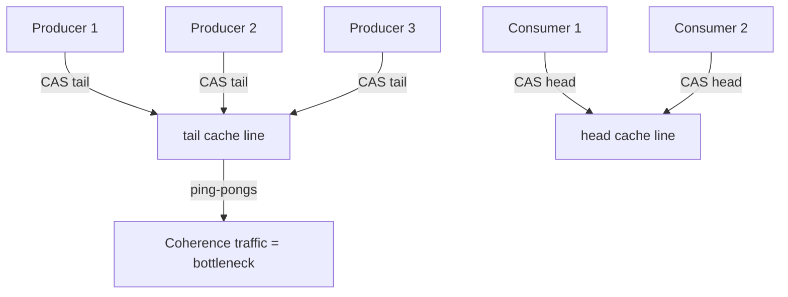
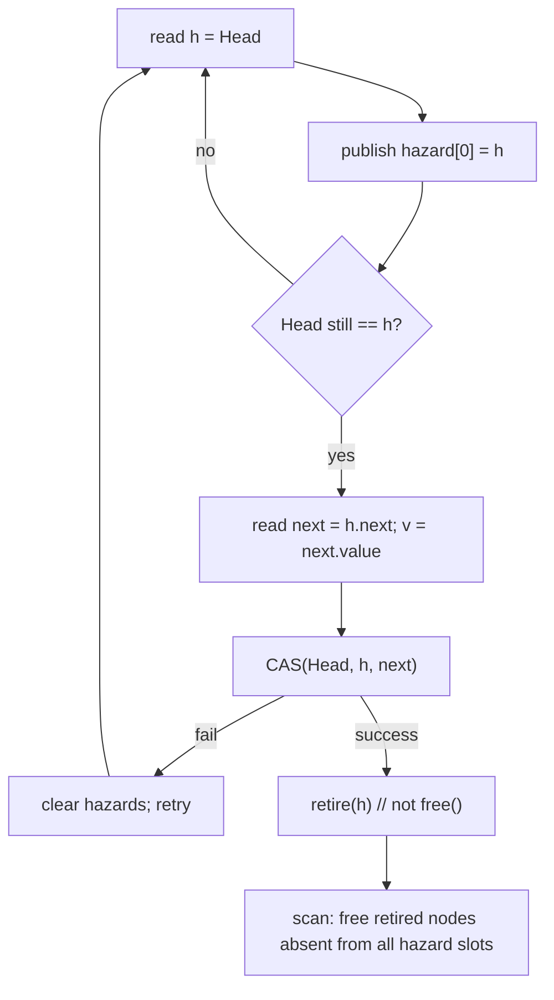

# Michael-Scott Lock-Free Queue — Senior Level

> Focus: **"How do I run this in a real high-throughput system?"** — producer-consumer pipelines, thread-pool work queues, message passing, the practical memory-reclamation choices (hazard pointers vs epochs/RCU), contention management (backoff), **false sharing / cache-line padding**, and the LMAX Disruptor as a bounded alternative.

Senior engineers rarely *implement* an MS-queue from scratch in production — they choose one, tune it, and know its failure modes under load. This document is about the operational reality: where MS-queues live in real systems, what actually limits their throughput (cache coherence, not Big-O), how to reclaim memory without locks, and when a bounded ring buffer beats an unbounded linked queue.

---

## Table of Contents

1. [Introduction](#introduction)
2. [Where MS-Queues Live in Real Systems](#where-ms-queues-live-in-real-systems)
3. [The Throughput Wall: Cache Coherence, Not Big-O](#the-throughput-wall)
4. [Memory Reclamation in Practice](#memory-reclamation-in-practice)
5. [Contention Management — Backoff and Elimination](#contention-management)
6. [False Sharing and Cache-Line Padding](#false-sharing-and-cache-line-padding)
7. [Bounded vs Unbounded; the Disruptor Alternative](#bounded-vs-unbounded-the-disruptor-alternative)
8. [Comparison with Alternatives](#comparison-with-alternatives)
9. [Code Examples](#code-examples)
10. [Observability](#observability)
11. [Failure Modes](#failure-modes)
12. [Summary](#summary)

---

## Introduction

A lock-free queue is a *building block*, not an architecture. The senior questions are: which workload shape does it fit, what is the real bottleneck, and what operational hazards does it introduce? The MS-queue shines for **multi-producer / multi-consumer (MPMC)** FIFO where you cannot tolerate a stalled thread freezing the pipeline. It struggles when contention concentrates on a single cache line, when memory growth is unbounded, or when a fixed-capacity, allocation-free design (Disruptor) would simply be faster.

---

## Where MS-Queues Live in Real Systems

| System / use case | Role of the MS-queue (or its idea) |
|-------------------|-------------------------------------|
| **Thread pools / executors** | The work queue feeding worker threads. Java's `ForkJoinPool` and many executors use lock-free or work-stealing deques; `ConcurrentLinkedQueue` (an MS-queue) is a common task buffer. |
| **Producer-consumer pipelines** | Stages hand off items lock-free so a slow stage doesn't block upstream producers. |
| **Message passing / actor mailboxes** | Each actor's inbox is an MPSC/MPMC queue; many actor runtimes use MS-queue variants. |
| **Event loops / I/O reactors** | Off-thread events posted onto a lock-free queue drained by the loop thread. |
| **Logging / telemetry** | Hot-path threads enqueue log records; a background thread drains and writes, so logging never blocks request handling. |
| **Garbage collectors / runtimes** | Internal work lists of objects to scan are often lock-free queues. |

The constant theme: a **fast path that must never block** hands work to a **slower consumer**. A lock would let one stalled consumer (or a descheduled holder) back-pressure the entire fast path; lock-free avoids that.

---

## The Throughput Wall: Cache Coherence, Not Big-O

The Big-O says O(1). Reality says throughput is governed by **how often a contended cache line moves between cores**. Both `head` and `tail` are single words that every operation CASes. Under MESI/MOESI coherence, a CAS requires the line in **exclusive** state, so each successful CAS:

1. Invalidates that line in every other core's cache.
2. Forces the next core to re-fetch it (a coherence miss, tens to hundreds of cycles).

With N producers all CASing `tail`, the tail line "ping-pongs." Measured effect: per-op latency rises with core count, and aggregate throughput can plateau or *decline* past a handful of contending threads. This is why:

- **Separating head and tail onto different cache lines** matters (a dequeuer touching `head` should not invalidate the producers' `tail` line — see false sharing below).
- **Backoff** helps: failing threads back off so the winner's line is not constantly stolen.
- **Bounded ring buffers (Disruptor)** win at extreme scale because consumers read their own slots and only periodically touch a shared sequence.



---

## Memory Reclamation in Practice

In a GC language (Java, Go) the MS-queue is easy: the collector never recycles an address while any reference exists, so ABA-by-reuse and use-after-free cannot happen. The price is GC pressure — every node is garbage after dequeue.

In an unmanaged language (C/C++/Rust-unsafe) you must reclaim manually, lock-free. The two production techniques:

### Hazard pointers (see [`20-hazard-pointers`](../20-hazard-pointers/))

Each thread has a small set of **hazard pointer** slots. Before dereferencing a node, a thread **publishes** that pointer into a slot (a store + fence). A node removed from the queue goes onto a per-thread **retire list** instead of being freed. Periodically a thread **scans all published hazards**; any retired node not currently hazarded is freed.

- Bounded memory: at most O(threads × hazards) un-freed nodes per thread.
- Cost: a store + memory fence per dereference; a scan amortized over many retires.
- Precisely targets the use-after-free: you free X only when no thread says "I'm using X."

### Epoch-based reclamation / RCU (see [`19-rcu`](../19-rcu/))

Threads enter and leave **read-side critical sections**, advancing a global **epoch**. A retired node from epoch *e* is freed only after every thread has been observed in epoch ≥ *e+2* — a **grace period** during which no thread can still hold a pre-retirement pointer.

- Reads are extremely cheap (often just a per-thread epoch store, no per-pointer fence).
- Downside: a single **stalled reader** stuck in a critical section stalls reclamation → unbounded memory growth until it exits.
- Used heavily in the Linux kernel (RCU) and in libraries like Crossbeam (Rust).

| Technique | Per-op overhead | Memory bound | Worst case |
|-----------|-----------------|--------------|------------|
| GC (managed) | Allocation + GC | GC-managed | GC pause |
| Hazard pointers | Store + fence per deref | Bounded | Scan cost |
| Epoch / RCU | ~1 store per section | Unbounded if reader stalls | Stalled reader blocks reclaim |
| Tagged pointer only | DCAS | n/a (no free) | Doesn't solve use-after-free alone |

> Senior rule of thumb: **GC if you have it; hazard pointers if you need bounded memory; epochs/RCU if reads vastly outnumber writes and you can bound critical-section length.**

### A worked hazard-pointer dequeue

To make the abstraction concrete, here is what dequeue looks like with hazard pointers protecting the dereferences. The shape is: publish the pointer you're about to use, **re-validate** it is still in the structure (the publish must be visible before the re-check — hence a fence), use it, then retire (not free) on success.



The two stores — publishing the hazard and clearing it — are the entire per-operation cost beyond the plain algorithm. The reclaimer's scan is amortized: you retire nodes into a thread-local list and only scan when it grows past a threshold (e.g., 2× the total hazard count), guaranteeing each scan frees a constant fraction of retired nodes. That keeps reclamation amortized O(1) per operation while bounding live memory to O(P·K + retire-threshold).

### Reclamation choice decision table

| If your workload… | Prefer | Because |
|-------------------|--------|---------|
| Runs on JVM or Go | GC | Correct for free; no ABA-by-reuse; tune for allocation pressure |
| Needs hard memory bound, adversarial scheduling | Hazard pointers | Per-thread bound; a stalled thread holds only its K hazards |
| Is read-mostly with short critical sections | Epoch / RCU | Near-zero read overhead; grace periods are cheap |
| Has unpredictable long pauses inside critical sections | Hazard pointers (not EBR) | EBR's pinned epoch would block reclamation indefinitely |
| Can fix capacity and avoid allocation entirely | Ring buffer (Disruptor) | No reclamation problem to solve at all |

---

## Contention Management — Backoff and Elimination

- **Exponential backoff with jitter:** after a failed CAS, spin (then yield) for a randomized, growing interval so colliding threads desynchronize. Use `Thread.onSpinWait()` (Java) / `runtime.Gosched()` (Go) / PAUSE instruction.
- **Combining / flat combining:** one thread becomes a temporary "combiner" that applies a batch of others' operations, turning many CASes into one — reduces coherence traffic dramatically under high contention.
- **Elimination (more for stacks):** a concurrent push and pop can cancel out without touching the central structure. Less natural for FIFO queues but used in some hybrids.
- **Sharding:** run K independent queues and hash producers/consumers across them; trades strict global FIFO for far less contention (common in thread pools as per-worker queues + work stealing).

---

## False Sharing and Cache-Line Padding

**False sharing:** two logically independent variables sit on the **same 64-byte cache line**, so updating one invalidates the other across cores even though they're unrelated. In an MS-queue, if `head` and `tail` share a line, every dequeue (CAS head) needlessly invalidates the producers' copy of `tail`, and vice versa. Fix: **pad** so head and tail occupy separate cache lines.

#### Go

```go
package main

import "sync/atomic"

const cacheLine = 64

type node struct {
	value int
	next  atomic.Pointer[node]
}

// Pad head and tail onto separate cache lines to avoid false sharing.
type PaddedMSQueue struct {
	head atomic.Pointer[node]
	_    [cacheLine - 8]byte // pad out the rest of head's line
	tail atomic.Pointer[node]
	_    [cacheLine - 8]byte
}
```

#### Java

```java
import java.util.concurrent.atomic.AtomicReference;

// @Contended asks the JVM to pad the field onto its own cache line.
// Requires -XX:-RestrictContended (or it's a no-op).
class PaddedMSQueue<T> {
    static final class Node<T> {
        final T value;
        final AtomicReference<Node<T>> next = new AtomicReference<>();
        Node(T v) { value = v; }
    }

    @jdk.internal.vm.annotation.Contended
    private final AtomicReference<Node<T>> head;
    @jdk.internal.vm.annotation.Contended
    private final AtomicReference<Node<T>> tail;

    PaddedMSQueue() {
        Node<T> d = new Node<>(null);
        head = new AtomicReference<>(d);
        tail = new AtomicReference<>(d);
    }
}
```

#### Python

```python
# CPython object layout is opaque and the GIL serializes access, so
# false sharing is not a concern Python code can meaningfully control.
# This note exists for parity: in CPython, use queue.Queue and move on.
import queue
shared = queue.Queue()
```

> The LMAX Disruptor is famous for aggressive padding: its sequence counters are surrounded by padding longs so the producer cursor and consumer cursor never share a line.

---

## Bounded vs Unbounded; the Disruptor Alternative

The MS-queue is **unbounded**: enqueue never fails, the list just grows. That is a feature (no back-pressure stalls) and a hazard (a slow consumer → OOM). For systems that need bounded memory and the lowest latency, the **LMAX Disruptor** is the canonical alternative:

| Aspect | MS-queue | LMAX Disruptor (ring buffer) |
|--------|----------|------------------------------|
| Storage | Linked nodes, allocated per item | Pre-allocated fixed array (ring) |
| Capacity | Unbounded | Bounded (power-of-two size) |
| Allocation on hot path | Yes (one node/enqueue) | **None** (slots reused) |
| Reclamation | ABA/HP/epoch/GC | None — slots overwritten |
| Back-pressure | None (grows) | Producer blocks/spins when full |
| Cache behavior | Pointer-chasing, poor locality | Sequential array, excellent locality |
| Coordination | CAS on head/tail pointers | CAS on integer sequence numbers |
| Best for | Variable load, unbounded bursts | Sustained high throughput, fixed budget |

The Disruptor replaces "CAS a pointer to allocate-and-link a node" with "CAS a 64-bit sequence number to claim a pre-existing slot." No allocation, no node reclamation, sequential memory access, and explicit back-pressure. At LMAX it moved ~6 million orders/sec on one thread. The cost: a fixed ring size and producers that must wait when full.

> Decision: **bounded + max throughput + fixed budget → Disruptor; unbounded + bursty + must-not-block-producers → MS-queue.**

### MPSC and SPSC specializations

In real systems you often do *not* need the full multi-producer/multi-consumer (MPMC) generality the MS-queue provides, and specializing buys large wins:

- **SPSC (single-producer single-consumer):** the strongest specialization. With exactly one producer and one consumer, you can use a lock-free ring buffer with **no CAS at all** — the producer owns the write index, the consumer owns the read index, and they only publish indices to each other via release/acquire stores. This is the fastest queue that exists and is the backbone of many audio pipelines and per-connection I/O buffers.
- **MPSC (multi-producer single-consumer):** producers still contend on enqueue (CAS the tail), but the single consumer never contends on dequeue, so the head line is uncontended. Actor mailboxes are the canonical case — many senders, one actor draining. Vyukov's intrusive MPSC queue is a famous lock-free design here, simpler and faster than the full MS-queue.
- **MPMC:** the general case the MS-queue solves. Use it only when you genuinely have multiple consumers competing for the same items.

| Variant | Enqueue contention | Dequeue contention | Typical structure | Use case |
|---------|--------------------|--------------------|-------------------|----------|
| SPSC | none | none | ring buffer, index publish | audio, per-conn I/O |
| MPSC | yes (CAS tail) | none | Vyukov MPSC / MS-queue | actor mailbox, logging |
| MPMC | yes | yes | MS-queue, Disruptor | thread-pool work queue |

> Senior instinct: **always specialize down**. If the design only has one consumer, an MPSC queue removes all head-side contention for free. Reaching for the full MPMC MS-queue when you have SPSC traffic leaves enormous throughput on the table.

### Memory ordering, not just atomicity

A subtle senior-level point: the MS-queue needs more than *atomicity* of CAS — it needs the right **memory ordering** so a consumer that observes a linked node also observes that node's fully-initialized `value`. Concretely, the producer's write to `n.value` must be visible *before* the link CAS publishes `n`, or a consumer could read a node whose value field is still garbage. In Go (`sync/atomic`) and Java (`AtomicReference`), the atomic store/CAS carry **release** semantics and the atomic load carries **acquire** semantics, which establishes exactly this happens-before edge. In C/C++ you must spell it out: `value` written with a plain store, then `next.store(n, memory_order_release)`, paired with `next.load(memory_order_acquire)` on the reader. Get the ordering wrong and the algorithm is correct on x86 (strong model) but breaks on ARM/POWER (weak model) — a classic "works on my laptop, fails in production" concurrency bug.

---

## Comparison with Alternatives

| Attribute | MS-queue | Two-lock queue | Disruptor | Work-stealing deque |
|-----------|----------|----------------|-----------|---------------------|
| Write throughput | High (drops at high N) | Medium | **Very high** | High |
| Read latency p99 | Low, contention-sensitive | Medium | **Very low** | Low |
| Memory overhead | 1 node/item + reclaim | 1 node/item | Fixed ring | Per-worker arrays |
| Bounded? | No | No | **Yes** | Per-worker bounded-ish |
| Production usage | Java `ConcurrentLinkedQueue` | MS two-lock variant | LMAX, log4j2 async | `ForkJoinPool` |
| Strict FIFO? | Yes | Yes | Yes | No (LIFO-ish local) |

---

## Code Examples

### Producer-consumer thread pool on a lock-free queue

#### Go

```go
package main

import (
	"fmt"
	"sync"
	"sync/atomic"
)

// (reuse MSQueue from junior.md)
func main() {
	q := NewMSQueue()
	const producers, consumers, perProducer = 4, 4, 100000
	var wg sync.WaitGroup
	var produced, consumed int64

	for p := 0; p < producers; p++ {
		wg.Add(1)
		go func(id int) {
			defer wg.Done()
			for i := 0; i < perProducer; i++ {
				q.Enqueue(id*perProducer + i)
				atomic.AddInt64(&produced, 1)
			}
		}(p)
	}

	done := make(chan struct{})
	var cwg sync.WaitGroup
	for c := 0; c < consumers; c++ {
		cwg.Add(1)
		go func() {
			defer cwg.Done()
			for {
				if _, ok := q.Dequeue(); ok {
					atomic.AddInt64(&consumed, 1)
				} else {
					select {
					case <-done:
						if _, ok := q.Dequeue(); !ok {
							return // drained and producers finished
						}
					default:
					}
				}
			}
		}()
	}
	wg.Wait()
	close(done)
	cwg.Wait()
	fmt.Printf("produced=%d consumed=%d\n", produced, consumed)
}
```

#### Java

```java
import java.util.concurrent.*;

public class Pool {
    public static void main(String[] args) throws Exception {
        var q = new ConcurrentLinkedQueue<Integer>();
        int producers = 4, consumers = 4, per = 100_000;
        var pool = Executors.newFixedThreadPool(producers + consumers);
        var done = new java.util.concurrent.atomic.AtomicBoolean(false);
        var consumed = new java.util.concurrent.atomic.LongAdder();

        var ps = new CountDownLatch(producers);
        for (int p = 0; p < producers; p++) {
            final int id = p;
            pool.execute(() -> {
                for (int i = 0; i < per; i++) q.offer(id * per + i);
                ps.countDown();
            });
        }
        for (int c = 0; c < consumers; c++) {
            pool.execute(() -> {
                while (!done.get() || !q.isEmpty()) {
                    Integer v = q.poll();
                    if (v != null) consumed.increment();
                    else Thread.onSpinWait();
                }
            });
        }
        ps.await();
        done.set(true);
        pool.shutdown();
        pool.awaitTermination(10, TimeUnit.SECONDS);
        System.out.println("consumed=" + consumed.sum());
    }
}
```

#### Python

```python
# The GIL prevents real parallel speedup for CPU work; use queue.Queue,
# which is correct and battle-tested. For true parallelism use
# multiprocessing.Queue (separate processes) instead of threads.
import queue, threading

def run(producers=4, consumers=4, per=100_000):
    q = queue.Queue()
    SENTINEL = object()

    def produce(pid):
        for i in range(per):
            q.put(pid * per + i)

    def consume(counter):
        while True:
            item = q.get()
            if item is SENTINEL:
                q.task_done()
                return
            counter[0] += 1
            q.task_done()

    counters = [[0] for _ in range(consumers)]
    pthreads = [threading.Thread(target=produce, args=(p,)) for p in range(producers)]
    cthreads = [threading.Thread(target=consume, args=(counters[c],)) for c in range(consumers)]
    for t in pthreads + cthreads: t.start()
    for t in pthreads: t.join()
    for _ in cthreads: q.put(SENTINEL)
    for t in cthreads: t.join()
    print("consumed =", sum(c[0] for c in counters))

if __name__ == "__main__":
    run()
```

---

### Sharded queue to escape the contention wall

When one MS-queue's head/tail lines become the bottleneck, the standard escape is **sharding**: run K independent queues and route operations across them. This trades strict global FIFO (you now have per-shard FIFO) for K-fold less contention per line.

#### Go

```go
package main

import (
	"sync/atomic"
)

type ShardedQueue struct {
	shards []*MSQueue // from junior.md
	rr     atomic.Uint64
}

func NewSharded(k int) *ShardedQueue {
	s := &ShardedQueue{shards: make([]*MSQueue, k)}
	for i := range s.shards {
		s.shards[i] = NewMSQueue()
	}
	return s
}

// Enqueue spreads load round-robin across shards (less line contention).
func (s *ShardedQueue) Enqueue(v int) {
	i := s.rr.Add(1) % uint64(len(s.shards))
	s.shards[i].Enqueue(v)
}

// Dequeue scans shards; returns first available item (no global FIFO).
func (s *ShardedQueue) Dequeue() (int, bool) {
	for _, q := range s.shards {
		if v, ok := q.Dequeue(); ok {
			return v, true
		}
	}
	return 0, false
}
```

#### Java

```java
import java.util.concurrent.ConcurrentLinkedQueue;
import java.util.concurrent.atomic.AtomicLong;

public class ShardedQueue<T> {
    private final ConcurrentLinkedQueue<T>[] shards;
    private final AtomicLong rr = new AtomicLong();

    @SuppressWarnings("unchecked")
    public ShardedQueue(int k) {
        shards = new ConcurrentLinkedQueue[k];
        for (int i = 0; i < k; i++) shards[i] = new ConcurrentLinkedQueue<>();
    }
    public void enqueue(T v) {
        int i = (int) (rr.getAndIncrement() % shards.length);
        shards[i].offer(v);
    }
    public T dequeue() {
        for (var q : shards) { T v = q.poll(); if (v != null) return v; }
        return null;
    }
}
```

#### Python

```python
# Conceptual under the GIL — sharding still reduces lock hand-off in
# multi-process setups; here it just illustrates the routing idea.
import itertools, queue

class ShardedQueue:
    def __init__(self, k):
        self._shards = [queue.Queue() for _ in range(k)]
        self._rr = itertools.cycle(range(k))

    def enqueue(self, v):
        self._shards[next(self._rr)].put(v)

    def dequeue(self):
        for q in self._shards:
            try:
                return q.get_nowait()
            except queue.Empty:
                continue
        return None
```

> Sharding is how real thread pools scale: `ForkJoinPool` gives each worker its *own* deque and steals from others when idle, eliminating the single-line bottleneck entirely. The cost is loss of strict global ordering — acceptable for task scheduling, not for a strict event log.

## Observability

| Metric | What it tells you | Alert threshold (example) |
|--------|-------------------|---------------------------|
| `enqueue_cas_retries_per_op` | Contention on `tail` | > 2 average → add backoff/shard |
| `dequeue_cas_retries_per_op` | Contention on `head` | > 2 average |
| `queue_depth` (approx) | Producer/consumer imbalance | growing unbounded → add consumers / back-pressure |
| `retired_nodes_pending` | Reclamation lag (HP/epoch) | rising → a thread stuck in a critical section |
| `gc_pause_p99` (managed) | Node churn pressure | high → consider object pooling / Disruptor |
| `consumer_idle_spins` | Empty-queue busy-waiting | high → use blocking/park instead of spin |

> `size()` on an MS-queue is O(n) and inherently racy; expose an **approximate** depth via separate atomic counters incremented/decremented per op, accepting it can be momentarily wrong.

### A capacity-planning back-of-envelope

Senior reviews often ask for numbers. A rough model for an MS-queue node in a GC language: ~48–64 bytes per node (object header + value pointer + next pointer + padding). At a sustained **producer surplus** of `Δ` items/sec (producers outrunning consumers), unbounded growth costs `Δ × 56 bytes/sec`. At Δ = 100k/sec that is ~5.6 MB/sec — minutes to OOM. This single calculation is why **unbounded must be paired with back-pressure or monitoring**: either bound the queue, or alert on `queue_depth` slope, or shed load. The Disruptor sidesteps the whole question by pre-allocating a fixed ring; the trade is that producers block when full, which is itself the back-pressure signal.

---

## Failure Modes

- **Unbounded growth / OOM:** producers outrun consumers; the list grows forever. Mitigation: bounded variant, back-pressure, or switch to a ring buffer.
- **Reclamation stall (epoch/RCU):** one thread stuck in a read section blocks freeing → memory climbs. Mitigation: bound critical-section length; prefer hazard pointers for adversarial workloads.
- **Contention collapse:** too many threads on one line → throughput drops below a locked queue. Mitigation: backoff, sharding, combining.
- **False sharing:** head/tail on one line → 2× coherence traffic. Mitigation: padding / `@Contended`.
- **Busy-wait burn:** consumers spinning on an empty queue waste CPU/energy. Mitigation: park/condition-wait after a few spins (a *blocking* queue may be better).
- **ABA (unmanaged only):** address reuse corrupts a CAS. Mitigation: hazard pointers/epochs/tagged pointers.

---

### Tuning checklist for a production lock-free queue

Before shipping a hand-rolled (or even library) lock-free queue at scale, walk this list:

- **Specialize the variant.** SPSC? MPSC? Don't pay MPMC contention you don't need.
- **Bound it or back-pressure it.** Unbounded + slow consumer = OOM. Add a cap, a staging buffer, or a depth alert.
- **Pad head and tail.** Separate cache lines (`@Contended` / struct padding) — measure the delta.
- **Add backoff.** Exponential with jitter on repeated CAS failure; use `onSpinWait`/`Gosched`/PAUSE.
- **Choose reclamation explicitly.** GC, hazard pointers, or epochs — decide *before* coding, not after.
- **Get memory ordering right.** Release on publish, acquire on consume; test on a weak-memory CPU (ARM), not just x86.
- **Don't busy-spin on empty.** Park after a few spins, or use a blocking wrapper.
- **Expose approximate depth + CAS-retry metrics.** You can't tune what you can't see.
- **Benchmark at realistic thread counts.** Throughput at 1 thread lies; measure at your real concurrency.
- **Prefer the standard library** unless profiling proves a custom queue earns its complexity.

### When NOT to reach for a lock-free queue at all

Lock-free is a means, not a goal. Reach for something else when: contention is low (a plain mutex queue is simpler and just as fast); you need strict bounded latency per operation (consider wait-free or a bounded ring); the workload is single-threaded (use a plain deque); or the team cannot maintain the subtlety (a correct two-lock queue beats a buggy lock-free one every time). The senior judgment is knowing that the MS-queue's complexity is justified only by a *specific* pressure — a fast path that must never block while threads can stall.

## Summary

In production the MS-queue is an unbounded, lock-free MPMC FIFO whose real limit is **cache-coherence traffic on the head/tail lines**, not its O(1) Big-O. Senior decisions revolve around **reclamation** (GC if available; hazard pointers for bounded memory; epochs/RCU for read-heavy workloads), **contention management** (backoff, sharding, combining), and **false-sharing avoidance** (pad head and tail). When you can fix capacity and need maximum throughput with zero allocation, the **LMAX Disruptor** ring buffer beats it; when you need unbounded, bursty, never-block-the-producer behavior, the MS-queue is the right tool.

---

**Next step:** [professional.md](./professional.md) — the **linearizability** proof of the MS-queue, the **lock-freedom** proof, a formal statement of the reclamation problem, and progress-guarantee hierarchy (wait-free vs lock-free vs obstruction-free).
