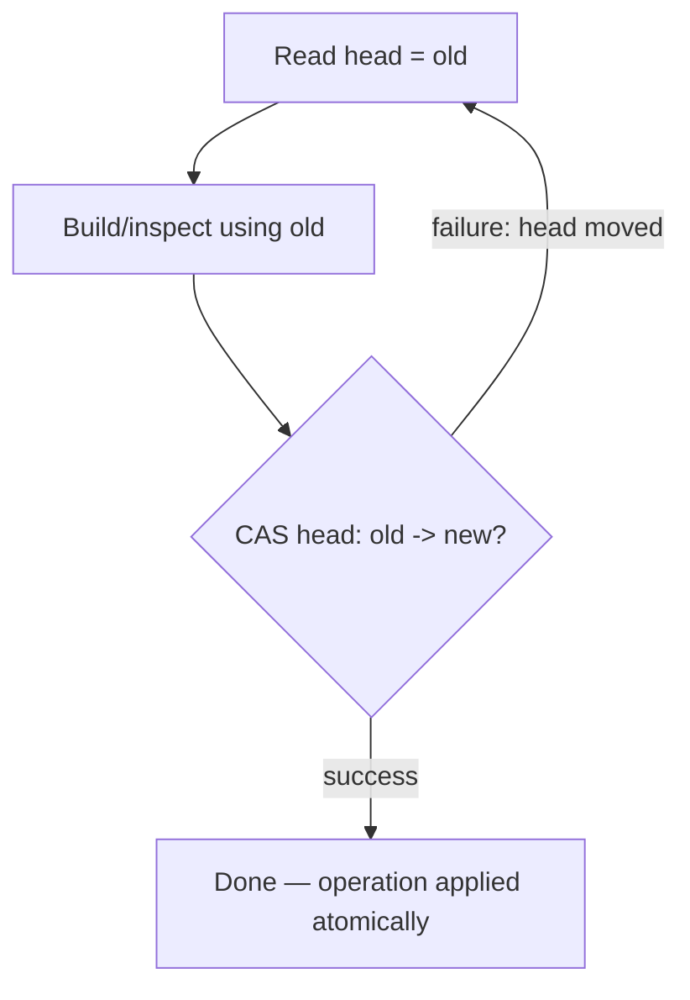
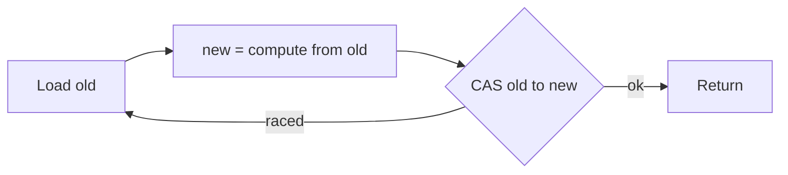

# Treiber Lock-Free Stack — Junior Level

> **Read time: ~35 minutes** · **Audience:** Engineers who know linked lists, basic threads, and want their first real lock-free data structure.

A **Treiber stack** is a concurrent **LIFO stack** (last-in, first-out) that lets many threads `push` and `pop` at the same time **without any lock**. Instead of guarding the stack with a `mutex`, it stores the stack as a **singly linked list** and keeps a single **atomic pointer** to the head node. Every modification is done with one **compare-and-swap (CAS)** instruction: a thread proposes a change and the hardware applies it only if nobody else changed the head in the meantime. If someone did, the thread simply retries.

The algorithm was published by **R. Kent Treiber** in 1986 in the IBM technical report *"Systems Programming: Coping with Parallelism"*. It is the simplest non-trivial lock-free data structure, which is why it is the universal teaching example for **CAS loops**, **lock-freedom**, and the famous **ABA problem**. Almost every concurrency course and every textbook on concurrent data structures (Herlihy & Shavit's *The Art of Multiprocessor Programming*, for one) introduces lock-free programming with exactly this stack.

This document teaches you the Treiber stack **from zero**: what a linked stack is, what an atomic head pointer means, how `push` and `pop` each become a tiny CAS retry loop, and how to read a small worked example step by step. We will mention the ABA problem so you know it exists, but the *deep* treatment of ABA and its fixes is saved for [the middle level](./middle.md). For now, our goal is: **you can write a correct Treiber stack and explain why the CAS loop is correct.**

---

## Table of Contents

1. [Introduction — A Stack Without a Lock](#introduction)
2. [Prerequisites — Linked Lists, Threads, and CAS](#prerequisites)
3. [Glossary](#glossary)
4. [Core Concepts — Atomic Head + CAS Loop](#core-concepts)
5. [Big-O Summary](#big-o-summary)
6. [Real-World Analogies](#analogies)
7. [Pros and Cons vs a Locked Stack](#pros-and-cons)
8. [Step-by-Step Walkthrough](#walkthrough)
9. [Code Examples — Go, Java, Python](#code-examples)
10. [Coding Patterns — The CAS Retry Loop](#patterns)
11. [Error Handling — Empty Pop and Lost Updates](#errors)
12. [Performance Tips](#performance-tips)
13. [Best Practices](#best-practices)
14. [Edge Cases](#edge-cases)
15. [Common Mistakes](#common-mistakes)
16. [Cheat Sheet](#cheat-sheet)
17. [Visual Animation Reference](#animation)
18. [Summary](#summary)
19. [Further Reading](#further-reading)

---

<a name="introduction"></a>
## 1. Introduction — A Stack Without a Lock

You already know a **stack**: a container where the last element you put in is the first one you take out. `push(x)` adds `x` on top; `pop()` removes and returns the top. With a single thread, a stack is trivial — an array with a `size` counter, or a linked list with a `head` pointer.

Now imagine **many threads** sharing one stack. Thread A wants to `push(5)` at the same moment Thread B wants to `push(7)`. If both read the old top, both build their new node pointing at the old top, and both write the head, **one push is silently lost** — the two writes race and the last writer wins. This is a classic data race.

The textbook fix is a **lock**: wrap `push` and `pop` in `mutex.Lock() ... mutex.Unlock()`. Only one thread touches the stack at a time, so no update is lost. This works and is easy to reason about. But it has costs:

- A thread that holds the lock and gets **descheduled** (preempted by the OS) blocks *everyone* until it runs again. This is the root of **priority inversion** and **convoying**.
- Under high contention, threads spend most of their time waiting on the lock rather than doing work.
- A thread that **dies or hangs** while holding the lock can deadlock the whole structure forever.

The **Treiber stack** removes the lock entirely. It keeps the linked-list representation and a single head pointer, but makes the head **atomic** and updates it with **compare-and-swap** instead of a plain write. CAS is a single hardware instruction that says: *"Change `head` from `expected` to `new`, but only if `head` currently equals `expected`. Tell me whether you succeeded."* If two threads race, only one CAS succeeds; the loser sees the failure, re-reads the new head, and tries again. No thread is ever blocked by another thread's scheduling — this property is called **lock-freedom**.

That single idea — *replace the lock with an atomic CAS that retries on conflict* — is the whole Treiber stack. Everything else in this document is detail.

---

<a name="prerequisites"></a>
## 2. Prerequisites — Linked Lists, Threads, and CAS

You need three things before the algorithm makes sense.

**1. A singly linked list.** A node holds a value and a `next` pointer to the node below it. A stack-as-linked-list keeps a `head` pointing at the top node; pushing prepends a new head, popping advances `head` to `head.next`. Pushing and popping at the head are both O(1) and touch only the head — that is exactly why a stack maps so cleanly onto a single atomic pointer.

```text
head ──► [ 9 | next ] ──► [ 4 | next ] ──► [ 1 | nil ]
          top                                 bottom
```

**2. Threads and shared memory.** Multiple threads run concurrently and share the same `head` variable. Without coordination, their reads and writes **interleave** in any order the hardware and scheduler choose. Two threads writing the same variable without synchronization is **undefined behavior** in most memory models.

**3. Compare-and-swap (CAS).** This is the one hardware primitive the whole algorithm rests on. CAS takes three arguments — an address, an expected old value, and a new value — and **atomically**:

```text
CAS(addr, expected, new):
    if *addr == expected:
        *addr = new
        return true       // success
    else:
        return false      // someone changed *addr first; do nothing
```

The crucial word is **atomically**: the compare and the conditional write happen as one indivisible step that no other thread can interrupt. On x86 this compiles to a single `LOCK CMPXCHG` instruction; on ARM it is an `LDREX`/`STREX` pair. CAS is the subject of its own topic — see [15-cas-atomic-primitives](../15-cas-atomic-primitives/junior.md) for the full story. For this document, just trust that `CAS(head, expected, new)` either swaps `head` and returns `true`, or does nothing and returns `false`.

If you have those three concepts, you are ready.

---

<a name="glossary"></a>
## 3. Glossary

| Term | Definition |
|---|---|
| **Stack (LIFO)** | A container where the last element pushed is the first popped. Operations: `push`, `pop`, `peek`, `isEmpty`. |
| **Treiber stack** | A lock-free stack: a singly linked list with an atomic `head` pointer, modified by CAS retry loops. Named after R. Kent Treiber (1986). |
| **Node** | A heap-allocated cell holding a value and a `next` pointer to the node below it. |
| **Head** | The atomic pointer to the top node (or `nil`/`null` when the stack is empty). The only shared mutable field. |
| **Atomic variable** | A variable whose reads, writes, and CAS happen indivisibly with respect to other threads. |
| **Compare-and-swap (CAS)** | `CAS(addr, expected, new)`: atomically set `*addr = new` only if `*addr == expected`; returns success/failure. |
| **CAS loop / retry loop** | The pattern `for { read; build; if CAS(...) break }`. The heart of lock-free updates. |
| **Lock-free** | A progress guarantee: at least one thread always makes progress in a bounded number of steps, even if others stall. No thread can block the whole system by being descheduled. |
| **Contention** | Many threads hammering the same memory location at once, causing CAS failures and retries. |
| **ABA problem** | A subtle bug where the head changes from A to B and back to A, so a CAS sees "still A" and succeeds even though the stack changed underneath it. (Detailed in [middle.md](./middle.md).) |
| **Memory reclamation** | The problem of safely freeing popped nodes when other threads might still hold pointers to them. (Detailed in [senior.md](./senior.md).) |

---

<a name="core-concepts"></a>
## 4. Core Concepts — Atomic Head + CAS Loop

### 4.1 The representation

A Treiber stack is **two things**:

1. A heap of **nodes**, each `{ value, next }`, linked top-to-bottom.
2. One **atomic pointer** `head` that points at the top node, or is `nil` when empty.

That is the entire state. There is no size counter (a shared counter would itself need synchronization and would become a contention bottleneck — we discuss why in [middle.md](./middle.md)). There is no array. Just nodes and an atomic head.

### 4.2 `push` — prepend a new top with CAS

To push value `v`:

```text
push(v):
    new := &Node{value: v}
    loop:
        old := head.Load()        // read current top
        new.next = old            // new node points at current top
        if head.CompareAndSwap(old, new):   // try to swing head to new
            return                // success
        // else: someone pushed/popped first; loop and retry
```

Read the current head, make the new node point at it, then **atomically** swing `head` from `old` to `new`. If the CAS succeeds, your node is the new top and `new.next` correctly links to whatever was on top. If the CAS fails, some other thread changed `head` between your read and your CAS — so you re-read the (now different) head, re-link `new.next`, and try again. You loop until a CAS wins.

### 4.3 `pop` — advance head past the top with CAS

To pop:

```text
pop():
    loop:
        old := head.Load()        // read current top
        if old == nil:
            return nil, false     // stack empty
        next := old.next          // the node below the top
        if head.CompareAndSwap(old, next):   // swing head down by one
            return old.value, true
        // else: head changed; loop and retry
```

Read the top node `old`. If it is `nil`, the stack is empty — return a "no value" signal. Otherwise read `old.next` (the node that will become the new top), then **atomically** swing `head` from `old` to `next`. On success, `old` has been unlinked and we return its value. On failure, retry.

### 4.4 Why the CAS loop is correct

The invariant is simple: **`head` always points at a valid top node (or is `nil`), and the linked chain below it is a valid LIFO stack.** Each successful CAS transforms one valid stack into another valid stack in a single atomic step. A *failed* CAS changes nothing — the thread just observed that the world moved and tries again from the current truth. Because the head update is atomic, **no update is ever lost**: two concurrent pushes both eventually succeed (one before the other), and the loser's retry links correctly onto the winner's node.



The one place this simple picture cracks is **`pop` under a particular reuse pattern** — the ABA problem — and that is the headline topic of the next level. For now, internalize the loop.

---

<a name="big-o-summary"></a>
## 5. Big-O Summary

| Operation | Best | Typical | Worst | Notes |
|---|---|---|---|---|
| `push` | O(1) | O(1) | O(1) **amortized**, unbounded retries | One CAS if uncontended; each retry is O(1) work but contention can force many retries |
| `pop` | O(1) | O(1) | O(1) **amortized**, unbounded retries | Same — uncontended is one CAS |
| `peek` | O(1) | O(1) | O(1) | Single atomic load of head; no CAS |
| `isEmpty` | O(1) | O(1) | O(1) | `head == nil` via atomic load |
| Space | — | O(n) | O(n) | One node per element, plus an atomic head |

> **Subtle point:** there is no *worst-case bound* on the number of retries for a single operation — a very unlucky thread could fail its CAS arbitrarily many times while other threads keep succeeding. That is why the Treiber stack is **lock-free** (the *system* always makes progress) but **not wait-free** (an *individual* operation has no step bound). We make this distinction precise in [professional.md](./professional.md).

---

<a name="analogies"></a>
## 6. Real-World Analogies

| Concept | Analogy | Where it breaks |
|---|---|---|
| **Atomic head + CAS** | A shared whiteboard with one "current top" sticky note. To change it you must check the note still says what you last read, then swap it in one motion. If it changed, you re-read and try again. | Real CAS is a single instruction; the whiteboard "check then swap" is only atomic by social agreement. |
| **CAS retry loop** | Editing a shared online document with optimistic locking: you save, the server says "someone edited since you loaded," you reload and re-apply your change. | Document merges can be complex; a stack push is a single-pointer swing. |
| **Lock-freedom** | A revolving door (lock-free) vs. a single-occupancy door with a key (locked). The revolving door never stops moving even if one person is slow; the keyed door stops everyone if the key-holder freezes. | A revolving door still has a max throughput; CAS contention similarly caps real throughput. |
| **ABA problem** | You glance at a parking spot, look away, and look back — same car? No, it left and an *identical-looking* car parked there. "Looks the same" is not "is unchanged." | Cars are not literally reused memory; ABA is about a freed node being recycled to the same address. |

---

<a name="pros-and-cons"></a>
## 7. Pros and Cons vs a Locked Stack

| Pros of Treiber (lock-free) | Cons of Treiber (lock-free) |
|---|---|
| No lock — a stalled thread never blocks others (lock-freedom) | The ABA problem must be handled (tagged pointers / hazard pointers / GC) |
| No deadlock, no priority inversion, no lock convoying | Memory reclamation of popped nodes is genuinely hard without a GC |
| Excellent under *moderate* contention and on many cores | Under *very high* contention, CAS retries waste cycles (cache-line ping-pong) |
| Simple to implement (≈15 lines) and to reason about per-operation | Harder to extend (size, iteration, bulk ops) than a locked stack |

| Pros of a locked stack | Cons of a locked stack |
|---|---|
| Dead simple; correct by construction with one mutex | A stalled lock-holder blocks everyone (no progress guarantee) |
| Easy to add size counters, iteration, multi-op transactions | Deadlock and priority inversion are possible |
| No ABA, no reclamation puzzle (mutate in place under the lock) | Poor scalability — the lock serializes all access |

**When to use a Treiber stack:** a shared LIFO under concurrent access where you want progress even if threads are preempted — object pools, free lists, work buffers — *and* you have a GC or a reclamation scheme to handle freed nodes.

**When NOT to use it:** single-threaded code (use a plain slice/array); when you need a size count or iteration as first-class operations; when contention is so extreme that an **elimination-backoff** variant (see [senior.md](./senior.md)) or a different structure scales better.

---

<a name="walkthrough"></a>
## 8. Step-by-Step Walkthrough

Let us trace two threads on a small stack. Start state: stack holds `[1]` (bottom) with `head ──► A(value=1) ──► nil`.

**Scenario:** Thread T1 does `push(2)`; Thread T2 does `push(3)`. They run concurrently.

```text
Initial:  head ──► A(1) ──► nil

T1: new node X(2);  read old = A;  X.next = A
T2: new node Y(3);  read old = A;  Y.next = A      (both read the SAME old head A)

T1: CAS(head, A, X)  → SUCCESS    head ──► X(2) ──► A(1) ──► nil
T2: CAS(head, A, Y)  → FAILS      (head is now X, not A)

T2 retries:  read old = X;  Y.next = X
T2: CAS(head, X, Y)  → SUCCESS    head ──► Y(3) ──► X(2) ──► A(1) ──► nil
```

Both pushes land. T2's first CAS failed because T1 won the race; on retry T2 re-read the head (now `X`) and re-linked `Y.next = X`, so `Y` correctly sits on top of `X`. **No update was lost** — that is the whole point of the CAS loop versus a plain write.

Now `pop()` from `head ──► Y(3) ──► X(2) ──► A(1) ──► nil`:

```text
read old = Y;  next = X;  CAS(head, Y, X) → SUCCESS
return 3;      head ──► X(2) ──► A(1) ──► nil
```

The top value `3` is returned, and `head` now points at `X(2)`. Clean.

> **A teaser for the next level.** Suppose between `read old = Y` and `CAS(head, Y, X)`, another thread popped `Y`, popped `X`, freed both, then pushed a *recycled* node that happens to be at the same address as `Y` back on top. Your CAS would see "head still equals Y" and **succeed wrongly**, corrupting the stack. That is the **ABA problem**. We fix it in [middle.md](./middle.md).

---

<a name="code-examples"></a>
## 9. Code Examples — Go, Java, Python

### Example 1: A complete Treiber stack

#### Go

Go's `sync/atomic.Pointer[T]` gives a typed atomic pointer with `Load`, `Store`, and `CompareAndSwap`. The garbage collector handles freeing popped nodes, so (for now) we ignore reclamation.

```go
package main

import (
	"fmt"
	"sync"
	"sync/atomic"
)

// node is one stack cell.
type node[T any] struct {
	value T
	next  *node[T]
}

// TreiberStack is a lock-free LIFO stack.
type TreiberStack[T any] struct {
	head atomic.Pointer[node[T]] // atomic top-of-stack pointer
}

// Push adds v on top. Lock-free: one CAS on the happy path.
func (s *TreiberStack[T]) Push(v T) {
	n := &node[T]{value: v}
	for {
		old := s.head.Load() // read current top
		n.next = old         // link new node above it
		if s.head.CompareAndSwap(old, n) {
			return // swung head old -> n atomically
		}
		// CAS failed: head moved; retry with the new head
	}
}

// Pop removes and returns the top. ok=false if empty.
func (s *TreiberStack[T]) Pop() (v T, ok bool) {
	for {
		old := s.head.Load()
		if old == nil {
			return v, false // empty
		}
		next := old.next
		if s.head.CompareAndSwap(old, next) {
			return old.value, true // unlinked old atomically
		}
	}
}

func main() {
	s := &TreiberStack[int]{}
	var wg sync.WaitGroup
	for i := 1; i <= 4; i++ {
		wg.Add(1)
		go func(x int) { defer wg.Done(); s.Push(x) }(i)
	}
	wg.Wait()

	for {
		v, ok := s.Pop()
		if !ok {
			break
		}
		fmt.Println("popped", v)
	}
}
```

**Run:** `go run main.go` (note: pop order is nondeterministic because the four pushes race).

#### Java

Java uses `java.util.concurrent.atomic.AtomicReference<T>` with `compareAndSet(expected, new)`. The JVM's garbage collector handles node reclamation.

```java
import java.util.concurrent.atomic.AtomicReference;

public class TreiberStack<T> {

    // One stack cell.
    private static final class Node<T> {
        final T value;
        Node<T> next;
        Node(T value) { this.value = value; }
    }

    // Atomic top-of-stack pointer (null when empty).
    private final AtomicReference<Node<T>> head = new AtomicReference<>(null);

    // Push v on top. Lock-free CAS loop.
    public void push(T v) {
        Node<T> n = new Node<>(v);
        Node<T> old;
        do {
            old = head.get();   // read current top
            n.next = old;       // link above it
        } while (!head.compareAndSet(old, n)); // retry until we win
    }

    // Pop the top; returns null when empty.
    public T pop() {
        Node<T> old, next;
        do {
            old = head.get();
            if (old == null) return null; // empty
            next = old.next;
        } while (!head.compareAndSet(old, next));
        return old.value;
    }

    public static void main(String[] args) throws InterruptedException {
        TreiberStack<Integer> s = new TreiberStack<>();
        Thread[] ts = new Thread[4];
        for (int i = 0; i < 4; i++) {
            final int x = i + 1;
            ts[i] = new Thread(() -> s.push(x));
            ts[i].start();
        }
        for (Thread t : ts) t.join();

        Integer v;
        while ((v = s.pop()) != null) System.out.println("popped " + v);
    }
}
```

**Run:** `javac TreiberStack.java && java TreiberStack`

#### Python

Python's **Global Interpreter Lock (GIL)** means CPython bytecode does not run truly in parallel, so a "lock-free" stack in CPython gives you no parallelism benefit — and Python has no portable hardware CAS exposed. The version below is **conceptual / educational**: it simulates a CAS with a lock so you can see the *shape* of the algorithm. In real Python, you would simply use a `threading.Lock`-guarded list, or `collections.deque`, or a `queue.LifoQueue`.

```python
import threading


class _Node:
    __slots__ = ("value", "next")

    def __init__(self, value):
        self.value = value
        self.next = None


class TreiberStack:
    """Conceptual Treiber stack.

    NOTE: CPython's GIL serializes bytecode, and Python exposes no hardware
    CAS. We *simulate* CAS with a lock purely to illustrate the algorithm's
    shape. In production Python, use queue.LifoQueue or a lock + list.
    """

    def __init__(self):
        self._head = None
        self._cas_lock = threading.Lock()  # simulates atomic CAS

    def _cas_head(self, expected, new):
        with self._cas_lock:               # pretend this is one CPU instruction
            if self._head is expected:
                self._head = new
                return True
            return False

    def push(self, value):
        n = _Node(value)
        while True:
            old = self._head        # read current top
            n.next = old            # link above it
            if self._cas_head(old, n):
                return              # won the CAS

    def pop(self):
        while True:
            old = self._head
            if old is None:
                return None         # empty
            nxt = old.next
            if self._cas_head(old, nxt):
                return old.value


if __name__ == "__main__":
    s = TreiberStack()
    threads = [threading.Thread(target=s.push, args=(i,)) for i in range(1, 5)]
    for t in threads:
        t.start()
    for t in threads:
        t.join()
    v = s.pop()
    while v is not None:
        print("popped", v)
        v = s.pop()
```

**Run:** `python treiber.py`

---

<a name="patterns"></a>
## 10. Coding Patterns — The CAS Retry Loop

Every lock-free update you will ever write has the same skeleton. Memorize it.

**Intent:** Apply a change to shared state atomically; retry if someone raced you.

```text
loop:
    old   := atomic.Load(shared)     // 1. snapshot the current state
    new   := compute(old)            // 2. build the desired next state from old
    if atomic.CAS(shared, old, new): // 3. publish only if nothing changed
        break                        // 4. success — done
    // 5. failure: state moved, loop and recompute from fresh old
```

For `push`, step 2 is "make a node whose `next` is `old`." For `pop`, step 2 is "the new head is `old.next`." Notice three rules:

1. **Always recompute `new` from the freshly re-read `old` inside the loop.** If you compute `new` once and retry without re-reading `old`, you reintroduce the lost-update bug.
2. **Do the minimum between read and CAS.** The smaller the window, the fewer retries.
3. **Never write the shared variable with a plain store** — only via CAS. A single stray plain write breaks the whole protocol.



---

<a name="errors"></a>
## 11. Error Handling — Empty Pop and Lost Updates

| Situation | What goes wrong | Correct approach |
|---|---|---|
| `pop` on empty stack | Dereferencing `nil`/`null` top crashes | Check `old == nil` *inside* the loop and return a "no value" signal (`ok=false` / `null` / `None`) |
| Plain write to head | Two writers lose an update | Use only `CompareAndSwap`; never `head.Store(...)` for push/pop |
| Computing `new` once, retrying blind | Re-link points at stale node | Re-read `old` and recompute `new` every iteration |
| Reading `old.next` *after* CAS | Use-after-unlink / data race | Read `old.next` into a local *before* the CAS |
| Returning the node, not the value | Caller can mutate/free shared node | Return `old.value` (a copy), keep the node private |

> The ABA problem and node-reuse corruption are *not* in this table — they are not simple "handle the error" cases. They require a structural fix and are covered in [middle.md](./middle.md) (tagged pointers) and [senior.md](./senior.md) (hazard pointers, epochs).

---

<a name="performance-tips"></a>
## 12. Performance Tips

- **Allocate the node before the loop, not inside it** (for push). Allocation is the expensive part; do it once and only re-link `next` on retry.
- **Minimize the read-to-CAS window.** Every instruction between the load and the CAS widens the race window and raises retry rates.
- **Expect cache-line contention.** When many cores CAS the same head, the cache line bounces between cores ("ping-pong"). This caps throughput regardless of algorithmic cleverness; see the elimination-backoff fix in [senior.md](./senior.md).
- **Avoid a shared size counter.** A naive `atomic size++` on every op becomes a *second* contended location, often a worse bottleneck than the head itself.
- **Back off on failure under heavy contention.** A short randomized pause after a failed CAS can *increase* total throughput by reducing collisions (covered at the middle/senior level).

---

<a name="best-practices"></a>
## 13. Best Practices

- Implement and test the single-threaded behavior first (push/pop ordering), then add concurrency.
- Use the language's typed atomic pointer (`atomic.Pointer[T]` in Go, `AtomicReference<T>` in Java). Do not roll your own with `unsafe` unless you must.
- Lean on the **garbage collector** for reclamation in Go and Java at the junior level; defer manual reclamation (hazard pointers/epochs) until you genuinely need a GC-free environment.
- Keep nodes **immutable after publication** except for the `next` field you control before CAS.
- Write a stress test: N threads each doing M random push/pop, then assert the multiset of pushed values equals the multiset of popped values.

---

<a name="edge-cases"></a>
## 14. Edge Cases

- **Empty stack pop:** must return a "no value" signal, never crash.
- **Single element:** `pop` swings `head` from the one node to `nil`; `push` onto empty swings `nil` to the new node — both are ordinary CAS cases.
- **All threads pushing, none popping:** head only grows; every CAS that fails simply re-links higher.
- **Interleaved push/pop on the same node:** the classic ABA trigger — safe under a GC that won't recycle a node still referenced, dangerous with manual `free`.
- **Very high contention:** correct but slow; retries dominate. Consider elimination-backoff.

---

<a name="common-mistakes"></a>
## 15. Common Mistakes

- **Plain-writing the head** instead of CAS — silently loses concurrent updates.
- **Not re-reading `old` on retry** — re-links the new node to a stale predecessor.
- **Reading `old.next` after the CAS** — by then `old` may be unlinked or freed.
- **Adding an atomic size counter naively** — creates a second contention hotspot.
- **Freeing popped nodes immediately in a non-GC language** — opens use-after-free and ABA. (Junior rule: rely on GC; learn reclamation later.)
- **Assuming lock-free means fast** — it means *progress-guaranteed*; under heavy contention it can be slower than a good lock.

---

<a name="cheat-sheet"></a>
## 16. Cheat Sheet

| Operation | Time | Space | One-line recipe |
|---|---|---|---|
| `push(v)` | O(1) amortized | O(1) | `n.next = head; CAS(head, old, n); retry` |
| `pop()` | O(1) amortized | O(1) | `next = head.next; CAS(head, old, next); retry` |
| `peek()` | O(1) | O(1) | `head.Load()` (single atomic load) |
| `isEmpty()` | O(1) | O(1) | `head.Load() == nil` |

**CAS loop skeleton:** `for { old := load(); new := f(old); if cas(old,new) { break } }`

**Progress class:** lock-free (not wait-free). **Order:** LIFO. **Hazard:** ABA on `pop`.

---

<a name="animation"></a>
## 17. Visual Animation Reference

> See [`animation.html`](./animation.html) for an interactive visualization.
>
> The animation demonstrates:
> - The linked stack with an atomic `head` pointer rendered as nodes.
> - Two threads pushing and popping via CAS, with success/retry highlighted.
> - A stepped **ABA scenario** showing how a recycled node fools a `pop` CAS.
> - A **CAS-failure retry** play-through so you see the loop re-read and re-link.
> - A live operation log, info panel, and a Big-O table.

---

<a name="summary"></a>
## 18. Summary

A **Treiber stack** is a lock-free LIFO: a singly linked list plus one **atomic head** pointer. `push` and `pop` are each a tiny **CAS retry loop** — read the head, build the next state from it, and swing the head with compare-and-swap, retrying if another thread raced you. This gives **lock-freedom**: no stalled thread can block the rest. The price is the **ABA problem** on `pop` and the **memory reclamation** puzzle, both of which we deliberately deferred. At this level, you can write a correct Treiber stack in Go or Java (leaning on the GC), explain why the CAS loop never loses an update, and read a worked two-thread trace.

**Next step:** [middle.md](./middle.md) — the ABA problem walked through end to end, the **tagged-pointer (versioned) fix**, Treiber vs. a lock-based stack, and how contention shapes performance.
