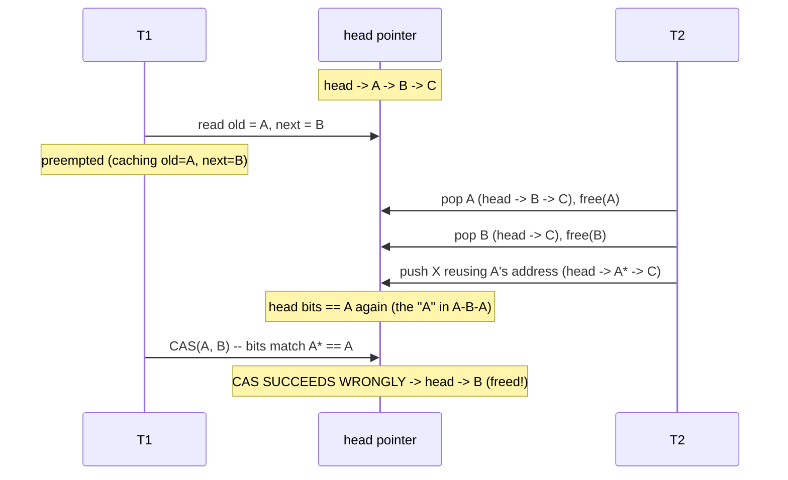
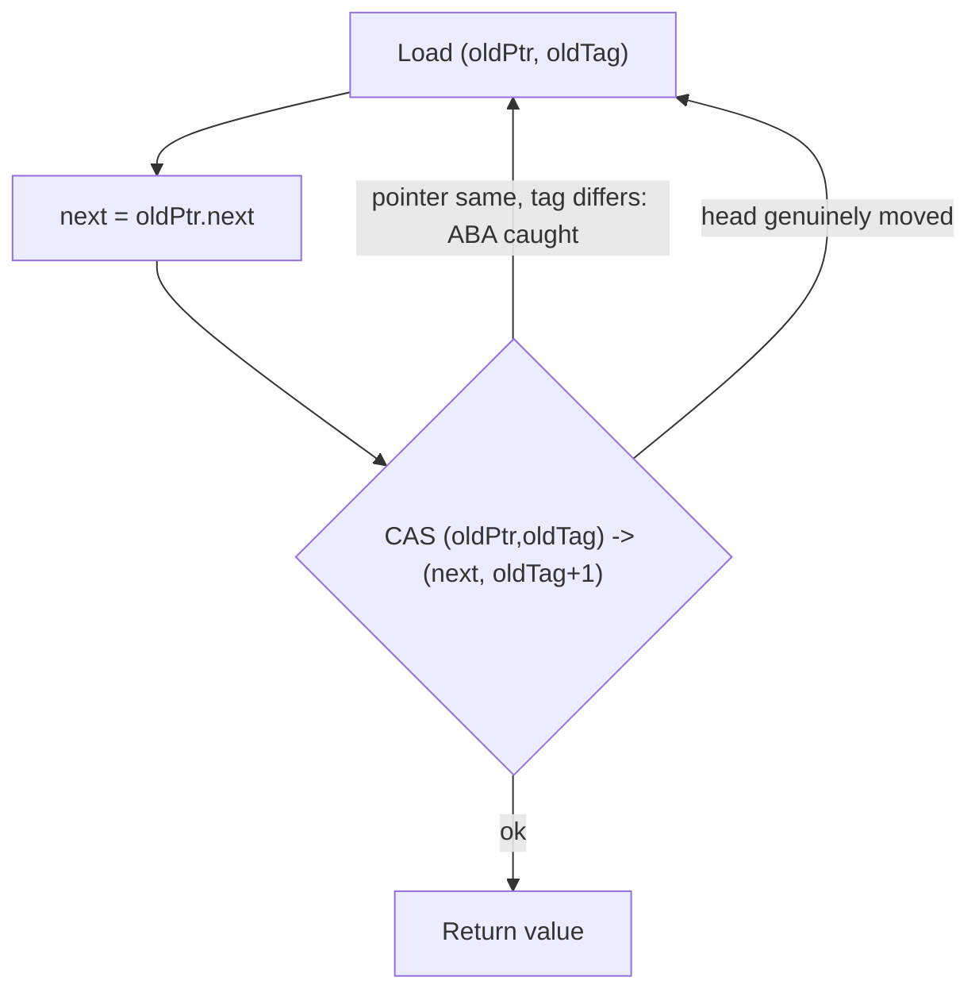

# Treiber Lock-Free Stack — Middle Level

> **Read time: ~45 minutes** · **Audience:** Engineers comfortable with the basic Treiber CAS loop who now want to understand *why it breaks* (ABA), *how to fix it* (tagged pointers), and *when* lock-free actually wins over a lock.

At the [junior level](./junior.md) you learned the mechanics: a singly linked list, an atomic `head`, and a CAS retry loop for `push` and `pop`. That is correct **as long as nodes are never freed and reused** — which is true under a tracing garbage collector that will not recycle a node while a pointer to it still exists. The middle level confronts the dragon that lives in every manual-memory lock-free stack: the **ABA problem**. We will walk it through interleaving by interleaving, then fix it with the classic **tagged (versioned) pointer**, then step back to the practical question every engineer actually faces: *should I use a lock-free stack at all, and when does it beat a mutex?*

---

## Table of Contents

1. [Introduction — Where the Simple Loop Cracks](#introduction)
2. [The ABA Problem — A Full Interleaving](#aba)
3. [Why GC Hides ABA (and Manual Memory Exposes It)](#gc)
4. [The Tagged-Pointer Fix — Versioned CAS](#tagged)
5. [Comparison — Treiber vs Lock-Based vs MS-Queue](#comparison)
6. [Contention, Backoff, and the Cost Model](#contention)
7. [Code Examples — Tagged Pointer in Go, Java, Python](#code-examples)
8. [Error Handling](#error-handling)
9. [Performance Analysis](#performance-analysis)
10. [Best Practices](#best-practices)
11. [Visual Animation](#visual-animation)
12. [Summary](#summary)

---

<a name="introduction"></a>
## 1. Introduction — Where the Simple Loop Cracks

Recall `pop`:

```text
pop():
    loop:
        old  := head.Load()
        if old == nil { return nil, false }
        next := old.next            // (*) read the node below the top
        if head.CAS(old, next):     // swing head from old to next
            return old.value, true
```

The correctness of this loop rests on a hidden assumption at line `(*)`: **"the `old` I read is the same `old` that exists when my CAS runs."** The CAS only checks that `head` *still equals the pointer value* `old`. It does **not** check that `old` still points at the *same logical node* with the *same `next`*. Pointer equality is being used as a proxy for "nothing changed" — and that proxy is a lie the moment a node's memory can be **freed and reallocated to the same address**.

Concretely: between your read of `old` and your CAS, another thread could pop `old`, free it, and then a third push could allocate a brand-new node that the allocator happens to place at `old`'s former address. Now `head` once again holds the bit pattern `old` — but it points at a *different stack* with a *different `next`*. Your CAS sees "head == old" and **succeeds**, installing the **stale `next` you cached at line (*)**, which may no longer be in the stack at all. The stack is now corrupted: you may have resurrected freed nodes, leaked live ones, or created a cycle.

This is the **ABA problem**, named for the pattern *head goes A → B → A*. The next section walks it through completely.

---

<a name="aba"></a>
## 2. The ABA Problem — A Full Interleaving

Start with three nodes on the stack. Labels are *node identities*; assume the value equals the label number for clarity.

```text
head ──► A ──► B ──► C ──► nil
```

Two threads run. **T1** wants to `pop` (expecting to return A and leave `head ──► B`). **T2** does a burst of operations. Watch the interleaving:

```text
T1: old  = head           // old = A
T1: next = old.next        // next = B   (cached!)
        --- T1 is preempted here, holding old=A, next=B ---

T2: pop() -> returns A;    head ──► B ──► C ──► nil ;   free(A)
T2: pop() -> returns B;    head ──► C ──► nil ;         free(B)
T2: push(X) -> allocator REUSES A's address for the new node!
        new node "A*" lives at A's old address, A*.value = X, A*.next = C
        head ──► A* ──► C ──► nil
        (head's bit pattern now equals the pointer T1 still calls "A")

        --- T1 resumes ---
T1: head.CAS(old=A, next=B)
        head currently == A* whose bits == A's bits == old  →  CAS SUCCEEDS (!)
        head is set to B    →    head ──► B ──► ??? 
```

Disaster. T1's CAS succeeded because the *address* matched, but it installed `B` as the head — and `B` was **freed** by T2. Depending on the allocator, `head` now points into reclaimed memory, or at a node that has been reused for something else, or at a node that re-links back into the live stack forming a cycle. Possible outcomes:

- **Use-after-free:** `B` was freed; reading it is undefined behavior.
- **Lost node:** `X` (the pushed value at `A*`) silently vanishes from the stack.
- **Resurrected node:** a freed node reappears as live, to be double-freed later.



The essential lesson: **CAS compares bits, not history.** ABA is *any* situation where a value returns to a previously-observed bit pattern while its meaning changed underneath. The Treiber `pop` is the canonical example because (a) it caches `old.next` across the CAS window, and (b) nodes are the kind of object allocators love to recycle.

---

<a name="gc"></a>
## 3. Why GC Hides ABA (and Manual Memory Exposes It)

Here is the subtlety that confuses many engineers: **the junior-level Go and Java code is actually correct, even though it looks identical to the broken C version.** Why?

A tracing **garbage collector** will not reclaim node `A` while **any** thread still holds a reference to it — and T1 *does* hold `old = A`. So in Go/Java, `A`'s memory **cannot** be reused while T1 is mid-operation. The address that T2's `push(X)` gets back from the allocator is therefore **guaranteed to differ** from `A` (since `A` is still pinned by T1's local). When T1's CAS runs, `head` may equal a *fresh* pointer, but it can never equal `A` *unless `A` is genuinely still the top*. GC turns the "same bits implies unchanged" assumption back into truth, because it prevents the address from being recycled while observed.

In **manual-memory** languages (C, C++, Rust-without-a-scheme, or any environment using a custom allocator / free list), nothing pins `A`. The instant T2 frees `A`, its address is fair game, and ABA is live. This is why:

- **Treiber on a GC runtime:** the junior code is correct; ABA does not occur.
- **Treiber with manual reclamation:** you **must** add an ABA defense *and* a safe reclamation scheme. The two problems are intertwined — you cannot free a node safely without knowing no thread holds it, which is exactly what hazard pointers and epochs solve (see [senior.md](./senior.md)).

| Environment | Node reuse possible mid-op? | ABA possible? | What you need |
|---|---|---|---|
| Go / Java / C# (tracing GC) | No (live ref pins node) | No | Nothing extra; junior code is correct |
| C / C++ with immediate `free` | Yes | **Yes** | Tagged pointer **and/or** hazard pointers/epochs |
| Custom free-list / object pool (any language) | Yes | **Yes** | Tagged pointer **and/or** hazard pointers/epochs |

> Even on a GC, a **tagged-pointer** version is still worth understanding, because (a) you will write lock-free code in non-GC environments, and (b) some pools recycle nodes *deliberately* (to avoid GC pressure), re-introducing ABA on top of a GC.

---

<a name="tagged"></a>
## 4. The Tagged-Pointer Fix — Versioned CAS

The cleanest classical fix: **attach a monotonically increasing version counter (a "tag" or "stamp") to the head**, and CAS the *pair* `(pointer, tag)` atomically. Every successful update **increments the tag**. Now even if the pointer returns to a previous value A, the tag has advanced, so the pair `(A, 7)` is not equal to the earlier `(A, 5)` — the CAS fails and the thread safely retries.

```text
head is now an atomic PAIR: (ptr, tag)

pop():
    loop:
        (oldPtr, oldTag) := head.Load()
        if oldPtr == nil { return nil, false }
        next := oldPtr.next
        if head.CAS( (oldPtr, oldTag), (next, oldTag+1) ):
            return oldPtr.value, true
```

The ABA interleaving from §2 now plays out safely:

```text
T1 reads (A, 5).  next = B.   --- preempted ---
T2 pops A   -> head=(B, 6)
T2 pops B   -> head=(C, 7)
T2 push X reuses A's address -> head=(A, 8)
T1 resumes: CAS( (A,5), (B,6) )  vs current (A,8)
        pointer matches (A==A) BUT tag 5 != 8  →  CAS FAILS  ✔
T1 retries with the fresh head (A, 8) — correct.
```

The tag is what restores the "history" that raw pointer bits threw away. To make the pair CAS a single atomic instruction you need **double-width CAS**:

- **x86-64:** `CMPXCHG16B` compares-and-swaps 16 bytes (128 bits = 64-bit pointer + 64-bit tag). This is the textbook "DWCAS".
- **Pointer packing:** on a 64-bit machine, virtual addresses use only ~48 bits, so you can steal the top 16 bits of the pointer for the tag and use a plain 64-bit CAS. Cheaper, but the tag space is small (wraps every 2¹⁶ ops) and architecture-dependent.

> **Tag wraparound** is the one residual flaw: with a 16-bit tag, after 65 536 updates the tag returns to a prior value, re-opening a (vanishingly unlikely but real) ABA window. A 64-bit tag via DWCAS makes wraparound astronomically improbable (you would need 2⁶⁴ updates between a single thread's read and its CAS). This is why tagged pointers are a *practical* fix, not a *provably perfect* one — the rigorous alternatives (hazard pointers, epochs) live in [senior.md](./senior.md).



---

<a name="comparison"></a>
## 5. Comparison — Treiber vs Lock-Based vs MS-Queue

| Attribute | Treiber stack (lock-free) | Lock-based stack (mutex) | Michael–Scott queue ([16](../16-lock-free-queue-michael-scott/middle.md)) |
|---|---|---|---|
| Order | LIFO | LIFO | **FIFO** |
| Progress guarantee | Lock-free | Blocking (no guarantee) | Lock-free |
| Pointers maintained | 1 (`head`) | 1 (`head`) | 2 (`head` + `tail`) |
| CAS per op (uncontended) | 1 | 0 (one lock/unlock) | 1–2 (tail swing + head advance) |
| ABA exposure | `pop` only | None (mutate under lock) | Both ends; needs tags/hazard ptrs |
| Contention behavior | Single hotspot (head) — degrades | Serializes; lock convoy | Two hotspots; slightly better spread |
| Reclamation difficulty | Hard (manual) / free (GC) | Trivial | Hard (manual) / free (GC) |
| Code size | ~15 lines | ~10 lines | ~40 lines |
| Best for | Pools, free lists, work buffers | Low contention, simplicity | Producer/consumer FIFO pipelines |

**Choose the Treiber stack when:** you need a concurrent LIFO with progress guarantees under preemption, contention is low-to-moderate, and you have GC or a reclamation scheme. Object pools and free lists are the sweet spot.

**Choose a lock-based stack when:** contention is genuinely low, you need extra operations (size, iteration, multi-op atomicity), or correctness-by-simplicity matters more than the last few percent of throughput.

**Reach for the MS-queue instead when:** you need **FIFO** ordering (producer/consumer), not LIFO. A stack is the wrong structure for fair queuing.

---

<a name="contention"></a>
## 6. Contention, Backoff, and the Cost Model

Lock-free does **not** mean fast. The Treiber stack has a single contended location — `head` — and that creates a hard ceiling.

**The cache-line ping-pong problem.** `head` lives on one cache line. When core 1 successfully CASes it, the line is in core 1's L1 in *modified* state. For core 2 to CAS, the coherence protocol (MESI) must invalidate core 1's copy and ship the line to core 2 — tens to hundreds of cycles. With *k* cores all hammering `head`, the line bounces between them and **throughput can fall as you add cores** (negative scaling). The CAS itself is cheap; *moving the cache line* is the cost.

**Retry storms.** Under high contention, most CAS attempts fail. A failing thread immediately retries, issuing another CAS, causing more invalidations, causing more failures — a positive feedback loop that wastes energy and bandwidth.

**Exponential backoff** tames this. After a failed CAS, wait a small randomized interval; double the bound on each successive failure (capped). This thins out collisions so the *next* attempt is likelier to land:

```text
backoff := 1
loop:
    old := head.Load()
    new := compute(old)
    if head.CAS(old, new) { break }
    pauseRandom(0 .. backoff)        // spin-wait or yield
    backoff = min(backoff*2, cap)
```

Backoff trades a little latency on each failed op for much higher aggregate throughput under load. It is the gateway to the **elimination-backoff stack** (a `push` and a `pop` waiting in backoff can *cancel each other out* without ever touching `head`), which we develop fully in [senior.md](./senior.md).

| Contention level | Treiber raw | Treiber + backoff | Mutex stack |
|---|---|---|---|
| Single thread | Best (1 CAS, no line bouncing) | Same | Slightly slower (lock overhead) |
| Low (2–4 threads) | Very good | Good (backoff rarely triggers) | OK |
| High (many cores) | **Poor** (ping-pong, retry storm) | Better | Poor (convoy) — but predictable |
| Very high | Poor | Backoff helps; elimination helps more | Poor |

---

<a name="code-examples"></a>
## 7. Code Examples — Tagged Pointer in Go, Java, Python

### Example: Tagged / versioned stack that defeats ABA

#### Go

Go does not expose DWCAS in `sync/atomic`, and it does not need ABA protection on the GC runtime (see §3). To *demonstrate* the tagged technique portably, we store the `(pointer, tag)` pair behind one atomic pointer to an immutable snapshot struct, and CAS the snapshot pointer. This both models the versioned CAS and stays safe under the GC.

```go
package main

import (
	"fmt"
	"sync/atomic"
)

type node struct {
	value int
	next  *node
}

// snapshot bundles the head pointer with a version tag.
// We CAS the *snapshot pointer*, so each update is a fresh immutable pair.
type snapshot struct {
	head *node
	tag  uint64
}

type TaggedStack struct {
	state atomic.Pointer[snapshot] // never nil after init
}

func NewTaggedStack() *TaggedStack {
	s := &TaggedStack{}
	s.state.Store(&snapshot{head: nil, tag: 0})
	return s
}

func (s *TaggedStack) Push(v int) {
	n := &node{value: v}
	for {
		cur := s.state.Load()
		n.next = cur.head
		next := &snapshot{head: n, tag: cur.tag + 1} // tag++ on every update
		if s.state.CompareAndSwap(cur, next) {
			return
		}
	}
}

func (s *TaggedStack) Pop() (int, bool) {
	for {
		cur := s.state.Load()
		if cur.head == nil {
			return 0, false
		}
		next := &snapshot{head: cur.head.next, tag: cur.tag + 1}
		if s.state.CompareAndSwap(cur, next) {
			return cur.head.value, true
		}
	}
}

func main() {
	s := NewTaggedStack()
	s.Push(1)
	s.Push(2)
	v, _ := s.Pop()
	fmt.Println("popped", v) // 2
}
```

**Run:** `go run main.go`

#### Java

Java provides `AtomicStampedReference<T>` precisely for tagged pointers: it pairs a reference with an `int` stamp and offers `compareAndSet(expectedRef, newRef, expectedStamp, newStamp)`.

```java
import java.util.concurrent.atomic.AtomicStampedReference;

public class TaggedStack<T> {

    private static final class Node<T> {
        final T value;
        Node<T> next;
        Node(T v) { value = v; }
    }

    // reference = head node, stamp = version tag (defeats ABA).
    private final AtomicStampedReference<Node<T>> head =
            new AtomicStampedReference<>(null, 0);

    public void push(T v) {
        Node<T> n = new Node<>(v);
        int[] stampHolder = new int[1];
        while (true) {
            Node<T> old = head.get(stampHolder); // read ref + stamp
            int stamp = stampHolder[0];
            n.next = old;
            // swing ref old->n and bump stamp atomically
            if (head.compareAndSet(old, n, stamp, stamp + 1)) return;
        }
    }

    public T pop() {
        int[] stampHolder = new int[1];
        while (true) {
            Node<T> old = head.get(stampHolder);
            int stamp = stampHolder[0];
            if (old == null) return null;
            Node<T> next = old.next;
            if (head.compareAndSet(old, next, stamp, stamp + 1)) {
                return old.value;
            }
        }
    }

    public static void main(String[] args) {
        TaggedStack<Integer> s = new TaggedStack<>();
        s.push(1);
        s.push(2);
        System.out.println("popped " + s.pop()); // 2
    }
}
```

**Run:** `javac TaggedStack.java && java TaggedStack`

#### Python

Python's GIL plus the absence of hardware CAS means ABA cannot actually arise the way it does in C — but we model the tagged pair so the *concept* is concrete. Again, this is **educational**; real Python should use `queue.LifoQueue`.

```python
import threading


class _Node:
    __slots__ = ("value", "next")

    def __init__(self, value):
        self.value = value
        self.next = None


class TaggedStack:
    """Conceptual tagged (versioned) Treiber stack.

    GIL + no hardware CAS means Python has no real ABA exposure; we keep a
    (head, tag) pair and a simulated double-CAS only to illustrate the fix.
    Production Python: use queue.LifoQueue.
    """

    def __init__(self):
        self._head = None
        self._tag = 0
        self._lock = threading.Lock()  # simulates atomic pair-CAS

    def _cas_pair(self, exp_head, exp_tag, new_head):
        with self._lock:
            if self._head is exp_head and self._tag == exp_tag:
                self._head = new_head
                self._tag = exp_tag + 1   # bump version -> defeats ABA
                return True
            return False

    def push(self, value):
        n = _Node(value)
        while True:
            cur_head, cur_tag = self._head, self._tag
            n.next = cur_head
            if self._cas_pair(cur_head, cur_tag, n):
                return

    def pop(self):
        while True:
            cur_head, cur_tag = self._head, self._tag
            if cur_head is None:
                return None
            if self._cas_pair(cur_head, cur_tag, cur_head.next):
                return cur_head.value


if __name__ == "__main__":
    s = TaggedStack()
    s.push(1)
    s.push(2)
    print("popped", s.pop())  # 2
```

**Run:** `python tagged.py`

---

<a name="error-handling"></a>
## 8. Error Handling

| Scenario | What goes wrong | Correct approach |
|---|---|---|
| ABA on manual-memory `pop` | CAS succeeds on recycled address; stack corrupts | Tagged pointer (DWCAS / stamp), or hazard pointers/epochs |
| Tag wraparound | Tiny ABA window reopens after 2^bits updates | Use a 64-bit tag (DWCAS); or pair tags with hazard pointers |
| Treating GC code as portable | Port to C and ABA reappears | Know that GC *hides* ABA; non-GC must add a defense |
| Forgetting to bump the tag | Versioning is a no-op; ABA returns | Increment tag on **every** successful CAS, push and pop alike |
| Backoff that never caps | Latency spikes under load | Cap exponential backoff (e.g., at a few microseconds) |

---

<a name="performance-analysis"></a>
## 9. Performance Analysis

The per-operation work is O(1), but the *constant* is dominated by **cache coherence**, not instruction count. A useful mental model:

```text
cost(op) ≈ (cache-line transfer cost) × (1 + expected_retries)
expected_retries grows with thread count when all threads hit head.
```

Benchmark scaffold (mirror the Go version in Java/Python with the harness from [tasks.md](./tasks.md)):

```go
import (
	"fmt"
	"sync"
	"time"
)

func benchPushPop(threads, opsPerThread int) {
	s := &TreiberStack[int]{} // from junior.md
	var wg sync.WaitGroup
	start := time.Now()
	for t := 0; t < threads; t++ {
		wg.Add(1)
		go func() {
			defer wg.Done()
			for i := 0; i < opsPerThread; i++ {
				s.Push(i)
				s.Pop()
			}
		}()
	}
	wg.Wait()
	total := threads * opsPerThread * 2
	fmt.Printf("threads=%3d ops=%d %.1f ns/op\n",
		threads, total, float64(time.Since(start).Nanoseconds())/float64(total))
}
```

Expect ns/op to **rise** as `threads` grows past the core count — the classic single-hotspot signature. Adding backoff flattens the curve; elimination (senior level) can make it scale near-linearly.

---

<a name="best-practices"></a>
## 10. Best Practices

- **Know your runtime.** On Go/Java the junior code is ABA-safe; only add tagging if you deliberately recycle nodes (custom pool) or port to manual memory.
- **Always bump the tag on success**, for both push and pop — a missed bump silently defeats the protection.
- **Prefer a 64-bit tag** (DWCAS or pointer-packing with a wide tag) over a 16-bit packed tag when correctness matters more than the last byte.
- **Add capped exponential backoff** before you reach for anything more exotic; it is cheap and often enough.
- **Stress-test for ABA explicitly:** a tight loop of pop-then-push on a shared pool with two threads is the fastest way to surface a missing defense.
- **Measure scaling, not just single-thread latency** — the whole point of lock-free is multi-core behavior.

---

<a name="visual-animation"></a>
## 11. Visual Animation

> See [`animation.html`](./animation.html).
>
> Middle-level features to focus on:
> - The **ABA scenario** stepper: watch `head` go A → B → A while T1 holds a stale `old`/`next`, then see the naive CAS succeed wrongly.
> - Toggle the **tag** on and replay: the same interleaving now fails the CAS because the version advanced.
> - The **retry** play-through after a lost CAS race.

---

<a name="summary"></a>
## 12. Summary

The Treiber stack's CAS loop is correct only while pointer-equality means "unchanged." The **ABA problem** breaks that equivalence when a freed node's address is recycled: `pop`'s CAS sees the same bits and succeeds wrongly, corrupting the stack. A **tracing GC hides ABA** by pinning nodes that any thread still references; **manual memory exposes it**. The classic fix is a **tagged (versioned) pointer** — CAS the pair `(ptr, tag)` and bump `tag` on every success, so a returned pointer carries a fresh version and the stale CAS fails safely. Tagged pointers need DWCAS (or pointer-packing) and have a (tiny) wraparound caveat. Finally, lock-free is not automatically fast: the single `head` hotspot causes cache-line ping-pong and retry storms, mitigated by **exponential backoff** — the on-ramp to the elimination-backoff stack.

---

## Appendix A — A Decision Checklist

Before you ship a Treiber stack, walk this list:

1. **Do I actually need lock-freedom?** If contention is low and threads are never preempted while holding the lock for long, a `mutex` + slice is simpler and likely just as fast. Lock-freedom pays off when *progress under preemption* matters.
2. **Is my runtime GC'd?** If yes, the junior code is ABA-safe — until you recycle nodes yourself. If no, you need an ABA defense *and* a reclamation scheme.
3. **Am I recycling nodes?** Any object pool / free list re-introduces ABA even on a GC. Add a tag.
4. **What tag width can I afford?** 64-bit (DWCAS) is effectively bulletproof; 16-bit packed tags are cheaper but wrap.
5. **What is my contention profile?** Single-hotspot `head` caps throughput; budget for backoff and, at the senior level, elimination.
6. **How will I test for ABA?** A two-thread pop-then-recycle-then-push loop on a shared pool surfaces a missing defense fastest.

## Appendix B — Reading the CAS Failure Rate

The single most useful runtime signal is **CAS failures per successful operation**. Instrument both loops:

| Failures/op | Interpretation | Action |
|---|---|---|
| ≈ 0 | Uncontended; a lock would have been fine too | Keep it simple |
| 0.1 – 1 | Healthy lock-free regime | No change needed |
| 1 – 4 | Real contention; cache line bouncing | Add capped exponential backoff |
| > 4 sustained | Hotspot saturation / retry storm | Elimination-backoff (senior) or shard the stack |

A failure rate that *grows with core count* is the unmistakable signature of the single-`head` bottleneck — the thing the senior level is dedicated to fixing.

**Next step:** [senior.md](./senior.md) — lock-free **pools, allocators, and work-stealing** systems, the **elimination-backoff stack** that scales, and rigorous **memory reclamation** with hazard pointers and epochs/RCU.
