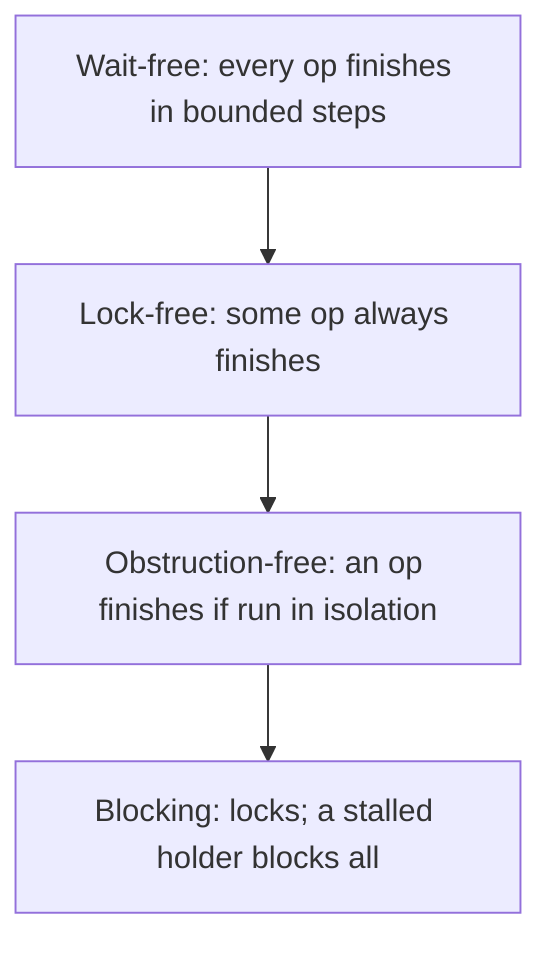

# Treiber Lock-Free Stack — Formal Correctness and Progress Theory

> **Read time: ~55 minutes** · **Audience:** Engineers and researchers who want the Treiber stack treated rigorously: linearizability, lock-freedom, a formal ABA argument, elimination-stack correctness, and the full progress-guarantee hierarchy.

The earlier levels established *what* the Treiber stack does and *how* to make it scale and reclaim memory. This level proves *that it is correct* and characterizes *what kind of progress it guarantees*. We work in the standard model of **linearizability** (Herlihy & Wing, 1990) over an asynchronous shared-memory machine equipped with atomic **read**, **write**, and **compare-and-swap**. We give linearization points, prove lock-freedom, formalize why ABA breaks the proof under unsafe reclamation, prove the elimination stack remains linearizable, and place the structure in the progress hierarchy (wait-free ⊃ lock-free ⊃ obstruction-free ⊃ blocking).

---

## Table of Contents

1. [Formal Model and Definitions](#model)
2. [Linearizability of the Treiber Stack](#linearizability)
3. [Lock-Freedom Proof](#lock-freedom)
4. [The ABA Problem, Formally](#aba-formal)
5. [Correctness of Tagged Pointers](#tagged-correctness)
6. [Elimination-Stack Correctness](#elimination-correctness)
7. [The Progress-Guarantee Hierarchy](#progress)
8. [Memory-Model Considerations](#memory-model)
9. [Comparison with Alternatives](#comparison)
10. [Summary](#summary)

---

<a name="model"></a>
## 1. Formal Model and Definitions

**Machine.** A finite set of threads $P = \{p_1,\dots,p_k\}$ share memory. Each thread executes a sequence of **primitive steps**, each of which is one of: a local computation, an atomic `read(x)`, an atomic `write(x,v)`, or an atomic $\text{CAS}(x, e, n)$ that atomically sets $x \leftarrow n$ and returns `true` iff $x = e$, else returns `false` and leaves $x$ unchanged. Steps of different threads interleave in an arbitrary (adversarial) total order; we make **no fairness assumption** except where stated.

**Object.** A sequential **stack** has state $s \in V^{*}$ (a finite sequence over value domain $V$; the left end is the top) and operations:

$$
\text{push}(v):\ s \mapsto v \cdot s,\qquad
\text{pop}():\ \begin{cases} (\text{head}(s),\, \text{tail}(s)) & s \neq \varepsilon \\ (\bot,\, \varepsilon) & s = \varepsilon \end{cases}
$$

**History.** An execution induces a **history** $H$: a sequence of *invocation* and *response* events. An operation is **complete** if its response is present; otherwise **pending**. $H$ is **sequential** if every invocation is immediately followed by its matching response.

**Linearizability (Herlihy–Wing).** A history $H$ is *linearizable* if there exists a sequential history $S$ such that:

1. $S$ is a permutation of $H$ (after possibly completing or dropping pending ops) that is **legal** for the sequential stack;
2. $S$ preserves the **real-time order** of $H$: if operation $o_1$ responds before $o_2$ is invoked in $H$, then $o_1$ precedes $o_2$ in $S$.

Equivalently, every operation appears to take effect **instantaneously at a single point** — its **linearization point** — between its invocation and response. To prove linearizability we exhibit, for each operation, an explicit linearization point and show the resulting order is legal.

---

<a name="linearizability"></a>
## 2. Linearizability of the Treiber Stack

Recall the implementation (state = atomic pointer `Head`; nodes immutable except a write to `next` before any publication):

```text
push(v):                        pop():
  n := new Node(v)                loop:
  loop:                             old := read(Head)
    old := read(Head)               if old = nil: return ⊥        (LP_empty)
    n.next := old                   nxt := old.next
    if CAS(Head, old, n):           if CAS(Head, old, nxt):       (LP_pop)
      return                          return old.value
                                  // retry
```

**Linearization points.**

- **`push`:** the linearization point is the **successful** $\text{CAS}(\text{Head}, old, n)$. (Failed CASes do nothing and are not linearization points.)
- **`pop` (non-empty):** the linearization point is the **successful** $\text{CAS}(\text{Head}, old, nxt)$.
- **`pop` (empty):** the linearization point is the `read(Head)` that returned `nil` (call it $LP_{\text{empty}}$).

Assume, for this section, **safe reclamation** (e.g., a tracing GC, or hazard pointers): a node is never freed while any thread holds a pointer to it, so a pointer value uniquely identifies a node throughout any operation that holds it. (We revisit this assumption in §4.)

**Theorem 1.** *Under safe reclamation, every history of the Treiber stack is linearizable.*

**Proof sketch.** Define the *abstract state* at any instant as the linked list reachable from `Head`. We argue an invariant and then that each linearization point maps abstract state correctly.

*Invariant $I$:* At every instant, the list reachable from `Head` is a valid finite acyclic chain $v_1 \cdot v_2 \cdots v_m$, and this chain equals the value of the abstract stack induced by the linearized order of completed/linearized operations so far.

*Base:* Initially `Head = nil`, abstract stack $= \varepsilon$. $I$ holds.

*Inductive step — `push` LP:* The successful $\text{CAS}(\text{Head}, old, n)$ fires only when `Head = old`. Just before it, by $I$, `Head` is the top of chain $C$. Because $n.next$ was set to `old` *and `old` was still the head at the CAS* (that is exactly what the CAS verifies), the new chain is $n \cdot C$. Atomicity of CAS means no intermediate state is observable. This is precisely $\text{push}(v)$: $s \mapsto v \cdot s$. $I$ preserved.

*Inductive step — `pop` LP (non-empty):* The successful $\text{CAS}(\text{Head}, old, nxt)$ fires only when `Head = old`. Because reclamation is safe, the `old` the thread holds is the *same node* that is currently `Head`, and the `nxt = old.next` it cached is still `old`'s successor (no thread mutates a published node's `next`). After the CAS the chain is $\text{tail}(C)$ and the operation returns $\text{head}(C)$'s value. This is exactly $\text{pop}()$ on a non-empty stack. $I$ preserved.

*`pop` LP (empty):* $read(\text{Head}) = nil$ at $LP_{\text{empty}}$ means the abstract stack is $\varepsilon$ at that instant (by $I$), so returning $\bot$ is correct, and the state is unchanged.

*Real-time order:* Each linearization point lies strictly between its operation's invocation and response (it is a step the operation itself executes). Hence if $o_1$ finishes before $o_2$ starts, $o_1$'s LP precedes $o_2$'s LP, so the LP order refines real-time order. The LP order is a legal sequential stack history by the case analysis above. Therefore $H$ is linearizable. $\blacksquare$

The decisive subtlety is the `pop` case: it relies on **"the held `old` is the head iff the CAS succeeds, and its cached `nxt` is still valid."** Safe reclamation is exactly what guarantees this. Remove it and the proof — and the structure — breaks (see §4).

---

<a name="lock-freedom"></a>
## 3. Lock-Freedom Proof

**Definition (lock-free).** An implementation is *lock-free* if, whenever any thread takes infinitely many steps, **some** operation completes infinitely often. Equivalently: from any reachable configuration, after a finite number of total steps, at least one operation completes. There is no per-thread bound (that would be wait-freedom).

**Theorem 2.** *The Treiber stack is lock-free.*

**Proof.** Consider any infinite execution in which threads collectively take infinitely many steps but suppose, for contradiction, that **no** operation ever completes after some configuration $\gamma$. Every operation is in a CAS retry loop; not completing means every $\text{CAS}(\text{Head}, \cdot, \cdot)$ after $\gamma$ **fails**. But a $\text{CAS}(\text{Head}, old, new)$ fails **only if** `Head` $\neq old$ at the moment it executes, i.e., **only if some other CAS on `Head` succeeded** since this thread read `Head`. A successful CAS *completes* the operation that issued it (push returns; pop returns). Hence infinitely many failed CASes after $\gamma$ imply infinitely many *successful* CASes after $\gamma$ — contradicting "no operation completes." Therefore some operation completes, and by repetition, operations complete infinitely often. $\blacksquare$

**Corollary.** The Treiber stack is **not wait-free.** A single thread $p$ can fail its CAS unboundedly often: an adversary schedules a different thread to win the CAS each time just before $p$'s CAS executes. $p$ takes infinitely many steps yet *never* completes, while the *system* makes progress. This witnesses the strict separation lock-free $\supsetneq$ wait-free for this implementation.

---

<a name="aba-formal"></a>
## 4. The ABA Problem, Formally

We now show *exactly which premise* of Theorem 1 fails under unsafe reclamation, and why that breaks linearizability.

**Setup.** Drop safe reclamation: a node freed by `pop` may be returned by a later allocation, so a pointer value $a$ may, over time, denote **distinct logical nodes** $\nu_1, \nu_2, \dots$ at the same address.

**The flawed step.** In the `pop` proof we used: *"the successful $\text{CAS}(\text{Head}, old, nxt)$ implies `Head` is the same node the thread read, with the same successor `nxt`."* Formally we used the implication

$$
\text{Head} = old \ \text{at the CAS} \ \Longrightarrow\ \text{the node denoted by } old \text{ is unchanged and } nxt = old.next.
$$

Under unsafe reclamation this implication is **false**. Consider the interleaving (the canonical $A\!-\!B\!-\!A$):

$$
\text{Head} \to a(\nu_1) \to b \to c.
$$

Thread $p$ reads $old = a$, caches $nxt = b$, then stalls. Another thread executes:

$$
\text{pop}() \ (\text{returns } \nu_1,\ \text{free } a),\quad
\text{pop}() \ (\text{returns } b,\ \text{free } b),\quad
\text{push}(x)\ \text{with allocation reusing address } a \text{ as node } \nu_2.
$$

Now $\text{Head} = a(\nu_2) \to c$. Thread $p$ resumes and executes $\text{CAS}(\text{Head}, a, b)$. The bit comparison $\text{Head} = a$ holds (same address), so the **CAS succeeds**, setting $\text{Head} \to b$. But $b$ was **freed**. The resulting state is not any legal stack state reachable by the abstract operations: $p$'s pop claims to return $\nu_1$ and leave the tail $b\cdot\dots$, yet $b$ is not on the stack at all and $\nu_2(x)$ has been silently dropped.

**Theorem 3.** *Under unsafe reclamation, there exists a history of the naive Treiber `pop` that is not linearizable.*

**Proof.** The interleaving above produces a completed `pop` by $p$ whose effect (Head $\to$ freed $b$; loss of $x$) corresponds to **no** sequential stack transition consistent with the real-time-ordered set of operations: the concurrent pops already removed $\nu_1$ and $b$, and the push added $x$; for $p$'s pop to be linearizable it must take effect at some point removing the current top — but it instead reinstalls a removed element. No legal sequential witness $S$ exists. $\blacksquare$

**The root cause, abstractly.** CAS tests **equality of representation**, but the proof needed **equality of abstract state**. Under safe reclamation these coincide (a pointer pins its node, so representation-equality at the CAS implies the node — and hence the relevant abstract fragment — is unchanged). Unsafe reclamation severs the coincidence: the same representation can denote different abstract states. **ABA is precisely the failure of representation-equality to imply history-equality.**

---

<a name="tagged-correctness"></a>
## 5. Correctness of Tagged Pointers

**Construction.** Replace `Head` by an atomic pair $(\text{ptr}, t)$ with $t \in \mathbb{Z}_{2^w}$. Every successful CAS sets $t \leftarrow t+1 \pmod{2^w}$.

**Claim.** With an *unbounded* tag ($w = \infty$), the tagged Treiber stack is linearizable even under unsafe reclamation.

**Argument.** The successful $\text{CAS}((\text{ptr},t)=(old, t_0),\ (nxt, t_0{+}1))$ now requires **both** $\text{ptr} = old$ **and** $t = t_0$. The tag is strictly monotonic across *all* successful updates. Hence between thread $p$'s read of $(old, t_0)$ and its CAS, if **any** successful update occurred, the live tag is $\geq t_0 + 1 \neq t_0$, so $p$'s CAS **fails**. Therefore a successful CAS by $p$ implies **no successful update happened in between** — which restores exactly the premise used in Theorem 1's `pop` case (the abstract state at the CAS equals the abstract state $p$ observed). Linearizability follows as in Theorem 1. $\blacksquare$

**Bounded tags.** With finite $w$, the tag wraps after $2^{w}$ successful updates. ABA can re-manifest only if a thread reads tag $t_0$ and, before its CAS, **exactly** $2^{w}\cdot j$ successful updates occur (for some $j \geq 1$) returning the live tag to $t_0$ *and* the pointer to $old$. The probability/possibility of this is negligible for $w = 64$ (an attacker would need $\sim 2^{64}$ updates inside one thread's read–CAS window) but non-zero for small $w$ (e.g., 16-bit packed tags). Thus tagged pointers give a **practically**, not **unconditionally**, correct reclamation-free ABA defense; for an unconditional guarantee combine with hazard pointers or use an unbounded counter via DWCAS.

> Note: tags address ABA (representation-vs-history mismatch) but **not** use-after-free of the dereference $old.next$. A complete unsafe-memory proof additionally requires that $old$ remain a valid (unfreed) node while dereferenced — the property hazard pointers/epochs supply (see [senior.md](./senior.md) §5).

---

<a name="elimination-correctness"></a>
## 6. Elimination-Stack Correctness

The elimination-backoff stack adds a second way for operations to complete: a **rendezvous** in which a `push(v)` hands $v$ directly to a concurrent `pop()`, and neither touches `Head`. We must show this preserves linearizability.

**Linearization point of an eliminated pair.** Let push $P$ (offering $v$) and pop $Q$ rendezvous at slot $\sigma$ via the exchange protocol, completing at the instant $t_\sigma$ the exchange CAS commits the match. **Linearize $P$ immediately before $Q$ at $t_\sigma$.**

**Claim.** This linearization is legal and real-time-respecting.

**Argument.**

1. *Legality.* In the sequential stack, executing $\text{push}(v)$ then immediately $\text{pop}()$ leaves the stack **unchanged** and returns $v$. The eliminated pair has *exactly* this net effect: $v$ is transferred from $P$ to $Q$ and `Head` is never modified, so the abstract stack is identical before and after the pair. Inserting "$P;Q$" adjacently at $t_\sigma$ is therefore a legal sequential fragment regardless of the surrounding state.

2. *Real-time order.* Both $P$ and $Q$ are in flight at $t_\sigma$ (each is between its own invocation and response, since the exchange happens inside both operations). So placing both LPs at $t_\sigma$ respects each operation's own invocation–response interval. For *other* operations $o$, the pair "$P;Q$" is a no-op on `Head`, so it commutes with every concurrent `Head`-modifying operation in the linearization — it can be slotted at $t_\sigma$ without disturbing their relative order. Hence real-time order over all operations is preserved.

3. *No double-completion.* The exchange protocol uses CAS so that a given offer is consumed by **at most one** partner (the matching CAS succeeds once); a push that times out and reverts its offer with $\text{CAS}(\text{offered}, \text{empty})$ either reclaims it (then falls back to the `Head` CAS, linearized normally) or observes that a pop already claimed it (then it is eliminated). No value is delivered twice or lost.

**Theorem 4.** *The elimination-backoff stack is linearizable, combining Theorem 1's `Head`-CAS linearization points with adjacent-pair linearization points for eliminated operations.* $\blacksquare$

**Progress.** Elimination preserves lock-freedom: the fast path is still the lock-free Treiber CAS, and the elimination path is *optional* (bounded by a timeout) — a thread that fails to rendezvous reverts and retries the `Head` CAS, so Theorem 2's argument still applies. Elimination does **not** upgrade the structure to wait-free; an unlucky thread can still be starved on the `Head` CAS while never finding a partner.

---

<a name="progress"></a>
## 7. The Progress-Guarantee Hierarchy

Non-blocking progress conditions form a strict hierarchy. We place the Treiber stack and relate the conditions.



| Condition | Guarantee | Treiber stack? | Canonical example |
|---|---|---|---|
| **Wait-free** | *Every* operation completes in a bounded number of *its own* steps, regardless of others | **No** (CAS can fail unboundedly) | Wait-free queues (Kogan–Petrank); atomic registers |
| **Lock-free** | *Some* operation completes in a bounded number of *total* steps; system-wide progress | **Yes** (Theorem 2) | Treiber stack, MS-queue |
| **Obstruction-free** | An operation completes if it eventually runs *without contention* (in isolation) | Yes (implied by lock-free) | Some STM designs |
| **Blocking (lock-based)** | None: a stalled lock-holder can block all others indefinitely | n/a (the lock-based stack we compare against) | Mutex-guarded stack |

Strictness: lock-free $\subsetneq$ wait-free is witnessed by the Treiber stack itself (Corollary in §3). Wait-freedom can be *built* from lock-free objects via universal constructions (Herlihy 1991) or **fast-path/slow-path helping** (e.g., a wait-free stack augments Treiber with an operation-descriptor announce array and a helping mechanism), but at non-trivial overhead — which is why production systems usually accept lock-freedom plus backoff/elimination rather than pay for wait-freedom.

**Consensus number.** By Herlihy's hierarchy, CAS has **consensus number $\infty$** — it can solve wait-free consensus for any number of threads. Thus there is *no algorithmic obstacle* to a wait-free stack; the Treiber stack is merely lock-free by design choice (simplicity, low overhead), not by limitation of its primitives.

---

<a name="amortized"></a>
## 7b. Amortized and Contention Analysis

Lock-free progress conditions say nothing about *how much work* the system does; that requires a contention model. We give two analyses.

### 7b.1 Aggregate work under an adversarial scheduler

Let $n$ operations be issued by $k$ threads. Each operation's body between a read of `Head` and its CAS is $O(1)$ instructions; a failed CAS forces a re-read and another attempt. The question is: how many *total* CAS attempts $T$ occur across all $n$ operations?

**Claim.** In the worst case, $T = \Theta(n + R)$, where $R$ is the number of *failed* CASes, and $R$ is **unbounded** in $n$ alone — it depends on the schedule.

**Argument.** Each operation contributes exactly one *successful* CAS (or one empty-read for empty pop), so the successful count is exactly $n$. Each failed CAS is "caused" by a successful CAS that intervened between some thread's read and its attempt. A single successful CAS can invalidate the in-flight reads of all $k-1$ other threads, causing up to $k-1$ subsequent failures. Hence $R = O(k \cdot n)$ in the worst case, giving $T = O(k \cdot n)$ total attempts and an *amortized* $O(k)$ attempts per operation under maximal contention. With $k$ bounded by the core count, per-operation work is $O(1)$ in $n$ but carries a constant factor that **grows with the thread count** — the formal shadow of the cache-line-ping-pong phenomenon from the senior level.

### 7b.2 Why there is no useful potential function for individual progress

One might hope to define a potential $\Phi$ over configurations such that each operation's amortized cost is $O(1)$ *including* its own retries. No such bounded-per-operation potential exists, precisely because the structure is **not wait-free**: an adversary can charge unbounded retries to a single fixed operation while the system's aggregate potential decreases via *other* operations' successes. The potential method bounds *aggregate* cost (as in §7b.1) but cannot bound an *individual* operation — this is the amortized-analysis reflection of lock-free $\subsetneq$ wait-free.

<a name="empty-pop"></a>
## 7c. Subtlety of the Empty-Pop Linearization Point

The empty-pop linearization point deserves a careful treatment because it differs in kind from the others: it is a **read**, not a CAS, and it must be justified against concurrent pushes.

**Claim.** Linearizing an empty pop at the instant of its `read(Head) = nil` is correct.

**Argument.** Suppose pop $Q$ reads `Head = nil` at time $\tau$. By invariant $I$ (§2), the abstract stack is $\varepsilon$ *at $\tau$*. Returning $\bot$ is the legal sequential result of $\text{pop}()$ on the empty stack. We must check real-time order is respected. If some push $P$ responded before $Q$ was invoked, then $P$'s value was on the stack at $P$'s response, which is before $Q$'s invocation, hence before $\tau$. If that value is *still* present at $\tau$, then `Head ≠ nil` at $\tau$, contradicting the read; so it was popped by some pop $Q'$ whose successful CAS precedes $\tau$. In the linearization, $P$ precedes $Q'$ precedes $Q$, consistently — $Q$ correctly sees an empty stack *after* $P$'s element was removed. Thus no real-time edge is violated. $\blacksquare$

A pitfall: one must **not** linearize an empty pop at its *invocation*; only the witnessed `nil`-read instant is guaranteed to coincide with an actually-empty abstract state. Choosing the read instant is what makes the argument go through.

<a name="abstract-conditions"></a>
## 7d. Abstract Conditions for ABA Safety

We can state, primitive-independently, exactly when a CAS-based update is ABA-safe. Let a CAS operate on a location holding values from a representation domain $\rho$, and let $\sigma: \rho \to \Sigma$ map representations to *abstract observable states relevant to the operation's correctness*.

**Definition (history-faithful representation).** The representation is *history-faithful for operation $o$* if, whenever $o$ reads representation $r$ and later its CAS observes representation $r$ again, then $\sigma(r)$ has not changed in any way $o$ depends on between the two observations.

**Proposition.** *An $o$ whose correctness proof uses "CAS success $\Rightarrow$ observed abstract state unchanged" is correct iff the representation is history-faithful for $o$.*

For the Treiber `pop`, $\rho$ = pointer values, and $\sigma(\text{ptr})$ must capture *which node and which successor* the pointer denotes. Raw pointers are **not** history-faithful: the same bits can denote different (node, successor) pairs after reclamation (the ABA failure). Two fixes make the representation history-faithful:

1. **Tagging** extends $\rho$ to $(\text{ptr}, t)$ with strictly monotonic $t$. Then equal $(\text{ptr}, t)$ at read and CAS forces $t$ unchanged, which (monotonicity) forces *no successful update between* — hence $\sigma$ unchanged. History-faithful (unbounded tag).
2. **Reclamation prevention** (GC / hazard pointers) ensures a pointer cannot denote a *different* node while observed, so equal pointers force equal $\sigma$. History-faithful by pinning.

This framing unifies the §4–§5 results: **ABA is exactly non-history-faithfulness of the chosen representation, and every ABA fix is a way to restore history-faithfulness** — either by enriching the representation (tags) or by constraining reuse (reclamation schemes).

<a name="memory-model"></a>
## 8. Memory-Model Considerations

The proofs above assume **sequential consistency** of the atomic operations. Real hardware and language memory models are weaker, so an implementation must insert the right ordering:

- **Publication safety.** A pushing thread writes $n.next$ *before* the CAS that publishes $n$. The CAS must carry **release** semantics so the $n.next$ write is visible to any thread that subsequently **acquires** `Head` and follows the pointer. In Java, `AtomicReference.compareAndSet` provides the necessary `volatile`-style ordering; the `value` field should be `final` (freeze semantics) so its initialization is visible after publication. In Go, `sync/atomic` operations are sequentially consistent per the Go memory model.
- **Consume vs acquire.** Following `head.next` after an acquiring load of `head` is a dependent load; most languages require a full **acquire** (no portable `consume`).
- **Reclamation fences.** Hazard-pointer publication needs a **store–load barrier** between writing the hazard slot and the re-validation read of `Head`; without it the validation can be reordered before the publication and the protection is unsound.

These are not corrections to the *abstract* proof but obligations the *implementation* must discharge so the abstract atomic-step model faithfully describes the machine.

---

<a name="exchanger"></a>
## 8b. The Elimination Exchanger Protocol, Formally

§6 linearized eliminated pairs abstractly; here we verify the **exchanger** that realizes the rendezvous is itself correct, so that "a push and a pop met at slot $\sigma$" is a well-defined, race-free event.

**Slot state machine.** Each slot holds an atomic value in $\{\textsf{EMPTY}\} \cup (\{\textsf{PUSH}\}\times V) \cup \{\textsf{POP}\}$, updated only by CAS. The protocol:

```text
push offer at slot σ:
  if CAS(σ, EMPTY, (PUSH, v)):           // (P1) publish offer
     wait up to timeout:
        if σ == EMPTY: return ELIMINATED  // (P2) a pop consumed it
     if CAS(σ, (PUSH, v), EMPTY):         // (P3) reclaim unconsumed offer
        return FALLBACK
     else: return ELIMINATED              // (P4) pop grabbed it at the deadline

pop probe at slot σ:
  let s = read(σ)
  if s == (PUSH, v):
     if CAS(σ, (PUSH, v), EMPTY):         // (Q1) consume the offer
        return (ELIMINATED, v)
  return FALLBACK
```

**Lemma (single consumption).** *An offer published at (P1) is consumed by at most one pop.* Consumption is the CAS at (Q1) from $(\textsf{PUSH},v)$ to $\textsf{EMPTY}$. CAS is atomic and the value $\textsf{EMPTY}$ is installed by the first successful (Q1); any second pop reads $\textsf{EMPTY}$ (or a *different* later offer) and its (Q1) on $(\textsf{PUSH},v)$ fails. Hence at most one (Q1) succeeds against a given offer. $\blacksquare$

**Lemma (no lost value).** *A published offer either is consumed (Q1) or is reclaimed by its publisher (P3).* The publisher attempts (P3) after timeout. (P3) and (Q1) both CAS the same slot from $(\textsf{PUSH},v)$; exactly one succeeds (CAS atomicity). If (Q1) wins, the value is delivered to a pop (consumed); if (P3) wins, the publisher reclaims $v$ and falls back to the `Head` CAS. In neither case is $v$ lost or duplicated. The (P4) branch handles the exact tie where (P3) fails because (Q1) just won: the publisher then reports ELIMINATED, matching the pop that consumed it. $\blacksquare$

**Linearization consistency.** Combine with §6: when (Q1) succeeds at instant $t$, that is the rendezvous instant $t_\sigma$; linearize the push immediately before the pop at $t$. The single-consumption lemma guarantees this push and pop form a *unique* pair (no push is matched to two pops, no pop to two pushes), so the adjacent-pair insertion of §6 is well-defined. The no-lost-value lemma guarantees every operation either eliminates (and is linearized as a pair) or falls back (and is linearized at its `Head` CAS). Therefore the elimination stack's full set of linearization points is consistent and total. $\blacksquare$

**Progress under elimination.** The timeout in (P2) bounds the elimination detour; on expiry a thread executes (P3)/(P4) in $O(1)$ and resumes the lock-free `Head` loop. So no thread is *trapped* in the exchanger, and Theorem 2's lock-freedom argument (some `Head` CAS eventually succeeds, completing an op) is unaffected. The exchanger adds completions (eliminations) without removing the lock-free fast path.

<a name="wait-free"></a>
## 8c. From Lock-Free to Wait-Free — A Transformation Sketch

Since CAS has consensus number $\infty$ (§7), a wait-free stack is achievable. We sketch the standard **fast-path/slow-path with helping** transformation to make precise *what wait-freedom costs* and *why Treiber omits it*.

**Construction.**
1. **Fast path.** A thread first runs the ordinary lock-free Treiber operation for a bounded number $B$ of attempts.
2. **Slow path (announce).** If it fails $B$ times, it stops competing blindly and instead **announces** its pending operation in a per-thread slot of a shared *announce array*: a descriptor $\langle \text{op}, \text{arg}, \text{state} \rangle$.
3. **Helping.** Every thread, on entering the operation, first scans the announce array and **helps complete** any announced operation it finds (applying the announced op to `Head` via CAS and marking its descriptor `done`), before doing its own work.

**Why this is wait-free.** Once a thread $p$ announces, *every other thread that makes progress will help $p$*. Within a bounded number of *system* steps, some thread succeeds at a `Head` CAS; if it helped $p$, $p$ is done; if it did its own op, it will help $p$ on its next entry. A counting argument bounds the number of `Head` updates before $p$'s descriptor is marked `done` by $O(k)$ (each of the $k$ threads helps at most a bounded number of times before $p$ is served). Hence $p$ completes in $O(B + k)$ of *its own* steps regardless of scheduling — wait-free.

**The cost.** Helping requires (a) an announce array of size $k$, (b) every operation to scan and potentially help others (an $O(k)$ overhead on the common path, or amortized via clever scanning), and (c) idempotent descriptors so a helped-and-also-self-completed operation is not applied twice. These overheads — extra atomics, descriptor management, and the helping scan — typically **double or triple** the uncontended cost. Production systems judge that lock-freedom plus backoff/elimination already guarantees system progress with far lower constant factors, and that true per-operation step bounds are rarely worth the price. This is *why the Treiber stack is lock-free by design*: not a limitation of CAS, but an engineering trade favoring the cheap common case over a worst-case bound that real schedulers seldom hit.

<a name="smr-correctness"></a>
## 8d. Correctness of Safe Memory Reclamation

The linearizability proof (§2) assumed safe reclamation. We now state the obligation a reclamation scheme must meet and why hazard pointers discharge it.

**Reclamation safety obligation.** A scheme is *safe* if: a node $\nu$ is `free`d only after the instant at which **no thread holds, or can in future load, a pointer to $\nu$ that it will dereference.**

**Hazard-pointer discharge.** The protected read is:

```text
loop:
   p := read(Head)
   hazard[me] := p         // (H1) publish
   fence(store-load)       // (H2) order publish before re-validate
   if read(Head) == p:     // (H3) re-validate
      return p             // p is protected
```

**Lemma.** *If `read(Head) == p` at (H3), then $p$ cannot be freed while $\text{hazard}[me] = p$.* A reclaiming thread frees a retired node $\nu$ only after scanning all hazard slots and finding none equal to $\nu$. Suppose for contradiction $p$ is freed while $\text{hazard}[me]=p$. The reclaimer's scan must have read $\text{hazard}[me] \neq p$ — i.e., *before* (H1) published $p$. But then $p$ was retired before (H1); for $p$ to still equal `Head` at (H3), no retirement of the node currently at `Head` occurred, contradiction (a retired node is no longer `Head`). The store-load fence (H2) forbids reordering (H3) before (H1), closing the window where the reclaimer's scan and our publish could both "miss." $\blacksquare$

With protected reads, the `pop` proof of §2 holds *without* a GC: the held `old` is pinned (cannot be freed, hence cannot be recycled), so representation-equality at the CAS again implies abstract-state-equality (history-faithfulness, §7d). Thus hazard pointers make the Treiber stack linearizable in manual memory, simultaneously closing ABA (a pinned node cannot be recycled to fake an A→B→A) and use-after-free.

<a name="comparison"></a>
## 9. Comparison with Alternatives

| Attribute | Treiber stack | Lock-based stack | MS-queue ([16](../16-lock-free-queue-michael-scott/professional.md)) | Wait-free stack |
|---|---|---|---|---|
| Linearizable | Yes (Thm 1) | Yes (critical section = LP) | Yes | Yes |
| Progress | Lock-free | Blocking | Lock-free | Wait-free |
| LP location | successful `Head` CAS | inside the lock | tail-swing / head-advance CAS | announce + helping point |
| ABA exposure | `pop` (mitigate: tags/HP) | none | both ends | handled by descriptors |
| Per-op step bound | none | none (lock wait) | none | **bounded** |
| Overhead | minimal (1 CAS) | lock acquire/release | 1–2 CAS | descriptors + helping (high) |
| Consensus number of primitive | ∞ (CAS) | — | ∞ | ∞ |

---

<a name="worked"></a>
## 9b. A Fully Worked Linearization

To make §2 concrete, we linearize a specific concurrent history by hand. Threads $p_1, p_2, p_3$ on an initially empty stack; we annotate each step with the global time of its linearization point (LP) where applicable.

```text
t=1  p1: invoke push(a)
t=2  p2: invoke push(b)
t=3  p1: read Head=nil ; set n_a.next=nil
t=4  p2: read Head=nil ; set n_b.next=nil
t=5  p1: CAS(Head, nil, n_a) -> OK        [LP of push(a)]   Head -> a
t=6  p2: CAS(Head, nil, n_b) -> FAIL      (Head is a)
t=7  p1: response push(a)
t=8  p3: invoke pop()
t=9  p2: read Head=a ; set n_b.next=a
t=10 p3: read Head=a ; next=nil... wait, next=a.next=nil? no: a.next=nil
t=11 p2: CAS(Head, a, n_b) -> OK          [LP of push(b)]   Head -> b -> a
t=12 p2: response push(b)
t=13 p3: CAS(Head, a, nil) -> FAIL        (Head is b)        retry
t=14 p3: read Head=b ; next=b.next=a
t=15 p3: CAS(Head, b, a) -> OK            [LP of pop=b]       Head -> a
t=16 p3: response pop() = b
```

**Linearization order by LP time:** $\text{push}(a)@5 \prec \text{push}(b)@11 \prec \text{pop}()@15$.

**Legality check (sequential replay):**

```text
push(a):  []      -> [a]
push(b):  [a]     -> [b, a]
pop():    [b, a]  -> [a]   returns b   ✓
```

The replay is a legal stack history and returns exactly what $p_3$ observed ($b$). 

**Real-time check:** $\text{push}(a)$ responded at $t=7$, before $\text{push}(b)$? No — they overlap ($p_2$ invoked at $t=2$, before $p_1$ responded at $t=7$), so the spec imposes **no** order between them, and our LP order (a before b) is one of the two permitted choices. $\text{push}(b)$ responded at $t=12$, before $\text{pop}$ responded at $t=16$, and they overlap (pop invoked $t=8 < 12$), so again no forced order — but our LP order (b before pop) is consistent. Every real-time edge is respected and the history is **linearizable** with the witness above. Note that the CAS *failures* at $t=6$ and $t=13$ are **not** linearization points and contribute nothing to the order — they only forced retries, exactly as Theorem 2 predicts.

<a name="invariants"></a>
## 9c. The Full Invariant Set

For a rigorous mechanized-style proof, the single invariant $I$ of §2 is usually decomposed into the conjunction of smaller, locally-checkable invariants. We list them for reference; each is preserved by every primitive step.

| Invariant | Statement | Preserved because |
|---|---|---|
| $I_1$ acyclicity | the chain from `Head` is a finite simple path ending at `nil` | push prepends a fresh node; pop removes the head; neither creates a back-edge |
| $I_2$ immutability | a node's `next` is written exactly once, before publication, never after | push sets `n.next` before its CAS; pop never writes `next` |
| $I_3$ reachability | every live (un-popped, un-freed) node is reachable from `Head` | pop unlinks exactly the head; push links the new head above all others |
| $I_4$ no-leak | a node leaves the chain only via a successful pop CAS | the only `Head` writes are push/pop CASes |
| $I_5$ value-stability | a node's `value` is set at construction and never mutated | constructor-only assignment; return copies the value |
| $I_6$ (manual mem) pinned-while-observed | a node referenced by a hazard slot or live local is not freed | reclamation scans hazards / GC pins live refs |

$I_2$ and $I_5$ are what license the `pop` proof's claim that the cached `next` and returned `value` are stable across the CAS window; $I_6$ is the reclamation obligation discharged in §8d. Together they imply the high-level $I$ and hence linearizability.

<a name="glossary-formal"></a>
## 9d. Glossary of Formal Terms

| Term | Definition |
|---|---|
| **Linearization point (LP)** | The single instant within an operation's interval at which it appears to take effect atomically. |
| **History** | A sequence of invocation/response events generated by an execution. |
| **Legal history** | A sequential history consistent with the object's sequential specification. |
| **Lock-free** | Infinitely many steps by the system guarantee infinitely many operation completions. |
| **Wait-free** | Every operation completes within a bounded number of its own steps. |
| **Obstruction-free** | An operation completes if it eventually runs without interference. |
| **Consensus number** | The maximum number of threads for which a primitive can solve wait-free consensus; CAS = ∞. |
| **History-faithful representation** | A representation where equal bit patterns at read and CAS imply the correctness-relevant abstract state is unchanged (§7d). |
| **ABA** | Failure of history-faithfulness: a value returns to a prior bit pattern with changed meaning. |
| **Safe memory reclamation (SMR)** | A discipline ensuring a node is freed only when no thread can still dereference a pointer to it. |
| **Helping** | A wait-free technique where threads complete each other's announced operations. |
| **Static linearization point** | An LP fixed at a specific instruction in the operation's own code (Treiber's case). |
| **External linearization point** | An LP that may be a step taken by a *different* operation (e.g., a helper's CAS). |
| **Potential function** | A non-negative map from configurations to reals used to amortize cost over an operation sequence. |
| **Composability (locality)** | The property that a system of linearizable objects is itself linearizable. |
| **Sequential consistency** | A weaker, non-local condition: some program-order-respecting total order exists, ignoring real-time. |
| **Adversarial scheduler** | A non-halting scheduler that may interleave and starve threads arbitrarily; the model for lock-freedom. |

These terms recur across the concurrent-data-structures literature; mastering them on the Treiber stack — the simplest object that exercises all of them — transfers directly to queues, deques, hash maps, and skip lists, where the same proof obligations (Appendix A) and the same hazards (ABA, reclamation, progress) reappear with more moving parts but identical underlying structure.

<a name="summary"></a>
## 10. Summary

Formally, the Treiber stack is **linearizable** with linearization points at the successful `Head` CAS for push and non-empty pop, and at the failing empty-read for empty pop; the proof hinges on **safe reclamation** making representation-equality coincide with abstract-state-equality. It is **lock-free** but **not wait-free**: a successful CAS always completes *some* operation (system progress), yet an individual thread's CAS may fail unboundedly. The **ABA problem** is exactly the failure of representation-equality to imply history-equality once reclamation is unsafe; **tagged pointers** restore the implication via a strictly monotonic version (unconditionally for unbounded tags, practically for 64-bit, fallibly for small tags), though they address ABA but not use-after-free. The **elimination-backoff stack** stays linearizable by linearizing an eliminated push–pop pair adjacently as a net-no-op, and stays lock-free because elimination is an optional bounded detour from the lock-free fast path. In the **progress hierarchy** (wait-free ⊃ lock-free ⊃ obstruction-free ⊃ blocking), the Treiber stack sits strictly at lock-free by design, not necessity — CAS's infinite consensus number leaves room for wait-free variants at a cost most systems decline to pay.

**Next step:** Practice the proofs and implementations in [interview.md](./interview.md), then build them in [tasks.md](./tasks.md). Cross-reference [15-cas-atomic-primitives](../15-cas-atomic-primitives/professional.md), [16-lock-free-queue-michael-scott](../16-lock-free-queue-michael-scott/professional.md), [19-rcu](../19-rcu/professional.md), and [20-hazard-pointers](../20-hazard-pointers/professional.md).

---

## Appendix A — Proof Obligations Checklist

A complete linearizability + progress argument for a Treiber-style structure discharges exactly these obligations. Use it as a proof skeleton.

| # | Obligation | Where discharged here |
|---|---|---|
| 1 | Identify an LP inside each operation's interval | §2 (push/pop CAS; empty-read) |
| 2 | Show LP order yields a legal sequential history | §2 induction; §9b worked replay |
| 3 | Show LP order refines real-time order | §2 (LP is a step of the op) |
| 4 | State and prove the representation invariant | §2 invariant $I$; §9c decomposition |
| 5 | Prove system progress (lock-freedom) | §3 contradiction argument |
| 6 | Characterize per-op progress (not wait-free) | §3 corollary; §7b.2 |
| 7 | Identify the reclamation assumption used in (4) | §2 "safe reclamation"; §7d, §8d |
| 8 | If reclamation-free, prove the ABA defense restores (4) | §5 tags; §7d history-faithfulness |
| 9 | If extended (elimination), re-prove (1)–(3) for new completions | §6, §8b exchanger lemmas |
| 10 | Map abstract atomic steps to the real memory model | §8 |

Skipping obligation 7 is the single most common error in informal "proofs" of lock-free stacks — they implicitly assume a GC and then are ported to manual memory where the proof silently fails.

## Appendix B — Relating the Conditions Formally

The progress conditions are not merely a list; they form a lattice under "implies." For an object implementation $A$:

```text
wait-free(A)        =>  lock-free(A)        =>  obstruction-free(A)
   |                        |                        |
 bounded per-op          system progress         isolation progress
```

- $\text{wait-free} \Rightarrow \text{lock-free}$: if every operation finishes in bounded *own* steps, then in any infinite execution operations keep completing, so the system progresses.
- $\text{lock-free} \Rightarrow \text{obstruction-free}$: if the system always progresses under contention, then a fortiori a solo-running operation (no contention) progresses.
- Both implications are **strict** for the Treiber stack family: Treiber is lock-free but not wait-free (§3 corollary); some obstruction-free STM objects are not lock-free (a pair of operations can perpetually abort each other absent contention management).

These separations justify why one *names* the condition an implementation achieves — they are genuinely different guarantees with different costs, and an engineer must know which one a given structure provides before relying on it under adversarial scheduling.

## Appendix C — On the Choice of Linearization Points

A frequent confusion: are linearization points *fixed in the code* or *chosen per execution*? For the Treiber stack they are **fixed** — every push linearizes at *its* successful CAS, deterministically. This is the easy case ("static" or "internal" LPs). Some lock-free objects (e.g., certain queues, or operations linearized by *another* thread's helping step) have **external** or **future-dependent** LPs, where the linearizing instant may be a step taken by a *different* operation and is not statically located in the linearizing operation's own code. The wait-free transformation of §8c is exactly such a case: a helped operation's LP is the *helper's* CAS. Recognizing whether an object has static or external LPs is the first step in any linearizability proof, and it determines whether a simple inductive argument (as in §2) suffices or whether a more elaborate "linearization function over the whole execution" is required.

## Appendix D — A Note on Sequential Consistency vs Linearizability

Linearizability and sequential consistency are often conflated; the distinction matters for the Treiber stack's guarantees.

- **Sequential consistency (Lamport):** there exists *some* total order of all operations consistent with each thread's program order, and each read returns the value of the most recent write in that order. It is a **non-local** property: it does not require respecting real-time order across threads.
- **Linearizability (Herlihy–Wing):** as defined in §1, additionally requires the order to respect **real-time** precedence and is **local** (composable): a system whose every object is linearizable is itself linearizable.

The Treiber stack is **linearizable**, the stronger property. This buys two things the weaker condition would not. First, **composability**: a program using a linearizable stack together with other linearizable objects can be reasoned about object-by-object; sequential consistency does not compose, so a system of sequentially-consistent objects need not be sequentially consistent overall. Second, **real-time intuition**: if `push(x)` *returns* before `pop()` is *called* (no overlap), linearizability guarantees the pop sees a stack that already contains `x` (or a later state) — exactly what a programmer expects. Sequential consistency permits the pop to be ordered before that push despite the real-time gap, violating intuition. Because lock-free data structures are meant to be dropped into arbitrary concurrent programs and composed freely, **linearizability is the correct correctness criterion** for the Treiber stack, and it is what §2 proves.

## Appendix E — Termination, Fairness, and the Adversary

A final formal clarification concerns *what the scheduler is allowed to do*. Our lock-freedom proof (§3) assumes an **adversarial but non-halting** scheduler: it may interleave steps arbitrarily and starve any chosen thread, but it must let *some* thread keep taking steps. Under this model:

- Lock-freedom holds **without any fairness assumption** — the system progresses even if the scheduler is maximally hostile to individual threads.
- Wait-freedom would require either a fair scheduler *or* an algorithmic helping mechanism (§8c); the Treiber stack provides neither, so an unfair scheduler can starve a fixed thread forever (the §3 corollary's adversary).
- A purely **halting** scheduler (one that stops giving any thread steps) makes *all* progress conditions vacuous — they are statements about executions in which steps continue to be taken.

This is why the precise phrasing of §3 — "whenever any thread takes infinitely many steps, some operation completes infinitely often" — is the rigorous statement: it quantifies over executions with unbounded total steps and asserts system-wide completion, neither assuming fairness nor promising per-thread bounds.

## Appendix F — Why the Stack Is the Canonical Pedagogical Object

It is worth closing with *why* the Treiber stack, of all lock-free structures, became the universal first example. Three properties align:

1. **Minimal mutable shared state.** A single atomic pointer `head` is the entire concurrent surface. Every other field is immutable after publication. This makes the invariant set (§9c) small and the linearization points (§2) obvious and static — the easiest possible setting in which to *see* a real linearizability proof.

2. **It exhibits ABA in its purest form.** Because `pop` caches `old.next` across the CAS window and nodes are exactly the objects allocators recycle, the A→B→A pattern arises in the minimal three-operation trace (§9b's cousin). A learner meets the deepest hazard in lock-free programming on the simplest possible structure, where the mechanism is not obscured by incidental complexity.

3. **It is lock-free but not wait-free, with a one-line proof of each.** The contradiction argument for lock-freedom (§3) and the adversary for not-wait-free (corollary) are both short and self-contained, so the *entire progress hierarchy* can be motivated and located on this one object before any heavier machinery (universal constructions, helping) is introduced.

Together these make the Treiber stack the rare object on which a student can, in a single sitting, prove correctness, prove progress, meet the central hazard, and see every fix (tags, hazard pointers, epochs, elimination) as a precise response to a precisely-stated gap in the proof. That pedagogical completeness — not its practical ubiquity, considerable as that is — is why it opens every serious treatment of concurrent data structures, and why these four documents have used it as the lens onto the whole field.

## Appendix G — Open Problems and Frontier Notes

The Treiber stack is solved, but the questions it raises remain active research at the frontier of concurrent data structures.

- **Optimal SMR.** Hazard pointers bound memory but tax every read; epochs are cheap but unbounded under stalls. Schemes such as **hazard eras**, **interval-based reclamation (IBR)**, and **DEBRA+** aim for the bounded-memory robustness of hazard pointers at the read-cost of epochs. There is no universally dominant scheme; the trade between read-path cost, memory bound, and stall-robustness is genuinely fundamental, and the "right" choice remains workload-dependent.
- **Fast wait-free stacks.** The §8c transformation is correct but slow. Work on **fast-path/slow-path** wait-free constructions tries to make the common case as cheap as the lock-free fast path while retaining the bounded-step guarantee on the slow path. Whether a wait-free stack can match lock-free constant factors in practice is still open in the engineering sense.
- **Contention-adaptive structures.** The elimination array's size is a tuning parameter; adaptive schemes resize it online based on observed contention. Provably-optimal online adaptation (matching an offline oracle) is not fully characterized.
- **Verification.** Mechanized proofs of linearizability and lock-freedom for these structures (in Coq, Iris, TLA+) are an active area; the manual arguments in this document are exactly what such tools formalize and check, including the subtle reclamation obligations (§8d) that informal proofs routinely omit.

These notes are beyond what any interview or production task requires, but they mark the boundary of the settled theory: everything in §1–§9 is rigorous and stable; the appendices above point at where the open questions begin. An engineer who has internalized the proofs in this document possesses exactly the vocabulary needed to read that frontier literature.

## Appendix H — One-Page Proof Recap

For revision, the entire formal story compresses to:

- **Linearizable** (Thm 1): LPs at the successful `head` CAS (push, non-empty pop) and the nil-read (empty pop); induction on invariant $I$ shows each LP maps abstract state correctly; LPs lie in-interval so real-time order is refined.
- **Lock-free** (Thm 2): every CAS failure is caused by a CAS success, and every success completes an op — so failures forever imply successes forever, a contradiction with "no op completes."
- **Not wait-free**: an adversary lets a rival win each CAS, starving one thread indefinitely.
- **ABA** (Thm 3): under unsafe reuse, equal pointer bits no longer imply unchanged abstract state (non-history-faithfulness, §7d), breaking the pop LP argument.
- **Tags** (§5): a strictly monotonic version restores history-faithfulness; unbounded tags are unconditional, finite tags practical-but-fallible.
- **Reclamation** (§8d): hazard pointers pin observed nodes (publish + fence + re-validate), making the pop proof hold in manual memory and closing both ABA and use-after-free.
- **Elimination** (Thm 4, §8b): an eliminated push–pop pair linearizes adjacently as a net no-op; the exchanger's single-consumption and no-lost-value lemmas make the pairing well-defined; lock-freedom is preserved because elimination is a bounded optional detour.

If you can reconstruct these seven bullets from memory, you can derive everything in this document.
