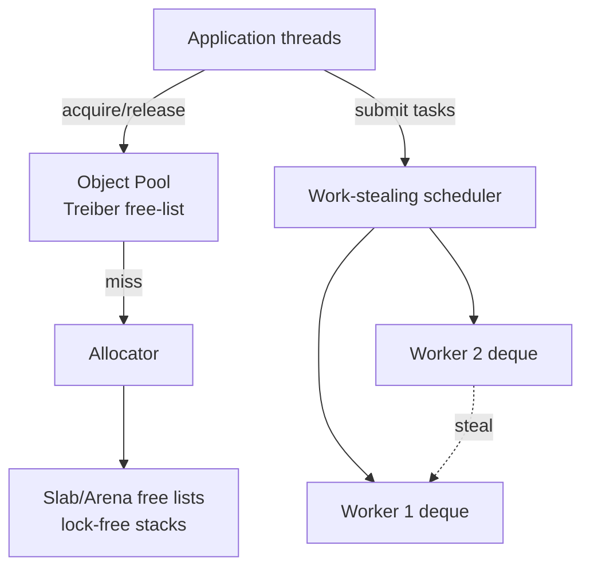
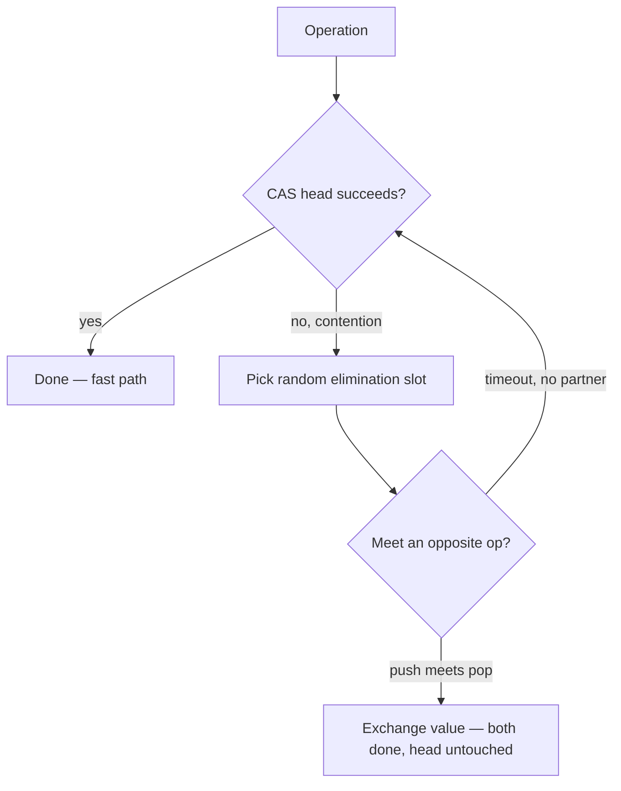
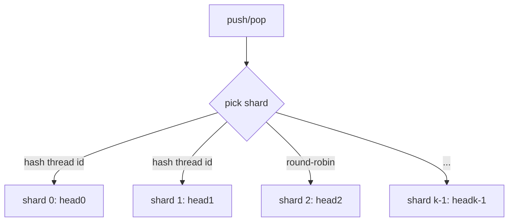
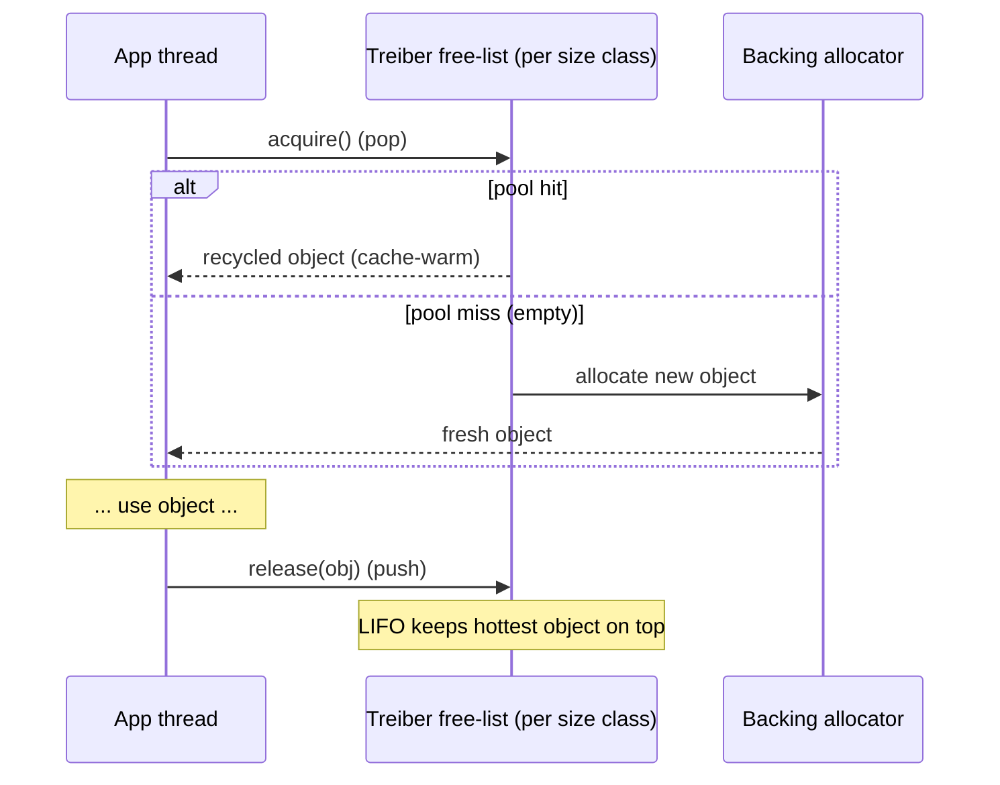

# Treiber Lock-Free Stack — Senior Level

> **Read time: ~50 minutes** · **Audience:** Engineers building or operating concurrent systems who need to know where lock-free stacks live in real infrastructure, how to make them *scale*, and how to free memory safely without a GC.

The [middle level](./middle.md) ended on a sour practical note: the Treiber stack is correct (with tags) but does **not scale** — a single `head` cache line bottlenecks every thread. The senior level is about the two questions that matter in production. First, **where do lock-free stacks actually earn their keep?** (object pools, allocator free lists, work-stealing schedulers). Second, **how do we make them scale and reclaim memory safely?** The answers are the **elimination-backoff stack** (which turns contention from a liability into an asset) and **safe memory reclamation** via hazard pointers and epoch/RCU schemes. We tie these to real systems: JVM allocator free lists, Go's `sync.Pool`-style caches, Java's `ForkJoinPool` work-stealing deques, and lock-free memory allocators.

---

## Table of Contents

1. [Introduction — Stacks as System Building Blocks](#introduction)
2. [Where Treiber Stacks Live in Production](#production)
3. [The Elimination-Backoff Stack — Scaling Past the Hotspot](#elimination)
4. [Work-Stealing: The Deque Cousin](#work-stealing)
5. [Memory Reclamation — Hazard Pointers vs Epochs/RCU](#reclamation)
6. [Comparison of Reclamation Schemes](#reclamation-compare)
7. [Code Examples — Elimination + Hazard-Pointer Sketches](#code-examples)
8. [Observability](#observability)
9. [Failure Modes](#failure-modes)
10. [Summary](#summary)

---

<a name="introduction"></a>
## 1. Introduction — Stacks as System Building Blocks

Senior engineers rarely use a concurrent stack as a "data structure" in the algorithmic sense. They use it as a **resource recycler**. A LIFO stack is the natural shape for a **free list**: when you are done with an object, you push it; when you need one, you pop it. LIFO is deliberate — the most-recently-freed object is the **hottest in cache**, so reusing it (rather than the oldest) maximizes cache locality. This single insight explains why Treiber stacks underpin object pools, slab allocators, and per-thread caches across the industry.

The constraints that drive design at this level are not "what is the Big-O" — every op is O(1). They are:

- **Scalability:** does throughput rise with core count, or does the `head` hotspot cap it?
- **Reclamation safety:** in a non-GC environment (C/C++/Rust, or a GC environment deliberately recycling to avoid GC pressure), how do we free popped nodes without use-after-free?
- **Tail latency:** a lock-free op has no worst-case retry bound; what is the p99 under load?
- **Memory footprint:** unbounded growth, fragmentation, and the overhead of reclamation metadata.

We address each below.

---

<a name="production"></a>
## 2. Where Treiber Stacks Live in Production



| System | How a lock-free stack is used | Why a stack/LIFO |
|---|---|---|
| **Object / connection pools** | `release(obj)` pushes; `acquire()` pops. | Reuse the hottest object; lock-free release from any thread |
| **Memory allocators (free lists)** | Per-size-class free list of blocks as a Treiber stack | `free` = push, `malloc` = pop; LIFO keeps freed blocks cache-warm |
| **Per-thread caches (tcmalloc/jemalloc style)** | Thread-local free lists, central lock-free stack as overflow | Most ops hit the local list; central stack handles cross-thread balancing |
| **Work-stealing schedulers** | Each worker owns a **deque** (stack-like local end, queue-like steal end) | Owner pushes/pops LIFO (cache-friendly); thieves steal FIFO from the far end |
| **Hazard-pointer / RCU retired-node lists** | Retired nodes parked on a lock-free stack until safe to free | LIFO recycling of deferred frees |
| **Recyclers / ring of buffers** | Network/IO buffers pushed back after use | Lock-free release path off the hot data plane |

The recurring pattern: a **lock-free release path**. The thread *finishing* with a resource must not block, must not deadlock, and must not be stalled by a slow consumer — `push` onto a Treiber stack is exactly that. The Treiber stack is, in this light, less a "stack" and more "the canonical lock-free release primitive."

---

<a name="elimination"></a>
## 3. The Elimination-Backoff Stack — Scaling Past the Hotspot

The naive Treiber stack cannot scale because every operation touches `head`. The **elimination-backoff stack** (Hendler, Shavit, Yerushalmi, 2004) makes a beautiful observation:

> A `push(v)` and a concurrent `pop()` are **complementary**: if they meet, the `push` can hand `v` directly to the `pop`, and **neither needs to touch `head` at all**. The two operations "eliminate" each other.

Crucially, this is *linearizable*: a push immediately followed by a pop of the same value is a valid stack history (the value was on the stack for an instant). Under high contention — exactly when the `head` hotspot hurts most — there are *many* pushes and pops in flight, so elimination opportunities abound. Contention becomes the **fuel** for scaling instead of the obstacle.

**The mechanism.** Layer an **elimination array** on top of the Treiber stack:

1. A thread first tries the normal Treiber CAS on `head`.
2. If the CAS fails (contention detected), instead of immediately retrying, it backs off into a **random slot of the elimination array** and publishes its operation (a push offering a value, or a pop seeking one).
3. It waits briefly. If an *opposite* operation arrives at the same slot, they **rendezvous**: the push's value is handed to the pop, both complete, and `head` is never touched.
4. If no partner shows up before a timeout, the thread retries the Treiber CAS.



| Property | Plain Treiber | Elimination-backoff |
|---|---|---|
| Low contention | Fast (1 CAS) | Same (elimination rarely triggers) |
| High contention | Poor (ping-pong, retries) | **Scales** — pushes/pops cancel off the hot path |
| Linearizable? | Yes | Yes (push-then-pop is a valid history) |
| Extra structure | none | elimination array + per-slot exchange protocol |
| Complexity | ~15 lines | ~80–120 lines (slot protocol, timeouts, sizing) |

**Sizing the array** is the tuning knob: too small and threads collide in slots (re-creating a hotspot); too large and partners rarely meet. A common heuristic sizes it ~proportional to the number of contending threads, sometimes adapted dynamically. The exchange slot itself is a tiny state machine using CAS (offered → matched → done), often built atop a single-element exchanger.

---

<a name="work-stealing"></a>
## 4. Work-Stealing: The Deque Cousin

A **work-stealing scheduler** (Cilk, Java `ForkJoinPool`, Go's runtime, Rust's Rayon, Intel TBB) gives each worker thread a **double-ended queue (deque)** of tasks. The owner and thieves access *opposite ends*, which minimizes contention:

```text
                owner (push/pop, LIFO)
                        │
      ┌────┬────┬────┬──▼─┐
      │ T1 │ T2 │ T3 │ T4 │   worker deque
      └─▲──┴────┴────┴────┘
        │
   thief (steal, FIFO)
```

- The **owner** pushes new subtasks and pops the most recent one (LIFO) — like a Treiber stack, this keeps the freshest, most cache-warm task local. This is the **Treiber-stack-shaped end** of the deque.
- A **thief** with no work steals from the *opposite* end (the oldest task, FIFO). Stealing the oldest task tends to grab a *large* subtree of work, amortizing the steal's cost.

The famous **Chase–Lev deque** (2005) is the lock-free workhorse here: the owner's `push`/`pop` are usually plain stores/loads with a single CAS only on the boundary case where the deque has one element and the owner races a thief; thieves always CAS. This separation means the common path (owner working its own deque) is nearly contention-free — a deliberate refinement of the single-hotspot Treiber design.

| Operation | Who | Contention | Mechanism |
|---|---|---|---|
| `pushBottom` | owner | none (usually) | plain store + index bump |
| `popBottom` | owner | only on last element | CAS to resolve owner-vs-thief race |
| `steal` (popTop) | thief | thief-vs-thief, thief-vs-owner | CAS on top index |

The Treiber stack is the conceptual ancestor: the owner's local end *is* a lock-free LIFO. Work-stealing generalizes it by splitting the two contention sources (owner vs. thief) onto two ends so they rarely collide.

---

<a name="reclamation"></a>
## 5. Memory Reclamation — Hazard Pointers vs Epochs/RCU

In a non-GC environment, `pop` returns a node — *when can we `free` it?* Never immediately: another thread may have read that node's pointer into `old` and be about to dereference it (the same window that causes ABA). This is the **safe memory reclamation (SMR)** problem, and it is the hardest part of production lock-free code. Two dominant solutions:

### 5.1 Hazard pointers (Michael, 2004)

Each thread publishes the pointers it is **currently dereferencing** into a small set of per-thread **hazard pointer** slots. Before freeing a retired node, a reclaiming thread **scans all hazard slots**: if any thread has the node hazarded, the node is *not yet safe* — defer it to a per-thread "retired" list and try later. See [20-hazard-pointers](../20-hazard-pointers/senior.md) for the full treatment.

```text
read-and-protect(headPtr):
    loop:
        p := head.Load()
        hazard[my] = p          // publish: "I'm about to use p"
        if head.Load() == p:    // re-validate after publishing
            return p            // safe: p was protected before any free could see it
retire(node):
    add node to my retired list
    if retired list big enough: scan all hazard slots; free any node not hazarded
```

- **Pros:** strong, bounded memory overhead (only hazarded + a bounded retired list is held back); robust to a stalled thread (it only pins what it actually hazards).
- **Cons:** every dereference costs a store + a membar + a re-validate; reclamation scans are O(threads × slots).

### 5.2 Epoch-based reclamation / RCU (read-copy-update)

Threads operate inside **epochs**. A reader announces it is in a critical section by recording the **global epoch**. Retired nodes are tagged with the epoch in which they were retired. A node can be freed only once **every thread has advanced past** the node's epoch — i.e., no thread could still hold a pre-retirement reference. See [19-rcu](../19-rcu/senior.md).

```text
enter():  local_epoch[my] = global_epoch; in_critical[my] = true
exit():   in_critical[my] = false
retire(node): stash node in limbo bucket for current global_epoch
advance(): if all active threads are at global_epoch:
               global_epoch++ ; free limbo bucket from two epochs ago
```

- **Pros:** reads are *extremely* cheap (often just a few stores, no per-pointer membars); great for read-heavy structures; this is how the **Linux kernel** reclaims memory for its lock-free lists.
- **Cons:** a single stalled thread inside a critical section **stalls reclamation for everyone** (limbo lists grow unbounded) — a real availability risk. Memory bound is weaker than hazard pointers.

### 5.3 Tagged pointers are *not* reclamation

A common confusion: tagged pointers (from [middle.md](./middle.md)) prevent **ABA**, but they do **not** make `free` safe. A tag stops a *stale CAS* from succeeding; it does nothing about a thread that has already loaded a pointer and is about to dereference a node you just freed. **You generally need both:** an ABA defense *and* a reclamation scheme. Hazard pointers happen to solve *both* at once (a hazarded node can't be freed, so it can't be recycled into an ABA), which is why they are often preferred for manual-memory Treiber stacks.

---

<a name="reclamation-compare"></a>
## 6. Comparison of Reclamation Schemes

| Attribute | Garbage collection | Tagged pointer (ABA only) | Hazard pointers | Epoch / RCU |
|---|---|---|---|---|
| Solves ABA? | Yes (pins live nodes) | Yes | Yes | Yes (via deferral) |
| Solves use-after-free? | Yes | **No** | Yes | Yes |
| Read-path cost | GC barriers | one DWCAS | store + membar + re-validate | very cheap (a few stores) |
| Reclaim-path cost | GC pause | n/a | scan hazard slots | epoch advance + bulk free |
| Memory held back | GC-managed | none | bounded (hazarded + retired) | **unbounded if a thread stalls** |
| Stalled-thread risk | none | none | low (pins only hazarded) | **high** (blocks all reclamation) |
| Used by | Go, Java, C# | classic textbooks, x86 DWCAS | Folly, custom C++ libs | Linux kernel, Crossbeam (Rust) |

**Rule of thumb:** on a GC runtime, do nothing extra unless you recycle nodes deliberately. In manual memory, prefer **hazard pointers** for bounded memory and robustness; prefer **epoch/RCU** for read-mostly, latency-critical paths where you can guarantee threads don't park inside critical sections.

---

<a name="code-examples"></a>
## 7. Code Examples — Elimination + Hazard-Pointer Sketches

### Example 1: Elimination-backoff stack (Go sketch)

This sketch shows the structure: try the Treiber CAS; on failure, try to eliminate via a randomly chosen exchange slot before retrying. The exchanger is simplified to the essential rendezvous.

```go
package main

import (
	"math/rand"
	"sync/atomic"
)

type node struct {
	value int
	next  *node
}

// An exchange slot holds either an offered value (push) or a request (pop).
type slot struct {
	state atomic.Int32 // 0=empty, 1=push-offered, 2=pop-waiting
	val   atomic.Int64
}

type ElimStack struct {
	head atomic.Pointer[node]
	elim [16]slot // elimination array; size ~ contention level
}

func (s *ElimStack) tryPushCAS(n *node) bool {
	old := s.head.Load()
	n.next = old
	return s.head.CompareAndSwap(old, n)
}

func (s *ElimStack) Push(v int) {
	n := &node{value: v}
	for {
		if s.tryPushCAS(n) {
			return // fast path
		}
		// contention: try to hand v directly to a waiting pop
		i := rand.Intn(len(s.elim))
		sl := &s.elim[i]
		if sl.state.CompareAndSwap(0, 1) { // publish push offer
			sl.val.Store(int64(v))
			// spin briefly for a pop to take it
			for spin := 0; spin < 64; spin++ {
				if sl.state.Load() == 0 { // a pop consumed our offer
					return // eliminated! head untouched
				}
			}
			// timed out: reclaim our offer and retry CAS
			if sl.state.CompareAndSwap(1, 0) {
				continue
			}
			return // a pop grabbed it just as we timed out
		}
	}
}

func (s *ElimStack) Pop() (int, bool) {
	for {
		old := s.head.Load()
		if old == nil {
			// even empty, a concurrent push may be eliminable
		} else if s.head.CompareAndSwap(old, old.next) {
			return old.value, true // fast path
		}
		i := rand.Intn(len(s.elim))
		sl := &s.elim[i]
		if sl.state.Load() == 1 { // a push is offering here
			v := sl.val.Load()
			if sl.state.CompareAndSwap(1, 0) { // consume the offer
				return int(v), true // eliminated!
			}
		}
		if old == nil {
			return 0, false
		}
	}
}

func main() {}
```

> Production elimination stacks add adaptive array sizing, proper timeouts, and a cleaner exchanger state machine, but the *shape* — fast-path CAS, then rendezvous-or-retry — is exactly this.

### Example 2: Hazard-pointer-protected pop (Java sketch)

```java
import java.util.concurrent.atomic.AtomicReference;

public class HpStack<T> {
    static final class Node<T> { final T value; volatile Node<T> next; Node(T v){value=v;} }
    private final AtomicReference<Node<T>> head = new AtomicReference<>();

    // One hazard slot per thread (simplified; real impl: array + retired lists).
    private final ThreadLocal<AtomicReference<Node<T>>> hazard =
            ThreadLocal.withInitial(() -> new AtomicReference<>());

    public void push(T v) {
        Node<T> n = new Node<>(v), old;
        do { old = head.get(); n.next = old; } while (!head.compareAndSet(old, n));
    }

    public T pop() {
        AtomicReference<Node<T>> hp = hazard.get();
        Node<T> old;
        while (true) {
            old = head.get();
            if (old == null) return null;
            hp.set(old);                 // publish hazard
            if (head.get() != old) continue;   // re-validate after publishing
            Node<T> next = old.next;
            if (head.compareAndSet(old, next)) {
                hp.set(null);            // done using old
                // retire(old): defer free until no hazard references old
                return old.value;
            }
        }
    }
}
```

### Example 3: Python — why this is conceptual

```python
# In CPython the GIL serializes bytecode and there is no hardware CAS, so
# elimination/hazard-pointer machinery buys nothing. For a concurrent LIFO
# in real Python, use the standard library:
import queue

stack = queue.LifoQueue()
stack.put(1)
stack.put(2)
print(stack.get())  # 2  -- thread-safe LIFO, internally a lock + list
```

---

<a name="sharding"></a>
## 7b. Sharding — The Other Way to Kill the Hotspot

Elimination is elegant but intricate. A blunter, often-sufficient alternative is **sharding**: replace one Treiber stack with an array of `k` independent Treiber stacks and spread operations across them. Each shard has its own `head` on its own cache line, so contention drops by roughly a factor of `k`.



The catch is that **a sharded stack is no longer a strict LIFO**. If thread A pushes to shard 0 and thread B pops from shard 1, B may not get A's value even though A's push was "last." Whether this matters depends on the use case:

| Use case | Strict LIFO required? | Sharding OK? |
|---|---|---|
| Object / connection pool | No — any free object will do | **Yes**, ideal |
| Allocator free list | No — any free block of the size class | **Yes** |
| Undo stack / expression eval | Yes — order is semantic | No |
| Work buffer (order-agnostic) | No | **Yes** |

Because the dominant production use is **pools and free lists**, which only need *"give me any recycled object,"* sharding is frequently the right answer and is far simpler than elimination. A common refinement: each thread has a **preferred shard** (its id mod `k`) to maximize locality, with a fallback scan of other shards on an empty pop (work-stealing's cousin again). The trade is **strict LIFO and exact size** in exchange for **near-linear scaling**.

| Technique | Preserves strict LIFO? | Scales? | Complexity | Best for |
|---|---|---|---|---|
| Plain Treiber | Yes | No | trivial | low contention |
| + exponential backoff | Yes | partially | low | moderate contention |
| Elimination-backoff | Yes (linearizable) | Yes | high | high contention, must keep LIFO |
| Sharding | **No** | Yes | low | pools/free lists (order-agnostic) |

<a name="casestudy"></a>
## 7c. Case Study — A Lock-Free Object Pool

Putting it together, here is the anatomy of a production-grade pooled allocator built on a Treiber stack, the single most common real deployment.



Design decisions that show up in every serious pool:

1. **Per-size-class stacks.** One Treiber stack per allocation size avoids mixing incompatible objects and reduces contention by spreading load.
2. **Per-thread caches in front.** Most `acquire`/`release` hit a thread-local free list (no atomics at all); the shared Treiber stack is the *overflow/balancing* tier. This is the tcmalloc/jemalloc shape and it is why the central lock-free stack is touched far less often than naive analysis suggests.
3. **Bounded depth + spill.** The shared stack is capped; on overflow, surplus objects are returned to the backing allocator so memory does not grow without bound.
4. **Reclamation = recycling.** Because released objects are *pushed back for reuse* rather than freed, the pool itself is a reclamation strategy — but it re-introduces ABA (the recycled node returns to the same address), so the pool's internal stack must use tags or hazard pointers if it is manual-memory.
5. **NUMA awareness.** On multi-socket machines, per-NUMA-node pools keep recycled memory on the socket that will reuse it, avoiding cross-socket cache traffic.

The lesson: in production the Treiber stack rarely stands alone. It sits behind thread-local caches, is sharded or pooled per size class, is capped and spills, and carries an ABA defense precisely *because* recycling is its job.

<a name="observability"></a>
## 8. Observability

| Metric | Why it matters | Alert threshold (example) |
|---|---|---|
| `cas_retry_rate` (retries / op) | Direct contention signal; high = consider backoff/elimination | > 2.0 sustained |
| `elimination_hit_ratio` | Fraction of ops resolved off the hot path | < 0.3 under high load → tune array size |
| `pop_p99_latency` | Tail latency (lock-free has no retry bound) | > target SLA |
| `retired_nodes_pending` | Reclamation backlog (hazard ptr / epoch limbo) | growing unbounded → a thread is stalled in a critical section |
| `pool_miss_rate` | Free-list empty → allocator fallback | spikes indicate pool too small |
| `head_cacheline_hitm` (perf HITM) | Cache-line ping-pong on `head` | high → hotspot; elimination/backoff needed |

The single most informative number is the **CAS retry rate**. A near-zero rate means you are uncontended (a lock would have been fine); a high rate means the head hotspot dominates and you should deploy backoff or elimination.

---

<a name="capacity"></a>
## 8b. Capacity Planning and Back-of-Envelope Numbers

A senior review of a Treiber-based component needs rough quantitative grounding. Useful anchors:

| Quantity | Order of magnitude | Implication |
|---|---|---|
| Uncontended CAS | ~10–30 ns | a few ops can fit in a function call's budget |
| Cross-core cache-line transfer (HITM) | ~50–200 ns | the *real* cost when `head` bounces; dominates contended ops |
| Node allocation (GC'd) | ~20–100 ns + GC pressure | pooling avoids this; the reason free lists exist |
| Hazard-pointer protected read | ~2–4× a plain read (fence + re-validate) | budget per dereference, not per op |
| Epoch enter/exit | a few ns (per critical section) | cheap reads — why RCU dominates read-heavy paths |

**Example sizing.** A connection pool serving 200k acquire/release pairs per second across 16 cores, with a per-thread cache absorbing 90% of traffic, sends ~20k ops/s to the shared Treiber stack. At ~100 ns per contended op that is ~2 ms/s of CPU — negligible. The lesson: **the shared stack is almost never the bottleneck once a per-thread cache fronts it**; the engineering effort belongs in the cache and the spill policy, not in micro-optimizing the CAS.

**When the numbers say "don't bother."** If your contended op rate times the per-op cache-transfer cost is a tiny fraction of a core, a plain mutex stack is fine and simpler. Reach for lock-free, sharding, and elimination only when measurements show the shared structure on the critical path — premature lock-free engineering is a classic senior-level mistake.

<a name="failure-modes"></a>
## 9. Failure Modes

- **Cache-line ping-pong (negative scaling):** more cores → less throughput. Cause: single `head` hotspot. Fix: elimination-backoff, or shard into multiple stacks.
- **Reclamation backlog / OOM:** a thread parked inside an epoch critical section (or holding a hazard pointer) prevents frees; limbo/retired lists grow until OOM. Fix: bound critical-section duration; prefer hazard pointers for bounded memory; add watchdogs.
- **ABA on a recycling pool atop a GC:** deliberately reusing nodes to dodge GC pressure re-introduces ABA. Fix: add tags even though you have a GC.
- **Live-lock under extreme contention:** all threads keep failing CAS and retrying. Fix: capped exponential backoff; elimination.
- **Memory unboundedness:** a stack with far more pushes than pops grows without limit (no eviction). Fix: bound the pool; spill to allocator.
- **False sharing:** the `head` shares a cache line with other hot fields. Fix: pad/align `head` to its own cache line.

---

<a name="systems"></a>
## 9b. Real Systems and What They Chose

It is instructive to see how shipping systems navigate the same trade-offs.

| System | Concurrent LIFO role | Scaling strategy | Reclamation |
|---|---|---|---|
| **jemalloc / tcmalloc** | per-size-class free lists | thread caches + per-arena sharding | recycle (pool); no free until trimmed |
| **JVM (HotSpot)** | TLAB free lists, recycling buffers | thread-local allocation buffers | GC handles it |
| **Go runtime** | `mcache`/`mcentral` span lists; `sync.Pool` | per-P caches, central lists | GC; `sync.Pool` cleared each GC |
| **Java `ForkJoinPool`** | per-worker task deques | Chase–Lev work-stealing deque | GC |
| **Linux kernel** | lock-free lists (`llist`) | per-CPU structures | **RCU** |
| **Folly (Meta)** | `UnboundedQueue`, hazard-pointer lib | elimination, sharding | **hazard pointers** |
| **Crossbeam (Rust)** | lock-free stacks/queues/deques | sharding, Chase–Lev | **epoch-based (RCU-like)** |

Two patterns dominate. **GC-language systems** (JVM, Go) lean on the collector and focus their energy on *scaling* (thread-local caches, sharding, work-stealing deques) rather than reclamation. **Systems-language systems** (kernel, Folly, Crossbeam) must solve reclamation explicitly, and they split predictably: **RCU/epochs** where reads dominate and threads never park inside critical sections (the kernel's sweet spot), **hazard pointers** where bounded memory and robustness to stalls matter more (general-purpose libraries).

The senior takeaway: choosing a Treiber-based structure is really three independent choices — **scaling strategy** (backoff / elimination / sharding / per-thread caches), **ordering guarantee** (strict LIFO vs. order-agnostic pool), and **reclamation scheme** (GC / tags / hazard pointers / epochs). Production designs mix and match; there is no single "right" Treiber stack, only the right *configuration* for your contention, ordering, and memory constraints.

<a name="tuning"></a>
## 9c. A Tuning Playbook

When an existing Treiber-based structure underperforms, work through this in order:

1. **Measure CAS retry rate per op.** If near zero, the problem is elsewhere — stop here.
2. **Add a per-thread cache** in front of the shared stack. This alone often removes 90%+ of shared-stack traffic for pool workloads.
3. **Add capped exponential backoff** to the shared-stack CAS loops. Cheap, no structural change.
4. **Shard** the shared stack if strict LIFO is not required (pools, free lists). Usually the biggest single win for order-agnostic workloads.
5. **Deploy elimination** if you must preserve strict LIFO under high contention.
6. **Check for false sharing** — pad `head` (and per-shard heads) to a full cache line.
7. **Revisit reclamation** — a growing retired/limbo list is a *correctness/availability* bug, not a perf knob; fix stalled critical sections.

Steps 2–4 deliver the bulk of the scaling gains for the common pool/free-list case; elimination (step 5) is reserved for the genuinely-must-be-LIFO, genuinely-high-contention minority.

<a name="summary"></a>
## 10. Summary

In production, a Treiber stack is the canonical **lock-free release primitive** — the backbone of object pools, allocator free lists, per-thread caches, and (via the deque) work-stealing schedulers, where LIFO keeps freed resources cache-warm. Its Achilles' heel, the single `head` hotspot, is cured by the **elimination-backoff stack**, which turns concurrent push/pop pairs into mutual cancellations that never touch `head` — making contention the engine of scalability while staying linearizable. The hardest production concern is **safe memory reclamation**: tagged pointers stop ABA but not use-after-free, so you add **hazard pointers** (bounded memory, robust) or **epoch/RCU** (cheap reads, but a stalled thread stalls all reclamation). Operate these systems by watching CAS retry rate, elimination hit ratio, tail latency, and reclamation backlog.

---

## Appendix — Operational Runbook

When a Treiber-based component pages you, triage in this order:

1. **Throughput collapsed as load rose.** Suspect the single-`head` hotspot. Check CAS retry rate and `perf c2c` HITM on the head cache line. Mitigation: confirm the per-thread cache is enabled, then add backoff/sharding/elimination per the tuning playbook.
2. **Memory climbing without bound.** Suspect a stalled reclamation epoch or a hazarded node never released — a thread parked inside a critical section. Mitigation: find and unblock the parked thread; add a watchdog that logs threads holding hazard pointers or epoch entries too long; prefer hazard pointers for bounded held-back memory.
3. **Intermittent corruption / crashes in a non-GC build.** Suspect ABA via a recycling pool. Mitigation: confirm tags are present *and* the tag is bumped on every success; confirm reclamation pins nodes before dereference.
4. **Latency tail spikes under contention.** Lock-free has no per-op step bound. Mitigation: bound and cap backoff; if tails must be bounded, evaluate a wait-free variant (high cost) or accept a well-tuned lock with predictable tails.
5. **Wrong values / lost items in a sharded pool.** Expected — sharding is not strict LIFO. Confirm the use case is order-agnostic; if not, sharding is the wrong choice.

When in doubt, start from the measurement and let the symptom point at the layer: throughput collapse points at contention, memory growth points at reclamation, corruption points at ABA, and tail spikes point at the missing per-op bound.

The recurring senior judgment: most "lock-free stack" incidents are really **reclamation** incidents (memory growth) or **hotspot** incidents (throughput), not algorithmic bugs in push/pop. Instrument retry rate and reclamation backlog from day one.

### Design-review questions to ask

Before approving a Treiber-based design, a senior reviewer asks:

- **"Is there a per-thread cache in front of this?"** If not, the shared stack will see far more traffic than necessary.
- **"Does it need strict LIFO?"** If not, sharding is on the table and is simpler than elimination.
- **"What is the reclamation story, and what happens if a thread stalls inside a critical section?"** Unbounded limbo is an availability risk.
- **"Is this a GC runtime, and do we recycle nodes?"** Recycling re-opens ABA even under a GC.
- **"How is `head` aligned?"** False sharing with adjacent hot fields silently halves throughput.
- **"What do we alert on?"** CAS retry rate and reclamation backlog must be dashboards, not afterthoughts.

A "yes, we measured it and the shared stack is not on the critical path" is often the best possible answer — it means the per-thread cache is doing its job and no further lock-free heroics are warranted.

### A short retrospective on the design space

Stepping back, the Treiber stack illustrates a recurring truth of concurrent systems engineering: **the simplest correct primitive is rarely the one you deploy unchanged.** The 15-line algorithm is a perfect teaching object and a perfect *kernel*, but production wraps it in layers — per-thread caches to cut traffic, sharding or elimination to cut contention, bounding and spill to cut memory growth, and a reclamation scheme to cut use-after-free. Each layer addresses a distinct axis (traffic, contention, footprint, safety), and a competent design names which axes its workload stresses and adds only the matching layers. Over-engineering (elimination on a low-contention path) and under-engineering (no reclamation on a manual-memory recycling pool) are equal and opposite failures. The senior skill is not knowing the algorithm — it is knowing which of these layers your specific contention, ordering, and memory constraints actually require, and proving it with measurements rather than assumptions.

**Next step:** [professional.md](./professional.md) — formal **linearizability** and **lock-freedom** proofs for the Treiber stack, a rigorous ABA argument, **elimination-stack correctness**, and the hierarchy of **progress guarantees**.
