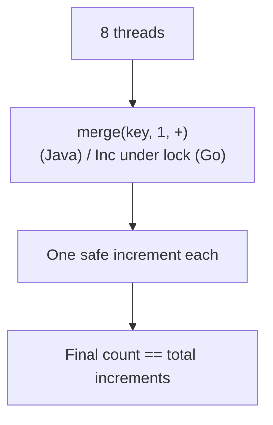

# Concurrent Hash Map — Junior Level

> **Audience:** Programmers who already know what a plain hash map is (Go `map`, Java `HashMap`, Python `dict`) and now want to use one safely from multiple threads/goroutines.
>
> **Focus:** "What is a concurrent hash map?" and "How do I use one without corrupting my data?"

A concurrent hash map is a hash map (key → value store with average O(1) lookups) that is **safe to read and write from many threads at the same time**. This page explains *why a plain hash map breaks under concurrency*, the simplest fix (one big lock), and a first real example in Go, Java, and Python.

---

## Table of Contents

1. [Introduction](#introduction)
2. [Prerequisites](#prerequisites)
3. [Glossary](#glossary)
4. [Why a Plain Hash Map Is Unsafe](#why-a-plain-hash-map-is-unsafe)
5. [The Race Condition, Concretely](#the-race-condition-concretely)
6. [The Simplest Fix — One Big Lock](#the-simplest-fix-one-big-lock)
7. [Core Concepts](#core-concepts)
8. [Big-O Summary](#big-o-summary)
9. [Real-World Analogies](#real-world-analogies)
10. [Pros & Cons](#pros--cons)
11. [Code Examples](#code-examples)
    - [Go](#go)
    - [Java](#java)
    - [Python](#python)
12. [Coding Patterns](#coding-patterns)
13. [Error Handling](#error-handling)
14. [Performance Tips](#performance-tips)
15. [Best Practices](#best-practices)
16. [Edge Cases & Pitfalls](#edge-cases--pitfalls)
17. [Common Mistakes](#common-mistakes)
18. [Cheat Sheet](#cheat-sheet)
19. [Visual Animation](#visual-animation)
20. [Summary](#summary)
21. [Further Reading](#further-reading)

---

## Introduction

A normal hash map is one of the fastest data structures you can use: `get` and `put` are average **O(1)**. But normal hash maps are built for **single-threaded** use. The moment two threads touch the same map at the same time — one reading, one writing, or both writing — you can get **corrupted data**, **wrong answers**, or even a **crash**.

A **concurrent hash map** is a hash map whose operations are **thread-safe**: many threads may call `get`, `put`, and `delete` simultaneously and the structure stays correct. Every mainstream language ships one:

| Language | Plain (unsafe under concurrency) | Concurrent (safe) |
|----------|----------------------------------|-------------------|
| Go | `map[K]V` | `sync.Map`, or a `map` guarded by `sync.Mutex`/`sync.RWMutex` |
| Java | `HashMap` | `ConcurrentHashMap` |
| Python | `dict` | `dict` is *mostly* safe due to the GIL, but compound operations still need a `Lock` |

This page is the "what and how". The deeper "why lock striping" and "when sharding" comes in [`middle.md`](./middle.md).

---

## Prerequisites

- **Required:** Hash maps — keys, values, buckets, collisions, average O(1). See [`../../05-basic-data-structures/05-hash-tables/junior.md`](../../05-basic-data-structures/05-hash-tables/junior.md).
- **Required:** What a *thread* (or Go *goroutine*) is — an independent line of execution that can run at the same time as others.
- **Helpful:** What a *lock* / *mutex* is — a gate that only one thread may hold at a time.
- **Helpful (cross-link):** Compare-and-swap basics in [`../15-cas/junior.md`](../15-cas/junior.md) (referenced later when we explain lock-free maps).

---

## Glossary

| Term | Definition |
|------|-----------|
| **Thread / Goroutine** | An independent unit of execution; multiple can run truly in parallel on multiple CPU cores. |
| **Race condition** | A bug where the result depends on the unpredictable timing of two or more threads. |
| **Data race** | A specific race where two threads access the same memory and at least one writes, with no synchronization. Undefined behavior in Go/Java/C++. |
| **Mutex (lock)** | A "mutual exclusion" gate: only the thread holding it may proceed; others wait. |
| **RWMutex (read-write lock)** | A lock allowing *many readers* OR *one writer* — readers don't block each other. |
| **Critical section** | The block of code protected by a lock. |
| **Thread-safe** | A structure whose operations behave correctly when called concurrently. |
| **Atomic operation** | An operation that completes in one indivisible step — no thread can see it half-done. |
| **CAS (compare-and-swap)** | An atomic "set X to B *only if* X currently equals A" instruction. The building block of lock-free maps. |

---

## Why a Plain Hash Map Is Unsafe

A hash map is not a single number — it is an **array of buckets**, plus a **size counter**, plus internal state used during **resizing**. A single `put` may:

1. Compute the bucket index from `hash(key)`.
2. Walk the bucket's chain to see if the key already exists.
3. Append or overwrite an entry.
4. Increment the size counter.
5. If the map is too full, **allocate a bigger bucket array and move every entry** (a resize).

If two threads run these multi-step operations *interleaved*, they can step on each other:

- **Lost update:** Both read size = 10, both write size = 11. One increment vanished.
- **Corrupted chain:** Two threads append to the same bucket's linked list at once; one node's `next` pointer gets overwritten, dropping entries — or forming a **cycle** that makes future reads spin forever.
- **Reading mid-resize:** A reader looks at the bucket array exactly while a writer is moving entries to a new array. The reader sees a half-built structure and returns "not found" for a key that is present — or dereferences a nil/null pointer and crashes.

```mermaid
graph TD
    subgraph "Two threads, one plain map, NO lock"
    T1["Thread 1: put(\"a\", 1)"] --> B["bucket[3] chain"]
    T2["Thread 2: put(\"b\", 2)"] --> B
    B --> X["Interleaved writes corrupt chain<br/>→ lost entry / infinite loop / crash"]
    end
```

> **Key idea:** A hash map operation *looks* atomic from the outside (`put` "just sets a key") but is actually **many small steps**. Concurrency safety is about making the whole sequence behave as if it were one indivisible step.

---

## The Race Condition, Concretely

Here is the classic "lost update" with a counter living inside a map. Imagine 1000 goroutines each doing `m["hits"]++` once. You'd expect 1000. You often get less.

```text
m["hits"]++ is really three steps:
    1. tmp = m["hits"]      // read
    2. tmp = tmp + 1        // modify
    3. m["hits"] = tmp      // write

Interleaving of Thread A and Thread B:
    A: read  m["hits"] = 41
    B: read  m["hits"] = 41      <- B read the OLD value
    A: write m["hits"] = 42
    B: write m["hits"] = 42      <- B overwrote A's update; one increment LOST
```

In Go this is *also* a **data race** on the map itself — the Go runtime may detect it and crash your program with `fatal error: concurrent map writes`. That crash is actually a *feature*: Go deliberately refuses to let you corrupt a `map`.

---

## The Simplest Fix — One Big Lock

The first real concurrent hash map you should build wraps a plain map with **one mutex**. Every operation locks, does its work, unlocks. This is called a **coarse-grained lock** or **single-locked map**.

```text
get(key):   lock → read → unlock
put(key,v): lock → write → unlock
```

It is **100% correct** and easy to reason about: only one thread is ever inside the map, so it behaves single-threaded. Its weakness is **contention** — if 64 threads all want in, 63 are waiting in line even when they want *different* keys. Fixing that contention is the whole story of [`middle.md`](./middle.md) (lock striping, sharding, per-bucket CAS).

A small upgrade: use a **read-write lock** so that many readers can proceed together (readers don't change anything, so they're safe in parallel) and only writers are exclusive. Great for **read-mostly** maps like caches.

---

## Core Concepts

### Concept 1: Mutual exclusion makes a sequence atomic

A lock turns "many small steps" into "one indivisible step" *from the perspective of other threads*. While Thread A holds the lock, no other thread can observe the map half-modified.

### Concept 2: Readers vs writers

Reading doesn't change the map, so any number of readers are simultaneously safe **as long as no writer is active**. An `RWMutex` encodes exactly this rule: shared read access, exclusive write access. This is the cheapest big win for caches, which read far more than they write.

### Concept 3: Compound operations need one lock, not two

`if !m.Contains(k) { m.Put(k, v) }` is **two** safe operations — but the gap between them is unsafe: another thread can insert `k` in that gap. You need a *single* atomic "put if absent". Every concurrent map provides one: Java `putIfAbsent`, Go `sync.Map.LoadOrStore`, or your own method that holds the lock across the check and the write.

### Concept 4: The size counter is its own little battle

Even when buckets are safe, the single `size` field is hammered by every insert/delete. We'll see later that high-end maps avoid one shared counter entirely (striped counters / `LongAdder`).

---

## Big-O Summary

| Operation | Avg Complexity | Notes |
|-----------|---------------|-------|
| `get(key)` | O(1) | Plus lock acquire/release overhead |
| `put(key, value)` | O(1) amortized | Resize is O(n) but rare; spread over many inserts |
| `delete(key)` | O(1) | |
| `contains(key)` | O(1) | |
| `size()` | O(1) coarse-locked | Becomes the bottleneck at scale (see middle) |

> Concurrency does **not** change the asymptotic complexity. It changes **throughput**: how many operations *per second* you get when many threads run at once. A coarse lock keeps O(1) per op but serializes everything, so throughput stops scaling past ~1 effective thread.

---

## Real-World Analogies

| Concept | Analogy | Where it breaks down |
|---------|---------|----------------------|
| **Plain map, no lock** | A shared whiteboard everyone scribbles on at once — words overwrite each other | A real race can also *crash*, not just garble |
| **One big lock** | A single-occupancy restroom with a lock on the door — correct, but a line forms | Real locks are fast; the "line" only hurts under heavy contention |
| **Read-write lock** | A library reading room: many can read the same notice board, but posting a new notice needs everyone to step back | Writers can *starve* if readers never stop arriving |
| **Lock striping (preview)** | A bank with 16 teller windows instead of one — different customers served in parallel | Two customers needing the *same* window still queue |

---

## Pros & Cons

| Pros | Cons |
|------|------|
| Safe concurrent reads & writes | Some overhead per operation (locking or atomics) |
| Built into every major language | Easy to misuse (compound ops, iteration) |
| Coarse-lock version is trivially correct | Coarse lock doesn't scale with cores |
| Enables shared caches, counters, registries across threads | Iteration semantics are weaker than a plain map |

**When to use:** Any time **two or more threads/goroutines** share a key-value store — caches, in-memory session stores, request routers, shared counters.
**When NOT to use:** Single-threaded code (a plain map is faster and simpler), or when each thread can own its *own* private map and you merge at the end.

---

## Code Examples

The canonical "junior" example: a thread-safe map wrapping a plain map with a read-write lock. Then the built-in concurrent map for each language.

### Go

```go
package main

import (
	"fmt"
	"sync"
)

// SafeMap is a plain map guarded by a read-write mutex.
// Many concurrent readers OR one exclusive writer at a time.
type SafeMap struct {
	mu sync.RWMutex
	m  map[string]int
}

func NewSafeMap() *SafeMap {
	return &SafeMap{m: make(map[string]int)}
}

func (s *SafeMap) Get(key string) (int, bool) {
	s.mu.RLock()         // shared read lock
	defer s.mu.RUnlock()
	v, ok := s.m[key]
	return v, ok
}

func (s *SafeMap) Put(key string, value int) {
	s.mu.Lock()          // exclusive write lock
	defer s.mu.Unlock()
	s.m[key] = value
}

func (s *SafeMap) Delete(key string) {
	s.mu.Lock()
	defer s.mu.Unlock()
	delete(s.m, key)
}

// Inc is an ATOMIC read-modify-write: the whole ++ happens under one lock.
func (s *SafeMap) Inc(key string) {
	s.mu.Lock()
	defer s.mu.Unlock()
	s.m[key]++ // safe: no other thread is inside the map right now
}

func main() {
	sm := NewSafeMap()
	var wg sync.WaitGroup
	for i := 0; i < 1000; i++ {
		wg.Add(1)
		go func() {
			defer wg.Done()
			sm.Inc("hits") // 1000 goroutines, each +1
		}()
	}
	wg.Wait()
	v, _ := sm.Get("hits")
	fmt.Println("hits =", v) // always 1000, never less
}
```

**Go's built-in `sync.Map`** is a ready-made concurrent map, tuned for *read-mostly* / *write-once* keys:

```go
package main

import (
	"fmt"
	"sync"
)

func main() {
	var m sync.Map // zero value is ready to use; no make()

	m.Store("alice", 95)
	m.Store("bob", 82)

	if v, ok := m.Load("alice"); ok {
		fmt.Println("alice =", v) // alice = 95
	}

	// LoadOrStore is an ATOMIC "get-or-insert" — no race in the gap.
	actual, loaded := m.LoadOrStore("alice", 0)
	fmt.Println(actual, loaded) // 95 true  (already present)

	m.Range(func(k, v any) bool { // iterate; return false to stop
		fmt.Printf("%v=%v\n", k, v)
		return true
	})
}
```

> **Run:** `go run main.go` — and always test with `go run -race main.go` to catch data races.

### Java

`ConcurrentHashMap` is the standard. You almost never hand-roll a locked map in Java.

```java
import java.util.concurrent.ConcurrentHashMap;
import java.util.concurrent.ExecutorService;
import java.util.concurrent.Executors;
import java.util.concurrent.TimeUnit;

public class Example {
    public static void main(String[] args) throws InterruptedException {
        ConcurrentHashMap<String, Integer> map = new ConcurrentHashMap<>();

        // Basic, thread-safe operations
        map.put("alice", 95);
        map.put("bob", 82);
        System.out.println(map.get("alice")); // 95

        // ATOMIC get-or-insert — no check-then-act gap
        map.putIfAbsent("alice", 0);
        System.out.println(map.get("alice")); // still 95

        // ATOMIC increment of a counter living in the map:
        // merge() does read-modify-write as one safe step.
        ExecutorService pool = Executors.newFixedThreadPool(8);
        for (int i = 0; i < 1000; i++) {
            pool.submit(() -> map.merge("hits", 1, Integer::sum));
        }
        pool.shutdown();
        pool.awaitTermination(1, TimeUnit.MINUTES);

        System.out.println("hits = " + map.get("hits")); // always 1000
    }
}
```

> **Run:** `javac Example.java && java Example`
> **Never** do `if (!map.containsKey(k)) map.put(k, v);` on a concurrent map — use `putIfAbsent`. The two-call version has a race in the gap.

### Python

Python's CPython has a **Global Interpreter Lock (GIL)** that lets only one thread run Python bytecode at a time. As a side effect, a **single** `dict` operation like `d[k] = v` or `d.get(k)` is effectively atomic. But **compound** operations (read-then-write) are *not*, because the GIL can be released between bytecodes.

```python
import threading

# A single dict operation is atomic under the GIL,
# but d[k] += 1 is read-modify-write -> NOT atomic. Use a Lock.

class SafeMap:
    def __init__(self):
        self._lock = threading.Lock()
        self._d = {}

    def get(self, key, default=None):
        # single dict read is atomic; lock is optional here but harmless
        return self._d.get(key, default)

    def put(self, key, value):
        self._d[key] = value  # single write is atomic under GIL

    def inc(self, key):
        with self._lock:                 # protect the read-modify-write
            self._d[key] = self._d.get(key, 0) + 1


def worker(sm):
    for _ in range(1000):
        sm.inc("hits")

if __name__ == "__main__":
    sm = SafeMap()
    threads = [threading.Thread(target=worker, args=(sm,)) for _ in range(8)]
    for t in threads: t.start()
    for t in threads: t.join()
    print("hits =", sm.get("hits"))  # always 8000 with the Lock
```

> **Note on the GIL:** It makes *individual* `dict` operations atomic, so plain reads/writes of distinct keys are usually fine. It does **not** make `d[k] += 1` or check-then-set safe. And with free-threaded / no-GIL Python (PEP 703, 3.13+ experimental), you can no longer rely on the GIL at all — explicit locks become mandatory. **When in doubt, use a `Lock`.**
> **Run:** `python example.py`

---

## Coding Patterns

### Pattern 1: Get-or-compute (memoization cache)

**Intent:** Return the cached value for a key, computing and storing it once if missing — even under concurrency.

#### Go

```go
func (s *SafeMap) GetOrCompute(key string, compute func() int) int {
	s.mu.Lock()
	defer s.mu.Unlock()
	if v, ok := s.m[key]; ok {
		return v
	}
	v := compute() // NOTE: runs under the lock — keep it cheap, or see senior.md
	s.m[key] = v
	return v
}
```

#### Java

```java
// computeIfAbsent is atomic per key; the lambda runs at most once per key
Integer v = map.computeIfAbsent(key, k -> expensiveCompute(k));
```

#### Python

```python
def get_or_compute(self, key, compute):
    with self._lock:
        if key in self._d:
            return self._d[key]
        v = compute()
        self._d[key] = v
        return v
```

### Pattern 2: Atomic counter map

**Intent:** Many threads increment counters keyed by name. Use the language's atomic merge/inc, never read-then-write by hand.



---

## Error Handling

| Problem | Cause | Fix |
|---------|-------|-----|
| `fatal error: concurrent map writes` (Go) | Plain `map` written from 2+ goroutines | Wrap in mutex or use `sync.Map` |
| Counter total too low | Read-then-write done without a lock (lost update) | Use atomic increment / hold one lock across the whole `++` |
| Key sometimes "missing" then appears | Check-then-act race | Use `putIfAbsent` / `LoadOrStore` |
| `ConcurrentModificationException` (Java, on `HashMap`) | Iterating a non-concurrent map while another thread writes | Use `ConcurrentHashMap` (weakly consistent iterator) |
| Deadlock | Calling back into the locked map (e.g. `compute` re-enters) | Don't call map methods from inside `computeIfAbsent`/under the lock |

---

## Performance Tips

- Prefer **`RWMutex`** over a plain `Mutex` for read-mostly maps — readers run in parallel.
- Keep the **critical section tiny**: never do I/O, sleeps, or heavy compute while holding the lock.
- Use the **built-in atomic methods** (`merge`, `computeIfAbsent`, `LoadOrStore`) instead of manual check-then-act.
- In Go, `sync.Map` shines for *write-once, read-many* keys; a sharded `map+RWMutex` is often faster for a balanced read/write mix (see middle).

---

## Best Practices

- Pick the **built-in concurrent map** first (`ConcurrentHashMap`, `sync.Map`); only hand-roll when you have a measured reason.
- Always run Go programs under `-race` during testing.
- Make every read-modify-write atomic — treat "check then act" as a code smell.
- Document the **thread-safety contract** of any map you expose ("safe for concurrent use").
- Don't hold a lock across blocking calls.

---

## Edge Cases & Pitfalls

- **Iteration during writes:** Concurrent maps give a *weakly consistent* iterator — it won't crash, but it may or may not reflect concurrent inserts. A plain locked map needs the lock held for the *whole* iteration.
- **Nil/None values:** Go `sync.Map` and Java `ConcurrentHashMap` **forbid nil/null keys and values** (null can't distinguish "absent" from "present-but-null"). Plain `HashMap` allows them.
- **The `size()` lie:** On a highly concurrent map, `size()` is a snapshot that may already be stale by the time you read it.
- **Releasing the GIL:** Don't assume Python compound ops are atomic.

---

## Common Mistakes

- Wrapping each *step* in a lock but not the whole *operation* (still racy).
- Using two separate atomic calls where one atomic method exists.
- Sharing one `Mutex` across unrelated maps, serializing everything needlessly.
- Forgetting `defer mu.Unlock()` and leaking the lock on an early return/panic.
- Believing "Python is single-threaded so I don't need locks" — false for read-modify-write.

---

## Cheat Sheet

| Need | Go | Java | Python |
|------|-----|------|--------|
| Safe get/put | `map`+`RWMutex` or `sync.Map` | `ConcurrentHashMap` | `dict` (single ops) |
| Get-or-insert | `LoadOrStore` | `putIfAbsent` | manual under `Lock` |
| Get-or-compute | manual under lock | `computeIfAbsent` | manual under `Lock` |
| Atomic counter | `Inc` under lock / `atomic` | `merge(k,1,Integer::sum)` | `+=` under `Lock` |
| Iterate | `Range` / lock + `for range` | `forEach` / entrySet | `for k in dict` (snapshot keys) |

---

## Visual Animation

> See [`animation.html`](./animation.html) for an interactive visualization.
>
> It shows a bucket array with **per-bucket locks**, multiple threads inserting into different buckets **in parallel** (no waiting), two threads contending on the **same** bucket (one waits), and a **concurrent resize** that transfers buckets to a larger array while reads continue. A live log narrates every lock acquire, CAS, and bucket transfer.

---

## Summary

A plain hash map is unsafe under concurrency because each operation is many small steps that can interleave and corrupt the buckets, the size counter, or an in-progress resize. The simplest correct fix is **one mutex** wrapping the map (an `RWMutex` if reads dominate). Every language ships a tuned concurrent map: Go's `sync.Map`, Java's `ConcurrentHashMap`, and Python's `dict` (atomic for single ops under the GIL, but needing a `Lock` for read-modify-write). Always make compound operations atomic with a single lock or a built-in method.

---

## Further Reading

- Go: `sync` package docs (`Mutex`, `RWMutex`, `Map`); the `-race` detector.
- Java: `java.util.concurrent.ConcurrentHashMap` Javadoc.
- Python: `threading.Lock`; PEP 703 (free-threaded CPython).
- Cross-link: [`../../05-basic-data-structures/05-hash-tables/`](../../05-basic-data-structures/05-hash-tables/) and [`../15-cas/`](../15-cas/).

---

**Next step:** [`middle.md`](./middle.md) — lock striping vs per-bucket CAS (Java 8 ConcurrentHashMap), sharding, and the size problem.
