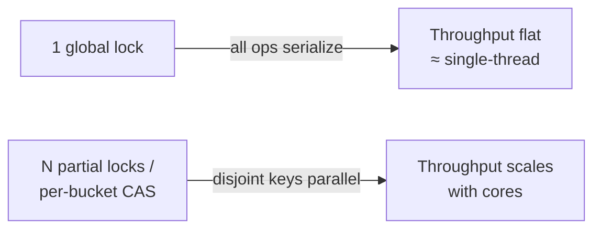
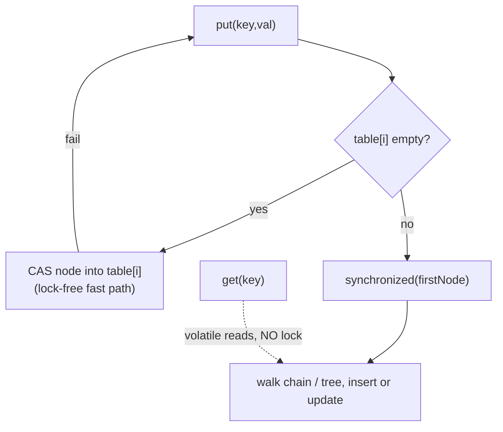
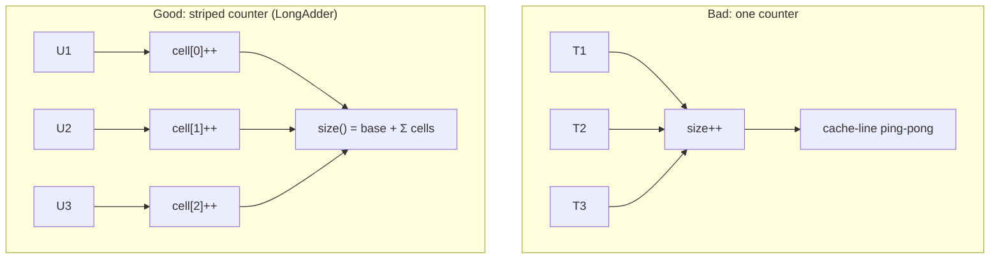

# Concurrent Hash Map — Middle Level

> **Audience:** Engineers who can already wrap a map in a mutex and now want to know *why* that doesn't scale and *what to do instead*. Prerequisite: [`junior.md`](./junior.md).
>
> **Focus:** "Why does a single lock fail under load?" and "When do I choose lock striping vs per-bucket CAS vs sharding?"

This page is about **throughput under contention**. A coarse-locked map is correct but serializes every operation. We'll dissect three escalating strategies — **lock striping / segments** (old Java CHM), **per-bucket CAS + synchronized-on-first-node + tree-bins** (modern Java 8 CHM), and **sharding** — plus the surprisingly hard **size problem** and a head-to-head against `Collections.synchronizedMap`.

---

## Table of Contents

1. [Introduction](#introduction)
2. [The Contention Problem](#the-contention-problem)
3. [Strategy 1 — Lock Striping / Segments (Java 7 CHM)](#strategy-1-lock-striping)
4. [Strategy 2 — Per-Bucket CAS + Synchronized First Node (Java 8 CHM)](#strategy-2-per-bucket-cas)
5. [Tree-Bins — Defending Against Hash Collisions](#tree-bins)
6. [Strategy 3 — Sharding](#strategy-3-sharding)
7. [Comparison of Strategies](#comparison-of-strategies)
8. [The Size Problem (LongAdder Striping)](#the-size-problem)
9. [synchronizedMap vs ConcurrentHashMap](#synchronizedmap-vs-concurrenthashmap)
10. [Code Examples](#code-examples)
11. [Error Handling](#error-handling)
12. [Performance Analysis](#performance-analysis)
13. [Best Practices](#best-practices)
14. [Visual Animation](#visual-animation)
15. [Summary](#summary)

---

## Introduction

The asymptotic complexity of a concurrent map is the same as a plain one: average O(1). The interesting question at this level is **scalability**: as you add CPU cores and threads, does throughput go *up* (good) or flatten out / fall (bad)?

A single global lock flattens immediately. The reason is **Amdahl's Law**: if every operation must pass through one serial gate, the serial fraction is ~100%, so adding cores buys nothing. The fixes all share one idea: **partition the lock** so that operations on *different* keys don't contend.



---

## The Contention Problem

With one mutex, the map's **critical section** is short (O(1)), but it is *shared*. Under high request rates:

- Threads queue on the lock. The OS may **park** waiting threads (context switch ≈ microseconds) — far more expensive than the O(1) map work itself.
- **Cache-line bouncing:** the lock word and the `size` field ping-pong between cores' caches, costing dozens of nanoseconds per transfer.
- Throughput plateaus at roughly **one effective thread** no matter how many cores you own.

The cure is to ensure that two operations on **different keys** rarely touch the same lock or the same cache line. Three designs achieve this with increasing finesse.

### A concrete contention model

Suppose each map op does `W` nanoseconds of useful work and the lock acquire/release costs `L` ns when uncontended but `C` ns when contended (`C ≫ L` because of parking + cache transfers). With one global lock and `P` threads all hammering the map:

```text
Single lock throughput  ≈ 1 / (W + C)      ops/sec   — independent of P (serial gate)
N-way striped, perfect distribution:
                        ≈ min(P, N) / (W + L)         — scales with cores until N stripes saturate
```

The win is the difference between `C` (contended, ~microseconds) and `L` (uncontended, ~nanoseconds), *multiplied* by the parallelism you unlock. This is why even a crude 16-way striping often gives a 10× throughput jump over one lock — you simultaneously dodge the contended-lock penalty **and** run on multiple cores.

### Why reads deserve special treatment

Reads don't mutate anything, so in principle any number can run together. A plain `Mutex` foolishly serializes them anyway. Two cheaper options:

1. **`RWMutex`** — readers share a read lock; one writer takes the write lock exclusively. But the reader-count itself is a shared atomic, so reads still touch one contended cache line (a ceiling we revisit in `senior.md` with RCU).
2. **Lock-free reads** — make the fields a reader observes `volatile`/atomic so the reader needs *no* lock at all. This is the design Java's CHM and Go's `sync.Map` both adopt for the read path, and it's why `get` scales almost perfectly.

---

## Strategy 1 — Lock Striping / Segments (Java 7 CHM)

**Idea:** Instead of one lock, use an array of `N` locks (e.g. 16). Key `k` is governed by `locks[hash(k) % N]`. If two keys map to different stripes, they proceed fully in parallel.

This is exactly how **Java 5–7 `ConcurrentHashMap`** worked, under the name **segments**. The map was an array of `Segment` objects (default 16, the *concurrency level*). Each segment was a small independent hash table with **its own lock** (a `ReentrantLock`). A `put` locked only its segment; a `get` was lock-free (it read `volatile` fields). So up to 16 writers could run concurrently — one per segment.

```text
key "alice" -> hash -> segment 3 -> lock segment 3 -> put inside segment 3
key "bob"   -> hash -> segment 9 -> lock segment 9 -> put inside segment 9   (parallel!)
key "carol" -> hash -> segment 3 -> lock segment 3 -> WAITS for "alice"      (same stripe)
```

**Trade-offs:**
- The *concurrency level* (number of stripes) is fixed at construction. Too few → contention; too many → wasted memory and a slow `size()` (must sum/lock all segments).
- Memory overhead: each segment is a full sub-table with its own array and load-factor bookkeeping.
- Still coarser than ideal — two unrelated keys in the same stripe needlessly serialize.

> **General reusable pattern:** "lock striping" applies to *any* structure, not just maps. Java's `Striped<Lock>` (Guava) hands you N locks keyed by hash. It's the go-to when one lock is too coarse but per-element locks cost too much memory.

---

## Strategy 2 — Per-Bucket CAS + Synchronized First Node (Java 8 CHM)

Java 8 **rewrote** `ConcurrentHashMap` to drop the segment array entirely. The new design is finer-grained and lower-overhead. Its lock granularity is **one bucket** (one slot in the table array), and it leans heavily on **CAS** (see [`../15-cas/`](../15-cas/)).

The rules per `put(key, value)`:

1. Compute the bucket index `i = hash & (n - 1)`.
2. **If `table[i]` is empty:** use a single **CAS** to install the new node — *no lock at all*. If the CAS fails (another thread won the race), retry the whole operation.
3. **If `table[i]` is occupied:** `synchronized` **on the first node of that bucket**, then walk/insert into the chain (or tree). Only threads hitting the *same* bucket's head contend.
4. A special **`ForwardingNode`** is placed at a bucket's head while a resize transfers it (more in [`senior.md`](./senior.md)).



**Why this is better than segments:**

| Aspect | Java 7 Segments | Java 8 Per-Bucket |
|--------|-----------------|-------------------|
| Lock granularity | 1 of N segments (default 16) | 1 of `tableSize` buckets (thousands) |
| Empty-bucket insert | lock the segment | **lock-free CAS** |
| Memory overhead | N full sub-tables | one flat table |
| `get` | lock-free (volatile) | lock-free (volatile) |
| Effective parallel writers | ~16 | ~table size |

`get()` remains **completely lock-free** in both designs: nodes' `val` and `next` fields are `volatile`, so a reader sees a consistent value with no lock — the cornerstone of read-mostly performance.

### The happens-before guarantee that makes lock-free reads safe

Lock-free reads aren't magic — they rely on the language **memory model**. A writer that installs a node via CAS (or writes a `volatile` field) establishes a **happens-before** edge: everything the writer did to build the node *before* the publishing write is guaranteed visible to any reader that *observes* that write. Concretely, in the Java Memory Model a `volatile` write *happens-before* every subsequent `volatile` read of the same field. So a reader either sees the fully-constructed node or doesn't see it at all — never a half-initialized one with a garbage `next` pointer. Go gives the same guarantee through `sync/atomic` and channel/mutex operations; the Go memory model spells out exactly which operations synchronize.

This is the single most important reason you should **not** hand-roll lock-free reads on a plain map by "just reading without a lock." Without the `volatile`/atomic publication, the compiler and CPU are free to reorder the node's field writes *after* the pointer write, and a lock-free reader can observe a torn node. The built-in concurrent maps get this right; ad-hoc code usually doesn't.

---

## Tree-Bins — Defending Against Hash Collisions

Chaining degrades to O(n) if too many keys land in one bucket — and an attacker who knows your hash function can *force* that (a **hash-flooding DoS**). Java 8 CHM defends with **treeification**: when a single bucket's chain length exceeds **8** *and* the table is large enough (≥64), that bucket's linked list is converted into a **red-black tree**, making worst-case bucket operations **O(log n)** instead of O(n). If the bin shrinks below 6, it untreeifies back to a list.

```text
bucket chain grows ... 7, 8 nodes -> still a list
                       9th node    -> TREEIFY -> red-black tree -> O(log k) lookups
removals shrink it to 6 nodes      -> UNTREEIFY -> back to a list
```

This single feature turns the *worst case* from a linear scan (and a viable DoS vector) into a logarithmic tree walk.

---

## Strategy 3 — Sharding

**Sharding** is lock striping you build yourself, at the *map* level: keep an array of `N` **independent** `(mutex, plain map)` pairs and route each key to `shard[hash(key) % N]`. It's the idiomatic high-throughput concurrent map in **Go**, where there's no built-in striped map (`sync.Map` is read-optimized, not write-optimized).

```text
ShardedMap = [ {mu0, map0}, {mu1, map1}, ..., {mu15, map15} ]
op(key): s := shard[hash(key) % N]; s.mu.Lock(); ... ; s.mu.Unlock()
```

- **Pros:** simple, predictable, scales to N concurrent writers, trivially uses `RWMutex` per shard for read-mostly workloads.
- **Cons:** fixed shard count; uneven key distribution can hot-spot one shard; a global `size()` must lock/sum all shards; iteration over a consistent snapshot is awkward.
- **Sizing rule of thumb:** shards ≈ next power of two ≥ expected concurrent writers (often 16–256). Power-of-two lets you use `hash & (N-1)` instead of `%`.

> **Lock striping vs sharding** are the *same idea* at different layers: striping shares one bucket array but splits the locks; sharding splits the bucket arrays too. Sharding is easier to reason about; striping is more memory-efficient.

### Choosing a route function

The router `hash(key) % N` (or `hash(key) & (N-1)`) decides which shard/stripe a key lands in. Two failure modes:

- **Weak hash → skew.** If you route on `key.hashCode() & (N-1)` and the low bits of your keys aren't well-mixed (e.g. sequential integer IDs with N a power of two), keys clump into a few shards. Java CHM defends by *spreading* the hash first: `h ^ (h >>> 16)` folds the high bits down so they influence bucket selection. Do the same in a hand-rolled router.
- **Identity vs value keys.** Make sure your hash and equality are by *value* (the key's content), not object identity, or two equal keys may land in different shards and both get inserted.

A good default: route with a well-mixed hash (FNV-1a, xxHash, or `hashCode` spread) masked to a power-of-two shard count.

---

## Comparison of Strategies

| Strategy | Lock unit | Empty-slot insert | Read path | Scales to | Used by |
|----------|-----------|-------------------|-----------|-----------|---------|
| Single global lock | whole map | locked | locked (or RLock) | 1 writer | `Collections.synchronizedMap`, naive Go wrap |
| **Lock striping / segments** | 1 of N stripes | lock stripe | lock-free | ~N writers | Java 7 CHM, Guava `Striped` |
| **Per-bucket CAS + sync head** | 1 bucket | **CAS, lock-free** | lock-free | ~tableSize | Java 8+ CHM |
| **Sharding** | 1 of N sub-maps | lock shard | lock shard (or RLock) | ~N writers | Go idiom, many caches |
| Lock-free / split-ordered | none | CAS | CAS/lock-free | many | senior.md |

---

## The Size Problem

Counting elements is shockingly hard under concurrency. A single shared `int size` field, incremented on every insert, becomes the **single most-contended cache line in the whole map** — worse than any bucket, because *every* writer touches it. You've partitioned the buckets beautifully and then funneled all of them back through one counter.

The fix is to **stripe the counter** too. Java 8 CHM uses an internal mechanism identical to **`LongAdder`**:

- Keep an array of counter cells (`CounterCell[]`), one per "hot" thread region.
- Each insert CASes into *its* cell (chosen by a thread-local probe), so increments spread across cache lines.
- `size()` = base + sum of all cells. It is **approximate / weakly consistent** — by the time you read it, it may be stale, which is acceptable.



> **Takeaway:** `size()`/`mappingCount()` on a concurrent map is a *best-effort snapshot*, not a transactional truth. If you need an exact instantaneous count, you must stop the world — which defeats the purpose.

---

## synchronizedMap vs ConcurrentHashMap

`Collections.synchronizedMap(new HashMap<>())` wraps a `HashMap` so every method is `synchronized` on one lock — it is the "single global lock" design.

| Attribute | `synchronizedMap` | `ConcurrentHashMap` |
|-----------|-------------------|---------------------|
| Lock granularity | One lock for entire map | Per-bucket (Java 8) |
| Concurrent reads | Serialized (one at a time) | Lock-free, fully parallel |
| Concurrent writes | Serialized | Parallel across buckets |
| `null` keys/values | Allowed | **Forbidden** |
| Iteration safety | Must hold lock manually for whole loop, else `ConcurrentModificationException` | Weakly consistent iterator, no lock, never throws CME |
| Compound atomics | None built-in | `putIfAbsent`, `compute`, `merge`, `computeIfAbsent` |
| Throughput under contention | Flat | Scales with cores |

**Choose `ConcurrentHashMap`** for anything multi-threaded and hot. **`synchronizedMap`** survives only in legacy code or when you genuinely need `null` keys/values and have low contention.

---

## Decision Guide — Which Strategy When

| Situation | Recommended design | Why |
|-----------|--------------------|-----|
| Java, any multi-threaded map | `ConcurrentHashMap` | Per-bucket CAS, atomic compound ops, treeify, free `get` |
| Go, balanced read/write | Sharded `map`+`RWMutex` | `sync.Map` is read-optimized, not write-optimized |
| Go, write-once-then-read keys | `sync.Map` | Tuned for stable keys; avoids per-shard locking on reads |
| Hot atomic counters keyed by name | Striped counter / `LongAdder` + CHM `merge` | Avoids the single-counter cache line |
| Low contention, need `null` keys | `synchronizedMap` | Simpler; contention isn't the bottleneck |
| Custom DS with one-too-coarse lock | Guava `Striped<Lock>` / hand-rolled striping | Reuse the lock-striping pattern beyond maps |

**Choose lock striping when:** you have one shared array/structure and only the *lock* is too coarse — striping splits the lock without duplicating the data.

**Choose sharding when:** you want the simplest mental model and don't mind N independent sub-maps; great in Go where there's no built-in striped map.

**Choose per-bucket CAS (i.e. just use CHM) when:** you're on the JVM and want the finest practical granularity with lock-free reads for free.

---

## Code Examples

### Go — a sharded concurrent map (the idiomatic high-throughput choice)

```go
package main

import (
	"fmt"
	"hash/fnv"
	"sync"
)

const shardCount = 32 // power of two; ~ expected concurrent writers

type shard struct {
	mu sync.RWMutex
	m  map[string]int
}

type ShardedMap struct {
	shards [shardCount]*shard
}

func NewShardedMap() *ShardedMap {
	sm := &ShardedMap{}
	for i := range sm.shards {
		sm.shards[i] = &shard{m: make(map[string]int)}
	}
	return sm
}

func (sm *ShardedMap) shardFor(key string) *shard {
	h := fnv.New32a()
	h.Write([]byte(key))
	return sm.shards[h.Sum32()&(shardCount-1)] // hash & (N-1), N power of two
}

func (sm *ShardedMap) Get(key string) (int, bool) {
	s := sm.shardFor(key)
	s.mu.RLock()
	defer s.mu.RUnlock()
	v, ok := s.m[key]
	return v, ok
}

func (sm *ShardedMap) Put(key string, val int) {
	s := sm.shardFor(key)
	s.mu.Lock()
	defer s.mu.Unlock()
	s.m[key] = val
}

// Len walks every shard — the "size problem" made visible.
func (sm *ShardedMap) Len() int {
	total := 0
	for _, s := range sm.shards {
		s.mu.RLock()
		total += len(s.m)
		s.mu.RUnlock()
	}
	return total // best-effort snapshot; may be stale immediately
}

func main() {
	sm := NewShardedMap()
	var wg sync.WaitGroup
	for i := 0; i < 1000; i++ {
		wg.Add(1)
		k := fmt.Sprintf("key-%d", i)
		go func(k string) { defer wg.Done(); sm.Put(k, 1) }(k)
	}
	wg.Wait()
	fmt.Println("len =", sm.Len()) // 1000
}
```

### Java — ConcurrentHashMap's atomic compound operations

```java
import java.util.concurrent.ConcurrentHashMap;

public class Compound {
    public static void main(String[] args) {
        ConcurrentHashMap<String, Integer> m = new ConcurrentHashMap<>();

        // Atomic per-key operations replace racy check-then-act:
        m.putIfAbsent("a", 1);              // insert only if absent
        m.merge("hits", 1, Integer::sum);   // atomic counter increment
        m.compute("a", (k, v) -> v + 10);   // atomic read-modify-write
        m.computeIfAbsent("cache", k -> expensiveLoad(k)); // load once

        // Weakly consistent iteration: never throws ConcurrentModificationException
        m.forEach((k, v) -> System.out.println(k + "=" + v));

        // size() is a snapshot; for >2^31 entries use mappingCount() (long)
        System.out.println("size=" + m.size());
    }
    static int expensiveLoad(String k) { return k.length(); }
}
```

### Python — note on GIL atomicity and a striped-lock map

```python
import threading

# Under CPython's GIL, a SINGLE dict op is atomic, but d[k] += 1 is not.
# For higher write throughput across threads, stripe the locks like Java 7 CHM.

class StripedMap:
    def __init__(self, stripes=16):
        self._n = stripes
        self._locks = [threading.Lock() for _ in range(stripes)]
        self._maps = [dict() for _ in range(stripes)]

    def _idx(self, key):
        return hash(key) % self._n

    def put(self, key, value):
        i = self._idx(key)
        with self._locks[i]:
            self._maps[i][key] = value

    def get(self, key, default=None):
        i = self._idx(key)
        with self._locks[i]:
            return self._maps[i].get(key, default)

    def inc(self, key):
        i = self._idx(key)
        with self._locks[i]:               # only this stripe contends
            self._maps[i][key] = self._maps[i].get(key, 0) + 1

# NOTE: with the GIL, true parallel speedup is limited for CPU-bound code,
# but striping still reduces lock contention for I/O-bound / no-GIL builds.
```

---

## Iteration Semantics — Weakly Consistent

A plain `HashMap` iterator is **fail-fast**: if the map is structurally modified during iteration, it throws `ConcurrentModificationException`. That's useless concurrently. `ConcurrentHashMap`'s iterator is instead **weakly consistent**:

- It **never throws** `ConcurrentModificationException`.
- It reflects the map state **at or after** iterator creation; it *may* (but is not guaranteed to) reflect modifications made after the iterator was created.
- It traverses each element **at most once**.

This is a deliberate trade: you give up a transactional snapshot in exchange for a lock-free, crash-free traversal. If you genuinely need a consistent snapshot, copy under a lock (a sharded map) or hold an immutable COW version (`senior.md`). For a sharded map, "iterate" means lock each shard in turn and copy it — the result is consistent *per shard* but not globally atomic.

```text
weakly consistent  : never crashes, sees a moving target, each entry once   (CHM, sync.Map.Range)
fail-fast          : crashes on concurrent modification                      (plain HashMap)
snapshot           : consistent point-in-time copy, O(n) to build           (COW / lock-and-copy)
```

---

## Error Handling

| Scenario | What goes wrong | Correct approach |
|----------|-----------------|------------------|
| Wrong concurrency level (Java 7) | Too few stripes → contention | Size to expected writer count; Java 8 made this auto |
| Hot shard | One key range dominates traffic | Better hash, or salt keys; more shards |
| Counting under load | `size()` reads a stale/locked value | Accept approximate count (striped counter) |
| Re-entrant `computeIfAbsent` | Lambda touches the same map → can deadlock/loop | Never call back into the map inside the remapping function |
| Iterating + mutating | Plain locked map throws CME | Use CHM weak iterator, or copy keys under lock |

---

## Performance Analysis

Benchmark the three designs under a write-heavy, multi-thread load. Expected qualitative result:

```text
8 threads, 1M puts of distinct keys:
  Collections.synchronizedMap : ~1x   (serialized; flat with more threads)
  Java 7 segmented CHM (cl=16) : ~6-10x
  Java 8 per-bucket CHM        : ~8-15x (lock-free empty-slot inserts)
  Go sharded map (32 shards)   : scales with cores until shard skew dominates
```

```go
import (
	"fmt"
	"sync"
	"time"
)

func benchSharded(threads, opsPer int) {
	sm := NewShardedMap()
	var wg sync.WaitGroup
	start := time.Now()
	for t := 0; t < threads; t++ {
		wg.Add(1)
		go func(t int) {
			defer wg.Done()
			for i := 0; i < opsPer; i++ {
				sm.Put(fmt.Sprintf("k-%d-%d", t, i), i)
			}
		}(t)
	}
	wg.Wait()
	fmt.Printf("threads=%d ops=%d: %v\n", threads, threads*opsPer, time.Since(start))
}
```

```java
public static void benchCHM(int threads, int opsPer) throws InterruptedException {
    var m = new java.util.concurrent.ConcurrentHashMap<String, Integer>();
    var pool = java.util.concurrent.Executors.newFixedThreadPool(threads);
    long start = System.nanoTime();
    for (int t = 0; t < threads; t++) {
        final int tid = t;
        pool.submit(() -> { for (int i = 0; i < opsPer; i++) m.put("k-" + tid + "-" + i, i); });
    }
    pool.shutdown();
    pool.awaitTermination(1, java.util.concurrent.TimeUnit.MINUTES);
    System.out.printf("threads=%d: %.1f ms%n", threads, (System.nanoTime()-start)/1e6);
}
```

```python
import time, threading

def bench_striped(threads, ops_per):
    sm = StripedMap(32)
    def work(t):
        for i in range(ops_per):
            sm.put(f"k-{t}-{i}", i)
    ts = [threading.Thread(target=work, args=(t,)) for t in range(threads)]
    start = time.perf_counter()
    for t in ts: t.start()
    for t in ts: t.join()
    print(f"threads={threads}: {(time.perf_counter()-start)*1000:.1f} ms")
```

---

## Best Practices

- Default to the **language-native concurrent map**; reach for a custom sharded map only when measurements justify it.
- Choose shard/stripe count as a **power of two ≥ peak concurrent writers**; use `hash & (N-1)`.
- Treat `size()` as **approximate**. If you need exact counts, rethink the design.
- Use **atomic compound methods** (`merge`, `compute`, `putIfAbsent`) — never check-then-act.
- For read-mostly maps, prefer `RWMutex` per shard or rely on CHM's lock-free reads.

---

## Visual Animation

> See [`animation.html`](./animation.html). The middle-level value: watch threads **CAS into empty buckets with no lock**, **synchronize on the first node** when a bucket is occupied, and observe how disjoint keys proceed in parallel while same-bucket keys serialize — exactly the Java 8 design.

---

## Summary

A single lock is correct but serial; scalability comes from **partitioning the lock**. Java 7 used **segments** (N independent sub-tables, lock-free reads). Java 8 went finer: **CAS to install into empty buckets, `synchronized` on the first node otherwise, red-black tree-bins** to bound worst-case collisions. **Sharding** is the do-it-yourself version, idiomatic in Go. Across all of them, **counting** is the sneaky bottleneck, solved by **striping the counter** (`LongAdder`) and accepting an approximate `size()`. Versus `synchronizedMap`, `ConcurrentHashMap` wins on parallel reads, parallel writes, weak-iterator safety, and atomic compound operations.

---

**Next step:** [`senior.md`](./senior.md) — building KV-stores and caches: lock-free / split-ordered lists, RCU read-mostly maps, concurrent resize, NUMA and false sharing.
