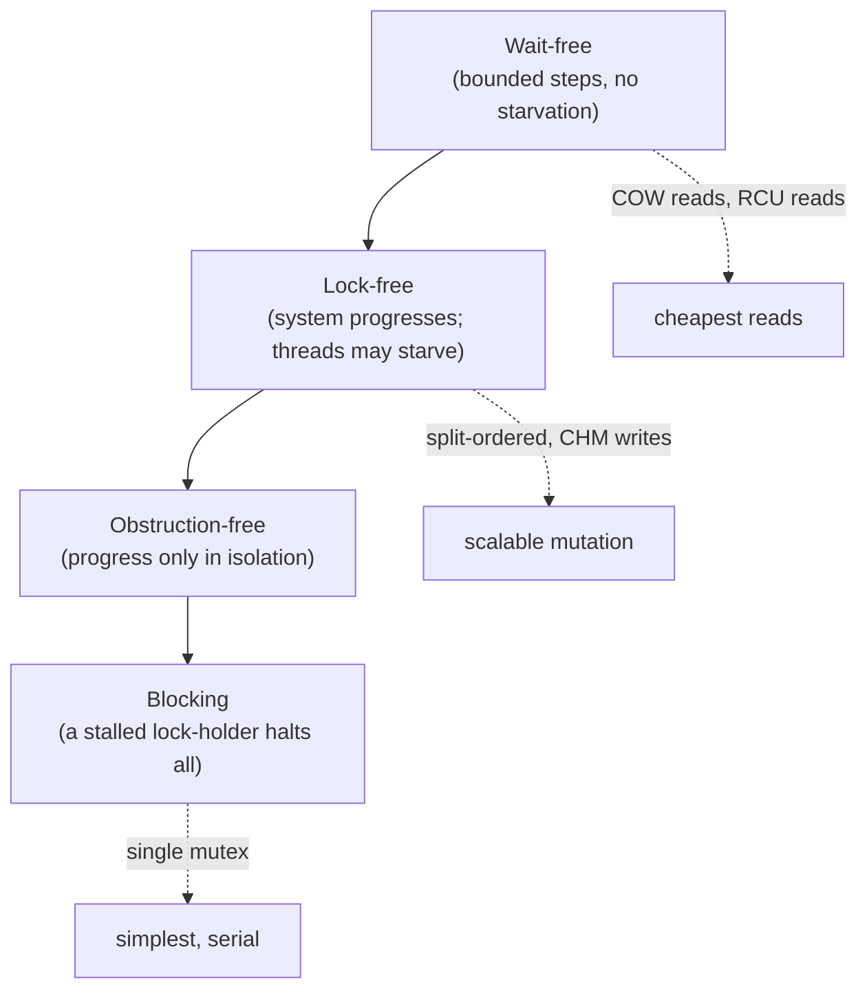

# Concurrent Hash Map — Correctness Theory and Formal Analysis

> **Audience:** Engineers and researchers who must *prove* a concurrent map correct, reason about its progress guarantees, and quantify the read-side cost of RCU. Prerequisite: all prior levels, plus comfort with memory models and linearizability.
>
> **Focus:** linearizability, split-ordered-list lock-freedom, concurrent-resize correctness, and RCU read-side cost analysis.

A single-threaded map is "correct" if it returns what you put in. A *concurrent* map needs a far stronger and more precise notion of correctness — one that survives arbitrary interleavings and weak memory hardware. This document develops the formal machinery: **linearizability** as the correctness condition, **progress hierarchy** (wait-free / lock-free / obstruction-free) as the liveness condition, a proof sketch of **lock-freedom for the split-ordered list**, an invariant-based **correctness proof of cooperative resize**, and an asymptotic + constant-factor **cost model for RCU reads**.

> **Why this level matters.** At junior/middle/senior you *use* and *choose* concurrent maps; here you must be able to *justify* one to a skeptical reviewer or *debug* a heisenbug that only appears on ARM under load. The tools below — linearization points, happens-before edges, invariants, consensus numbers, impossibility results — are the vocabulary of that justification. They turn "it seems to work" into "it cannot fail, and here is why."

---

## Table of Contents

1. [Linearizability — The Correctness Condition](#linearizability)
2. [The Memory Model Substrate](#memory-model)
3. [Progress Conditions — Wait-Free, Lock-Free, Obstruction-Free](#progress)
4. [Lock-Freedom of the Split-Ordered List](#split-ordered-proof)
5. [Correctness of Cooperative Concurrent Resize](#resize-correctness)
6. [Safe Memory Reclamation](#smr)
7. [RCU Read-Side Cost Analysis](#rcu-cost)
8. [The Count Problem — Formal View](#count-problem)
9. [Comparison of Guarantees](#comparison)
10. [Summary](#summary)

---

<a name="linearizability"></a>
## 1. Linearizability — The Correctness Condition

The standard correctness condition for concurrent objects is **linearizability** (Herlihy & Wing, 1990).

```text
Definition (Linearizability).
A concurrent history H (a sequence of operation invocation/response events) is
linearizable iff there exists a linearization point for each operation — a single
instant between its invocation and its response — such that ordering operations by
their linearization points yields a legal SEQUENTIAL history of the object that is
consistent with the real-time order of H.

Real-time order: if op A returns before op B is invoked, then A precedes B in the
sequential history. Concurrent (overlapping) ops may be ordered either way.
```

Intuition: every operation **appears to take effect atomically at one point** between its call and return. A linearizable map behaves, to any observer, exactly like a single-locked map — but without the lock's serialization cost.

Linearizability is strictly stronger than **sequential consistency** (which drops the real-time-order requirement) and strictly weaker than **strict serializability** (which is the multi-object transactional analogue). For a single map object it is exactly the right granularity: strong enough that callers can reason as if operations were instantaneous, weak enough to permit lock-free, highly concurrent implementations.

**Linearization points of map operations:**

| Operation | Linearization point |
|-----------|---------------------|
| `get(k)` (hit) | the `volatile`/atomic load that reads the node's value |
| `get(k)` (miss) | the load that observes the bucket end / sentinel without `k` |
| `put(k,v)` (new) | the successful **CAS** that installs the node, or the publish store under the bin lock |
| `put(k,v)` (update) | the store that overwrites the value field |
| `remove(k)` | the CAS that marks the node logically deleted (the *mark*, not the physical unlink) |

> **Key subtlety:** for lock-free lists, deletion linearizes at the **logical mark** (setting the "deleted" bit on the `next` pointer), *not* at the physical unlinking. Physical unlinking is cleanup that may happen later or be done by another thread; it must not change the abstract state.

**Why not just sequential consistency?** Linearizability is **compositional** (local): if every object is linearizable, the whole system is — which sequential consistency does not guarantee. This is what lets us compose a linearizable map into a larger linearizable system.

### Worked example: a `put`/`get` interleaving is linearizable

```text
History H (real time left→right):
  T1: |---- put(k, 5) ----|
  T2:        |--- get(k) ---|            (overlaps T1)
  T3:                          |- get(k) -|   (starts after T1 returns)

Legal linearizations must respect real-time order:
  - T3.get is AFTER T1.put returns -> T3 must see 5. (real-time edge T1→T3)
  - T2.get OVERLAPS T1.put -> may linearize before (returns "absent") OR after
    (returns 5). BOTH are linearizable.

So a correct map MAY return absent or 5 for T2, but MUST return 5 for T3.
A bug where T3 returns "absent" is a linearizability VIOLATION — the put's effect
was not visible after it returned.
```

This example pins down what we must prove for any design: (1) the effect of a completed write is visible to every later-starting read (real-time edge), and (2) overlapping operations have *some* consistent order. Memory barriers (next section) give (1); the linearization-point assignment gives (2).

### The non-compositionality of `size()`

A crucial caveat: even if every *single-key* operation is linearizable, a multi-key operation like `size()` or `putAll` is **not automatically** linearizable, because it reads/writes multiple linearizable sub-objects (shards/cells) that can each linearize at different instants. We return to this in §8 — it's the formal root of "size is only approximate."

---

<a name="formal-map"></a>
### Formal object specification

```text
A concurrent map is a linearizable object M over key space K, value space V:
  state σ : K ⇀ V        (a partial function)
  put(k,v):  σ' = σ[k ↦ v];          returns old σ(k) or ⊥
  get(k):    returns σ(k) or ⊥;       σ unchanged
  remove(k): σ' = σ \ {k};            returns old σ(k) or ⊥
Sequential spec S = the set of all histories obeying these transitions in order.
Correctness: every concurrent history H is linearizable to some history in S.
```

The whole document proves that specific implementations refine this spec under concurrency. Each operation's *linearization point* is the instant its transition takes effect atomically; §2 supplies the hardware guarantee that makes those instants globally agreed-upon.

---

<a name="memory-model"></a>
## 2. The Memory Model Substrate

Linearizability assumes atomic operations are ordered. Real hardware and language memory models (JMM, Go memory model, C++11) permit **reordering** unless you insert barriers. The map's proofs rest on specific guarantees:

```text
Release/acquire (the publish/subscribe idiom):
  Writer:  build node fully;  store-release(slot, node)   // all prior writes visible
  Reader:  node = load-acquire(slot);  read node fields    // sees those writes

Guarantee: a reader that observes the published pointer also observes every write the
writer did to the node BEFORE the release store. (JMM: volatile; Go: sync/atomic +
happens-before; C++: memory_order_release / _acquire.)
```

This is why CHM declares node `val`/`next` **`volatile`** and uses `tabAt`/`casTabAt` (which compile to acquire loads / CAS): a reader either sees a fully-constructed node or doesn't see it at all — never a half-initialized one. Every "linearization point" above is a release/acquire (or CAS, which is both) so the abstract-state transition is globally ordered.

### Why a plain read can observe a torn node (the bug we're preventing)

```text
Writer (NO release barrier):
  node.key  = k        // (a)
  node.val  = v        // (b)
  slot      = node     // (c)  plain store — CPU/compiler may reorder (c) before (a)/(b)!

Reader (NO acquire barrier):
  n = slot             // sees node...
  use n.val            // ...but (b) may not be visible yet -> reads garbage/zero
```

Release/acquire forbids exactly this: the release store (c) cannot be reordered before (a)/(b), and a matching acquire load forces the reader to observe (a)/(b) once it observes (c). This is a *correctness* requirement, not an optimization — without it the map is not linearizable on weakly-ordered hardware (ARM, POWER). x86's stronger TSO model hides many such bugs, which is why they surface only when the code ships to ARM servers.

### Synchronization edges per operation

| Operation | Synchronizes-with edge | Establishes |
|-----------|------------------------|-------------|
| `put` (CAS install) | CAS = release+acquire | builder's writes → future readers |
| `put` (update val) | `volatile` store of `val` | new value → future `get` |
| `get` | `volatile`/acquire load | sees all writes before the matching release |
| resize publish | release store of `ForwardingNode` | new sub-bins → redirected ops |

---

<a name="progress"></a>
## 3. Progress Conditions — Wait-Free, Lock-Free, Obstruction-Free

Correctness (linearizability) says nothing about *liveness*. Progress is a separate hierarchy:

```text
Wait-free  (strongest): every thread completes its operation in a bounded number of
           its own steps, regardless of other threads. No starvation, ever.

Lock-free  : some thread makes progress in a bounded number of steps of the system.
           Individual threads may starve, but the system never stalls. A failed CAS
           means SOMEONE ELSE succeeded.

Obstruction-free (weakest): a thread completes if it eventually runs in isolation
           (no contention). Livelock is possible under contention.

Blocking   (not in the hierarchy): a stalled lock-holder can halt everyone (priority
           inversion, convoying, deadlock).
```



| Map design | Reads | Writes | Notes |
|------------|-------|--------|-------|
| Single lock | blocking | blocking | lock-holder stall = global stall |
| Java 8 CHM | **lock-free** | mostly lock-free (CAS); blocking on populated bin | get() never blocks |
| Split-ordered list | lock-free | lock-free | CAS retry loops |
| COW map | **wait-free** | lock-free (CAS publish) | reads = 1 atomic load |
| RCU map | **wait-free (bounded)** read side | blocking writer | reader does no CAS at all |

The takeaway: **reads can be the strongest guarantee (wait-free)** in COW and RCU, which is precisely why they win read-mostly workloads — a reader can never be blocked or forced to retry.

---

<a name="split-ordered-proof"></a>
## 4. Lock-Freedom of the Split-Ordered List

We sketch why the split-ordered list (Shalev–Shavit) is lock-free and linearizable.

**Structure recap.** One Harris–Michael lock-free sorted linked list holds all keys ordered by **bit-reversed hash**. The bucket array holds pointers to **sentinel nodes** that partition the list. Resize adds sentinels; it never moves data nodes.

```text
Invariant I1 (sorted): the list is always sorted by (bitReverse(hash) , key).
Invariant I2 (sentinels): every initialized bucket b points to a sentinel whose
            key is bitReverse(b); sentinels are never deleted.
Invariant I3 (reachability): every live data node is reachable from the head by
            following next pointers, and from its bucket's sentinel.
```

**Insert** (`find` then CAS):
```text
1. From bucket sentinel, traverse to find predecessor pred and successor curr with
   pred.key < newKey <= curr.key.
2. new.next = curr;  CAS(pred.next, curr, new).
3. If CAS fails, another thread changed pred.next -> restart find. (lock-free retry)
```
**Delete** (logical mark + physical unlink, Harris):
```text
1. CAS(curr.next, succ, mark(succ))   // logical delete = set the mark bit. LP HERE.
2. CAS(pred.next, curr, succ)          // physical unlink (may be done by a helper)
```

**Lock-freedom argument.**
```text
Claim: in any infinite execution, infinitely many operations complete.
Each operation either (a) succeeds its CAS and finishes, or (b) fails its CAS.
A CAS on pred.next fails ONLY because some other thread's CAS on the same word
succeeded since this thread's read. Thus every failed CAS is matched by a successful
CAS by another thread = a completed step of progress. Therefore the system cannot
make all threads loop forever without any completing: some thread always advances.
=> lock-free (not wait-free: one unlucky thread may retry unboundedly). QED (sketch)
```

**Linearizability argument.** Insert linearizes at the successful `CAS(pred.next,...)`; lookup linearizes at the read that finds (or fails to find) the key in the sorted traversal; delete linearizes at the **logical mark** CAS. Because the list is always sorted (I1) and a marked node is treated as absent by `find`, the sequence of linearization points yields a legal sequential set/map history.

**Resize correctness.** Adding a bucket only inserts a sentinel into the existing sorted list at the position dictated by bit-reversal. By I1, that position already separates the two halves of the old bucket, so the sentinel insert is just another lock-free list insert — it cannot lose or duplicate any data node. Hence resize preserves I1–I3 and never violates linearizability of concurrent get/put/remove.

---

<a name="resize-correctness"></a>
## 5. Correctness of Cooperative Concurrent Resize

Now the harder case: Java-8-style resize that **moves data** from an old table `T` to a new table `T'` of double size, with many threads helping. We prove that no key is lost or duplicated and reads stay linearizable.

```text
Setup: each old bucket i is processed exactly once. While processing, its head is
replaced by a ForwardingNode fwd pointing to T'. A node whose hash bit (the new
high bit) is 0 goes to T'[i]; bit 1 goes to T'[i + |T|].  (CHM splits each bin in two.)

Per-bucket transfer protocol:
  state(i) ∈ {UNMOVED, MOVING, MOVED}
  A thread CASes state(i): UNMOVED -> MOVING to claim bucket i (others skip it).
  It builds the two sub-bins for T', then store-release T[i] = ForwardingNode(T').
  ForwardingNode publication is the linearization point of "bucket i moved".
```

```text
Invariant R1 (single mover): at most one thread is in MOVING for bucket i — guaranteed
            by the claiming CAS. => no double transfer, no torn bin.
Invariant R2 (redirect): once T[i] holds a ForwardingNode, every get/put on a key
            hashing to i FOLLOWS the forward into T' and operates there.
Invariant R3 (key conservation): a key k present before resize is, at every instant,
            findable in exactly one place:
              - if bucket(k) is UNMOVED  -> in T at T[bucket_T(k)]
              - if MOVED                 -> in T' at T'[bucket_T'(k)] (redirected via fwd)
```

**Theorem (no lost reads).** Any `get(k)` concurrent with resize returns `k`'s value iff `k` is in the map.
```text
Proof. Consider get(k)'s traversal. It reads T[i]:
  Case A: T[i] is a normal node -> i is UNMOVED (R1, R3); k, if present, is in this bin.
          Linearize at the node read.
  Case B: T[i] is a ForwardingNode -> by R2 follow to T', recompute bucket, retry there.
          By R3 the key (if present) is now in T'. The forward is a release store, so
          the reader sees the fully-built T' sub-bins (acquire). Linearize in T'.
  The traversal terminates: there are at most two tables in flight (CHM forbids starting
  a new resize before the current one finishes), so at most one forward-follow occurs.
∎
```

**Theorem (no lost writes).** A `put(k,v)` either completes in the old bin (if it claims/sees it UNMOVED and CASes there before any forward), or is redirected and completes in `T'`. The claiming CAS (R1) plus ForwardingNode publication (R2) ensure a put can never write into a bin that is concurrently being abandoned: a put that finds a ForwardingNode must help/redirect; a put on a MOVING bin under the bin lock is serialized with the mover holding that same bin lock. Hence every accepted write is reflected in the final table. ∎

**Termination / progress.** Each bucket is claimed once and the table count is finite, so resize completes in O(|T|) transfer work spread across helpers; each helper does bounded work per op it performs, so individual operations stay (near) lock-free.

### Amortized cost of cooperative resize (potential method)

We show insertions remain **O(1) amortized** despite O(n) resizes, using the potential method.

```text
Let n = #entries, m = #buckets, load α = n/m, growth threshold α* = 0.75.
Define potential Φ = c · (2n − m)  for some constant c > 0, valid while n ≥ m/2
(i.e. after the table has been at least half-filled since the last resize).

Insert without resize:
  actual cost = O(1) (CAS or sync-head append)
  ΔΦ = c·2  (n increases by 1)
  amortized = O(1) + 2c = O(1).

Insert that triggers resize (m → 2m, transferring n entries):
  actual cost = O(1) + O(n)   (the transfer work, possibly shared, but bound it by n)
  Just before resize n ≈ 0.75·m, so Φ_before = c(2·0.75m − m) = c(0.5m).
  After resize m' = 2m, n unchanged: Φ_after = c(2·0.75m − 2m) = c(−0.5m) → clamp/redefine.
  The accumulated potential c·0.5m ≥ (transfer cost)/k for suitable c pays for the O(n)=O(m) move.
  amortized = O(1).

Conclusion: total cost of any sequence of I inserts = O(I). Each insert is O(1) amortized.
Cooperative helping only REDISTRIBUTES the same O(n) transfer work across threads; it does
not change the amortized bound, it improves the per-operation WORST case (tail latency).
```

The key professional insight: **cooperative resize changes the *distribution* of the resize cost, not its *amortized total***. Amortized analysis proves average O(1); the cooperative mechanism additionally bounds the per-operation worst case to a single stride, protecting tail latency — two distinct, complementary guarantees.

---

<a name="smr"></a>
## 6. Safe Memory Reclamation

Lock-free maps create the **use-after-free hazard**: a thread logically removes node `x` and wants to free it, but another thread may still hold a pointer into `x`. Reclamation schemes solve this:

```text
Hazard Pointers (Michael): each thread publishes the pointers it is about to dereference
  in a global per-thread "hazard" slot. A reclaimer frees x only if NO thread's hazard
  slot equals x. Cost: O(H) scan per reclamation, H = #hazard pointers. Bounded memory.

Epoch-Based Reclamation (EBR): a global epoch counter advances; each reader pins the
  current epoch on entry. A node retired in epoch e is freed only once all threads have
  advanced past e. Cheaper reads (one epoch store) but unbounded memory if a thread stalls.

RCU: special-case EBR — readers do nothing observable; reclaim after a grace period in
  which every CPU passed a quiescent state.
```

```text
Reclamation correctness condition:
  free(x) is safe  iff  ∀ threads t: t holds no reference to x that it acquired before
                        x became unreachable.
Hazard pointers enforce this by explicit publication; EBR/RCU by the grace-period barrier.
```

The JVM and Go sidestep all of this: the **garbage collector** is a conservative-enough reclaimer — a node is freed only when unreachable, which is exactly the safety condition. This is why JVM/Go lock-free maps need no hazard pointers, while C/C++/Rust ones do.

### The ABA problem

CAS checks *value equality*, not *identity over time*. If a slot holds pointer `A`, another thread frees `A` and reallocates the same address as a *different* node `A'`, a CAS expecting `A` succeeds though the world changed underneath — the **ABA problem**.

```text
T1: read slot = A
T2: remove A, free A; allocate B at SAME address -> slot = A (address reused!)
T1: CAS(slot, A, X) -> SUCCEEDS, but A is now semantically B. Corruption.
```

Defenses:
- **Tagged pointers / version counters:** pack a monotonically increasing tag into the pointer word; CAS the (pointer, tag) pair so reuse is detected. Needs double-width CAS or pointer-bit stealing.
- **Hazard pointers / epochs / RCU:** by *delaying reclamation*, the address can't be reused while a reader holds it — eliminating ABA at the source.
- **GC languages:** a node can't be freed while reachable, so its address can't be reused → ABA cannot occur. Another reason JVM/Go lock-free maps are simpler.

This is why safe reclamation and ABA-freedom are two faces of the same coin: both are solved by ensuring a node's memory isn't recycled while anyone might still reference its old identity.

---

<a name="rcu-cost"></a>
## 7. RCU Read-Side Cost Analysis

RCU's claim is the cheapest possible read. Let's quantify against alternatives. Let `R` = reader count, `W` = writer count.

```text
Read-side critical section cost (per read), asymptotic + constant factor:

  Single mutex   : O(1) but a contended CAS/futex; ~tens-hundreds ns under contention;
                   serializes all readers (effective parallelism 1).
  RWMutex        : reader increments a shared reader-count -> 1 atomic RMW =
                   1 contended cache line shared by all R readers -> O(1) but the reader
                   counter is a coherence hot spot; throughput ~ limited by that line.
  Per-bucket CAS : reader does volatile/acquire loads only, NO writes -> no coherence
                   traffic from reads; O(chain) work, O(1) sync cost.
  RCU            : reader does rcu_read_lock(): on a non-preemptible kernel build this is
                   COMPILED TO NOTHING (or just preempt_disable). ZERO atomic ops, ZERO
                   shared writes. Read cost = pure pointer traversal. O(1) sync, and the
                   constant is ~0.
```

**Why "zero" matters at scale.** Any read that performs a **store to a shared line** (even an RWMutex reader-count increment) forces cache-coherence invalidation broadcast to other cores. With `R` readers on `C` cores, a shared reader counter caps throughput because that one line bounces. RCU readers perform **no shared store**, so reads scale **linearly** with cores — the line is never written, never invalidated.

```text
Throughput model (reads/sec), C cores, t_trav = traversal time, t_coh = coherence miss:
  RWMutex reads : ~ 1 / t_coh        (bottlenecked by the shared counter line)
  RCU reads     : ~ C / t_trav       (perfectly parallel; no shared writes)
Speedup of RCU over RWMutex on reads ≈ C · (t_coh / t_trav)  -> large for small structures.
```

**The cost is moved to writers and memory:**
```text
Writer cost      = copy(node) + store-release(publish) + grace-period wait (deferred).
Grace period     = time until every pre-existing reader finishes its critical section.
                   synchronize_rcu() blocks the writer for one grace period (ms-scale on
                   some kernels) OR call_rcu() defers reclamation asynchronously (O(1) writer).
Memory overhead  = up to (grace-period worth of) stale versions live simultaneously.
Read consistency = readers may observe a slightly-stale version (the one published before
                   they started) — acceptable for read-mostly indexes; NOT for read-modify-write.
```

**Conclusion.** RCU buys **wait-free, store-free, perfectly-scaling reads** by making writers pay a grace period and tolerating bounded staleness + extra memory. It is asymptotically O(1) like a mutex but with a **near-zero constant and zero coherence traffic** on the read side — the decisive factor when reads ≫ writes and core counts are high.

### Grace-period bound and the staleness window

```text
Let τ = max duration of any reader's critical section (bounded by design: readers must
        not block/sleep inside rcu_read_lock).
Grace period G ≤ τ + (scheduler latency to observe quiescent states on all CPUs).

Staleness window: a reader that started before a writer's publish observes the OLD
version for at most its own critical-section length ≤ τ. After it exits, it sees new
data on its next rcu_read_lock. So the map is "eventually fresh" with bound τ.

Reclamation lag: a retired version is freed after ≤ G. Peak extra memory ≈
(write rate) × G × (avg node size). High write rate × long G ⇒ memory blowup ⇒ RCU
is mis-applied to write-heavy maps.
```

This formalizes the senior-level intuition: RCU's correctness for read-mostly maps hinges on **bounded reader critical sections** (so grace periods terminate) and **tolerable staleness** (≤ τ). Violate either — a reader that sleeps inside the read section, or a consumer that needs strict freshness — and RCU is the wrong tool.

### A consensus-number aside (why CAS is necessary, not optional)

Herlihy's **consensus hierarchy** classifies synchronization primitives by the number of threads for which they can solve wait-free consensus:

```text
atomic read/write registers : consensus number 1  (cannot coordinate even 2 threads)
test-and-set, fetch-and-add : consensus number 2
compare-and-swap (CAS)      : consensus number ∞  (solves consensus for any #threads)
```

This is the deep reason a *lock-free* map needs **CAS**, not just atomic loads/stores: installing a node into a contested slot is a 2+-thread agreement problem ("who wins this bucket?"), and registers alone (consensus number 1) provably cannot solve it wait-free. CAS's unbounded consensus number is exactly what lets an arbitrary number of threads race for a bucket with a guaranteed unique winner. Lock striping sidesteps this by using locks (blocking), trading the progress guarantee for simplicity.

### Read-side cost comparison table

| Scheme | Shared writes per read | Coherence traffic | Read scaling | Staleness |
|--------|------------------------|-------------------|--------------|-----------|
| Single mutex | 1 (lock word) | high (1 bouncing line) | none | none (serial) |
| RWMutex | 1 (reader count) | high (counter line) | poor | none |
| Per-bucket CAS | 0 (volatile loads) | none from reads | good | none |
| RCU | 0 (or preempt-disable) | none | linear | ≤ τ (bounded) |
| COW | 0 (one atomic load) | none | linear | until next pointer load |

The two rows with **0 shared writes and bounded/zero staleness** (per-bucket CAS, COW) plus RCU are exactly the designs that scale reads linearly — the formal justification for everything claimed in `senior.md`.

> **The one-sentence theory of read scaling:** a read scales linearly with cores **iff** it performs no store to a shared cache line. Every design choice on the read path reduces to honoring that invariant — which is why eliminating the RWMutex reader-count (the last shared write) is the leap from "good" to "perfect" read scaling, and why RCU and COW, which write nothing on reads, are the asymptotic optimum.

---

<a name="count-problem"></a>
## 8. The Count Problem — Formal View

```text
Claim: an exact, linearizable size() over a concurrently-mutated map is as expensive
as serializing all mutations.
Reasoning: an exact size at instant τ must agree with the number of successful insert
minus delete linearization points before τ. If size() does not block mutators, two
inserts can linearize between size()'s sub-reads of two shards, so the returned value
matches NO single instant -> not linearizable. To be exact, size() must establish a
consistent cut = effectively a barrier over all shards/cells = global serialization.
Therefore practical maps expose an APPROXIMATE size (striped counter sum), explicitly
weakly-consistent, and reserve exact counts for stop-the-world snapshots.
```

This is why `ConcurrentHashMap.size()`/`mappingCount()` and a sharded map's `Len()` are documented as estimates, and why `LongAdder.sum()` is "not an atomic snapshot."

---

<a name="comparison"></a>
## 9. Comparison of Guarantees

| Design | Correctness | Read progress | Write progress | Reclamation | Exact size? |
|--------|-------------|---------------|----------------|-------------|-------------|
| Single mutex | linearizable | blocking | blocking | GC/none | yes (it's serial) |
| Java 8 CHM | linearizable | wait-free reads (volatile) | lock-free / bin-blocking | GC | no (striped) |
| Split-ordered list | linearizable | lock-free | lock-free | hazard/epoch | no |
| RCU map | linearizable* | wait-free, store-free | blocking (grace period) | grace period | no |
| COW / immutable | linearizable | wait-free | lock-free (CAS publish) | GC | yes per-snapshot |

\* RCU readers may see a consistent but slightly stale published version; the history is still linearizable because each read linearizes at the publish point of the version it observed.

### Lower bounds and impossibility results worth knowing

```text
1. CAP-style tension (single object): you cannot have a map that is simultaneously
   wait-free for ALL operations AND provides exact linearizable size — exact size needs
   a consistent cut = coordination = blocking (§8).

2. Herlihy's impossibility: with only atomic registers (consensus number 1) you cannot
   build a wait-free lock-free map supporting concurrent insert into a contested slot;
   CAS (consensus number ∞) is required.

3. No free lunch on reclamation: a lock-free map in a non-GC language must pay for safe
   reclamation — hazard pointers (O(H) scan, bounded memory) or epochs (O(1) read,
   unbounded memory if a thread stalls). You choose WHERE the cost lands, not whether.

4. Memory-ordering tax: on weakly ordered hardware, every linearization point needs a
   barrier; you cannot remove all barriers and stay linearizable. The barrier count is a
   genuine lower bound, not an implementation artifact.
```

These results bound what *any* implementation can achieve, so they're the right lens for evaluating a design proposal: a candidate claiming "wait-free reads, wait-free writes, exact O(1) size, no barriers" is refuted by impossibility, not by benchmarking.

### Putting the proofs together

A production concurrent map is *correct* iff:
1. **Safety (linearizability):** every operation has a linearization point anchored on a release/acquire/CAS, and ordering by those points yields a legal sequential map history consistent with real-time order (§1, §2).
2. **Resize safety:** the single-mover, redirect, and key-conservation invariants hold throughout transfer, so no key is lost or duplicated and reads stay linearizable (§5).
3. **Liveness (progress):** the chosen progress class (wait-free reads, lock-free writes) is justified by the CAS-success-implies-others-progress argument (§3, §4).
4. **Reclamation safety:** no node is freed while a reader may hold it (§6), which also closes the ABA hole.

Each section above supplies one of these pillars; together they constitute a full correctness argument for the per-bucket-CAS-plus-cooperative-resize design that Java 8 CHM embodies.

---

## Summary

The correctness condition for a concurrent map is **linearizability**: every operation appears atomic at one point in real-time order, making the map indistinguishable from a single-locked one — provable via per-operation **linearization points** anchored on release/acquire atomics and CAS. **Progress** is orthogonal: reads can be **wait-free** (COW, RCU) while writes are lock-free or blocking. The **split-ordered list** is lock-free because every failed CAS implies another's success, and linearizable because the list stays sorted and resize only inserts sentinels. **Cooperative resize** is correct under the single-mover, redirect, and key-conservation invariants enforced by claiming-CAS and `ForwardingNode` publication. **RCU** delivers asymptotically O(1) but *store-free, coherence-free* reads that scale linearly with cores, shifting cost to writers (grace periods) and memory (stale versions). Finally, an **exact linearizable `size()` is provably as costly as serializing all mutations**, so production maps expose an approximate, striped count.

---

## Further Reading

- Herlihy & Wing, "Linearizability: A Correctness Condition for Concurrent Objects" (TOPLAS 1990) — the foundational definition.
- Herlihy, "Wait-Free Synchronization" (TOPLAS 1991) — the consensus hierarchy and consensus numbers.
- Maged Michael, "Hazard Pointers: Safe Memory Reclamation for Lock-Free Objects" (2004).
- Harris, "A Pragmatic Implementation of Non-Blocking Linked-Lists" (2001) — logical-mark deletion underlying the split-ordered list.
- Shalev & Shavit, "Split-Ordered Lists" (JACM 2006) — lock-freedom + linearizability of the extensible hash table.
- McKenney et al., RCU papers and the Linux `Documentation/RCU/` tree — grace periods, quiescent states, read-side cost.
- The Java Memory Model (JLS §17) and the Go memory model — happens-before, release/acquire semantics.

---

**Next step:** [`interview.md`](./interview.md) — tiered Q&A across all four levels plus a sharded/striped concurrent-map coding challenge in Go, Java, and Python.
