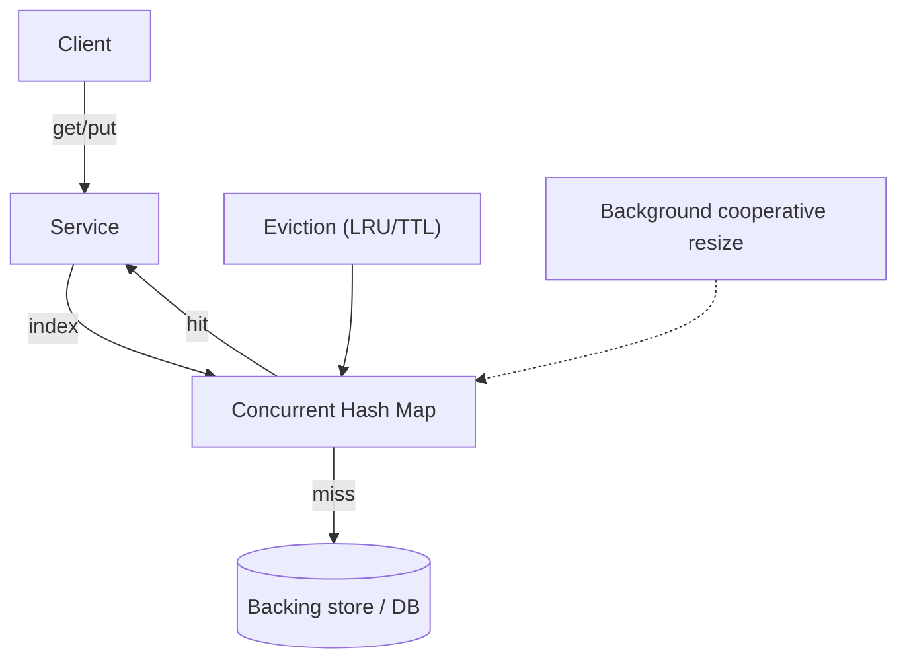
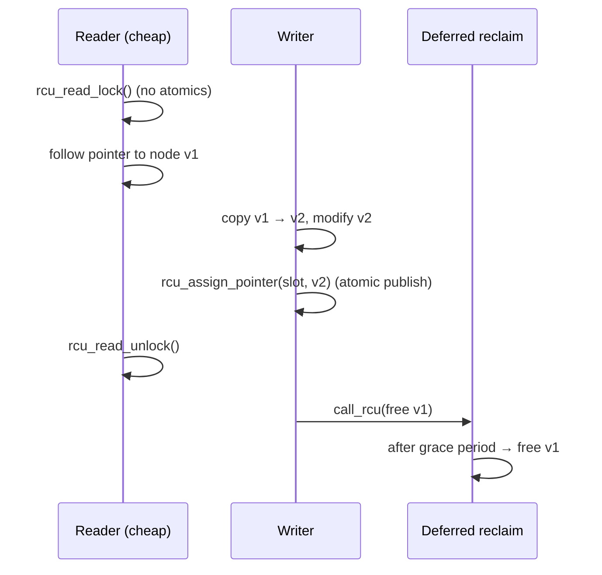
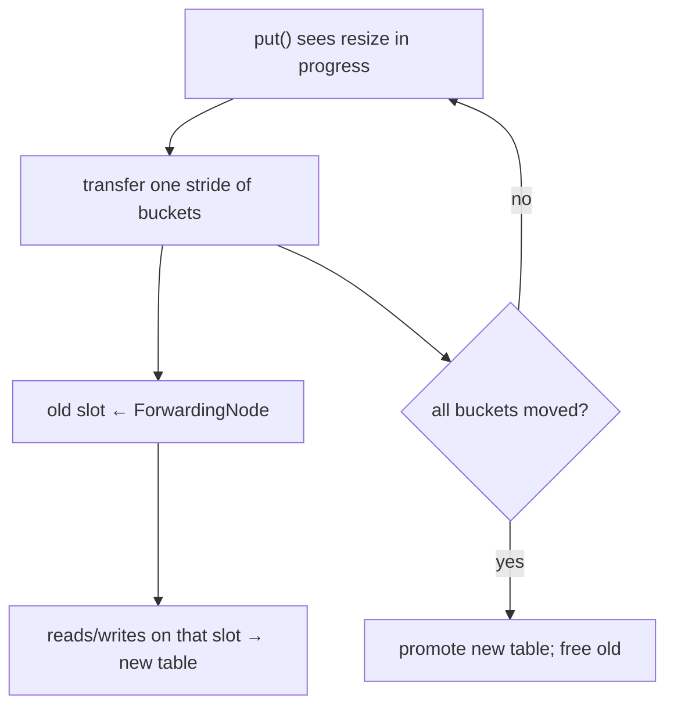
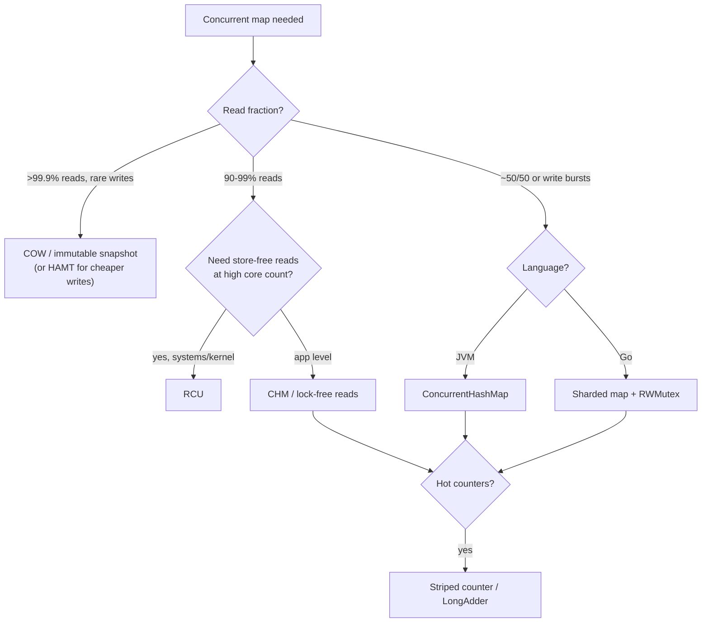

# Concurrent Hash Map — Senior Level

> **Audience:** Engineers designing caches and in-memory KV-stores, picking concurrency strategies under latency SLAs and hardware reality. Prerequisite: [`junior.md`](./junior.md), [`middle.md`](./middle.md).
>
> **Focus:** "How do I architect a high-throughput concurrent map for a real system?" — lock-free / split-ordered lists, RCU read-mostly maps, concurrent resize, NUMA & false sharing, and sizing.

At this level the concurrent hash map stops being a library call and becomes a **system component**: the index of an in-memory cache, the shared state of a stateful server, the hot path of a KV-store. We cover the techniques that push past per-bucket locking — fully **lock-free** maps via **split-ordered lists**, **RCU**-based read-mostly maps, **cooperative concurrent resize**, and the hardware effects (false sharing, NUMA) that dominate at scale.

---

## Table of Contents

1. [Where Concurrent Hash Maps Live in Systems](#where-they-live)
2. [Read-Mostly Optimization — The Dominant Workload](#read-mostly)
3. [Lock-Free Maps via Split-Ordered Lists (Shalev–Shavit)](#split-ordered)
4. [RCU-Based Read-Mostly Maps](#rcu)
5. [Copy-on-Write and Immutable Snapshots](#cow)
6. [Concurrent Resize — Cooperative Incremental Transfer](#concurrent-resize)
7. [False Sharing and NUMA](#false-sharing-numa)
8. [Comparison of System-Grade Designs](#comparison)
9. [Code Examples](#code-examples)
10. [Observability](#observability)
11. [Failure Modes](#failure-modes)
12. [Sizing](#sizing)
13. [Summary](#summary)

---

<a name="where-they-live"></a>
## 1. Where Concurrent Hash Maps Live in Systems

| System | Role of the concurrent map | Workload shape |
|--------|---------------------------|----------------|
| **In-process cache** (Caffeine, Guava, Ristretto) | The backing store of key → cached value | Read-heavy (90–99% reads) |
| **In-memory KV store** (Redis-like, Memcached internals) | Primary index of key → value/pointer | Mixed; bursts of writes |
| **Stateful server** | Session registry, connection table, rate-limit buckets | Read-mostly, churny keys |
| **Database engine** | Buffer-pool page table, lock table, MVCC version chains | Heavy mixed, latency-critical |
| **Service mesh / router** | Route table, circuit-breaker state | Read-mostly, rare config updates |

The architectural lesson: **profile the read:write ratio first**. It dictates everything. A 99%-read route table wants RCU or COW; a 50/50 KV-store wants per-bucket CAS; a write-burst ingest path wants sharding with striped counters.

A second lesson: the map is rarely the *only* concurrent state. A cache also has eviction metadata; a KV-store has a write-ahead log and version chains; a router has health state. The concurrent map is often the *easiest* part to get right (the library does it) — the contention usually migrates to the surrounding bookkeeping. Senior design is about keeping all of that off the hot path, not just the map lookups.



---

<a name="read-mostly"></a>
## 2. Read-Mostly Optimization — The Dominant Workload

Most production maps are read **far** more than written. That asymmetry is an opportunity: make **reads pay nothing** (no locks, no atomics, no cache-line writes) and push all cost onto the rare writer. Three families do this:

1. **Lock-free reads over a mutable structure** (Java 8 CHM, split-ordered lists): readers do plain `volatile` loads; writers CAS.
2. **RCU** (read-copy-update): readers run in a wait-free critical section with *zero* synchronization writes; writers publish new versions and defer reclamation.
3. **COW / immutable snapshots**: readers hold a reference to an immutable map; writers build a new version and atomically swap the pointer.

The deciding factor is **write cost tolerance**. RCU and COW make writes expensive (copying, grace periods) in exchange for *the cheapest possible reads*.

### Quantifying "read-mostly"

"Read-mostly" isn't a vibe; it's a ratio that flips the optimal design:

| Read fraction | Typical system | Best fit | Reasoning |
|---------------|----------------|----------|-----------|
| ~50% | KV-store ingest, session writes | Per-bucket CAS (CHM) / sharded | Writes too frequent for copy-on-write |
| 90–99% | App cache, route table | RWMutex-free reads (CHM), RCU | Reads dominate; pay writers more |
| 99.9%+ | Config map, feature flags | COW / immutable snapshot | Writes are rare enough to copy O(n) |

The lever is **read-side synchronization cost**. Any read that performs even one shared *write* (e.g. an `RWMutex` reader-count increment) caps throughput because that cache line bounces between cores. The endgame — eliminating *all* read-side shared writes — is what RCU achieves and what makes it the kernel's weapon of choice.

### Eviction is part of the design

A cache map is not just a map — it's a map plus an **eviction policy** (LRU, LFU, TTL, W-TinyLFU). The policy metadata (recency lists, frequency sketches) is *also* concurrent state and is often the real contention hotspot. Caffeine's key insight: decouple the map (lock-free CHM) from the policy (buffered, batched, applied asynchronously) so reads never block on policy bookkeeping. When you design a concurrent cache, budget for the policy's concurrency, not just the map's.

---

<a name="split-ordered"></a>
## 3. Lock-Free Maps via Split-Ordered Lists (Shalev–Shavit)

A **lock-free** hash map guarantees system-wide progress without any locks: even if a thread is preempted mid-operation, others still complete. The elegant construction is the **split-ordered list** of Ori Shalev and Nir Shavit (2003/2006).

**The core trick:** keep *all* items in **one** lock-free singly linked list, **sorted by the bit-reversed hash** of their keys. The bucket array is just an array of **shortcut pointers** into this single list. To "resize", you don't move any data — you only **add more shortcut pointers** that subdivide existing buckets.

```text
Keys' hashes, bit-reversed, give a recursively-splittable order:
  Single sorted list:  [0]→[4]→[2]→[6]→[1]→[5]→[3]→[7]→ ...   (bit-reversed order)
  Buckets size 2:      bucket0 ─┘        bucket1 ─┘
  Grow to size 4:      add 2 new shortcut pointers INTO the same list — no data moves
```

Why bit-reversal? When the table doubles, each old bucket splits into two. Bit-reversed ordering guarantees that the split point already exists *as a position in the list*, so a new bucket pointer can be inserted there in O(1) without rearranging nodes. Buckets are initialized **lazily** via a parent-pointer recursion.

**Mechanics:**
- The list uses **Harris/Michael lock-free linked-list** insert/delete: CAS on `next` pointers, with a "marked pointer" logical-delete step to avoid lost-node races.
- **Sentinel (dummy) nodes** mark bucket boundaries so a bucket's start is a stable node, not a moving target.
- **Reads, inserts, deletes are all lock-free**; resize is incremental and contends with nothing.

| Property | Split-ordered list |
|----------|--------------------|
| Progress | Lock-free (often near wait-free for reads) |
| Resize | O(1) amortized, no data movement |
| Memory ordering | Needs careful atomics + safe memory reclamation (hazard pointers / epochs) |
| Real use | `nbds`, some research/HPC maps; inspired many lock-free maps |

The hard part in practice is **safe memory reclamation**: when a node is logically deleted, you can't free it until you're sure no reader still holds a pointer. This is solved with **hazard pointers** or **epoch-based reclamation** — which is exactly the bridge to RCU.

### Why split-ordered resize is "free"

In a conventional map, doubling the table means rehashing every key into a new array — O(n) data movement. The split-ordered list's payoff is that **doubling moves zero data**. The single list never changes; the table is purely an array of *shortcut pointers* into it. When the table doubles from size `m` to `2m`, you don't touch any data node — you lazily initialize `m` new bucket pointers, each pointing at a sentinel that *already sits in the correct sorted position* thanks to bit-reversal.

```text
Conventional resize:  allocate 2n slots, rehash + move all n entries        O(n) movement
Split-ordered resize: allocate 2n bucket POINTERS, lazily add sentinels      O(1) amortized, 0 data moves
```

The cost is amortized into the lazy `initialize_bucket(b)` call: the first thread to use a new bucket recursively initializes its parent bucket (halving the index) until it reaches an initialized one, then inserts a sentinel. Amortized O(1) per bucket. This elegance is why the split-ordered list is the canonical "textbook" lock-free hash map even though production JVM/Go maps use the simpler per-bucket-CAS design (because the GC handles reclamation for them).

---

<a name="rcu"></a>
## 4. RCU-Based Read-Mostly Maps

**RCU (Read-Copy-Update)** is the Linux kernel's signature read-mostly technique, and it powers the kernel's concurrent hash tables (`rhashtable`). See the dedicated topic [`../19-rcu/`](../19-rcu/).

The contract:
- **Readers** enter an `rcu_read_lock()` critical section that does **no atomic writes, no locks** — on most builds it's *nothing at all* (or just disabling preemption). Reads traverse the structure following pointers. This is the cheapest possible read path — essentially the speed of a single-threaded read.
- **Writers** never modify a node in place where a reader could see a torn state. Instead they **copy** the node, modify the copy, and **publish** it with a single atomic pointer swap (`rcu_assign_pointer`, a store with a release barrier).
- The **old** version is not freed immediately. The writer waits for a **grace period** — until every CPU that *might* have held a reference has passed through a quiescent state — then reclaims it (`synchronize_rcu` / `call_rcu`).



**Read-side cost analysis (the senior intuition; rigor in [`professional.md`](./professional.md)):**
- Read-side critical section: **O(1) synchronization overhead, often literally zero stores**. No cache-line contention because readers write nothing.
- The price is paid by **writers** (copy + grace-period latency) and by **memory** (multiple versions live until reclaimed).
- RCU shines when reads ≫ writes (kernel routing tables, dentry cache, config maps). It is a poor fit for write-heavy maps.

Userspace RCU exists (`liburcu`); language-level analogues include epoch-based reclamation (Crossbeam in Rust, used by lock-free maps). In the JVM, the GC itself acts as the reclamation mechanism, which is why **COW maps and CHM** don't need explicit hazard pointers.

---

<a name="cow"></a>
## 5. Copy-on-Write and Immutable Snapshots

When writes are *rare* and reads must be *absolutely free*, **copy-on-write** is the simplest winner. Keep the map behind one atomic reference to an **immutable** map. Readers dereference once and traverse with zero synchronization. A writer copies the whole map, applies the change, and CASes the reference.

```text
read():  m := atomic.Load(&ref); return m[key]          // wait-free, no lock
write(): for { old := load(ref); new := old.With(k,v); if CAS(&ref, old, new) break }
```

- **Pros:** trivially correct, lock-free wait-free reads, easy consistent snapshots/iteration (you hold an immutable version).
- **Cons:** every write copies O(n) — only viable for **read-mostly, small/medium maps** (route tables, feature flags, config). Persistent/HAMT data structures (Clojure, Scala `Vector`/`HashMap`) make the copy O(log n) by structural sharing — the "immutable but cheap to update" sweet spot.

This is the design behind config registries, Java's `CopyOnWriteArrayList`'s map cousins, and Clojure's atom + persistent hash map.

---

<a name="concurrent-resize"></a>
## 6. Concurrent Resize — Cooperative Incremental Transfer

Resizing is the hardest part of a concurrent map. A naive map locks everything, allocates `2n` buckets, and rehashes — a **stop-the-world** pause proportional to size, lethal for latency SLAs.

Production maps resize **incrementally and cooperatively**:

- **Java 8 CHM:** When a `put` triggers growth, the table doubles and transfer happens **bucket-by-bucket**, divided into stride-sized chunks. **Any thread** that touches the map during resize is conscripted to **help transfer** a chunk before doing its own op. A transferred bucket's old slot is replaced with a **`ForwardingNode`** pointing at the new table; readers/writers hitting a `ForwardingNode` are redirected to the new table. No global pause; the cost is spread across all active threads.
- **Redis** uses **incremental rehashing**: it keeps **two** hash tables (`ht[0]`, `ht[1]`) and migrates a few buckets on every command until `ht[0]` is empty. Lookups check both tables during the migration.
- **Split-ordered lists** (above) sidestep resize entirely — they only add bucket pointers, never move data.



**Correctness essentials (proved formally in professional.md):**
- A reader must **never** miss a key because it's "between tables." `ForwardingNode` redirection guarantees that any key already transferred is found in the new table, and any not-yet-transferred key is found in the old.
- Transfer is **idempotent per bucket** and guarded so two helpers don't double-move a bucket.

### Tail-latency math: why incremental beats stop-the-world

Stop-the-world resize is the classic source of a **latency cliff**. Consider a 10M-entry map; rehashing at, say, 50 ns/entry is **500 ms** of pause — every request arriving in that window eats the full stall, wrecking your p99/p99.9. Incremental transfer spreads that same 500 ms of *total* work across thousands of ops as a few microseconds each, so no single request sees more than a stride's worth of transfer. The aggregate CPU cost is identical; the *distribution* is what matters for SLAs.

```text
Stop-the-world:  one request pays 500 ms       -> p99.9 spikes to 500 ms
Incremental:     each request pays ~few µs      -> p99.9 barely moves
Same total work; redistributed to protect the tail.
```

Pre-sizing the map (so the resize never happens on the hot path) is even better — but when growth is unavoidable, incremental cooperative transfer is the standard answer.

---

<a name="false-sharing-numa"></a>
## 7. False Sharing and NUMA

At high core counts, the bottleneck is often **not logical contention but cache coherence**.

**False sharing:** Two *unrelated* fields (e.g. two shard locks, or two counter cells) that happen to live on the **same 64-byte cache line** ping-pong between cores even though the threads touch different fields. The cure is **padding** each hot field to its own cache line.

```text
// BAD: two shard structs packed together share a cache line
[ lock0 | map0ptr | lock1 | map1ptr ]   // updating lock0 invalidates lock1's line

// GOOD: pad each shard to 64 bytes (Java @Contended, Go padding fields)
[ lock0 | map0ptr | <pad to 64B> ][ lock1 | map1ptr | <pad to 64B> ]
```

`LongAdder`'s `CounterCell` is annotated `@sun.misc.Contended` precisely to pad counter cells apart. This is **why striped counters work**: striping is pointless if all stripes share one cache line.

**NUMA (Non-Uniform Memory Access):** On multi-socket machines, memory attached to a remote socket is ~1.5–2× slower to access. A concurrent map whose buckets are allocated on one socket but hammered by threads on another suffers cross-socket coherence traffic. Mitigations: **per-NUMA-node sharding** (a shard's memory allocated local to the cores that own it), thread-pinning, and NUMA-aware allocators. Most application-level maps ignore NUMA; database engines and HPC maps don't.

---

<a name="comparison"></a>
## 8. Comparison of System-Grade Designs

| Design | Read cost | Write cost | Resize | Best workload | Reclamation |
|--------|-----------|-----------|--------|---------------|-------------|
| Per-bucket CAS (CHM) | lock-free (volatile read) | CAS or sync-on-head | cooperative incremental | mixed read/write | GC |
| **Split-ordered list** | lock-free | lock-free CAS | O(1), no data move | high-concurrency mixed | hazard ptrs / epochs |
| **RCU** | ~free (no stores) | copy + grace period | versioned | reads ≫ writes | grace period |
| **COW / immutable** | wait-free | O(n) (or O(log n) HAMT) | n/a (rebuild) | read-mostly, rare writes | GC |
| Sharded + RWMutex | RLock | shard Lock | per-shard | write bursts, simple | GC |

---

<a name="code-examples"></a>
## 9. Code Examples

### Go — copy-on-write read-mostly map (wait-free reads)

```go
package main

import (
	"sync"
	"sync/atomic"
)

// COWMap: reads are wait-free (single atomic load + map read).
// Writes copy the whole map under a writer lock, then publish atomically.
type COWMap struct {
	v       atomic.Value // holds map[string]int (immutable once published)
	writeMu sync.Mutex   // serializes writers only
}

func NewCOWMap() *COWMap {
	c := &COWMap{}
	c.v.Store(make(map[string]int))
	return c
}

func (c *COWMap) Get(key string) (int, bool) {
	m := c.v.Load().(map[string]int) // wait-free read; no lock
	val, ok := m[key]
	return val, ok
}

func (c *COWMap) Put(key string, val int) {
	c.writeMu.Lock()
	defer c.writeMu.Unlock()
	old := c.v.Load().(map[string]int)
	cp := make(map[string]int, len(old)+1) // O(n) copy — writes are the cost
	for k, v := range old {
		cp[k] = v
	}
	cp[key] = val
	c.v.Store(cp) // atomic publish of the new immutable version
}
```

### Java — ConcurrentHashMap as a cache index with atomic load-through

```java
import java.util.concurrent.ConcurrentHashMap;

public class CacheIndex<K, V> {
    private final ConcurrentHashMap<K, V> map = new ConcurrentHashMap<>();

    // computeIfAbsent gives atomic load-through: the loader runs at most once
    // per key even under concurrent misses (no thundering herd of loads).
    public V get(K key, java.util.function.Function<K, V> loader) {
        return map.computeIfAbsent(key, loader);
    }

    // mappingCount() returns long (size() caps at Integer.MAX_VALUE) and is a
    // weakly-consistent snapshot computed from the striped counter cells.
    public long size() { return map.mappingCount(); }
}
```

> Note: `computeIfAbsent`'s loader holds the bin lock, so a *slow* loader blocks other writers to the same bin. For heavy loaders, load outside and `putIfAbsent`, or use Caffeine which load-coalesces without holding bin locks.

### Python — read-mostly COW with the GIL doing the atomic swap

```python
import threading

class COWMap:
    """Reads are lock-free (GIL makes the reference read atomic).
    Writes copy under a lock then rebind the attribute (atomic store)."""
    def __init__(self):
        self._m = {}                 # immutable-by-convention snapshot
        self._write_lock = threading.Lock()

    def get(self, key, default=None):
        return self._m.get(key, default)   # reads current snapshot, no lock

    def put(self, key, value):
        with self._write_lock:
            new = dict(self._m)            # O(n) copy
            new[key] = value
            self._m = new                  # atomic rebind under GIL -> publish
```

---

<a name="case-studies"></a>
## 9b. Case Studies — Real Systems

**Caffeine (Java cache).** Backs its entries with a `ConcurrentHashMap` (lock-free reads). Its eviction policy (W-TinyLFU) is fed by **ring buffers**: reads append to a striped read-buffer that is drained and applied to the policy *asynchronously* under a single tryLock, so a cache hit almost never blocks. Lesson: keep the hot path (the map read) lock-free and push policy maintenance off the critical path.

**Go `sync.Map`.** Internally two maps: a lock-free `read` map (an atomic pointer to a read-only snapshot) and a `dirty` map guarded by a `Mutex`. Reads hit the lock-free `read` map; misses and writes fall back to the locked `dirty` map. When misses pile up, the dirty map is promoted to the read map. This is why `sync.Map` excels at **stable keys** (everything lives in the lock-free read map) and is mediocre for churny writes (constant promotion + locking).

**Redis (single-threaded core, but still incremental).** Even without multi-threaded contention on the main dict, Redis resizes **incrementally** (`rehashidx`, dual `ht[0]/ht[1]`) precisely to avoid a multi-hundred-millisecond stall on a large keyspace — the same tail-latency motivation as cooperative resize, applied in a single-threaded event loop.

**Linux `rhashtable`.** RCU-protected resizable hash table used across the kernel (netfilter, sockets). Readers traverse under `rcu_read_lock()` with zero atomics; resize uses a second bucket table with RCU-published bucket pointers and per-bucket spinlocks for writers. The canonical production RCU map.

| System | Map core | Read path | Resize | Reclamation |
|--------|----------|-----------|--------|-------------|
| Caffeine | CHM | lock-free | cooperative (CHM) | GC |
| Go sync.Map | dual map | atomic read map | promote dirty→read | GC |
| Redis dict | open-addr dict | single-threaded | incremental dual-table | manual/free |
| Linux rhashtable | RCU buckets | RCU (no atomics) | RCU dual-table | grace period |

---

<a name="antipatterns"></a>
## 9c. Anti-Patterns to Avoid

| Anti-pattern | Why it bites | Better |
|--------------|--------------|--------|
| `if (!m.has(k)) m.put(k, load(k))` on a hot cache | Check-then-act race + thundering herd of loads | `computeIfAbsent` / single-flight |
| Calling `size()` in a tight loop | Sums striped cells each call; can be the hottest op | Cache it; treat as approximate |
| One `Mutex` shared across many unrelated maps | Serializes everything; false coupling | One lock per map / per shard |
| Holding the map lock during I/O or load | Blocks every other op on that bucket/shard | Load outside, then insert |
| Unbounded growth, no eviction | OOM under traffic spikes | LRU/TTL/size cap |
| Iterating assuming a transactional snapshot | Weakly consistent iterators see a moving target | Snapshot under lock / COW |
| Hand-rolled lock-free reads without barriers | Torn-node reads on ARM/POWER | Use `volatile`/atomic publication |

The recurring theme: **the map's atomicity is per-operation, not across operations.** Any logic that spans two map calls (or a map call plus external I/O) reintroduces races unless made atomic with a built-in compound method or an external lock held for the whole span.

---

<a name="observability"></a>
## 10. Observability

| Metric | Why | Alert |
|--------|-----|-------|
| `map_get_latency_p99` | Detects lock contention / GC pauses | > SLA |
| `resize_events_total` & `resize_duration` | Resize storms hurt tail latency | spikes |
| `bucket_max_chain_len` / treeify count | Hash skew or flooding attack | > 8 sustained |
| `shard_imbalance` (max/avg load) | Hot-shard detection | > 2× |
| `lock_wait_time` / CAS-retry count | Contention level | rising |
| `cache_hit_ratio` | Sizing of the backing cache | < target |

**Instrumentation cost warning:** the observability itself must not become the contention. A naive "increment a metric counter on every `get`" recreates the single-counter cache-line problem you solved in the map. Use a **striped/`LongAdder`-backed** metric, sample (1-in-N), or use per-thread accumulators flushed periodically — otherwise your monitoring caps your throughput. This is a classic senior trap: the cure (metrics) becoming the disease (contention).

---

<a name="failure-modes"></a>
## 11. Failure Modes

- **Hash flooding (DoS):** adversarial keys collide into one bucket → O(n) and CPU exhaustion. Defenses: randomized/seeded hash (SipHash), tree-bins.
- **Resize storm:** simultaneous growth + heavy writes → many threads conscripted to transfer, latency spike. Pre-size the map.
- **Thundering herd on miss:** many threads load the same missing key. Use atomic load-through (`computeIfAbsent`) or single-flight.
- **Unbounded growth / OOM:** no eviction → memory blowout. Add LRU/TTL/size cap.
- **Iterator staleness surprise:** code assumes `size()` or iteration is a transactional snapshot. It isn't.
- **Reclamation bug (lock-free):** freeing a node a reader still holds → use-after-free. Hazard pointers / epochs required.

### Deadlock and re-entrancy in `computeIfAbsent`

A subtle but real production failure: the mapping function passed to `computeIfAbsent` runs **while holding the bin lock**. If that function tries to update the *same* map (even a different key that hashes to the same bin), you can deadlock or, in some JDK versions, corrupt the map. Java 9+ actively throws on detected recursive updates. Rule: the remapping function must be **side-effect-free with respect to the map** — compute the value, return it, touch nothing else in that map.

```text
BAD:  map.computeIfAbsent(k1, k -> { map.put(k2, ...); return load(k); });  // re-entrant → deadlock/throw
GOOD: V v = load(k1); map.putIfAbsent(k1, v);                               // load outside, then insert
```

### Memory amplification under RCU/COW

RCU and COW trade memory for read speed. Under a write burst, multiple versions (RCU) or repeated full copies (COW) can transiently **multiply memory use**. A COW map of 1M entries hit by 100 quick writes briefly allocates ~100 copies before GC reclaims them — a GC-pressure spike that can itself cause latency. Bound writer rate, batch writes, or use a persistent (HAMT) structure that shares structure instead of copying wholesale.

---

<a name="primitives-toolbox"></a>
## 11b. Concurrency Primitives Toolbox

The map designs above are assembled from a small set of primitives. Knowing their costs lets you reason about any concurrent structure:

| Primitive | What it gives | Approx cost | Used in |
|-----------|---------------|-------------|---------|
| `Mutex` | Mutual exclusion | uncontended ~20 ns; contended µs (park) | single-lock, per-shard |
| `RWMutex` | Many readers / one writer | reader RMW on shared counter | read-mostly shards |
| CAS | Atomic conditional write | ~10–30 ns, retries under contention | per-bucket insert, lock-free lists |
| `volatile`/atomic load | Visible, ordered read | ~nanoseconds, no write | lock-free `get` |
| Striped counter | Scalable count | per-cell CAS, padded | `size()`, LongAdder |
| Hazard pointer / epoch | Safe reclamation | per-deref publish | lock-free maps (non-GC) |
| RCU read lock | Store-free read section | ~0 (preempt-disable) | kernel rhashtable |

The senior skill is **matching the primitive to the access pattern**: read-mostly → lock-free/RCU reads; write-heavy distinct keys → per-bucket CAS / sharding; rare writes + cheap reads → COW. There is no universally best map — only a best map *for a workload*.

---

<a name="sizing"></a>
## 12. Sizing

- **Initial capacity:** pre-size to the expected entry count / load factor to **avoid resizes** on the hot path. Java: `new ConcurrentHashMap<>(expectedSize / 0.75 + 1)`. Go: `make(map[K]V, hint)` per shard.
- **Shard/stripe count:** power of two ≥ peak concurrent writers (16–256 typical); too many wastes memory and slows `size()`.
- **Load factor:** ~0.75 balances memory vs collision rate; lower for latency-sensitive, higher for memory-sensitive.
- **Pad hot fields** (locks, counter cells) to 64-byte cache lines to kill false sharing.
- **NUMA:** shard per node and allocate shard memory locally on big multi-socket boxes.

### Worked sizing example

> **Scenario:** an in-process cache for a service handling 200k req/s, 95% read, holding up to 2M entries, on a 32-core dual-socket box.

```text
1. Entry count → capacity:
   2M entries / 0.75 load factor ≈ 2.67M slots → round up to next power of two = 2^22 = 4.19M.
   Pre-size: new ConcurrentHashMap<>(2_700_000)  -> avoids ALL resizes on the hot path.

2. Concurrency:
   95% read → reads are lock-free in CHM; no tuning needed for them.
   Write rate ≈ 5% × 200k = 10k writes/s spread over the keyspace → per-bucket CAS contention
   negligible (4M buckets, 10k writes/s → collision probability per bucket ~0).

3. Counting:
   Use mappingCount() (approximate). NEVER call size() in a hot loop.

4. Eviction:
   2M cap with TTL → use Caffeine (W-TinyLFU) so policy upkeep stays off the read path.

5. NUMA (32 cores, 2 sockets):
   Either accept cross-socket coherence (simplest) OR run two cache instances, one per
   socket, with thread affinity, if profiling shows remote-memory stalls.

6. False sharing:
   CHM already pads its CounterCells (@Contended). A hand-rolled sharded map must pad
   each shard struct to 64 B.
```

The discipline: **derive capacity from entry count and load factor, pre-size to avoid resizes, keep counting approximate, push eviction off the read path, and only worry about NUMA/false-sharing once profiling proves they bite.**

---

## Decision Flow — Picking a Design



Use this as the opening move in a design discussion: establish the read:write ratio and language first, then layer in counting strategy, eviction, and (only if profiling demands) NUMA/false-sharing fixes.

---

## Summary

System-grade concurrent maps are designed around the **read:write ratio**. Read-mostly workloads exploit lock-free reads (CHM), **RCU** (near-free read side, writers pay grace-period + copy), or **COW/immutable snapshots** (wait-free reads, O(n) writes). The **split-ordered list** achieves a fully lock-free map whose resize moves *no data*, only bucket pointers — at the price of explicit memory reclamation (hazard pointers/epochs). Real resizes are **cooperative and incremental** (CHM `ForwardingNode`, Redis dual-table) to avoid stop-the-world pauses. At high core counts, **false sharing** and **NUMA** dominate, so pad hot fields and shard per node. Always pre-size, bound growth, and treat `size()` as approximate.

---

## Further Reading

- Maurice Herlihy & Nir Shavit, *The Art of Multiprocessor Programming* — concurrent hash maps, lock-free lists, the split-ordered list.
- Shalev & Shavit, "Split-Ordered Lists: Lock-Free Extensible Hash Tables" (JACM 2006).
- Paul McKenney, *Is Parallel Programming Hard, And, If So, What Can You Do About It?* — definitive RCU reference; Linux `rhashtable` source.
- Doug Lea, `ConcurrentHashMap` (JDK 8) source and class Javadoc — per-bucket CAS, tree-bins, cooperative resize, `CounterCell`.
- Ben Manes, Caffeine design notes — W-TinyLFU + lock-free CHM + buffered policy.
- Go: `sync.Map` source (`read`/`dirty` dual-map design); the Go memory model.

---

**Next step:** [`professional.md`](./professional.md) — linearizability, split-ordered-list lock-freedom proof, concurrent-resize correctness, and RCU read-side cost analysis.
