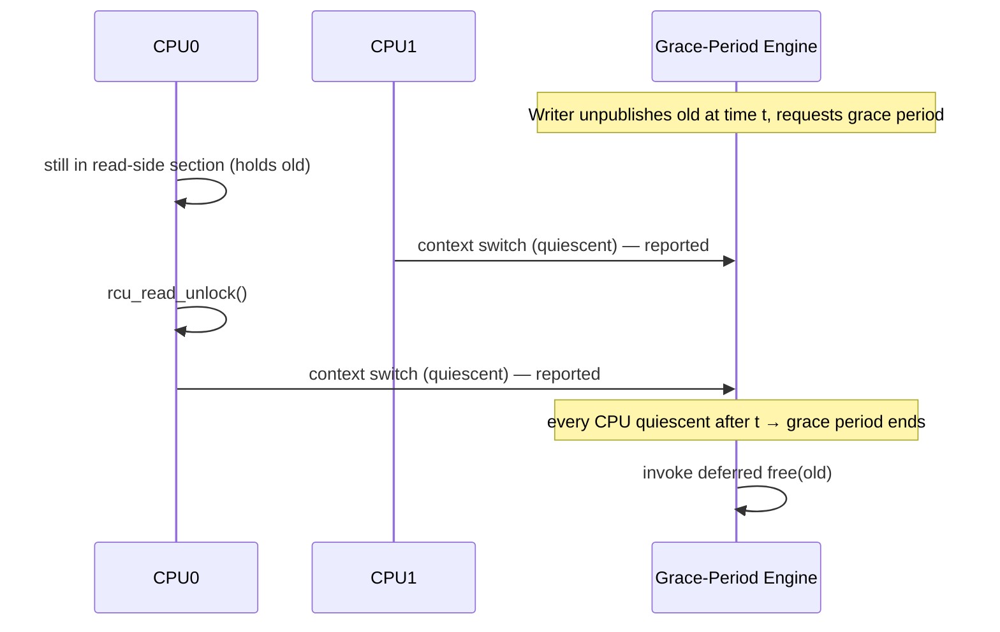
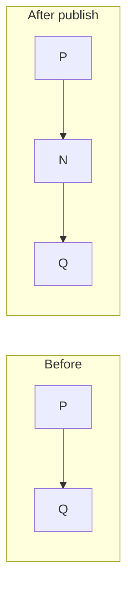
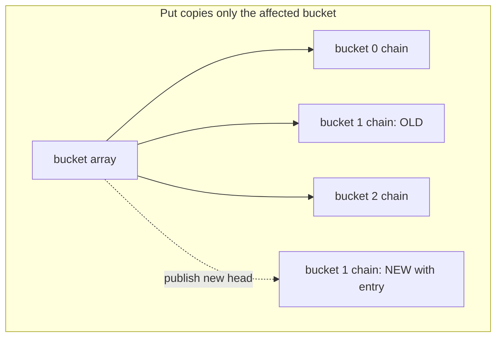

# RCU (Read-Copy-Update) — Middle Level

> **Audience:** Engineers who have the read-copy-update pattern from `junior.md` and now want the *why* and *when*: what a grace period and a quiescent state actually are, the publish (release) / subscribe (acquire) protocol in detail, exactly why readers are cheap, and a rigorous comparison against reader-writer locks. Prerequisite: `junior.md`.

This document goes one level deeper. We make the **grace period** precise (quiescent states, why "wait long enough" is sufficient and how the runtime detects it), formalize the **publish/subscribe memory-ordering protocol**, explain **why an RCU reader costs essentially nothing** at the hardware level, and place RCU side-by-side with **reader-writer locks** and **seqlocks** so you can pick the right tool. We also work through an **RCU-protected linked list** — the canonical kernel data structure — to see insert and delete done the RCU way.

---

## Table of Contents

1. [Grace Periods and Quiescent States, Precisely](#grace-periods)
2. [The Publish / Subscribe Protocol (Release / Acquire)](#publish-subscribe)
3. [Why Readers Are Cheap — A Hardware View](#why-cheap)
4. [RCU-Protected Linked List — Insert and Delete](#linked-list)
5. [RCU vs Reader-Writer Lock](#vs-rwlock)
6. [RCU vs Seqlock](#vs-seqlock)
7. [synchronize_rcu vs call_rcu — Synchronous and Deferred Reclamation](#sync-vs-call)
8. [When to Reach for RCU (and When Not To)](#when)
9. [RCU-Protected Map and the Read-Mostly Cache Pattern](#rcu-map)
10. [Worked Trace — A Full Update with Concurrent Readers](#worked-trace)
11. [Reader Nesting, Multiple Pointers, and Common Pitfalls](#nesting)
12. [A Mental Model: RCU as Versioned Snapshots](#mental-model)

---

<a name="grace-periods"></a>
## 1. Grace Periods and Quiescent States, Precisely

The junior intuition: after publishing a new version, the writer waits a "grace period" until no reader still references the old one, then frees it. Now we make "grace period" rigorous.

### 1.1 Quiescent state

A **quiescent state** for a CPU (or thread) is a moment at which that CPU is **provably not inside any RCU read-side critical section**. The defining property: a CPU in a quiescent state holds **no** RCU-protected reference. The grace-period machinery never needs to track individual readers — it only needs to observe quiescent states.

In the **classic kernel flavor**, natural quiescent states are:

- A **voluntary context switch** (the scheduler runs another task — the outgoing task was not in a read-side section, because classic RCU forbids blocking inside one).
- A **return to user space** from a syscall.
- The **idle loop** (the CPU has nothing to run).

Because classic read-side sections cannot block or be preempted, *any* context switch on a CPU is a guarantee that the previously running code finished any read-side section it was in. That is the trick: the scheduler's existing context switches double as RCU quiescent-state reports, so the read side needs no extra instrumentation at all.

### 1.2 Grace period

A **grace period** is a time interval such that **every CPU has passed through at least one quiescent state** during it, *after* the moment of interest (the unpublish/removal). Formally:

> A grace period that begins at time `t` ends at the first time `t' > t` by which **every** CPU has been observed in a quiescent state at some point in `(t, t']`.

Why is that sufficient? Consider an old version unpublished at time `t`. Any reader still holding it at `t` was inside a read-side section on some CPU. That CPU cannot reach a quiescent state until the reader exits the section (a read-side section contains no quiescent state, by definition). So once that CPU is *observed* quiescent after `t`, the reader has provably exited. When **all** CPUs have been observed quiescent after `t`, **all** pre-existing readers have exited. The old version is then unreferenced and safe to free.



### 1.3 Key consequences

- **The grace period is a global, coarse event, not per-object.** One grace period covers *all* objects unpublished before it started. The runtime batches many pending reclamations behind a single grace period — this amortizes the cost.
- **Readers contribute nothing to grace-period detection.** They do not register, increment counters, or signal. The mechanism observes quiescent states that already occur for other reasons. This is precisely why reads are free.
- **A grace period can be long.** Microseconds to milliseconds in the kernel, depending on how quickly every CPU passes through a quiescent state. That latency is the writer's cost, not the reader's.
- **"Wait long enough" is the whole idea.** RCU does not compute exactly which readers hold what; it conservatively waits until *no possible* reader could still hold the old version.

### 1.4 Two ways a writer waits

| Primitive | Semantics |
|---|---|
| `synchronize_rcu()` | **Blocks** the calling writer until one full grace period completes, then returns. Simple; the writer can `free()` right after it returns. |
| `call_rcu(head, func)` | **Non-blocking.** Registers `func` to be invoked after the next grace period. The writer returns immediately; the runtime calls `func` (which frees the old version) later, in batch with other callbacks. |

`synchronize_rcu` trades writer latency for simplicity; `call_rcu` keeps writers fast at the cost of deferred, batched reclamation (and bounded memory growth). Senior covers `call_rcu` in depth.

---

<a name="publish-subscribe"></a>
## 2. The Publish / Subscribe Protocol (Release / Acquire)

The grace period handles *reclamation* safety (no use-after-free). A separate concern is *initialization* safety: a reader that loads the new pointer must also see the **fully initialized** block it points to. This is the **publish/subscribe** protocol, and it is about **memory ordering**.

### 2.1 The hazard without ordering

A writer does two things: (1) fill the new block's fields, (2) store the pointer. A reader does two things: (1) load the pointer, (2) read the block's fields. Without ordering constraints, **the CPU or compiler may reorder** these:

```
Writer (reordered, BAD):              Reader (reordered, BAD):
  store(gPtr, new)   // pointer first   x = new->field   // speculative read of stale field
  new->field = 42    // fields after     p = load(gPtr)   // pointer after
```

If the writer's pointer store becomes visible before the field writes, a reader can load `new`, dereference it, and read **uninitialized garbage**. Symmetrically, some weak architectures could let a reader read the field before loading the pointer.

### 2.2 The fix: release on publish, consume/acquire on subscribe

- **Publish** = an atomic store with **release** ordering. A release store guarantees that *all writes the writer performed before it* (the field initializations) are visible to any thread that observes the stored pointer. Kernel macro: `rcu_assign_pointer(gPtr, new)`.
- **Subscribe** = an atomic load with **consume** (or, conservatively, **acquire**) ordering. It guarantees that reads *dependent on the loaded pointer* (the field reads) are not hoisted before the load. Kernel macro: `rcu_dereference(gPtr)`.

```
Writer:                               Reader:
  new->field = 42;                      p = rcu_dereference(gPtr);  // subscribe (consume)
  rcu_assign_pointer(gPtr, new);        x = p->field;               // ordered after the load
  // ^ release: fields visible          // sees field = 42, never garbage
  //   before the pointer
```

### 2.3 Consume vs acquire

RCU's subscribe needs only **consume** ordering — ordering of reads that are *data-dependent* on the loaded pointer — because the only thing a reader does is dereference the pointer it just loaded. Consume is cheaper than acquire on weakly ordered CPUs (e.g., older ARM, Alpha) because the hardware's address-dependency tracking provides it nearly for free; on x86 both are essentially no-ops because x86 already orders loads. In practice the kernel and `liburcu` implement `rcu_dereference` with the minimal barrier the architecture requires (historically `smp_read_barrier_depends()`, which is a true no-op everywhere except DEC Alpha). This is a big reason RCU reads are cheap: on mainstream hardware, subscribe compiles to a **plain load**.

### 2.4 In Go / Java

The language atomics bundle the correct ordering:

- Go: `atomic.Pointer[T].Store` is a release store; `.Load` is an acquire load. You get publish/subscribe correctness automatically.
- Java: writing a `volatile`/`AtomicReference` field is a release; reading it is an acquire (per the Java Memory Model). `final` fields of the immutable snapshot get the JMM's *final-field freeze* guarantee, which is exactly the publish-safety we need.

You never hand-roll the barriers in managed languages — but understanding *why* they're there explains why a plain (non-volatile, non-atomic) field would be a bug.

| Step | x86 cost | Weak-memory (ARM) cost | Primitive |
|---|---|---|---|
| Publish (release store) | plain store | one release barrier | `rcu_assign_pointer` / `atomic.Store` |
| Subscribe (consume load) | **plain load** | **plain load** (dependency-ordered) | `rcu_dereference` / `atomic.Load` |

---

<a name="why-cheap"></a>
## 3. Why Readers Are Cheap — A Hardware View

This is the crux of RCU and the reason it beats every lock for read-mostly data.

### 3.1 No atomic read-modify-write

A reader-writer lock requires each reader to **atomically increment** a shared reader count on entry and decrement on exit. An atomic RMW (e.g., `LOCK XADD` on x86, `LDXR/STXR` loop on ARM) is expensive: it locks the cache line, may stall the pipeline, and *writes* to a line that other cores want. RCU readers do **none** of this. A classic RCU `rcu_read_lock()` in the kernel compiles to nothing more than disabling preemption (or, in some builds, literally nothing) — no atomic, no store.

### 3.2 No shared cache-line writes — no ping-pong

The dominant cost of contended locks on multicore hardware is **cache-line ping-pong**: when core A writes the lock's cache line, that line is invalidated in every other core's cache; when core B writes it, it bounces back. Under heavy read load, an rwlock's reader-count line bounces between all the reading cores, serializing them at the cache-coherence level even though they "don't conflict."

RCU readers **only read** the data's cache lines. Read-only lines can be **shared** (held in the `S` / Shared state of MESI) by every core simultaneously — no invalidation, no bouncing. N cores reading RCU-protected data scale linearly; N cores reading rwlock-protected data contend on the counter and stop scaling.

### 3.3 Deterministic, wait-free reads

An RCU reader cannot be blocked by a writer (the writer never holds a lock the reader needs) and cannot be blocked by another reader. The read path has no loop, no retry, no spin — it is **wait-free**. Reader latency is bounded and predictable, which matters for real-time and low-tail-latency systems.

### 3.4 The trade summarized

| Property | RCU reader | rwlock reader |
|---|---|---|
| Atomic RMW on entry/exit | none | 2 (inc + dec) |
| Writes to shared state | none | yes (reader count) |
| Cache-line ping-pong under load | none | severe |
| Blocks / can be blocked | no | can wait for writers |
| Scales with cores | linearly | counter becomes bottleneck |
| Cost | ~1 plain load | several atomics + barriers |

The price for all of this: writers copy data and wait for grace periods, and readers may be one version stale. For read-mostly data, that is an excellent trade.

---

<a name="linked-list"></a>
## 4. RCU-Protected Linked List — Insert and Delete

The singly linked list is the canonical RCU structure in the kernel (`list.h`'s RCU variants). Readers traverse it lock-free; writers insert and delete with publish + grace period.

### 4.1 Reader traversal

```
rcu_read_lock()
for node = rcu_dereference(head); node != NULL; node = rcu_dereference(node->next):
    examine node->value
rcu_read_unlock()
```

Each `next` load is a subscribe. The reader walks whatever consistent snapshot of the list it sees.

### 4.2 Insert (publish a new node)

To insert node `N` after node `P`:

```
N->next = P->next             // 1. point N at the rest of the list (private; N not yet visible)
rcu_assign_pointer(P->next, N) // 2. PUBLISH: splice N in with a release store
```

Order matters: `N->next` is set **before** `N` becomes reachable. A reader either sees the old list (hasn't reached `P->next` update) or the new list with `N` fully linked — never a dangling `N`.



### 4.3 Delete (unpublish, then reclaim after grace period)

To delete node `D` that follows `P`:

```
rcu_assign_pointer(P->next, D->next)  // 1. UNPUBLISH: splice D out (release store)
// readers currently past P->next still hold D and traverse via D->next — safe
synchronize_rcu()                     // 2. GRACE PERIOD: wait for those readers
free(D)                               // 3. RECLAIM
```

The subtlety: a reader that already loaded `P->next == D` before step 1 is now traversing *through* `D` (reading `D->next`). That is safe because `D` is not freed until after the grace period, and `D->next` still points into the live list. New readers after step 1 skip `D` entirely.

### 4.4 Why delete needs a grace period but insert does not

Insert only *adds* reachability; no reader can hold a reference to memory that's about to be freed, so no grace period is needed. Delete *removes* reachability but a reader may still hold the removed node, so we must wait a grace period before freeing it. **Rule of thumb: removals/reclamations need a grace period; pure additions do not.**

### 4.5 Code — RCU linked list in Go, Java, Python

Concrete implementations of the lock-free read and publish-based insert. We model the head/`next` pointers as atomics; in GC languages the runtime is the grace period.

**Go** — `atomic.Pointer` head and `next`:
```go
type Node struct {
	val  int
	next atomic.Pointer[Node] // each next is publish/subscribe
}
type RCUList struct {
	head    atomic.Pointer[Node]
	writeMu sync.Mutex
}

// Contains: reader fast path — subscribe + traverse, no lock.
func (l *RCUList) Contains(v int) bool {
	for n := l.head.Load(); n != nil; n = n.next.Load() { // each Load = rcu_dereference
		if n.val == v {
			return true
		}
	}
	return false
}

// PushFront: writer — link the new node, then publish (release Store).
func (l *RCUList) PushFront(v int) {
	l.writeMu.Lock()
	defer l.writeMu.Unlock()
	n := &Node{val: v}
	n.next.Store(l.head.Load()) // 1. point n at current list (private)
	l.head.Store(n)             // 2. PUBLISH (release)
}
```

**Java** — `AtomicReference` head and `next`:
```java
final class Node {
    final int val;
    final AtomicReference<Node> next = new AtomicReference<>();
    Node(int val) { this.val = val; }
}
public final class RcuList {
    private final AtomicReference<Node> head = new AtomicReference<>();
    private final Object writeLock = new Object();

    /** Reader: subscribe + traverse, no lock. */
    public boolean contains(int v) {
        for (Node n = head.get(); n != null; n = n.next.get()) { // each get = subscribe
            if (n.val == v) return true;
        }
        return false;
    }
    /** Writer: link then publish. GC = grace period for removed nodes. */
    public void pushFront(int v) {
        synchronized (writeLock) {
            Node n = new Node(v);
            n.next.set(head.get()); // 1. private link
            head.set(n);            // 2. PUBLISH (release)
        }
    }
}
```

**Python** — note on the GIL:
```python
import threading
class Node:
    __slots__ = ("val", "next")
    def __init__(self, val, nxt=None):
        self.val = val
        self.next = nxt          # attribute load/store is atomic under the GIL

class RcuList:
    def __init__(self):
        self._head = None
        self._write_lock = threading.Lock()
    def contains(self, v):       # reader: traverse, no lock
        n = self._head
        while n is not None:
            if n.val == v:
                return True
            n = n.next
        return False
    def push_front(self, v):     # writer: link then publish
        with self._write_lock:
            self._head = Node(v, self._head)  # build then atomic rebind (publish)
```
**Note:** under CPython's GIL there is no multicore read scaling, but the pattern is correct and lock-free for readers; removed nodes are reclaimed by refcounting once unreferenced. Use Go/Java/C+liburcu for genuine parallel RCU.

---

<a name="vs-rwlock"></a>
## 5. RCU vs Reader-Writer Lock

Both let many readers proceed concurrently, but the mechanisms — and costs — differ sharply.

| Dimension | Reader-Writer Lock | RCU |
|---|---|---|
| Reader entry/exit | atomic inc/dec of shared count | plain load (mark section; no atomic in classic flavor) |
| Reader–reader interaction | contend on the shared counter cache line | none; read-only lines shared across cores |
| Reader–writer interaction | reader blocks while writer holds lock (and vice versa) | never block each other; both run concurrently |
| Writer cost | acquire exclusive lock, mutate in place | copy, publish (atomic store), grace period, reclaim |
| Memory overhead | none extra | old + new versions during grace period |
| Reader sees | latest committed state (under lock) | the version it subscribed to (possibly one behind) |
| Reclamation | trivial (in-place) | deferred behind grace period |
| Scalability under heavy reads | counter is a bottleneck; sublinear | linear with cores |
| Reader latency | can be delayed by writers | wait-free, deterministic |
| Best for | balanced read/write, must-see-latest | read-mostly, stale-OK |
| Writer fairness/starvation | reader/writer fairness is a tuning headache | writers never starve readers; readers never starve writers |

### 5.1 The decisive difference

An rwlock makes readers **cheap relative to a mutex** but still **not free**: every reader writes the shared counter. RCU makes readers **actually free** by removing reader-side writes entirely, pushing all the cost onto writers. If reads dominate (the read-mostly assumption), moving cost from the frequent path (reads) to the rare path (writes) is a huge net win.

### 5.2 When rwlock still wins

- **Writes are frequent.** RCU's per-write copy + grace period becomes the bottleneck.
- **Readers must always see the latest write** with no staleness window.
- **The protected data is large and changes partially**, making full-copy COW expensive (though structural sharing mitigates this).
- **Simplicity matters more than peak read throughput** and the contention is mild.

---

<a name="vs-seqlock"></a>
## 6. RCU vs Seqlock

A **seqlock** (sequence lock) is another low-overhead read-mostly primitive, often confused with RCU.

How a seqlock works: a shared **sequence counter** is bumped (made odd) before a writer modifies data and bumped again (made even) after. A reader snapshots the counter, reads the data, re-reads the counter; if it changed or was odd, the reader **retries**.

| Dimension | Seqlock | RCU |
|---|---|---|
| Reader cost | two counter reads + a barrier; **retry on writer** | one plain load; **never retries** |
| Reader can be starved? | yes — a busy writer can force endless retries | no |
| Pointers / dynamic memory | unsafe to follow pointers (data may change mid-read) | designed for pointer-linked structures |
| Best data | small fixed-size, value-type data (e.g., a 64-bit timestamp, `jiffies`) | pointer-linked, variably sized (lists, trees, config objects) |
| Writer cost | mutate in place between counter bumps; no copy, no grace period | copy + publish + grace period |
| Memory ordering burden | reader barriers + retry logic | publish/subscribe (release/consume) |

**Rule:** use a **seqlock** for tiny, frequently updated value data where readers tolerate retries (the kernel uses it for time-keeping). Use **RCU** for pointer-linked, read-mostly structures where you want **no reader retries** and safe traversal of dynamically allocated nodes. They are complementary, not competitors.

---

<a name="sync-vs-call"></a>
## 7. synchronize_rcu vs call_rcu — Synchronous and Deferred Reclamation

### 7.1 synchronize_rcu (blocking)

```
rcu_assign_pointer(gPtr, new)  // publish
synchronize_rcu()              // block here for one grace period
free(old)                      // reclaim
```

The writer **stalls** for up to a full grace period. Pros: dead simple, no callback bookkeeping, memory reclaimed promptly. Cons: writer latency can be milliseconds; you cannot call it from a context that must not block (e.g., an interrupt handler, or while holding certain locks).

### 7.2 call_rcu (deferred, non-blocking)

```
rcu_assign_pointer(gPtr, new)  // publish
call_rcu(&old->rcu_head, free_old_cb)  // register callback; return immediately
// ... writer continues without waiting ...
// later, after the next grace period, the runtime invokes free_old_cb(old)
```

The writer **returns immediately**; the old version is freed asynchronously after the next grace period, in a batch with other pending callbacks. Pros: writers stay fast; reclamation is batched (amortized cost). Cons: requires an `rcu_head` field embedded in each object; callbacks pile up if grace periods are slow, so memory can grow; you must ensure the callback is safe to run later.

### 7.3 Choosing

| Situation | Use |
|---|---|
| Writer can afford to block; want simple code | `synchronize_rcu` |
| Writer is latency-critical or in non-blocking context | `call_rcu` |
| Bursty writes; want batched reclamation | `call_rcu` |
| Tearing down a subsystem; must know memory is gone before proceeding | `synchronize_rcu` |
| Managed language (Go/Java) | neither — the **GC** is your deferred reclamation |

In Go and Java, neither call exists: the garbage collector *is* the grace-period-plus-reclaim engine. You publish a new immutable snapshot, drop the old reference, and the GC frees it once no reader holds it. This is conceptually `call_rcu` performed by the runtime. The cost reappears as GC pressure under high write rates.

---

<a name="when"></a>
## 8. When to Reach for RCU (and When Not To)

### 8.1 Strong fit

- **Read-mostly ratio** (reads ≫ writes), often 90:10 to 99.99:0.01.
- **Pointer-linked or snapshot-able data**: config objects, routing/forwarding tables, lists of registered handlers/devices, read-mostly maps.
- **Stale-tolerant reads**: a reader using a slightly old version for one operation is acceptable.
- **Many cores**: the read-scaling benefit grows with core count.
- **Latency-sensitive reads**: you need wait-free, deterministic read latency.

### 8.2 Poor fit

- **Write-heavy data**: copy + grace-period cost dominates.
- **Must-see-latest reads**: e.g., a reader that must observe a write that happened 10 ns ago, every time.
- **Large structures with frequent small mutations** and no structural sharing: full COW is too expensive.
- **Multi-pointer transactional updates** that can't be funneled through one aggregate pointer.
- **Tight memory budgets** that can't tolerate old + new versions coexisting under bursty writes.

### 8.3 A quick decision checklist

```
Is the data read far more than written?      no  → use a lock
Can readers tolerate a one-version-stale view? no  → use a lock / seqlock(value data)
Is the data pointer-linked or snapshot-able?  no  → consider seqlock (small value data)
Can you afford old+new memory during a GP?    no  → reconsider; maybe sharded locks
All yes?                                       → RCU is likely the best tool
```

---

<a name="rcu-map"></a>
## 9. RCU-Protected Map and the Read-Mostly Cache Pattern

Beyond lists, the most common RCU structure in practice is a **read-mostly map** (cross-link `18-concurrent-hash-map`). Two designs dominate.

### 9.1 Whole-map COW (small maps, infrequent writes)

Hold the entire map as one immutable object behind an atomic pointer. Readers subscribe and look up lock-free; a writer copies the whole map, applies the change, and publishes.

```
Read(key):
    m = atomic_load(gMap)      // subscribe
    return m[key]              // read immutable map, no lock

Put(key, val):
    lock(writeMu)
    old = atomic_load(gMap)
    new = clone(old); new[key] = val   // COPY-ON-WRITE the whole map
    atomic_store(gMap, new)            // PUBLISH
    unlock(writeMu)
    // old map reclaimed after grace period (GC in managed langs)
```

This is dead simple and perfectly linearizable (one publish = one logical update), but each write is **O(map size)** — fine for a config-sized map (tens to hundreds of entries) updated rarely, wasteful for a large, frequently mutated map.

### 9.2 Per-bucket / structural-sharing map (large maps)

For larger maps, the bucket array is RCU-protected but only the **changed bucket's chain** is copied, not the whole map. A `Put` clones the target bucket's linked list (copy-on-write of just that chain), splices in the new entry, and publishes the new chain head into the (atomic) bucket slot. Readers traverse whichever chain they subscribed to. A **resize** publishes a brand-new bucket array and reclaims the old one after a grace period (readers mid-lookup on the old array finish consistently).



The reader cost stays O(1)+chain-length with no lock; the writer cost drops from O(n) to O(chain length). This is essentially how high-performance concurrent hash maps (and liburcu's `cds_lfht`) combine RCU reads with fine-grained, low-copy writes.

### 9.3 The cache angle

A read-mostly cache (e.g., a compiled-regex cache, a DNS cache, a parsed-config cache) is a natural RCU map: lookups are the hot path; misses occasionally publish a new entry. RCU gives lock-free hits and only pays on the rare miss/insert. The staleness window (a lookup might miss an entry inserted a microsecond ago and recompute it) is harmless — it just costs one redundant computation, never a correctness bug.

---

<a name="worked-trace"></a>
## 10. Worked Trace — A Full Update with Concurrent Readers

Let us trace, instruction by instruction, an RCU list update with two concurrent readers to cement the model. List `V1 = [10, 20, 30]` behind `gPtr`. Writer appends `40`. Readers A and B run throughout.

```
t0  gPtr → V1 = [10,20,30]

t1  Reader A: rcu_read_lock(); pA = rcu_dereference(gPtr) = V1   (A subscribed to V1)
t2  Reader A: reads pA[0] = 10

t3  Writer:   lock(writeMu); old = load(gPtr) = V1
t4  Writer:   V2 = copy(V1) = [10,20,30]            (private; gPtr still → V1)
t5  Writer:   V2.append(40) → V2 = [10,20,30,40]    (modify the copy)
t6  Writer:   rcu_assign_pointer(gPtr, V2)           (PUBLISH, release: gPtr → V2)
t7  Writer:   unlock(writeMu)

t8  Reader B: rcu_read_lock(); pB = rcu_dereference(gPtr) = V2   (B subscribed to V2)
t9  Reader B: reads pB → [10,20,30,40], sees 40

t10 Reader A: reads pA[3]? → pA is V1 = [10,20,30]; no index 3. A sees the OLD list (consistent).
t11 Reader A: rcu_read_unlock()                       (A now quiescent)

t12 Writer:   synchronize_rcu()  begins grace period for retiring V1
t13           (waits: was A still in its section? It exited at t11 — before the GP request at t12,
               so the GP can complete once all CPUs are observed quiescent after t12)
t14 Reader B: rcu_read_unlock()
t15 Writer:   grace period ends → free(V1)            (RECLAIM; safe, no use-after-free)
```

Observations that capture RCU's essence:

1. **A and B saw different versions** (V1 vs V2) and both were correct — each saw one consistent immutable snapshot. A's view "missing 40" is not a bug; A subscribed before the publish.
2. **No reader ever blocked**, and no reader blocked the writer. The writer's only wait was the grace period, which concerns *reclamation*, not the publish.
3. **V1 was freed only at t15**, strictly after A (its last reader) exited at t11 — the grace-period guarantee. Had the writer freed V1 at t7 (right after publish), A at t10 would have hit freed memory.
4. **The publish at t6 is the single linearization point**: before it, all observers see V1; after it, V2. This is what makes the structure linearizable.

| Time | gPtr | Reader A sees | Reader B sees | V1 state |
|---|---|---|---|---|
| t0–t5 | V1 | V1 | — | live |
| t6 (publish) | **V2** | V1 (pinned) | — | retired |
| t8–t9 | V2 | V1 (pinned) | V2 | retired |
| t11 (A exits) | V2 | — | V2 | retired, unreferenced |
| t15 (reclaim) | V2 | — | V2 | **freed** |

---

<a name="nesting"></a>
## 11. Reader Nesting, Multiple Pointers, and Common Pitfalls

A few mechanics trip up engineers moving from the basic pattern to real RCU code.

### 11.1 Nested read-side sections

Read-side sections **nest**. If function `f` enters a section and calls `g`, which also enters a section, that is fine — the runtime counts nesting depth, and the *outermost* `rcu_read_unlock` is the one that ends the section (reaches a potential quiescent state). This means you can freely compose RCU-protected helpers without worrying about double-locking; there is no lock to deadlock on.

```
rcu_read_lock()            // depth 1
    p = rcu_dereference(a)
    rcu_read_lock()        // depth 2 (nested; cheap)
        q = rcu_dereference(b)
    rcu_read_unlock()      // depth 1 — section NOT yet over
    use p, q
rcu_read_unlock()          // depth 0 — section ends here
```

The practical rule: the grace period waits for the *outermost* unlock. A common bug is assuming the inner unlock ends the section and then using `p` after it as if quiescent — it is not.

### 11.2 Subscribing once vs re-subscribing

Within one section, decide deliberately whether to subscribe **once** (snapshot a single coherent version) or **re-load** the pointer (pick up newer versions). For a consistent traversal you subscribe once and use that pointer throughout. If you `rcu_dereference` the *same* top-level pointer twice in one section, the two loads may return different versions if a writer published between them — usually a bug. Load once, store in a local, use the local.

### 11.3 Following multiple pointers in one structure

When a reader follows a chain of pointers (`head → node → node->next → ...`), **each** `next` must be an `rcu_dereference` (dependency-ordered load), not a plain read, so the reader sees fully initialized successor nodes. Forgetting `rcu_dereference` on an interior pointer is a subtle correctness bug that may only manifest on weakly ordered hardware.

### 11.4 The "publish two pointers" trap

RCU publishes **one** pointer atomically. If your logical update needs two pointers to change together (e.g., `head` and `tail`), publishing them in two separate stores lets a reader observe an inconsistent in-between state. The fix (also covered in `professional.md`): wrap both in a single struct and publish a pointer to the new struct — one atomic store, one consistent transition.

### 11.5 Pitfall summary table

| Pitfall | Consequence | Fix |
|---|---|---|
| Using `p` after the *inner* unlock in nested sections | use-after-free (section not actually over only if outer still open; reversed reasoning bites) | track that the outermost unlock ends the section |
| Re-loading the top-level pointer mid-traversal | inconsistent view across versions | subscribe once into a local |
| Plain read of an interior `next` pointer | reader sees uninitialized successor on weak HW | `rcu_dereference` every followed pointer |
| Two separate publishes for one logical update | reader sees intermediate state | publish a single aggregate pointer |
| Blocking inside a classic section | grace-period stall | keep sections short / use SRCU |

These mechanics are what separate "I understand the RCU diagram" from "I can write correct RCU code." Internalize: **subscribe once, dereference every followed pointer, end the section before using nothing further, and publish one pointer per logical update.**

---

<a name="mental-model"></a>
## 12. A Mental Model: RCU as Versioned Snapshots

The cleanest way to *think* about RCU — especially when designing with it in a GC language — is **multi-version concurrency**: at any instant, several immutable versions of the data may exist; the published pointer names the "current" one; each reader is pinned to the version it subscribed to; old versions are garbage-collected once unreferenced.

### 12.1 The correspondence to MVCC

This is structurally the same idea as **MVCC** (multi-version concurrency control) in databases, where readers see a consistent snapshot at their transaction's start time and writers create new row versions. RCU is "MVCC for an in-memory pointer-linked structure," with the grace period playing the role of old-version garbage collection (the database's `VACUUM`). If you understand MVCC, you understand RCU's consistency model: **snapshot isolation per read-side section.**

| Concept | MVCC (database) | RCU |
|---|---|---|
| Version | row version with xmin/xmax | immutable data block |
| Reader's view | snapshot at transaction start | version subscribed at section start |
| Writer | inserts new row version | publishes new block (pointer swap) |
| Old-version cleanup | VACUUM after no snapshot needs it | grace period after no reader holds it |
| Consistency | snapshot isolation | per-section consistent snapshot |

### 12.2 What the model tells you immediately

- **Why a reader can be stale and still correct:** it is reading an older but internally consistent snapshot, exactly like a long-running DB transaction.
- **Why writers must not mutate in place:** that would corrupt a version some reader's snapshot points at — the equivalent of overwriting a row a transaction is still reading.
- **Why memory grows under bursty writes:** many versions coexist until their readers drain, just as MVCC bloats when long transactions hold back VACUUM.
- **Why one publish = one logical version:** to keep snapshots consistent, each version transition must be atomic (one pointer swap), or readers could splice two half-versions.

### 12.3 Designing with the model

When you reach for RCU, ask the MVCC questions: *What is one immutable version of this data? What is the single atomic transition between versions? How long can a reader hold a snapshot, and can the system afford that many live versions?* If those have clean answers, RCU fits beautifully. If "one immutable version" is hard to define (the data is huge and mutated piecemeal with no natural snapshot), RCU is a poor fit and you want fine-grained locking instead.

This snapshot mindset — rather than the lower-level "quiescent states and barriers" mindset — is usually the more productive way to *design* RCU-based systems; drop to the barrier level only when implementing the primitive itself.

---

## Summary

A **grace period** ends once **every CPU has passed a quiescent state** after the unpublish — guaranteeing all pre-existing readers have exited, so the old version can be freed with no use-after-free. Readers report *nothing*; the runtime reuses quiescent states that already happen (context switches), which is exactly why **reads are free**: no atomic RMW, no shared writes, no cache-line ping-pong, wait-free and deterministic. **Publish with release, subscribe with consume/acquire** so readers never see a half-initialized block. The canonical RCU linked list inserts by publishing a fully-linked node and deletes by unpublishing then reclaiming after a grace period (removals need a grace period; pure additions don't). Against a **reader-writer lock**, RCU moves all cost off the frequent read path onto the rare write path — a big win when reads dominate; against a **seqlock**, RCU never retries and safely handles pointers. Reclaim synchronously with `synchronize_rcu` or asynchronously with `call_rcu` (or let the GC do it in managed languages).

**Next step:** continue with [`senior.md`](./senior.md) for kernel and read-mostly systems — routing tables, `call_rcu` deferred reclamation, SRCU, userspace RCU (liburcu), and memory/latency trade-offs in production.
