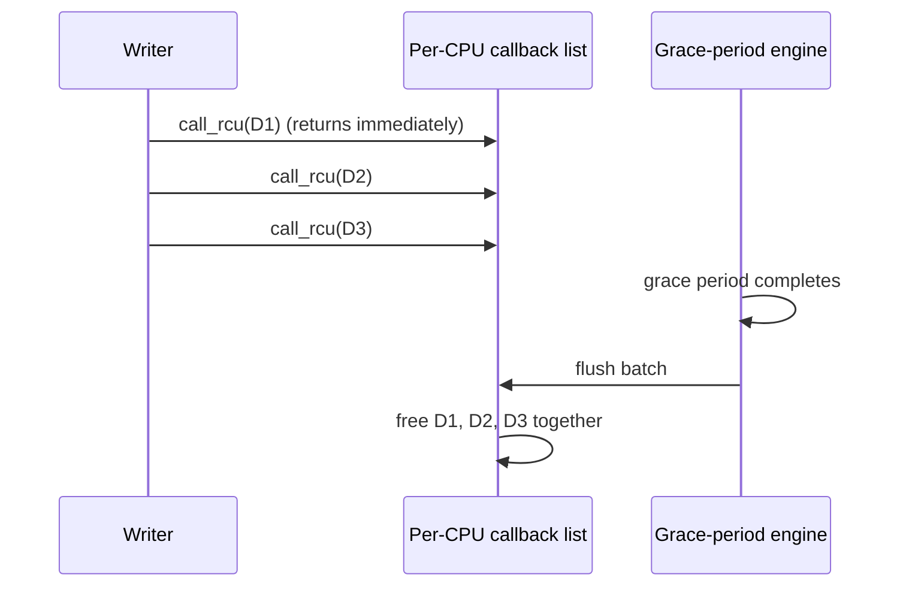

# RCU (Read-Copy-Update) — Senior Level

> **Audience:** Engineers building or operating read-mostly systems — kernel subsystems, network data planes, configuration distribution, in-memory caches — who need to know where RCU earns its keep, how deferred reclamation (`call_rcu`) and the RCU flavors (classic, preemptible, SRCU) work, and how to reason about memory and latency trade-offs. Prerequisite: `junior.md`, `middle.md`.

This document covers the **applied and systems** side of RCU: the data structures it protects in the Linux kernel (routing/forwarding tables, `dcache`, device and module lists), how `call_rcu` enables deferred batched reclamation, the **flavors** of RCU (classic non-preemptible, preemptible/SRCU) and why they exist, **userspace RCU** (liburcu) for application servers, and the memory-vs-latency trade-offs you must manage in production. We give concrete Go and Java patterns for read-mostly routing tables and config, and a note on Python.

---

## Table of Contents

1. [Where RCU Lives in the Linux Kernel](#kernel)
2. [Read-Mostly Routing / Forwarding Tables](#routing)
3. [Read-Mostly Config Distribution](#config)
4. [call_rcu — Deferred, Batched Reclamation](#call-rcu)
5. [RCU Flavors — Classic, Preemptible, SRCU](#flavors)
6. [Userspace RCU (liburcu)](#userspace)
7. [Memory and Latency Trade-offs](#tradeoffs)
8. [Code — Read-Mostly Routing Table in Go and Java](#code)
9. [Production Patterns and War Stories](#war-stories)
10. [Operational Guidance — Monitoring, Tuning, Rollout](#operations)
11. [RCU in Databases and Network Data Planes](#databases)
12. [History, Patents, and the Evolution of Kernel RCU](#history)
13. [Choosing Between RCU, Epoch Reclamation, and GC Snapshots](#choosing-impl)

---

<a name="kernel"></a>
## 1. Where RCU Lives in the Linux Kernel

RCU is one of the most-used synchronization primitives in Linux, with **hundreds of thousands** of `rcu_read_lock` call sites. It protects data that is read on nearly every operation but updated rarely:

- **The directory entry cache (`dcache`)**. Path lookups (`open`, `stat`, every file access) walk the dentry tree under `rcu_read_lock` with no locks — this is "RCU-walk" (`rcu_walk`) path resolution, which made the VFS scale to many cores. Renames and unlinks are the rare writers that publish new dentries and `call_rcu` the old ones.
- **Networking: routing and neighbor tables, network device lists, netfilter rule sets.** Every packet consults these; they change rarely (a route added, an interface configured). Detailed below.
- **The module list and the list of registered notifiers/handlers.** Read on many hot paths, written only on `insmod`/`rmmod` or registration.
- **Process and credential structures, namespace lists, cgroup hierarchies** — read-mostly metadata.
- **SELinux/AppArmor policy** — read on every access check, replaced wholesale on policy reload (a single published pointer swap to a new immutable policy DB).

The recurring shape: a **pointer (or pointer-linked structure) read on the hot path, replaced by publishing a new version, with the old version reclaimed via `call_rcu` after a grace period.** RCU is what let Linux remove the global locks (`dcache_lock`, `rtnl` on the read side, the big reader-writer locks) that throttled multicore scaling in the 2000s.

---

<a name="routing"></a>
## 2. Read-Mostly Routing / Forwarding Tables

A router/host forwarding table maps a destination prefix to a next-hop. On a busy machine it is consulted **per packet** — millions of times per second across all cores — and updated only when a route changes (BGP update, link state change, admin command). This is the archetypal RCU workload.

### 2.1 The RCU design

- The table is an immutable structure (e.g., a trie / LPM table) reachable through a single published pointer, or a linked structure of immutable nodes.
- **Lookup (reader):** `rcu_read_lock()`, subscribe to the table pointer, perform the longest-prefix-match traversal, `rcu_read_unlock()`. No lock, per-packet, wait-free.
- **Update (writer):** build the new node(s) via copy-on-write (often only the path from root to the changed leaf — *structural sharing*, so the copy is O(log n), not O(n)), publish by swapping the affected pointer, then `call_rcu` the superseded nodes.

### 2.2 Why structural sharing matters here

A routing table can have hundreds of thousands of entries. Copying the whole table on every route change would be ruinous. Instead, the writer copies only the **nodes on the path to the change** and re-points the rest at the existing (shared, immutable) subtrees. Readers traversing the old root see a fully consistent old table; readers picking up the new root see the new one; shared subtrees are referenced by both. Only the few copied old nodes are reclaimed after the grace period. This is the same principle as a persistent/immutable tree (`11-persistent-segment-tree` in this section).

### 2.3 The staleness contract

A packet that began its lookup just before a route update may be forwarded per the *old* route. This is **acceptable and correct** — routing is eventually consistent anyway, and a single stale forward during the microsecond grace period is invisible compared to BGP convergence times measured in seconds. RCU's "reader may be one version stale" semantics fit routing perfectly.

---

<a name="config"></a>
## 3. Read-Mostly Config Distribution

Application servers face the same pattern at the app layer: feature flags, rate-limit rules, tenant routing, A/B assignments — read on every request, updated on deploy or admin action.

The RCU pattern: hold the whole config as a **single immutable object** behind an atomic pointer. Request handlers subscribe once at the start of handling and read fields lock-free. A config push builds a new immutable object and swaps the pointer; the old object is reclaimed by the runtime (GC) once in-flight requests finish — a grace period delivered by the garbage collector.

Benefits over a `RWMutex`-guarded config:

- Request handlers never touch a shared lock; config reads add ~one pointer load to each request.
- A config push never blocks request handling; handlers in flight finish on the old config (consistent), new requests pick up the new config.
- No reader-side cache-line contention even at millions of req/s across many cores.

The cost: each push allocates a new config object (garbage), and a handler may use a config one push behind for the duration of one request — virtually always fine.

---

<a name="call-rcu"></a>
## 4. call_rcu — Deferred, Batched Reclamation

`synchronize_rcu()` blocks the writer for a grace period. In hot kernel paths and latency-critical writers, blocking is unacceptable. `call_rcu()` defers reclamation without blocking.

### 4.1 Mechanics

Each RCU-managed object embeds an `rcu_head` (a small struct: a function pointer + a `next` link). To reclaim object `D`:

```c
call_rcu(&D->rcu_head, my_free_callback);
```

This enqueues `D` onto the current CPU's **callback list** and returns immediately. The RCU subsystem tracks grace periods; when the grace period that started after this enqueue completes, it invokes `my_free_callback(&D->rcu_head)`, which typically does `kfree(container_of(head, ...))`.

### 4.2 Batching amortizes cost

Crucially, **one grace period flushes many callbacks at once**. If a thousand objects are `call_rcu`'d during one grace period, they are all freed together when it ends. The grace-period detection cost (observing every CPU quiescent) is paid once and amortized across all pending callbacks. This is why `call_rcu` is the workhorse for high-frequency reclamation: the per-object overhead approaches zero.

### 4.3 The danger: callback backlog

If writers `call_rcu` faster than grace periods complete (e.g., a tight loop deleting list nodes), the callback lists grow without bound and memory balloons — pending-but-not-yet-freed objects accumulate. The kernel defends with:

- **`rcu_barrier()`** — waits until all previously queued `call_rcu` callbacks have run (used at module unload to ensure no callback fires into freed code).
- **Expedited grace periods** (`synchronize_rcu_expedited`) — force a faster grace period by actively poking CPUs, at the cost of more IPIs.
- **Callback offloading and throttling** — heuristics that cap backlog and apply back-pressure.

A senior engineer using `call_rcu` must bound the write rate or monitor callback backlog; otherwise a write storm becomes an OOM.



---

<a name="flavors"></a>
## 5. RCU Flavors — Classic, Preemptible, SRCU

RCU is not one implementation but a family, because different read-side environments need different quiescent-state definitions.

### 5.1 Classic (non-preemptible) RCU

Read-side sections **disable preemption** (`rcu_read_lock()` ⇒ `preempt_disable()`). Therefore a read-side section cannot be preempted or sleep, and **any context switch is a quiescent state**. This makes grace-period detection almost free — the scheduler's existing context switches are the quiescent-state reports. The constraint: you **must not block or sleep** inside a classic read-side section. This is the flavor used on most kernel hot paths.

### 5.2 Preemptible RCU (`PREEMPT_RCU`)

On `CONFIG_PREEMPT` kernels (low-latency / real-time), the kernel wants read-side sections to be **preemptible** so a high-priority task isn't delayed by a low-priority reader holding a section. Preemptible RCU allows a read-side section to be preempted; it tracks read-side nesting with a per-task counter and uses a more elaborate (but still reader-cheap) scheme to detect grace periods. The reader still does no atomic on the fast path in the common case; the bookkeeping for preemption is the added cost. This flavor trades a slightly heavier grace-period mechanism for better real-time latency.

### 5.3 SRCU — Sleepable RCU

Sometimes a read-side section legitimately needs to **sleep** (e.g., it does I/O, takes a mutex, faults in a page). Classic and preemptible RCU forbid sleeping (it would stall grace periods indefinitely). **SRCU** allows sleeping readers by:

- Using **per-domain** (`struct srcu_struct`) state, so a long-sleeping reader in one SRCU domain stalls only that domain's grace periods, not the whole system's.
- Having readers do a (cheap) per-CPU counter operation in `srcu_read_lock()` that returns an index; `srcu_read_unlock()` takes that index. Grace-period detection sums per-CPU counters rather than relying on context switches.

SRCU's read side is slightly more expensive than classic RCU (a per-CPU counter increment, not a plain mark), but it permits blocking readers and bounds the blast radius of a stuck reader to one domain. Use SRCU when read-side sections must sleep; use classic/preemptible otherwise.

### 5.4 Comparison

| Flavor | Read side may sleep? | Read-side cost | Quiescent state | Use when |
|---|---|---|---|---|
| Classic (non-preempt) | No | preempt_disable (≈ free) | any context switch | hot paths, no blocking in section |
| Preemptible RCU | No (but is preemptible) | per-task nesting counter | scheduler + nesting tracking | real-time / low-latency kernels |
| SRCU | **Yes** | per-CPU index counter | per-domain counter sums | read-side must block/sleep |

There is also **Tasks RCU** (and Tasks-Trace RCU) for tracing/BPF, where the quiescent state is "the task voluntarily blocked," used to safely free trampolines. The principle is identical: define a quiescent state appropriate to the read environment, then wait until all readers have passed it.

---

<a name="userspace"></a>
## 6. Userspace RCU (liburcu)

RCU is not kernel-only. **liburcu** (Userspace RCU, by Mathieu Desnoyers and Paul McKenney) brings RCU to application code, used in LTTng tracing, high-frequency trading systems, network appliances, and databases.

Userspace lacks the kernel's free quiescent states (no scheduler hook), so liburcu offers several flavors with different reader costs:

| liburcu flavor | Reader cost | How quiescent states are detected |
|---|---|---|
| **QSBR** (Quiescent-State-Based Reclamation) | **Zero** on the fast path — `rcu_read_lock/unlock` are no-ops | The application **explicitly** calls `rcu_quiescent_state()` at natural points (e.g., the top of an event loop) to announce quiescence. Fastest reads; requires app cooperation. |
| **Memory-barrier** (default `liburcu`) | one memory barrier per `rcu_read_lock/unlock` | Per-thread counters; reasonable default. |
| **Signal-based** (`urcu-signal`) | nearly free reads | Uses a POSIX signal to force readers to a quiescent state on demand; trades a signal-handler IPI on the writer side for cheap reads. |
| **Bulletproof** (`urcu-bp`) | heavier | Self-registering threads; for libraries that can't control thread lifecycle. |

The trade-off space mirrors the kernel: **QSBR** gives the absolute cheapest reads (truly free, like classic kernel RCU) but demands that the application periodically report quiescence; the **memory-barrier** flavor needs no app cooperation but adds a barrier per section. A senior choosing a flavor weighs "can I instrument my event loop with `rcu_quiescent_state()`?" against "I want drop-in RCU with no app changes."

liburcu also provides RCU-protected data structures (lock-free hash table `cds_lfht`, RCU lists, queues) — directly relevant to `18-concurrent-hash-map`, which can be built RCU-style: readers traverse buckets lock-free; resize/rehash publishes a new bucket array and reclaims the old after a grace period.

---

<a name="tradeoffs"></a>
## 7. Memory and Latency Trade-offs

### 7.1 The memory cost: coexisting versions

During every grace period, **old and new versions coexist**. With `synchronize_rcu`, at most one old version per object is outstanding (the writer blocks until it's freed). With `call_rcu`, **many** old versions can be outstanding — bounded by the write rate × grace-period length. Under a write burst this is a real memory spike. Mitigations:

- Bound writer rate or coalesce writes.
- Use structural sharing so each old version is small (only the copied path).
- Monitor callback backlog; trigger expedited grace periods if it grows.
- Cap the number of pending versions and fall back to `synchronize_rcu` (apply back-pressure) when over budget.

### 7.2 The latency cost: grace-period duration

A grace period lasts as long as it takes every CPU to reach a quiescent state — typically tens of microseconds to a few milliseconds, depending on load and flavor. This is the **writer-visible latency** for synchronous reclamation. For a writer that must free promptly (e.g., tearing down a subsystem before reusing the memory), this latency is on the critical path. Expedited grace periods cut it (more IPIs); `call_rcu` hides it (the writer doesn't wait, but reclamation is delayed).

### 7.3 The reader benefit, quantified

The pay-off for these writer costs: reads scale **linearly** with cores and have **bounded** latency. On a 64-core box serving millions of read-mostly lookups per second, replacing an rwlock with RCU commonly yields multi-fold throughput improvements precisely because the reader-count cache line stops bouncing. The break-even is set by the read:write ratio — the more read-dominated, the bigger the win.

### 7.4 Summary table

| Cost / benefit | Mechanism | Who pays |
|---|---|---|
| Extra memory (old+new) | versions coexist during grace period | system memory; worsens with `call_rcu` backlog |
| Grace-period latency | wait for all CPUs quiescent | writer (sync) or deferred (async) |
| Copy cost | COW on update | writer CPU; mitigated by structural sharing |
| Free reads | no atomics, no shared writes | benefit to every reader/core |
| GC pressure (managed langs) | new snapshots are garbage | GC; worsens with write rate |

---

<a name="code"></a>
## 8. Code — Read-Mostly Routing Table in Go and Java

We model an RCU-style longest-prefix-ish routing table: readers look up lock-free; writers publish a new immutable table.

### 8.1 Go — `atomic.Pointer` to an immutable table

```go
package routing

import (
	"sync"
	"sync/atomic"
)

// Route is one entry. RouteTable is IMMUTABLE once published.
type Route struct {
	Prefix  string
	NextHop string
}

type RouteTable struct {
	routes []Route // sorted/structured for lookup; never mutated after publish
}

// lookup is a pure read over the immutable table.
func (t *RouteTable) lookup(dst string) (string, bool) {
	for i := range t.routes { // illustrative linear scan; real code = LPM trie
		if matches(t.routes[i].Prefix, dst) {
			return t.routes[i].NextHop, true
		}
	}
	return "", false
}

// RCURouting holds the current immutable table behind an atomic pointer.
type RCURouting struct {
	tbl     atomic.Pointer[RouteTable]
	writeMu sync.Mutex // serialize writers
}

func New(initial *RouteTable) *RCURouting {
	r := &RCURouting{}
	r.tbl.Store(initial) // publish v1
	return r
}

// Lookup: reader fast path — subscribe + traverse. No lock, per-packet.
func (r *RCURouting) Lookup(dst string) (string, bool) {
	t := r.tbl.Load() // SUBSCRIBE (acquire)
	return t.lookup(dst)
}

// AddRoute: writer — copy-on-write, publish, GC reclaims the old table (grace period).
func (r *RCURouting) AddRoute(rt Route) {
	r.writeMu.Lock()
	defer r.writeMu.Unlock()

	old := r.tbl.Load()
	next := &RouteTable{routes: make([]Route, len(old.routes), len(old.routes)+1)}
	copy(next.routes, old.routes) // COPY (here whole; real code shares subtrees)
	next.routes = append(next.routes, rt)
	r.tbl.Store(next) // PUBLISH (release): new table live
	// old table reclaimed by GC once no in-flight Lookup references it == grace period.
}
```

Per-packet lookups never lock; route additions serialize only against other writers and never block lookups. The Go GC is the grace-period-and-reclaim engine.

### 8.2 Java — `AtomicReference` + immutable table + copy-on-write

```java
import java.util.ArrayList;
import java.util.List;
import java.util.concurrent.atomic.AtomicReference;

final class Route {
    final String prefix, nextHop;
    Route(String prefix, String nextHop) { this.prefix = prefix; this.nextHop = nextHop; }
}

final class RouteTable {           // immutable snapshot
    private final List<Route> routes;
    RouteTable(List<Route> routes) { this.routes = List.copyOf(routes); } // unmodifiable
    String lookup(String dst) {
        for (Route r : routes) if (matches(r.prefix, dst)) return r.nextHop;
        return null;
    }
    RouteTable withRoute(Route add) {            // COPY-ON-WRITE
        List<Route> next = new ArrayList<>(routes);
        next.add(add);
        return new RouteTable(next);
    }
    static boolean matches(String prefix, String dst) { return dst.startsWith(prefix); }
}

public final class RcuRouting {
    private final AtomicReference<RouteTable> ref;
    private final Object writeLock = new Object();

    public RcuRouting(RouteTable initial) { this.ref = new AtomicReference<>(initial); }

    /** Reader fast path: subscribe (one acquire read) + traverse. No lock. */
    public String lookup(String dst) {
        return ref.get().lookup(dst); // SUBSCRIBE
    }

    /** Writer: copy-on-write + atomic publish. JVM GC = grace period. */
    public void addRoute(Route r) {
        synchronized (writeLock) {
            RouteTable next = ref.get().withRoute(r); // COPY + modify
            ref.set(next);                            // PUBLISH (release)
        }
    }
}
```

`List.copyOf` and `final` fields make each `RouteTable` a safely-published immutable snapshot (the JMM final-field guarantee provides publish safety). Readers never lock; the GC reclaims superseded tables after the last reader drops them.

### 8.3 Python — immutable table + atomic rebind (note on the GIL)

```python
import threading
from dataclasses import dataclass
from typing import Tuple

@dataclass(frozen=True)              # immutable snapshot
class Route:
    prefix: str
    next_hop: str

@dataclass(frozen=True)
class RouteTable:
    routes: Tuple[Route, ...]        # tuple => immutable
    def lookup(self, dst: str):
        for r in self.routes:        # illustrative scan; real code = LPM trie
            if dst.startswith(r.prefix):
                return r.next_hop
        return None
    def with_route(self, r: Route) -> "RouteTable":
        return RouteTable(self.routes + (r,))   # COPY-ON-WRITE

class RcuRouting:
    def __init__(self, initial: RouteTable):
        self._tbl = initial          # the "published pointer" (a name binding)
        self._write_lock = threading.Lock()
    def lookup(self, dst: str):      # reader: subscribe + traverse, no lock
        return self._tbl.lookup(dst)
    def add_route(self, r: Route):   # writer: copy-on-write + atomic rebind
        with self._write_lock:
            self._tbl = self._tbl.with_route(r)   # PUBLISH
```

**Note:** under CPython's GIL there is no multicore read scaling, but the pattern (atomic name-rebind to a new frozen table, refcount reclamation) is still the clearest correct way to expose a read-mostly table to threads without reader locks. For genuine parallel userspace RCU in production, use Go, Java, or C with liburcu.

---

<a name="war-stories"></a>
## 9. Production Patterns and War Stories

### 9.1 The dcache scalability win

Before RCU-walk, Linux path lookup took the global `dcache_lock` on every component of every path — a brutal multicore bottleneck. Converting the read side to RCU (`rcu_walk`) let path resolution proceed lock-free, with the slow fallback to "ref-walk" (lock-based) only on the rare cases RCU-walk can't handle (e.g., the dentry is being deleted). The result was order-of-magnitude scalability improvements on file-heavy workloads. **Lesson:** RCU's biggest wins come from removing a global lock on a per-operation read path.

### 9.2 The call_rcu backlog OOM

A networking subsystem deleted flow entries with `call_rcu` under a connection-tear-down storm (a DDoS event). Grace periods couldn't keep pace with the deletion rate; the callback lists grew into the gigabytes and the box OOM'd — the system was killed not by the attack's traffic but by its own pending-reclamation backlog. **Fix:** rate-limit deletions and/or switch to `synchronize_rcu` (back-pressure) past a backlog threshold, plus monitoring on callback queue depth. **Lesson:** `call_rcu` decouples writers from reclamation — including decoupling them from reality if you don't bound the rate.

### 9.3 The stale-config "bug" that wasn't

An on-call engineer reported that immediately after a config push, a few requests still used old feature flags and filed it as a bug. It was RCU working as designed: in-flight requests that subscribed before the push finished on the old immutable config; only requests starting after the push saw the new one. **Fix:** document the staleness contract ("a config push takes effect for *new* requests; in-flight requests complete under the config they started with"). **Lesson:** RCU's one-version-stale semantics must be explicit in the API contract, or correct behavior looks like a bug.

### 9.4 The blocking-in-read-section stall

A driver took a sleeping mutex inside a classic `rcu_read_lock` section. On a `PREEMPT` kernel this triggered "sleeping in RCU read-side section" warnings and, under load, RCU stalls — grace periods never completing because a reader was blocked indefinitely. **Fix:** move the blocking work outside the section, or switch that path to **SRCU** (sleepable). **Lesson:** match the flavor to the read environment; never block in classic/preemptible read-side sections.

---

<a name="operations"></a>
## 10. Operational Guidance — Monitoring, Tuning, Rollout

Running RCU in production is as much an operational discipline as a coding one. The costs are deferred and indirect, so they hide until a load spike exposes them.

### 10.1 What to monitor

| Signal | Why it matters | Where it shows up |
|---|---|---|
| **Grace-period duration / count** | Long or stalling grace periods delay all reclamation | Kernel: `/sys/kernel/debug/rcu/` and `rcu_*` tracepoints; app: instrument your epoch advance |
| **Callback backlog (pending `call_rcu`)** | A growing backlog is a pre-OOM warning | Kernel: `rcu_nocb`/`rcutree` stats; app: queue depth gauge |
| **Outstanding versions / retired-object count** | Direct memory pressure from coexisting versions | App-level counter on retire/reclaim |
| **Write rate** | Drives copy cost, GC pressure, and backlog | App metrics; rate-limit if it spikes |
| **Reader-section duration (p99)** | Long readers extend grace periods | Trace `rcu_read_lock`→`unlock` spans |
| **GC pause time / allocation rate (managed langs)** | RCU writes create garbage; the GC is your reclaimer | JVM GC logs, Go `GODEBUG=gctrace=1` |
| **RCU stall warnings (kernel)** | A reader stuck in a section (blocked/looping) | dmesg "RCU stall" splats |

### 10.2 Tuning levers

- **Coalesce writes.** Batch many small config/route changes into one publish to cut copy count, GC garbage, and backlog. A debounced "apply every 100 ms" publisher often beats per-change publishes.
- **Structural sharing.** Copy only the changed path; this is the single biggest lever for both copy cost and retired-memory size.
- **Choose `synchronize_rcu` vs `call_rcu` deliberately.** Use `call_rcu` for throughput, but cap the backlog and fall back to `synchronize_rcu` (back-pressure) above a threshold so a write storm self-throttles instead of OOMing.
- **Expedite when latency-critical.** `synchronize_rcu_expedited` cuts grace-period latency at the cost of IPIs — use sparingly, only where prompt reclamation is on the critical path (teardown, memory reuse).
- **Keep read sections short.** Move any blocking or long computation outside the section; copy out the scalars you need and release the section early.
- **Right-size GC in managed languages.** A high write rate plus large snapshots can pressure the GC; ensure heap headroom and a low-pause collector (e.g., Go's concurrent GC, JVM ZGC/Shenandoah) so reclamation keeps pace.

### 10.3 Rollout discipline

- **Make the staleness contract explicit** in the API and runbook ("a config push takes effect for new operations; in-flight ones complete under their subscribed version"). This prevents false bug reports (see §9.3).
- **Load-test the write path under burst**, not just steady state — the backlog/memory failure mode only appears under a write storm.
- **Add a kill switch** on the writer rate so an operational incident (or attack) that triggers rapid writes can be throttled without a redeploy.
- **Verify under a sanitizer/race detector in CI** with a concurrent reader/writer stress test; RCU bugs (use-after-free, torn reads) are nondeterministic and won't surface in single-threaded tests.

---

<a name="databases"></a>
## 11. RCU in Databases and Network Data Planes

RCU and RCU-like reclamation appear far beyond the kernel proper.

### 11.1 In-memory databases and caches

In-memory stores with read-mostly metadata — schema/catalog objects, query plans, replication topology, routing of keys to shards — use RCU-style publish-and-reclaim so that the **read path (every query) never locks the catalog**. A schema change or topology update builds a new immutable catalog snapshot and swaps a pointer; in-flight queries finish against the catalog they started with (a consistent snapshot), and new queries see the new one. This is why catalog reads don't appear in lock-contention profiles even under heavy DDL-adjacent activity.

Some storage engines apply the same idea to **index roots**: a B-tree or trie index can be made read-mostly by publishing a new root after a structural change and reclaiming superseded nodes via epoch/RCU reclamation, letting readers descend the tree lock-free. (This connects to `11-persistent-segment-tree` and the immutable-tree family — RCU is the concurrency discipline that makes an immutable/persistent structure safe to *reclaim* under concurrent readers.)

### 11.2 Network data planes

Software routers, firewalls, and load balancers (DPDK-based fast paths, eBPF/XDP programs, Open vSwitch) live or die on per-packet lookup cost. Their forwarding tables, flow tables, and ACLs are RCU-protected (or use the directly analogous epoch-based reclamation): the data-plane thread does a lock-free, wait-free lookup per packet; the control plane publishes table updates and reclaims old tables after a grace period. At 10–100 Gbps, a single atomic on the read path per packet would be unaffordable, so RCU's "no atomic on the read fast path" is not a nicety — it is the enabling property.

### 11.3 Userspace RCU in these systems

These systems typically use **liburcu** (often the QSBR flavor, since a packet-processing loop or query loop has a natural quiescent point each iteration) or a hand-rolled **epoch-based reclamation** scheme equivalent to RCU. The engineering pattern is identical to the kernel: define a quiescent state appropriate to the loop (top of the per-packet loop, top of the per-query loop), let readers run free, and reclaim retired structures once all loops have cycled past the retirement epoch.

| System class | Read-mostly RCU-protected data | Read path | Reclamation |
|---|---|---|---|
| In-memory DB | catalog, query plans, shard map, index roots | per-query lookup, lock-free | epoch/RCU after readers drain |
| Network data plane | forwarding/flow/ACL tables | per-packet lookup, wait-free | grace period after control-plane publish |
| Caches | parsed-config, regex, DNS caches | per-hit lookup, lock-free | GC / epoch reclamation |
| Tracing (LTTng) | ring-buffer metadata, probe lists | per-event, lock-free | liburcu grace period |

---

<a name="history"></a>
## 12. History, Patents, and the Evolution of Kernel RCU

Understanding where RCU came from clarifies *why* it is shaped the way it is.

### 12.1 Origins

The core idea — defer reclamation until all pre-existing readers finish, identified via quiescent states — predates the name. Related techniques appear in **Kung and Lehman (1980)** on concurrent binary search trees ("garbage collection" of removed nodes once no reader can reach them) and in **passive serialization** work at IBM and Sequent in the 1990s. **Paul McKenney** and colleagues at Sequent (later acquired by IBM) developed and named **Read-Copy-Update**, contributing it to the Linux kernel around 2002 (kernel 2.5/2.6). The "copy" in the name reflects the original framing: writers copy-modify-publish.

A notable practical wrinkle: early RCU work was encumbered by **patents** (held by Sequent/IBM), which slowed adoption outside Linux for years; userspace RCU and broad industry use accelerated once licensing was clarified and the patents aged out. This history is why, for a long time, RCU was "the kernel thing" while application code reached for rwlocks — the techniques were freely usable in the GPL kernel but legally murky elsewhere.

### 12.2 Evolution inside the kernel

Kernel RCU has gone through several major implementations, each solving a scaling or capability problem:

| Era | Implementation | Problem it solved |
|---|---|---|
| Early 2.6 | "Classic RCU" | a single global state for grace-period detection |
| ~2008 | **Tree RCU** | scale grace-period detection to thousands of CPUs via a hierarchy of `rcu_node`s (avoid one contended counter) |
| ~2009+ | **Preemptible RCU** | allow preemption of read-side sections for `PREEMPT_RT` / real-time |
| ongoing | **SRCU** | sleepable read-side sections, per-domain grace periods |
| ongoing | **Tasks RCU / Tasks-Trace RCU** | safely free BPF/ftrace trampolines (quiescent state = task voluntarily blocks) |
| ongoing | **NO-CB / callback offloading** | move `call_rcu` callback processing off latency-sensitive CPUs |

The throughline: each variant keeps the **reader fast path nearly free** while adapting the **quiescent-state definition and grace-period machinery** to a new read environment or scale. That is the deep design lesson of RCU — the read side is sacrosanct; everything negotiable lives in the writer/grace-period side.

### 12.3 Why this matters to a senior engineer

When you choose an RCU flavor or a userspace RCU library, you are implicitly choosing a quiescent-state definition and a grace-period cost. The kernel's evolution is a menu of trade-offs: free reads but no blocking (classic), real-time latency (preemptible), sleepable readers (SRCU), or massive CPU scale (Tree RCU). Recognizing which problem each variant solves lets you pick correctly rather than cargo-culting "use RCU." And the history — quiescent-state reclamation as a decades-old idea, now ubiquitous — signals that the *pattern* (immutable snapshot, publish, grace period) transcends any one implementation and is worth carrying into your own systems via liburcu, epoch reclamation, or a GC-backed snapshot design.

---

<a name="choosing-impl"></a>
## 13. Choosing Between RCU, Epoch Reclamation, and GC Snapshots

In practice a senior engineer rarely writes kernel RCU directly; the decision is *which RCU-flavored reclamation technique* to use in their stack. Three realistic options:

### 13.1 GC-backed immutable snapshots (Go, Java, C#, JS, Python)

If you are in a garbage-collected runtime, the simplest correct RCU is: an atomic pointer to an immutable snapshot, copy-on-write writers, and **let the GC reclaim old versions**. No grace-period code, no `call_rcu`, no `rcu_head`. The GC *is* the grace period. This is what the Go/Java examples in §8 do.

- **Pros:** trivial to write, impossible to use-after-free (the runtime tracks references), composes with the rest of your managed code.
- **Cons:** reclamation cost reappears as **GC pressure**; high write rates create garbage; you have less control over *when* reclamation happens; large snapshots stress the heap.
- **Use when:** you're already in a managed runtime and the write rate is modest. This covers the vast majority of application-level read-mostly config/route/cache needs.

### 13.2 Epoch-based reclamation (EBR) — Rust crossbeam, custom C/C++

EBR is "RCU with an explicit global epoch counter," used by lock-free libraries (Rust's `crossbeam-epoch`, many C++ structures). Readers pin the current epoch; retired objects from epoch `e` are freed once all readers advance two epochs past `e`.

- **Pros:** free-ish reads (a pinned-epoch read, no per-object fence), time-bounded memory, no runtime/GC dependency, works in unmanaged languages.
- **Cons:** you manage epoch advance and reclamation; backlog possible (like `call_rcu`); a stuck reader pins an epoch and stalls reclamation.
- **Use when:** you need RCU semantics in an unmanaged language (Rust, C++) with cheap reads and can tolerate time-bounded memory.

### 13.3 liburcu (userspace RCU) — C/C++ servers

The full userspace RCU library, with flavor choice (QSBR for free reads, memory-barrier for drop-in, etc.) and ready-made RCU data structures.

- **Pros:** battle-tested, multiple flavors, includes lock-free hash table and lists, used in production tracing and networking.
- **Cons:** C API, requires thread registration, flavor selection adds a decision; QSBR needs you to instrument quiescent points.
- **Use when:** building a high-performance C/C++ server (data plane, tracer, DB engine) that needs the cheapest possible reads and is willing to integrate liburcu.

### 13.4 Decision table

| Your stack / need | Recommended reclamation |
|---|---|
| Go / Java / C# app, modest writes | GC-backed immutable snapshots (§13.1) |
| Rust / C++ lock-free structure, cheap reads | epoch-based reclamation (crossbeam / custom) |
| C/C++ high-perf server, absolute cheapest reads | liburcu (QSBR flavor) |
| Linux kernel subsystem | kernel RCU (classic / preemptible / SRCU per environment) |
| Hard memory bound under write bursts | hazard pointers instead (see `20-hazard-pointers`) |

The unifying insight: these are all the **same pattern** (immutable snapshot + publish + deferred reclamation after readers drain); they differ only in *how* "readers drain" is detected and *who* performs the free. Pick the one that matches your language and your control-vs-convenience preference, and keep the design (single atomic publish, immutable versions, bounded backlog) identical across all of them.

### 13.5 A migration story: from RWMutex to RCU

A concrete senior-level scenario worth rehearsing: you inherit a service whose hot path takes a global `RWMutex.RLock()` on a config object for every request, and profiling shows the rwlock's reader bookkeeping is the top contention point at high core counts. The migration:

1. **Make the config immutable.** Audit every field; ensure nothing mutates the object after construction. Convert mutable collections to unmodifiable ones. This is the hardest *engineering* step and the one most likely to reveal hidden in-place mutations.
2. **Put it behind an atomic pointer.** Replace `mu.RLock(); read fields; mu.RUnlock()` with `cfg := ptr.Load(); read fields`. Replace the write path with copy-on-write + `ptr.Store`, serialized by a writer mutex.
3. **Delete the reader lock entirely.** The whole point — readers now take no lock.
4. **Document the staleness contract** and update the runbook (a push affects new requests; in-flight ones finish on their snapshot).
5. **Load-test at the target core count** and confirm read throughput now scales linearly and the rwlock contention disappeared from the profile.

The payoff is usually dramatic at high core counts; the risk is entirely in step 1 (immutability), which is why the immutable-snapshot discipline is the heart of practical RCU.

### 13.6 Anti-patterns to avoid in production RCU

- **Per-field publishes for a logically atomic config change.** Two `Store`s let a reader see field A updated but B stale. Funnel both into one new snapshot, one publish.
- **Unbounded `call_rcu` under attacker-controllable write rates.** A DDoS or runaway client that triggers rapid writes turns deferred reclamation into an OOM vector. Always bound the backlog.
- **Long-lived snapshots held by background workers.** A worker that grabs a snapshot and holds it for minutes pins that version and (with `call_rcu`/epochs) stalls reclamation of everything behind it. Re-subscribe periodically or copy out what you need.
- **RCU on genuinely write-heavy data "because reads are fast."** If writes are frequent, the copy + reclamation cost (and GC churn) dominates; benchmark before assuming RCU helps.
- **Treating the returned snapshot as mutable in a language that can't enforce immutability (Go).** One stray write through the snapshot pointer corrupts every concurrent reader. Code review and contract documentation are your only guardrails here.

Each anti-pattern maps to a principle from earlier sections: single-publish linearizability, bounded backlog, short reader hold, the read:write break-even, and immutability. Production RCU is mostly the discipline of *not* violating these, since the happy path is deceptively simple.

---

## Summary

RCU's production home is the **read-mostly hot path**: kernel `dcache` lookups, routing/forwarding tables, device/module lists, and policy databases — read per-operation, replaced by publishing an immutable new version, reclaimed via `call_rcu` after a grace period. `call_rcu` defers and **batches** reclamation (amortizing grace-period cost) but must be rate-bounded to avoid callback-backlog OOM. The **flavors** exist to match the read environment: **classic** (non-preemptible, free reads, no blocking), **preemptible** (real-time latency), and **SRCU** (sleepable readers, per-domain). **Userspace RCU (liburcu)** brings the same to applications, with QSBR giving truly free reads in exchange for app-reported quiescence. The trade is always the same: **writers pay** (copy cost, grace-period latency, transient old+new memory, GC pressure in managed languages) so that **readers run free and scale linearly across cores**.

**Next step:** continue with [`professional.md`](./professional.md) for grace-period correctness proofs, exact memory-ordering requirements, the RCU-vs-hazard-pointers trade-off analysis, and linearizability of read-mostly structures.
