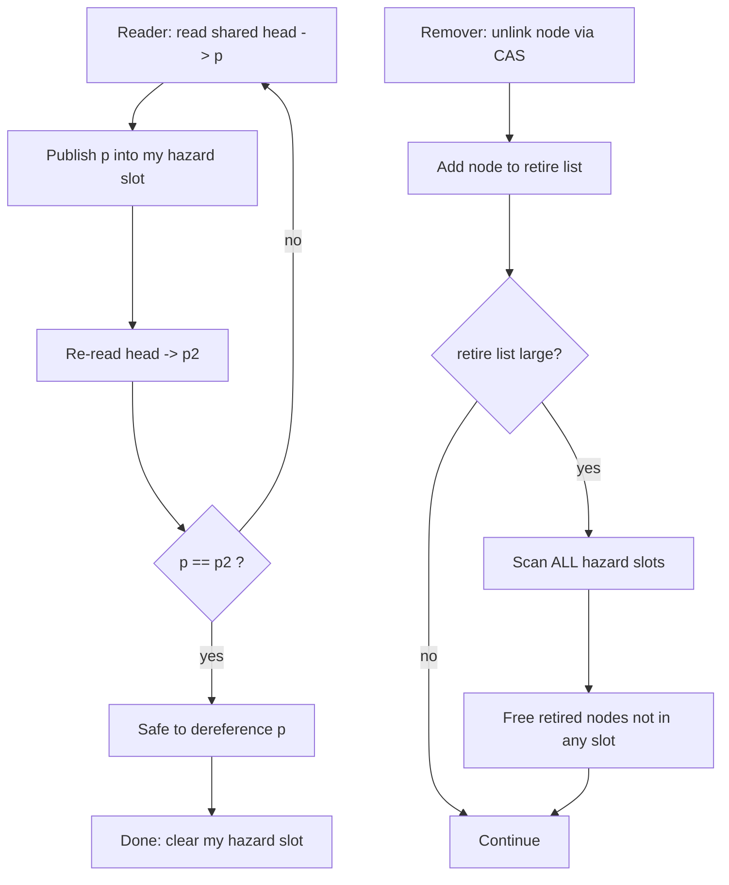
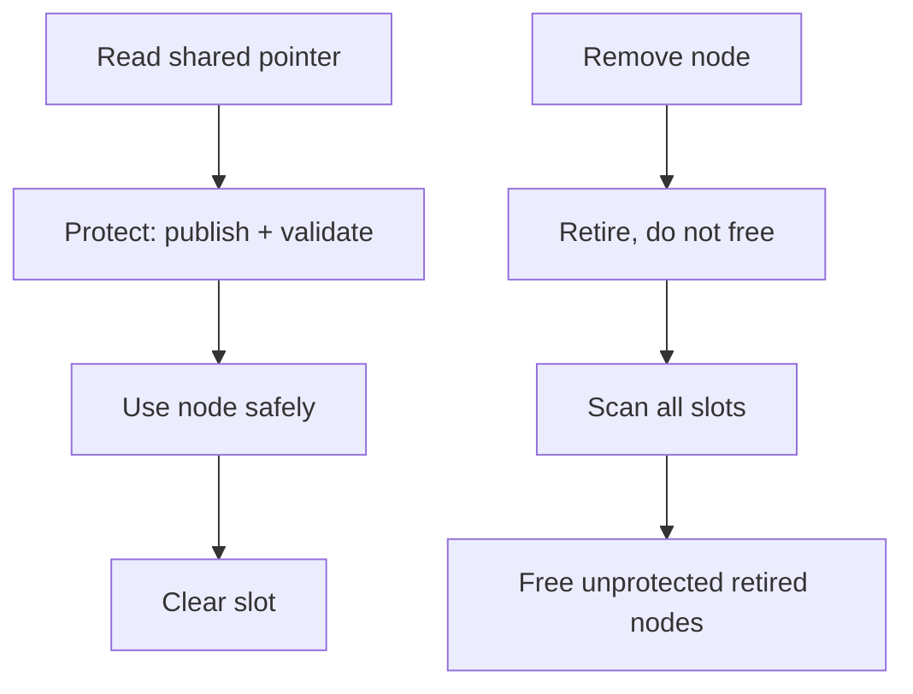

# Hazard Pointers — Junior Level

## Table of Contents

1. [Introduction](#introduction)
2. [Prerequisites](#prerequisites)
3. [Glossary](#glossary)
4. [The Use-After-Free Problem](#the-use-after-free-problem)
5. [Core Concepts](#core-concepts)
6. [How a Hazard Pointer Works](#how-a-hazard-pointer-works)
7. [A Small Worked Example](#a-small-worked-example)
8. [Big-O Summary](#big-o-summary)
9. [Real-World Analogies](#real-world-analogies)
10. [Pros & Cons](#pros--cons)
11. [Code Examples](#code-examples)
12. [Coding Patterns](#coding-patterns)
13. [Error Handling](#error-handling)
14. [Performance Tips](#performance-tips)
15. [Best Practices](#best-practices)
16. [Edge Cases & Pitfalls](#edge-cases--pitfalls)
17. [Common Mistakes](#common-mistakes)
18. [Cheat Sheet](#cheat-sheet)
19. [Visual Animation](#visual-animation)
20. [Summary](#summary)
21. [Further Reading](#further-reading)

---

## Introduction

> Focus: "What is it?" and "How to use it?"

A **hazard pointer** is a tool that lets many threads share a data structure
without locks, and still free memory **safely**.

Here is the problem it solves. Imagine a lock-free stack. Thread A is about to
read a node — it has a raw pointer to that node in a CPU register. At the very
same instant, thread B pops that same node off the stack and calls `free` on it.
Now thread A reads freed memory. This is a **use-after-free** bug: the program
might crash, read garbage, or be exploited.

A hazard pointer fixes this. Before a thread dereferences a shared pointer, it
**publishes** that pointer into a special slot that all other threads can see —
"I am about to use this node, do not free it." A thread that wants to free a node
first **scans** every published slot. If any slot points to the node, freeing is
delayed. The node is parked on a **retire list** and freed later, once no hazard
pointer references it.

That is the whole idea:

1. **Protect** — publish the pointer you are about to use into a hazard slot.
2. **Validate** — re-check the pointer is still in the structure (it may have
   been removed between your read and your publish).
3. **Use** — safely dereference it.
4. **Retire, not free** — when removing a node, do not free immediately. Add it
   to a retire list.
5. **Scan & reclaim** — periodically scan all hazard slots; free retired nodes
   that no slot references.

Hazard pointers are how production lock-free stacks, queues, and maps free their
memory safely. They appear in Facebook's **folly**, in **Concurrency Kit**, and
in **C++26's `std::hazard_pointer`**.

---

## Prerequisites

- **Required:** Basic programming — pointers/references, functions, arrays
  (in any of Go / Java / Python)
- **Required:** What a pointer is and what "freeing memory" means
- **Required:** Basic idea of threads running at the same time
- **Helpful:** Having seen a stack or linked list
- **Helpful:** The idea of an atomic operation (an indivisible read or write)

---

## Glossary

| Term | Definition |
|------|-----------|
| **Use-after-free** | Reading or writing memory that has already been freed — a serious bug |
| **Hazard pointer** | A per-thread slot where a thread publishes a pointer it is about to dereference |
| **Protect** | Publish a pointer into a hazard slot so other threads will not free it |
| **Retire** | Mark a removed node as "to be freed later" instead of freeing it now |
| **Retire list** | A thread-local list of nodes waiting to be freed |
| **Scan** | Read all threads' hazard slots to decide which retired nodes are safe to free |
| **Reclaim** | Actually free a retired node once no hazard pointer references it |
| **Lock-free** | Algorithm where threads make progress without holding locks |
| **CAS** | Compare-And-Swap — atomically change a value only if it still equals an expected value |
| **ABA problem** | A value changes A→B→A, so a CAS wrongly succeeds; hazard pointers help avoid the related reclamation bug |
| **SMR** | Safe Memory Reclamation — the general problem hazard pointers solve |

---

## The Use-After-Free Problem

Lock-free data structures are easy to **insert** into and **remove** from with a
single atomic compare-and-swap. The hard part is **when to free** a removed node.

Consider a Treiber stack (a lock-free stack). To pop, a thread does:

```text
loop:
    old   = head            // (1) read the top node pointer
    next  = old.next        // (2) DEREFERENCE old to read its next field
    if CAS(head, old, next) // (3) try to unlink old
        return old.value
```

Look at step (2). Between reading `head` in step (1) and dereferencing `old` in
step (2), another thread could pop and **free** that exact node. Then `old.next`
reads freed memory.

```text
Thread A                         Thread B
--------                         --------
old = head  (-> node X)
                                 pops node X, free(X)
next = old.next  // READS FREED MEMORY -> bug
```

There is no lock to stop thread B. We need a different mechanism that says
"thread A still cares about node X, so do not free it yet." That mechanism is the
hazard pointer.

---

## Core Concepts

### Concept 1: Each thread has a few hazard slots

A hazard slot is just a shared, atomically-written pointer variable. Each thread
owns one or a small fixed number (often 1 or 2) of these slots. The global set of
all slots is visible to every thread. A node is **protected** when at least one
slot currently holds its address.

### Concept 2: Publish before you dereference

Before a thread dereferences a shared pointer, it writes that pointer into its
hazard slot. This is the *publish* (or *protect*) step. The write must be visible
to other threads before the thread reads through the pointer — so a memory fence
is needed (more on that at higher levels).

### Concept 3: Validate after you publish

There is a race: between reading `head` and publishing it, the node may have been
removed and retired. So after publishing, the thread **re-reads** the shared
pointer. If it changed, the published value might already be unsafe — the thread
clears its slot and retries.

### Concept 4: Retire, then scan, then free

Removing a node never frees it directly. The node goes on a thread-local
**retire list**. Once the list grows past a threshold, the thread **scans** all
hazard slots, collects the set of protected addresses, and frees every retired
node that is **not** in that set. Protected nodes stay on the list for next time.

### Concept 5: Bounded memory

Because each thread retires in batches and scans periodically, the number of
nodes waiting to be freed is bounded — roughly `O(threads × slots_per_thread)`
unreclaimable at any time, plus the batch size. Memory does not grow without
limit.

---

## How a Hazard Pointer Works



The left path is the **reader/protect** path. The right path is the
**remover/reclaim** path. They never block each other; they only coordinate
through the published hazard slots.

---

## A Small Worked Example

Two threads, one hazard slot each, sharing a tiny stack `head -> X -> Y`.

```text
Initial:  head -> X -> Y
HP[A] = null    HP[B] = null    retire(B) = []

Step 1  A: p = head            -> X
Step 2  A: HP[A] = X           (publish: "I'm using X")
Step 3  A: re-read head == X   -> validation OK
Step 4  B: pops X: CAS(head, X, Y)  -> head -> Y
Step 5  B: retire(X)           retire(B) = [X]
Step 6  B: scan slots -> sees HP[A] == X
           X is protected -> DO NOT free, keep it on list
Step 7  A: reads X.value safely (X still alive)  -> done
Step 8  A: HP[A] = null         (clear slot)
Step 9  B: later scan -> HP[A] == null
           X not protected -> free(X). retire(B) = []
```

Notice the key moment: at **Step 6** thread B *wanted* to free X but the scan
found A's hazard slot pointing at X, so it waited. X is freed only at **Step 9**,
after A cleared its slot. No use-after-free occurs.

---

## Big-O Summary

| Operation | Complexity | Notes |
|-----------|-----------|-------|
| Protect (publish + validate) | O(1) amortized | One store, a fence, one re-read; may retry |
| Clear a hazard slot | O(1) | One atomic store of null |
| Retire a node | O(1) | Append to thread-local list |
| Scan + reclaim | O(R + H·K) per scan | R retired nodes, H threads, K slots/thread |
| Amortized free per node | O(1) | Scan cost spread over the retire batch |
| Memory held un-freed | O(H·K + batch) | Bounded, not unbounded |

Here `H` is the number of threads and `K` is hazard slots per thread (usually a
small constant such as 1 or 2).

---

## Real-World Analogies

| Concept | Analogy |
|---------|---------|
| **Hazard slot** | A "do not bus this table" sign you put on a restaurant table while you step away — staff see the sign and leave your plate |
| **Retire list** | A bin of dishes the busser collects but does not wash until checking no sign is up |
| **Scan** | The busser walking the floor, reading every table's sign before washing |
| **Validate step** | Double-checking your table number is still yours before sitting back down |

> Where the analogy breaks: real signs are reliable; in code the "sign" (the
> published pointer) can be set a moment too late, which is exactly why the
> *validate* re-read exists.

---

## Pros & Cons

| Pros | Cons |
|------|------|
| Bounded memory — retired nodes capped at `O(H·K + batch)` | More complex than reference counting |
| Low, fixed per-thread overhead (a few slots) | Reader pays a fence + a validate re-read |
| Lock-free / non-blocking readers and writers | Limited number of objects protected at once (K slots) |
| Solves the reclamation half of the ABA problem | Scan cost must be amortized correctly |
| No global locks during reclamation | Each protected access needs explicit protect/clear |

**When to use:** memory management for lock-free stacks, queues, and maps where
you need bounded memory and non-blocking progress.

**When NOT to use:** simple single-threaded code, or read-mostly workloads where
**RCU** (very cheap readers) fits better and you can tolerate deferred reclaim.

---

## Code Examples

### Example 1: A hazard slot and protect/clear

#### Go

```go
package main

import (
	"fmt"
	"sync/atomic"
)

// A single hazard slot, shared and atomically accessed.
type HazardSlot struct {
	ptr atomic.Pointer[Node]
}

type Node struct {
	value int
	next  *Node
}

// protect publishes loadFn()'s result and validates it is stable.
func (h *HazardSlot) protect(load func() *Node) *Node {
	for {
		p := load()           // 1) read the shared pointer
		h.ptr.Store(p)        // 2) publish into the hazard slot
		// 3) validate: re-read; if unchanged, p is safe to use
		if load() == p {
			return p
		}
		// changed under us -> loop and retry
	}
}

func (h *HazardSlot) clear() {
	h.ptr.Store(nil) // done using the node
}

func main() {
	head := atomic.Pointer[Node]{}
	x := &Node{value: 42}
	head.Store(x)

	var slot HazardSlot
	p := slot.protect(func() *Node { return head.Load() })
	fmt.Println("safely read:", p.value) // 42
	slot.clear()
}
```

#### Java

```java
import java.util.concurrent.atomic.AtomicReference;
import java.util.concurrent.atomic.AtomicReferenceArray;

public class HazardBasics {
    static class Node {
        final int value;
        volatile Node next;
        Node(int v) { this.value = v; }
    }

    // One slot per thread; here we use index 0 for the demo.
    static final AtomicReferenceArray<Node> hazard = new AtomicReferenceArray<>(8);

    // protect: publish, then validate the shared pointer is stable.
    static Node protect(int slot, AtomicReference<Node> head) {
        while (true) {
            Node p = head.get();   // 1) read shared pointer
            hazard.set(slot, p);   // 2) publish
            if (head.get() == p) { // 3) validate
                return p;          // safe to dereference
            }
        }
    }

    static void clear(int slot) {
        hazard.set(slot, null);
    }

    public static void main(String[] args) {
        AtomicReference<Node> head = new AtomicReference<>(new Node(42));
        Node p = protect(0, head);
        System.out.println("safely read: " + p.value); // 42
        clear(0);
    }
}
```

#### Python

```python
# Python conceptual model — the GIL means real lock-free code is rare,
# but the protect/validate/clear logic is identical in shape.
import threading

class Node:
    def __init__(self, value, nxt=None):
        self.value = value
        self.next = nxt

class HazardSlot:
    def __init__(self):
        self._ptr = None
        self._lock = threading.Lock()  # stands in for atomic store

    def protect(self, load):
        while True:
            p = load()                 # 1) read shared pointer
            with self._lock:
                self._ptr = p          # 2) publish
            if load() == p:            # 3) validate
                return p               # safe to use
            # changed -> retry

    def clear(self):
        with self._lock:
            self._ptr = None

if __name__ == "__main__":
    head = Node(42)
    slot = HazardSlot()
    p = slot.protect(lambda: head)
    print("safely read:", p.value)     # 42
    slot.clear()
```

**What it does:** publishes a pointer, validates it has not changed, then frees
the slot when done.
**Run:** `go run main.go` | `javac HazardBasics.java && java HazardBasics` |
`python hazard.py`

---

## Coding Patterns

### Pattern 1: Protect → Use → Clear

**Intent:** Bracket every dereference of a shared, reclaimable pointer with a
protect and a clear.

#### Go

```go
p := slot.protect(loadHead) // publish + validate
useTheNode(p)               // safe window
slot.clear()                // release
```

#### Java

```java
Node p = protect(slotIdx, head); // publish + validate
useTheNode(p);                   // safe window
clear(slotIdx);                  // release
```

#### Python

```python
p = slot.protect(load_head)  # publish + validate
use_the_node(p)              # safe window
slot.clear()                 # release
```

### Pattern 2: Retire instead of free

**Intent:** Never `free` a removed node directly; hand it to a retire list.

#### Go

```go
// After unlinking `old` via CAS:
retireList = append(retireList, old)
if len(retireList) >= batch {
    scanAndReclaim()
}
```

#### Java

```java
retireList.add(old);
if (retireList.size() >= BATCH) scanAndReclaim();
```

#### Python

```python
retire_list.append(old)
if len(retire_list) >= BATCH:
    scan_and_reclaim()
```



---

## Error Handling

| Error | Cause | Fix |
|-------|-------|-----|
| Use-after-free | Dereferenced without protecting first | Always protect before dereference |
| Missed validation | Skipped the re-read after publishing | Re-read the shared pointer; retry on mismatch |
| Slot never cleared | Forgot `clear()` after use | Clear in `finally` / `defer`; a stuck slot blocks reclamation forever |
| Reordered publish | No memory fence between store and read | Use a sequentially-consistent store or explicit fence |
| Premature free | Freed without scanning slots | Route every removal through retire + scan |

---

## Performance Tips

- Keep the number of slots per thread small (1–2 is typical) so scans stay cheap.
- Batch retirement: scan only when the retire list crosses a threshold, so the
  scan cost is amortized to O(1) per node.
- Clear a slot as soon as the node is no longer needed — long-held slots keep
  memory pinned.
- Use the cheapest correct fence; on x86 a plain `Store` then load already gives
  strong ordering, but do not rely on it across architectures.

---

## Best Practices

- Bracket every reclaimable dereference with protect/clear, no exceptions.
- Implement the validate re-read — it is not optional; skipping it reintroduces
  the race.
- Route every node removal through retire, never a direct free.
- Keep retire lists thread-local to avoid contention.
- Write a single-threaded version first to get the structure right, then add the
  hazard machinery.

---

## Edge Cases & Pitfalls

- **Empty structure:** `head` is null — protect should handle a null load and
  short-circuit.
- **Same node retired twice:** double-retire leads to double-free; guard against
  retiring a node already on the list.
- **Thread exits with a non-null slot:** the slot must be cleared or its memory
  reused carefully, or reclamation stalls.
- **More live nodes than slots:** you cannot protect more nodes than you have
  slots; design the algorithm to need only K at a time.
- **Recursion / nested protects:** make sure you have enough slots for the
  deepest nesting.

---

## Common Mistakes

- Dereferencing the pointer **before** publishing it.
- Forgetting the validate re-read, so a node retired mid-publish is read freed.
- Freeing directly inside the remove path instead of retiring.
- Letting the retire list grow without ever scanning (memory leak).
- Reusing a hazard slot for a second pointer without clearing the first.

---

## Cheat Sheet

| Operation | Time | Space | Notes |
|-----------|------|-------|-------|
| protect | O(1) amortized | O(1) | publish + validate, may retry |
| clear | O(1) | O(1) | store null |
| retire | O(1) | O(1) | append to list |
| scan + reclaim | O(R + H·K) | O(H·K) | amortized O(1) per node |
| memory held | — | O(H·K + batch) | bounded |

---

## Visual Animation

> See [`animation.html`](./animation.html) for an interactive visual animation of
> hazard pointers.
>
> The animation demonstrates:
> - Threads publishing pointers into hazard slots
> - A node being retired and **held** because a hazard slot references it
> - The scan that frees a node only once no slot points to it
> - The protect / validate retry loop
> - Controls, info panel, comparison table, and an operation log

---

## Summary

A hazard pointer prevents **use-after-free** in lock-free data structures. Each
thread publishes the pointer it is about to dereference into a hazard slot; a
thread removing a node **retires** it instead of freeing it, then periodically
**scans** all slots and frees only the retired nodes that no slot references. The
result is non-blocking access with **bounded memory**. Focus first on the
protect → validate → use → clear cycle on the reader side, and the retire → scan
→ reclaim cycle on the remover side.

---

## Further Reading

- Maged M. Michael, *Hazard Pointers: Safe Memory Reclamation for Lock-Free
  Objects* (IEEE TPDS, 2004) — the original paper
- Facebook **folly** `folly/synchronization/HazptrDomain.h`
- **Concurrency Kit** (`ck_hp`) documentation
- C++26 `std::hazard_pointer` proposal (P2530)
- The Treiber stack — see sibling topic 17-lock-free-stack

---

**Next step:** [middle.md](./middle.md) — why protect/validate works, the retire
list and scan in depth, how hazard pointers solve ABA, and how they compare to
reference counting.
