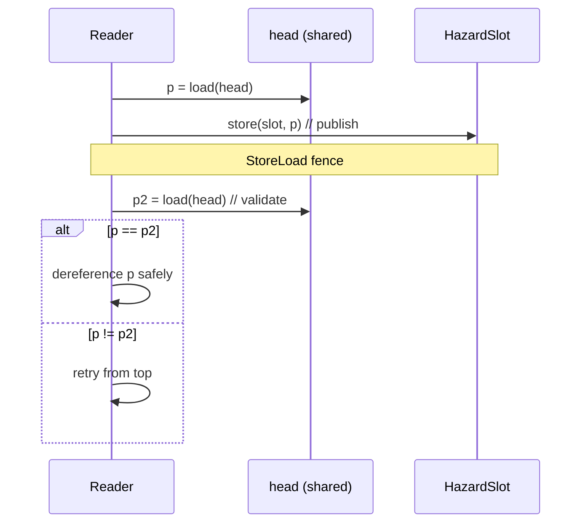
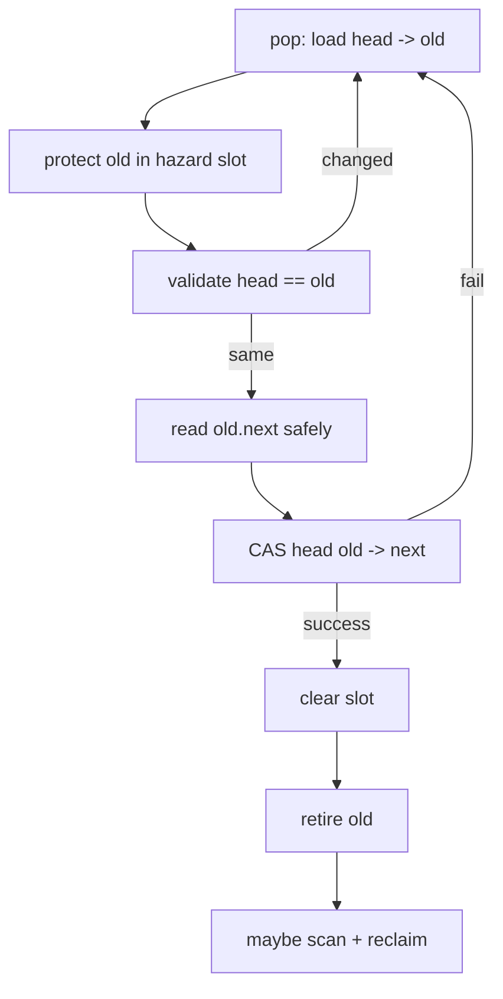

# Hazard Pointers — Middle Level

## Table of Contents

1. [Introduction](#introduction)
2. [Deeper Concepts](#deeper-concepts)
3. [The Protect / Validate Retry Loop](#the-protect--validate-retry-loop)
4. [The Retire List and the Scan](#the-retire-list-and-the-scan)
5. [How Hazard Pointers Solve ABA](#how-hazard-pointers-solve-aba)
6. [Comparison with Alternatives](#comparison-with-alternatives)
7. [Advanced Patterns](#advanced-patterns)
8. [Integration with a Treiber Stack](#integration-with-a-treiber-stack)
9. [Code Examples](#code-examples)
10. [Error Handling](#error-handling)
11. [Performance Analysis](#performance-analysis)
12. [Best Practices](#best-practices)
13. [Visual Animation](#visual-animation)
14. [Summary](#summary)

---

## Introduction

> Focus: "Why does it work?" and "When should I choose this?"

At the junior level we saw the mechanics: publish a pointer, validate it, use it,
clear it; retire removed nodes and scan before freeing. At the middle level we
explain **why those steps are exactly the right ones**, why the validate re-read
is mandatory, how the retire/scan amortizes to O(1) per node, how hazard pointers
defeat the **reclamation** form of the ABA problem, and when you would choose
them over reference counting.

The core insight: in a lock-free structure, **removal and reclamation must be
separated in time**. Removal (unlinking) is instantaneous and uses CAS.
Reclamation (freeing) must wait until you can prove no other thread holds a
reference. Hazard pointers are the *evidence mechanism* — published slots are the
proof of "someone still cares."

---

## Deeper Concepts

### Invariant: a node is freed only if no slot points to it

The central safety invariant is:

```text
SAFETY: At the moment free(n) executes, no hazard slot holds the address n,
        and n is unreachable from the shared structure.
```

The scan establishes the first clause directly: it reads every slot and only
frees `n` if `n` appears in **no** slot. The second clause is guaranteed because
a node is retired only after it has been unlinked by CAS.

But there is a subtlety. A reader might read a stale `head`, then publish a node
*after* the remover already scanned. To make the invariant hold we need the
**validate** step plus correct memory ordering, covered next.

### The window of danger

The danger is the gap between:

1. the reader **reading** the shared pointer, and
2. the reader **publishing** it.

If the node is removed and freed inside that gap, the reader holds a dangling
pointer. The protect step publishes, then re-reads. If the shared pointer still
equals what was published, then at the publish instant the node was still linked
(or, more precisely, the remover that retires it must observe the published slot
on its next scan). If it differs, the reader retries.

### Why a fence is required

Publishing is a **store**; the validate is a **load** of a different location.
Without ordering, the CPU/compiler may reorder the validate load before the
publish store, breaking the proof. A sequentially consistent store (or a
`StoreLoad` fence between the publish and the validate) prevents this. On x86 the
store has implicit ordering for most cases, but an explicit `mfence`/`seq_cst`
store is the portable choice.

---

## The Protect / Validate Retry Loop



The loop is short and almost always succeeds on the first try; it only spins when
a concurrent removal changes `head` exactly during the window. Because the
remover, after retiring, must scan slots, and the reader, after publishing, must
re-validate, the two protocols **interlock**: whichever ordering the hardware
picks, at least one of them detects the conflict.

A subtle but important point: the value being protected is not always `head`. For
a queue or a list traversal you protect each node as you hop to it, re-validating
that the link you followed still points where you expect.

---

## The Retire List and the Scan

The remover never frees. It does:

```text
retire(n):
    local_list.append(n)
    if len(local_list) >= R_threshold:
        scan()

scan():
    // 1. gather all protected addresses
    protected = {}
    for each slot in all_threads:
        v = slot.load()
        if v != null: protected.add(v)
    // 2. free everything not protected; keep the rest
    new_list = []
    for n in local_list:
        if n in protected: new_list.append(n)
        else: free(n)
    local_list = new_list
```

### Choosing the threshold

A common rule (from Michael's paper) sets the threshold to:

```text
R_threshold = H * K + ceil(α * H * K)   (often α ≈ 1, so ~2HK)
```

where `H` = number of threads and `K` = slots per thread. Why this value? After a
scan, at most `H·K` retired nodes can remain (one per slot, worst case). So if the
list holds `~2HK` nodes, at least `HK` are reclaimable, and the O(H·K) scan frees
Ω(H·K) nodes — giving **amortized O(1)** reclamation per node.

### Bounded memory

The number of un-reclaimable retired nodes across the whole system is bounded by
`O(H·K)`: each slot can pin at most one node, so at most `H·K` nodes are stuck at
any instant. With the batched threshold, total retired memory is `O(H² · K)` in
the worst case across all threads' lists — still bounded, never unbounded. This
boundedness is hazard pointers' headline advantage over naive deferred-free
schemes.

---

## How Hazard Pointers Solve ABA

The **ABA problem**: a thread reads value `A`, another thread changes it to `B`
and back to `A` (often by freeing the `A` node and reallocating it at the same
address), then the first thread's CAS on `A` wrongly succeeds because the bits
match — even though the logical state changed.

Hazard pointers attack the **root cause of the dangerous ABA**: memory reuse.
While a thread protects node `A` with a hazard pointer, `A` **cannot be freed**,
therefore it **cannot be reallocated** at the same address. The "A" your CAS sees
is genuinely the same object you read, not a recycled lookalike.

```text
Without HP:  read A -> [A freed, reallocated as A] -> CAS(A) succeeds wrongly
With HP:     protect A -> A pinned, cannot be freed -> no recycled-A surprise
```

Note: hazard pointers solve the *reclamation-induced* ABA. Pure logical ABA on a
counter (no memory reuse) is orthogonal and still handled with tagged pointers or
version counters. For pointer-based structures, the reclamation-induced ABA is by
far the common case, and hazard pointers eliminate it.

---

## Comparison with Alternatives

| Attribute | Hazard Pointers | Reference Counting | Epoch-Based (EBR) | RCU |
|-----------|-----------------|--------------------|--------------------|-----|
| Reader cost | store + fence + validate | atomic inc/dec per access | enter/exit epoch (cheap) | very cheap (often free) |
| Reclaim latency | short (next scan) | immediate at count 0 | until all threads advance | until grace period |
| Memory bound | **O(H·K)** tight | tight (immediate) | unbounded if a reader stalls | unbounded if a reader stalls |
| Blocking? | non-blocking | non-blocking (but contended) | blocked by stalled reader | blocked by stalled reader |
| Per-object overhead | none (external slots) | a refcount field per object | none | none |
| Best for | lock-free stacks/queues/maps | shared ownership, few accesses | read-heavy, short reads | read-mostly kernel data |

**Choose hazard pointers when:** you need **bounded memory** and non-blocking
progress for a lock-free pointer-based structure, and you can bracket each
dereference with protect/clear.

**Choose reference counting when:** ownership is naturally shared and accesses are
infrequent enough that per-access atomic increments are acceptable; but beware the
contention and the chicken-and-egg of safely loading the pointer to increment it.

**Choose EBR/RCU when:** the workload is read-mostly with short critical sections
and you can tolerate deferred reclamation and the risk of a stalled reader pinning
memory.

---

## Advanced Patterns

### Pattern: Protect-with-retry helper

#### Go

```go
// protect reads, publishes, and validates in one reusable helper.
func protect[T any](slot *atomic.Pointer[T], src *atomic.Pointer[T]) *T {
	for {
		p := src.Load()
		slot.Store(p)
		if src.Load() == p { // validate
			return p
		}
	}
}
```

#### Java

```java
static <T> T protect(AtomicReferenceArray<T> hp, int i, AtomicReference<T> src) {
    while (true) {
        T p = src.get();
        hp.set(i, p);
        if (src.get() == p) return p; // validate
    }
}
```

#### Python

```python
def protect(slot_store, slot_clear_unused, src_load):
    while True:
        p = src_load()
        slot_store(p)
        if src_load() == p:   # validate
            return p
```

### Pattern: Batched retire

#### Go

```go
func (d *Domain) retire(n *Node) {
	d.local = append(d.local, n)
	if len(d.local) >= d.threshold {
		d.scan()
	}
}
```

#### Java

```java
void retire(Node n) {
    local.add(n);
    if (local.size() >= threshold) scan();
}
```

#### Python

```python
def retire(self, n):
    self.local.append(n)
    if len(self.local) >= self.threshold:
        self.scan()
```

---

## Integration with a Treiber Stack

A Treiber stack's `pop` is the canonical place hazard pointers are needed.



The protect+validate guarantees `old.next` is read from live memory. The
clear+retire after a successful CAS hands the node to deferred reclamation.

---

## Code Examples

### Treiber stack pop with hazard pointer

#### Go

```go
package main

import "sync/atomic"

type Node struct {
	value int
	next  *Node
}

type Stack struct {
	head atomic.Pointer[Node]
}

// per-thread hazard slot passed in for clarity
func (s *Stack) Pop(hp *atomic.Pointer[Node], retire func(*Node)) (int, bool) {
	for {
		old := s.head.Load()
		if old == nil {
			return 0, false
		}
		hp.Store(old)              // publish
		if s.head.Load() != old {  // validate
			continue
		}
		next := old.next           // safe: old is protected
		if s.head.CompareAndSwap(old, next) {
			hp.Store(nil)          // clear
			v := old.value
			retire(old)            // defer free
			return v, true
		}
		// CAS failed -> retry (slot will be overwritten next loop)
	}
}
```

#### Java

```java
import java.util.concurrent.atomic.AtomicReference;
import java.util.concurrent.atomic.AtomicReferenceArray;
import java.util.function.Consumer;

public class HpStack {
    static class Node {
        final int value; volatile Node next;
        Node(int v) { value = v; }
    }
    final AtomicReference<Node> head = new AtomicReference<>();
    final AtomicReferenceArray<Node> hazard;

    HpStack(int threads) { hazard = new AtomicReferenceArray<>(threads); }

    public Integer pop(int slot, Consumer<Node> retire) {
        while (true) {
            Node old = head.get();
            if (old == null) return null;
            hazard.set(slot, old);          // publish
            if (head.get() != old) continue; // validate
            Node next = old.next;            // safe
            if (head.compareAndSet(old, next)) {
                hazard.set(slot, null);      // clear
                int v = old.value;
                retire.accept(old);          // defer free
                return v;
            }
        }
    }
}
```

#### Python

```python
# Conceptual: shows the protect/validate/clear/retire sequence.
import threading

class Node:
    def __init__(self, value, nxt=None):
        self.value, self.next = value, nxt

class HpStack:
    def __init__(self):
        self.head = None
        self.lock = threading.Lock()  # stands in for CAS
        self.hazard = {}              # thread_id -> protected node

    def pop(self, tid, retire):
        while True:
            old = self.head
            if old is None:
                return None
            self.hazard[tid] = old            # publish
            if self.head is not old:          # validate
                continue
            nxt = old.next                    # safe
            with self.lock:                   # emulate CAS
                if self.head is old:
                    self.head = nxt
                    self.hazard[tid] = None   # clear
                    retire(old)               # defer free
                    return old.value
            # retry
```

---

## Error Handling

| Scenario | What goes wrong | Correct approach |
|----------|-----------------|------------------|
| Skip validate | Read a node freed during the publish window | Always re-read and retry on mismatch |
| Free in pop | Use-after-free for other readers | Retire, never free, inside pop |
| Forget to clear | Slot pins node forever; scans never reclaim it | Clear slot right after CAS / on every exit path |
| No fence | Validate reordered before publish; race re-opens | Use seq-cst store or StoreLoad fence |
| Retire same node twice | Double free on next scan | Track membership; never double-retire |

---

## Performance Analysis

The reader's hot path is: one load, one store, one fence, one load. That is a
small constant, dominated by the fence (a `StoreLoad` barrier). The remover's hot
path is one append; the scan is amortized.

#### Go

```go
import (
	"fmt"
	"sync/atomic"
	"time"
)

func benchmarkProtect() {
	var head atomic.Pointer[Node]
	head.Store(&Node{value: 1})
	var hp atomic.Pointer[Node]
	iters := []int{1000, 10000, 100000, 1000000}
	for _, n := range iters {
		start := time.Now()
		for i := 0; i < n; i++ {
			p := head.Load()
			hp.Store(p)
			_ = head.Load() == p // validate
			hp.Store(nil)
		}
		fmt.Printf("iters=%8d: %.3f ns/op\n",
			n, float64(time.Since(start).Nanoseconds())/float64(n))
	}
}
```

#### Java

```java
public static void benchmarkProtect() {
    var head = new java.util.concurrent.atomic.AtomicReference<>(new Object());
    var hp = new java.util.concurrent.atomic.AtomicReference<>();
    int[] iters = {1_000, 10_000, 100_000, 1_000_000};
    for (int n : iters) {
        long start = System.nanoTime();
        for (int i = 0; i < n; i++) {
            Object p = head.get();
            hp.set(p);
            boolean ok = head.get() == p; // validate
            hp.set(null);
        }
        System.out.printf("iters=%8d: %.3f ns/op%n",
            n, (System.nanoTime() - start) / (double) n);
    }
}
```

#### Python

```python
import timeit

class _Box:
    __slots__ = ("p",)

def bench():
    head = _Box(); head.p = object()
    hp = _Box(); hp.p = None
    for n in (1_000, 10_000, 100_000):
        def work():
            p = head.p
            hp.p = p
            _ = head.p is p   # validate
            hp.p = None
        t = timeit.timeit(work, number=n)
        print(f"iters={n:>8}: {t/n*1e9:.1f} ns/op")
```

---

## Best Practices

- Set the retire threshold to ~`2·H·K` so reclamation amortizes to O(1) per node.
- Keep slots-per-thread minimal; each extra slot widens every scan.
- Clear slots on **every** exit path of the protected region, including error
  paths.
- Keep retire lists thread-local; merge into a global only at thread exit.
- Document, per data structure, the maximum number of nodes that must be
  protected simultaneously — that sets `K`.

---

## Visual Animation

> See [`animation.html`](./animation.html) for the interactive visualization.
>
> Middle-level focus in the animation:
> - The protect → validate retry loop firing when `head` changes mid-publish
> - A retired node held across one scan because a slot pins it, freed on the next
> - Side-by-side hazard-pointer vs reference-count behavior in the table

---

## Summary

Hazard pointers separate **removal** (instant, via CAS) from **reclamation**
(deferred, after a scan). The protect/validate retry loop closes the window where
a node could be freed between read and publish; the batched retire + scan gives
**amortized O(1)** reclamation and **bounded O(H·K)** un-freed memory; and pinning
a node prevents its reuse, eliminating the reclamation-induced **ABA** problem.
Choose them over reference counting when you need bounded memory and non-blocking
progress, and over RCU/EBR when you cannot tolerate unbounded reclamation latency
from a stalled reader.

---

**Next step:** [senior.md](./senior.md) — hazard pointers as a memory-management
subsystem for lock-free stacks, queues, and maps: scan frequency, amortization,
domains, and production integration.
