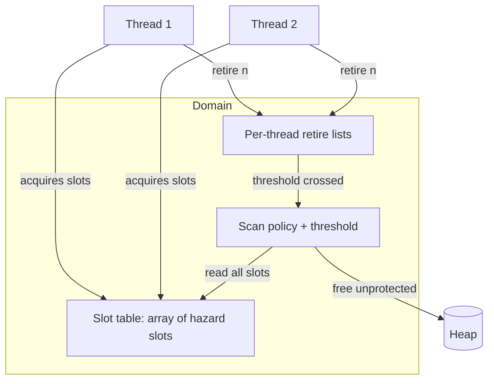
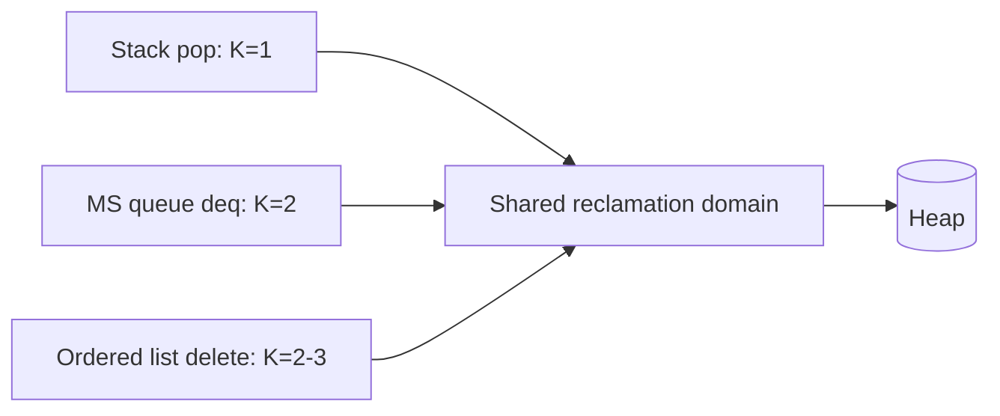
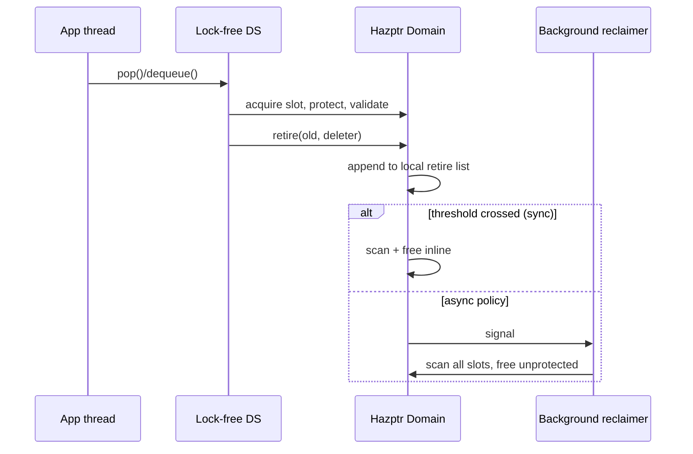
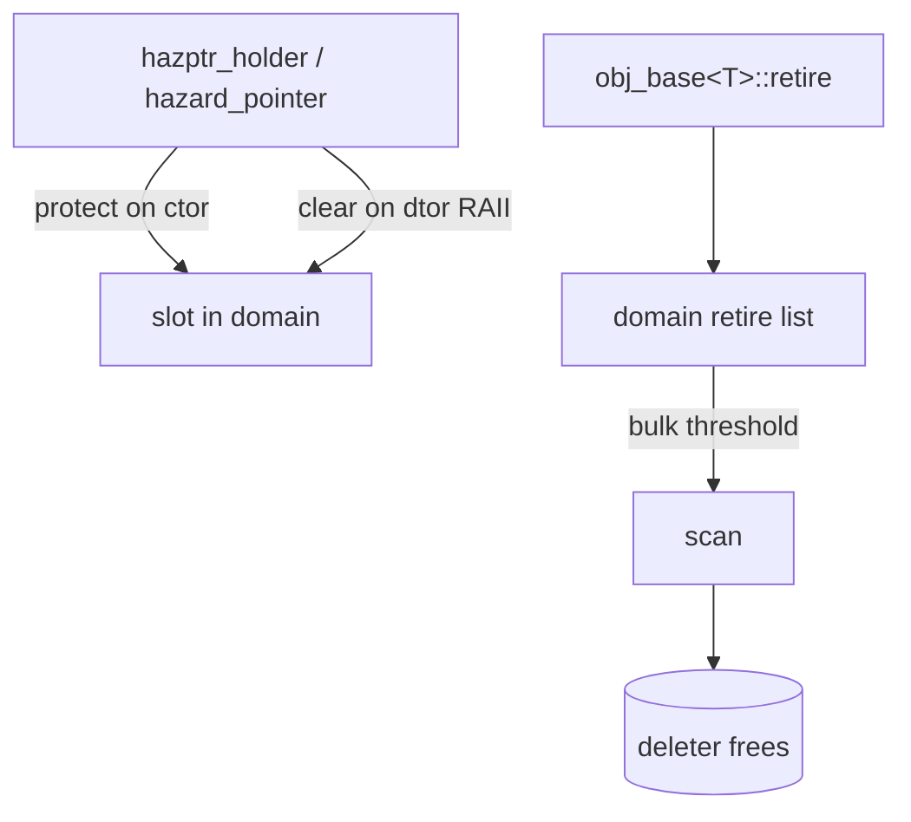

# Hazard Pointers — Senior Level

## Table of Contents

1. [Introduction](#introduction)
2. [Hazard Pointers as a Reclamation Subsystem](#hazard-pointers-as-a-reclamation-subsystem)
3. [Domains, Slots, and Thread Lifecycle](#domains-slots-and-thread-lifecycle)
4. [Scan Frequency and Amortization](#scan-frequency-and-amortization)
5. [Bounded Memory in a Running System](#bounded-memory-in-a-running-system)
6. [Integration with Stacks, Queues, and Maps](#integration-with-stacks-queues-and-maps)
7. [Comparison with Alternatives](#comparison-with-alternatives)
8. [Architecture Patterns](#architecture-patterns)
9. [Code Examples](#code-examples)
10. [Observability](#observability)
11. [Failure Modes](#failure-modes)
12. [Summary](#summary)

---

## Introduction

> Focus: "How to architect a memory-reclamation subsystem around hazard pointers?"

At senior level, hazard pointers stop being a single trick and become a
**subsystem**: a reclamation *domain* that owns the slot table, the per-thread
retire lists, the scan policy, and the lifecycle of joining/leaving threads. You
design this subsystem to meet system constraints — bounded memory under a fixed
budget, p99 latency for protected reads, and graceful behavior when threads
appear and disappear.

The questions shift from "how do I publish a pointer" to: How many slots does each
data structure need? When do scans run so they neither thrash nor let memory
balloon? How do I size the domain for a thread pool that grows and shrinks? How
does this coexist with RCU or epochs elsewhere in the same process? This file
answers those.

---

## Hazard Pointers as a Reclamation Subsystem

A production hazard-pointer implementation (folly, Concurrency Kit, the C++26
`std::hazard_pointer`) is organized as a **domain**:



Key responsibilities of the domain:

- **Slot allocation:** hand out hazard slots to threads, reuse slots from threads
  that left.
- **Retirement:** accept retired objects with a deleter (so heterogeneous types
  can share one domain).
- **Reclamation:** run scans per the policy and free safely.
- **Lifecycle:** support threads joining and leaving without leaking slots.

Separating the domain from the data structure means one stack, one queue, and one
map can share a single reclamation domain, amortizing scans across all of them.

---

## Domains, Slots, and Thread Lifecycle

A **hazard pointer record** (`hazptr`) is a slot a thread acquires from the domain
and holds for the duration of a protected access. Production designs use a linked
list of records so the count grows on demand:

```text
record { ptr: atomic<void*>; active: atomic<bool>; next: *record }
```

- **Acquire:** a thread scans the record list for an inactive record (CAS `active`
  false→true) and reuses it, or allocates a new one and pushes it on the list.
- **Release:** set `active` false; the slot stays in the list for reuse. Its `ptr`
  is cleared.
- **Scan reads** every record's `ptr` regardless of `active`, because a reader may
  publish then the system inspects concurrently.

This list-of-records design means `H·K` is not fixed at compile time; it grows to
the high-water mark of concurrent protected accesses, then is reused. The
boundedness argument still holds: at most one node pinned per *currently
published* record.

---

## Scan Frequency and Amortization

Scan frequency is the central tuning knob.

- **Too frequent:** every retire triggers an O(H·K) scan → O(H·K) per node, the
  reclamation cost dominates.
- **Too rare:** retire lists grow large → more un-freed memory, and a single scan
  becomes a latency spike.

The standard policy makes scans **proportional to retirement volume**: scan when a
thread's local list reaches `R = (1+α)·H·K`. Because each scan frees at least
`α·H·K` nodes, amortized cost is:

```text
scan cost / nodes freed = O(H·K) / O(α·H·K) = O(1/α) = O(1)
```

So with `α = 1` (threshold ≈ `2HK`), reclamation is amortized **O(1) per node**
and each scan reliably frees roughly half the list.

Refinements seen in practice:

- **Global threshold with batching:** accumulate retirements globally and scan in
  bulk to cut the constant factor.
- **Sorted scan:** sort the protected set or use a hash set so the membership test
  is O(1) instead of O(H·K) per retired node — turning scan into O(R + H·K)
  instead of O(R·H·K).
- **Asynchronous reclamation:** a background thread runs scans so foreground
  threads never pay the latency, at the cost of slightly more held memory.

### Worked tuning example

Consider a service with a thread pool of `H = 32` workers, each data-structure
access protecting at most `K = 2` nodes, so `H·K = 64`. A naive "scan on every
retire" pays 64 slot reads per freed node — 64× overhead. Setting the threshold to
`R = 2·H·K = 128` means a worker scans once per 128 retirements, each scan freeing
≥ 64 nodes, so the 64-slot read cost is spread over ≥ 64 frees → ≈ 1 slot read per
freed node. The trade is that up to `H·R = 32·128 = 4096` nodes can sit pending
across all workers before being freed. If each node is 64 bytes, that is ~256 KB
of deferred memory — a known, fixed ceiling you budget for. Halving `R` halves the
ceiling but doubles the amortized scan cost; this is the lever you pull when memory
is tighter than CPU, or vice versa.

### When the scan runs

There are three common scheduling points, each with a latency profile:

| Scan trigger | Who pays | Latency profile |
|--------------|----------|-----------------|
| Inline at threshold | the retiring thread | periodic spike on one op every R retires |
| Inline, probabilistic | random retiring thread | spikes spread out, lower p99 variance |
| Background reclaimer | a dedicated thread | foreground flat; memory slightly higher |

High-throughput systems prefer the background reclaimer for the request path and
fall back to inline scanning only under back-pressure (pending memory over a cap),
combining flat foreground latency with a hard memory ceiling.

---

## Bounded Memory in a Running System

This is hazard pointers' defining property versus RCU/EBR. The maximum memory
held un-freed is:

```text
held ≤ (H·K) pinned   +   Σ_threads (retire_list_len)
     ≤ H·K            +   H · R_threshold
     = O(H² · K)
```

That bound is independent of how long readers run. A stalled reader pins **at most
K nodes** (its slots), not the entire history. Contrast RCU/EBR, where a single
stalled reader can prevent *all* reclamation for an unbounded number of objects.

For a system with a fixed memory budget, this lets you compute a safe operating
point: choose `K` per structure, bound `H` by the thread pool size, cap
`R_threshold`, and the worst-case overhead is known up front.

| Reclaimer | Worst-case held by 1 stalled reader |
|-----------|--------------------------------------|
| Hazard pointers | K nodes (its own slots) |
| RCU | every node retired during the stall (unbounded) |
| Epoch-based | every node retired in 2 epochs (unbounded) |

---

## Integration with Stacks, Queues, and Maps

### Treiber stack (1 slot)

`pop` protects only `head`, so **K = 1**. Protect `head`, validate, read `next`,
CAS, retire. See sibling topic 17-lock-free-stack.

### Michael–Scott queue (2 slots)

`dequeue` must protect both `head` and `head.next` (and `enqueue` protects `tail`
and `tail.next`), so **K = 2**. The classic MS queue is the textbook hazard-pointer
client; see sibling topic 16-lock-free-queue-michael-scott.

### Lock-free hash map / list (2–3 slots)

A Harris-style ordered list deletes by marking then unlinking; a traversal must
protect the current node *and* its predecessor while it splices, so **K = 2–3**.
Sibling topic 18-concurrent-hash-map.



A single domain sized for `K = max over structures` serves all three; scans
amortize across their combined retirement traffic.

### Choosing K per structure

`K` is not a free parameter — it is dictated by the algorithm's worst-case number
of nodes that must be **simultaneously** protected during one logical step. To
derive it, walk the operation and count the live raw pointers that are
dereferenced and could be concurrently retired:

```text
Treiber stack pop:      protect head                  -> K = 1
MS queue dequeue:       protect head, then head.next  -> K = 2
MS queue enqueue:       protect tail, then tail.next  -> K = 2
Harris ordered delete:  protect curr and pred         -> K = 2
Hash map probe + delete protect bucket, node, succ    -> K = 3
```

Under-sizing `K` reopens the use-after-free window for the unprotected pointer;
over-sizing `K` widens every scan (each extra slot is read on every scan). The
right discipline is: derive `K` from the algorithm, then size the domain's slot
table to `H × max(K)`.

### One domain or many?

| Choice | Pro | Con |
|--------|-----|-----|
| Single process-wide domain | one scan amortizes all traffic; simplest | hot structure's churn enlarges everyone's scan set |
| Per-structure domain | scans isolated; smaller protected sets | more total slots; cross-structure pointers forbidden |

A pragmatic split: one shared domain for cold/general objects, plus a dedicated
domain for each high-churn structure (e.g. the hot work queue) so its frequent
scans do not drag in unrelated slots.

---

## Comparison with Alternatives

| Attribute | Hazard Pointers | RCU | Epoch-Based | Reference Counting |
|-----------|-----------------|-----|-------------|--------------------|
| Read latency p99 | low + fence | lowest | low | inc/dec contention |
| Write/reclaim latency | short, bounded | grace period | epoch advance | immediate |
| Memory bound | **O(H²·K)** | unbounded under stall | unbounded under stall | tight |
| Per-object cost | none | none | none | refcount word |
| Slots needed | K per access | none | none | none |
| Stalled-reader impact | pins K objects | blocks all reclaim | blocks all reclaim | none |
| Production usage | folly, CK, C++26 | Linux kernel | userspace EBR libs | shared_ptr, Arc |

**Senior takeaway:** hazard pointers trade a small per-read cost (fence +
validate) and the K-slot constraint for **hard memory bounds** and **stall
isolation**. RCU trades essentially-free reads for unbounded reclaim latency. Pick
per workload: bounded-memory non-blocking structures → hazard pointers;
read-mostly with rare updates and stall-tolerant memory → RCU.

---

## Architecture Patterns



Patterns worth adopting:

- **One domain per process** for general objects; dedicated domains for hot
  structures to avoid cross-talk in scans.
- **Type-erased retire** (`retire(ptr, deleter)`) so a domain reclaims mixed
  types.
- **Async reclamation thread** to move scan latency off the request path.
- **Slot pooling** keyed by thread to avoid per-access allocation.

---

## Code Examples

### A small reclamation domain (Go)

#### Go

```go
package hazard

import "sync/atomic"

type Node struct {
	value int
	next  *Node
}

type record struct {
	ptr    atomic.Pointer[Node]
	active atomic.Bool
}

type Domain struct {
	records   []*record // slot table (grows once at init for simplicity)
	threshold int
}

func NewDomain(maxThreads, slotsPer int) *Domain {
	n := maxThreads * slotsPer
	d := &Domain{records: make([]*record, n), threshold: 2 * n}
	for i := range d.records {
		d.records[i] = &record{}
	}
	return d
}

// Protect publishes src into rec and validates against src.
func Protect(rec *record, src *atomic.Pointer[Node]) *Node {
	for {
		p := src.Load()
		rec.ptr.Store(p)
		if src.Load() == p {
			return p
		}
	}
}

// Scan frees retired nodes not currently protected.
func (d *Domain) Scan(retired []*Node) []*Node {
	protected := make(map[*Node]struct{}, len(d.records))
	for _, r := range d.records {
		if p := r.ptr.Load(); p != nil {
			protected[p] = struct{}{}
		}
	}
	keep := retired[:0]
	for _, n := range retired {
		if _, ok := protected[n]; ok {
			keep = append(keep, n) // pinned -> keep
		} // else: drop reference -> GC frees (Go); free(n) in C/manual
	}
	return keep
}
```

#### Java

```java
import java.util.*;
import java.util.concurrent.atomic.*;

public class Domain {
    static class Node { int value; volatile Node next; Node(int v){value=v;} }

    final AtomicReferenceArray<Node> slots;
    final int threshold;

    Domain(int maxThreads, int slotsPer) {
        slots = new AtomicReferenceArray<>(maxThreads * slotsPer);
        threshold = 2 * maxThreads * slotsPer;
    }

    static Node protect(AtomicReferenceArray<Node> hp, int i, AtomicReference<Node> src) {
        while (true) {
            Node p = src.get();
            hp.set(i, p);
            if (src.get() == p) return p;
        }
    }

    List<Node> scan(List<Node> retired) {
        Set<Node> protectedSet = Collections.newSetFromMap(new IdentityHashMap<>());
        for (int i = 0; i < slots.length(); i++) {
            Node p = slots.get(i);
            if (p != null) protectedSet.add(p);
        }
        List<Node> keep = new ArrayList<>();
        for (Node n : retired) {
            if (protectedSet.contains(n)) keep.add(n); // pinned
            // else: eligible for free (GC reclaims in Java)
        }
        return keep;
    }
}
```

#### Python

```python
# Conceptual domain: models slots, threshold, and scan-based reclamation.
class Domain:
    def __init__(self, max_threads, slots_per):
        self.slots = [None] * (max_threads * slots_per)  # hazard slots
        self.threshold = 2 * max_threads * slots_per

    def protect(self, slot_idx, src_load):
        while True:
            p = src_load()
            self.slots[slot_idx] = p
            if src_load() is p:
                return p

    def scan(self, retired):
        protected = {id(p) for p in self.slots if p is not None}
        keep, freed = [], 0
        for n in retired:
            if id(n) in protected:
                keep.append(n)     # pinned -> keep
            else:
                freed += 1         # eligible to free
        return keep, freed
```

---

## Production Implementations

Three production systems are worth studying as reference architectures; they make
different choices on the same axes (slot management, scan policy, type erasure).

| System | Slot model | Reclaim policy | Notable choices |
|--------|-----------|----------------|-----------------|
| **folly `hazptr`** | growable linked list of `hazptr_rec`, tagged per domain | threshold + async option | `hazptr_holder` RAII; `hazptr_obj_base<T>` per-object retire with deleter; tagged lists for batching |
| **Concurrency Kit `ck_hp`** | fixed-size per-thread record array | epoch-counted scan at threshold | C API, explicit `ck_hp_subscribe`; designed for kernels/embedded |
| **C++26 `std::hazard_pointer`** | `hazard_pointer` objects from `make_hazard_pointer()` | implementation-defined domain | `protect()` returns a guarded pointer; `retire()` on `hazard_pointer_obj_base` |

Common threads across all three:

- **RAII / scope-bound protection.** A holder object protects on construction and
  clears on destruction, so slots are never leaked on early returns or exceptions
  — directly preventing the "stuck slot" failure mode.
- **Per-object retire with deleter.** `obj_base<T>` carries its own `delete`
  logic, enabling one domain to reclaim heterogeneous types (type erasure).
- **Tagged / batched lists.** Retired objects are accumulated in lock-free tagged
  lists and scanned in bulk, cutting the per-node constant factor.



Adopting RAII protection and per-object deleters from these designs eliminates two
of the most common correctness bugs (leaked slots, wrong free) by construction.

---

## Observability

| Metric | Why it matters | Alert threshold |
|--------|----------------|-----------------|
| `hp_retired_pending` | retired but not yet freed | > 4·H·K sustained |
| `hp_scan_latency_p99` | scan stalling the request path | > 1 ms (sync mode) |
| `hp_reclaimed_per_scan` | amortization health (should be ~half list) | < 0.25·threshold |
| `hp_slots_inuse_max` | high-water `K` (sizes the domain) | near table size |
| `hp_protect_retries` | validate-loop spinning | rising = high removal contention |
| `hp_thread_exit_dirty_slots` | slots left non-null at exit | > 0 |

A healthy domain shows scans freeing roughly half their batch and pending memory
hovering near `O(H·K)`.

---

## Failure Modes

- **Stuck slot:** a thread crashed or exited without clearing a slot; that node is
  pinned forever and its successors via that path can accumulate. Mitigation:
  slot ownership tracking + reclaim slots of dead threads.
- **Scan starvation:** async reclaimer falls behind producer threads; pending
  memory grows. Mitigation: back-pressure — fall back to inline scan when pending
  exceeds a cap.
- **Slot exhaustion:** more concurrent protected accesses than slots → a thread
  cannot protect and must spin/wait. Mitigation: grow the record list on demand.
- **Wrong K:** the structure needs to protect more nodes simultaneously than K
  allows → a brief use-after-free window reopens. Mitigation: derive K from the
  algorithm's worst-case simultaneous-protection count.
- **Cross-domain pointer:** retiring an object in one domain while another domain
  protects it → it can be freed early. Mitigation: one domain per ownership scope.

### Failure-mode runbook

| Symptom | Likely cause | First action |
|---------|--------------|--------------|
| pending memory climbs, never drops | leaked slot (dead thread) or scan starvation | inspect `hp_thread_exit_dirty_slots`; force inline scan |
| p99 latency spikes periodically | inline scan at threshold on the hot path | move to async reclaimer with back-pressure cap |
| rare crash / corruption | missing fence or K too small | audit publish/validate ordering; recount simultaneous protections |
| throughput collapses under contention | validate loop spinning | check `hp_protect_retries`; reduce removal contention or shard the structure |
| double free | node retired twice | enforce retire-once at the unique unlink site |

---

## Summary

At senior level, hazard pointers are a **reclamation domain**: a slot table,
per-thread retire lists, and a scan policy that you size and tune. The amortized
O(1) reclamation comes from a threshold of ~`2HK`; the headline guarantee is
**bounded memory** — a stalled reader pins only its K slots, not unbounded
history, which is the decisive advantage over RCU and epoch reclamation. Integrate
one domain across your lock-free stack (K=1), MS queue (K=2), and ordered
list/map (K=2–3), instrument pending memory and scan health, and guard the failure
modes around dead threads and slot exhaustion.

---

**Next step:** [professional.md](./professional.md) — formal safety and
liveness proofs (no node freed while hazard-protected), the bounded-memory
analysis, and a rigorous comparison of read-cost vs reclaim-latency against RCU
and epoch reclamation.
