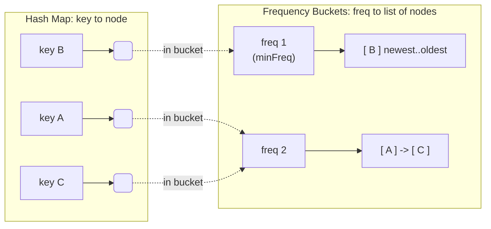

# LFU Cache — Junior Level

## Table of Contents

1. [Introduction](#introduction)
2. [What is a Cache?](#what-is-a-cache)
3. [What is an LFU Cache?](#what-is-an-lfu-cache)
4. [LFU vs LRU in One Picture](#lfu-vs-lru-in-one-picture)
5. [Real-World Analogies](#real-world-analogies)
6. [Core Operations](#core-operations)
   - [get(key)](#getkey)
   - [put(key, value)](#putkey-value)
7. [Counting Frequency: The Simple Idea](#counting-frequency-the-simple-idea)
8. [A Small Worked Example](#a-small-worked-example)
9. [Breaking Ties: Recency Inside a Frequency](#breaking-ties-recency-inside-a-frequency)
10. [A First (Slow) Implementation](#a-first-slow-implementation)
11. [Operations and Complexity](#operations-and-complexity)
12. [Common Mistakes](#common-mistakes)
13. [Summary](#summary)

---

## Introduction

An **LFU cache** (Least Frequently Used cache) is a fixed-capacity store that, when it runs out of room, throws away the item that has been **used the fewest times**. It is a close cousin of the [LRU cache](../01-lru-cache/junior.md) (Least Recently Used), and it is a famous interview problem — it is **LeetCode 460**, widely considered one of the harder "design a data structure" questions because making every operation run in **O(1)** takes a clever combination of three structures.

The idea is simple to state:

> Store a limited number of key-value pairs. Count how many times each key is *used* (read or written). When the cache is full and a new item must be added, **throw away the item with the smallest use count**. If several items tie for the smallest count, throw away the **least recently used** among them. Make both reading and writing take **constant time, O(1)**.

That last sentence — *O(1) for everything* — is what makes LFU interesting. A naive LFU implementation scans every item to find the minimum count, which is O(n) per eviction. The clever O(1) design (which we build up to across `junior → middle → senior → professional`) uses a hash map of keys, a hash map of "frequency buckets," and a small `minFreq` pointer.

By the end of this page you will understand **what** an LFU cache is, **how** frequency counting drives eviction, and you will be able to write a correct (if not yet optimal) LFU cache in Go, Java, and Python.

---

## What is a Cache?

A **cache** is a small, fast store that holds copies of data so you do not have to recompute or re-fetch that data from a slower source.

```
Slow source (database, disk, network, expensive computation)
        ^
        | on a "miss", go fetch it (slow)
        |
   +---------+
   |  CACHE  |  <-- small, fast (in memory)
   +---------+
        |
        | on a "hit", return instantly (fast)
        v
     Your program
```

- **Cache hit**: the data you asked for is already in the cache. Fast.
- **Cache miss**: the data is not in the cache. You must fetch it from the slow source, then (usually) store it in the cache for next time.

A cache is small *on purpose* — memory is limited and expensive. So the cache can only hold a fixed number of items, called its **capacity**. Once the cache is full, adding a new item means an old item has to go. The rule for *which* item to remove is the **eviction policy**.

LFU is one specific eviction policy: **remove the item that has been used the fewest times.**

---

## What is an LFU Cache?

LFU stands for **Least Frequently Used**. The policy is based on a different assumption from LRU. Where LRU bets on **recency** ("if you touched it recently, you'll touch it again soon"), LFU bets on **frequency**:

> If you have used something *many* times, it is *popular*, and popular things are likely to be used again. If something has been used only once or twice, it is probably not important, so it is the first to go when we need space.

"Used" means either:
- We **read** the item (`get`), or
- We **wrote / updated** the item (`put`).

Every time we touch a key, its **frequency counter** goes up by one. The key with the **smallest counter** is the **least frequently used** — it is the eviction victim. When several keys share the same smallest counter, we use recency as a tie-breaker: among the equally-unpopular keys, the one that has not been touched for the longest time goes first.

So an LFU cache has to track two things per key:
1. **How many times** the key has been used (the frequency).
2. **In what order** keys of the same frequency were last used (for tie-breaking).

---

## LFU vs LRU in One Picture

The two policies often disagree about *what to evict*. Here is the key difference:

| | LRU (Least Recently Used) | LFU (Least Frequently Used) |
|---|---|---|
| Tracks | **When** each key was last used | **How many times** each key was used |
| Evicts | The key untouched the longest | The key used the fewest times |
| Good when | Access pattern shifts over time (recency matters) | Some keys are reliably popular (frequency matters) |
| Weakness | A one-time scan flushes the whole cache | An old once-popular key can never be evicted (**aging problem**) |
| LeetCode | 146 | 460 |

Consider this access stream with **capacity 2**:

```
A A A A B C
```

- Key `A` was used 4 times; `B` and `C` once each.
- When `C` arrives and the cache holds `{A, B}`, **LFU** evicts `B` (count 1) and keeps `A` (count 4) — it trusts that the heavily-used `A` will be needed again.
- **LRU** would also evict `B` here (it is least recently used), but for a *different reason* — it does not care that `A` was used 4 times, only that `A` was touched more recently than `B`.

The policies diverge on streams like `A B B A C`: after `A B B A`, LRU's order is `[A, B]` (A most recent), but LFU's counts are `A:2, B:2` — a tie that recency must break. Different bookkeeping, sometimes different victims.

---

## Real-World Analogies

### 1. A Bookshelf Ranked by How Often You Read

Imagine a shelf that holds 5 books. Next to each book you keep a tally of how many times you have read it. When you buy a 6th book and the shelf is full, you donate the book with the **smallest tally** — the one you have opened the fewest times. The cookbook you use weekly stays; the novel you read once goes. That tally is the **frequency counter**.

### 2. A Pharmacy's Front Shelf

A pharmacist keeps the most-frequently-requested medicines on the easy-to-reach front shelf. Each time a medicine is dispensed, its request count rises. When a new product needs front-shelf space, the medicine requested the fewest times this period gets moved to the back room. Popular medicines (high frequency) stay up front.

### 3. App Icons by Usage Count

Some phones offer a "most used apps" screen. Each launch increments an app's usage count. The apps shown are those with the highest counts; the rarely-launched ones drop off the list. That is LFU ranking by frequency, not recency.

### 4. The Aging Problem — A Warning Built into the Analogy

Here is where LFU's famous weakness shows up. Suppose last year you read one book 500 times for a class. The class ended; you will never open that book again. But its tally (500) is so high that it can *never* be the smallest — so it occupies a shelf slot **forever**, even though it is now useless. New, currently-useful books get evicted instead. This is the **aging** or **decay** problem, and real systems fix it by slowly *decaying* old counts (more on this at the middle and senior levels).

In every analogy notice the two repeated ideas: **touch something → increment its count**, and **need space → remove the smallest count (oldest used on a tie)**. That is the heart of LFU.

---

## Core Operations

An LFU cache supports exactly two operations, just like LRU.

### get(key)

```
get(key):
  if key is in the cache:
      increment its frequency counter
      return its value
  else:
      return "not found"  (often represented as -1)
```

A `get` is not a passive read — it *counts as using* the key, so the key's frequency goes up by one.

### put(key, value)

```
put(key, value):
  if capacity is 0:
      do nothing
  if key already exists:
      update its value
      increment its frequency counter
  else:
      if the cache is full:
          evict the least-frequently-used key
                (ties broken by least-recently-used)
      insert the new key with frequency = 1
```

Two details that trip people up:
- A **new** key always starts at frequency **1** (the `put` that creates it counts as its first use).
- We check for eviction **only** when inserting a brand-new key. Updating an existing key never evicts anything.

---

## Counting Frequency: The Simple Idea

The simplest mental model: store, for every key, a `(value, count)` pair.

```
key 1 -> (value "A", count 3)
key 2 -> (value "B", count 1)
key 3 -> (value "C", count 5)
```

- On `get(1)` or `put(1, ...)`: bump key 1's count to 4.
- To evict: scan all entries, find the smallest count (key 2, count 1), remove it.

This is correct, and it is exactly how you should *think* about LFU. The only problem is **speed**: scanning every entry to find the minimum count is **O(n)** per eviction, and finding ties needs even more bookkeeping. The middle level shows how to replace that O(n) scan with an O(1) lookup using **frequency buckets** and a **minFreq** pointer. For now, focus on getting the *behavior* right.

---

## A Small Worked Example

Let us run an LFU cache with **capacity = 2**. We show each key's frequency count after every step.

```
put(1, "A")        counts: {1:1}              cache {1:A}
put(2, "B")        counts: {1:1, 2:1}         cache {1:A, 2:B}, full now
get(1) -> "A"      counts: {1:2, 2:1}         (1 used, count 1->2)
put(3, "C")        counts: {1:2, 3:1}         full -> evict the min-count key.
                                              min count = 1, only key 2 has it -> evict 2
get(2) -> miss     counts: {1:2, 3:1}         (2 was evicted)
get(3) -> "C"      counts: {1:2, 3:2}         (3 used, count 1->2)
put(4, "D")        counts: {?, 4:1}           full -> min count = 2, TIE between 1 and 3.
                                              break tie by recency: 1 was used least recently
                                              (we touched 3 more recently) -> evict 1
get(1) -> miss     counts: {3:2, 4:1}         (1 was evicted)
get(3) -> "C"      counts: {3:3, 4:1}         (3 used again)
get(4) -> "D"      counts: {3:3, 4:2}         (4 used)
```

Trace the eviction of key 2 carefully. After `get(1)`, key 1's count was 2 and key 2's was still 1. When `put(3)` overflowed, the minimum count was 1, held only by key 2, so key 2 was evicted. That is LFU keeping the more popular key.

Now trace the tricky eviction at `put(4)`. Keys 1 and 3 both had count 2 — a **tie**. LFU breaks ties by recency: we had most recently touched key 3 (via `get(3)`), so key 1 was the *least recently used among the tied keys*, and key 1 was evicted. This recency tie-break is what makes LFU's bookkeeping more involved than LRU's.

---

## Breaking Ties: Recency Inside a Frequency

When two or more keys share the smallest frequency, *which* one do we evict? The standard answer (and what LeetCode 460 requires) is: **the least recently used among the tied keys**.

A neat way to picture this: imagine the keys grouped into **buckets**, one bucket per frequency value. Inside each bucket, keys are ordered by recency, newest at the front and oldest at the back.

```
freq 1:  [ key D (newest) ] -> [ key B (oldest) ]
freq 2:  [ key A (newest) ] -> [ key C (oldest) ]
freq 5:  [ key Z ]
         ^
      minFreq = 1  (smallest non-empty bucket)
```

To evict, look at the **smallest non-empty bucket** (`minFreq`), and remove the **oldest** entry in it (the back of that bucket). Here that is key B. This single idea — *frequency buckets, each ordered by recency, plus a pointer to the smallest bucket* — is the entire secret to the O(1) LFU design. The middle level builds it out fully.



---

## A First (Slow) Implementation

Here is a correct, easy-to-read LFU cache. It is **not** O(1) — eviction scans for the minimum — but it gets the *behavior* exactly right, including recency tie-breaking. Treat it as the reference your faster version must match. We track a global `tick` counter that increases on every access; the smaller a key's `lastUsed` tick, the less recently it was used.

### Go

```go
package lfu

// entry holds a value plus its frequency and a recency timestamp.
type entry struct {
	value    int
	freq     int // how many times this key has been used
	lastUsed int // global tick of the most recent access (for tie-breaking)
}

// SimpleLFU is a correct but O(n)-eviction LFU cache.
type SimpleLFU struct {
	capacity int
	tick     int
	data     map[int]*entry
}

// NewSimple creates an LFU cache with the given capacity.
func NewSimple(capacity int) *SimpleLFU {
	return &SimpleLFU{capacity: capacity, data: make(map[int]*entry)}
}

// touch records a use: bump frequency and stamp recency.
func (c *SimpleLFU) touch(e *entry) {
	c.tick++
	e.freq++
	e.lastUsed = c.tick
}

// Get returns the value for key, or -1 if absent. Counts as a use.
func (c *SimpleLFU) Get(key int) int {
	e, ok := c.data[key]
	if !ok {
		return -1
	}
	c.touch(e)
	return e.value
}

// Put inserts or updates a key, evicting the LFU entry on overflow.
func (c *SimpleLFU) Put(key, value int) {
	if c.capacity == 0 {
		return
	}
	if e, ok := c.data[key]; ok {
		e.value = value
		c.touch(e)
		return
	}
	if len(c.data) >= c.capacity {
		c.evict()
	}
	c.tick++
	c.data[key] = &entry{value: value, freq: 1, lastUsed: c.tick}
}

// evict removes the least-frequently-used key; ties go to least-recently-used.
func (c *SimpleLFU) evict() {
	var victimKey int
	var victim *entry
	for k, e := range c.data {
		if victim == nil ||
			e.freq < victim.freq ||
			(e.freq == victim.freq && e.lastUsed < victim.lastUsed) {
			victimKey, victim = k, e
		}
	}
	delete(c.data, victimKey)
}

// Usage:
// c := lfu.NewSimple(2)
// c.Put(1, 10); c.Put(2, 20)
// c.Get(1)            // count of key 1 -> 2
// c.Put(3, 30)        // evicts key 2 (count 1)
// _ = c.Get(2)        // -1
```

### Java

```java
import java.util.HashMap;
import java.util.Map;

/** A correct but O(n)-eviction LFU cache (reference behavior). */
public class SimpleLFU {

    private static class Entry {
        int value;
        int freq;      // how many times used
        int lastUsed;  // global tick of last access (tie-break)

        Entry(int value, int freq, int lastUsed) {
            this.value = value;
            this.freq = freq;
            this.lastUsed = lastUsed;
        }
    }

    private final int capacity;
    private int tick = 0;
    private final Map<Integer, Entry> data = new HashMap<>();

    public SimpleLFU(int capacity) {
        this.capacity = capacity;
    }

    private void touch(Entry e) {
        tick++;
        e.freq++;
        e.lastUsed = tick;
    }

    public int get(int key) {
        Entry e = data.get(key);
        if (e == null) return -1;
        touch(e);
        return e.value;
    }

    public void put(int key, int value) {
        if (capacity == 0) return;
        Entry e = data.get(key);
        if (e != null) {
            e.value = value;
            touch(e);
            return;
        }
        if (data.size() >= capacity) evict();
        tick++;
        data.put(key, new Entry(value, 1, tick));
    }

    private void evict() {
        int victimKey = -1;
        Entry victim = null;
        for (Map.Entry<Integer, Entry> me : data.entrySet()) {
            Entry e = me.getValue();
            if (victim == null
                    || e.freq < victim.freq
                    || (e.freq == victim.freq && e.lastUsed < victim.lastUsed)) {
                victimKey = me.getKey();
                victim = e;
            }
        }
        data.remove(victimKey);
    }

    // Usage:
    // SimpleLFU c = new SimpleLFU(2);
    // c.put(1, 10); c.put(2, 20);
    // c.get(1);          // key 1 count -> 2
    // c.put(3, 30);      // evicts key 2
    // c.get(2);          // -1
}
```

### Python

```python
"""A correct but O(n)-eviction LFU cache (reference behavior)."""


class Entry:
    __slots__ = ("value", "freq", "last_used")

    def __init__(self, value: int, freq: int, last_used: int):
        self.value = value
        self.freq = freq          # how many times used
        self.last_used = last_used  # global tick of last access (tie-break)


class SimpleLFU:
    def __init__(self, capacity: int):
        self.capacity = capacity
        self.tick = 0
        self.data: dict[int, Entry] = {}

    def _touch(self, e: Entry) -> None:
        self.tick += 1
        e.freq += 1
        e.last_used = self.tick

    def get(self, key: int) -> int:
        e = self.data.get(key)
        if e is None:
            return -1
        self._touch(e)
        return e.value

    def put(self, key: int, value: int) -> None:
        if self.capacity == 0:
            return
        e = self.data.get(key)
        if e is not None:
            e.value = value
            self._touch(e)
            return
        if len(self.data) >= self.capacity:
            self._evict()
        self.tick += 1
        self.data[key] = Entry(value, 1, self.tick)

    def _evict(self) -> None:
        # min by (freq, last_used): least frequent, then least recently used
        victim_key = min(
            self.data,
            key=lambda k: (self.data[k].freq, self.data[k].last_used),
        )
        del self.data[victim_key]


# Usage:
# c = SimpleLFU(2)
# c.put(1, 10); c.put(2, 20)
# c.get(1)        # key 1 count -> 2
# c.put(3, 30)    # evicts key 2
# c.get(2)        # -1
```

All three behave identically to the worked example above. The only weakness is `evict`, which is O(n). Everything else (`get`, `put` on existing keys) is already O(1).

---

## Operations and Complexity

This table is for the **simple** version above. The middle level replaces the O(n) eviction with O(1).

| Operation | Simple version | O(1) version (middle level) |
|-----------|----------------|-----------------------------|
| `get(key)` (hit) | O(1) average | O(1) average |
| `get(key)` (miss) | O(1) average | O(1) average |
| `put` (update existing) | O(1) average | O(1) average |
| `put` (new, no evict) | O(1) average | O(1) average |
| `put` (new, with evict) | **O(n)** (scan for min) | **O(1)** (minFreq pointer) |
| Space | O(capacity) | O(capacity) |

The "average" qualifier comes from the hash map: hash-map lookups are O(1) on average. The whole reason LFU is a famous problem is closing that O(n) gap on eviction.

---

## Common Mistakes

| Mistake | Why It Is Wrong | Fix |
|---------|-----------------|-----|
| Not incrementing frequency on `get` | A read *is* a use; the counts drift and the wrong key gets evicted | Bump `freq` inside `get` on every hit |
| Starting a new key at frequency 0 | The creating `put` is the first use; count should be 1 | Initialize new entries with `freq = 1` |
| Ignoring the recency tie-break | When counts tie, you must evict the *least recently used* among them | Track a recency stamp (tick) per key |
| Evicting when updating an existing key | Updates do not add an item, so nothing should be evicted | Only consider eviction on inserting a **new** key |
| Forgetting `capacity == 0` | A zero-capacity cache should silently store nothing | Return early when capacity is 0 |
| Comparing values instead of counts | Eviction is by frequency, not by the stored value | Compare `freq` (then recency), never `value` |

---

## Summary

| Concept | Key Point |
|---------|-----------|
| **LFU cache** | Fixed-capacity store that evicts the *least frequently used* item |
| **Frequency counter** | Each key tracks how many times it was used (read or written) |
| **Tie-break by recency** | Among keys with the smallest count, evict the least recently used |
| **New key starts at 1** | The creating `put` counts as the key's first use |
| **Aging problem** | An old once-popular key keeps a high count and never gets evicted |
| **LFU vs LRU** | LFU bets on frequency; LRU bets on recency |
| **Simple version** | `get`/`put` are O(1), but eviction scans for the minimum → O(n) |
| **The goal** | Make eviction O(1) too, using frequency buckets + a minFreq pointer |

You now understand the *what* and *how* of an LFU cache: count uses, evict the smallest count, break ties by recency. The next level explains the *why* and *when* — the full **O(1) design** with frequency buckets and a `minFreq` pointer, exactly how ties are broken in O(1), when LFU beats LRU (and when it loses), and the **aging problem** that motivates everything at the senior level.

**Next step:** Continue to [`middle.md`](./middle.md) to build the O(1) LFU design (frequency buckets + `minFreq`), see the LeetCode 460 solution, compare LFU vs [LRU](../01-lru-cache/middle.md), and understand the aging problem and its fixes.
