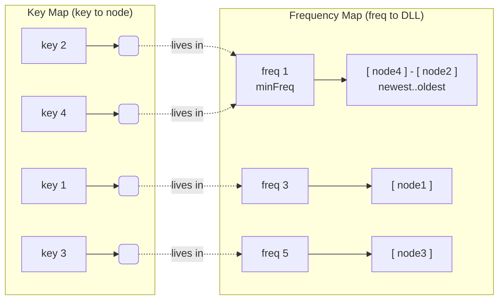
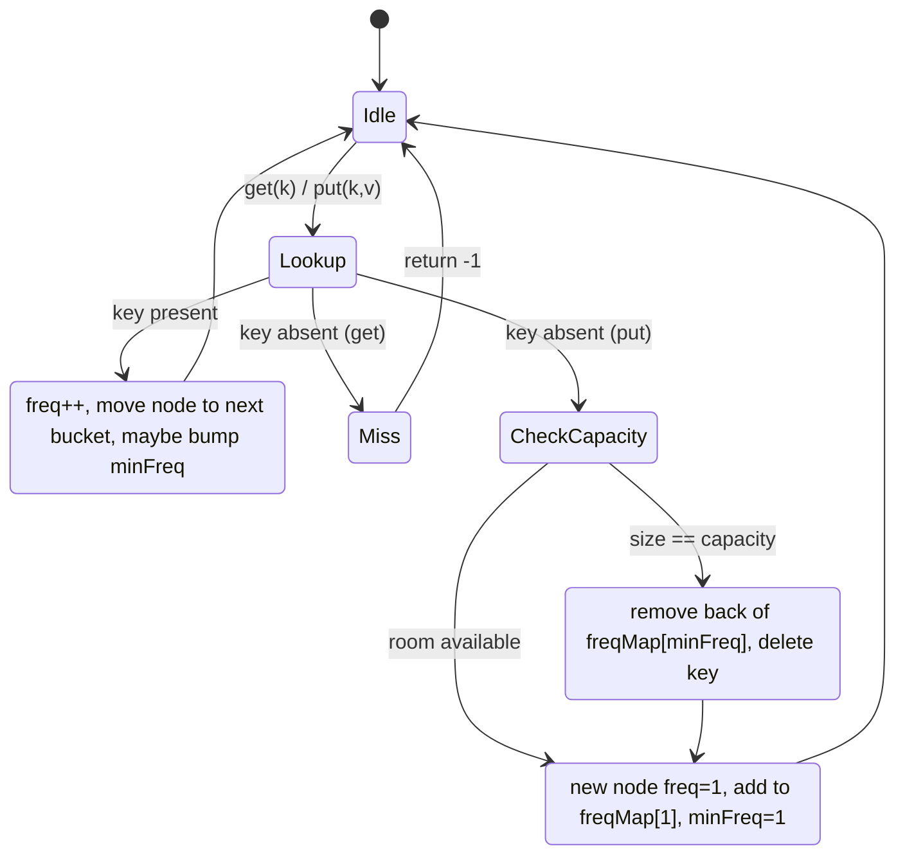
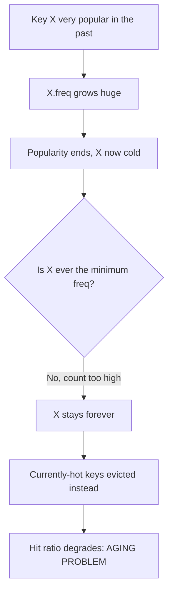

# LFU Cache — Middle Level

## Table of Contents

1. [Introduction](#introduction)
2. [Why O(1) Is Hard for LFU](#why-o1-is-hard-for-lfu)
3. [The O(1) Design: Three Cooperating Structures](#the-o1-design-three-cooperating-structures)
4. [Frequency Buckets and the minFreq Pointer](#frequency-buckets-and-the-minfreq-pointer)
5. [Walking Through get](#walking-through-get)
6. [Walking Through put](#walking-through-put)
7. [Why minFreq Updates Are O(1)](#why-minfreq-updates-are-o1)
8. [The State Machine](#the-state-machine)
9. [Tie-Breaking by Recency, in O(1)](#tie-breaking-by-recency-in-o1)
10. [Full O(1) Implementation (LeetCode 460)](#full-o1-implementation-leetcode-460)
11. [LFU vs LRU vs FIFO: When Frequency Wins](#lfu-vs-lru-vs-fifo-when-frequency-wins)
12. [A Worked Hit-Ratio Comparison](#a-worked-hit-ratio-comparison)
13. [The Aging Problem](#the-aging-problem)
14. [Fixes for Aging: Windows and Decay](#fixes-for-aging-windows-and-decay)
15. [Common Implementation Pitfalls](#common-implementation-pitfalls)
16. [Key Takeaways](#key-takeaways)

---

## Introduction

> Focus: "Why does the O(1) design work?" and "When should I choose LFU over LRU?"

At the [junior level](./junior.md) we built a correct LFU cache whose only flaw was an **O(n) eviction**: to find the least-frequently-used key, we scanned every entry. This level closes that gap. We build the celebrated **O(1) LFU design** — every operation (`get`, `put`, update, insert, evict) runs in constant time — and we understand exactly *why* each step is O(1).

We then step back and ask the strategic question: **when is LFU the right policy?** LFU is not universally better than [LRU](../01-lru-cache/middle.md). It shines when access frequencies are stable and skewed (a few keys are reliably hot), and it struggles when popularity changes over time — the famous **aging problem**, where an old once-popular key clings to a high count and refuses to be evicted. Understanding this trade-off is the difference between knowing *how* to implement LFU and knowing *whether* to.

---

## Why O(1) Is Hard for LFU

LRU has an elegant O(1) implementation because "least recently used" is always a *single, known location*: the tail of a doubly linked list ordered by recency. Touch a node → move it to the front. The LRU item is whatever currently sits at the tail. No search needed.

LFU is harder because "least frequently used" is a property that **changes as counts change**, and the minimum count can *jump* in non-obvious ways:

- After a `get`, a key's count goes up by one — so it might leave the "minimum" group.
- After an eviction, the smallest count might become *empty*, so the new minimum is some larger value.
- After inserting a new key (count 1), the minimum drops back to 1.

A naive approach re-scans for the minimum each time (O(n)). The insight that rescues us: **group keys by their frequency**, keep each group as a recency-ordered list, and maintain a single integer `minFreq` that always names the smallest non-empty group. Then "find the LFU victim" becomes "look at the `minFreq` group and take its oldest entry" — O(1).

---

## The O(1) Design: Three Cooperating Structures

The O(1) LFU cache combines **three** structures (one more than LRU's two):

| Structure | Maps | Purpose |
|-----------|------|---------|
| **Key map** | `key → node` | O(1) lookup of a key's node (value + current frequency) |
| **Frequency map** | `freq → doubly linked list of nodes at that frequency` | Groups keys by use count; each list is recency-ordered |
| **`minFreq` integer** | — | Names the smallest non-empty frequency bucket (the eviction target) |

Each node stores `key`, `value`, and its current `freq`. The frequency map's value at `f` is a **doubly linked list (DLL)** of every node whose count is exactly `f`. Within a DLL, nodes are ordered by recency: most recently used at the front, least recently used at the back. This per-bucket recency order is what gives us O(1) tie-breaking.



To evict: go to bucket `minFreq` (here, freq 1), remove its **oldest** node (the back of that DLL — node2), and delete its key from the key map. Constant time.

---

## Frequency Buckets and the minFreq Pointer

The **frequency map** is the heart of the design. Picture it as a column of buckets, one per distinct frequency that currently has at least one key:

```
 minFreq
   |
   v
freq 1:  HEAD <-> [k4] <-> [k2] <-> TAIL      (k4 newest, k2 oldest at freq 1)
freq 3:  HEAD <-> [k1] <-> TAIL
freq 5:  HEAD <-> [k3] <-> TAIL
```

Each bucket is a doubly linked list with dummy `HEAD`/`TAIL` sentinels (exactly like the [LRU list](../01-lru-cache/junior.md)), so insert-at-front and remove-any-node are O(1). The `minFreq` integer points at the smallest non-empty bucket — the only place eviction ever looks.

The crucial operation is **promoting a node** when it is used. If node `k2` (currently freq 1) is accessed:
1. Remove `k2` from the freq-1 bucket (O(1) DLL unlink).
2. Increment `k2.freq` to 2.
3. Insert `k2` at the **front** of the freq-2 bucket (creating that bucket if needed). Front = most recent.
4. If the freq-1 bucket is now empty **and** `minFreq` was 1, advance `minFreq` to 2.

Step 4 is the subtle one, and it is what makes the whole thing O(1) — we will prove it shortly.

---

## Walking Through get

```
get(key):
  if key not in keyMap: return -1
  node = keyMap[key]
  promote(node)         # remove from freq bucket, freq++, add to (freq+1) bucket
  return node.value
```

`promote(node)`:
```
oldFreq = node.freq
remove node from freqMap[oldFreq]
if freqMap[oldFreq] is now empty:
    delete freqMap[oldFreq]
    if minFreq == oldFreq: minFreq = oldFreq + 1
node.freq = oldFreq + 1
add node to FRONT of freqMap[oldFreq + 1]   # most recent in its new bucket
```

Every line is a hash-map operation or a constant number of pointer rewires. **O(1).**

---

## Walking Through put

```
put(key, value):
  if capacity == 0: return

  if key in keyMap:                 # existing key -> update + promote
      node = keyMap[key]
      node.value = value
      promote(node)
      return

  if size == capacity:              # full -> evict the LFU victim first
      victim = back node of freqMap[minFreq]   # oldest in the min bucket
      remove victim from freqMap[minFreq]
      delete keyMap[victim.key]
      size--

  newNode = node(key, value, freq=1)   # new keys ALWAYS start at freq 1
  keyMap[key] = newNode
  add newNode to FRONT of freqMap[1]
  minFreq = 1                          # a freq-1 key now exists -> min is 1
  size++
```

Two facts make this correct and fast:
- **New keys start at freq 1**, so after any insertion `minFreq` must be 1 (a key with count 1 exists). We can set `minFreq = 1` unconditionally on insert.
- **Eviction always targets `freqMap[minFreq]`**, taking its *back* node (least recently used within the smallest bucket). That is both the least frequent *and*, on a tie, the least recently used — exactly the required policy.

---

## Why minFreq Updates Are O(1)

The one place people fear O(n) is recomputing `minFreq`. Here is why it never costs more than O(1):

**Claim:** `minFreq` only ever needs to (a) reset to 1 on insert, or (b) increase by exactly 1 during a promotion.

- **On insert**, a freq-1 node appears, so the true minimum is 1. Set `minFreq = 1`. O(1).
- **On promotion** of a node from frequency `f`, the only way the minimum can change is if (i) `f == minFreq` and (ii) the freq-`f` bucket became empty. But that promoted node moved to bucket `f+1`, which is now guaranteed non-empty. So the new minimum is exactly `f+1`. Set `minFreq = f+1`. O(1).
- **On eviction**, we remove from bucket `minFreq`. If that bucket becomes empty, we do **not** need to find the next minimum immediately — the very next `put` that triggers an insert resets `minFreq = 1`, and we only ever evict right *before* such an insert. So a stale-but-soon-overwritten `minFreq` is harmless.

There is never a search. The minimum either snaps to 1 (insert) or climbs by one (promotion). This is the entire reason LFU achieves O(1).

> **Subtle correctness note:** we only need `minFreq` to be accurate at the *moment of eviction*, and eviction happens inside `put` immediately before an insert that resets it. Some implementations re-establish `minFreq = 1` after the insert; others rely on the promotion rule. Either is fine as long as eviction reads a correct `minFreq`.

---

## The State Machine



---

## Tie-Breaking by Recency, in O(1)

The recency tie-break — "among keys with the smallest frequency, evict the least recently used" — is handled *for free* by the per-bucket recency ordering:

- When a node enters a bucket (on insert into bucket 1, or on promotion into bucket `f+1`), it goes to the **front** (most recent).
- The **back** of a bucket is therefore always the least recently used node *at that frequency*.
- Eviction removes the back of `freqMap[minFreq]` → least frequent, and on ties, least recently used. Both criteria satisfied by a single `removeBack`.

No timestamps, no scanning, no comparisons. The DLL ordering *is* the recency information.

---

## Full O(1) Implementation (LeetCode 460)

A complete O(1) LFU cache in each language. All three share the design: `keyMap` (key→node), `freqMap` (freq→DLL), and `minFreq`.

### Go

```go
package lfu

// node is one cache entry, living in exactly one frequency DLL.
type node struct {
	key, value, freq int
	prev, next       *node
}

// dll is a doubly linked list with sentinel head/tail; front = most recent.
type dll struct {
	head, tail *node
	size       int
}

func newDLL() *dll {
	h, t := &node{}, &node{}
	h.next, t.prev = t, h
	return &dll{head: h, tail: t}
}

func (l *dll) pushFront(n *node) {
	n.prev, n.next = l.head, l.head.next
	l.head.next.prev = n
	l.head.next = n
	l.size++
}

func (l *dll) remove(n *node) {
	n.prev.next = n.next
	n.next.prev = n.prev
	l.size--
}

func (l *dll) popBack() *node { // least recently used in this bucket
	n := l.tail.prev
	l.remove(n)
	return n
}

// LFUCache is an O(1) least-frequently-used cache.
type LFUCache struct {
	capacity int
	minFreq  int
	keyMap   map[int]*node
	freqMap  map[int]*dll
}

func Constructor(capacity int) LFUCache {
	return LFUCache{
		capacity: capacity,
		keyMap:   make(map[int]*node),
		freqMap:  make(map[int]*dll),
	}
}

// promote moves a node from its current bucket to freq+1.
func (c *LFUCache) promote(n *node) {
	f := n.freq
	c.freqMap[f].remove(n)
	if c.freqMap[f].size == 0 {
		delete(c.freqMap, f)
		if c.minFreq == f {
			c.minFreq = f + 1
		}
	}
	n.freq++
	if c.freqMap[n.freq] == nil {
		c.freqMap[n.freq] = newDLL()
	}
	c.freqMap[n.freq].pushFront(n)
}

func (c *LFUCache) Get(key int) int {
	n, ok := c.keyMap[key]
	if !ok {
		return -1
	}
	c.promote(n)
	return n.value
}

func (c *LFUCache) Put(key, value int) {
	if c.capacity == 0 {
		return
	}
	if n, ok := c.keyMap[key]; ok {
		n.value = value
		c.promote(n)
		return
	}
	if len(c.keyMap) >= c.capacity {
		victim := c.freqMap[c.minFreq].popBack()
		delete(c.keyMap, victim.key)
	}
	n := &node{key: key, value: value, freq: 1}
	c.keyMap[key] = n
	if c.freqMap[1] == nil {
		c.freqMap[1] = newDLL()
	}
	c.freqMap[1].pushFront(n)
	c.minFreq = 1
}
```

### Java

```java
import java.util.HashMap;
import java.util.Map;

/** O(1) least-frequently-used cache (LeetCode 460). */
public class LFUCache {

    private static class Node {
        int key, value, freq = 1;
        Node prev, next;
        Node() {}
        Node(int key, int value) { this.key = key; this.value = value; }
    }

    /** DLL with sentinels; front = most recent. */
    private static class DLL {
        final Node head = new Node(), tail = new Node();
        int size = 0;
        DLL() { head.next = tail; tail.prev = head; }
        void pushFront(Node n) {
            n.prev = head; n.next = head.next;
            head.next.prev = n; head.next = n; size++;
        }
        void remove(Node n) {
            n.prev.next = n.next; n.next.prev = n.prev; size--;
        }
        Node popBack() { Node n = tail.prev; remove(n); return n; }
    }

    private final int capacity;
    private int minFreq = 0;
    private final Map<Integer, Node> keyMap = new HashMap<>();
    private final Map<Integer, DLL> freqMap = new HashMap<>();

    public LFUCache(int capacity) { this.capacity = capacity; }

    private void promote(Node n) {
        int f = n.freq;
        DLL list = freqMap.get(f);
        list.remove(n);
        if (list.size == 0) {
            freqMap.remove(f);
            if (minFreq == f) minFreq = f + 1;
        }
        n.freq++;
        freqMap.computeIfAbsent(n.freq, k -> new DLL()).pushFront(n);
    }

    public int get(int key) {
        Node n = keyMap.get(key);
        if (n == null) return -1;
        promote(n);
        return n.value;
    }

    public void put(int key, int value) {
        if (capacity == 0) return;
        Node n = keyMap.get(key);
        if (n != null) {
            n.value = value;
            promote(n);
            return;
        }
        if (keyMap.size() >= capacity) {
            Node victim = freqMap.get(minFreq).popBack();
            keyMap.remove(victim.key);
        }
        Node fresh = new Node(key, value);
        keyMap.put(key, fresh);
        freqMap.computeIfAbsent(1, k -> new DLL()).pushFront(fresh);
        minFreq = 1;
    }
}
```

### Python

```python
"""O(1) least-frequently-used cache (LeetCode 460)."""


class Node:
    __slots__ = ("key", "value", "freq", "prev", "next")

    def __init__(self, key=0, value=0):
        self.key = key
        self.value = value
        self.freq = 1
        self.prev = None
        self.next = None


class DLL:
    """Doubly linked list with sentinels; front = most recent."""

    def __init__(self):
        self.head = Node()
        self.tail = Node()
        self.head.next = self.tail
        self.tail.prev = self.head
        self.size = 0

    def push_front(self, n: Node) -> None:
        n.prev, n.next = self.head, self.head.next
        self.head.next.prev = n
        self.head.next = n
        self.size += 1

    def remove(self, n: Node) -> None:
        n.prev.next = n.next
        n.next.prev = n.prev
        self.size -= 1

    def pop_back(self) -> Node:
        n = self.tail.prev
        self.remove(n)
        return n


class LFUCache:
    def __init__(self, capacity: int):
        self.capacity = capacity
        self.min_freq = 0
        self.key_map: dict[int, Node] = {}
        self.freq_map: dict[int, DLL] = {}

    def _promote(self, n: Node) -> None:
        f = n.freq
        self.freq_map[f].remove(n)
        if self.freq_map[f].size == 0:
            del self.freq_map[f]
            if self.min_freq == f:
                self.min_freq = f + 1
        n.freq += 1
        self.freq_map.setdefault(n.freq, DLL()).push_front(n)

    def get(self, key: int) -> int:
        n = self.key_map.get(key)
        if n is None:
            return -1
        self._promote(n)
        return n.value

    def put(self, key: int, value: int) -> None:
        if self.capacity == 0:
            return
        n = self.key_map.get(key)
        if n is not None:
            n.value = value
            self._promote(n)
            return
        if len(self.key_map) >= self.capacity:
            victim = self.freq_map[self.min_freq].pop_back()
            del self.key_map[victim.key]
        fresh = Node(key, value)
        self.key_map[key] = fresh
        self.freq_map.setdefault(1, DLL()).push_front(fresh)
        self.min_freq = 1
```

All three pass LeetCode 460. Note how `promote` is shared by both `get` and `put`-on-existing-key — the single source of frequency increments.

---

## LFU vs LRU vs FIFO: When Frequency Wins

| Attribute | LFU | LRU | FIFO |
|-----------|-----|-----|------|
| Eviction key | Lowest use count (LRU tie-break) | Oldest access | Oldest insertion |
| Tracks | Frequency + recency | Recency | Insertion order |
| Structures | keyMap + freqMap + minFreq | keyMap + 1 DLL | 1 queue |
| O(1) get/put | Yes (this design) | Yes | Yes |
| Adapts to shifting popularity | **Poorly** (aging) | **Well** | Poorly |
| Scan-resistant | **Yes** (one-time keys stay at freq 1, evicted first) | No (scan flushes cache) | No |
| Best for | Stable, skewed frequency (a few hot keys) | Recency-driven, shifting workloads | Simple, order-of-arrival eviction |

**The headline trade-off:**
- **LFU is scan-resistant.** A one-time sequential scan creates many freq-1 keys; they sit in the `minFreq=1` bucket and are evicted first, *protecting* the genuinely-hot high-frequency keys. This is exactly the workload where [LRU's sequential-flooding weakness](../01-lru-cache/middle.md) destroys its hit ratio.
- **LRU adapts to change.** If the hot set shifts over time, LRU follows it immediately, while LFU is anchored by stale counts (the aging problem). LFU can keep a key that *was* popular long after it stopped being useful.

**Choose LFU when:** access frequencies are stable and skewed — a small popular set that stays popular (e.g., a CDN serving a long-tail catalog where the head is consistently hot). **Choose LRU when:** the working set shifts over time and recency predicts the future better than historical frequency. Many real systems use a **hybrid** (ARC, 2Q, W-TinyLFU — see the [senior level](./senior.md)) to get both benefits.

---

## A Worked Hit-Ratio Comparison

Capacity 3. Access stream (a hot key `H` interleaved with one-time scan keys):

```
H H H  s1 s2 s3 s4 s5  H
```

**LFU (counts):** After `H H H`, `H` has freq 3. Each `s_i` enters at freq 1. When a new `s` overflows, the victim is the *previous* freq-1 scan key (least frequent, LRU tie-break) — never `H` (freq 3). The final `H` is a **hit**.
- Hits on the trailing `H`: yes. LFU protects the hot key through the scan.

**LRU:** After `H H H`, order is `[H]`. The scan `s1..s5` pushes `H` toward the tail; by `s4` the cache is `[s4, s3, s2]` and `H` was evicted at `s4`. The final `H` is a **miss**.
- LRU lost the hot key to sequential flooding.

| Policy | Trailing `H` | Reason |
|--------|--------------|--------|
| LFU | **Hit** | `H` (freq 3) is never the minimum; scan keys (freq 1) absorb evictions |
| LRU | **Miss** | Scan pushed `H` out of the recency window |

This is LFU's best case. The aging problem below is its worst.

---

## The Aging Problem

LFU's strength — *long memory of frequency* — is also its fatal flaw. Counts only ever go **up**. They never decay. So a key that was hammered in the past keeps a sky-high count *forever*, even if it is now completely cold.

```
Phase 1 (morning):  key X requested 10,000 times -> X.freq = 10000
Phase 2 (afternoon): X is never requested again, but...
                     X.freq (10000) is so large it is NEVER the minimum.
                     X occupies a cache slot permanently.
                     Newer, currently-hot keys get evicted instead.
```

This is **cache pollution by stale popularity**. The cache slowly fills with yesterday's heroes while today's hot keys thrash in and out. Hit ratio degrades over time. Pure LFU is almost never deployed unmodified precisely because of this.



---

## Fixes for Aging: Windows and Decay

Real systems make counts *forget* the distant past. Common techniques (developed fully at the [senior level](./senior.md)):

| Technique | Idea | Trade-off |
|-----------|------|-----------|
| **Periodic decay** | Every interval, halve all counts (`freq = freq / 2`) | Simple; popularity "evaporates" gradually; needs a sweep or lazy decay |
| **Windowed counts** | Only count uses within a recent time window (e.g., last hour) | Bounded memory of the past; must expire old hits |
| **Aging on access** | Decay a key's count based on time since last use when it is touched | Lazy, no sweep; couples frequency with recency (this is **LFU with dynamic aging**) |
| **Approximate counters** | Use a small probabilistic counter (Morris counter) that saturates and decays | Tiny memory; Redis uses this for `allkeys-lfu` |
| **Admission window (W-TinyLFU)** | A small LRU "window" admits newcomers; a frequency sketch (TinyLFU) decides who stays | Best of both worlds; used by Caffeine |

The simplest mental model is **decay**: periodically (or lazily, when a key is accessed) reduce counts so that a burst of popularity fades unless it is *renewed*. With decay, the once-popular-now-cold key X loses its count over time and eventually becomes evictable again. Redis takes the approximate route — a logarithmic probabilistic counter that both saturates and decays — which the senior level covers in depth.

---

## Common Implementation Pitfalls

| Pitfall | Symptom | Fix |
|---------|---------|-----|
| Forgetting to advance `minFreq` after a promotion empties the min bucket | Eviction reads an empty bucket → crash | If the emptied bucket was `minFreq`, set `minFreq = f + 1` |
| Setting `minFreq` from the new node's freq on insert (which is 1) but using `>` checks | Off-by-one; `minFreq` stuck above 1 | On insert, unconditionally set `minFreq = 1` |
| Adding promoted nodes to the **back** of the new bucket | Recency tie-break inverted; wrong victim on ties | Always `pushFront` so back = least recently used |
| Not deleting an emptied frequency bucket | `freqMap` grows unbounded with stale empty lists | Delete `freqMap[f]` when its size hits 0 |
| Evicting on update of an existing key | Cache shrinks incorrectly; data loss | Only evict on inserting a **new** key |
| Reusing the same DLL object for all frequencies | All keys collapse into one bucket; policy broken | One DLL **per** frequency value |

---

## Key Takeaways

- The O(1) LFU design uses **three** structures: a key map, a frequency map (`freq → recency-ordered DLL`), and a `minFreq` integer.
- **Promotion** (on every use) unlinks a node, increments its freq, and pushes it to the front of the next bucket — all O(1).
- `minFreq` only **resets to 1** (on insert) or **climbs by exactly 1** (when a promotion empties the min bucket), so it is never searched for — the key to O(1).
- **Recency tie-breaking is free**: each bucket is recency-ordered, so the back of the `minFreq` bucket is both least frequent and least recently used.
- **LFU beats LRU** on stable, skewed, scan-heavy workloads (it is scan-resistant); **LRU beats LFU** when popularity shifts over time.
- The **aging problem** — counts that never decay — makes pure LFU degrade over time; fixes use **decay, windows, or approximate counters**, leading to Redis-LFU and W-TinyLFU.

**Next step:** Continue to [`senior.md`](./senior.md) to see LFU inside real systems — Redis `maxmemory-policy lfu` with its Morris-style probabilistic counter, CDN eviction, W-TinyLFU / Caffeine, decay strategies, and how to measure and tune hit ratio. Cross-reference [ARC / 2Q](../22-arc-2q-cache/middle.md) and [LRU](../01-lru-cache/senior.md).
