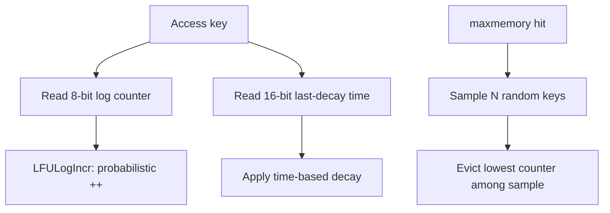
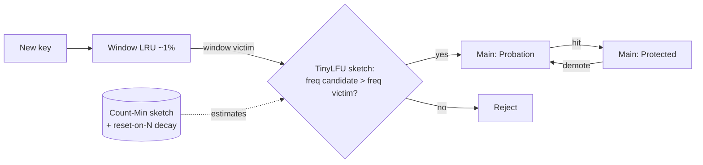

# LFU Cache — Senior Level

## Table of Contents

1. [Introduction](#introduction)
2. [LFU in Production Systems](#lfu-in-production-systems)
3. [Redis maxmemory-policy LFU](#redis-maxmemory-policy-lfu)
4. [Approximate LFU: The Morris Counter](#approximate-lfu-the-morris-counter)
5. [Decay: Making Frequency Forget](#decay-making-frequency-forget)
6. [TinyLFU: A Frequency Sketch as an Admission Filter](#tinylfu-a-frequency-sketch-as-an-admission-filter)
7. [W-TinyLFU and Caffeine](#w-tinylfu-and-caffeine)
8. [CDN Eviction: Frequency at the Edge](#cdn-eviction-frequency-at-the-edge)
9. [Comparison of LFU-Family Policies](#comparison-of-lfu-family-policies)
10. [Hit Ratio: Measuring and Tuning](#hit-ratio-measuring-and-tuning)
11. [Concurrency: Sharding and Buffered Counts](#concurrency-sharding-and-buffered-counts)
12. [Implementations](#implementations)
    - [Go: Morris-Counter Approximate LFU](#go-morris-counter-approximate-lfu)
    - [Java: Count-Min Sketch TinyLFU Admission](#java-count-min-sketch-tinylfu-admission)
    - [Python: LFU with Periodic Decay](#python-lfu-with-periodic-decay)
13. [Observability and Failure Modes](#observability-and-failure-modes)
14. [Key Takeaways](#key-takeaways)

---

## Introduction

> Focus: "How do real systems use frequency to decide what to cache and evict?"

The [exact O(1) LFU](./middle.md) is a beautiful interview answer, but production caches rarely ship it unmodified. Two realities force engineers to compromise:

1. **The aging problem.** Exact counts never forget, so a long-running cache fills with stale-but-formerly-popular keys. Real LFU *must* decay.
2. **Memory.** Storing an exact frequency per key costs bytes per entry and a full DLL-per-frequency structure. At the scale of Redis, a CDN edge, or an in-process cache holding millions of entries, this overhead matters. Production LFU uses **approximate counters** (a few bits per key) instead.

This level covers how frequency-based eviction actually appears in the wild: **Redis** `allkeys-lfu`/`volatile-lfu` with its logarithmic Morris-style counter, the **Morris counter** itself, **decay** mechanics, **TinyLFU** (a frequency sketch used as an admission filter), and **W-TinyLFU** as implemented by **Caffeine** — arguably the best general-purpose cache eviction policy in wide use. We finish with CDN edge eviction, hit-ratio measurement, and concurrency.

---

## LFU in Production Systems

| System | Where frequency is used | Form |
|--------|-------------------------|------|
| **Redis** | `maxmemory-policy {allkeys,volatile}-lfu` | 8-bit logarithmic (Morris-style) counter per key, with decay |
| **Caffeine** (Java) | Default eviction policy | W-TinyLFU: small LRU window + Count-Min frequency sketch |
| **Ristretto** (Go, Dgraph) | Cache admission/eviction | TinyLFU with Count-Min sketch + doorkeeper Bloom filter |
| **CDNs (Varnish, ATS, commercial edges)** | Object eviction at the edge | Frequency- or popularity-aware variants (often segmented/aging LFU) |
| **Database buffer managers** | Page replacement | LFU variants (LFU-K, LRFU) blending frequency and recency |

The common thread: **pure exact LFU is too rigid and too expensive**, so every real system either approximates the counter, decays it, or blends frequency with recency (or all three).

---

## Redis maxmemory-policy LFU

When Redis hits `maxmemory`, it evicts according to `maxmemory-policy`. Two of those policies are LFU-based:

- `allkeys-lfu` — evict the least-frequently-used key among **all** keys.
- `volatile-lfu` — evict the LFU key among keys **with a TTL set**.

Redis does **not** keep an exact count or a freq-bucket DLL. Each object header has a 24-bit LRU/LFU field. In LFU mode, Redis splits it into:

- **16 bits**: the last decrement time, in minutes (for decay).
- **8 bits**: a **logarithmic counter** (`LFUCounter`), range 0–255, representing *approximate* access frequency.

### The logarithmic (Morris-style) counter

A naive 8-bit counter saturates at 255 almost immediately for hot keys, making them indistinguishable. Redis instead increments **probabilistically and logarithmically**, so the counter measures *orders of magnitude* of accesses, not raw counts. On each access:

```
counter increment (Redis LFULogIncr):
    if counter == 255: return 255                # saturated
    r = random() in [0,1)
    baseval = counter - LFU_INIT_VAL             # LFU_INIT_VAL = 5
    if baseval < 0: baseval = 0
    p = 1.0 / (baseval * lfu_log_factor + 1)     # lfu_log_factor default 10
    if r < p: counter += 1
    return counter
```

The probability of an increment **shrinks as the counter grows**, so it takes exponentially more accesses to climb each step. With the default `lfu-log-factor 10`, roughly: ~1M accesses to reach 255, ~100 to reach 10, ~10 to reach 6. The counter is a **compressed, logarithmic estimate** of true frequency — pure Morris-counter philosophy.

### Decay built in

The 16-bit timestamp drives **decay**: when a key is touched, Redis halves (or reduces by `lfu-decay-time`) the counter based on how many minutes passed since the last decrement. This is the aging fix — old popularity literally decays away over wall-clock time, so a once-hot-now-cold key sinks back toward evictability. New keys start at `LFU_INIT_VAL = 5` (not 0) so they are not instantly evicted before they prove themselves.

Eviction is **approximate** too: Redis samples `maxmemory-samples` (default 5) random keys and evicts the one with the lowest counter — it does not maintain a global minimum. This trades a touch of accuracy for O(1) memory and no global bookkeeping.



---

## Approximate LFU: The Morris Counter

The **Morris counter** (1978) is the foundational trick behind approximate LFU. It answers: *how do you count up to N using only ~log log N bits?*

Idea: store an exponent `c`, and treat the true count as approximately `2^c - 1` (or `base^c`). On each increment, only *actually* increment `c` with probability `1 / 2^c` (or `1/base^c`). So:

- Counter `c` represents a true count near `2^c`.
- Early increments (small `c`) almost always bump `c`.
- Later increments (large `c`) rarely bump `c`, because the gap between `2^c` and `2^{c+1}` is huge.

```
expected true count when counter = c:  ~ 2^c - 1
bits needed to count to N:             ~ log2(log2 N)
```

An 8-bit Morris counter can approximate counts up to astronomically large values. The estimate is unbiased in expectation but noisy; tuning the base trades accuracy for range. Redis's `LFULogIncr` is a Morris counter with a tunable log factor and a saturation cap.

**Why this matters for LFU:** exact counts cost too much memory and saturate badly. Morris counters give a frequency *ranking* (which is all eviction needs) in a single byte. You lose the ability to distinguish "1000 accesses" from "1100 accesses," but you keep the ability to distinguish "hot" from "cold," which is what eviction decisions require.

---

## Decay: Making Frequency Forget

Decay is the universal cure for aging. Three implementation strategies:

| Strategy | Mechanism | Used by |
|----------|-----------|---------|
| **Time-based decay** | Reduce a key's counter by an amount proportional to elapsed time since last touch | Redis (per-key, lazy on access) |
| **Reset-on-N (aging sweep)** | After every N total accesses (or M evictions), halve every counter | TinyLFU / W-TinyLFU sketch reset |
| **Sliding window** | Only count accesses inside a recent window; expire older hits | Windowed LFU, some CDN edges |

The **reset-on-N** approach (used by TinyLFU's sketch) is elegant for approximate structures: maintain a global "sample size" counter; when it reaches a threshold (e.g., 10× the cache capacity), **halve every cell** of the frequency sketch in one pass. This is O(sketch size), amortized to near-zero per access, and it gives the sketch a *fading memory* — recent frequency dominates, ancient frequency fades. It neatly fuses frequency with a coarse recency.

> **Design principle:** decay turns LFU from "least frequently used **ever**" into "least frequently used **recently**," which is what you actually want. Without decay, LFU optimizes for the wrong objective on any non-stationary workload.

---

## TinyLFU: A Frequency Sketch as an Admission Filter

**TinyLFU** (Einziger & Friedman, 2015) reframes the problem. Instead of an exact freq-bucket structure, it asks a different question at eviction time:

> A new key wants in, but the cache is full. Should we **admit** the newcomer and evict the current victim, or **reject** the newcomer and keep the victim?

TinyLFU answers using an **approximate frequency sketch** — a **Count-Min Sketch** (a few counters per key via hashing) augmented with the reset-on-N aging. The admission rule:

```
candidate = the new/just-missed key
victim    = the eviction target chosen by the base policy (e.g., LRU of the main region)
if estimatedFrequency(candidate) > estimatedFrequency(victim):
    admit candidate, evict victim
else:
    reject candidate (keep victim)
```

This is profound: the cache uses a **tiny** (kilobytes) frequency sketch to *gate admission*, so one-hit-wonder keys (low estimated frequency) are rejected before they can pollute the cache, while genuinely-frequent keys displace less-frequent residents. The sketch's reset-on-N gives it decay. TinyLFU achieves near-optimal hit ratios with ~10 bits of metadata per cache entry — far cheaper than exact LFU.

A **doorkeeper** (a small Bloom filter cleared on each reset) often fronts the sketch: a key's *first* sighting only sets the Bloom bit; subsequent sightings increment the Count-Min sketch. This keeps the sketch from being polluted by the long tail of singletons. (See [Count-Min Sketch](../08-count-min-sketch/senior.md) and [Bloom filter](../02-bloom-filter/senior.md) for the underlying structures.)

---

## W-TinyLFU and Caffeine

Pure TinyLFU admission can be too harsh on **bursty** new keys — a key that is about to become hot looks like a singleton at first and gets rejected. **W-TinyLFU** ("Windowed TinyLFU"), the policy in **Caffeine**, fixes this with a small front window:

```
          admit/reject via TinyLFU sketch
                       |
   +----------+        v        +--------------------------+
   |  Window  |---- candidate -->|       Main Region        |
   |  (LRU,   |                  | (SLRU: probation+protected)|
   |  ~1%)    |<-- victim -------|                          |
   +----------+                  +--------------------------+
       new keys land here first        survivors live here
```

- **Window (admission LRU, ~1% of capacity):** every new key enters here. Bursty newcomers get a brief chance to prove themselves with no frequency gate.
- **Main region (Segmented LRU):** larger region split into *probation* and *protected* segments. When the window evicts a candidate, the **TinyLFU sketch** decides whether it earns a spot in the main region by comparing its estimated frequency against the main region's victim.
- **Adaptive sizing:** Caffeine dynamically resizes the window vs main region based on a hill-climbing optimizer that watches the hit-ratio gradient — it adapts toward LRU-like behavior for recency-heavy workloads and LFU-like behavior for frequency-heavy ones.

The result: W-TinyLFU **matches or beats LRU, LFU, ARC, and 2Q across nearly all benchmark traces** while using little metadata. It is the de facto best general-purpose policy and is why Caffeine replaced Guava cache in much of the JVM ecosystem. (Cross-reference [ARC / 2Q](../22-arc-2q-cache/senior.md), the other major scan-resistant family.)



---

## CDN Eviction: Frequency at the Edge

A CDN edge node caches objects (images, video segments, scripts) close to users. Cache capacity is fixed (disk + RAM); the catalog is vast and **heavily skewed** (Zipfian) — a small head of objects serves most requests, a long tail is requested rarely.

Why frequency matters more than recency at the edge:
- The **head** (hot objects) should stay cached permanently. LRU can evict them during a tail burst (a crawler, a viral-but-brief spike); **frequency-aware** eviction protects them.
- **One-time requests** (the long tail, bots, unique URLs) should *not* displace the head. Frequency gating (TinyLFU-style admission) rejects them.
- **Object size and cost** complicate it: evicting one 4 GB video frees as much room as thousands of thumbnails. Production CDN policies are **cost/size-aware frequency** variants (e.g., GreedyDual-Size-Frequency), weighting `frequency / size` or `frequency × fetch_cost / size`.

So real CDNs run **segmented or aging LFU** (or W-TinyLFU-like admission) with **size/cost weighting** and **decay** to follow shifting popularity (a new release becomes hot; last week's hit cools off). Pure recency (LRU) is too easily flushed; pure exact LFU ages badly and ignores size. (See [cdn-design] and [distributed-caching] skills for the systems view.)

---

## Comparison of LFU-Family Policies

| Policy | Metadata/entry | Decay? | Scan-resistant | Adapts to shift | Notes |
|--------|----------------|--------|----------------|-----------------|-------|
| Exact O(1) LFU | freq + DLL ptrs (~tens of bytes) | No | Yes | No (aging) | Interview answer; rarely shipped |
| LFU + periodic decay | freq + timestamp | Yes | Yes | Partly | Simple production-viable LFU |
| Redis LFU | 1 byte log counter + 2 bytes time | Yes | Yes | Yes | Sampled eviction, Morris counter |
| TinyLFU | ~4–10 bits (sketch) | Yes (reset-on-N) | Yes | Yes | Admission filter, not standalone |
| **W-TinyLFU (Caffeine)** | ~10 bits + small window | Yes | Yes | **Yes (adaptive)** | Best general-purpose policy |
| LRU | DLL ptrs | n/a | **No** | Yes | Baseline; flushed by scans |
| ARC / 2Q | two LRU lists | n/a | Yes | Yes | Recency+frequency, self-tuning |

---

## Hit Ratio: Measuring and Tuning

Hit ratio is the north-star metric for any cache. Definitions and the metrics that explain it:

| Metric | Meaning | Why it matters |
|--------|---------|----------------|
| `hit_ratio = hits / (hits + misses)` | Fraction of requests served from cache | Directly drives latency and origin load |
| `byte_hit_ratio` | Fraction of **bytes** served from cache | CDN bandwidth cost; differs from object hit ratio when sizes vary |
| `eviction_rate` | Evictions per second | High rate + low hit ratio ⇒ cache too small or wrong policy |
| `admission_reject_rate` (TinyLFU) | Fraction of candidates rejected by the sketch | Tail/scan pressure; sketch effectiveness |
| `cold_miss_ratio` | Misses on never-seen keys | Unavoidable; isolates *compulsory* misses from policy misses |

**Tuning LFU specifically:**
- **Too much aging?** (hit ratio drops after popularity shifts but recovers slowly) → shorten decay interval / `lfu-decay-time`.
- **Too little aging?** (stale keys persist, new hot keys thrash) → increase decay aggressiveness or shorten the window.
- **Singletons polluting?** → add/strengthen a doorkeeper / admission gate.
- **A/B against LRU.** Replay a real request trace through both policies offline (a *cache simulator*) and compare hit ratios *before* changing production. This is standard practice — the policy that wins is workload-specific.

A worked intuition: on a **Zipfian** workload (typical for web/CDN), frequency-aware policies (LFU, W-TinyLFU) beat LRU by several percentage points of hit ratio at the same capacity — and on a cache fronting an expensive origin, a 3% hit-ratio gain can mean a large reduction in origin QPS and cost.

---

## Concurrency: Sharding and Buffered Counts

LFU is harder to make concurrent than LRU because **every read mutates shared state** (the frequency counter and bucket structure). A naive global lock serializes all gets.

Two production techniques:

1. **Sharding.** Partition keys across N independent LFU shards by `hash(key) % N`, each with its own lock and its own freq structure. Reduces contention N-fold. The downside: frequency is tracked *per shard*, so eviction decisions are local — acceptable when shards are balanced.

2. **Buffered / batched counting (Caffeine's approach).** A read does **not** synchronously update the frequency structure. Instead it appends the access to a lock-free **ring buffer** per thread; a single maintenance task **drains** the buffers and applies the count updates and reorderings in the background, under one lock. Reads stay nearly lock-free and O(1); the policy state is *eventually* consistent. Writes can use a similar buffered scheme. This is why Caffeine sustains tens of millions of reads/sec.

The Count-Min sketch underlying TinyLFU is itself amenable to relaxed concurrency — a few racy increments barely perturb an approximate counter, so it can tolerate lock-free or sloppy updates without correctness issues, only minor estimate noise.

---

## Implementations

### Go: Morris-Counter Approximate LFU

A compact approximate-LFU that stores a single-byte logarithmic counter per key (Redis-style) and evicts by sampling — O(1) memory per entry, no freq-bucket DLLs.

```go
package alfu

import "math/rand"

type item struct {
	value      int
	counter    uint8 // logarithmic (Morris-style) frequency estimate
	lastAccess int64 // tick of last access, for decay
}

// ApproxLFU evicts by sampling K keys and dropping the lowest counter.
type ApproxLFU struct {
	capacity   int
	logFactor  float64
	data       map[int]*item
	tick       int64
	sampleSize int
}

func New(capacity int) *ApproxLFU {
	return &ApproxLFU{
		capacity: capacity, logFactor: 10, sampleSize: 5,
		data: make(map[int]*item),
	}
}

// logIncr bumps the counter probabilistically (Morris/Redis LFULogIncr).
func (c *ApproxLFU) logIncr(it *item) {
	if it.counter == 255 {
		return
	}
	base := float64(it.counter) - 5 // LFU_INIT_VAL = 5
	if base < 0 {
		base = 0
	}
	p := 1.0 / (base*c.logFactor + 1.0)
	if rand.Float64() < p {
		it.counter++
	}
}

func (c *ApproxLFU) Get(key int) (int, bool) {
	it, ok := c.data[key]
	if !ok {
		return -1, false
	}
	c.tick++
	it.lastAccess = c.tick
	c.logIncr(it)
	return it.value, true
}

func (c *ApproxLFU) Put(key, value int) {
	if c.capacity == 0 {
		return
	}
	c.tick++
	if it, ok := c.data[key]; ok {
		it.value = value
		it.lastAccess = c.tick
		c.logIncr(it)
		return
	}
	if len(c.data) >= c.capacity {
		c.evictSampled()
	}
	c.data[key] = &item{value: value, counter: 5, lastAccess: c.tick}
}

// evictSampled drops the lowest-counter key among a random sample.
func (c *ApproxLFU) evictSampled() {
	victim, best := -1, int(256)
	seen := 0
	for k, it := range c.data { // map iteration gives pseudo-random sample
		score := int(it.counter)
		if score < best {
			best, victim = score, k
		}
		if seen++; seen >= c.sampleSize {
			break
		}
	}
	delete(c.data, victim)
}
```

### Java: Count-Min Sketch TinyLFU Admission

The admission heart of TinyLFU: a Count-Min frequency sketch with reset-on-N decay, used to decide whether a candidate should displace a victim.

```java
public class TinyLFU {
    private final int[] table;     // Count-Min counters (one row, multiple hashes)
    private final int mask;
    private final int sampleSize;  // reset (halve) after this many increments
    private int additions = 0;

    public TinyLFU(int capacity) {
        int size = Integer.highestOneBit(Math.max(16, capacity * 8)) << 1;
        this.table = new int[size];
        this.mask = size - 1;
        this.sampleSize = Math.max(64, capacity * 10);
    }

    private int[] indexesOf(int key) {
        int h1 = key * 0x9E3779B1;
        int h2 = (key ^ (key >>> 16)) * 0x85EBCA77;
        return new int[]{ h1 & mask, h2 & mask, (h1 ^ h2) & mask };
    }

    /** Record an access; returns estimated frequency (min over hashes). */
    public int recordAndEstimate(int key) {
        int min = Integer.MAX_VALUE;
        for (int idx : indexesOf(key)) {
            if (table[idx] < 15) table[idx]++; // 4-bit saturating counters
            min = Math.min(min, table[idx]);
        }
        if (++additions >= sampleSize) reset(); // aging: fade old frequency
        return min;
    }

    public int estimate(int key) {
        int min = Integer.MAX_VALUE;
        for (int idx : indexesOf(key)) min = Math.min(min, table[idx]);
        return min;
    }

    /** Halve every counter — TinyLFU's decay sweep. */
    private void reset() {
        for (int i = 0; i < table.length; i++) table[i] >>>= 1;
        additions >>>= 1;
    }

    /** Admission rule: admit candidate iff it is at least as frequent as victim. */
    public boolean admit(int candidateKey, int victimKey) {
        return recordAndEstimate(candidateKey) >= estimate(victimKey);
    }
}
```

### Python: LFU with Periodic Decay

Exact-counter LFU that periodically halves all counts — the simplest production-viable aging fix on top of the [O(1) design](./middle.md).

```python
from collections import defaultdict, OrderedDict


class DecayingLFU:
    """O(1)-ish LFU with periodic count halving to combat aging."""

    def __init__(self, capacity: int, decay_every: int = 10_000):
        self.capacity = capacity
        self.decay_every = decay_every
        self.ops = 0
        self.values: dict[int, int] = {}
        self.freq: dict[int, int] = {}
        # freq -> OrderedDict of keys (recency order within a frequency)
        self.buckets: dict[int, "OrderedDict[int, None]"] = defaultdict(OrderedDict)
        self.min_freq = 0

    def _touch(self, key: int) -> None:
        f = self.freq[key]
        del self.buckets[f][key]
        if not self.buckets[f]:
            del self.buckets[f]
            if self.min_freq == f:
                self.min_freq = f + 1
        self.freq[key] = f + 1
        self.buckets[f + 1][key] = None  # newest at the end

    def get(self, key: int) -> int:
        if key not in self.values:
            return -1
        self._maybe_decay()
        self._touch(key)
        return self.values[key]

    def put(self, key: int, value: int) -> None:
        if self.capacity == 0:
            return
        self._maybe_decay()
        if key in self.values:
            self.values[key] = value
            self._touch(key)
            return
        if len(self.values) >= self.capacity:
            # evict least frequent, oldest within that bucket (front of OrderedDict)
            victim, _ = next(iter(self.buckets[self.min_freq].items()))
            del self.buckets[self.min_freq][victim]
            del self.values[victim]
            del self.freq[victim]
        self.values[key] = value
        self.freq[key] = 1
        self.buckets[1][key] = None
        self.min_freq = 1

    def _maybe_decay(self) -> None:
        self.ops += 1
        if self.ops % self.decay_every:
            return
        # Halve every count; rebuild buckets. Aging fix.
        new_freq, new_buckets = {}, defaultdict(OrderedDict)
        for k, f in self.freq.items():
            nf = max(1, f // 2)
            new_freq[k] = nf
            new_buckets[nf][k] = None
        self.freq, self.buckets = new_freq, new_buckets
        self.min_freq = min(self.buckets) if self.buckets else 0
```

---

## Segmented LFU and Classic LFU Variants

Before TinyLFU, several practical LFU variants tamed aging and scans. They remain relevant in DB buffer managers and embedded caches.

| Variant | Idea | Where seen |
|---------|------|-----------|
| **LFU with dynamic aging (LFUDA)** | Add a global `age` offset to every new key's count; eviction uses `freq + age`. The age floor rises as evictions happen, so old high counts are eventually overtaken. | Web proxy caches (Squid's heap policies) |
| **LFU-K / LRU-K** | Remember the time of the K-th-most-recent access; evict by oldest K-th reference. K=1 ⇒ LRU; larger K ⇒ more frequency weight. Scan-resistant: one scan touch can't build K-history. | Database buffer pools (LRU-2) |
| **Segmented LFU (SLFU)** | Split the cache into a *probationary* segment (new/low-freq) and a *protected* segment (proven-hot). Promote on a second hit; demote from protected back to probation under pressure. | The "main region" inside W-TinyLFU |
| **LRFU** | Combined Recency/Frequency score with an exponential recency-decay weight `lambda`; tunes continuously between LRU (`lambda→0`) and LFU (`lambda→1`). | Research / specialized buffer caches |

**LFUDA** deserves a closer look because it is the cheapest aging fix that keeps exact counts:

```
on access to x:        x.priority = x.freq + age          # age = global floor
on eviction:           victim = argmin priority
                       age = victim.priority              # floor ratchets up
on insert of new x:    x.freq = 1; x.priority = 1 + age   # newcomers start at the floor
```

Because `age` only ever rises (to the priority of the last victim), a stale key's fixed `freq` is eventually surpassed by the floor that newcomers inherit — so it becomes evictable without any explicit decay sweep. It is essentially the `clock` trick of GreedyDual specialized to pure frequency.

---

## A Worked Capacity-Tuning Example

Suppose a service fronts a database with a frequency-skewed (Zipfian, `s ≈ 0.9`) key workload of ~1M distinct keys at 50k req/s. You must choose a cache size and policy.

```
Goal: cut origin (DB) QPS from 50k to under 10k  =>  need hit ratio >= 0.80.

Step 1 — model the working set. With Zipf s=0.9, the top ~5% of keys serve
         ~70% of requests; the top ~15% serve ~85%.
Step 2 — pick capacity. Caching ~15% (150k entries) targets ~0.85 hit ratio
         under an optimal (top-k) policy.
Step 3 — pick policy. The tail is full of singletons (scans, crawlers). LRU at
         150k would be repeatedly flushed by tail bursts, landing well below 0.85.
         A frequency-aware policy (W-TinyLFU / decaying LFU) holds the hot head
         and rejects singletons, reaching ~0.84-0.85.
Step 4 — validate offline. Replay a real 1-hour trace through both policies at
         100k / 150k / 200k capacity; pick the knee of the hit-ratio curve.
Step 5 — set decay. If popularity rotates daily (new content), set the decay
         half-life to a few hours so yesterday's head fades but today's persists.
```

The takeaway: capacity is sized from the *working-set / Zipf head*, and policy is chosen from the *tail behavior* (singleton/scan pressure) — and both are confirmed by trace replay before shipping. A 0.85 vs 0.80 hit ratio is the difference between 7.5k and 10k origin QPS — a 25% origin-load swing from the policy choice alone.

---

## Observability and Failure Modes

| Metric | Alert threshold | Meaning |
|--------|-----------------|---------|
| `hit_ratio` | < target (e.g., 0.9 for a CDN edge) | Policy/capacity not serving the workload |
| `eviction_rate` | sudden spike | Capacity pressure or a scan flood |
| `lfu_counter_saturation` | many keys at max counter | Decay too weak; counters indistinguishable |
| `admission_reject_rate` | unusually high | Sketch starving newcomers; window too small |
| `stale_hot_fraction` | high | Aging problem: cold keys with high counts squatting slots |

**Failure modes specific to LFU:**
- **Aging / stale-hot pollution:** counts never decay → cure with decay (covered above).
- **Counter saturation:** all hot keys hit max counter and become indistinguishable → use a logarithmic (Morris) counter and tune the log factor.
- **Burst rejection:** strict admission filters reject a key that is *about to* trend → add an LRU admission window (W-TinyLFU).
- **Cold start:** an empty cache evicts based on near-equal counts → seed new keys above zero (Redis uses `LFU_INIT_VAL = 5`).
- **Hot-key contention (concurrency):** every read mutates the counter → shard or buffer counts (Caffeine ring buffers).

---

## Key Takeaways

- Production caches almost never ship **exact** LFU: it ages badly and costs too much memory. They use **approximation + decay**, or **frequency-as-admission**.
- **Redis** LFU uses an 8-bit **logarithmic (Morris-style)** counter plus a time-based **decay**, and evicts by **sampling** random keys — O(1) memory, no global minimum.
- The **Morris counter** counts to N using ~log log N bits by incrementing probabilistically; it gives a frequency *ranking*, which is all eviction needs.
- **TinyLFU** uses a **Count-Min sketch** (with reset-on-N decay and an optional Bloom doorkeeper) as an **admission filter**: a candidate must out-frequency the victim to get in.
- **W-TinyLFU (Caffeine)** adds a small LRU **window** and an adaptive sizer, making it the best general-purpose eviction policy — beating LRU, LFU, ARC, and 2Q across most traces with ~10 bits/entry.
- **CDN** eviction blends frequency, **decay**, and **size/cost** weighting; pure LRU is flushed by scans, pure exact LFU ages and ignores size.
- **Hit ratio** is the metric; tune decay aggressiveness, admission strength, and capacity by **replaying real traces** offline before changing production.

**Next step:** Continue to [`professional.md`](./professional.md) for the formal theory — an O(1) correctness proof for every operation, LFU's optimality versus LRU on frequency-skewed (independent-reference / Zipfian) workloads, a formal aging analysis, the TinyLFU admission theorem, and Morris-counter error bounds. Cross-reference [ARC / 2Q](../22-arc-2q-cache/senior.md), [Count-Min Sketch](../08-count-min-sketch/professional.md), and [LRU](../01-lru-cache/professional.md).
