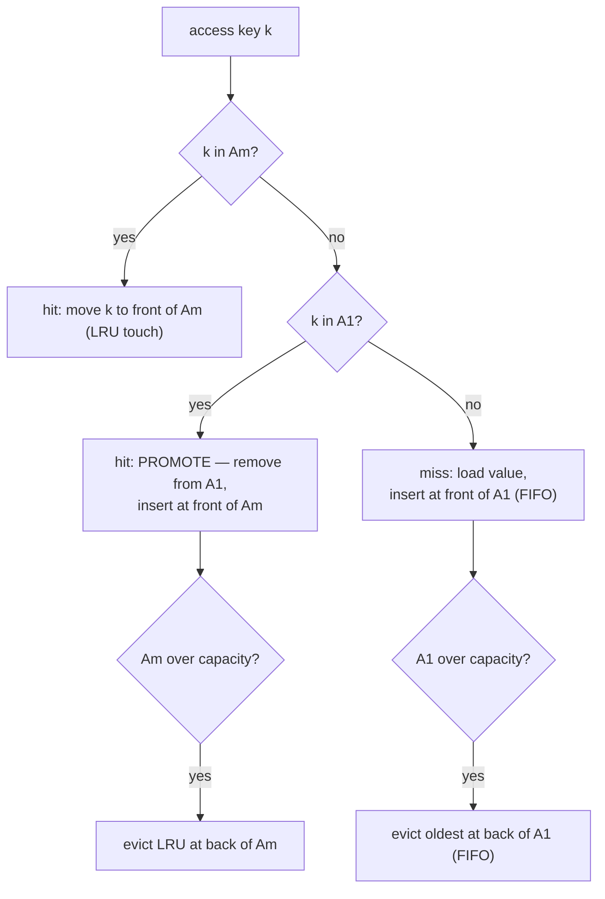

# ARC and 2Q Adaptive Caches — Junior Level

## Table of Contents

1. [Introduction](#introduction)
2. [Recap: What a Cache Does](#recap-what-a-cache-does)
3. [The Problem: When LRU Fails](#the-problem-when-lru-fails)
   - [Temporal Locality, the Assumption LRU Bets On](#temporal-locality-the-assumption-lru-bets-on)
   - [Scans Destroy an LRU Cache](#scans-destroy-an-lru-cache)
   - [One-Hit Wonders Pollute the Cache](#one-hit-wonders-pollute-the-cache)
4. [The Big Idea: Separate "Seen Once" from "Seen Again"](#the-big-idea-separate-seen-once-from-seen-again)
5. [2Q: The Two-Queue Cache](#2q-the-two-queue-cache)
   - [The Two Queues](#the-two-queues)
   - [Promotion on the Second Access](#promotion-on-the-second-access)
   - [The Rules, Step by Step](#the-rules-step-by-step)
6. [A Small Worked Example](#a-small-worked-example)
7. [Why This Resists Scans](#why-this-resists-scans)
8. [A First Look at ARC](#a-first-look-at-arc)
9. [Operations and Complexity](#operations-and-complexity)
10. [A Minimal 2Q Implementation](#a-minimal-2q-implementation)
    - [Go](#go-implementation)
    - [Java](#java-implementation)
    - [Python](#python-implementation)
11. [Common Mistakes](#common-mistakes)
12. [Summary](#summary)
13. [Next step](#next-step)

---

## Introduction

You already know the [LRU cache](../01-lru-cache/junior.md): a fixed-capacity store that, when full, throws away the item used the longest time ago. LRU is simple, fast, and works well most of the time. But it has a famous weakness — a single pass over a lot of data (a **scan**) can wipe out everything useful the cache was holding. This page is about caches that fix that weakness while staying just as fast.

We will study two of them:

- **2Q** — short for "two queues". It splits the cache into a queue for items you have seen **once** and a queue for items you have seen **more than once**. New items have to *earn* a place in the good queue by being accessed a second time. This single idea makes the cache **scan-resistant**.
- **ARC** — the **Adaptive Replacement Cache**. It is a smarter cousin of 2Q that keeps a little extra bookkeeping and **tunes itself** automatically, shifting its balance between "recently used" and "frequently used" based on the workload it actually sees. We introduce ARC gently here; the [middle level](./middle.md) covers it in full.

By the end of this page you will understand *why* plain LRU breaks on scans, *what* the two-queue idea is, and you will be able to build a small working 2Q cache in Go, Java, and Python.

---

## Recap: What a Cache Does

A **cache** is a small, fast store that holds copies of data so you do not have to recompute or refetch it from a slower source (a disk, a database, a network call).

```
   slow source (disk / DB / network)
        ^
        | on a MISS, fetch it (slow), then store a copy
        |
   +---------+
   |  CACHE  |   small, fast, in memory
   +---------+
        |
        | on a HIT, return instantly (fast)
        v
     your program
```

- **Hit** — the item is already in the cache. Fast.
- **Miss** — the item is not in the cache. You fetch it from the slow source, then usually store it.

Memory is limited, so the cache holds only a fixed number of items, its **capacity**. When the cache is full and a new item arrives, one old item must be removed. The rule deciding *which* item leaves is the **eviction policy** (also called the **replacement policy**). LRU is one such policy. 2Q and ARC are two more — and they are designed to keep a *higher fraction of accesses as hits* (a better **hit ratio**) on the kinds of workloads that trip up LRU.

---

## The Problem: When LRU Fails

### Temporal Locality, the Assumption LRU Bets On

LRU is built on one assumption, called **temporal locality**:

> If you used something recently, you will probably use it again soon.

That assumption is true *a lot* of the time, which is why LRU is everywhere. But it is not *always* true, and when it is false, LRU makes exactly the wrong choices.

### Scans Destroy an LRU Cache

A **scan** is a long, one-time sweep through many items that you will *not* look at again soon — for example, a report that reads every row of a big table once, or a backup job that copies every file. Each item in the scan is touched exactly once.

Here is the disaster. Suppose your cache holds 4 hot items that your application uses constantly: `A B C D`. Now a scan reads new items `1 2 3 4 5 6 ...`, none of which will be used again. Watch what LRU does (front = most recent, back = least recent, capacity 4):

```
start:            [ A B C D ]      (4 hot items, all useful)
scan reads 1:     [ 1 A B C ]      D evicted (it looked "old")
scan reads 2:     [ 2 1 A B ]      C evicted
scan reads 3:     [ 3 2 1 A ]      B evicted
scan reads 4:     [ 4 3 2 1 ]      A evicted  <-- ALL hot items gone!
```

After reading just 4 scan items, **every hot item has been evicted** and replaced by scan items that will never be touched again. The next time the app asks for `A`, `B`, `C`, or `D`, it is a miss. The scan **polluted** the cache with garbage. This is sometimes called **cache pollution** or the **sequential flooding** problem, and it is LRU's single biggest weakness.

### One-Hit Wonders Pollute the Cache

A milder version of the same problem: some keys are accessed exactly once and never again — call them **one-hit wonders**. LRU treats a brand-new key exactly the same as a key that has proven itself useful a thousand times. A flood of one-hit wonders pushes valuable, frequently used keys toward the back and eventually evicts them, even though the one-hit wonders are worthless.

The root cause in both cases is the same: **LRU gives a key full status the instant it is touched once.** It cannot tell the difference between "new and possibly junk" and "proven and valuable".

---

## The Big Idea: Separate "Seen Once" from "Seen Again"

Here is the insight that fixes everything:

> Do not trust a key just because it was accessed **once**. Make it prove itself by being accessed **again**. Treat "seen once" and "seen two or more times" as **two different populations**, and protect the proven population from the unproven one.

Think of it like a probation period. A new key is on probation: it gets a spot, but a *cheap, disposable* spot. Only when it is accessed a **second** time has it shown real, repeated demand — then it is **promoted** into the protected, high-value area.

A scan, by definition, touches each item only once. So scan items stay stuck in the probation area and **never get promoted**. They cycle through the cheap area and disappear, **without ever displacing the proven, valuable keys**. That is scan resistance in one sentence.

This single idea — *separate the recent-once from the frequent* — is the foundation of **2Q**, of **ARC**, and of related policies like **LIRS** and **CLOCK-Pro** that you will meet at the senior level.

---

## 2Q: The Two-Queue Cache

2Q (published by Theodore Johnson and Dennis Shasha in 1994) is the simplest policy built on that idea. We describe the common "simplified 2Q" form, which is what most people mean by 2Q and what you will implement.

### The Two Queues

2Q splits the cache into two lists:

| Queue | Holds | Eviction order | Analogy |
|-------|-------|----------------|---------|
| **A1** (the "in" queue) | Keys seen for the **first time** | **FIFO** (oldest in leaves first) | the probation line |
| **Am** (the "main" queue) | Keys seen **two or more** times | **LRU** (least recently used leaves) | the VIP room |

- **A1** is managed as a **FIFO queue**: items leave in the order they arrived, *regardless* of whether they were touched again while waiting. (A FIFO, not an LRU, on purpose — re-accessing a key in A1 does **not** move it to the front; it promotes it instead.)
- **Am** is managed as a normal **LRU list**: the most recently used key is at the front, the least recently used at the back, and the back is what gets evicted.

```
        A1 (first-timers, FIFO)              Am (proven, LRU)
   newest ---------------> oldest      most-recent --------> least-recent
   [ z ][ y ][ x ][ w ]  ->evict       [ C ][ B ][ A ]  ->evict
```

### Promotion on the Second Access

The whole policy turns on one rule:

> When a key that is **already in A1** is accessed again, **promote it**: remove it from A1 and insert it at the front of Am.

That second access is the proof of repeated demand. First access → A1. Second access → Am. Once in Am, the key is managed by LRU like a normal hot item.

### The Rules, Step by Step

When you `get(key)` or `put(key)`, follow these rules in order:

1. **Key is in Am (already proven):** it is a hit. Move it to the front of Am (normal LRU "touch"). Done.
2. **Key is in A1 (seen once before):** it is a hit. **Promote it** — remove from A1, insert at the front of Am. (If Am is now over capacity, evict the LRU item at the back of Am.) Done.
3. **Key is brand new (a miss):** load its value. Insert it at the front of A1. (If A1 is now over capacity, evict the **oldest** item at the back of A1 — FIFO.) Done.

That is the entire simplified 2Q policy. Three cases, each O(1).



---

## A Small Worked Example

Let us run a 2Q cache where **A1 holds up to 2 keys** and **Am holds up to 2 keys** (total capacity 4). We show both queues after each step. `[]` means empty.

```
op            A1 (FIFO)        Am (LRU)        note
----------------------------------------------------------------
get(A) miss   [A]              []              A is new -> A1
get(B) miss   [B, A]           []              B is new -> A1 (B newest)
get(A) HIT    [B]              [A]             A seen 2nd time -> PROMOTE to Am
get(C) miss   [C, B]           [A]             C new -> A1
get(D) miss   [D, C]           [A]             D new -> A1; A1 was full -> evict B (oldest, FIFO)
get(C) HIT    [D]              [C, A]          C seen 2nd time -> PROMOTE to Am
get(A) HIT    [D]              [A, C]          A in Am -> LRU touch, move to front
```

Notice two things:

- Keys `A` and `C`, each accessed twice, ended up safe in **Am**. They are the proven, valuable keys.
- Key `B`, accessed once and then forgotten, was quietly evicted from A1 by FIFO. It **never touched Am** and never threatened `A` or `C`.

That is exactly the behavior we wanted.

---

## Why This Resists Scans

Now replay the scan disaster from earlier, but with 2Q. Hot keys `A B` have been accessed twice, so they live in **Am**. A scan reads one-time keys `1 2 3 4 5 6 ...`. Each scan key is brand new, so it goes into **A1** (case 3). It is never accessed again, so it is **never promoted** — it just rides the A1 FIFO and falls off the back.

```
start:        A1: [ ]           Am: [ B A ]      (hot keys safe in Am)
scan reads 1: A1: [ 1 ]         Am: [ B A ]
scan reads 2: A1: [ 2 1 ]       Am: [ B A ]
scan reads 3: A1: [ 3 2 ]       Am: [ B A ]      1 fell off A1; Am untouched
scan reads 4: A1: [ 4 3 ]       Am: [ B A ]      2 fell off A1; Am untouched
...
scan ends:    A1: [garbage]     Am: [ B A ]      hot keys STILL THERE
```

The scan churns harmlessly through A1 and **never reaches Am**. When the app asks for `A` or `B` again — **hit**. Compare that to LRU, where the same scan evicted everything. *This* is why 2Q (and ARC) are called **scan-resistant**, and why databases and filesystems prefer them over plain LRU.

| Workload | LRU result | 2Q result |
|----------|------------|-----------|
| Steady hot set, no scans | great | great (essentially equal) |
| Hot set + occasional scan | **disaster** (hot set evicted) | **fine** (scan stays in A1) |
| Flood of one-hit-wonders | **disaster** (pollution) | **fine** (one-hit-wonders never promoted) |

---

## A First Look at ARC

2Q has one annoyance: *how big should A1 be versus Am?* If A1 is too small, genuinely useful new keys get evicted before they are accessed a second time. If A1 is too big, it wastes space that proven keys could use. The best split depends on the workload, and the workload **changes over time**.

**ARC (Adaptive Replacement Cache)**, invented at IBM in 2003 by Nimrod Megiddo and Dharmendra Modha, solves this by **tuning the split automatically**. Its structure is a refinement of the same idea, with four lists instead of two:

| List | Like 2Q's... | Holds |
|------|--------------|-------|
| **T1** | A1 | keys seen **once** (recent) — actual cached data |
| **T2** | Am | keys seen **twice or more** (frequent) — actual cached data |
| **B1** | (new!) | **ghosts**: keys recently evicted from T1 (metadata only, no data) |
| **B2** | (new!) | **ghosts**: keys recently evicted from T2 (metadata only, no data) |

The clever part is the two **ghost lists**, B1 and B2. A ghost remembers a key that was *just* evicted, but stores **only the key, not the value** — so it is cheap. When a brand-new access turns out to be a key that is *in a ghost list*, that is a signal: "I just evicted something I shouldn't have." ARC uses that signal to nudge a tuning knob (a number called **p**) that decides how much room to give recency (T1) versus frequency (T2). A ghost-hit in B1 says "give recency more room"; a ghost-hit in B2 says "give frequency more room". Over time, ARC settles on whatever split the current workload needs — **all by itself**.

Do not worry about the details yet. The takeaway for now:

> ARC = the two-population idea (like 2Q) + ghost lists that let the cache **measure its own mistakes** and **retune itself** automatically.

The full ARC mechanism — the four lists, the ghost hits, and the self-tuning parameter `p` — is the heart of the [middle level](./middle.md).

---

## Glossary

Before the implementation, here are the terms used on this page in one place:

| Term | Meaning |
|------|---------|
| **Cache** | A small fast store holding copies of slower data |
| **Capacity** | The maximum number of items the cache can hold |
| **Eviction policy** | The rule deciding which item to remove when the cache is full |
| **Hit / Miss** | The item is / is not already in the cache |
| **Hit ratio** | `hits / (hits + misses)` — the fraction of accesses served from cache |
| **Temporal locality** | The assumption that recently used items will be used again soon |
| **Scan** | A one-time sweep over many items not reused soon |
| **Cache pollution** | Filling the cache with low-value items (scan items, one-hit-wonders) |
| **One-hit wonder** | A key accessed exactly once and never again |
| **Scan resistance** | The property that a scan does not evict the proven hot set |
| **Promotion** | Moving a key from the "seen once" area to the "proven" area |
| **A1 / Am (2Q)** | First-timers queue (FIFO) / proven queue (LRU) |
| **T1 / T2 (ARC)** | Cached seen-once / seen-twice-plus keys |
| **B1 / B2 (ARC)** | Ghost lists: recently evicted keys (no value) |
| **Ghost hit** | A "miss" on a key still remembered in a ghost list |
| **p (ARC)** | The self-tuning target balancing recency vs frequency |

---

## Pros and Cons

| Pros | Cons |
|------|------|
| Scan-resistant — a one-time flood does not evict the hot set | More moving parts than a single LRU list |
| One-hit-wonders never displace proven keys | 2Q needs an A1/Am split chosen up front |
| Still O(1) for `get` and `put`, like LRU | ARC needs extra ghost memory (keys only) |
| ARC self-tunes — no per-workload configuration | ARC's patent history limited its adoption (senior topic) |
| Higher hit ratio on mixed/real workloads | On pure-locality workloads, no better than plain LRU |

**When to use:** workloads that interleave steady reuse with scans or maintenance jobs (databases, filesystems, storage caches).
**When NOT to use:** a tiny cache, a pure-locality workload with no scans, or when LRU's simplicity matters more than a few points of hit ratio.

---

## Operations and Complexity

Both 2Q and ARC keep every operation O(1), exactly like LRU. They use the same trick: a **hash map** from key to a **list node**, so any key can be found, unlinked, and moved in constant time. The only extra cost is more lists (and, for ARC, the ghost entries).

| Operation | LRU | 2Q | ARC | Notes |
|-----------|-----|----|----|-------|
| `get(key)` | O(1) avg | O(1) avg | O(1) avg | hash map lookup + a few pointer moves |
| `put(key, value)` | O(1) avg | O(1) avg | O(1) avg | same |
| Evict | O(1) | O(1) | O(1) | tail of a list |
| Extra memory | O(capacity) | O(capacity) | O(capacity) + ghosts | ghosts store keys only, not values |

The "average" comes from the hash map (O(1) average, O(n) only on pathological collisions), exactly as with LRU.

---

## A Minimal 2Q Implementation

Below is a small, working **simplified 2Q** cache in each language. To keep the junior version readable we use ordered containers rather than hand-rolled doubly linked lists (the [middle level](./middle.md) shows the explicit linked-list version). The logic follows the three rules exactly.

### Go Implementation

```go
package twoq

import "container/list"

// TwoQ is a simplified 2Q cache.
// A1 = first-time keys (FIFO). Am = proven keys (LRU).
type TwoQ struct {
	a1Cap, amCap int
	a1           *list.List               // FIFO: front = newest
	am           *list.List               // LRU:  front = most recent
	a1Map        map[int]*list.Element     // key -> element in a1
	amMap        map[int]*list.Element     // key -> element in am
	store        map[int]int               // key -> value (data lives here)
}

func New(a1Cap, amCap int) *TwoQ {
	return &TwoQ{
		a1Cap: a1Cap, amCap: amCap,
		a1:    list.New(),
		am:    list.New(),
		a1Map: make(map[int]*list.Element),
		amMap: make(map[int]*list.Element),
		store: make(map[int]int),
	}
}

// Get returns (value, true) on a hit, or (0, false) on a miss.
func (c *TwoQ) Get(key int) (int, bool) {
	// Case 1: already proven, in Am -> LRU touch.
	if el, ok := c.amMap[key]; ok {
		c.am.MoveToFront(el)
		return c.store[key], true
	}
	// Case 2: seen once, in A1 -> PROMOTE to Am.
	if el, ok := c.a1Map[key]; ok {
		c.a1.Remove(el)
		delete(c.a1Map, key)
		c.amMap[key] = c.am.PushFront(key)
		c.evictAmIfNeeded()
		return c.store[key], true
	}
	return 0, false // miss
}

// Put inserts or updates a key.
func (c *TwoQ) Put(key, value int) {
	c.store[key] = value
	// If already known (A1 or Am), reuse Get's promotion/touch logic.
	if _, ok := c.amMap[key]; ok {
		c.am.MoveToFront(c.amMap[key])
		return
	}
	if _, ok := c.a1Map[key]; ok {
		el := c.a1Map[key]
		c.a1.Remove(el)
		delete(c.a1Map, key)
		c.amMap[key] = c.am.PushFront(key)
		c.evictAmIfNeeded()
		return
	}
	// Brand-new key -> A1 (FIFO).
	c.a1Map[key] = c.a1.PushFront(key)
	c.evictA1IfNeeded()
}

func (c *TwoQ) evictA1IfNeeded() {
	if c.a1.Len() > c.a1Cap {
		oldest := c.a1.Back() // FIFO: oldest is at the back
		key := oldest.Value.(int)
		c.a1.Remove(oldest)
		delete(c.a1Map, key)
		delete(c.store, key)
	}
}

func (c *TwoQ) evictAmIfNeeded() {
	if c.am.Len() > c.amCap {
		lru := c.am.Back() // LRU: least recent is at the back
		key := lru.Value.(int)
		c.am.Remove(lru)
		delete(c.amMap, key)
		delete(c.store, key)
	}
}
```

### Java Implementation

```java
import java.util.HashMap;
import java.util.LinkedHashMap;
import java.util.Map;

/** Simplified 2Q cache: A1 (FIFO, first-timers) + Am (LRU, proven). */
public class TwoQCache {
    private final int a1Cap, amCap;
    // A1 in insertion order (FIFO). Am in access order (LRU).
    private final LinkedHashMap<Integer, Integer> a1 =
            new LinkedHashMap<>(16, 0.75f, false); // false = insertion order
    private final LinkedHashMap<Integer, Integer> am =
            new LinkedHashMap<>(16, 0.75f, true);  // true  = access order (LRU)

    public TwoQCache(int a1Cap, int amCap) {
        this.a1Cap = a1Cap;
        this.amCap = amCap;
    }

    /** Returns the value, or null on a miss. */
    public Integer get(int key) {
        // Case 1: proven, in Am -> access-order LinkedHashMap touches it for us.
        if (am.containsKey(key)) {
            return am.get(key); // get() reorders because Am is access-order
        }
        // Case 2: seen once, in A1 -> PROMOTE to Am.
        if (a1.containsKey(key)) {
            int value = a1.remove(key);
            promote(key, value);
            return value;
        }
        return null; // miss
    }

    /** Inserts or updates a key. */
    public void put(int key, int value) {
        if (am.containsKey(key)) {
            am.put(key, value); // update + touch
            return;
        }
        if (a1.containsKey(key)) {
            a1.remove(key);
            promote(key, value);
            return;
        }
        // Brand-new key -> A1 (FIFO).
        a1.put(key, value);
        if (a1.size() > a1Cap) {
            // Evict oldest (first inserted) entry — FIFO.
            Integer oldest = a1.keySet().iterator().next();
            a1.remove(oldest);
        }
    }

    private void promote(int key, int value) {
        am.put(key, value);
        if (am.size() > amCap) {
            // Evict LRU (least recently accessed) — first entry of access-order map.
            Integer lru = am.keySet().iterator().next();
            am.remove(lru);
        }
    }
}
```

### Python Implementation

```python
from collections import OrderedDict


class TwoQCache:
    """Simplified 2Q cache: A1 (FIFO, first-timers) + Am (LRU, proven)."""

    def __init__(self, a1_cap: int, am_cap: int):
        self.a1_cap = a1_cap
        self.am_cap = am_cap
        self.a1: "OrderedDict[int, int]" = OrderedDict()  # FIFO
        self.am: "OrderedDict[int, int]" = OrderedDict()  # LRU

    def get(self, key: int):
        # Case 1: proven, in Am -> LRU touch (move to end = most recent).
        if key in self.am:
            self.am.move_to_end(key)
            return self.am[key]
        # Case 2: seen once, in A1 -> PROMOTE to Am.
        if key in self.a1:
            value = self.a1.pop(key)
            self._promote(key, value)
            return value
        return None  # miss

    def put(self, key: int, value: int) -> None:
        if key in self.am:
            self.am[key] = value
            self.am.move_to_end(key)
            return
        if key in self.a1:
            self.a1.pop(key)
            self._promote(key, value)
            return
        # Brand-new key -> A1 (FIFO).
        self.a1[key] = value
        if len(self.a1) > self.a1_cap:
            self.a1.popitem(last=False)  # evict oldest (FIFO)

    def _promote(self, key: int, value: int) -> None:
        self.am[key] = value
        self.am.move_to_end(key)
        if len(self.am) > self.am_cap:
            self.am.popitem(last=False)  # evict LRU


# Usage:
# c = TwoQCache(a1_cap=2, am_cap=2)
# c.put(1, "A"); c.put(2, "B")
# c.get(1)   # promotes key 1 into Am
```

---

## Visual Animation

> See [`animation.html`](./animation.html) for an interactive visualization of ARC.
>
> The animation lets you:
> - Watch keys flow through **T1, T2, B1, B2** as you access them
> - See the adaptive target **`p`** shift left/right on each **ghost hit**
> - Run a **scan** and watch the hot set in T2 survive untouched
> - Compare ARC against LRU side by side on the same access stream
> - Read a live operation log and a Big-O table

The single most instructive thing to try: load a few hot keys, access each twice so they sit in T2, then press **Scan** and watch `p` and the lists. The hot keys stay put — that is scan resistance you can see.

---

## Cheat Sheet

| What | 2Q | ARC |
|------|----|----|
| Seen-once area | A1 (FIFO) | T1 (LRU) |
| Proven area | Am (LRU) | T2 (LRU) |
| Ghost memory | none (simplified) | B1, B2 (keys only) |
| Promotion trigger | 2nd access | 2nd access |
| Self-tunes? | no | yes, via `p` |
| Config knobs | A1/Am split + size | size only |
| `get` / `put` | O(1) avg | O(1) avg |
| Extra memory | O(capacity) | O(capacity) + ghosts |

Rules of thumb:
- **First access → "seen once" area.** Never trust a single touch.
- **Second access → promote** to the proven area.
- **Scan items are never accessed twice**, so they never reach the proven area.
- **A ghost remembers a key, not its value** — that is why it is cheap.

---

## Common Mistakes

| Mistake | Why it is wrong | Fix |
|---------|-----------------|-----|
| Managing A1 as LRU instead of FIFO | Re-accessing in A1 should **promote**, not refresh; LRU on A1 lets one-time bursts linger | A1 is strictly FIFO; the second access moves the key to **Am** |
| Promoting on the **first** access | Then every scan item lands in the protected area — pollution returns | Promote only on the **second** access (when the key is already in A1) |
| Forgetting to delete evicted keys from the value store | The data map grows forever and leaks memory | On every eviction, delete from the list map **and** the value store |
| Letting a key live in both A1 and Am | Double-counting corrupts the size accounting and eviction | A key is in exactly one of A1/Am at a time; remove from A1 when promoting |
| Confusing 2Q with ARC | 2Q has fixed-size queues; ARC adapts its split with ghost lists | Remember: ghosts + self-tuning `p` = ARC, not 2Q |
| Storing values in the ghost lists (ARC) | Ghosts must be cheap — key/metadata only | Ghost lists hold keys only; the value is dropped on eviction |

---

## Summary

| Concept | Key point |
|---------|-----------|
| **LRU's weakness** | A scan or a flood of one-hit-wonders evicts the whole hot set — *cache pollution* |
| **Root cause** | LRU trusts a key fully after a **single** access |
| **The fix** | Separate "seen once" from "seen 2+ times"; make new keys earn promotion |
| **2Q** | Two queues: **A1** (first-timers, FIFO) + **Am** (proven, LRU) |
| **Promotion** | The **second** access moves a key from A1 to Am |
| **Scan resistance** | Scan items stay in A1, never get promoted, never evict Am |
| **ARC** | 2Q's idea + **ghost lists (B1/B2)** + a self-tuning parameter **p** |
| **Ghost list** | Remembers a recently evicted **key only** (no value), used to detect mistakes |
| **Complexity** | O(1) average `get`/`put`, just like LRU |

You now understand *what* the scan problem is, *why* LRU falls for it, and *how* the two-queue idea (2Q) defeats it — plus a first taste of how ARC takes the idea further with self-tuning. The next level dives into ARC properly: the four lists T1/T2/B1/B2, how a ghost hit moves the adaptive target `p`, and a careful comparison against LRU and [LFU](../21-lfu-cache/middle.md).

---

## Next step

**Next step:** Continue to [`middle.md`](./middle.md) to learn ARC in full — the T1/T2/B1/B2 lists, ghost hits, the self-tuning parameter `p`, formal scan resistance, and how ARC compares with [LRU](../01-lru-cache/middle.md) and [LFU](../21-lfu-cache/middle.md).
