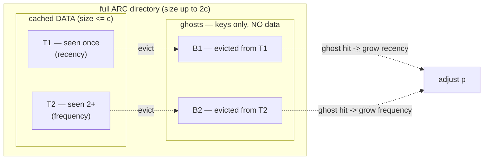
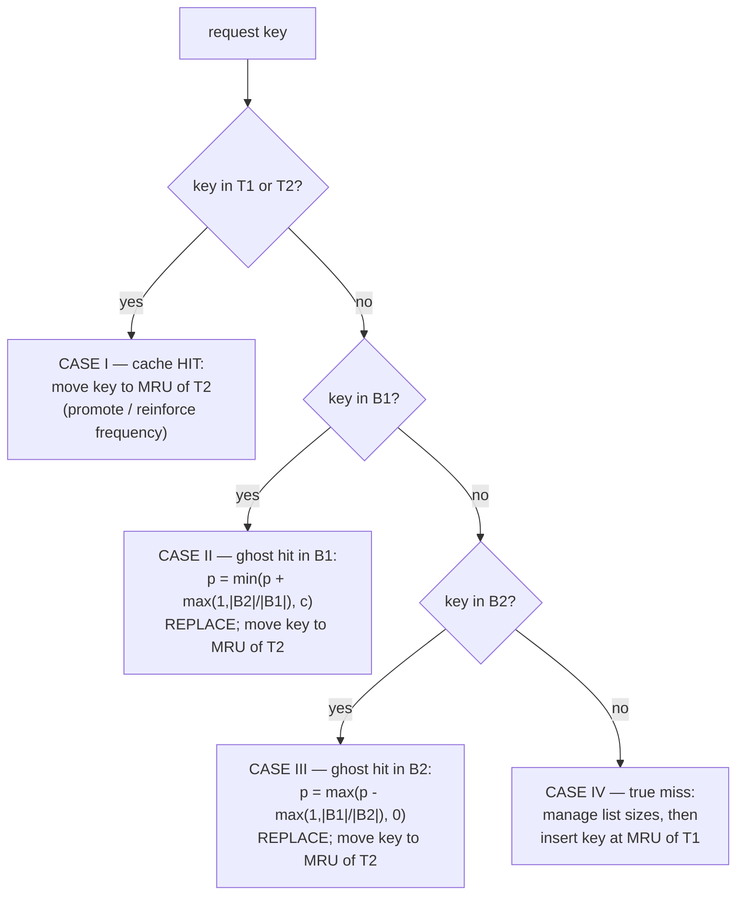
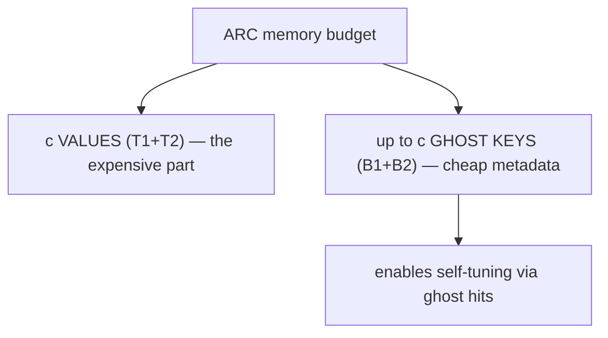

# ARC and 2Q Adaptive Caches — Middle Level

## Table of Contents

1. [Introduction](#introduction)
2. [Why 2Q Is Not Enough: The Tuning Problem](#why-2q-is-not-enough-the-tuning-problem)
3. [ARC's Four Lists](#arcs-four-lists)
   - [T1 and T2 — the Real Cache](#t1-and-t2--the-real-cache)
   - [B1 and B2 — the Ghost Lists](#b1-and-b2--the-ghost-lists)
   - [The Invariants](#the-invariants)
4. [The Adaptive Target p](#the-adaptive-target-p)
   - [What p Means](#what-p-means)
   - [How a Ghost Hit Moves p](#how-a-ghost-hit-moves-p)
5. [The Full ARC Algorithm](#the-full-arc-algorithm)
   - [The Four Cases](#the-four-cases)
   - [The REPLACE Subroutine](#the-replace-subroutine)
   - [Worked Trace](#worked-trace)
6. [Why ARC Is Scan-Resistant and Self-Tuning](#why-arc-is-scan-resistant-and-self-tuning)
7. [ARC vs LRU vs LFU vs 2Q](#arc-vs-lru-vs-lfu-vs-2q)
8. [Full ARC Implementation](#full-arc-implementation)
   - [Go](#go-implementation)
   - [Java](#java-implementation)
   - [Python](#python-implementation)
9. [Performance and Memory Analysis](#performance-and-memory-analysis)
10. [Error Handling and Pitfalls](#error-handling-and-pitfalls)
11. [Best Practices](#best-practices)
12. [Summary](#summary)
13. [Next step](#next-step)

---

## Introduction

> Focus: *Why does ARC work, and when should you choose it over LRU, LFU, or plain 2Q?*

At the [junior level](./junior.md) you learned the core idea behind scan-resistant caches: separate keys that have been **seen once** from keys that have been **seen two or more times**, and protect the proven population. 2Q implements that with two fixed-size queues, A1 and Am.

This page is about **ARC — the Adaptive Replacement Cache** (Megiddo & Modha, IBM, 2003). ARC takes the same two-population idea and adds two things 2Q lacks:

1. **Ghost lists** — cheap metadata-only records of keys that were *just evicted*. They are the cache's memory of its own recent mistakes.
2. **A self-tuning parameter `p`** — a target that continuously rebalances the cache between *recency* and *frequency* based on whether the recent mistakes were recency mistakes or frequency mistakes.

The result is a cache that is **scan-resistant, self-tuning, O(1), and requires no workload-specific configuration** — you give it a size and nothing else. That combination is why ZFS, PostgreSQL-style buffer managers, and many storage systems adopted ARC or ARC-derived policies.

---

## Why 2Q Is Not Enough: The Tuning Problem

2Q works, but it forces you to answer a hard question up front: **how big should A1 be relative to Am?** The original 2Q paper recommends roughly A1 ≈ 25% of cache size, but that is just a heuristic.

- If A1 is **too small**, genuinely useful new keys are evicted from A1 *before* their second access ever arrives. They never get promoted, so the cache underperforms on workloads with longer reuse distances.
- If A1 is **too big**, it steals space from Am that proven hot keys could have used, hurting workloads that are mostly steady reuse.

The catch: **the right split depends on the workload, and the workload changes.** A server might serve steady hot keys in the morning, run a giant scan at noon, and switch to a frequency-skewed pattern at night. Any fixed split is wrong for at least one of those phases.

ARC's answer is to make the split a **variable that the cache adjusts on its own**, in response to evidence about which kind of mistake it is currently making. That variable is `p`.

---

## ARC's Four Lists

ARC maintains **four** doubly linked lists. Call the cache size `c`. The four lists are usually written `T1, T2, B1, B2`.

### T1 and T2 — the Real Cache

These two hold the keys whose **data is actually cached**. Together they hold at most `c` items.

| List | Holds | Order | Role |
|------|-------|-------|------|
| **T1** | keys seen **once** recently | MRU→LRU | recency half (like 2Q's A1) |
| **T2** | keys seen **twice or more** | MRU→LRU | frequency half (like 2Q's Am) |

A key in T1 has been touched once since it entered the cache. The moment it is touched again, it moves to T2 — exactly the "promotion on second access" rule from 2Q. The difference from 2Q is that ARC manages **both** T1 and T2 as LRU lists, and lets the **boundary** between them float.

### B1 and B2 — the Ghost Lists

This is what makes ARC adaptive. When a key is evicted, ARC does not forget it completely. It moves the key (not the value — **the value is dropped**) into a **ghost list**:

| List | Holds | Comes from |
|------|-------|------------|
| **B1** | ghost keys recently evicted from **T1** | the recency half |
| **B2** | ghost keys recently evicted from **T2** | the frequency half |

A ghost stores **only the key/metadata** — a few dozen bytes — so the ghost lists are cheap even though they remember many keys. Their entire purpose is to answer one question when a *miss* arrives:

> "Have I seen this key recently? And if so, did I evict it from the *recency* side (B1) or the *frequency* side (B2)?"

A hit in a ghost list is called a **ghost hit** (or **phantom hit**). It is not a real cache hit — there is no data — but it is a **signal** that ARC evicted something it should have kept. ARC uses the *direction* of that signal to retune.



### The Invariants

ARC maintains these invariants at all times (here `|X|` is the length of list X):

```
I1.  |T1| + |T2| <= c                  (cached data never exceeds cache size)
I2.  |T1| + |B1| <= c                  (recency directory bounded)
I3.  |T1| + |T2| + |B1| + |B2| <= 2c   (total directory bounded)
I4.  T1, T2, B1, B2 are pairwise disjoint (a key is in at most one list)
I5.  if |T1|+|T2| < c then B1 and B2 are empty (don't track ghosts until full)
```

The total directory — data plus ghosts — is at most `2c` keys. That is the memory budget: ARC tracks twice as many *keys* as it caches *values*, but the extra `c` are value-less ghosts.

---

## The Adaptive Target p

### What p Means

`p` is a single integer in the range `[0, c]`. It is the **target size of T1** — the target amount of cache to devote to **recency** (seen-once keys). The rest, `c - p`, is the target for **T2** (frequency).

```
        recency target p              frequency target c - p
   |<--------------------->|<------------------------------------>|
   T1 (seen once)                       T2 (seen 2+)
```

- `p` close to `c` → "trust recency": give most of the cache to first-seen keys.
- `p` close to `0` → "trust frequency": give most of the cache to proven, repeatedly used keys.

ARC starts at `p = 0` (or `c/2` in some descriptions) and moves it continuously. **No human ever sets `p`.** It is driven entirely by ghost hits.

### How a Ghost Hit Moves p

The rule is beautifully symmetric:

> **A hit in B1** means: "I evicted a *recency* key (from T1) too soon — I should have kept more recency." So **increase `p`** (grow T1's target).
>
> **A hit in B2** means: "I evicted a *frequency* key (from T2) too soon — I should have kept more frequency." So **decrease `p`** (shrink T1's target, growing T2's).

The size of the adjustment is also adaptive — it is larger when the *opposite* ghost list is bigger, which dampens oscillation. The exact formulas (from the paper):

```
On a hit in B1 (ghost from recency side):
    delta1 = max(1, |B2| / |B1|)
    p = min(p + delta1, c)

On a hit in B2 (ghost from frequency side):
    delta2 = max(1, |B1| / |B2|)
    p = max(p - delta2, 0)
```

Intuition for the `delta`: if B2 is large relative to B1, it means frequency keys are being evicted a lot, so a B1 ghost hit gets a *bigger* push toward recency to compensate — and vice versa. This keeps `p` responsive without thrashing.

`p` is only a **target**. The actual rebalancing happens lazily in the eviction subroutine (`REPLACE`), which evicts from T1 when T1 is over its target `p`, and from T2 otherwise. So `p` does not move data directly; it biases *which list the next eviction comes from*.

---

## The Full ARC Algorithm

We now state ARC completely. On every request for `key`, exactly one of four cases applies.

### The Four Cases



**Case I — `key` is in T1 or T2 (real cache hit).** Remove it from wherever it is and move it to the **MRU position of T2**. (Whether it came from T1 or T2, a *second-or-later* access belongs in the frequency list.) Return the value.

**Case II — `key` is in B1 (ghost hit, recency side).** This was a recency key we evicted too soon. **Increase `p`**, call `REPLACE` to make room, then fetch the value and insert the key at **MRU of T2** (it has now been seen 2+ times). Remove it from B1.

**Case III — `key` is in B2 (ghost hit, frequency side).** This was a frequency key we evicted too soon. **Decrease `p`**, call `REPLACE`, fetch the value, insert at **MRU of T2**. Remove it from B2.

**Case IV — `key` is in none of the four lists (true miss).** Handle directory bookkeeping (trim ghost lists if they are at their bounds), call `REPLACE` if the data is full, fetch the value, and insert the key at **MRU of T1** (it has only been seen once).

### The REPLACE Subroutine

`REPLACE` is the single place an actual cached value is evicted, and it is where `p` does its work:

```text
REPLACE(key, p):
    if |T1| >= 1 and ( |T1| > p  OR  (key in B2 and |T1| == p) ):
        # T1 is over its recency target -> evict from T1
        victim = LRU of T1
        move victim's KEY to MRU of B1     # becomes a ghost
        drop victim's VALUE
    else:
        # evict from T2
        victim = LRU of T2
        move victim's KEY to MRU of B2     # becomes a ghost
        drop victim's VALUE
```

The condition `|T1| > p` is the whole adaptation: when `p` grew (recency mistakes), T1 is allowed to be bigger, so REPLACE prefers to evict from **T2**; when `p` shrank (frequency mistakes), REPLACE prefers to evict from **T1**. The `key in B2 and |T1| == p` tie-breaker biases toward keeping the frequency side when the incoming key proved itself frequent.

### Worked Trace

Cache size `c = 4`, starting empty, `p = 0`. We show T1, T2, B1, B2 and `p` after each op. The access stream mixes a hot key `A` with a scan `1 2 3 4 5`.

```
op           T1            T2          B1          B2      p   note
-----------------------------------------------------------------------------
get A miss   [A]           []          []          []      0   new -> T1
get A HIT    []            [A]         []          []      0   2nd access -> T2
get 1 miss   [1]           [A]         []          []      0   scan item -> T1
get 2 miss   [2,1]         [A]         []          []      0
get 3 miss   [3,2,1]       [A]         []          []      0
get 4 miss   [4,3,2,1]     [A]         []          []      0   data now full (|T1|+|T2|=5>4? evict)
                                                                REPLACE: |T1|=4>p=0 -> evict 1 -> B1
             [4,3,2]       [A]         [1]         []      0
get 5 miss   [5,4,3]       [A]         [2,1]       []      0   evict 2 -> B1
get A HIT    [5,4,3]       [A]         [2,1]       []      0   A still safe in T2!
```

Key observation: throughout the scan, `A` sat untouched in **T2** and was never threatened, because REPLACE always evicted from the over-full **T1** (the scan items). The hot key survived. If a scan item *had* been re-requested after eviction, it would land in B1 as a ghost hit, nudge `p` up, and ARC would start giving the recency side more room — automatically.

---

## Why ARC Is Scan-Resistant and Self-Tuning

**Scan resistance.** A scan is a flood of brand-new keys, each accessed once. Every one is a Case IV miss → inserted into **T1**. None is accessed twice, so none reaches **T2**. REPLACE keeps evicting the over-full T1, so the scan churns through T1 and never displaces the frequency set in T2. This is the same mechanism as 2Q, but with one bonus: if a scan item *does* get re-requested (so it was not really a one-time scan), the ghost in B1 catches it and ARC adapts. ARC is scan-resistant **without giving up the ability to learn it was wrong**.

**Self-tuning.** The ghost lists turn ARC into a feedback controller:

- Too aggressive on recency? → frequency keys get evicted → B2 ghost hits → `p` decreases → more room for frequency.
- Too aggressive on frequency? → recency keys get evicted → B1 ghost hits → `p` increases → more room for recency.

The system **measures its own eviction mistakes and corrects toward the mix the current workload rewards** — continuously, with no configuration. On a workload that is pure recency, ARC drifts toward behaving like LRU; on a workload that is pure frequency, it drifts toward an LFU-like protection of hot keys. It interpolates between the two extremes online.

---

## ARC vs LRU vs LFU vs 2Q

| Attribute | **LRU** | **LFU** | **2Q** | **ARC** |
|-----------|---------|---------|--------|---------|
| Core signal | recency | frequency (counts) | recency + 1 promotion | recency + frequency, **adaptive** |
| Lists / state | 1 LRU list | counts + heap/buckets | 2 fixed queues (A1,Am) | 4 lists (T1,T2,B1,B2) + `p` |
| Scan-resistant? | **No** | partially (counts protect) | **Yes** | **Yes** |
| One-hit-wonder resistant? | No | Yes | Yes | Yes |
| Self-tuning? | n/a | No (needs aging policy) | **No** (fixed A1 split) | **Yes** (`p` via ghost hits) |
| Config knobs | size | size + aging | size + A1/Am split | **size only** |
| Time / op | O(1) | O(1) with bucket trick | O(1) | O(1) |
| Extra memory | O(c) | O(c) | O(c) | O(c) **data + O(c) ghost keys** |
| Hurts on | scans, one-hit-wonders | sudden popularity shifts (stale counts) | wrong A1 split | small extra memory; patent (see senior) |
| Production use | everywhere (default) | CDNs, content caches | some DB caches | ZFS, storage/DB buffer pools |

**Choose LRU when:** the workload has clean temporal locality and no scans, or you need the absolute simplest thing.
**Choose [LFU](../21-lfu-cache/middle.md) when:** popularity is stable and frequency, not recency, predicts reuse (e.g., a CDN serving a fixed set of viral assets).
**Choose 2Q when:** you want scan resistance with minimal machinery and you can pick a reasonable A1 size for a *stable* workload.
**Choose ARC when:** the workload is **mixed and changing** (steady reuse + periodic scans + shifting hotspots) and you want a cache that tunes itself with no operator input — provided its patent status is acceptable for your system (see [senior level](./senior.md)).

---

## Full ARC Implementation

Here is a complete, working ARC in each language. The data lives in a `store` map; the four lists hold keys (ghost lists hold keys only, with no entry in `store`). We use ordered containers for clarity; the explicit doubly-linked-list version is left to the [professional level](./professional.md).

### Go Implementation

```go
package arc

import "container/list"

// ARC is an Adaptive Replacement Cache of capacity c.
type ARC struct {
	c     int
	p     int                       // adaptive target size of T1
	t1    *list.List                // recent, seen once  (keys)
	t2    *list.List                // frequent, seen 2+   (keys)
	b1    *list.List                // ghosts evicted from T1
	b2    *list.List                // ghosts evicted from T2
	idx   map[int]*entry            // key -> which list + element
	store map[int]int               // key -> value (only for keys in T1/T2)
}

type loc int

const (
	inT1 loc = iota
	inT2
	inB1
	inB2
)

type entry struct {
	where loc
	el    *list.Element
}

func New(c int) *ARC {
	return &ARC{
		c: c, p: 0,
		t1: list.New(), t2: list.New(), b1: list.New(), b2: list.New(),
		idx: make(map[int]*entry), store: make(map[int]int),
	}
}

func (a *ARC) listOf(w loc) *list.List {
	switch w {
	case inT1:
		return a.t1
	case inT2:
		return a.t2
	case inB1:
		return a.b1
	default:
		return a.b2
	}
}

// remove unlinks key from its current list and the index.
func (a *ARC) remove(key int) {
	e := a.idx[key]
	a.listOf(e.where).Remove(e.el)
	delete(a.idx, key)
}

// pushFront inserts key at the MRU of list w.
func (a *ARC) pushFront(key int, w loc) {
	a.idx[key] = &entry{where: w, el: a.listOf(w).PushFront(key)}
}

// Get returns (value, true) on a real hit; loader supplies misses.
func (a *ARC) Get(key int, loader func(int) int) int {
	e, known := a.idx[key]

	// CASE I: real hit in T1 or T2 -> move to MRU of T2.
	if known && (e.where == inT1 || e.where == inT2) {
		val := a.store[key]
		a.remove(key)
		a.pushFront(key, inT2)
		return val
	}

	// CASE II: ghost hit in B1 -> grow recency.
	if known && e.where == inB1 {
		d := max(1, a.b2.Len()/maxInt(1, a.b1.Len()))
		a.p = minInt(a.p+d, a.c)
		a.replace(key)
		a.remove(key) // remove ghost
		val := loader(key)
		a.store[key] = val
		a.pushFront(key, inT2)
		return val
	}

	// CASE III: ghost hit in B2 -> grow frequency.
	if known && e.where == inB2 {
		d := max(1, a.b1.Len()/maxInt(1, a.b2.Len()))
		a.p = maxInt(a.p-d, 0)
		a.replace(key)
		a.remove(key)
		val := loader(key)
		a.store[key] = val
		a.pushFront(key, inT2)
		return val
	}

	// CASE IV: true miss.
	if a.t1.Len()+a.b1.Len() == a.c {
		if a.t1.Len() < a.c { // B1 has room to trim
			a.removeLRU(a.b1)
			a.replace(key)
		} else { // B1 empty, T1 full -> drop LRU of T1 entirely
			lru := a.t1.Back().Value.(int)
			a.remove(lru)
			delete(a.store, lru)
		}
	} else if total := a.t1.Len() + a.t2.Len() + a.b1.Len() + a.b2.Len(); total >= a.c {
		if total >= 2*a.c {
			a.removeLRU(a.b2)
		}
		a.replace(key)
	}
	val := loader(key)
	a.store[key] = val
	a.pushFront(key, inT1)
	return val
}

// replace evicts one cached value, demoting its key to the matching ghost list.
func (a *ARC) replace(incoming int) {
	inB2 := false
	if e, ok := a.idx[incoming]; ok && e.where == inB2 {
		inB2 = true
	}
	if a.t1.Len() >= 1 && (a.t1.Len() > a.p || (inB2 && a.t1.Len() == a.p)) {
		victim := a.t1.Back().Value.(int)
		a.remove(victim)
		delete(a.store, victim)
		a.pushFront(victim, inB1) // becomes ghost
	} else {
		victim := a.t2.Back().Value.(int)
		a.remove(victim)
		delete(a.store, victim)
		a.pushFront(victim, inB2) // becomes ghost
	}
}

func (a *ARC) removeLRU(l *list.List) {
	if l.Len() == 0 {
		return
	}
	key := l.Back().Value.(int)
	a.remove(key)
}

func minInt(a, b int) int { if a < b { return a }; return b }
func maxInt(a, b int) int { if a > b { return a }; return b }
func max(a, b int) int    { if a > b { return a }; return b }
```

### Java Implementation

```java
import java.util.HashMap;
import java.util.LinkedHashSet;
import java.util.Map;
import java.util.function.IntUnaryOperator;

/** Adaptive Replacement Cache (ARC) of capacity c. */
public class ARCCache {
    private final int c;
    private int p = 0; // adaptive target size of T1

    // Each list is an ordered set: iteration order = LRU(first) .. MRU(last).
    private final LinkedHashSet<Integer> t1 = new LinkedHashSet<>(); // recent
    private final LinkedHashSet<Integer> t2 = new LinkedHashSet<>(); // frequent
    private final LinkedHashSet<Integer> b1 = new LinkedHashSet<>(); // ghost(T1)
    private final LinkedHashSet<Integer> b2 = new LinkedHashSet<>(); // ghost(T2)
    private final Map<Integer, Integer> store = new HashMap<>();     // key -> value

    public ARCCache(int c) { this.c = c; }

    private void touchMRU(LinkedHashSet<Integer> set, int key) {
        set.remove(key);
        set.add(key); // re-add => moves to MRU (end)
    }
    private int lru(LinkedHashSet<Integer> set) { return set.iterator().next(); }

    public int get(int key, IntUnaryOperator loader) {
        // CASE I: real hit -> move to MRU of T2.
        if (t1.contains(key) || t2.contains(key)) {
            t1.remove(key); t2.remove(key);
            t2.add(key);
            return store.get(key);
        }
        // CASE II: ghost hit in B1 -> grow recency.
        if (b1.contains(key)) {
            int delta = Math.max(1, b2.size() / Math.max(1, b1.size()));
            p = Math.min(p + delta, c);
            replace(key);
            b1.remove(key);
            int val = loader.applyAsInt(key);
            store.put(key, val); t2.add(key);
            return val;
        }
        // CASE III: ghost hit in B2 -> grow frequency.
        if (b2.contains(key)) {
            int delta = Math.max(1, b1.size() / Math.max(1, b2.size()));
            p = Math.max(p - delta, 0);
            replace(key);
            b2.remove(key);
            int val = loader.applyAsInt(key);
            store.put(key, val); t2.add(key);
            return val;
        }
        // CASE IV: true miss.
        if (t1.size() + b1.size() == c) {
            if (t1.size() < c) { b1.remove(lru(b1)); replace(key); }
            else { int v = lru(t1); t1.remove(v); store.remove(v); }
        } else if (t1.size() + t2.size() + b1.size() + b2.size() >= c) {
            if (t1.size() + t2.size() + b1.size() + b2.size() >= 2 * c) b2.remove(lru(b2));
            replace(key);
        }
        int val = loader.applyAsInt(key);
        store.put(key, val); t1.add(key);
        return val;
    }

    private void replace(int incoming) {
        boolean inB2 = b2.contains(incoming);
        if (!t1.isEmpty() && (t1.size() > p || (inB2 && t1.size() == p))) {
            int victim = lru(t1);
            t1.remove(victim); store.remove(victim);
            b1.add(victim); // becomes ghost
        } else {
            int victim = lru(t2);
            t2.remove(victim); store.remove(victim);
            b2.add(victim); // becomes ghost
        }
    }
}
```

### Python Implementation

```python
from collections import OrderedDict


class ARCCache:
    """Adaptive Replacement Cache of capacity c."""

    def __init__(self, c: int):
        self.c = c
        self.p = 0  # adaptive target size of T1
        # OrderedDicts as ordered sets: first = LRU, last = MRU.
        self.t1: "OrderedDict[int, None]" = OrderedDict()  # recent
        self.t2: "OrderedDict[int, None]" = OrderedDict()  # frequent
        self.b1: "OrderedDict[int, None]" = OrderedDict()  # ghost(T1)
        self.b2: "OrderedDict[int, None]" = OrderedDict()  # ghost(T2)
        self.store: dict[int, int] = {}                    # key -> value

    @staticmethod
    def _lru(od: "OrderedDict[int, None]") -> int:
        return next(iter(od))

    def get(self, key: int, loader) -> int:
        # CASE I: real hit -> move to MRU of T2.
        if key in self.t1 or key in self.t2:
            self.t1.pop(key, None)
            self.t2.pop(key, None)
            self.t2[key] = None
            return self.store[key]

        # CASE II: ghost hit in B1 -> grow recency.
        if key in self.b1:
            delta = max(1, len(self.b2) // max(1, len(self.b1)))
            self.p = min(self.p + delta, self.c)
            self._replace(key)
            self.b1.pop(key, None)
            val = loader(key)
            self.store[key] = val
            self.t2[key] = None
            return val

        # CASE III: ghost hit in B2 -> grow frequency.
        if key in self.b2:
            delta = max(1, len(self.b1) // max(1, len(self.b2)))
            self.p = max(self.p - delta, 0)
            self._replace(key)
            self.b2.pop(key, None)
            val = loader(key)
            self.store[key] = val
            self.t2[key] = None
            return val

        # CASE IV: true miss.
        if len(self.t1) + len(self.b1) == self.c:
            if len(self.t1) < self.c:
                self.b1.pop(self._lru(self.b1), None)
                self._replace(key)
            else:
                victim = self._lru(self.t1)
                self.t1.pop(victim, None)
                self.store.pop(victim, None)
        elif len(self.t1) + len(self.t2) + len(self.b1) + len(self.b2) >= self.c:
            if len(self.t1) + len(self.t2) + len(self.b1) + len(self.b2) >= 2 * self.c:
                self.b2.pop(self._lru(self.b2), None)
            self._replace(key)

        val = loader(key)
        self.store[key] = val
        self.t1[key] = None
        return val

    def _replace(self, incoming: int) -> None:
        in_b2 = incoming in self.b2
        if self.t1 and (len(self.t1) > self.p or (in_b2 and len(self.t1) == self.p)):
            victim = self._lru(self.t1)
            self.t1.pop(victim, None)
            self.store.pop(victim, None)
            self.b1[victim] = None  # ghost
        else:
            victim = self._lru(self.t2)
            self.t2.pop(victim, None)
            self.store.pop(victim, None)
            self.b2[victim] = None  # ghost


# Usage:
# arc = ARCCache(4)
# arc.get(1, loader=lambda k: k * 10)
```

---

## Performance and Memory Analysis

| Aspect | Value | Why |
|--------|-------|-----|
| `get` / `put` time | O(1) average | hash-map lookup + constant pointer moves per list |
| `REPLACE` time | O(1) | evict one LRU tail, push one ghost front |
| `p` update | O(1) | two integer ops |
| Data memory | O(c) values | T1 + T2 hold at most `c` values |
| Ghost memory | O(c) keys | B1 + B2 hold at most `c` value-less keys |
| Total directory | up to 2c keys | invariant I3 |

The **only** material cost over LRU is the ghost directory: ARC tracks up to `2c` keys but caches only `c` values. For small fixed-size keys (e.g., 8-byte block numbers in ZFS) the ghost overhead is tiny — a few percent of the data size. For large keys (long URLs), bound the ghost lists or hash the keys.



---

## Error Handling and Pitfalls

| Scenario | What goes wrong | Correct approach |
|----------|-----------------|------------------|
| Ghost list stores values | Memory doubles; defeats the point | Ghosts hold **keys only**; drop the value on eviction |
| Forgetting to clamp `p` to `[0, c]` | `p` drifts out of range; REPLACE misbehaves | `p = min(p + d, c)` and `p = max(p - d, 0)` |
| `delta` divides by zero | Empty ghost list in the denominator | `max(1, |B2| / max(1, |B1|))` |
| Promoting on first access | Scan items reach T2; scan resistance lost | First access → T1; only Case I/II/III put a key in T2 |
| Not removing ghost on its hit | Key lingers in B1/B2 and in T2 simultaneously | On Cases II/III, remove the key from the ghost list |
| Re-tuning on a real hit (Case I) | `p` should only move on **ghost** hits | Adjust `p` in Cases II and III only |
| Unbounded ghost lists with huge keys | Directory memory blows up | Cap ghost size or hash large keys to fixed-size tokens |

---

## Best Practices

- **Give ARC only a size.** Resist adding knobs; the absence of tuning is the feature.
- **Account for ghost memory** when you size the cache — budget for up to `2c` directory entries.
- **Measure hit ratio per workload phase**, not just overall — ARC's advantage shows up on *mixed* workloads (steady reuse interleaved with scans).
- **Benchmark against LRU on your real traces.** On clean-locality workloads ARC ≈ LRU; the win appears under scans and shifting hotspots. If your workload never scans, LRU's simplicity may be preferable.
- **Mind the patent** before adopting ARC in a product — this is a senior-level concern covered next; it is the reason some systems ship CLOCK-Pro or LIRS instead.
- **Keep keys small** in the directory; hash large keys so ghosts stay cheap.

---

## Summary

| Concept | Key point |
|---------|-----------|
| **2Q's gap** | Fixed A1/Am split must be guessed and is wrong when the workload shifts |
| **T1 / T2** | Cached data: seen-once (recency) and seen-2+ (frequency) |
| **B1 / B2** | Ghost lists: **keys only** of recently evicted T1 / T2 entries |
| **Ghost hit** | A miss on a key still in B1/B2 — a signal of a recent eviction mistake |
| **`p`** | Adaptive target size of T1; the recency-vs-frequency dial, in `[0, c]` |
| **B1 hit → p↑** | "evicted recency too soon" → give recency more room |
| **B2 hit → p↓** | "evicted frequency too soon" → give frequency more room |
| **REPLACE** | Only place a value is evicted; evicts from T1 if `|T1| > p`, else T2 |
| **Scan resistance** | Scan items live in T1, never reach T2; REPLACE drains T1 |
| **Self-tuning** | Ghost feedback drives `p` to the workload's ideal recency/frequency mix |
| **Cost** | O(1) ops; O(c) data + O(c) ghost keys |

You now understand ARC's full mechanism and how it compares to LRU, LFU, and 2Q. The next level moves into real systems: ARC in **ZFS**, buffer pools, and PostgreSQL's clock-sweep alternative; the **ARC patent** and why it pushed some systems toward **CLOCK-Pro** and **LIRS**; and tuning and hit-ratio behavior under production workloads.

---

## Next step

**Next step:** Continue to [`senior.md`](./senior.md) for ARC in real systems — ZFS ARC, database buffer pools, PostgreSQL's clock-sweep, the ARC patent and its CLOCK-Pro / LIRS alternatives, and hit-ratio tuning under mixed production workloads.
