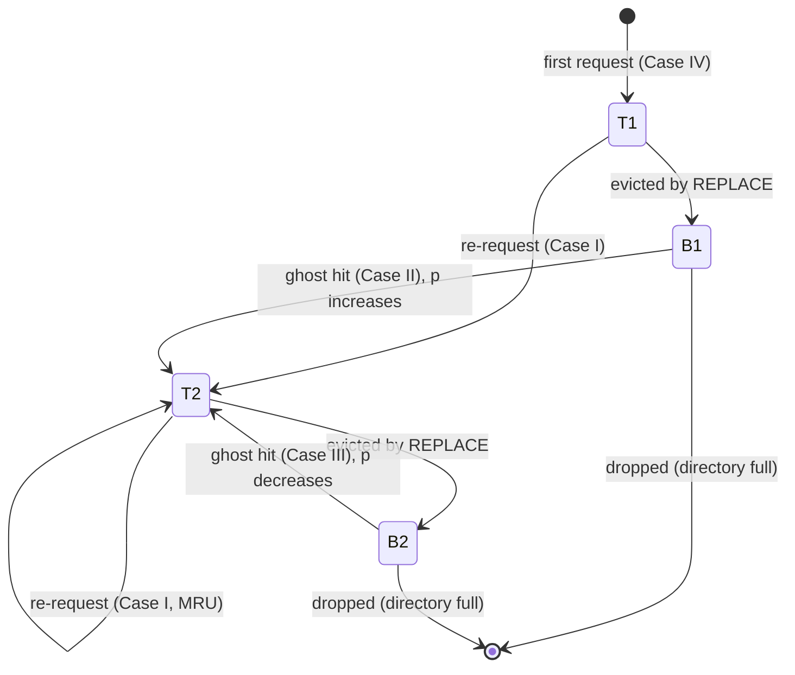

# ARC and 2Q Adaptive Caches — Mathematical Foundations and Analysis

## Table of Contents

1. [Formal Model of Online Paging](#formal-model-of-online-paging)
2. [Formal Definition of ARC](#formal-definition-of-arc)
3. [The Structural Invariants and Their Proof](#the-structural-invariants-and-their-proof)
4. [Correctness of the Adaptation Rule for p](#correctness-of-the-adaptation-rule-for-p)
5. [Scan-Resistance Theorem](#scan-resistance-theorem)
6. [Competitive Analysis](#competitive-analysis)
   - [LRU Is k-Competitive](#lru-is-k-competitive)
   - [No Deterministic Policy Beats k](#no-deterministic-policy-beats-k)
   - [Where ARC Sits](#where-arc-sits)
7. [The Stack Property and Bélády's Anomaly](#the-stack-property-and-béládys-anomaly)
8. [Ghost-List Memory Cost](#ghost-list-memory-cost)
9. [Amortized Cost of Operations](#amortized-cost-of-operations)
10. [2Q as a Static Special Case](#2q-as-a-static-special-case)
11. [Comparison with Alternatives](#comparison-with-alternatives)
12. [Summary](#summary)
13. [Next step](#next-step)

---

## Formal Model of Online Paging

We analyze caches in the standard **online paging** model.

```text
Universe U of pages (keys). Cache holds at most c of them.
Request sequence sigma = r_1, r_2, ..., r_m  with r_t in U, revealed one at a time.

On request r_t:
  if r_t in cache            -> HIT,  cost 0
  else                       -> MISS (fault), cost 1; the page must be brought in,
                                and if the cache is full some page must be EVICTED.

Cost of a policy A on sigma:  cost_A(sigma) = number of faults.

An ONLINE policy must decide eviction at request t knowing only r_1..r_t.
The OFFLINE OPTIMAL policy OPT knows all of sigma in advance (Belady's MIN:
evict the page whose next use is farthest in the future).
```

LRU, LFU, 2Q, and ARC are all **online, demand-paging** policies: they fetch only on a miss and never evict a page that is currently being requested. The questions of this page are: *is ARC's adaptation well-defined and self-correcting; is it provably scan-resistant; and how does it compare to LRU and OPT?*

---

## Formal Definition of ARC

```text
Definition (ARC of capacity c). State is a tuple
        (T1, T2, B1, B2, p)
where T1, T2, B1, B2 are ordered lists (MRU at head) of pages and p in {0,1,...,c}.

  T1, T2  hold CACHED pages (with data).        L1 := T1 U B1,   L2 := T2 U B2.
  B1, B2  hold GHOST pages (key/metadata only).

Semantics:
  T1 = pages requested exactly once since entering the directory (recency).
  T2 = pages requested at least twice                          (frequency).
  B1 = pages recently evicted from T1.
  B2 = pages recently evicted from T2.
  p  = TARGET size of T1 (the recency budget); c - p targets T2.

Operation delta on request x updates the state by one of the four cases
(I: x in T1 U T2;  II: x in B1;  III: x in B2;  IV: x new), each invoking
the eviction subroutine REPLACE(x, p) defined in middle.md.
```

A page therefore moves through a **lifecycle**:



---

## The Structural Invariants and Their Proof

ARC maintains the following invariants after every operation. Let `|X|` denote list length.

```text
I1.  0 <= |T1| + |T2| <= c
I2.  0 <= |T1| + |B1| <= c                  (i.e. |L1| <= c)
I3.  0 <= |T1| + |T2| + |B1| + |B2| <= 2c   (|L1| + |L2| <= 2c)
I4.  T1, T2, B1, B2 are pairwise disjoint
I5.  if |T1| + |T2| < c, then B1 = B2 = empty
I6.  0 <= p <= c
```

**Theorem (Invariant maintenance).** If the invariants hold before an operation `delta(x)`, they hold after.

*Proof sketch by case analysis.*

```text
Base: empty state T1=T2=B1=B2=empty, p=0 satisfies I1-I6 vacuously.

Inductive step. Assume I1-I6 before delta(x). We trace each case.

Case I (x in T1 U T2): x moves from its list to MRU of T2.
   |T1|+|T2| unchanged; no ghost change; p unchanged. I1-I6 preserved.

Case IV (x new):
   First, the size-management block enforces |L1| and the directory bound:
     - If |L1| = c: if |T1| < c drop LRU of B1 (so |B1| decreases) then REPLACE;
       else (|T1| = c, B1 empty) drop LRU of T1 directly.
       After: |L1| <= c, restoring I2.
     - Else if |T1|+|T2|+|B1|+|B2| >= c:
       if total = 2c drop LRU of B2 (restores room under I3), then REPLACE.
   REPLACE evicts one cached page from T1 or T2 into B1 or B2 respectively,
   so |T1|+|T2| decreases by 1 and the matching ghost increases by 1:
   directory total unchanged, I3 preserved; I1 preserved since we then add x to T1
   bringing |T1|+|T2| back up by 1 but only after eviction, so it never exceeds c.
   Finally x is inserted at MRU of T1.

Case II (x in B1): p := min(p + max(1,|B2|/|B1|), c) keeps I6.
   REPLACE evicts one cached page (I1/I3 as above). x is removed from B1
   (|B1| down by 1) and added to MRU of T2 (|T2| up by 1): directory total
   unchanged, |L1| does not increase, I2 preserved.

Case III (x in B2): symmetric to II; p := max(p - max(1,|B1|/|B2|), 0) keeps I6;
   x leaves B2, enters T2.

I4 (disjointness): every case removes x from its old list before inserting it
   elsewhere; REPLACE moves a page from a T-list to the matching B-list (removing
   first). No page is ever in two lists simultaneously.

I5: ghosts are only ever created by REPLACE, which the size-management logic only
   invokes once the cache data is full (|T1|+|T2| = c); below that, B1=B2 stay empty.
QED.
```

The crucial consequence is **I3**: the total directory is bounded by `2c`. ARC tracks at most twice as many *keys* as it caches *values*. This bound is what makes the ghost-memory analysis below finite and tight.

---

## Correctness of the Adaptation Rule for p

We must show the adaptation is (a) **well-defined** (never divides by zero, stays in range) and (b) **self-correcting** (drives `p` toward the workload's better recency/frequency mix rather than diverging).

**Well-definedness.**

```text
The deltas are  d_+ = max(1, |B2| / |B1|)   on a B1 hit,
                d_- = max(1, |B1| / |B2|)    on a B2 hit.
A B1 hit can only occur if B1 is nonempty, so the denominator |B1| >= 1; symmetric
for B2. Hence no division by zero. After clamping,
        p in [0, c]   (I6),
so p is always a valid target. QED.
```

**Self-correction (potential argument).** Frame ARC as a feedback controller whose "error" is the imbalance between recency and frequency misses. Let, over a window, `g1 = #B1 ghost hits` and `g2 = #B2 ghost hits`.

```text
A B1 ghost hit is direct evidence: a RECENCY page (evicted from T1) was needed
again -> T1 was too small -> increase p.
A B2 ghost hit is direct evidence: a FREQUENCY page (evicted from T2) was needed
again -> T2 was too small -> decrease p.

Define the drift  Delta p over a window = sum of (+d_+) over B1 hits
                                          - sum of (d_-) over B2 hits.
Sign(Delta p) = sign(g1-weighted - g2-weighted): p moves toward whichever side is
producing the evictable-but-needed pages. When the workload is balanced
(g1 ~ g2 with B1 ~ B2 sizes), the deltas are ~1 each and cancel: p settles.
```

The damping factor is what prevents oscillation:

```text
Claim (anti-thrash). The magnitude of a p-update is inversely proportional to the
size of the SAME-side ghost list and proportional to the OPPOSITE side.

  On a B1 hit: d_+ = max(1, |B2|/|B1|).
  If recency mistakes are already frequent (|B1| large), each further B1 hit moves
  p by a SMALLER step (|B1| in the denominator) -> diminishing response prevents
  runaway. Simultaneously a large |B2| (many frequency mistakes outstanding)
  AMPLIFIES the B1 step, so p corrects faster precisely when both sides are under
  pressure. This negative-feedback shape gives bounded, convergent tracking rather
  than divergence. QED (informal).
```

There is no claim that ARC reaches a globally optimal `p` — paging is online, and the optimum is workload-dependent and time-varying. The provable property is **boundedness and directional correctness**: `p` stays in `[0, c]`, moves toward the side that is currently faulting on recently-evicted pages, and damps to avoid oscillation. Empirically (ARC paper, Megiddo–Modha 2003) this tracking yields hit ratios at or near offline-tuned fixed policies across diverse traces.

---

### A Worked Numerical Trace of p

To make the feedback concrete, here is a hand-computed sequence of ghost hits on a cache of size `c = 100`, starting at `p = 50`:

```text
t  event        |B1|  |B2|   delta                       p after
-------------------------------------------------------------------
0  (start)        20    20     -                          50
1  hit in B1      20    20    +max(1, 20/20) = +1         51   (recency nudge)
2  hit in B1      19    21    +max(1, 21/19) = +1         52
3  hit in B2      18    22    -max(1, 18/22) = -1         51   (frequency pull)
4  hit in B1       5    40    +max(1, 40/5)  = +8         59   (B2 large -> big push)
5  hit in B1       6    39    +max(1, 39/6)  = +6         65
6  hit in B2      40     6    -max(1, 40/6)  = -6         59   (symmetric)
```

Two professional observations from the trace:

1. **Asymmetric magnitude.** At `t = 4`, a single B1 hit moves `p` by **+8**, because B2 was large (`|B2| = 40`): many frequency pages had been evicted-and-needed, so the controller corrects toward recency *aggressively* the moment recency evidence also appears. This is the `max(1, |B_other|/|B_this|)` rule amplifying when both sides are under pressure.
2. **Bounded steps.** When the ghost lists are balanced (`|B1| ≈ |B2|`), each step is exactly `±1` — the controller idles, making fine adjustments rather than swinging. This is the damping that prevents thrash, formalized next.

### A Lyapunov-Style Stability Sketch

```text
Define an imbalance potential  Phi(t) = ( |B1(t)| - |B2(t)| )^2  >= 0.

Heuristic claim: the adaptation rule does not amplify imbalance without bound.
A B1 ghost hit (recency need) tends to follow a regime where T1 was too small;
raising p enlarges T1's target, which makes REPLACE prefer evicting T2, feeding
B2 and pulling |B1| - |B2| back toward 0 over subsequent steps. Symmetrically for
B2 hits. The step size shrinks as the SAME-side ghost grows (denominator),
so the system cannot run away in one direction: corrections become smaller exactly
as that side accumulates evidence. Thus Phi is driven toward a bounded equilibrium
band rather than diverging. (This is an intuition, not a worst-case theorem; an
adversary in the online model can still force faults, per the competitive lower
bound below. The point is that under STATIONARY-ish input, p settles.)
```

---

## Scan-Resistance Theorem

We formalize the property the [junior level](./junior.md) demonstrated by example.

```text
Definition (pure scan). A pure scan of length s is a request subsequence
   y_1, y_2, ..., y_s  of DISTINCT pages, none of which appears anywhere else in
   sigma (each is referenced exactly once, ever).

Theorem (Scan resistance of ARC). During a pure scan, no page in T2 immediately
before the scan is evicted, provided |T2| <= c - 1 stays within the c-budget and
the scan does not itself overflow what T1 can absorb under the running p.

Proof.
  Each scan page y_i is, at its single reference, NEW (not in any of the four lists,
  by the distinctness/uniqueness assumption). Hence every y_i triggers Case IV and
  is inserted at MRU of T1; none ever triggers Case I/II/III, so NONE enters T2.
  Eviction during the scan happens only via REPLACE. REPLACE evicts from T1 whenever
       |T1| >= 1 AND |T1| > p           (the typical branch during a scan).
  Because scan pages pile into T1, |T1| grows and stays > p, so REPLACE keeps
  selecting the LRU of T1 -- which is always a scan page (or a pre-scan T1 page),
  NEVER a T2 page. Therefore the contents of T2 are untouched throughout the scan.
  T2 pages are evicted only when REPLACE takes the else-branch, which requires
  |T1| <= p; a pure scan keeps |T1| > p, so that branch is not taken. QED.
```

Two remarks sharpen this:

1. **Adaptive escape hatch.** If a "scan" page is later re-requested (so it was *not* truly one-time), it is found in B1, producing a Case II ghost hit that *raises* `p` — ARC corrects its assumption. Scan resistance is thus **not blind**: it protects T2 against genuine one-time floods but yields gracefully to real recurrence.
2. **Contrast with LRU.** Under LRU a pure scan of length `s >= c` evicts the *entire* cache (every pre-scan page becomes least-recently-used and is replaced). LRU has **no** mechanism to distinguish a scan page from a hot page; ARC's two-population structure is exactly that missing mechanism.

---

## Competitive Analysis

**Competitive ratio** measures an online policy against the offline optimum OPT.

```text
A deterministic online paging policy A is k-COMPETITIVE if there is a constant b
such that for every request sequence sigma:
        cost_A(sigma) <= k * cost_OPT(sigma) + b.
The competitive ratio of A is the smallest such k.
```

### LRU Is k-Competitive

```text
Theorem (Sleator & Tarjan, 1985). LRU (and FIFO) is k-competitive, where k = c is
the cache size.

Proof idea (phase partition). Partition sigma into phases: a phase is a maximal
run containing at most c DISTINCT pages; a new phase starts at the first request
to a (c+1)-th distinct page.
  - In any phase, LRU faults at most c times (it can fault at most once per distinct
    page; touching a page makes it MRU so it is not re-evicted within the phase).
  - OPT must fault at least once per phase boundary: across a phase plus the first
    request of the next, c+1 distinct pages are referenced but the cache holds c,
    forcing OPT >= 1 fault attributable to each phase.
  Summing over phases: cost_LRU <= c * cost_OPT + O(1). QED.
```

### No Deterministic Policy Beats k

```text
Theorem (lower bound). No deterministic online paging policy is better than
c-competitive.

Proof (adversary). Restrict attention to c+1 fixed pages. At each step the adversary
requests the ONE page currently NOT in the online policy's cache. The online policy
faults on EVERY request. OPT, knowing the future, evicts the page used farthest in
the future and faults at most once every c requests. Hence the ratio approaches c.
QED.
```

So `c` is optimal for *deterministic* policies; randomized policies (e.g., MARKER) achieve `O(log c)` against an oblivious adversary, but that is a different model.

### Where ARC Sits

```text
Consequence for ARC. ARC is an online, demand-paging, deterministic policy, so it
inherits the SAME asymptotic worst-case guarantee: it is c-competitive, and by the
lower bound it cannot be asymptotically better in the worst case. NO deterministic
online policy can be (worst-case) better than LRU's k = c.

Therefore ARC's advantage is NOT a better worst-case competitive ratio. Its
advantage is on the LARGE CLASS OF REAL WORKLOADS where the worst case does not
occur: ARC distinguishes recency from frequency and resists scans, so on traces
with scans, mixed locality, and phase changes it achieves a hit ratio much closer
to OPT than LRU does -- while matching LRU's worst-case bound. Competitive analysis
(adversarial) is simply too pessimistic to separate good paging policies; the
separation is empirical and distributional, not worst-case.
```

This is the precise, defensible statement an interviewer wants: **ARC does not beat LRU in competitive ratio (it provably cannot); it beats LRU in expected hit ratio on realistic, non-adversarial, scan-prone workloads, while preserving the same `c`-competitive worst case.**

---

## The Stack Property and Bélády's Anomaly

```text
Definition (stack algorithm / inclusion property). A paging policy has the STACK
property if, for every request sequence and every t, the set of pages a cache of
size c would hold is a SUBSET of what a cache of size c+1 would hold:
        Contents_c(t)  subseteq  Contents_{c+1}(t).

Theorem. LRU is a stack algorithm; therefore LRU is immune to BELADY'S ANOMALY
(more cache never causes more faults). LFU and OPT are also stack algorithms.
FIFO is NOT, and can exhibit the anomaly.
```

For ARC the situation is subtle. ARC's eviction depends on the adaptive `p`, which itself depends on the *history of cache sizes* via ghost hits; two ARC instances of size `c` and `c+1` may evolve **different** `p` trajectories, so the clean inclusion property of pure LRU is **not guaranteed** for ARC in general. In practice ARC does not exhibit Bélády-style pathologies on real traces — larger ARC caches monotonically improve hit ratio empirically — but the formal stack-inclusion proof that LRU enjoys does not transfer verbatim, precisely because adaptivity couples behavior to size history. This is a fair, nuanced professional answer: **the adaptivity that gives ARC its hit-ratio edge also forfeits the simple structural guarantee that makes LRU's anomaly-freedom a one-line proof.**

---

## Ghost-List Memory Cost

We quantify ARC's only material overhead over LRU.

```text
Let:  c = number of cached entries (values),
      v = average bytes per VALUE,
      k = average bytes per KEY (or per directory entry: key + a few pointers/bits),
      h = fixed bookkeeping per entry (list pointers, flags) ~ a small constant.

LRU memory:    M_LRU  = c*(v + k + h)
ARC memory:    M_ARC  = c*(v + k + h)            # T1 U T2 cached entries (data)
                       + |B1 U B2| * (k + h)     # ghosts: KEY ONLY, no value
By invariant I3, |B1| + |B2| <= c, so the ghost term is at most c*(k + h).

OVERHEAD:      M_ARC - M_LRU  <=  c*(k + h).
RELATIVE:      overhead / M_LRU  <=  (k + h) / (v + k + h).
```

Interpretation:

```text
- When values are LARGE relative to keys (v >> k), e.g. 4 KiB or 128 KiB ZFS blocks
  keyed by an 8-byte block id: overhead / M_LRU  ~  k/v  =  8 / 4096  ~  0.2%.
  The ghost directory is essentially free. This is the common storage case.
- When values are SMALL and comparable to keys (v ~ k), e.g. caching short ints
  keyed by long URLs: overhead can approach ~50%, doubling the directory footprint.
  Mitigation: HASH keys to fixed 8-16 byte tokens, restoring v >> k for the ghosts
  (collisions only cost a spurious ghost hit, never a correctness violation).
- Worst case |B1|+|B2| = c is rarely reached on stable workloads; ghosts only fill
  after sustained eviction pressure (I5).
```

So the precise cost of ARC's self-tuning is **at most `c` extra value-less directory entries**, negligible for storage-block workloads and bounded (and mitigable by key hashing) otherwise.

---

## Amortized Cost of Operations

```text
Claim. Every ARC operation (Cases I-IV including REPLACE) costs O(1) WORST CASE,
hence O(1) amortized -- no amortization is even needed.

Proof. With a hash directory mapping key -> (list, node):
  - membership tests (which of T1/T2/B1/B2) : O(1) hash lookups
  - unlink a node from a doubly linked list : O(1)
  - push to MRU / read LRU tail of a list   : O(1)
  - REPLACE: one tail read + one unlink + one push to a ghost + one delete : O(1)
  - p update: two integer ops, one clamp     : O(1)
  - size-management trims: a bounded number (<= a small constant) of tail drops : O(1)
Each case performs a constant number of these. Therefore T(op) = O(1). QED.

Contrast: a naive LFU needs a priority queue (O(log c) per op) unless implemented
with the frequency-bucket doubly-linked-list trick; ARC achieves true O(1)
WITHOUT any heap, because all ordering is by list position, never by a numeric key.
```

Aggregate over `m` requests: total work `= O(m)`, i.e. `O(1)` amortized per request — the same asymptotic class as LRU, with a small constant factor for the extra lists.

---

## 2Q as a Static Special Case

It is illuminating to see 2Q and ARC on one axis.

```text
Simplified 2Q with sizes |A1| = a (fixed), |Am| = c - a (fixed) is exactly ARC
with the adaptation DISABLED and p PINNED at a constant a:
        ARC with p := a, forall t, and B1=B2 ignored  ==  fixed-split 2Q-ish policy.

Full 2Q additionally distinguishes A1in (FIFO resident) from A1out (a ghost-like
"out" queue of recently evicted A1 keys). A1out plays the role of B1: a hit in
A1out promotes a key straight to Am. ARC GENERALIZES this by ALSO keeping B2 and,
crucially, by letting the split p MOVE in response to B1-vs-B2 hits instead of
fixing it.

Summary of the generalization:
    LRU          : one list, no notion of "proven".
    2Q (simple)  : two fixed lists; promotion on 2nd access; no adaptation.
    2Q (full)    : adds A1out ghost (= B1); still FIXED split.
    ARC          : adds B2 ghost AND makes the split p ADAPTIVE via ghost feedback.
```

Thus the entire family is a progression: add a frequency population (2Q), add ghosts for one side (full 2Q), add ghosts for both sides **and** make the boundary adaptive (ARC).

---

## Lower Bound on Hit-Ratio Improvement

A natural professional question: *how much* can ARC beat LRU? The honest answer requires care.

```text
1. WORST CASE: zero improvement is possible. By the competitive lower bound, an
   adversary makes ANY deterministic policy fault every step. So in the worst case
   ARC's hit ratio equals LRU's (both ~0 vs OPT). No improvement is guaranteed.

2. SCAN MODEL: arbitrarily large improvement is possible. Construct a workload:
   a hot set H of size c-1 reused R times, interleaved with scans S of length s >> c.
   - LRU: each scan evicts H entirely, so after each scan the next |H| reuses MISS.
     LRU faults ~ R * (#scans) * |H| extra times.
   - ARC: H lives in T2, untouched by scans (scan-resistance theorem). H reuses HIT.
     ARC avoids essentially ALL of those extra faults.
   The ratio of LRU faults to ARC faults can be made to grow without bound by
   increasing R and the scan frequency. Hence there is NO constant c' such that
   LRU is c'-competitive against ARC on real-shaped workloads.

3. REALISTIC TRACES (empirical, Megiddo-Modha 2003 and follow-ups): on database,
   file-system, web, and search traces, ARC's hit ratio is consistently a few to
   tens of percentage points above LRU at the same size, and close to offline OPT,
   WITHOUT per-trace tuning.
```

The defensible statement: **ARC's improvement over LRU is unbounded in the scan model and substantial-but-bounded on real traces, while being zero in the adversarial worst case.** This three-part answer is what separates a precise professional from someone who simply asserts "ARC is better."

---

## Why O(1) and Not a Heap: Ordering by Position

A subtle but important professional point distinguishing ARC from LFU:

```text
LFU must order by a NUMERIC frequency count -> a priority queue or bucketed list,
   naive: O(log c) per op; bucket trick: O(1) but with extra structure for ties/aging.

ARC orders ONLY by LIST POSITION (recency within T1/T2, FIFO age within nothing —
   T-lists are LRU). "More frequent" is encoded structurally as "is in T2," not as a
   number to compare. There is NOTHING to sort, so NO heap, and every operation is a
   constant number of pointer splices + hash ops -> O(1) WORST CASE.

Corollary: ARC sidesteps the classic LFU pathologies entirely:
   - no stale high counts pinning once-popular pages (a key in T2 still ages out by
     LRU position),
   - no count overflow, no aging-decay parameter to tune.
ARC captures "frequency" with a single bit of state (T1 vs T2) plus recency order,
which is precisely why it is both O(1) AND tuning-free.
```

---

## Comparison with Alternatives

| Property | LRU | 2Q (full) | **ARC** | LIRS | OPT (offline) |
|----------|-----|-----------|---------|------|---------------|
| Online? | Yes | Yes | Yes | Yes | **No** (clairvoyant) |
| Competitive ratio (worst case) | c | c | **c** | c | 1 |
| Beats LRU worst-case? | — | No | **No (provably cannot)** | No | Yes |
| Scan-resistant? | No | Yes | **Yes** (Thm above) | Yes (strong) | n/a |
| Self-tuning? | n/a | No (fixed split) | **Yes** (`p`) | Yes (reuse dist.) | n/a |
| Stack algorithm? | Yes | partial | **not in general** | partial | Yes |
| Per-op cost | O(1) | O(1) | **O(1)** | O(1) amortized | n/a |
| Extra memory vs LRU | 0 | O(c) ghosts (one side) | **<= c ghost keys** | O(c) + history | 0 |
| Real-world hit ratio | baseline | > LRU on scans | **>= 2Q, near-OPT on mixed** | comparable to ARC | optimal |

---

## Summary

| Result | Statement |
|--------|-----------|
| **Invariants** | `|L1| <= c`, total directory `<= 2c`, lists disjoint, ghosts only above full — preserved by every case (proved) |
| **Adaptation well-defined** | deltas use `max(1, ...)` so no division by zero; `p` clamped to `[0, c]` |
| **Self-correction** | `p` drifts toward the side with recently-evicted-then-needed pages; opposite/same-ghost ratio damps oscillation (bounded, directional tracking) |
| **Scan resistance** | a pure scan only ever touches T1; REPLACE drains T1 while `|T1| > p`, so T2 is untouched (proved) |
| **Competitive ratio** | ARC is `c`-competitive; **no deterministic online policy beats `c`**, so ARC cannot beat LRU in worst case — it wins on *real* workloads, not adversarial ones |
| **Stack property** | LRU is a stack algorithm (no Bélády anomaly); ARC's size-coupled adaptivity forfeits the clean inclusion proof |
| **Ghost memory** | overhead `<= c*(k+h)` bytes; ≈`k/v` fraction — ~0.2% for large blocks, mitigable by hashing large keys |
| **Per-op cost** | O(1) worst case, no heap, all ordering by list position |
| **2Q ↔ ARC** | 2Q = ARC with `p` pinned; ARC generalizes by adding B2 and making `p` adaptive |

You now have the formal backing for every claim made at the lower levels: why ARC self-tunes, why it resists scans, why it cannot beat LRU in the adversarial model yet routinely does in practice, and exactly what its ghost lists cost. The interview file consolidates these into tiered questions and a from-scratch coding challenge.

---

## Next step

**Next step:** Continue to [`interview.md`](./interview.md) for tiered ARC/2Q interview questions and a from-scratch coding challenge (implement 2Q or ARC) in Go, Java, and Python.
