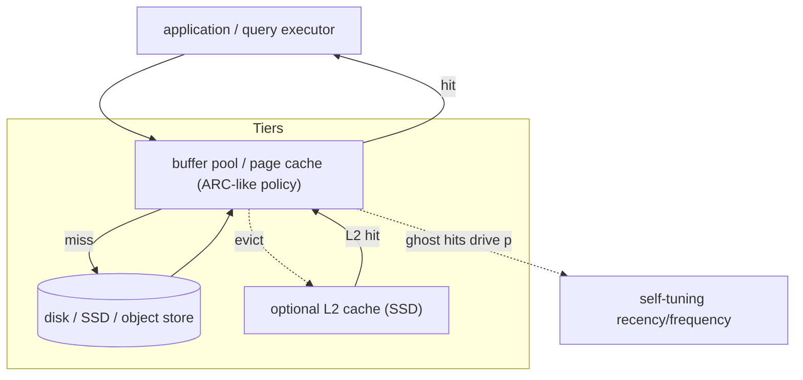
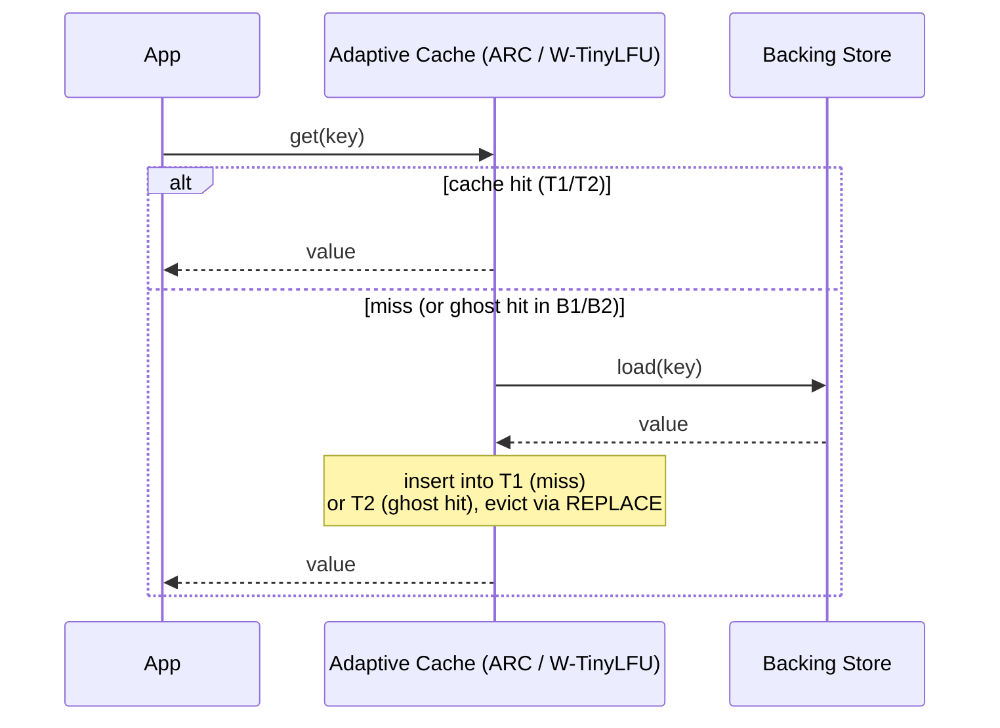
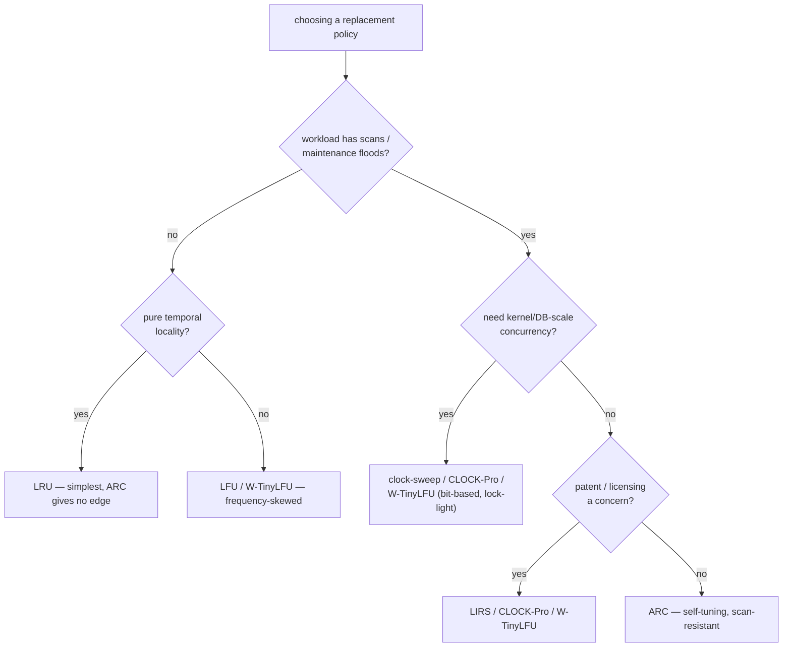

# ARC and 2Q Adaptive Caches — Senior Level

## Table of Contents

1. [Introduction](#introduction)
2. [Where Adaptive Caches Live in a System](#where-adaptive-caches-live-in-a-system)
3. [ZFS ARC: The Canonical Production Deployment](#zfs-arc-the-canonical-production-deployment)
   - [MRU/MFU and the Ghost Lists in ZFS](#mrumfu-and-the-ghost-lists-in-zfs)
   - [The L2ARC Second-Level Cache](#the-l2arc-second-level-cache)
   - [Memory Pressure and Dynamic Resizing](#memory-pressure-and-dynamic-resizing)
4. [Database Buffer Pools](#database-buffer-pools)
   - [PostgreSQL: Clock-Sweep, Not ARC](#postgresql-clock-sweep-not-arc)
   - [Why a Scan-Resistant Ring](#why-a-scan-resistant-ring)
   - [MySQL/InnoDB: Midpoint-Insertion LRU](#mysqlinnodb-midpoint-insertion-lru)
5. [The ARC Patent Problem](#the-arc-patent-problem)
6. [The Alternatives: CLOCK-Pro and LIRS](#the-alternatives-clock-pro-and-lirs)
   - [LIRS](#lirs)
   - [CLOCK-Pro](#clock-pro)
   - [TinyLFU and W-TinyLFU](#tinylfu-and-w-tinylfu)
7. [Comparison Under Production Constraints](#comparison-under-production-constraints)
8. [Concurrency: Making Adaptive Caches Scale](#concurrency-making-adaptive-caches-scale)
9. [Tuning and Hit-Ratio Under Mixed Workloads](#tuning-and-hit-ratio-under-mixed-workloads)
10. [Observability](#observability)
11. [Failure Modes](#failure-modes)
12. [A Concurrent, Sharded ARC Sketch](#a-concurrent-sharded-arc-sketch)
    - [Go](#go-implementation)
    - [Java](#java-implementation)
    - [Python](#python-implementation)
13. [Summary](#summary)
14. [Next step](#next-step)

---

## Introduction

> Focus: *How do you architect, deploy, and operate adaptive caches in real systems — and when do legal and operational constraints push you to an alternative?*

At the [middle level](./middle.md) you learned ARC's mechanism: T1/T2 for cached data, B1/B2 ghost lists, and the self-tuning target `p`. At senior level the questions change. You are no longer asking "how does ARC work?" but "should this storage engine use ARC, 2Q, LIRS, CLOCK-Pro, or W-TinyLFU — given its memory budget, concurrency demands, workload mix, **and the ARC patent**?"

This page walks through the most important real deployment — **ZFS's ARC** — then through **database buffer pools** (where, notably, PostgreSQL chose *not* to use ARC), the **patent history** that shaped those choices, and the modern **alternatives** that deliver ARC-like adaptivity without ARC's machinery or legal baggage.

---

## Where Adaptive Caches Live in a System

Adaptive caches sit on the **read path** between a fast tier and a slow tier, anywhere temporal locality and scans coexist:



The defining property of these layers: the workload is **adversarial to plain LRU**. Full-table scans, backups, analytics jobs, and cold-start ramps all produce one-time floods. A storage system that loses its hot set every time someone runs a report is unacceptable, so scan resistance is non-negotiable — which is exactly why ARC, 2Q, LIRS, and CLOCK-Pro were invented for *this* layer.

---

## ZFS ARC: The Canonical Production Deployment

ZFS (originally Sun, now OpenZFS) is the most famous ARC user, to the point that "the ARC" in ZFS jargon just *means* the in-memory read cache. Sun licensed the ARC idea from IBM and adapted it.

### MRU/MFU and the Ghost Lists in ZFS

ZFS renames ARC's lists to MRU/MFU but the structure is the same:

| ARC paper | ZFS name | Role |
|-----------|----------|------|
| T1 | **MRU** | recently used once — recency half (cached data) |
| T2 | **MFU** | most frequently used — frequency half (cached data) |
| B1 | **MRU ghost** | recently evicted from MRU (headers only) |
| B2 | **MFU ghost** | recently evicted from MFU (headers only) |
| `p` | `arc_p` | adaptive target split between MRU and MFU |

ZFS exposes the live state through kernel statistics. On a running system you can watch `arc_p` move as the workload shifts:

```
# illustrative kstat fields (FreeBSD / illumos / Linux OpenZFS)
kstat.zfs.misc.arcstats.size          # total ARC size in bytes
kstat.zfs.misc.arcstats.p             # arc_p: target MRU size (the adaptive dial)
kstat.zfs.misc.arcstats.mru_ghost_hits
kstat.zfs.misc.arcstats.mfu_ghost_hits
kstat.zfs.misc.arcstats.hits / .misses
```

When `mru_ghost_hits` climbs, `arc_p` rises (give recency more room); when `mfu_ghost_hits` climbs, `arc_p` falls — exactly the B1/B2 feedback from the [middle level](./middle.md), running in a production kernel.

### The L2ARC Second-Level Cache

ZFS adds a tier ARC's paper never described: **L2ARC**, a victim cache on fast SSD/NVMe. Blocks evicted from the in-RAM ARC can be written to L2ARC instead of being dropped, so a later miss in RAM may still hit on SSD rather than going to spinning disk. L2ARC is fed by a background thread that walks the ARC lists and is deliberately scan-aware so a sequential flood does not pollute the SSD tier either. This is a recurring senior-level pattern: a multi-level cache where each level has its own admission and eviction policy.

### Memory Pressure and Dynamic Resizing

Unlike the textbook fixed-`c` ARC, ZFS ARC **resizes its total capacity** dynamically. It grows to use free RAM and shrinks under memory pressure (competing with the page cache and applications), bounded by `arc_min` and `arc_max`. Operators tune those bounds; a classic production incident is ARC growing too large and starving applications, fixed by lowering `arc_max`. So ARC in practice has *two* adaptive dimensions: `arc_p` (recency vs frequency) and total size (cache vs rest of system).

---

## Database Buffer Pools

A database **buffer pool** caches fixed-size disk **pages** in RAM. It is the textbook home for scan-resistant replacement, because OLTP (random, locality-rich) and OLAP/maintenance (sequential scans) share the same pool.

### PostgreSQL: Clock-Sweep, Not ARC

A senior-level fact worth knowing precisely: **PostgreSQL does not use ARC.** It uses **clock-sweep**, an approximate-LRU (second-chance) algorithm. Each buffer has a small `usage_count`. A circular "clock hand" sweeps buffers; on each pass it decrements `usage_count`, and evicts the first buffer it finds at zero. Pages touched between sweeps survive; cold pages decay to zero and get reclaimed.

Why not ARC? Two reasons that are instructive:

1. **The patent.** ARC was patented by IBM (see below). PostgreSQL is BSD-licensed and avoids patented algorithms on principle. In fact, PostgreSQL *did* briefly experiment with an ARC-like "2Q"/ARC scheme (the "ARC" buffer manager appeared around 8.0) and **removed it specifically over patent concerns**, replacing it with clock-sweep. This is the single most-cited real-world consequence of the ARC patent.
2. **Concurrency.** Clock-sweep needs only a lightweight per-buffer counter and a single shared hand; it scales across many cores with minimal locking. Full ARC's four lists plus `p` are harder to make lock-free at buffer-pool scale.

### Why a Scan-Resistant Ring

PostgreSQL adds explicit scan resistance on top of clock-sweep via **buffer ring (ring buffer) strategies**: sequential scans, `VACUUM`, and bulk `COPY` are confined to a small ring of buffers (e.g., 256 KB for a seqscan) so a big scan can only ever evict pages *from its own ring*, never the shared hot set. This is the same goal as 2Q/ARC scan resistance, achieved with a different, simpler mechanism that sidesteps the patent.

### MySQL/InnoDB: Midpoint-Insertion LRU

InnoDB uses yet another scan-resistant trick: a **midpoint-insertion LRU**. The LRU list is split into a "young" (≈5/8) and "old" (≈3/8) sublist. New pages are inserted at the **head of the old** sublist, not the head of the whole list. A page is only promoted to the young sublist if it is accessed *again after a configurable time window* (`innodb_old_blocks_time`). A scan reads each page once, so its pages stay in the old sublist and get evicted without ever reaching the protected young region — structurally identical to 2Q's "earn promotion on a second access."

> Pattern recognition: **2Q, ARC, ZFS MRU/MFU, InnoDB midpoint LRU, and PostgreSQL buffer rings are all the same idea** — protect the proven hot set from one-time scans — implemented with different machinery chosen for each system's licensing and concurrency constraints.

---

## The ARC Patent Problem

ARC is covered by **US Patent 6,996,676** ("System and method for implementing an adaptive replacement cache policy"), assigned to IBM, filed 2002, granted 2006. This is the dominant reason ARC is *less* widespread than its hit-ratio numbers would predict.

Consequences seen in real systems:

- **PostgreSQL** removed its ARC-style buffer manager and shipped clock-sweep instead, citing the patent.
- Many open-source projects deliberately implemented **LIRS or CLOCK-Pro** (both unpatented, academic) to get ARC-like adaptivity legally.
- ZFS could use ARC because **Sun licensed it from IBM**; downstream OpenZFS inherited that.
- The patent has a finite term (US utility patents last 20 years from filing; a 2002 filing expires around 2022–2023 accounting for term adjustments), so the constraint is now largely historical — but a generation of system designs was shaped by it, and you will still meet codebases that chose alternatives for this reason.

The lesson for a senior engineer: **algorithm selection is not purely technical.** Licensing, patents, and implementation complexity legitimately override a few points of hit ratio.

---

## The Alternatives: CLOCK-Pro and LIRS

These two academic policies match or beat ARC on many traces while being unpatented and (for CLOCK-Pro) cheaper to make concurrent.

### LIRS

**LIRS** (Low Inter-reference Recency Set; Jiang & Zhang, 2002) ranks blocks by **reuse distance** — the number of *other distinct blocks* accessed between two references to the same block — rather than plain recency. Blocks with **low** inter-reference recency (LIR) are hot and protected; **high** inter-reference recency (HIR) blocks are cold. Like ARC it keeps metadata for recently evicted blocks (in its "stack") so it can detect when a cold block becomes hot. LIRS is strongly scan-resistant (a scan has huge reuse distances, so it never enters the LIR set) and is used in practice (e.g., it influenced caching in some JVM and database projects). Its weakness is a more complex "stack pruning" operation and trickier concurrency.

### CLOCK-Pro

**CLOCK-Pro** (Jiang, Chen & Zhang, 2005) is **LIRS reimplemented on a CLOCK (second-chance) ring** instead of explicit LRU lists — the same way clock-sweep approximates LRU. It keeps the reuse-distance idea but replaces list manipulation with reference bits and a rotating hand, which is far friendlier to concurrent, low-lock implementations. The Linux kernel's page-cache developers studied CLOCK-Pro closely; production Linux ultimately ships a two-list (active/inactive) **clock-based** scheme that is philosophically in the same family (protect frequently-referenced pages, demote scanned pages). CLOCK-Pro is the usual answer to "I want ARC/LIRS adaptivity but I need clock-level concurrency and no patent."

### TinyLFU and W-TinyLFU

The modern contender is **W-TinyLFU** (Einziger, Friedman & Manes, 2017), the policy behind the **Caffeine** Java cache and Go's **Ristretto**. It uses a small **LRU admission window** in front of a large **SLRU** main region, with admission gated by a **frequency sketch** (a Count-Min Sketch with periodic aging — see [count-min-sketch](../08-count-min-sketch/senior.md)). A candidate evicted from the window is only *admitted* to the main region if its estimated frequency beats the victim it would replace. This achieves ARC-or-better hit ratios with tiny metadata (the sketch is a few bytes per tracked item) and excellent concurrency, and it is unencumbered. For new application-level caches today, W-TinyLFU is often the default choice over ARC.

---

## Comparison Under Production Constraints

| Policy | Scan-resistant | Self-tuning | Concurrency-friendly | Patent-free | Metadata cost | Notable users |
|--------|:--:|:--:|:--:|:--:|---|---|
| LRU | No | n/a | medium | Yes | O(c) | everywhere (default) |
| 2Q | Yes | No (fixed split) | medium | Yes | O(c) | some DB caches |
| **ARC** | Yes | **Yes** (`p`) | hard (4 lists) | **No** (IBM) | O(c) data + O(c) ghosts | **ZFS**, NetApp WAFL |
| LIRS | Yes (strong) | Yes (reuse dist.) | hard (stack) | Yes | O(c)+history | research, some DBs |
| CLOCK-Pro | Yes | Yes | **easy** (clock) | Yes | O(c) + bits | Linux-adjacent designs |
| clock-sweep | via rings | partial | **easy** | Yes | O(1)/page | **PostgreSQL** |
| InnoDB midpoint LRU | Yes | partial | easy | Yes | O(c) | **MySQL/InnoDB** |
| **W-TinyLFU** | Yes | Yes | **easy** | Yes | tiny (sketch) | **Caffeine**, **Ristretto** |

---

## Architecture Pattern: Cache-Aside Around an Adaptive Cache

In practice an adaptive cache rarely stands alone — it sits behind a **cache-aside** (lazy-loading) data path:



The senior subtlety: a **ghost hit is still a backing-store load** (there is no value in a ghost), so ghost hits do *not* reduce backend traffic — their only payoff is *future* hit-ratio improvement via the `p` adjustment. When you measure backend load reduction, count ghost hits as misses; when you measure adaptation health, count them separately. Conflating the two is a common observability mistake.

A second pattern is the **victim cache** (as in L2ARC): instead of dropping an evicted value, push it to a cheaper, larger tier. The eviction path of the primary cache becomes the admission path of the secondary, and each tier runs its own scan-resistant policy.

---

## Distributed and Multi-Node Considerations

| Concern | Single-node ARC | Distributed cache fleet |
|---------|-----------------|-------------------------|
| Key routing | n/a | consistent hashing across nodes (see [HAMT](../25-hash-array-mapped-trie/senior.md)-style or ring) |
| Per-node policy | one ARC | one ARC **per node**, each adapting independently |
| Global adaptivity | exact | approximate — each node sees only its key slice |
| Hot key | one node | can hotspot a single node; mitigate with replication of hot keys |
| Coherence | trivial | invalidation/TTL needed if the backing store changes |

The key insight when scaling out: ARC is a **node-local** policy. A 100-node Memcached/Redis-style fleet runs 100 independent adaptive caches; there is no single global `p`. This is fine — each node adapts to the slice of the keyspace it owns — but it means the fleet's aggregate behavior is the *sum* of independent adapters, not one big adapter. For application-tier caches (Caffeine, Ristretto) the same is true within a process: each instance, or each shard, adapts on its own.

---

## Concurrency: Making Adaptive Caches Scale

A single global lock around ARC kills throughput on a many-core buffer pool. Senior options, in increasing sophistication:

1. **Sharding (striping).** Hash keys into N independent ARC shards, each with its own lock and its own `p`. Simple, near-linear read scaling, and the standard approach for application caches. Cost: each shard adapts `p` independently, so global adaptivity is approximate, and a hot shard can imbalance.
2. **Read-mostly fast path.** Most accesses are hits that only need to *reorder* a list. Techniques like a per-entry "accessed" bit updated lock-free (deferring the actual list move to an amortized maintenance pass) let hits avoid the write lock — this is exactly how Caffeine/Ristretto get their concurrency, and it is why **clock-based** policies (just flip a bit) dominate at kernel scale.
3. **Lock-free / RCU directories.** Hardest; rarely worth it for the lists themselves. More common is an [RCU](../19-rcu/senior.md)-protected hash directory with batched, single-writer policy maintenance.

This is the deepest practical reason PostgreSQL prefers clock-sweep and modern caches prefer W-TinyLFU: **a reference bit is trivially concurrent; four reorderable LRU lists plus a shared `p` are not.**

---

## Tuning and Hit-Ratio Under Mixed Workloads

ARC's selling point is *no tuning of the policy* — but you still tune around it:

- **Total size** is the dominant lever. ARC needs working-set-sized memory to shine; below that, every policy thrashes.
- **Ghost-list size** is fixed at `c` by the algorithm, but if your keys are large you may bound it; smaller ghost history means slower, coarser adaptation.
- **Mixed-workload behavior** is where ARC beats LRU measurably. On the canonical traces from the ARC paper and follow-ups, ARC's hit ratio approaches the offline-optimal and clearly exceeds LRU on database, file-system, and search traces; on pure-locality traces it merely matches LRU. The practical guidance: **the more your workload interleaves scans/maintenance with steady reuse, the bigger ARC's win.**
- **Phase changes** (morning OLTP → noon batch → evening OLAP) are exactly what `p` is for; ARC re-converges within roughly a working-set's worth of accesses after a phase shift.

| Workload shape | LRU hit ratio | ARC hit ratio | Comment |
|----------------|:--:|:--:|---|
| Pure temporal locality | high | ≈ same | no scans to defeat LRU |
| Locality + periodic full scans | **collapses** during scans | stays high | ARC's flagship case |
| Frequency-skewed, stable | medium | higher | `p` drifts toward frequency |
| Shifting hotspots (phases) | lags after each shift | re-converges fast | `p` retracks |

---

## Hit-Ratio Math: What a Few Points Are Worth

Senior reasoning quantifies *why* the policy choice matters, not just that it does.

```text
Let a HIT cost t_hit (e.g. 100 ns, RAM) and a MISS cost t_miss (e.g. 10 ms, disk).
Average access latency = h * t_hit + (1 - h) * t_miss, where h = hit ratio.

At h = 0.90:  avg = 0.90*100ns + 0.10*10ms  ~  1.000 ms
At h = 0.95:  avg = 0.95*100ns + 0.05*10ms  ~  0.500 ms

A 5-point hit-ratio gain HALVED average latency, because the miss is 100,000x the
hit. This non-linearity is why storage engineers fight over a few percent: in the
miss-dominated regime, hit ratio is almost the only thing that matters, and a
scan-resistant policy that prevents the hit ratio from COLLAPSING during scans is
worth far more than its small extra complexity.
```

This is the quantitative backbone of the entire topic: adaptive, scan-resistant caches exist because, when misses are catastrophically expensive, *not losing your hot set to a scan* dominates every other consideration.

---

## Observability

| Metric | Why it matters | Alert / action |
|--------|----------------|----------------|
| `hit_ratio` | the headline efficiency number | drop > X% → investigate workload change or undersizing |
| `arc_p` / target-T1 | shows recency↔frequency balance live | pinned at 0 or c → workload is strongly one-sided |
| `mru_ghost_hits`, `mfu_ghost_hits` | the adaptation signal | spike → policy is mid-correction (expected after a phase change) |
| `evictions/sec` from T1 vs T2 | where pressure falls | all from T1 → scan in progress (healthy); rising T2 evicts → real pressure |
| `cache_size` vs budget | memory contention (esp. ZFS) | near `arc_max` under app pressure → lower the cap |
| `ghost_directory_bytes` | the ARC-specific overhead | unexpectedly large → keys too big, hash them |

---

## TTL, Coherence, and Write Policy

Replacement policy is orthogonal to **freshness**, but production caches must address both:

- **TTL / expiry.** ARC decides *what to evict for space*; TTL decides *what is stale*. They compose: a key can be evicted by REPLACE before its TTL, or expire (and be lazily removed) before it would be evicted. Run TTL as a separate check on `get`; do not entangle it with `p`.
- **Write-through vs write-back.** For a read cache (ZFS ARC, buffer pools) writes go to the store and update or invalidate the cached page; ARC's lists track residency, not dirtiness. A write-back buffer pool layers a separate dirty-page list and flush policy on top of the replacement policy.
- **Invalidation.** When the backing store changes underneath a distributed cache, the replacement policy cannot help — you need explicit invalidation or short TTLs. ARC keeps the *right* keys resident; it does not keep them *fresh*.

The senior takeaway: ARC/2Q answer "which key leaves when we need space," and nothing else. Freshness, durability, and coherence are separate layers you design alongside the policy.

---

## Failure Modes

- **Memory starvation (ZFS classic).** ARC grows to consume RAM apps need. Fix: bound `arc_max`; monitor `cache_size` vs system free memory.
- **Working set > cache.** No policy helps; ARC just thrashes like the rest. Fix: size up, or add an L2 (SSD) tier.
- **Adversarial alternating pattern.** Hand-crafted access streams can push `p` to oscillate; in practice the `delta = max(1, |B_other|/|B_this|)` damping prevents pathological thrash, and real workloads don't behave adversarially.
- **Patent exposure.** Shipping textbook ARC in a commercial product historically risked infringement — the operational "failure" that sent PostgreSQL to clock-sweep. Mitigation: use LIRS/CLOCK-Pro/W-TinyLFU.
- **Lock contention.** A global lock makes ARC a bottleneck under concurrency. Fix: shard, or move to a clock/bit-based policy.
- **Large keys bloating ghosts.** Ghost lists holding long URLs/paths can rival the data footprint. Fix: hash keys to fixed tokens.
- **Cold start after restart.** Ghost lists (and `p`) are in-memory only; a process restart loses all adaptation state and the cache must re-learn the workload. Fix: accept a warm-up period, or persist/replay recent access logs if the SLA demands fast warm-up.
- **Mismatched ghost vs data lifetime.** If you bound ghosts too aggressively, B1/B2 forget evictions before the re-access arrives, so `p` never gets the signal and ARC degrades toward a fixed split. Fix: keep ghosts at least as large as the typical reuse distance you want to detect.

---

## Decision Guide: Which Policy for Which System



Read this as a senior would defend it in a design review:

- **No scans, clean locality** → LRU. Do not add machinery you cannot justify; ARC matches LRU here and costs more memory.
- **Frequency-dominated, stable popularity** → LFU or W-TinyLFU.
- **Scans + need extreme concurrency** → a clock/bit-based policy (clock-sweep, CLOCK-Pro, W-TinyLFU). Reordering four lists under a lock does not scale to a buffer pool serving millions of ops/sec across dozens of cores.
- **Scans + patent matters + moderate concurrency** → LIRS / CLOCK-Pro / W-TinyLFU (all unpatented).
- **Scans + patent acceptable (e.g., you licensed it, like Sun did) + node-local** → ARC.

The recurring senior lesson: the *algorithmically best* hit ratio is only one input. Concurrency model, memory budget, key size, and licensing routinely dominate the decision.

---

## A Concurrent, Sharded ARC Sketch

A production-grade pattern: shard the cache so each shard is an independent ARC behind its own lock. Below, `arcShard` is assumed to wrap the single-threaded ARC from the [middle level](./middle.md).

### Go Implementation

```go
package shardedarc

import (
	"hash/fnv"
	"sync"
)

// shard is one independent ARC behind its own mutex.
type shard struct {
	mu  sync.Mutex
	arc *ARC // the single-threaded ARC from middle.md
}

// ShardedARC fans keys across N independent ARC shards.
type ShardedARC struct {
	shards []*shard
	mask   uint32
}

// New builds 2^bits shards, each sized capacity/numShards.
func New(totalCapacity, bits int) *ShardedARC {
	n := 1 << bits
	s := &ShardedARC{shards: make([]*shard, n), mask: uint32(n - 1)}
	per := totalCapacity / n
	for i := range s.shards {
		s.shards[i] = &shard{arc: NewARC(per)} // assume NewARC exists
	}
	return s
}

func (s *ShardedARC) shardFor(key string) *shard {
	h := fnv.New32a()
	_, _ = h.Write([]byte(key))
	return s.shards[h.Sum32()&s.mask]
}

// Get is safe for concurrent use; each shard adapts its own p.
func (s *ShardedARC) Get(key string, loader func(string) int) int {
	sh := s.shardFor(key)
	sh.mu.Lock()
	defer sh.mu.Unlock()
	return sh.arc.GetStr(key, loader) // string-keyed variant
}
```

### Java Implementation

```java
import java.util.concurrent.locks.ReentrantLock;

/** Sharded ARC: each shard is an independent ARCCache under its own lock. */
public class ShardedARC {
    private final ARCCache[] shards;       // ARCCache from middle.md (string-keyed)
    private final ReentrantLock[] locks;
    private final int mask;

    public ShardedARC(int totalCapacity, int bits) {
        int n = 1 << bits;
        this.mask = n - 1;
        this.shards = new ARCCache[n];
        this.locks = new ReentrantLock[n];
        int per = totalCapacity / n;
        for (int i = 0; i < n; i++) {
            shards[i] = new ARCCache(per);
            locks[i] = new ReentrantLock();
        }
    }

    private int shardIndex(String key) {
        return (key.hashCode() ^ (key.hashCode() >>> 16)) & mask;
    }

    public int get(String key, java.util.function.Function<String, Integer> loader) {
        int i = shardIndex(key);
        locks[i].lock();
        try {
            return shards[i].getStr(key, loader);
        } finally {
            locks[i].unlock();
        }
    }
}
```

### Python Implementation

```python
import threading
from typing import Callable


class ShardedARC:
    """Sharded ARC: each shard is an independent ARCCache under its own lock."""

    def __init__(self, total_capacity: int, num_shards: int = 16):
        per = max(1, total_capacity // num_shards)
        self._shards = [ARCCache(per) for _ in range(num_shards)]   # from middle.md
        self._locks = [threading.Lock() for _ in range(num_shards)]
        self._n = num_shards

    def _index(self, key: str) -> int:
        return hash(key) % self._n

    def get(self, key: str, loader: Callable[[str], int]) -> int:
        i = self._index(key)
        with self._locks[i]:
            return self._shards[i].get_str(key, loader)  # string-keyed variant


# Note: each shard tunes its own p independently. This trades a little
# global-adaptation accuracy for near-linear read concurrency — the standard
# production tradeoff, and why clock/bit-based policies (W-TinyLFU) often win.
```

---

## Capacity Planning Worksheet

A practical senior exercise: size an ARC for a database buffer pool.

```text
Given:
  page size       v = 8 KiB
  key (page id)   k = 8 bytes  +  list/flag overhead h ~ 40 bytes
  RAM budget      M = 16 GiB for the pool

Cached entries that fit (data):
  Each cached page costs v + k + h ~ 8232 bytes.
  Ignoring ghosts first: c ~ M / (v + k + h) ~ 16 GiB / 8232 B ~ 2.04M pages.

Ghost overhead (ARC-specific):
  Up to c ghost entries at (k + h) ~ 48 bytes each = c * 48 B.
  For c ~ 2M: ghost cost ~ 96 MiB  =  ~0.6% of the 16 GiB budget.

Conclusion: ghosts are negligible here (large values, tiny keys), so size the
pool by data alone and reserve <1% for the directory. This is exactly why
storage/DB workloads adopt ARC freely: the self-tuning is nearly free.
```

Contrast with an application cache of small values:

```text
Given: value v = 16 bytes (an int64 + flag), key k = 64 bytes (a URL), h ~ 40 B.
  data per entry      = v + k + h ~ 120 B
  ghost per entry     = k + h     ~ 104 B
  ghost / data        ~ 104 / 120 ~ 87%  (!)

Mitigation: hash the 64-byte URL to an 8-byte token for the ghost directory.
  ghost per entry     -> 8 + 40 = 48 B
  ghost / data        -> 48 / 120 ~ 40%, and only when ghosts are full.
Or: bound the ghost lists to c/4 and accept slightly coarser adaptation.
```

---

## Summary

| Topic | Key point |
|-------|-----------|
| **ZFS ARC** | The flagship deployment; MRU/MFU + ghosts + `arc_p`, plus L2ARC and dynamic sizing |
| **L2ARC** | SSD victim cache below in-RAM ARC; scan-aware feed |
| **PostgreSQL** | Uses **clock-sweep**, *not* ARC — removed its ARC manager over the patent; adds buffer-ring scan resistance |
| **InnoDB** | Midpoint-insertion LRU — 2Q's "earn promotion" idea in another guise |
| **ARC patent** | US 6,996,676 (IBM) drove open systems to alternatives; now largely expired |
| **LIRS** | Reuse-distance ranking; strong scan resistance, unpatented, harder concurrency |
| **CLOCK-Pro** | LIRS on a CLOCK ring — adaptive *and* concurrency-friendly |
| **W-TinyLFU** | Sketch-gated admission (Caffeine/Ristretto); ARC-class hit ratio, tiny metadata, great concurrency — today's default |
| **Concurrency** | Sharding for app caches; bit/clock policies for kernel/DB scale |
| **Tuning** | ARC needs only a *size*; its win grows with how much the workload interleaves scans and reuse |

You can now reason about *which* adaptive cache a given system should use and *why*, weighing hit ratio against concurrency, memory, and licensing. The next level proves the properties we have been asserting: ARC's adaptation correctness and self-tuning, a formal scan-resistance argument, the competitive-ratio comparison against LRU, and the precise ghost-list memory cost.

---

## Next step

**Next step:** Continue to [`professional.md`](./professional.md) for the formal theory — ARC's adaptation/self-tuning correctness, a rigorous scan-resistance argument, competitive analysis versus [LRU](../01-lru-cache/professional.md), and the exact ghost-list memory bound.
