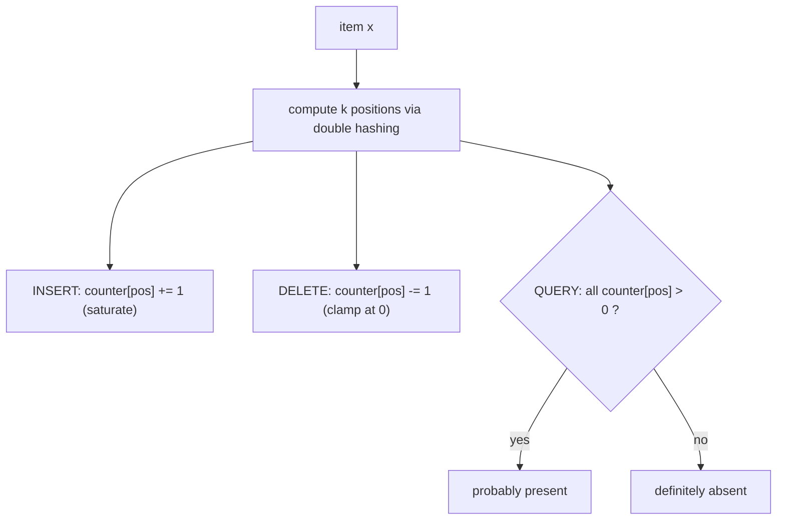

# Counting Bloom Filter — Junior Level

> **One-line summary:** A counting Bloom filter (CBF) is a plain Bloom filter with one change: every slot holds a small **counter** (typically 4 bits) instead of a single bit. To *insert*, hash the item `k` ways and **increment** those `k` counters. To *delete*, hash it the same `k` ways and **decrement** those `k` counters. To *query*, check whether all `k` counters are **greater than zero**. The counter is what gives a CBF the one thing a plain Bloom filter can't do: **delete items** — at roughly **4× the memory**.

---

## Table of Contents

1. [Introduction](#introduction)
2. [Prerequisites](#prerequisites)
3. [Glossary](#glossary)
4. [Core Concepts](#core-concepts)
5. [Big-O Summary](#big-o-summary)
6. [Real-World Analogies](#real-world-analogies)
7. [Pros & Cons](#pros--cons)
8. [Step-by-Step Walkthrough](#step-by-step-walkthrough)
9. [Code Examples](#code-examples)
10. [Coding Patterns](#coding-patterns)
11. [Error Handling](#error-handling)
12. [Performance Tips](#performance-tips)
13. [Best Practices](#best-practices)
14. [Edge Cases & Pitfalls](#edge-cases--pitfalls)
15. [Common Mistakes](#common-mistakes)
16. [Cheat Sheet](#cheat-sheet)
17. [Visual Animation](#visual-animation)
18. [Summary](#summary)
19. [Further Reading](#further-reading)

---

## Introduction

Start with the structure you already know: a **Bloom filter** (sibling topic [`02-bloom-filter`](../02-bloom-filter/junior.md)). It is a tiny **bit array** of `m` bits plus `k` hash functions. To insert an item you set its `k` bits to `1`; to query you check whether all `k` bits are `1`. It answers approximate membership in almost no memory, with **no false negatives** but occasional **false positives**.

The Bloom filter has one glaring limitation: **you cannot delete from it.** Why not? Because bits are *shared*. If `cat` set bit 4 and `dog` also set bit 4, then "removing `cat`" by clearing bit 4 would silently break `dog` — a later query for `dog` would find bit 4 cleared and wrongly answer "absent." That is a **false negative**, and false negatives destroy the filter's one guarantee. So a plain Bloom filter just refuses to delete.

The **counting Bloom filter** fixes exactly this. Instead of a single bit per slot, it stores a small **counter** — usually 4 bits, holding values `0` to `15`. The counter records *how many* inserted items currently rely on that slot:

- **Insert** an item: **increment** (`+1`) each of its `k` counters.
- **Delete** an item: **decrement** (`−1`) each of its `k` counters.
- **Query** an item: it is "probably present" only if **all** `k` of its counters are `> 0`.

Now deletion is safe. When you delete `cat`, the shared slot's counter goes from `2` down to `1` — still positive — so `dog` is unaffected. The counter *remembers* that someone else still needs that slot. This single idea — replace each bit with a counter — is the whole topic.

The price is memory: a 4-bit counter is 4× the size of a 1-bit slot, so a CBF uses about **4× the space** of an equivalent Bloom filter. The false-positive behavior is essentially the same as a Bloom filter (a counter `> 0` plays the role of a `1` bit), plus a tiny extra risk from **counter overflow** that we handle by **saturating** (clamping) at the maximum. The deeper math — why 4 bits is enough, the overflow probability, the exact memory trade — is in [`middle.md`](./middle.md) and [`professional.md`](./professional.md).

This file explains the counter array, the insert/delete/query procedures, why deletion is now correct, overflow handling, and walks a tiny example by hand.

---

## Prerequisites

Before reading this file you should be comfortable with:

- **The plain Bloom filter** — the bit array, `k` hashes, insert/query, no-false-negatives. Read [`02-bloom-filter/junior.md`](../02-bloom-filter/junior.md) first; this topic builds directly on it.
- **Arrays and indexing** — a counter array is just an array of small integers.
- **Hash functions** — a function mapping an item to an integer index in `0 .. m-1`. (See `05-basic-data-structures/05-hash-tables`.)
- **The modulo operator** — `h % m` reduces a hash to a valid index.
- **Big-O notation** — `O(1)`, `O(k)`.

Optional but helpful:

- A glance at **bit-packing** (storing several 4-bit counters in one byte/word) since real implementations pack counters tightly.
- Familiarity with **saturating arithmetic** — addition/subtraction that clamps at a max/min instead of wrapping around.

---

## Glossary

| Term | Meaning |
|------|---------|
| **Counting Bloom filter (CBF)** | A Bloom filter whose slots are small counters, enabling deletion. |
| **Counter** | A small integer per slot (typically 4 bits, range `0..15`) counting how many items use that slot. |
| **Slot** | One position in the counter array (the CBF analog of a Bloom-filter bit). |
| **`m`** | The number of counters in the array (the filter's size). |
| **`k`** | The number of hash functions used per item. |
| **`n`** | The number of items currently inserted. |
| **Insert (add)** | Increment the `k` counters given by the item's `k` hashes. |
| **Delete (remove)** | Decrement the `k` counters given by the item's `k` hashes. |
| **Query (contains)** | Return *true* only if **all** `k` counters are `> 0`. |
| **Counter overflow** | A counter would exceed its maximum (e.g. `15` for 4 bits). |
| **Saturating counter** | A counter that clamps at its max instead of wrapping to `0`. |
| **False positive** | The filter says "present" for an item that is not currently in the set. |
| **False negative** | The filter says "absent" for an item that *is* in the set — normally **impossible**. |

---

## Core Concepts

### 1. The Counter Array

The entire filter is one array of `m` **counters**, all starting at `0`. Where a Bloom filter has a `1`-bit slot, a CBF has a small integer — typically **4 bits**, so each counter holds `0..15`. A counter's value is *"how many currently-inserted items hashed to this slot."* A slot is considered **set** when its counter is `> 0`, exactly mirroring a Bloom-filter `1` bit. The counter is the only structural difference from a Bloom filter, and it is what makes deletion possible.

### 2. The `k` Hash Functions

Just like a Bloom filter, each item is mapped by `k` hash functions `h₁, …, h_k` to `k` positions in `0 .. m-1`. The same item always produces the same `k` positions, which is why insert, delete, and query all "find" an item's slots the same way. In practice we derive the `k` positions from two base hashes using **double hashing** (`g_i = h1 + i·h2`), the same trick described in [`02-bloom-filter/middle.md`](../02-bloom-filter/middle.md).

### 3. Insert: increment `k` counters

To insert item `x`: compute `h₁(x), …, h_k(x)`, and **add 1** to each of those `k` counters. If a counter was `0` it becomes `1` (the slot is now "set"); if it was already `2` it becomes `3` (another item now also relies on it). Inserting the *same* item again would increment again — so most CBFs treat membership as "have I been told this item is in the set," and you should insert each distinct item once. Overflow handling (what if a counter is already at `15`?) is covered below.

### 4. Delete: decrement `k` counters

To delete item `x`: compute the same `h₁(x), …, h_k(x)`, and **subtract 1** from each of those `k` counters. A shared counter that was `2` drops to `1` — still positive — so other items relying on that slot are unharmed. A counter that was `1` drops to `0`, marking the slot un-set (no inserted item needs it anymore). **This is the entire point of the CBF**: deletion only lowers a counter to the level still demanded by other items, never wiping out a slot another item still needs.

### 5. Query: check all `k` counters `> 0`

To ask *"is `x` present?"*: compute the same `k` positions and look at those `k` counters.

- If **any** counter is `0`, then `x` is definitely **not** in the set (had `x` been inserted and not deleted, all its counters would be `> 0`). Return **false** — always correct.
- If **all** are `> 0`, return **true** — but, just like a Bloom filter, those counters could be positive because of *other* items, so this might be a **false positive**.

Notice the query only cares whether a counter is zero or non-zero — the *exact* value doesn't matter for membership. The exact value matters only for **delete** (so you know whether a slot can drop to `0`).

### 6. Why Deletion Is Now Correct

In a Bloom filter, clearing a shared bit could erase another item's evidence → false negative. In a CBF, deleting `x` only **decrements** counters. A counter shared with another still-present item `y` stays `≥ 1` because `y`'s insert contributed `+1` that was never removed. So after deleting `x`, every still-present item `y` still has all `k` of its counters `≥ 1`, and a query for `y` correctly returns "present." **No false negatives are introduced by deletion** — provided you only delete items you actually inserted, and no counter overflowed (the one exception, explained next).

### 7. Counter Overflow and Saturation

A 4-bit counter maxes out at `15`. What if a 16th item hashes to the same slot? You **must not** let it wrap around to `0` — that would mark the slot un-set while items still need it, creating false negatives. Instead, counters **saturate**: once a counter reaches its maximum, increments leave it at the max, and — crucially — **decrements also leave a saturated counter at the max** (you can no longer trust that it should ever drop, because you lost count). A saturated slot becomes permanently "set," which can only ever cause an extra false *positive*, never a false negative. In practice, with good sizing, counters almost never reach `15` (the math is in [`professional.md`](./professional.md)), so overflow is a rare, safe degradation.

---

## Big-O Summary

| Operation | Time | Space | Notes |
|-----------|------|-------|-------|
| Insert | **O(k)** | — | Compute `k` hashes, increment `k` counters. `k` is a small constant (~7). |
| Delete | **O(k)** | — | Compute `k` hashes, decrement `k` counters. **This is the new ability.** |
| Query (might-contain) | **O(k)** | — | Compute `k` hashes, check `k` counters `> 0`; early-exit on first `0`. |
| Whole structure | — | **O(m·c) bits** | `c` bits per counter (typically 4) → ~`4×` a Bloom filter's `m` bits. |

Insert, delete, and query are all **constant time** — independent of `n`, the number of items stored. Compared to a plain Bloom filter, the only changes are: insert does `+1` instead of "set to 1," there is now a `delete` that does `−1`, and the structure costs ~`4×` the memory.

---

## Real-World Analogies

| Concept | Analogy |
|---------|---------|
| Counter array | A row of **tally counters** (like the clicker a doorman uses), all starting at 0. |
| Inserting an item | Click `+1` on each of the item's `k` counters. |
| Deleting an item | Click `−1` on each of the item's `k` counters. |
| Querying an item | The item is "present" only if **all** its counters read `> 0`. |
| Counter `> 0` means set | A non-zero tally means "at least one item still needs this slot." |
| Shared counter at `2` | Two items both rely on this slot; deleting one leaves it at `1`, still needed. |
| Counter overflow | The clicker only goes to `15`; once jammed at the top, you stop trusting its count. |

A second analogy: a CBF is like a **library checkout system per shelf-spot**. Instead of a single "occupied" light per spot (a Bloom bit), each spot has a *count* of how many books are stacked there. Returning one book decrements the count; the spot is only "empty" when the count hits zero. The plain Bloom filter is the version with only an occupied/empty light — you can never safely "return" a book, because you'd turn off the light even if another book is still there.

Where the analogies break: real tally counters can be re-read precisely; a saturated CBF counter has permanently lost its true count and stays at the maximum forever.

---

## Pros & Cons

| Pros | Cons |
|------|------|
| **Supports deletion** — the headline feature a plain Bloom filter lacks. | Uses ~**4× the memory** of a Bloom filter (4-bit counters vs 1 bit). |
| Constant-time `insert`, `delete`, `query`: `O(k)`, independent of `n`. | Slightly more complex: must handle overflow/underflow correctly. |
| Same one-sided error as Bloom: **no false negatives** (barring overflow). | Cannot **enumerate** or recover the stored items. |
| Great for sets with **churn** — items constantly added and removed. | Deleting an item never inserted **corrupts** the filter (underflow). |
| Counters double as a rough **frequency / multiplicity** signal. | Higher memory bandwidth per op (read-modify-write vs set a bit). |

**When to use:** when you need approximate membership **and** the ability to delete — e.g. a cache "have I seen this?" set where entries expire, a network flow table where flows end, or a dictionary with constant insert/remove churn.

**When NOT to use:** when the set never shrinks (a plain Bloom filter is 4× smaller and enough), when you need exact membership or enumeration, or when memory is so tight that the `4×` cost matters and a **cuckoo filter** ([`10-cuckoo-filter`](../10-cuckoo-filter/junior.md)) — which also deletes, in less space — fits better.

---

## Step-by-Step Walkthrough

Let us build a tiny CBF with `m = 10` counters and `k = 2` hash functions. We'll reuse the toy hashes from the Bloom-filter walkthrough:

```
h1(x) = (sum of letter positions, a=1..z=26) % 10
h2(x) = (length of x * 7) % 10
```

Start: all counters `0`.

```
index:    0 1 2 3 4 5 6 7 8 9
counters: 0 0 0 0 0 0 0 0 0 0
```

**Insert "cat".**  letters c=3, a=1, t=20 → sum 24. `h1 = 24 % 10 = 4`. length 3 → `h2 = 21 % 10 = 1`.
Increment counters 4 and 1:

```
index:    0 1 2 3 4 5 6 7 8 9
counters: 0 1 0 0 1 0 0 0 0 0
            ^=1     ^=1
```

**Insert "dog".**  d=4, o=15, g=7 → sum 26. `h1 = 26 % 10 = 6`. length 3 → `h2 = 21 % 10 = 1`.
Increment counters 6 and 1 (counter 1 was `1`, now `2`):

```
index:    0 1 2 3 4 5 6 7 8 9
counters: 0 2 0 0 1 0 1 0 0 0
            ^=2 shared by cat & dog
```

**Query "cat".**  positions 4 and 1. Counter 4 = `1` (>0) and counter 1 = `2` (>0) → **present** (correct true positive).

**Delete "cat".**  Decrement counters 4 and 1. Counter 4: `1 → 0`. Counter 1: `2 → 1`.

```
index:    0 1 2 3 4 5 6 7 8 9
counters: 0 1 0 0 0 0 1 0 0 0
            ^=1 (dog still needs it)
```

**Query "dog" after deleting "cat".**  positions 6 and 1. Counter 6 = `1` (>0), counter 1 = `1` (>0) → **present**. Correct! Even though `cat` shared counter 1 with `dog`, deleting `cat` only dropped it to `1`, so `dog` survives. **This is exactly what a plain Bloom filter could not do** — there, clearing bit 1 for `cat` would have wrongly erased `dog`.

**Query "cat" after deleting "cat".**  position 4 = `0` → **absent** immediately. Correct — `cat` was removed.

**Overflow demo.**  Suppose 16 different words all hashed to counter 3. The 16th increment would push it past `15`; instead it **saturates** at `15` and stays there. From then on, decrements also leave it at `15` (we lost the true count), so slot 3 is permanently "set." This can only cause extra false *positives*, never a false negative.

---

## Code Examples

### Example: A simple counting Bloom filter

We implement a CBF with an array of `m` byte-sized counters (one `uint8` each for clarity; real implementations pack 4-bit counters two-per-byte) and `k` positions derived via double hashing. We **saturate** at `MAX` on increment and clamp at `0` on decrement.

#### Go

```go
package main

import (
	"fmt"
	"hash/fnv"
)

const maxCount = 15 // 4-bit counter max (stored in a uint8 for simplicity)

type CountingBloom struct {
	counters []uint8 // m counters
	m        uint64
	k        uint64
}

func NewCountingBloom(m, k uint64) *CountingBloom {
	return &CountingBloom{counters: make([]uint8, m), m: m, k: k}
}

// two base hashes via FNV-1a, then double hashing for k positions.
func (c *CountingBloom) hashes(data []byte) (uint64, uint64) {
	h := fnv.New64a()
	h.Write(data)
	s := h.Sum64()
	return s & 0xffffffff, (s >> 32) | 1 // ensure h2 non-zero
}

func (c *CountingBloom) index(h1, h2, i uint64) uint64 {
	return (h1 + i*h2) % c.m
}

func (c *CountingBloom) Add(data []byte) {
	h1, h2 := c.hashes(data)
	for i := uint64(0); i < c.k; i++ {
		idx := c.index(h1, h2, i)
		if c.counters[idx] < maxCount {
			c.counters[idx]++ // saturate at maxCount
		}
	}
}

func (c *CountingBloom) Delete(data []byte) {
	h1, h2 := c.hashes(data)
	for i := uint64(0); i < c.k; i++ {
		idx := c.index(h1, h2, i)
		// don't decrement a saturated counter (count was lost) and never below 0
		if c.counters[idx] > 0 && c.counters[idx] < maxCount {
			c.counters[idx]--
		}
	}
}

func (c *CountingBloom) MightContain(data []byte) bool {
	h1, h2 := c.hashes(data)
	for i := uint64(0); i < c.k; i++ {
		if c.counters[c.index(h1, h2, i)] == 0 {
			return false // a zero counter => definitely absent
		}
	}
	return true // all counters > 0 => probably present
}

func main() {
	cbf := NewCountingBloom(100, 4)
	cbf.Add([]byte("cat"))
	cbf.Add([]byte("dog"))
	fmt.Println(cbf.MightContain([]byte("cat"))) // true
	cbf.Delete([]byte("cat"))
	fmt.Println(cbf.MightContain([]byte("cat"))) // false (deleted)
	fmt.Println(cbf.MightContain([]byte("dog"))) // true  (still present!)
}
```

#### Java

```java
import java.nio.charset.StandardCharsets;

public class CountingBloom {
    private static final int MAX_COUNT = 15; // 4-bit counter max
    private final byte[] counters;           // m counters
    private final int m, k;

    public CountingBloom(int m, int k) {
        this.m = m;
        this.k = k;
        this.counters = new byte[m];
    }

    private long[] hashes(byte[] data) {
        long h = 0xcbf29ce484222325L;
        for (byte by : data) { h ^= (by & 0xff); h *= 0x100000001b3L; }
        return new long[]{ h & 0xffffffffL, ((h >>> 32) | 1L) };
    }

    private int index(long h1, long h2, int i) {
        return (int) (((h1 + (long) i * h2) % m + m) % m);
    }

    public void add(String s) {
        long[] h = hashes(s.getBytes(StandardCharsets.UTF_8));
        for (int i = 0; i < k; i++) {
            int idx = index(h[0], h[1], i);
            if (counters[idx] < MAX_COUNT) counters[idx]++; // saturate
        }
    }

    public void delete(String s) {
        long[] h = hashes(s.getBytes(StandardCharsets.UTF_8));
        for (int i = 0; i < k; i++) {
            int idx = index(h[0], h[1], i);
            if (counters[idx] > 0 && counters[idx] < MAX_COUNT) counters[idx]--;
        }
    }

    public boolean mightContain(String s) {
        long[] h = hashes(s.getBytes(StandardCharsets.UTF_8));
        for (int i = 0; i < k; i++) {
            if (counters[index(h[0], h[1], i)] == 0) return false; // definitely absent
        }
        return true; // probably present
    }

    public static void main(String[] args) {
        CountingBloom cbf = new CountingBloom(100, 4);
        cbf.add("cat");
        cbf.add("dog");
        System.out.println(cbf.mightContain("cat")); // true
        cbf.delete("cat");
        System.out.println(cbf.mightContain("cat")); // false
        System.out.println(cbf.mightContain("dog")); // true
    }
}
```

#### Python

```python
class CountingBloom:
    MAX_COUNT = 15  # 4-bit counter max

    def __init__(self, m, k):
        self.m = m
        self.k = k
        self.counters = bytearray(m)  # one byte per counter for clarity

    def _hashes(self, data):
        h = hash(data) & 0xFFFFFFFFFFFFFFFF
        return h & 0xFFFFFFFF, (h >> 32) | 1  # h2 non-zero

    def _index(self, h1, h2, i):
        return (h1 + i * h2) % self.m

    def add(self, item):
        data = item.encode() if isinstance(item, str) else item
        h1, h2 = self._hashes(data)
        for i in range(self.k):
            idx = self._index(h1, h2, i)
            if self.counters[idx] < self.MAX_COUNT:
                self.counters[idx] += 1  # saturate at MAX_COUNT

    def delete(self, item):
        data = item.encode() if isinstance(item, str) else item
        h1, h2 = self._hashes(data)
        for i in range(self.k):
            idx = self._index(h1, h2, i)
            if 0 < self.counters[idx] < self.MAX_COUNT:
                self.counters[idx] -= 1  # never below 0, never touch saturated

    def might_contain(self, item):
        data = item.encode() if isinstance(item, str) else item
        h1, h2 = self._hashes(data)
        for i in range(self.k):
            if self.counters[self._index(h1, h2, i)] == 0:
                return False  # a zero counter => definitely absent
        return True  # probably present


if __name__ == "__main__":
    cbf = CountingBloom(m=100, k=4)
    cbf.add("cat")
    cbf.add("dog")
    print(cbf.might_contain("cat"))  # True
    cbf.delete("cat")
    print(cbf.might_contain("cat"))  # False
    print(cbf.might_contain("dog"))  # True (still present!)
```

**What it does:** stores `m` small counters, derives `k` positions per item via double hashing, **increments** on add, **decrements** on delete (clamped at `0`, never touching a saturated counter), and answers `might_contain` by checking every counter is `> 0`, returning `False` on the first `0`.
**Run:** `go run main.go` | `javac CountingBloom.java && java CountingBloom` | `python cbf.py`

---

## Coding Patterns

### Pattern 1: Saturating increment / clamped decrement

**Intent:** Never let a counter wrap. Increment stops at `MAX`; decrement stops at `0` and refuses to touch a saturated counter.

```python
def inc(counters, idx, MAX=15):
    if counters[idx] < MAX:
        counters[idx] += 1     # saturate

def dec(counters, idx, MAX=15):
    if 0 < counters[idx] < MAX:
        counters[idx] -= 1     # clamp at 0, leave saturated alone
```

### Pattern 2: Early-exit query (same as Bloom)

**Intent:** When checking the `k` counters, return `false` the instant you see a `0` — no need to read the rest.

```python
def might_contain(self, item):
    h1, h2 = self._hashes(item.encode())
    for i in range(self.k):
        if self.counters[(h1 + i * h2) % self.m] == 0:
            return False          # one zero settles it
    return True
```

### Pattern 3: Insert / delete / query as `±1` and `>0`

**Intent:** The three operations are the same loop over `k` positions, differing only in what they do at each slot.



The query turns most "absent" lookups into a cheap in-memory `false`; insert and delete keep the counters in sync with the live set so membership stays correct through churn.

---

## Error Handling

| Error | Cause | Fix |
|-------|-------|-----|
| Counter wraps `15 → 0` | Increment past max without a guard. | **Saturate**: stop incrementing at `MAX`. |
| Counter underflows `0 → 255` | Decrement a `0` counter (deleting an item never inserted). | **Clamp**: never decrement below `0`; ideally don't delete absent items. |
| False negatives appear | Deleted an item that was never inserted, corrupting shared counters. | Only delete items you actually added; verify membership first if unsure. |
| Saturated counter decremented | Decrementing a counter that already overflowed (true count lost). | **Don't** decrement a saturated counter — leave it at `MAX`. |
| Out-of-range index | Hash used without `% m`. | Always reduce indices modulo `m`, keep them non-negative. |
| Different results across machines | Non-portable hash (e.g. salted `hash()`). | Use a fixed, portable hash (FNV, MurmurHash) seeded identically. |

---

## Performance Tips

- **Stop early** on the first `0` counter during a query — most non-members fail on the first or second slot.
- **Derive `k` positions from 2 hashes** (double hashing) instead of computing `k` full hashes.
- **Pack counters tightly** — two 4-bit counters per byte cuts memory in half versus one `uint8` each (real production layout).
- **Use a fast non-cryptographic hash** (MurmurHash3, xxHash, FNV) — good distribution, no crypto needed.
- **Pick `k ≈ (m/n)·ln 2`** (same optimal-`k` rule as Bloom) so the array is about half "set" and the FPR is minimized.

---

## Best Practices

- Decide your target items `n` and acceptable FPR `p` **first**, then size `m` and `k` (same formulas as a Bloom filter, in [`middle.md`](./middle.md)); the counter width is a separate decision (4 bits is the standard).
- Remember the contract: a **"no"** is trustworthy; a **"yes"** means "probably, go verify."
- **Only delete items you inserted.** Deleting an absent item underflows counters and can create false negatives.
- **Always saturate** on overflow; never wrap. A saturated counter is a safe (positive-biased) degradation.
- Keep a **truth source** behind the filter to confirm the rare positive.
- If your set *never shrinks*, prefer a plain Bloom filter (4× smaller); reach for a CBF only when you actually need delete.

---

## Edge Cases & Pitfalls

- **Empty filter** — all counters `0`; every query correctly returns `false`.
- **Delete before insert** — decrementing `0` counters; guard with a clamp, and treat as a usage bug.
- **Same item inserted twice** — counters increment twice; a single delete then leaves them `≥ 1` and the query still says "present." Insert each distinct item once, or track multiplicity deliberately.
- **Counter saturation** — a slot pinned at `MAX` becomes permanently "set"; only ever adds false positives.
- **Overfilling** — inserting far more than the design `n` raises both the FPR *and* the chance of overflow.
- **Deleting an item that's actually a false-positive member** — you'd decrement counters for an item never inserted, risking a false negative for a *real* member. Don't delete based on a "yes" alone.

---

## Common Mistakes

1. **Letting counters wrap on overflow.** `15 → 0` un-sets a slot still in use → false negatives. Always saturate.
2. **Decrementing below zero.** Deleting an absent item underflows; clamp at `0` and avoid deleting absent items.
3. **Decrementing a saturated counter.** Its true count is lost; leave it at `MAX` forever.
4. **Using a CBF when you never delete.** You're paying 4× the memory for nothing — use a plain Bloom filter.
5. **Trusting a "yes" and then deleting it.** A false-positive "yes" can trick you into deleting a never-inserted item, harming a real member.
6. **Forgetting `% m`.** Raw hash values index out of bounds.
7. **One full byte per counter when memory matters.** Pack two 4-bit counters per byte.

---

## Cheat Sheet

| Question | Answer |
|----------|--------|
| What is it? | A Bloom filter with small **counters** instead of bits. |
| Insert | **Increment** the `k` counters (saturate at max). |
| Delete | **Decrement** the `k` counters (clamp at 0). |
| Query | "Present" iff **all** `k` counters are `> 0`. |
| Says "no" | **Definitely** absent (no false negatives, barring overflow). |
| Says "yes" | **Probably** present (small false-positive chance). |
| Can it delete? | **Yes** — that's the whole point vs a Bloom filter. |
| Counter width | Usually **4 bits** (`0..15`); saturate on overflow. |
| Space vs Bloom | ~**4×** (4-bit counters vs 1-bit slots). |
| Insert/Delete/Query time | `O(k)`, independent of `n`. |

Core algorithm:

```
add(x):
    h1, h2 = base_hashes(x)
    for i in 0 .. k-1:
        c = (h1 + i*h2) % m
        if counter[c] < MAX: counter[c] += 1     # saturate

delete(x):
    h1, h2 = base_hashes(x)
    for i in 0 .. k-1:
        c = (h1 + i*h2) % m
        if 0 < counter[c] < MAX: counter[c] -= 1  # clamp, skip saturated

mightContain(x):
    h1, h2 = base_hashes(x)
    for i in 0 .. k-1:
        if counter[(h1 + i*h2) % m] == 0:
            return false       # certain: not present
    return true                # probable: present
```

---

## Visual Animation

> See [`animation.html`](./animation.html) for an interactive visualization.
>
> The animation demonstrates:
> - The counter array, all `0` at first
> - **Inserting** an item incrementing its `k` counters
> - **Deleting** an item decrementing its `k` counters (a shared counter dropping but staying `> 0`)
> - A **query** that misses (a `0` counter → definitely absent) and one that hits (all `> 0` → probably present)
> - A **counter-overflow** demo where a counter saturates at the maximum
> - Live fill ratio, estimated FPR table, and an operation log

---

## Summary

A counting Bloom filter is a plain Bloom filter with **counters instead of bits**. Insert **increments** `k` counters; delete **decrements** `k` counters; query returns "present" only if all `k` counters are `> 0`. The counter remembers *how many* items rely on each slot, which is exactly what makes **deletion safe**: removing one item only lowers a shared counter to the level other items still demand, so no real member is ever lost. The cost is ~**4× the memory** of a Bloom filter (typically 4-bit counters), plus a tiny, safely-handled risk of **counter overflow** (resolved by **saturating** at the maximum). The false-positive behavior matches a Bloom filter. Use a CBF when you need approximate membership *with* deletion — caches with expiry, network flow tables, dictionaries with churn — and reach for a plain Bloom filter when the set never shrinks, or a cuckoo filter when you need deletes in less space. The next level shows the sizing math, why 4-bit counters suffice, the exact 4× space trade, and when to choose a CBF over a cuckoo filter.

---

## Further Reading

- Fan, Cao, Almeida & Broder (2000), *Summary Cache: A Scalable Wide-Area Web Cache Sharing Protocol* — the paper that introduced the counting Bloom filter.
- Bloom, B. H. (1970), *Space/Time Trade-offs in Hash Coding with Allowable Errors* — the original Bloom filter.
- Sibling topic [`02-bloom-filter`](../02-bloom-filter/junior.md) — the structure this one extends; read it first.
- Sibling topic [`10-cuckoo-filter`](../10-cuckoo-filter/junior.md) — also supports deletion, often in less space.
- Sibling topic `05-basic-data-structures/05-hash-tables` — the hashing machinery underneath.
- Wikipedia "Counting Bloom filter" — formulas and variants (spectral, d-left).

---

Next step: [middle.md](./middle.md) — counter-width and overflow, ~4× space vs Bloom, the FPR, when you actually need deletes, and CBF vs cuckoo filter.
