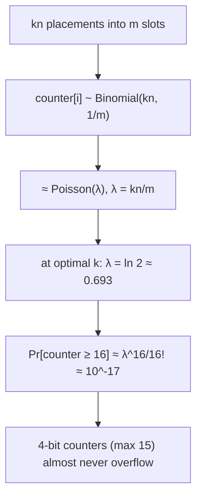

# Counting Bloom Filter — Middle Level

> **One-line summary:** A CBF is sized exactly like a Bloom filter — `m = −n·ln p / (ln 2)²` bits-worth of *slots*, `k = (m/n)·ln 2`, FPR `≈ (1 − e^(−kn/m))^k` — but each slot is a `c`-bit **counter** rather than a bit. At the optimal load each counter holds a `Poisson(ln 2 ≈ 0.69)` value, so **4-bit counters (max 15) overflow with probability ≈ `m·10⁻¹⁷`** — negligible — which is why the CBF costs ~`4×` a Bloom filter and almost never wraps. Deletion is correct because decrementing only lowers a shared counter to the level other items still need; the only ways to break it are deleting an absent item (underflow) or a saturated counter (lost count). Choose a CBF over a Bloom filter when you need **deletes**, and over a **cuckoo filter** when you need **OR-mergeability** or simplicity rather than minimal space.

---

## Table of Contents

1. [Introduction](#introduction)
2. [The Counter Model: From Bits to Counts](#the-counter-model-from-bits-to-counts)
3. [Sizing: Same as Bloom, Times the Counter Width](#sizing-same-as-bloom-times-the-counter-width)
4. [Counter Width and Overflow](#counter-width-and-overflow)
5. [Why Deletion Is Correct (and How It Breaks)](#why-deletion-is-correct-and-how-it-breaks)
6. [The ~4× Space Cost vs Bloom](#the-4-space-cost-vs-bloom)
7. [False-Positive Rate and the Tiny Overflow Term](#false-positive-rate-and-the-tiny-overflow-term)
8. [Comparison with Alternatives](#comparison-with-alternatives)
9. [When to Choose a Counting Bloom Filter](#when-to-choose-a-counting-bloom-filter)
10. [Code Examples](#code-examples)
11. [Error Handling](#error-handling)
12. [Performance Analysis](#performance-analysis)
13. [Best Practices](#best-practices)
14. [Visual Animation](#visual-animation)
15. [Summary](#summary)

---

## Introduction

> Focus: *"Why does it work?"* and *"When and how big should I make it — and how wide should the counters be?"*

At the junior level a CBF is "a Bloom filter with counters instead of bits, so you can delete." That's enough to *use* one. The middle-level questions are quantitative and design-oriented:

- How big do I make the array, and how does that relate to a Bloom filter's sizing?
- **How wide must each counter be?** Is 4 bits really enough, and what is the overflow risk?
- Exactly how much more memory does the counting variant cost — and is `4×` worth it?
- Why is deletion *provably* safe, and what are the precise ways it can go wrong?
- When do I actually need deletes — and when a CBF wins over a cuckoo filter, which also deletes in *less* space?

Every one of these has a clean answer that reuses the Bloom-filter math you already know ([`02-bloom-filter/middle.md`](../02-bloom-filter/middle.md)) and adds one new dimension: the **counter distribution**. This file derives the counter model, justifies 4-bit counters, quantifies the space trade, and lays out the decision between Bloom, counting Bloom, and cuckoo filters. The fully rigorous derivations (Poisson tail bounds, max-load, deletion-correctness proof) live in [`professional.md`](./professional.md).

---

## The Counter Model: From Bits to Counts

A Bloom filter slot answers one bit: *was this slot ever set?* A CBF slot answers a number: *how many currently-inserted items hashed here?* Formally, after inserting a set `S` of `n` items with `k` hashes each (no deletes yet), the counter at slot `i` is:

```
counter[i] = #{ (x, j) : x ∈ S, j ∈ 1..k, h_j(x) = i }
```

— the number of (item, hash-index) placements that landed on slot `i`. With `kn` placements thrown uniformly over `m` slots, each placement hits a given slot independently with probability `1/m`, so:

```
counter[i] ~ Binomial(kn, 1/m) ≈ Poisson(λ),   λ = kn/m
```

This is *the* equation of the topic. It says a counter is, on average, `λ = kn/m`. At the **optimal operating point** (where, just like a Bloom filter, we set `k = (m/n)·ln 2` so the array is half "set"), `λ = ln 2 ≈ 0.693`. Counters are small in expectation — most are `0` or `1`, a few are `2`, rarely `3`. The whole overflow analysis flows from this Poisson with a tiny mean.



A query reads only "is this counter `0` or `> 0`?" — so for *membership*, the CBF behaves exactly like a Bloom filter where `counter > 0` ⟺ `bit = 1`. The extra information in the count is used only by `delete`, to know when a slot may safely return to `0`.

---

## Sizing: Same as Bloom, Times the Counter Width

The CBF inherits the Bloom filter's sizing formulas **unchanged**, because the *membership* behavior is identical. Given a target item count `n` and false-positive rate `p`:

```text
m = ceil( -n * ln(p) / (ln 2)^2 )     # number of slots (counters)
k = round( (m / n) * ln 2 )           # number of hash functions
FPR ≈ (1 - e^(-kn/m))^k               # same as Bloom
```

The *only* new sizing knob is the **counter width `c`** (bits per slot). Total memory is `m · c` bits instead of `m · 1`. So:

| Quantity | Bloom filter | Counting Bloom filter |
|---|---|---|
| Slots `m` | `−n·ln p/(ln 2)²` | **same** |
| Hashes `k` | `(m/n)·ln 2` | **same** |
| FPR | `(1 − e^(−kn/m))^k` | **same** (+ tiny overflow term) |
| Bits per slot | `1` | `c` (typically `4`) |
| Total bits | `m` | `m·c` ≈ `4m` |

So the design recipe is: **size `m` and `k` exactly as you would a Bloom filter, then multiply the memory by `c`** (and pick `c = 4` unless you have a reason not to — justified next). For `n = 5M` and `p = 0.1%`, a Bloom filter needs `m ≈ 71.9M` bits ≈ 9 MB; the CBF needs the same `71.9M` *counters* × 4 bits ≈ **36 MB**.

---

## Counter Width and Overflow

The central new question: **how many bits per counter?** Too few → overflow (and the false-negative risk that comes with it); too many → wasted memory. The Poisson model answers it precisely.

A `c`-bit counter holds `0 .. 2^c − 1`. Overflow happens if any counter would exceed `2^c − 1`. Using `counter[i] ≈ Poisson(λ)` with `λ = kn/m = ln 2` at the optimum:

```
Pr[counter[i] ≥ j] ≈ λ^j / j!     (Poisson tail for small λ, j ≥ value)
```

Across all `m` counters, the *expected number* that reach value `j` is `≈ m · λ^j / j!`. Evaluate for a few `c`:

| Counter width `c` | Max value | `Pr[a counter ≥ max+1]` at `λ=ln2` | Expected overflows over `m=10⁹` |
|---:|---:|---:|---:|
| 2 bits | 3 | `λ⁴/4! ≈ 9.6×10⁻³` | ~`9.6×10⁶` (frequent!) |
| 3 bits | 7 | `λ⁸/8! ≈ 1.0×10⁻⁶` | ~`1000` |
| **4 bits** | **15** | `λ¹⁶/16! ≈ 10⁻¹⁷` | ~`10⁻⁸` (essentially never) |
| 8 bits | 255 | astronomically small | never |

This is the famous **Fan et al. (2000)** result: **4-bit counters are enough.** At the optimal load, the chance *any* counter among a billion ever reaches 16 is around `10⁻⁸` — you would have to build billions of filters to see one overflow. Three bits (max 7) is borderline; two bits (max 3) overflows constantly. So the industry default is **4 bits**, which is also why "a CBF costs `4×` a Bloom filter" is the standard rule of thumb.

**What happens on overflow — saturation.** If a counter *does* hit the max, you must **saturate** (clamp) rather than wrap:

- **Increment at max:** leave it at max. (Wrapping to `0` would un-set a slot still in use → false negative.)
- **Decrement at max:** *also* leave it at max. Once saturated, you've lost the true count, so you can no longer know when it should return to `0`. Pinning it "set" forever can only ever cause an extra false *positive*, never a false negative.

Saturation is the safety valve that keeps the no-false-negative guarantee intact even in the `10⁻¹⁷` event that overflow occurs.

---

## Why Deletion Is Correct (and How It Breaks)

Deletion is the entire reason the CBF exists, so it's worth stating its correctness precisely and its failure modes explicitly.

**Why it's correct.** Maintain the invariant that, **absent overflow**, `counter[i]` equals exactly the number of currently-inserted items whose hashes include `i`. `insert(x)` adds `+1` to each of `x`'s slots; `delete(x)` subtracts `1` from each. For any item `y` still in the set, every one of `y`'s `k` counters includes `y`'s own `+1` contribution that has *not* been removed, so each is `≥ 1`. Therefore `query(y)` finds all `k` counters `> 0` → "present." **Deleting `x` never drives a counter another item needs down to `0`** — that counter holds at least the other item's contribution. Hence no false negatives are introduced by deletion. (Full induction in [`professional.md`](./professional.md).)

```mermaid
graph TD
    subgraph "counter[1] shared by cat & dog"
    C[insert cat: counter[1] 0→1] --> D[insert dog: counter[1] 1→2]
    D --> E[delete cat: counter[1] 2→1]
    E --> F[dog still present: counter[1] = 1 > 0 ✓]
    end
```

**The two ways it breaks:**

1. **Deleting an item that was never inserted (underflow).** Decrementing counters that this item didn't contribute to lowers them below the true demand of *other* items. A counter that should be `1` for some member `y` could be pushed to `0`, and now `query(y)` wrongly returns "absent" — a **false negative**. Mitigation: only delete items you actually inserted; clamp at `0` so you at least never wrap to a huge value.

2. **Decrementing a saturated counter.** If a counter overflowed and is pinned at max, its true count is unknown; decrementing it (or treating it normally) can desynchronize it from reality. Mitigation: never decrement a saturated counter — leave it set.

These are the *only* ways a correctly-saturated CBF produces a false negative, and both are usage/overflow issues, not inherent to the structure. Used correctly (delete only inserted items, 4-bit saturating counters), a CBF preserves the Bloom filter's "a no is a proof of absence" guarantee.

---

## The ~4× Space Cost vs Bloom

The headline trade is memory. A CBF with `c`-bit counters uses `c×` the bits of a same-`m` Bloom filter. With the standard `c = 4`, that's **4× the space** to buy deletion.

Is `4×` worth it? It depends entirely on whether you need deletes:

- **If the set only grows** (e.g. a permanent seen-URL set), the Bloom filter is strictly better — 4× smaller for the same FPR. Don't pay for a delete you never use.
- **If the set churns** (items added and removed — cache entries expiring, flows ending, dictionary edits), a plain Bloom filter *cannot* track removals and silently rots (deleted items keep returning "present"). The CBF's 4× memory buys correctness through churn — usually a bargain versus rebuilding the whole filter periodically.
- **If you need deletes *and* memory is tight**, a **cuckoo filter** ([`10-cuckoo-filter`](../10-cuckoo-filter/middle.md)) deletes too and costs only ~`1.05–1.2×` a Bloom filter (vs the CBF's `4×`), at the price of harder merging and amortized (not worst-case) inserts.

So the CBF sits in a clear niche: **you need deletion, you want simplicity and OR-mergeability, and 4× memory is acceptable.** When 4× is *not* acceptable, the cuckoo filter is the modern answer.

A concrete comparison at `n = 10M`, `p = 1%`:

| Structure | Memory | Delete? | Mergeable? |
|---|---:|:---:|:---:|
| Bloom filter | ~12 MB | no | yes (OR) |
| **Counting Bloom (4-bit)** | **~48 MB** | **yes** | **yes (counter-wise add)** |
| Cuckoo filter | ~15 MB | yes | not easily |

---

## False-Positive Rate and the Tiny Overflow Term

Because a query only distinguishes `counter = 0` from `counter > 0`, the CBF's FPR is **the same formula as a Bloom filter** at the same `m, k, n`:

```
p ≈ (1 − e^(−kn/m))^k
```

There is one extra, microscopic contribution: a **saturated** counter is permanently `> 0`, so it can make some slots "set" that a sequence of inserts-and-deletes would otherwise have returned to `0`. This *very slightly raises* the effective fill, and thus the FPR, beyond the plain formula — by a term proportional to the overflow probability (`≈ 10⁻¹⁷` per counter at the optimum). For all practical purposes:

```
p_CBF ≈ (1 − e^(−kn/m))^k  +  (negligible overflow term)
```

There is a subtlety with **churn**: under heavy insert/delete cycling, counters can drift if you ever delete absent items or hit saturation, so the *long-run* fill of a churned CBF can exceed a freshly-built filter's. As long as you delete only inserted items and never overflow, the fill tracks the current `n` exactly and the FPR matches the formula for the *current* set size — which is the CBF's advantage: the FPR follows the live `n` up *and down*, whereas a Bloom filter's FPR only ever rises.

| Aspect | Bloom filter | Counting Bloom filter |
|---|---|---|
| FPR formula | `(1 − e^(−kn/m))^k` | same |
| FPR as items are **deleted** | unchanged (can't delete) | **drops** (tracks live `n` down) |
| Extra FPR source | none | tiny overflow term (`~10⁻¹⁷`/counter) |
| Extra false-negative source | none | underflow / saturated-decrement (usage bugs) |

---

## Comparison with Alternatives

| Attribute | Counting Bloom | Bloom filter | Cuckoo filter | Hash set / map |
|-----------|:---:|:---:|:---:|:---:|
| Memory per item @ 1% | ~40 bits (4-bit ctrs) | ~10 bits | ~12–13 bits | item size + overhead (≫) |
| Insert / query time | O(k) | O(k) | O(1) amortized | O(1) avg |
| **Delete** | **yes** | **no** | **yes** | yes |
| False positives | yes (tunable) | yes (tunable) | yes (tunable) | **no** |
| False negatives | no* | no | no* | no |
| Mergeable (union) | yes (add counters) | yes (OR) | not easily | no |
| Enumerate items | no | no | no | yes |
| Stores actual items | no | no | only fingerprints | yes |
| FPR tracks deletes | **yes (drops)** | n/a | yes | n/a |

\* No false negatives provided you delete only inserted items and counters don't overflow-and-desync.

**CBF vs Bloom — the core trade.** Same membership behavior and same FPR formula, but the CBF replaces each bit with a `c`-bit counter to gain **deletion**, at `c×` (≈4×) the memory. Pick the CBF only when the set shrinks.

**CBF vs cuckoo — the modern delete-capable rivalry.** Both delete. The cuckoo filter is ~3× smaller than a CBF at the same FPR and has `O(1)` lookups touching 1–2 cache lines. The CBF wins on (1) **OR/add-mergeability** for distributed union, (2) **simpler, lock-light concurrency** (counters via atomic add), (3) **no insertion-failure mode** (cuckoo inserts can fail when the table is too full), and (4) doubling as a frequency sketch. If space is the binding constraint, choose cuckoo; if mergeability, simplicity, or frequency info matters, choose the CBF.

---

## When to Choose a Counting Bloom Filter

**Choose a counting Bloom filter when:**
- You need approximate membership **and** deletion.
- The set **churns** — items are continually added and removed (caches with TTL, flow tables, deduplication windows).
- You want **mergeability** (combine per-node filters by adding counters) or **simple lock-light concurrency**.
- The `4×` memory over a Bloom filter is acceptable.
- You might also want the counters' **frequency / multiplicity** signal (a Count-Min-like use).

**Choose a plain Bloom filter when:**
- The set only ever **grows** — you never delete. (Bloom is 4× smaller.)
- Memory is tight and you don't need deletes.

**Choose a cuckoo filter when:**
- You need deletes **and** minimal space (it's ~3× smaller than a CBF), and you can live without easy merging.

**Choose an exact hash set when:**
- You need exact answers, enumeration, or a false "yes" would be dangerous, and memory permits.

---

## Worked Sizing Example

Let's design a CBF end-to-end. **Goal:** a per-router **flow table membership** filter that answers "is this flow active?" for `n = 1,000,000` concurrent flows, tolerating `p = 0.1%` false positives, where flows are constantly **added (SYN)** and **removed (FIN/timeout)** — the canonical churn workload that *demands* deletion.

**Step 1 — size the slot array (same as Bloom).**

```
m = −n · ln p / (ln 2)²
  = −1,000,000 · ln(0.001) / (0.6931)²
  = −1,000,000 · (−6.9078) / 0.4805
  ≈ 14,378,000 slots
```

**Step 2 — pick `k` (same as Bloom).**

```
k = (m/n) · ln 2 = 14.378 · 0.6931 = 9.97 → 10 hash functions
```

**Step 3 — pick the counter width.** At the optimum, `λ = kn/m = ln 2 ≈ 0.693`. With 4-bit counters, `Pr[any counter ≥ 16] ≈ m·λ¹⁶/16! ≈ 14.4M × 10⁻¹⁷ ≈ 10⁻¹⁰` — never. **Use 4 bits.**

**Step 4 — total memory.**

```
memory = m × 4 bits = 14,378,000 × 4 = 57.5 Mbit ≈ 7.2 MB
```

A plain Bloom filter would be `14.378M bits ≈ 1.8 MB` — but it *cannot delete*, so it can't track flows ending and would steadily fill until its FPR approached 1. The CBF's 7.2 MB buys an FPR that **rises as flows start and falls as flows end**, tracking the live flow count — exactly what a churning flow table needs.

**Step 5 — sanity-check the FPR** with the forward formula at `n = 1M`:

```
p = (1 − e^(−10·1e6/14.378e6))^10 = (1 − e^(−0.6956))^10 = 0.5012^10 ≈ 0.00097 ✓
```

Right at the `0.1%` target, with the array half "set" (the optimal-`k` signature). **Result:** ~7.2 MB and 10 hashes give a deletable, churn-tolerant flow membership filter.

---

## Code Examples

### Full Implementation with Sizing and Packed 4-bit Counters

#### Go

```go
package main

import (
	"fmt"
	"hash/fnv"
	"math"
)

// CountingBloom packs two 4-bit counters per byte: slot 2i in low nibble, 2i+1 in high.
type CountingBloom struct {
	data []byte // ceil(m/2) bytes, two 4-bit counters per byte
	m, k uint64
}

const nibbleMax = 15

func NewOptimal(n int, p float64) *CountingBloom {
	m := uint64(math.Ceil(-float64(n) * math.Log(p) / (math.Ln2 * math.Ln2)))
	k := uint64(math.Max(1, math.Round(float64(m)/float64(n)*math.Ln2)))
	return &CountingBloom{data: make([]byte, (m+1)/2), m: m, k: k}
}

func (c *CountingBloom) get(i uint64) uint8 {
	b := c.data[i/2]
	if i%2 == 0 {
		return b & 0x0f
	}
	return b >> 4
}
func (c *CountingBloom) set(i uint64, v uint8) {
	b := c.data[i/2]
	if i%2 == 0 {
		c.data[i/2] = (b & 0xf0) | (v & 0x0f)
	} else {
		c.data[i/2] = (b & 0x0f) | (v << 4)
	}
}

func (c *CountingBloom) hashes(data []byte) (uint64, uint64) {
	h := fnv.New64a()
	h.Write(data)
	s := h.Sum64()
	return s & 0xffffffff, (s >> 32) | 1
}

func (c *CountingBloom) Add(data []byte) {
	h1, h2 := c.hashes(data)
	for i := uint64(0); i < c.k; i++ {
		idx := (h1 + i*h2) % c.m
		if v := c.get(idx); v < nibbleMax {
			c.set(idx, v+1) // saturate
		}
	}
}

func (c *CountingBloom) Delete(data []byte) {
	h1, h2 := c.hashes(data)
	for i := uint64(0); i < c.k; i++ {
		idx := (h1 + i*h2) % c.m
		if v := c.get(idx); v > 0 && v < nibbleMax {
			c.set(idx, v-1) // clamp at 0, skip saturated
		}
	}
}

func (c *CountingBloom) MightContain(data []byte) bool {
	h1, h2 := c.hashes(data)
	for i := uint64(0); i < c.k; i++ {
		if c.get((h1+i*h2)%c.m) == 0 {
			return false
		}
	}
	return true
}

func (c *CountingBloom) EstimatedFPR(n int) float64 {
	return math.Pow(1-math.Exp(-float64(c.k)*float64(n)/float64(c.m)), float64(c.k))
}

func main() {
	cbf := NewOptimal(1000, 0.01)
	fmt.Printf("m=%d slots, k=%d, memory=%d bytes\n", cbf.m, cbf.k, len(cbf.data))
	cbf.Add([]byte("alpha"))
	cbf.Add([]byte("beta"))
	fmt.Println(cbf.MightContain([]byte("alpha"))) // true
	cbf.Delete([]byte("alpha"))
	fmt.Println(cbf.MightContain([]byte("alpha"))) // false
	fmt.Println(cbf.MightContain([]byte("beta")))  // true
}
```

#### Java

```java
import java.nio.charset.StandardCharsets;

public class CountingBloom {
    private final byte[] data; // two 4-bit counters per byte
    private final int m, k;
    private static final int NIBBLE_MAX = 15;

    public CountingBloom(int n, double p) {
        this.m = (int) Math.ceil(-n * Math.log(p) / (Math.log(2) * Math.log(2)));
        this.k = Math.max(1, (int) Math.round((double) m / n * Math.log(2)));
        this.data = new byte[(m + 1) / 2];
    }

    private int get(int i) {
        int b = data[i / 2] & 0xff;
        return (i % 2 == 0) ? (b & 0x0f) : (b >>> 4);
    }
    private void set(int i, int v) {
        int b = data[i / 2] & 0xff;
        data[i / 2] = (byte) ((i % 2 == 0) ? (b & 0xf0) | (v & 0x0f)
                                           : (b & 0x0f) | (v << 4));
    }

    private long[] hashes(byte[] d) {
        long h = 0xcbf29ce484222325L;
        for (byte by : d) { h ^= (by & 0xff); h *= 0x100000001b3L; }
        return new long[]{ h & 0xffffffffL, (h >>> 32) | 1L };
    }
    private int index(long h1, long h2, int i) {
        return (int) (((h1 + (long) i * h2) % m + m) % m);
    }

    public void add(String s) {
        long[] h = hashes(s.getBytes(StandardCharsets.UTF_8));
        for (int i = 0; i < k; i++) {
            int idx = index(h[0], h[1], i), v = get(idx);
            if (v < NIBBLE_MAX) set(idx, v + 1);
        }
    }
    public void delete(String s) {
        long[] h = hashes(s.getBytes(StandardCharsets.UTF_8));
        for (int i = 0; i < k; i++) {
            int idx = index(h[0], h[1], i), v = get(idx);
            if (v > 0 && v < NIBBLE_MAX) set(idx, v - 1);
        }
    }
    public boolean mightContain(String s) {
        long[] h = hashes(s.getBytes(StandardCharsets.UTF_8));
        for (int i = 0; i < k; i++) {
            if (get(index(h[0], h[1], i)) == 0) return false;
        }
        return true;
    }

    public static void main(String[] args) {
        CountingBloom cbf = new CountingBloom(1000, 0.01);
        System.out.printf("m=%d k=%d bytes=%d%n", cbf.m, cbf.k, cbf.data.length);
        cbf.add("alpha"); cbf.add("beta");
        System.out.println(cbf.mightContain("alpha")); // true
        cbf.delete("alpha");
        System.out.println(cbf.mightContain("alpha")); // false
        System.out.println(cbf.mightContain("beta"));  // true
    }
}
```

#### Python

```python
import math


class CountingBloom:
    NIBBLE_MAX = 15

    def __init__(self, n, p):
        self.m = math.ceil(-n * math.log(p) / (math.log(2) ** 2))
        self.k = max(1, round(self.m / n * math.log(2)))
        self.data = bytearray((self.m + 1) // 2)  # two 4-bit counters per byte

    def _get(self, i):
        b = self.data[i >> 1]
        return b & 0x0F if (i & 1) == 0 else b >> 4

    def _set(self, i, v):
        b = self.data[i >> 1]
        if (i & 1) == 0:
            self.data[i >> 1] = (b & 0xF0) | (v & 0x0F)
        else:
            self.data[i >> 1] = (b & 0x0F) | (v << 4)

    def _hashes(self, data):
        h = hash(data) & 0xFFFFFFFFFFFFFFFF
        return h & 0xFFFFFFFF, (h >> 32) | 1

    def add(self, item):
        data = item.encode() if isinstance(item, str) else item
        h1, h2 = self._hashes(data)
        for i in range(self.k):
            idx = (h1 + i * h2) % self.m
            v = self._get(idx)
            if v < self.NIBBLE_MAX:
                self._set(idx, v + 1)

    def delete(self, item):
        data = item.encode() if isinstance(item, str) else item
        h1, h2 = self._hashes(data)
        for i in range(self.k):
            idx = (h1 + i * h2) % self.m
            v = self._get(idx)
            if 0 < v < self.NIBBLE_MAX:
                self._set(idx, v - 1)

    def might_contain(self, item):
        data = item.encode() if isinstance(item, str) else item
        h1, h2 = self._hashes(data)
        for i in range(self.k):
            if self._get((h1 + i * h2) % self.m) == 0:
                return False
        return True

    def estimated_fpr(self, n):
        return (1 - math.exp(-self.k * n / self.m)) ** self.k


if __name__ == "__main__":
    cbf = CountingBloom(n=1000, p=0.01)
    print(f"m={cbf.m} slots, k={cbf.k}, bytes={len(cbf.data)}")
    cbf.add("alpha"); cbf.add("beta")
    print(cbf.might_contain("alpha"))  # True
    cbf.delete("alpha")
    print(cbf.might_contain("alpha"))  # False
    print(cbf.might_contain("beta"))   # True
```

**What it does:** sizes `m, k` from `n` and `p` with the same formulas as a Bloom filter, packs two 4-bit counters per byte, **increments** on add (saturating at 15), **decrements** on delete (clamped at 0, skipping saturated counters), and answers membership by checking every counter is `> 0`.
**Run:** `go run main.go` | `javac CountingBloom.java && java CountingBloom` | `python cbf.py`

---

## Error Handling

| Scenario | What goes wrong | Correct approach |
|----------|----------------|------------------|
| Counter overflow | Increment past `2^c−1` wraps to `0` → un-sets a live slot → false negatives | **Saturate** at the max; never wrap. |
| Deleting an absent item | Decrements counters this item didn't set → underflow → false negatives for *other* members | Only delete inserted items; clamp at `0`. |
| Decrementing a saturated counter | True count was lost on overflow; decrement desyncs it | Leave saturated counters at max; never decrement them. |
| Same item inserted twice | Counters double-count; one delete leaves them `≥1` (item "still present") | Insert each distinct item once, or track multiplicity intentionally. |
| `h2 = 0` in double hashing | All `k` positions collapse → effective `k = 1`, FPR spikes | Force `h2` odd/non-zero (`h2 |= 1`). |
| Overfilled past design `n` | FPR climbs *and* overflow probability rises | Re-size, or rebuild; consider a cuckoo filter if space-bound. |

---

## Performance Analysis

Per-operation work is `O(k)` counter accesses, independent of `n` — same as a Bloom filter. The realistic cost differences from a Bloom filter:

- **Read-modify-write**: insert/delete *read* a counter, modify, and *write* it back (vs a Bloom filter's single OR), so the memory traffic per op is higher.
- **Cache misses**: like a Bloom filter, the `k` counters can land on `k` different cache lines; a **blocked** counting filter confines them to one (see [`senior.md`](./senior.md)).
- **Packing cost**: 4-bit packing (two counters per byte) saves memory but adds nibble masking/shifting per access — a small CPU cost for a 2× memory win.

#### Go

```go
import (
	"fmt"
	"time"
)

func benchmark() {
	for _, n := range []int{1000, 10000, 100000, 1000000} {
		cbf := NewOptimal(n, 0.01)
		start := time.Now()
		for i := 0; i < n; i++ {
			cbf.Add([]byte(fmt.Sprintf("item-%d", i)))
		}
		// churn: delete half, re-add a quarter
		for i := 0; i < n/2; i++ {
			cbf.Delete([]byte(fmt.Sprintf("item-%d", i)))
		}
		fmt.Printf("n=%7d: m=%d k=%d bytes=%d add+churn=%v\n",
			n, cbf.m, cbf.k, len(cbf.data), time.Since(start))
	}
}
```

#### Java

```java
public static void benchmark() {
    for (int n : new int[]{1000, 10000, 100000, 1000000}) {
        CountingBloom cbf = new CountingBloom(n, 0.01);
        long start = System.nanoTime();
        for (int i = 0; i < n; i++) cbf.add("item-" + i);
        for (int i = 0; i < n / 2; i++) cbf.delete("item-" + i);
        long ms = (System.nanoTime() - start) / 1_000_000;
        System.out.printf("n=%7d: add+churn=%d ms%n", n, ms);
    }
}
```

#### Python

```python
import time

for n in (1000, 10000, 100000, 1000000):
    cbf = CountingBloom(n, 0.01)
    start = time.perf_counter()
    for i in range(n):
        cbf.add(f"item-{i}")
    for i in range(n // 2):
        cbf.delete(f"item-{i}")
    print(f"n={n:>7}: m={cbf.m} k={cbf.k} bytes={len(cbf.data)} "
          f"add+churn={time.perf_counter()-start:.3f}s")
```

---

## Quick Reference: Counting Bloom at a Glance

| You know… | Compute… | Formula |
|---|---|---|
| `n`, `p` | slots `m` | `m = −n·ln p / (ln 2)²` (same as Bloom) |
| `m`, `n` | hashes `k` | `k = (m/n)·ln 2` (same as Bloom) |
| `m`, `k`, `n` | FPR `p` | `p = (1 − e^(−kn/m))^k` (same as Bloom) |
| `m`, counter width `c` | total bits | `m·c` (≈ `4m` for 4-bit) |
| `λ = kn/m`, width `c` | overflow prob/counter | `≈ λ^(2^c) / (2^c)!` |
| optimal load | mean counter | `λ = ln 2 ≈ 0.69` |

Rule of thumb: **size exactly like a Bloom filter, use 4-bit counters, multiply memory by 4.** Each extra bit/element still multiplies the FPR by ≈ `0.62`, just as in a Bloom filter.

---

## Best Practices

- **Size `m`, `k` exactly like a Bloom filter** (`m = −n·ln p/(ln 2)²`, `k = (m/n)·ln 2`); the only new choice is counter width.
- **Use 4-bit counters** unless you have churn so heavy that re-insertion can pile counts up — then measure and consider 8-bit.
- **Always saturate** on overflow and **clamp at 0** on underflow; never wrap.
- **Only delete inserted items.** Underflow is the main way a CBF develops false negatives.
- **Pack counters** (two 4-bit per byte) when memory matters.
- **Don't use a CBF if the set never shrinks** — a Bloom filter is 4× smaller.
- **Consider a cuckoo filter** if you need deletes *and* minimal space and don't need easy merging.
- **Serialize `m`, `k`, counter width, and hash seed** so the filter is portable and merge-safe.

---

## Visual Animation

> See [`animation.html`](./animation.html) for interactive visualization.
>
> Middle-level details to watch:
> - Counters incrementing on insert and decrementing on delete (a shared counter dropping but staying `> 0`)
> - The mean counter hovering near `ln 2 ≈ 0.69` at the optimal `k` (most counters 0 or 1)
> - The live FPR estimate **dropping** as you delete items — something a Bloom filter can't do
> - A counter saturating at the maximum on overflow

---

## Summary

The middle-level CBF is a **design** problem that reuses every Bloom-filter formula and adds one dimension: the **counter**. Each slot's count is `≈ Poisson(λ = kn/m)`, equal to `ln 2 ≈ 0.69` at the optimal `k`, so **4-bit counters overflow with probability ≈ `10⁻¹⁷`** — which is why the standard CBF costs `4×` a Bloom filter and almost never wraps. Sizing is identical (`m = −n·ln p/(ln 2)²`, `k = (m/n)·ln 2`, FPR `≈ (1 − e^(−kn/m))^k`); only the memory is multiplied by the counter width. **Deletion is correct** because decrementing only lowers a counter to the level other items still demand — and breaks only on the two usage errors of deleting an absent item (underflow) or decrementing a saturated counter. The 4× space buys an FPR that tracks the live `n` *up and down*, ideal for **churning** sets. Versus a cuckoo filter — which also deletes in ~3× less space — the CBF wins on mergeability, simple concurrency, no insertion-failure mode, and frequency information.

---

Next step: [senior.md](./senior.md) — CBFs in network flow tables, cache admission with expiry, distributed/mergeable counting filters, and the d-left and spectral space-saving variants.
