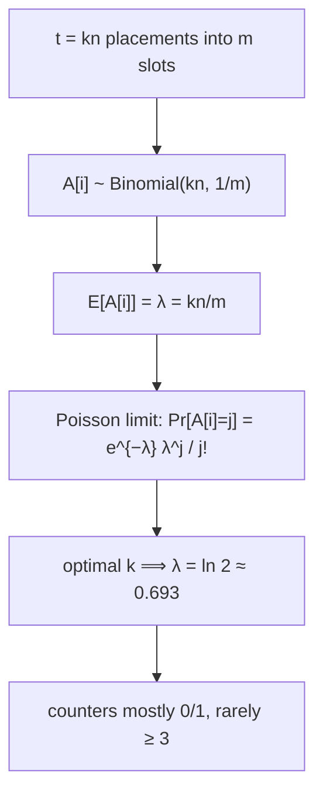

# Counting Bloom Filter — Mathematical Foundations and Complexity Theory

> **One-line summary:** This file derives the counting Bloom filter's behavior from first principles: each counter is `Binomial(kn, 1/m) ≈ Poisson(λ)` with `λ = kn/m`, so at the optimal load `λ = ln 2 ≈ 0.693` and a `c`-bit counter overflows with probability `≈ λ^{2^c}/(2^c)!`, giving `≈ 10⁻¹⁷` per counter for `c = 4` (the Fan-et-al. **4-bit** result). The **FPR equals the Bloom filter's** `(1 − e^{−kn/m})^k` plus a vanishing overflow term. We prove **deletion introduces no false negatives** absent overflow/underflow via a counting invariant, derive the **`4×` space** factor and place the CBF against the AMQ lower bound `n·log₂(1/ε)`, and analyze the **max-load** (balls-in-bins) bound that motivates the d-left and cuckoo improvements.

---

## Table of Contents

1. [Formal Definition](#formal-definition)
2. [The Counter Distribution](#the-counter-distribution)
3. [Counter-Overflow Probability and the 4-Bit Result](#counter-overflow-probability-and-the-4-bit-result)
4. [Counter-Width Choice: A Decision Rule](#counter-width-choice-a-decision-rule)
5. [False-Positive-Rate Derivation (with the Overflow Term)](#false-positive-rate-derivation-with-the-overflow-term)
6. [Deletion Correctness: No False Negatives (Proof)](#deletion-correctness-no-false-negatives-proof)
7. [How Deletion Breaks: Underflow and Saturation](#how-deletion-breaks-underflow-and-saturation)
8. [Optimal k and Sizing (Inherited)](#optimal-k-and-sizing-inherited)
9. [Space Analysis and the AMQ Lower Bound](#space-analysis-and-the-amq-lower-bound)
10. [Max-Load Bounds and the d-left / Cuckoo Improvement](#max-load-bounds-and-the-d-left--cuckoo-improvement)
11. [Spectral / Count-Min Frequency Analysis](#spectral--count-min-frequency-analysis)
12. [Mergeability by Counter Addition (Proof)](#mergeability-by-counter-addition-proof)
13. [Comparison with Alternatives](#comparison-with-alternatives)
14. [Summary](#summary)
15. [Theorem Index](#theorem-index)

---

## Formal Definition

```text
A counting Bloom filter is a tuple C = (A, m, k, c, H) where:
  A ∈ {0,…,2^c − 1}^m   an array of m counters, each c bits, init to 0^m
  m ∈ ℕ                 number of counters (slots)
  k ∈ ℕ                 number of hash functions
  c ∈ ℕ                 counter width in bits (max value Cmax = 2^c − 1)
  H = {h_1,…,h_k},      each h_j : U → {0,…,m-1}, modeled as independent
                        uniform random functions

Operations on a multiset over S ⊆ U (each x inserted once unless stated):
  insert(x):  for j=1..k:  A[h_j(x)] := min(A[h_j(x)] + 1, Cmax)   (saturating)
  delete(x):  for j=1..k:  if 0 < A[h_j(x)] < Cmax: A[h_j(x)] := A[h_j(x)] − 1
  query(x):   return  ⋀_{j=1}^k ( A[h_j(x)] > 0 )

Invariant I(A) [absent overflow]:
  A[i] = #{ (x,j) : x currently inserted, h_j(x) = i }
       = number of (item, hash-index) placements currently on slot i.
```

The query distinguishes only `A[i] = 0` from `A[i] > 0`; the magnitude of a counter matters solely for `delete`. When `c = 1` (`Cmax = 1`) and `delete` is disabled, the CBF degenerates exactly to a Bloom filter. The randomness below is over the hash choice; for fixed hashes and fixed `x`, the answer is deterministic.

---

## The Counter Distribution

The foundation of every CBF result is the distribution of a single counter.

**Setup.** Insert `n` distinct items with `k` hashes each: `t = kn` placements thrown independently and uniformly into `m` slots (the uniform-hashing model). Let `A[i]` be the count at slot `i`.

**Theorem (counter distribution).**

```
A[i] ~ Binomial(t, 1/m),   t = kn
E[A[i]] = t/m = kn/m =: λ
Var[A[i]] = t · (1/m)(1 − 1/m) ≈ λ(1 − 1/m) ≈ λ
```

**Poisson limit.** As `m → ∞` with `λ = kn/m` fixed, `Binomial(kn, 1/m) → Poisson(λ)`:

```
Pr[A[i] = j] → e^{−λ} λ^j / j!
```



**At the optimum.** The CBF inherits the Bloom filter's optimal `k* = (m/n)·ln 2`, at which `λ = kn/m = ln 2 ≈ 0.693`. So the typical counter is small: with `λ = 0.693`, `Pr[A=0] = e^{−0.693} = 0.5`, `Pr[A=1] = 0.347`, `Pr[A=2] = 0.120`, `Pr[A=3] = 0.0277`, `Pr[A=4] = 0.0048`. Half the slots are empty (the half-full signature), and counts above 4 are already rare — the springboard for the overflow analysis.

| `j` | `Pr[A=j]` at `λ=ln2` | cumulative `Pr[A≥j]` |
|---:|---:|---:|
| 0 | 0.5000 | 1.0000 |
| 1 | 0.3466 | 0.5000 |
| 2 | 0.1201 | 0.1534 |
| 3 | 0.0277 | 0.0333 |
| 4 | 0.0048 | 0.0056 |
| 8 | 4.6×10⁻⁶ | 5.3×10⁻⁶ |
| 16 | ~5×10⁻¹⁸ | ~10⁻¹⁷ |

---

## Counter-Overflow Probability and the 4-Bit Result

The central design theorem: **how wide must a counter be so it (almost) never overflows?**

**Per-counter overflow.** A `c`-bit counter overflows if `A[i] ≥ 2^c`. By the Poisson tail (for `λ < 1`, the series is dominated by its first term):

```
Pr[A[i] ≥ J] = Σ_{j≥J} e^{−λ} λ^j/j! ≤ (λ^J/J!) · 1/(1 − λ/(J+1)) ≈ λ^J/J!
```

for `J = 2^c`. So:

```
┌────────────────────────────────────────────────┐
│  Pr[counter overflows] ≈ λ^{2^c} / (2^c)!        │
└────────────────────────────────────────────────┘
```

**Expected number of overflowing counters** across all `m` slots:

```
E[#overflow] ≈ m · λ^{2^c} / (2^c)!
```

**The 4-bit result (Fan, Cao, Almeida, Broder 2000).** At `λ = ln 2 ≈ 0.693` and `c = 4` (`2^c = 16`):

```
Pr[A[i] ≥ 16] ≈ (ln 2)^16 / 16! = 0.693^16 / 2.09×10^13
             ≈ 3.0×10^{-3} / 2.09×10^13
             ≈ 1.4×10^{-16}  per counter
```

Even with `m = 10⁹` counters, the expected number that ever reach 16 is `≈ 10⁹ × 1.4×10⁻¹⁶ ≈ 1.4×10⁻⁷` — you would build ten million billion-counter filters before seeing one overflow. **Hence 4 bits suffice**, and this is precisely why the standard CBF is quoted at `4×` the space of a Bloom filter. ∎

**Why not fewer bits.** Compare widths at `λ = ln 2`:

| `c` | `2^c` | `Pr[overflow]/counter` | `E[#overflow]`, `m=10⁹` |
|---:|---:|---:|---:|
| 2 | 4 | `λ⁴/4! = 9.6×10⁻³` | `~9.6×10⁶` (constant overflow) |
| 3 | 8 | `λ⁸/8! = 1.0×10⁻⁶` | `~1000` |
| **4** | **16** | `1.4×10⁻¹⁶` | `~10⁻⁷` (never) |
| 5 | 32 | `< 10⁻³⁵` | 0 |

Three bits leaves ~1000 overflowing counters per billion (each a permanent false-positive seed — tolerable but not ideal); two bits overflows constantly. Four bits is the knee of the curve: the first width where overflow vanishes in practice. (Bose et al. and Mitzenmacher analyses confirm the same threshold via the balls-in-bins max-load bound, [below](#max-load-bounds-and-the-d-left--cuckoo-improvement).)

---

## Counter-Width Choice: A Decision Rule

Generalize beyond the optimum. Given a tolerated total overflow probability `δ` over the filter's lifetime, choose the smallest `c` with:

```
m · λ^{2^c} / (2^c)! ≤ δ
```

Solve for `2^c` (call it `J`): need `λ^J/J! ≤ δ/m`. Using Stirling `J! ≈ √(2πJ)(J/e)^J`, the tail decays super-exponentially in `J`, so a *tiny* increase in `c` crushes overflow:

```
ln(λ^J/J!) ≈ J ln λ − J ln J + J − (1/2)ln(2πJ)
           ≈ −J ln(J/(λe))           (dominant term)
```

Setting `−J ln(J/(λe)) ≤ ln(δ/m)` gives the required `J = 2^c`. **Practical reading:**

- For the **optimal load** `λ = ln 2` and any realistic `m ≤ 10¹²` and `δ ≥ 10⁻⁶`, the rule yields `c = 4`.
- If the filter is **overfilled** (`λ > ln 2`, e.g. running at `n = 2·n_design` so `λ ≈ 1.4`), recompute: `Pr[≥16] ≈ 1.4¹⁶/16! ≈ 2×10⁻¹⁰` — still safe, but the margin shrinks; heavy overfill (`λ ≈ 3`) pushes `Pr[≥16] ≈ 4×10⁻⁵`, where 4 bits starts to overflow and you'd want `c = 5` or a resize.
- Under **dirty churn** (double-inserts, deleted-absent items inflating counts), the *effective* `λ` rises; measure the empirical counter histogram and widen `c` if mass approaches `2^c`.

| Operating regime | `λ = kn/m` | recommended `c` |
|---|---:|---:|
| Optimal (`k = (m/n)ln2`) | 0.69 | **4** |
| Mild overfill (2× `n`) | 1.4 | 4 |
| Heavy overfill (4× `n`) | 2.8 | 5–6 (or resize) |
| Spectral / frequency use | application-dependent | wider (8–16) or variable |

---

## False-Positive-Rate Derivation (with the Overflow Term)

Because `query` only tests `A[i] > 0`, the CBF's membership behavior matches a Bloom filter where "set" ⟺ `A[i] > 0`. So the FPR derivation is the Bloom filter's, with one correction for saturation.

**Step 1 — probability a slot is "unset" (`A[i] = 0`).** Identical to the Bloom filter:

```
Pr[A[i] = 0] = (1 − 1/m)^{kn} ≈ e^{−kn/m} = e^{−λ}
```

So `ρ := Pr[A[i] > 0] = 1 − e^{−λ}` is the expected fraction of "set" slots — exactly the Bloom load.

**Step 2 — false positive.** A non-member `y` triggers a false positive iff all `k` of its slots are "set" (`> 0`). Treating the `k` slots as independent each with set-probability `ρ`:

```
p ≈ ρ^k = (1 − e^{−kn/m})^k        ← same formula as the Bloom filter
```

**Step 3 — the overflow correction.** Saturation can keep a slot permanently `> 0` even after deletions that "should" have returned it to `0`. A saturated slot is "set" with probability `1` instead of `ρ`. Let `σ = Pr[slot saturated] ≈ λ^{2^c}/(2^c)!`. The corrected per-slot set-probability is `ρ' = ρ + (1 − ρ)·σ`, and:

```
p_CBF ≈ (ρ')^k = (ρ + (1−ρ)σ)^k ≈ ρ^k · (1 + kσ(1−ρ)/ρ + …)
       = (1 − e^{−kn/m})^k · (1 + O(kσ))
```

With `σ ≈ 10⁻¹⁶` for 4-bit counters, the correction factor `(1 + O(kσ))` is indistinguishable from `1`. **Conclusion:**

```
┌──────────────────────────────────────────────────────────┐
│  p_CBF ≈ (1 − e^{−kn/m})^k   +  negligible overflow term   │
└──────────────────────────────────────────────────────────┘
```

**The deletion advantage on FPR.** For a Bloom filter, `n` only ever increases, so the FPR only rises. For a CBF that deletes truthfully, `n` in the formula is the **current** live count, so as items are removed `ρ = 1 − e^{−k·n_live/m}` *decreases* and the FPR *falls*. The CBF's realized FPR tracks the live set in both directions — a structural advantage the formula captures by letting `n = n_live(t)`.

---

## Deletion Correctness: No False Negatives (Proof)

This is the theorem that justifies the entire structure: under clean usage, deletion never causes a false negative.

```text
Setup: Let S_t be the set of items currently inserted at time t (after some
sequence of inserts/deletes, each delete applied only to an item that is in
the current set). Assume NO counter ever saturates (overflow-free regime).

Invariant I_t:  for every slot i,
   A[i] = Σ_{x ∈ S_t} #{ j : h_j(x) = i }
        = total placements of CURRENT members on slot i.

Base case (t=0): S_0 = ∅, all A[i] = 0. I_0 holds.

Inductive step:
  • insert(x), x ∉ S:  for each j, A[h_j(x)] += 1. Each slot's placement count
    for the new member S ∪ {x} rises by exactly #{j: h_j(x)=i}. I preserved.
  • delete(x), x ∈ S:  for each j, A[h_j(x)] -= 1. Each slot's count for the
    member set S \ {x} drops by exactly #{j: h_j(x)=i}, and never below the
    placements of the REMAINING members (since x's placements are removed and
    no others). No counter goes negative because A[i] ≥ x's contribution.
    I preserved.

No-false-negative claim:
  Let y ∈ S_t. For each j, slot h_j(y) has, by I_t, A[h_j(y)] ≥ #{ j' : h_{j'}(y)=h_j(y) } ≥ 1
  (y itself contributes at least one placement to that slot). Hence every one of
  y's k slots is > 0, so query(y) = ⋀_j (A[h_j(y)] > 0) = true.   ∎
```

The crux is in the delete step: removing `x`'s placements **cannot** drop a slot below the count demanded by the items that remain, because the invariant says the slot's value is *exactly* the sum over current members, and we only subtract `x`'s own contribution. Every still-present `y` keeps its `≥ 1` on each of its slots. This is the formal version of "decrementing only lowers a shared counter to the level other items still need."

**Contrapositive (the usable form):** if `query(x) = false`, some `A[h_j(x)] = 0`, so by `I_t` no current member places on that slot — in particular `x ∉ S_t`. A "no" is a proof of current absence, exactly as for a Bloom filter.

---

## How Deletion Breaks: Underflow and Saturation

The proof assumed (a) no saturation and (b) every `delete(x)` has `x ∈ S`. Dropping either breaks the invariant. These are the *only* two ways a CBF develops false negatives.

**(1) Underflow — deleting an absent item.** Suppose `delete(x)` runs with `x ∉ S_t`. For each `j`, `A[h_j(x)]` is decremented even though `x` contributed nothing. If some slot `h_j(x)` is shared with a current member `y` and held exactly `y`'s contribution (say `1`), it drops to `0`. Now `query(y)` finds that slot `0` → **false negative** for the real member `y`. Formally, the invariant `A[i] = Σ_{current} placements` is violated downward.

```text
Theorem (underflow danger): A single delete(x) with x ∉ S can create up to k
false negatives among members sharing x's slots. The clamp "don't go below 0"
prevents wraparound but NOT the violation — a clamped-to-0 slot still
under-counts a member that needed it.
```

Mitigation: **only delete items known to be in the set** (verify against a source of truth, or maintain an exact key index for deletes). The clamp at `0` bounds the damage (no `0→255` wrap) but cannot restore the lost member contribution.

**(2) Saturation — decrementing after overflow.** If `A[i]` saturated at `Cmax`, its true count is lost: the invariant became `A[i] = Cmax < true count`. Decrementing it would drop it further below truth, risking a future `0` while members still need it. The safe rule is **never decrement a saturated counter** — leave it at `Cmax` forever. This makes the slot permanently "set," which (per the FPR derivation) only ever adds false *positives*. So saturation degrades gracefully (extra false positives) **only if** you refuse to decrement saturated counters; decrementing them reintroduces false-negative risk.

**Summary of correctness conditions.** A CBF preserves the no-false-negative guarantee iff: (i) you delete only inserted items, and (ii) counters saturate (never wrap) and saturated counters are never decremented. Under these, the CBF is as safe as a Bloom filter, with deletion added.

---

## Optimal k and Sizing (Inherited)

The CBF's *membership* layer is a Bloom filter, so the optimal-`k` and sizing results carry over verbatim (full proofs in [`02-bloom-filter/professional.md`](../02-bloom-filter/professional.md)).

**Optimal `k`.** Minimize `p(k) = (1 − e^{−kn/m})^k`. With `β = n/m`, `ln p = k·ln(1 − e^{−βk})`; setting the derivative to zero and substituting `k = (ln2)/β` gives `e^{−βk} = 1/2`, so:

```
k* = (m/n)·ln 2,    at which  λ = kn/m = ln 2  and  ρ = 1/2 (half-full)
```

The half-full condition does double duty in a CBF: it minimizes the FPR **and** keeps the mean counter at `λ = ln 2`, which is exactly the regime where 4-bit counters don't overflow. The two optima coincide — a happy structural fact.

**Sizing law.** Invert `ln p* = −(m/n)(ln 2)²`:

```
m = −n·ln p / (ln 2)²,    bits-per-slot-element  m/n = 1.4427·log₂(1/p)
```

**Total memory** (the CBF correction): multiply by the counter width:

```
CBF memory = m · c = c · 1.4427 · n · log₂(1/p)  bits
           = 4 · 1.4427 · n · log₂(1/p)  ≈ 5.77 · n · log₂(1/p)  bits   (c = 4)
```

versus the Bloom filter's `1.4427·n·log₂(1/p)` bits — the **`c = 4×`** factor made explicit.

---

## Space Analysis and the AMQ Lower Bound

How far from optimal is a CBF? Place it against the information-theoretic floor for approximate-membership-with-no-false-negatives (AMQ) structures.

**The lower bound.** Any AMQ with FPR `ε` and no false negatives needs `≥ n·log₂(1/ε)` bits (Carter–Floyd–Gill–Markowsky; Pagh–Pagh–Rao; derived in [`02-bloom-filter/professional.md`](../02-bloom-filter/professional.md)).

**But the CBF solves a *harder* problem** — it must also support **deletion** — so it isn't competing on the static-AMQ bound alone. Compare the structures that do support deletion:

```
n·log₂(1/ε)                ← static AMQ lower bound (no delete)
≈ 1.05·n·log₂(1/ε)         ← cuckoo filter (delete, ~95% load)
≈ 2·1.44·n·log₂(1/ε)       ← d-left CBF (delete) — about 2× a Bloom filter
4·1.44·n·log₂(1/ε)         ← plain counting Bloom (delete) — 4× a Bloom filter
```

**Reading the hierarchy.** A plain CBF pays *two* penalties relative to the floor: the Bloom filter's `1.44×` (`= 1/ln 2`) for the unstructured-bit-array model, **and** an extra `4×` for storing a 4-bit counter where one bit of membership would do. The `4×` is the cost of the *simplest possible* deletion mechanism (a per-slot count). Smarter deletable structures recover most of it:

- **d-left CBF** halves the counter waste via balanced allocation → `~2×` a Bloom filter.
- **Cuckoo filter** stores short *fingerprints* instead of redundant counters → `~1.05–1.2×` a Bloom filter, essentially matching the static floor while still deleting.

```text
Space verdict:
  CBF bits/elem      = 4 · 1.4427 · log₂(1/ε)  = 5.77 · log₂(1/ε)
  d-left CBF         ≈ 2 · 1.4427 · log₂(1/ε)  = 2.89 · log₂(1/ε)
  cuckoo filter      ≈ 1.05 · log₂(1/ε)        (near the floor)
  static AMQ floor   = 1.00 · log₂(1/ε)
```

So the plain CBF is the *least space-efficient* deletable filter — its merit is **simplicity, mergeability, and lock-light concurrency**, not space. When space is the binding constraint, the hierarchy says move to d-left or cuckoo.

---

## Max-Load Bounds and the d-left / Cuckoo Improvement

The counter-overflow question is a special case of the classical **balls-into-bins** maximum-load problem, which also explains *why* the d-left and cuckoo variants are smaller.

**Single-choice max load (plain CBF).** Throwing `t = kn` balls uniformly into `m` bins, the **maximum** bin count is, with high probability:

```
max load = Θ( ln m / ln(m ln m / t) )   for t = O(m)
         ≈ ln m / ln ln m                for t = m
```

At the optimal `t = kn ≈ 0.69m`, the max load is small (a handful), confirming 4 bits cover it — but the *tail* (some bin much fuller than average) is what forces you to provision for the worst counter, not the mean. The plain CBF must size every counter for this single-choice max load.

**Power of d choices (d-left CBF).** If each item may go to the *least loaded* of `d` candidate bins (breaking ties left), the max load collapses to:

```
max load (d ≥ 2) = ln ln m / ln d  +  Θ(1)
```

— a **doubly-logarithmic** improvement (Azar–Broder–Karlin–Upfal; Vöcking's d-left tie-breaking). Because the worst bin is now `Θ(ln ln m)` instead of `Θ(ln m / ln ln m)`, cells can be *much* smaller and more uniform, which is exactly why a d-left counting Bloom filter is ~2× smaller than the plain CBF at the same FPR. The CBF leaves this on the table because a plain hash array gives each placement **no choice**.

**Cuckoo hashing** pushes further: each item has 2 candidate buckets and can be *relocated*, achieving ~95% load with short fingerprints, which is why the cuckoo filter approaches the static AMQ floor while still deleting. The lesson is structural: **placement freedom buys space**, and the plain CBF deliberately has none.

---

## Spectral / Count-Min Frequency Analysis

The **spectral Bloom filter** (Cohen–Matias) and the closely related **Count-Min sketch** generalize the CBF from membership to **frequency**. The analysis:

**Estimator.** Store actual insertion counts in the counters. To estimate the frequency `f_x` of item `x`, return:

```
f̂_x = min_{j=1..k} A[h_j(x)]
```

**Why the min, and its bias.** Each counter `A[h_j(x)]` equals `f_x` plus the counts of *other* items colliding on that slot, so every counter is an **overestimate**: `A[h_j(x)] ≥ f_x`. Taking the minimum picks the least-polluted counter, giving the tightest overestimate:

```
f̂_x ≥ f_x   (always; one-sided error — never underestimates)
```

**Count-Min error bound.** For a Count-Min sketch with `m' = ⌈e/η⌉` counters per row and `k = ⌈ln(1/δ)⌉` rows (total `m = k·m'`), over a stream of total weight `N = Σ f`:

```
Pr[ f̂_x ≤ f_x + η·N ] ≥ 1 − δ
```

i.e. the overestimate exceeds `η·N` with probability at most `δ`. (Proof: `E[A[h_j(x)] − f_x] = (N − f_x)/m' ≤ η N/e` by uniform collision; Markov gives `Pr[overestimate > ηN] ≤ 1/e` per row; independence across `k` rows gives `δ = e^{−k}`.) The spectral Bloom filter is the **single-shared-array** variant of this (one counter array probed by `k` hashes, report the min), trading the per-row independence for compactness.

**Deletion in the frequency setting.** `delete(x)` decrements `x`'s counters, lowering `f̂_x` — so a spectral BF / Count-Min with deletes is a **turnstile** sketch (handles increments and decrements). The same underflow caveat applies: deleting more than was inserted corrupts the estimate; saturation caps high-frequency items. This is why spectral filters use **wider or variable-width** counters than a membership CBF — the counts they track are genuinely large, unlike the `λ = ln 2` membership counters.

| Structure | Counters | Query | Error |
|---|---|---|---|
| Counting Bloom | `m` shared, 4-bit | `min > 0` (membership) | FPR `(1−e^{−kn/m})^k` |
| Spectral Bloom | `m` shared, variable-width | `min` (frequency) | one-sided overestimate |
| Count-Min | `k×m'` (per-row), wide | `min` (frequency) | `≤ ηN` w.p. `1−δ` |

---

## Mergeability by Counter Addition (Proof)

```text
Claim (Merge by counter-wise addition is exact): Let C_A, C_B be counting
Bloom filters with identical (m, k, c, H) holding multisets A, B (overflow-free).
Define C_+[i] = min(C_A[i] + C_B[i], Cmax). Then C_+ is exactly the filter
obtained by inserting the multiset A ⊎ B (disjoint union) from scratch.

Proof (overflow-free): By invariant I,
  C_A[i] = Σ_{x∈A} #{j: h_j(x)=i},   C_B[i] = Σ_{y∈B} #{j: h_j(y)=i}.
  Their sum = Σ_{z∈A⊎B} #{j: h_j(z)=i} = (from-scratch filter for A⊎B)[i].  ∎

Consequences:
  • Membership over A∪B is exact (a slot is >0 iff some member of A or B set it).
  • Deletion still works on C_+ (counts reflect the combined multiset).
  • SUBTRACTION is also valid: C_A[i] = C_+[i] − C_B[i] recovers A's filter,
    so an entire node's contribution can be removed — impossible for OR-merged
    Bloom filters (OR loses the count, so it can't be undone).
```

This is the CBF's distinctive distributed property: it keeps the Bloom filter's exact **union** (now via addition) *and* gains exact **difference** (via subtraction), because the counter retains the multiplicity that the Bloom filter's OR discards. The only caveat is **saturation on the sum** (two near-max counters), which clamps and reintroduces the same tiny positive-bias as local overflow. Cuckoo filters, lacking a counting representation, support neither operation cleanly.

---

## Variance and Concentration of the Fill

The FPR formula uses the **expected** fraction of set slots, `ρ = 1 − e^{−λ}`. As with a Bloom filter, we justify that the realized FPR concentrates tightly around it, so a single built CBF behaves as the formula predicts.

Let `Y_i = 1[A[i] > 0]` indicate slot `i` is set, and `X = Σ_i Y_i` the number of set slots.

**Expectation.**

```
E[Y_i] = 1 − (1 − 1/m)^{kn} = ρ        ⟹   E[X] = m·ρ
```

**Variance.** The `Y_i` are *negatively associated* (exactly `kn` placements occur, so a slot being set makes others marginally less likely). Writing `Var[Y_i] = ρ(1 − ρ)` and `Cov(Y_i, Y_j) = O(1/m) < 0`:

```
Var[X] = m·ρ(1 − ρ) + m(m−1)·Cov(Y_i, Y_j) ≤ m·ρ(1 − ρ)
```

— the negative association only tightens the bound, exactly as in the Bloom filter case.

**Concentration.** Changing one inserted item's hashes moves `X` by at most `k` (it touches `k` slots), so a McDiarmid/Azuma bounded-differences argument gives:

```
Pr[ |X − E[X]| ≥ λ' ] ≤ 2·exp( −λ'² / (2·n·k²) )
```

Setting `λ' = ε'·m` shows the set-slot fraction deviates from `ρ` by more than any constant with probability exponentially small in `m`. Since the realized FPR is `≈ (X/m)^k → ρ^k`, **the expectation-based formula is what you reliably get on a single instance** for the large `m` of real deployments.

**The counter-value concentration (CBF-specific).** Beyond the set/unset indicator, the *counter values* also concentrate: the number of slots with value `≥ j` is `≈ m·Pr[Poisson(λ) ≥ j]` with binomial-tail concentration, so the empirical counter histogram closely matches the Poisson PMF. This is what lets you *measure* the realized `λ` from a live filter (mean counter ≈ `λ`) and validate that 4-bit counters suffice — a practical observability hook ([`senior.md`](./senior.md) wires it as `cbf_max_counter`).

---

## Churn Drift: Why Counters Can Desynchronize Over Time

A CBF under long-running churn (interleaved inserts and deletes) raises a question a Bloom filter never faces: do the counters stay equal to the true placement counts of the live set indefinitely? Absent the two error sources, **yes** — by the invariant proof. But three subtle effects can accumulate drift, which a professional must bound:

**(1) Saturation is irreversible.** Once a counter saturates at `Cmax`, it is pinned and excluded from decrements forever. Over an infinite churn horizon, the probability *some* counter eventually saturates approaches 1 (each insert is another Bernoulli trial), so the count of permanently-stuck slots is **monotone non-decreasing**. The expected number stuck after `T` total inserts is `≈ m·(1 − (1 − σ_step)^{T/m})` where `σ_step` is the per-insert saturation hazard; for 4-bit counters at `λ = ln 2`, `σ_step` is so small that even `T = 10¹²` leaves the stuck fraction below `10⁻⁴`. **Conclusion:** saturation drift is real but glacial; a periodic rebuild every `T` inserts resets it.

**(2) Multiplicity bookkeeping.** If an item is inserted twice and deleted once, its counters sit one above the live-set truth, slightly inflating `ρ` and the FPR. The CBF cannot distinguish "inserted twice" from "two distinct items collided" — both just increment. Discipline (insert-once, delete-once) keeps the invariant `A[i] = Σ_{distinct members} placements`; deliberate multiplicity turns it into a frequency sketch (spectral).

**(3) Underflow masking.** The clamp-at-0 rule that prevents wraparound also *masks* the underflow bug: deleting an absent item silently corrupts counters without crashing, and the damage (a member's counter pushed to 0) is only discovered as a false negative later. This is why the [`senior.md`](./senior.md) observability section alerts on **underflow attempts** (decrements of already-0 counters) — they are the early warning that the delete discipline is broken.

```text
Drift bound (clean discipline, 4-bit counters, λ = ln 2):
  stuck_fraction(T inserts) ≤ σ_step · T / m,   σ_step ≈ Pr[a slot reaches 15 on an insert]
  → schedule rebuild when stuck_fraction approaches the FPR budget's slack.
```

The takeaway: a CBF is *eventually consistent with the live set* only under clean discipline plus periodic rebuild; the counter is a powerful but leaky abstraction over true multiplicity.

---

## Expected Counter Sum and an Alternative FPR Lens

A second, independent derivation cross-checks the FPR and exposes the counter's role. Let `Σ = Σ_i A[i]` be the total of all counters. Since every insert adds exactly `k` to the total (before saturation):

```
E[Σ] = kn      (each of n items contributes k placements)
```

and the mean counter is `E[A[i]] = kn/m = λ`, recovering the Poisson mean from a conservation argument rather than the per-slot model. The fraction of *zero* counters is `Pr[A[i]=0] = e^{−λ}`, so the fraction of set counters is `ρ = 1 − e^{−λ}`, and the FPR is `ρ^k` — identical to the per-slot derivation. The cross-check matters because it shows the FPR depends **only on the count of zero vs non-zero slots**, never on the magnitudes; the magnitudes are pure overhead for membership, justifying why a Bloom filter (which keeps only the zero/non-zero bit) is `4×` smaller. The counter magnitude buys *only* deletion and frequency, nothing for membership accuracy.

**Implication for counter compression.** Because membership ignores magnitudes, a CBF whose counters are mostly `0` or `1` (the `λ = ln 2` regime: `Pr[A∈{0,1}] = e^{−λ}(1+λ) = 0.5 + 0.347 = 0.847`) wastes most of its 4 bits — 85% of slots need only 1 bit of information. This is exactly the slack that **spectral** (variable-width) and **d-left** (compact fingerprint cells) variants reclaim, and the formal reason the plain CBF is the least space-efficient deletable filter: it provisions 4 bits everywhere for a worst case that almost never occurs.

---

## Comparison with Alternatives

| Attribute | Counting Bloom (4-bit) | d-left CBF | Cuckoo filter | Bloom filter | Static AMQ floor |
|-----------|:---:|:---:|:---:|:---:|:---:|
| Bits/elem @ FPR `ε` | `5.77·log₂(1/ε)` | `≈2.9·log₂(1/ε)` | `≈1.05·log₂(1/ε)` | `1.44·log₂(1/ε)` | `log₂(1/ε)` |
| Distance from floor | `×5.77` | `×~2.9` | `×~1.05` | `×1.44` (no delete) | `×1.0` |
| Delete | **yes** | **yes** | **yes** | no | — |
| Merge / subtract | **yes / yes** | hard | no / no | OR / no | — |
| Insert can fail | no | rare | yes (full) | no | — |
| Overflow analysis | Poisson, `c=4` | max-load `ln ln m` | n/a | n/a | — |
| False negatives | no* | no* | no* | no | — |

\* given clean usage (delete only inserted items; no saturated-decrement). The CBF's `5.77×` overhead is the formal price of the simplest deletion mechanism — a per-slot count — bought back by d-left (balanced allocation) and cuckoo (fingerprints + placement freedom).

---

## Summary

A counting Bloom filter's behavior reduces to one random variable: a counter is `Binomial(kn, 1/m) ≈ Poisson(λ)` with `λ = kn/m`, equal to `ln 2 ≈ 0.693` at the optimal `k`. From this, a `c`-bit counter overflows with probability `≈ λ^{2^c}/(2^c)!`, giving `≈ 10⁻¹⁶` per counter for `c = 4` — the **4-bit result** that makes the CBF cost exactly `4×` a Bloom filter. The **FPR equals the Bloom filter's** `(1 − e^{−kn/m})^k` up to a negligible overflow term, but unlike a Bloom filter it tracks the *live* `n` down as items are deleted. **Deletion introduces no false negatives** — proven by the counting invariant `A[i] = Σ_{current members} placements` — and breaks only via the two usage errors of **underflow** (deleting absent items) and **decrementing saturated counters**. The plain CBF is the least space-efficient deletable filter (`5.77·log₂(1/ε)` bits/elem, `5.77×` the AMQ floor); its value is simplicity, exact **merge-and-subtract**, and lock-light concurrency. When space binds, the **max-load** theory explains the fixes: **d-left** placement freedom (`ln ln m` max load) halves the cost, and **cuckoo** fingerprints reach the floor — while the **spectral** variant generalizes the shared-counter array to Count-Min frequency estimation.

---

## Theorem Index

| # | Result | Statement |
|---|--------|-----------|
| T1 | Counter distribution | `A[i] ~ Binomial(kn,1/m) ≈ Poisson(λ)`, `λ = kn/m` |
| T2 | Optimal load | at `k* = (m/n)ln2`, `λ = ln 2 ≈ 0.693`, array half-full |
| T3 | Overflow probability | `Pr[counter ≥ 2^c] ≈ λ^{2^c}/(2^c)!` |
| T4 | 4-bit result | at `λ = ln2`, `Pr[≥16] ≈ 1.4×10⁻¹⁶` ⟹ 4 bits suffice |
| T5 | FPR | `p_CBF ≈ (1 − e^{−kn/m})^k` + `O(kσ)` overflow term |
| T6 | FPR tracks live `n` | deletes lower `n` in the formula → FPR falls (Bloom can't) |
| T7 | No false negatives | invariant `A[i]=Σ_{members} placements` ⟹ every member's slots `>0` |
| T8 | Underflow danger | one `delete` of an absent item can cause up to `k` false negatives |
| T9 | Sizing | `m = −n·ln p/(ln2)²`; CBF memory `= 4·1.4427·n·log₂(1/p)` bits |
| T10 | Space vs floor | CBF `= 5.77·log₂(1/ε)` bits/elem `= 5.77×` AMQ floor |
| T11 | Max load | single-choice `Θ(ln m/ln ln m)`; d-left `Θ(ln ln m)` ⟹ ~2× smaller |
| T12 | Merge / subtract | counter add = exact union; counter subtract = exact difference |
| T13 | Spectral / Count-Min | `f̂_x = min_j A[h_j(x)] ≥ f_x`; `Pr[f̂ ≤ f + ηN] ≥ 1 − δ` |

These are the load-bearing facts behind every CBF sizing and correctness decision in the earlier files.

---

Next step: [interview.md](./interview.md) — tiered counting-Bloom-filter interview questions and a multi-language coding challenge (insert / delete / query).
