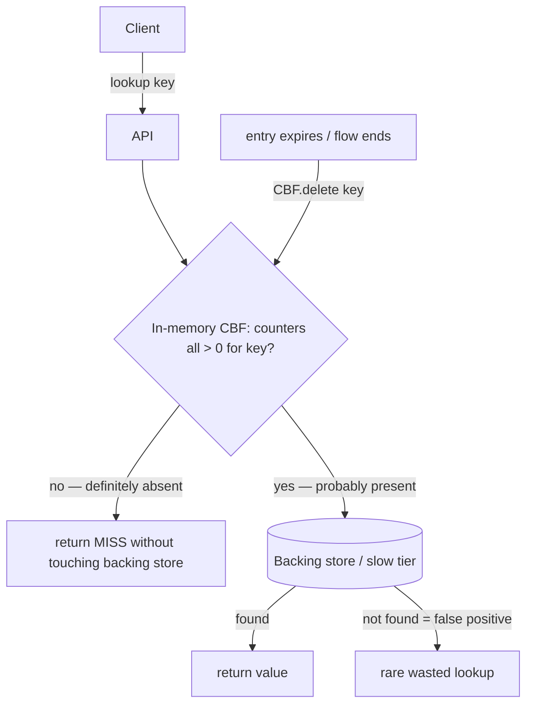
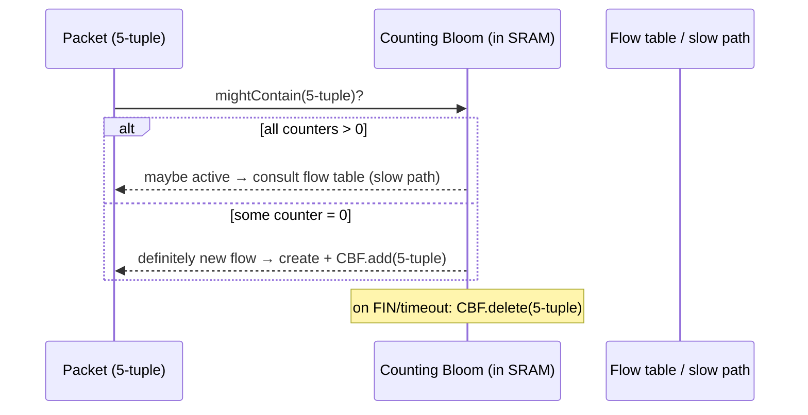
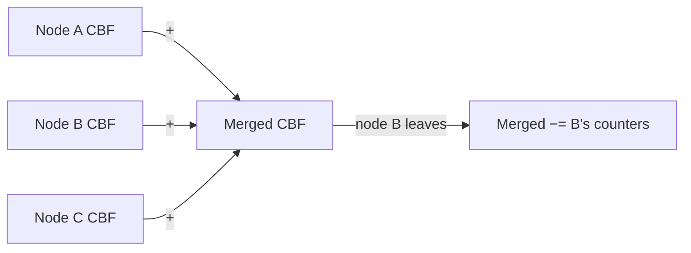

# Counting Bloom Filter — Senior Level

> **One-line summary:** At system scale a counting Bloom filter is the **deletable** negative-lookup gate for sets that **churn** — network flow tables where flows start and end, cache-admission filters whose entries expire, dictionaries and dedup windows with constant insert/remove. The senior work is (1) deciding *whether* you actually need deletion (and so the `4×` memory) versus a rebuildable Bloom filter or a far smaller **cuckoo filter**; (2) sizing the array *and the counter width* for the churn rate; (3) choosing a space-efficient variant — **d-left counting Bloom filters** (≈2× smaller via balanced hashing) or **spectral Bloom filters** (variable-width counters for frequency) — and (4) distributing/merging filters by **counter-wise addition** across nodes.

---

## Table of Contents

1. [Introduction](#introduction)
2. [System Design with Counting Bloom Filters](#system-design-with-counting-bloom-filters)
3. [Network Flow Tables and Per-Flow State](#network-flow-tables-and-per-flow-state)
4. [Cache Admission and Expiry (Churn)](#cache-admission-and-expiry-churn)
5. [Dictionaries, Dedup Windows, and Sliding Membership](#dictionaries-dedup-windows-and-sliding-membership)
6. [Distributed and Mergeable Counting Filters](#distributed-and-mergeable-counting-filters)
7. [Space-Efficient Variants: d-left and Spectral](#space-efficient-variants-d-left-and-spectral)
8. [Cache-Efficiency: Blocked Counting Filters](#cache-efficiency-blocked-counting-filters)
9. [Sizing for Churn: Array and Counter Width](#sizing-for-churn-array-and-counter-width)
10. [Worked Capacity Plan](#worked-capacity-plan)
11. [Comparison with Alternatives](#comparison-with-alternatives)
12. [Code Examples](#code-examples)
13. [Observability](#observability)
14. [Failure Modes](#failure-modes)
15. [Summary](#summary)

---

## Introduction

> Focus: *"How do I architect systems around a deletable membership gate, and which variant?"*

A senior engineer doesn't ask "what is a counting Bloom filter" — they ask "does this set actually shrink, and if so is a CBF, a periodic Bloom rebuild, or a cuckoo filter the right tool, given my memory budget and churn rate?" The recurring pattern matches the Bloom filter's — an **expensive** operation gated by a cheap in-memory membership test — with one decisive addition:

> The membership set **changes in both directions**: items are inserted *and removed* over time, and the filter must reflect removals so its FPR tracks the live set rather than rotting upward.

A plain Bloom filter can't do this — once a key's bits are set, they stay set, so deleted keys keep returning "maybe present" and the FPR only ever climbs. The CBF's counters let the filter follow the set down as well as up. That capability is worth `4×` the memory *only* when the set really churns; a large part of senior judgment is recognizing when it does and when a cheaper option (Bloom-with-rebuild, or cuckoo) wins. This file walks the canonical churn workloads, the distributed/merge story, and the d-left and spectral variants that recover much of the 4× space penalty.

---

## System Design with Counting Bloom Filters



The CBF sits **in front of** the slow tier exactly like a Bloom filter, with one extra arrow: an **eviction/expiry path** that calls `delete(key)` to keep the filter in sync with the live set. The win is the same — avoided expensive operations on clear non-members — but it *persists over time* because deletions stop the filter from saturating. The memory cost (≈`4×` a Bloom filter) is the price of that durability under churn.

---

## Network Flow Tables and Per-Flow State

The textbook hardware/networking use. A router, switch, firewall, or NAT must track **active flows** (a flow ≈ a 5-tuple: src IP, dst IP, src port, dst port, protocol). Flows are constantly **created** (a new connection's SYN) and **destroyed** (FIN, RST, or idle timeout). The membership question — *"is this packet part of a flow I'm tracking?"* — must be answered at **line rate**, in tiny fast SRAM, and must reflect flow teardown so stale flows don't pin the table.

This is precisely a churning set, so a plain Bloom filter is wrong (it can't remove ended flows) and a CBF fits:



- **New flow (SYN):** CBF says "absent" (cheap, in SRAM) → install flow state, `add` the 5-tuple.
- **Existing flow packet:** CBF says "present" → fast-path to the flow's state; a false positive merely sends a genuinely-new packet to the slower exact lookup.
- **Flow teardown (FIN/timeout):** `delete` the 5-tuple so its counters drop, freeing the slot for future flows and keeping the FPR proportional to the *current* active-flow count.

Without deletion the SRAM filter would fill with dead flows and its FPR would creep to 1 within minutes on a busy link. The counters are what make the filter **steady-state** rather than monotonically rotting. Variants of this appear in DDoS mitigation (track/expire suspicious source sets), stateful firewalls, and load-balancer connection tables.

---

## Cache Admission and Expiry (Churn)

CDNs and caches use a "seen-before" filter to fight the **one-hit-wonder** problem (admit an object only on its second request), described for Bloom filters in [`02-bloom-filter/senior.md`](../02-bloom-filter/senior.md). The trouble with a plain Bloom filter there is that the "seen" set must **decay** — entries should age out so the filter reflects a *recent* window, not all history. A plain Bloom filter can't expire entries, so production designs either rotate two filters or use a **counting Bloom filter** so individual entries can be removed:

- **First request:** CBF says "no" → record (`add`), don't cache yet.
- **Second request (within window):** CBF says "yes" → admit to the real cache.
- **Expiry/eviction:** when an object leaves the cache or its admission record ages out, `delete` it from the CBF so the "seen" set tracks a sliding window.

The counters let the seen-set behave like a *current-window* set rather than an ever-growing one, which keeps the FPR bounded and the admission decisions relevant. (Time-decaying and "stable" Bloom-filter variants are alternatives; the CBF is the exact-delete option.) Cross-link: [`02-bloom-filter`](../02-bloom-filter/senior.md) for the rotating-filter alternative.

---

## Dictionaries, Dedup Windows, and Sliding Membership

Any **dictionary with churn** — a membership set where keys are added and removed continuously — is a CBF use case:

- **Deduplication over a sliding window.** Stream processors dedup events seen "in the last N minutes." As events age out of the window, `delete` them from the CBF so the dedup set stays windowed rather than unbounded. (Cross-link: spectral/decaying variants below.)
- **Distributed-systems membership with departures.** Track which keys a node *currently* holds (for routing, gossip, or cache digests) when keys move or expire; deletion keeps each node's published summary accurate as its contents change.
- **In-memory secondary indexes / tombstones.** Approximate "does any live row have this attribute?" filters that must reflect row deletions.
- **Rate-limiting / quota membership** where entries reset each period (delete on reset rather than rebuild).

The unifying signal: **the set's membership shrinks as well as grows, and you want the filter to follow it without a full rebuild.** That's the CBF's niche; if the set only grows, use a Bloom filter; if it churns *and* space is tight, evaluate a cuckoo filter.

---

## Distributed and Mergeable Counting Filters

Like Bloom filters, CBFs **merge** — but via **counter-wise addition** rather than bitwise OR:

```
merged[i] = A[i] + B[i]   (saturating at the max)
```

The merged filter answers membership over the **multiset union** of the two sets: a slot's count is the sum of how many items in each filter used it. This is legal and useful for distributed aggregation — each node builds a local CBF, a coordinator sums them counter-wise, and the merged filter represents the union while *still supporting deletion* of the combined set (you can decrement the merged counters when an item leaves anywhere). Caveats:

- **Saturation on merge.** Summing two near-max counters can overflow; saturate, accepting the same tiny false-positive bias as local overflow.
- **Identical parameters required.** As with Bloom merges, `(m, k, counter-width, seed)` must match exactly; pin them in the serialized header.
- **Subtraction for set difference.** Counter-wise *subtraction* lets you remove an entire node's contribution (`merged[i] −= A[i]`), e.g. when a node leaves the cluster — something OR-merged Bloom filters cannot do. This is a genuine CBF advantage for distributed membership.



So the CBF keeps the Bloom filter's **mergeability** (a property cuckoo filters lack) *and* extends it to subtraction — making it the natural choice for distributed, churning membership where nodes and items both come and go.

---

## Space-Efficient Variants: d-left and Spectral

The plain CBF's `4×` space penalty motivated two important improvements a senior should know.

### d-left Counting Bloom Filter (d-left CBF)

A **d-left CBF** (Bonomi, Mitzenmacher, Panigrahy, Singh, Varghese, 2006) replaces the array-of-counters with a **d-left hash table of small fingerprint cells**, using the "power of d choices" balanced-allocation idea. Each item is placed in one of `d` candidate buckets (the *least loaded*, breaking ties left), storing a short **fingerprint** plus a small per-cell counter. Because d-left hashing keeps bucket loads extremely even (max load `≈ ln ln n / ln d`), the cells can be tiny and there's very little wasted space:

- **~2× smaller** than a standard CBF at the same FPR — roughly halving the `4×` penalty toward `2×`.
- Supports insert, **delete**, and query with the same churn-friendly semantics.
- Trades the CBF's dead-simple array for a more complex table with `d` lookups per op.

It is, in spirit, a precursor to the cuckoo filter (both use fingerprints + balanced placement). When you need a deletable filter smaller than a plain CBF but want a counting-style structure, the d-left CBF is the classic answer.

### Spectral Bloom Filter (SBF)

A **spectral Bloom filter** (Cohen & Matias, 2003) generalizes the CBF from *membership* to **frequency / multiplicity** queries: each counter stores how many times an item was inserted, and a query returns an **estimate of an item's count** (the *minimum* of its `k` counters — the same "take the min" idea as a **Count-Min sketch**, which this topic is closely related to). Key features:

- **Variable-width / compressed counters.** Most counters are tiny; the SBF stores them compactly (e.g. with an index structure over a packed counter string) so it doesn't pay a fixed 4 bits everywhere — recovering space when the count distribution is skewed.
- **Frequency queries**, not just yes/no: "roughly how many times have I seen `x`?" — answered as `min` of `x`'s counters, with a one-sided overestimate bias.
- Supports **insert, delete, and frequency lookup**, making it a deletable frequency sketch.

The relationship to Count-Min: a Count-Min sketch is `k` separate counter arrays (one per hash) and reports the min; a spectral Bloom filter shares one counter array across the `k` hashes (like a CBF) and reports the min. Both give the COUNT-MIN-style frequency estimate; the SBF is the "single shared array" framing.

| Variant | What it adds | Space vs plain CBF | Use case |
|---|---|---:|---|
| Plain CBF (4-bit) | deletion | `1×` (baseline) | churning membership |
| d-left CBF | balanced placement | **~0.5×** | deletion at lower memory |
| Spectral BF | frequency estimates, variable-width counters | varies (often `<1×` on skew) | "how many times seen?" + delete |
| Cuckoo filter | fingerprints + cuckoo hashing | **~0.3×** | minimal-space deletion |

---

## Cache-Efficiency: Blocked Counting Filters

Like a Bloom filter, a large CBF spreads its `k` counters across the whole array, so a query can touch up to `k` cache lines — up to `k` cache misses, made worse because insert/delete are **read-modify-write** (a load *and* a store per counter). The **blocked** technique applies: partition the array into cache-line-sized **blocks**, let the first hash choose a block, and confine the remaining `k−1` counters to that one block. Now every operation touches **one cache line**, a 2–4× latency win on large filters, at the cost of a slightly higher FPR (counters crowd into one block, raising local collision and overflow probability — so you give the block a little more room or one more counter bit).

| Variant | Cache lines / op | Notes |
|---|:---:|---|
| Standard CBF | up to `k` | read-modify-write across `k` lines |
| Blocked CBF | **1** | all `k` counters in one cache-line block |
| d-left CBF | `d` (small) | `d` bucket probes, each one cache line |

For line-rate networking, the counters often live in **SRAM** where the cache-miss concern is replaced by SRAM-width and update-bandwidth concerns; blocking still helps by localizing the read-modify-write.

---

## Sizing for Churn: Array and Counter Width

Sizing a CBF has the Bloom-filter array decision **plus** a counter-width decision driven by the churn pattern.

**Array (`m`, `k`):** size for the **peak concurrent** set size `n_peak` (the high-water mark of *currently present* items), not the cumulative total — because deletions keep the live count bounded. Use `m = −n_peak·ln p/(ln 2)²`, `k = (m/n_peak)·ln 2`.

**Counter width (`c`):** the optimum keeps mean counter `λ = kn/m = ln 2 ≈ 0.69`, so 4 bits suffice in the *static* analysis. But **churn can pile counts** if you ever:
- insert an item more than once before deleting it (multiplicity), or
- delete absent items (underflow protection masks the corruption), or
- merge/sum filters near saturation.

Under heavy, imperfect churn, measure the counter distribution; if a meaningful fraction approaches 15, either fix the churn discipline (delete-once, insert-once) or move to **8-bit counters** (doubling memory to `8×` Bloom) or a **spectral** layout. For clean churn (insert-once, delete-once-when-truly-gone), 4 bits remain ample.

```text
Sizing recipe (churning set):
  n_peak = max concurrent present items
  m = ceil(-n_peak * ln(p) / (ln 2)^2)
  k = round((m/n_peak) * ln 2)
  c = 4 bits (verify counter distribution under real churn; bump to 8 if needed)
  memory = m * c / 8 bytes
```

---

## Worked Capacity Plan

**Scenario:** a stateful firewall tracks active TCP flows on a 100 Gbps link. Peak **concurrent** flows `n_peak = 8,000,000`; flows churn at ~`200,000` new/closed per second. Tolerable false positive `p = 0.1%` (a false positive sends a genuinely-new packet down the exact-lookup slow path — cheap). Budget the CBF.

**Step 1 — array sizing for peak concurrency.**

```
m = −8e6 · ln(0.001) / (ln 2)² = −8e6 · (−6.9078)/0.4805 ≈ 115,000,000 slots
k = (m/n_peak)·ln 2 = 14.378·0.6931 ≈ 10 hashes
```

**Step 2 — counter width.** Clean churn (each flow added once, deleted once on FIN/timeout), so mean counter `λ = ln 2`. `Pr[any counter ≥ 16] ≈ m·λ¹⁶/16! ≈ 115M·10⁻¹⁷ ≈ 10⁻⁹` → never. **4-bit counters.**

**Step 3 — memory.**

```
memory = m · 4 bits = 115e6 · 4 = 460 Mbit ≈ 57.5 MB
```

A plain Bloom filter would be `115M bits ≈ 14.4 MB` — but it *cannot delete ended flows*, so within seconds it would track *cumulative* flows (`200k/s × seconds`), blow past `n_peak`, and its FPR would race to 1. The CBF's 57.5 MB keeps the live set bounded at `n_peak` and the FPR pinned near `0.1%` in steady state. **The 4× memory buys steady-state FPR under churn — the whole reason to use a CBF here.**

**Step 4 — would a cuckoo filter be better?** At `p = 0.1%` a cuckoo filter needs ~`(log₂(1/p)+3)/0.95 ≈ 13.7` bits/flow ≈ `13.7·8e6 ≈ 110 Mbit ≈ 13.7 MB` — about `4×` smaller than the CBF and still deletable. If SRAM is the binding constraint, **the cuckoo filter wins here**; the CBF wins only if you also need counter-wise merge/subtract across line cards or the simpler lock-light update path. This is the exact senior trade-off to articulate.

```text
Cheat formula for churning-membership capacity:
  m            = -n_peak · ln(p) / (ln 2)²
  k            = (m/n_peak) · ln 2
  CBF bytes    = m · counter_bits / 8        (counter_bits = 4 typically)
  cuckoo bytes ≈ n_peak · (log₂(1/p)+3) / (8·load)   (load ≈ 0.95)
  pick CBF if you need merge/subtract or simplicity; cuckoo if space-bound
```

---

## Comparison with Alternatives

| Attribute | Counting Bloom (4-bit) | d-left CBF | Spectral BF | Cuckoo filter | Bloom (rebuild) |
|-----------|:---:|:---:|:---:|:---:|:---:|
| Bits/key @ 1% | ~40 | ~20 | varies (skew) | ~13 | ~10 |
| Delete | **yes** | **yes** | **yes** | **yes** | no (rebuild) |
| Frequency query | rough | rough | **yes** | no | no |
| Mergeable | **yes (+)** | hard | yes | no | yes (OR) |
| Subtractable (remove a node) | **yes (−)** | hard | yes | no | no |
| Insert can fail | no | rare | no | **yes (full table)** | no |
| Cache misses/op | up to k (1 if blocked) | d | varies | 1–2 | k (1 if blocked) |
| Used in | flow tables, cache admission | space-tight delete | decaying counts | TiKV, caches | growing sets |

**When the CBF still wins over cuckoo:** counter-wise **merge and subtract** (distributed, churning membership across nodes), **no insertion-failure mode** under high load, **simple lock-light concurrency** (atomic add/sub), and a path to **frequency** info (spectral). **When cuckoo wins:** raw space at low FPR with deletion and no need for merging.

---

## Code Examples

### Thread-Safe Counting Bloom Filter (atomic counters)

Inserts and deletes are read-modify-write, so naive concurrency needs care. Using one byte per counter lets us use atomic operations; a production packed (4-bit) version would shard locks per word.

#### Go

```go
package main

import (
	"hash/fnv"
	"sync/atomic"
)

const maxCount = 15

type ConcurrentCBF struct {
	counters []uint32 // atomic per-counter (one word each for lock-free RMW)
	m, k     uint64
}

func NewConcurrentCBF(m, k uint64) *ConcurrentCBF {
	return &ConcurrentCBF{counters: make([]uint32, m), m: m, k: k}
}

func base(data []byte) (uint64, uint64) {
	h := fnv.New64a()
	h.Write(data)
	s := h.Sum64()
	return s & 0xffffffff, (s >> 32) | 1
}

func (c *ConcurrentCBF) Add(data []byte) {
	h1, h2 := base(data)
	for i := uint64(0); i < c.k; i++ {
		idx := (h1 + i*h2) % c.m
		for { // CAS loop: saturating increment
			cur := atomic.LoadUint32(&c.counters[idx])
			if cur >= maxCount {
				break
			}
			if atomic.CompareAndSwapUint32(&c.counters[idx], cur, cur+1) {
				break
			}
		}
	}
}

func (c *ConcurrentCBF) Delete(data []byte) {
	h1, h2 := base(data)
	for i := uint64(0); i < c.k; i++ {
		idx := (h1 + i*h2) % c.m
		for { // CAS loop: clamp at 0, skip saturated
			cur := atomic.LoadUint32(&c.counters[idx])
			if cur == 0 || cur >= maxCount {
				break
			}
			if atomic.CompareAndSwapUint32(&c.counters[idx], cur, cur-1) {
				break
			}
		}
	}
}

func (c *ConcurrentCBF) MightContain(data []byte) bool {
	h1, h2 := base(data)
	for i := uint64(0); i < c.k; i++ {
		if atomic.LoadUint32(&c.counters[(h1+i*h2)%c.m]) == 0 {
			return false
		}
	}
	return true
}
```

#### Java

```java
import java.util.concurrent.atomic.AtomicIntegerArray;
import java.nio.charset.StandardCharsets;

public class ConcurrentCBF {
    private static final int MAX = 15;
    private final AtomicIntegerArray counters;
    private final int m, k;

    public ConcurrentCBF(int m, int k) {
        this.m = m;
        this.k = k;
        this.counters = new AtomicIntegerArray(m);
    }

    private long[] base(byte[] d) {
        long h = 0xcbf29ce484222325L;
        for (byte b : d) { h ^= (b & 0xff); h *= 0x100000001b3L; }
        return new long[]{ h & 0xffffffffL, (h >>> 32) | 1L };
    }
    private int idx(long h1, long h2, int i) {
        return (int) (((h1 + (long) i * h2) % m + m) % m);
    }

    public void add(String s) {
        long[] h = base(s.getBytes(StandardCharsets.UTF_8));
        for (int i = 0; i < k; i++) {
            int a = idx(h[0], h[1], i), cur;
            do { cur = counters.get(a); if (cur >= MAX) break; }
            while (!counters.compareAndSet(a, cur, cur + 1));
        }
    }
    public void delete(String s) {
        long[] h = base(s.getBytes(StandardCharsets.UTF_8));
        for (int i = 0; i < k; i++) {
            int a = idx(h[0], h[1], i), cur;
            do { cur = counters.get(a); if (cur == 0 || cur >= MAX) break; }
            while (!counters.compareAndSet(a, cur, cur - 1));
        }
    }
    public boolean mightContain(String s) {
        long[] h = base(s.getBytes(StandardCharsets.UTF_8));
        for (int i = 0; i < k; i++) {
            if (counters.get(idx(h[0], h[1], i)) == 0) return false;
        }
        return true;
    }
}
```

#### Python

```python
import threading
import hashlib


class ConcurrentCBF:
    MAX = 15

    def __init__(self, m, k):
        self.m, self.k = m, k
        self.counters = [0] * m
        # shard locks to reduce contention (one lock per stripe)
        self.locks = [threading.Lock() for _ in range(256)]

    def _base(self, data):
        d = hashlib.blake2b(data, digest_size=8).digest()
        h = int.from_bytes(d, "little")
        return h & 0xFFFFFFFF, (h >> 32) | 1

    def _lock_for(self, idx):
        return self.locks[idx & 0xFF]

    def add(self, item):
        data = item.encode() if isinstance(item, str) else item
        h1, h2 = self._base(data)
        for i in range(self.k):
            idx = (h1 + i * h2) % self.m
            with self._lock_for(idx):
                if self.counters[idx] < self.MAX:
                    self.counters[idx] += 1

    def delete(self, item):
        data = item.encode() if isinstance(item, str) else item
        h1, h2 = self._base(data)
        for i in range(self.k):
            idx = (h1 + i * h2) % self.m
            with self._lock_for(idx):
                if 0 < self.counters[idx] < self.MAX:
                    self.counters[idx] -= 1

    def might_contain(self, item):
        data = item.encode() if isinstance(item, str) else item
        h1, h2 = self._base(data)
        for i in range(self.k):
            if self.counters[(h1 + i * h2) % self.m] == 0:
                return False
        return True
```

**What it does:** makes insert and delete safe under concurrency using per-counter CAS loops (Go/Java) or striped locks (Python), each loop performing a **saturating** increment / **clamped** decrement so concurrent churn never wraps or underflows.
**Run:** `go run main.go` | `javac ConcurrentCBF.java && java ConcurrentCBF` | `python ccbf.py`

---

## Worked System: Sliding-Window Stream Dedup

A canonical senior design: a stream processor must suppress duplicate events seen **within the last 10 minutes**, across billions of events, without storing event IDs.

```mermaid
sequenceDiagram
    participant E as Event (id)
    participant CBF as Counting Bloom (window membership)
    participant W as Window expiry timer
    E->>CBF: mightContain(id)?
    alt present
        CBF-->>E: drop as duplicate
    else absent
        CBF-->>E: emit; CBF.add(id); schedule delete at now+10min
    end
    Note over W: at expiry: CBF.delete(id)
```

**Why a CBF.** The dedup set is a **sliding window** — IDs enter and *must leave* after 10 minutes — so the membership set churns. A plain Bloom filter would accumulate all IDs ever seen and saturate; a CBF lets each ID be `delete`d when its window expires, keeping the filter sized to the *window's* ID count rather than all history. A false positive drops a genuinely-new event (rare, tolerable data loss tuned by `p`); a false negative (emitting a true duplicate) is impossible as long as you delete only inserted IDs and counters don't overflow.

**Tuning.** Size `m`/`k` for the **peak IDs-in-window** count; verify the counter distribution under the real arrival/expiry pattern stays well below 15 (clean insert-once/delete-once keeps mean at `ln 2`). If the window's peak cardinality is unknown or spiky, combine with a **rebuild** safety net or use a **spectral** layout if you also want per-ID counts.

---

## Operational Lifecycle and Anti-Patterns

A production CBF needs a lifecycle plan even though it can delete:

- **Steady-state churn (flow tables, dedup windows).** Insert on arrival, delete on departure/expiry; the live count stays near `n_peak`. Monitor the counter distribution and fill ratio — drift signals a churn-discipline bug (deleting absent items, double-inserts).
- **Periodic reconciliation.** Because tiny errors (a missed delete, a saturated counter) accumulate over months, schedule an occasional **rebuild from the source of truth** to reset drift — the CBF's analog of garbage collection.
- **Graceful overflow.** Accept that saturated counters are permanent; they only add false positives. If too many saturate, the array is undersized or churn is dirty — resize or fix discipline.

**Anti-patterns:**
- **Using a CBF for a set that only grows.** You're paying `4×` for an unused delete — use a Bloom filter.
- **Deleting on a "yes" without verifying.** A false-positive "yes" can trick you into deleting a never-inserted item, underflowing a real member's counter → false negative. Only delete items you *know* you inserted (or confirm against the source of truth).
- **Ignoring the cuckoo alternative when space-bound.** At low FPR with deletion, a cuckoo filter is ~3× smaller; defaulting to a CBF wastes memory.
- **Unblocked multi-GB CBF on a hot path.** `k` read-modify-write cache misses per op dominate latency — use a blocked layout.

---

## Observability

| Metric | Why it matters | Alert threshold |
|--------|----------------|-----------------|
| `cbf_fpr_observed` (false-positive checks ÷ negative lookups) | Detects undersized/overfilled filter | > 2× target FPR |
| `cbf_fill_ratio` (counters > 0 ÷ `m`) | Should hover near 0.5 at peak `n`; > 0.6 means overfilled | > 0.6 |
| `cbf_present_count` (live `n` estimate) | Confirms deletes are keeping the set bounded; a steady climb means missed deletes | trending up |
| `cbf_saturated_counters` (counters at max) | Overflow indicator; many saturated = undersized or dirty churn | rising |
| `cbf_max_counter` / counter histogram | Validates 4-bit suffices; mass near 15 = widen counters | mass > 12 |
| `cbf_delete_underflow_attempts` | Counts decrements of `0` counters = deleting absent items (a bug) | > 0 sustained |
| `cbf_memory_bytes` | Capacity planning | > budget |

The two CBF-specific signals beyond a Bloom filter are the **counter histogram** (validates the 4-bit choice and detects churn drift) and **underflow attempts** (catches the deleting-absent-items bug before it causes false negatives). Wire the observed FPR by sampling "present" answers the backing store then reports absent — that ratio *is* the realized FPR.

---

## Failure Modes

- **Missed deletes → silent overfill.** If departures aren't reliably `delete`d (lost FIN, crashed expiry timer), the live count climbs past `n_peak` and the FPR creeps up — exactly the Bloom-filter rot the CBF was meant to avoid. Mitigation: idempotent expiry, periodic rebuild, monitor `present_count`.
- **Deleting absent items → false negatives.** The most dangerous CBF bug: underflowing counters that a *real* member needs. Mitigation: delete only confirmed-inserted items; alert on underflow attempts.
- **Counter saturation → creeping FPR.** Dirty churn or undersizing pins counters at max; they never drop, raising fill and FPR. Mitigation: resize, widen counters, fix churn discipline.
- **Merge mismatch.** Summing CBFs with different `(m, k, width, seed)` yields garbage. Mitigation: version and pin parameters in the header; refuse mismatched merges.
- **Concurrency races.** Non-atomic read-modify-write loses increments/decrements, desyncing counters from reality → eventual false negatives. Mitigation: atomic add/sub (CAS) or striped locks.
- **Cache/SRAM update pressure.** Read-modify-write per counter across `k` lines doubles memory traffic vs a Bloom filter's set-bit. Mitigation: blocked layout; d-left for fewer, denser probes.

---

## Security Considerations

CBFs in untrusted-input paths inherit the Bloom filter's attack surface plus deletion-specific risks:

- **Adversarial saturation.** An attacker who can drive inserts (or learns the hash seeds) can push counters to max, pinning slots "set" and inflating the FPR — a deletion-resistant DoS (you can't decrement a saturated counter). **Mitigation:** keyed hashes (SipHash) with a secret per-deployment seed, rate-limit inserts, bound `n`.
- **Adversarial deletion (false-negative injection).** If an attacker can trigger `delete` for items they didn't insert, they can underflow counters and **evict real members** — turning a membership filter into a tool for hiding entries (e.g. bypassing a "seen bad packet" set). **Mitigation:** authenticate deletes; delete only from a trusted source of truth, never on a raw "yes."
- **Membership/frequency inference.** Spectral variants leak approximate counts, a stronger information leak than membership. **Mitigation:** don't ship raw filters of sensitive sets; salt/keyed hashing.

The deletion capability is a *double-edged* security property: it's the feature, but it also gives an attacker who controls the delete path a way to manufacture false negatives — something a plain Bloom filter, lacking delete, cannot suffer.

---

## Summary

At system scale the counting Bloom filter is the **deletable** cousin of the Bloom filter, earning its `4×` memory only when the membership set **churns**: network **flow tables** (flows start and end), **cache-admission** filters with expiry, **sliding-window dedup**, and **dictionaries with departures**. The counters let the FPR track the live set *down* as well as up — the property a plain Bloom filter can't provide. Senior judgment is: confirm you truly need deletes (else use a Bloom filter), size the array for **peak concurrency** and verify 4-bit counters suffice under real churn, pick a **space-efficient variant** (d-left CBF ~2× smaller, spectral for frequency) when the 4× hurts, and reach for a **cuckoo filter** when minimal space with deletion is paramount and you don't need counter-wise **merge/subtract** — the distributed-membership advantage that, with simple lock-light concurrency and no insertion-failure mode, keeps the CBF relevant.

---

## Senior Takeaways

- The CBF is the **deletable "no" gate** for **churning** sets; on growing-only sets a Bloom filter is 4× cheaper.
- **4-bit counters suffice** under clean churn (mean `ln 2`); verify the counter histogram and widen only if churn is dirty.
- Size the array for **peak concurrency**, not cumulative inserts — deletions keep the live count bounded.
- **Merge by counter-wise add, subtract to remove a node** — the CBF's distributed superpower over cuckoo filters.
- Know the variants: **d-left CBF** (~2× smaller deletion), **spectral BF** (deletable frequency), and **cuckoo** (~3× smaller deletion, no easy merge) — choose by space vs mergeability.
- The two CBF-specific failure modes are **missed deletes** (silent overfill) and **deleting absent items** (false negatives) — monitor and authenticate the delete path.

---

Next step: [professional.md](./professional.md) — the Poisson counter-distribution and overflow-probability proof, the 4-bit counter-width justification, the deletion-correctness (no-false-negative) proof, and the exact space comparison to Bloom and the AMQ lower bound.
