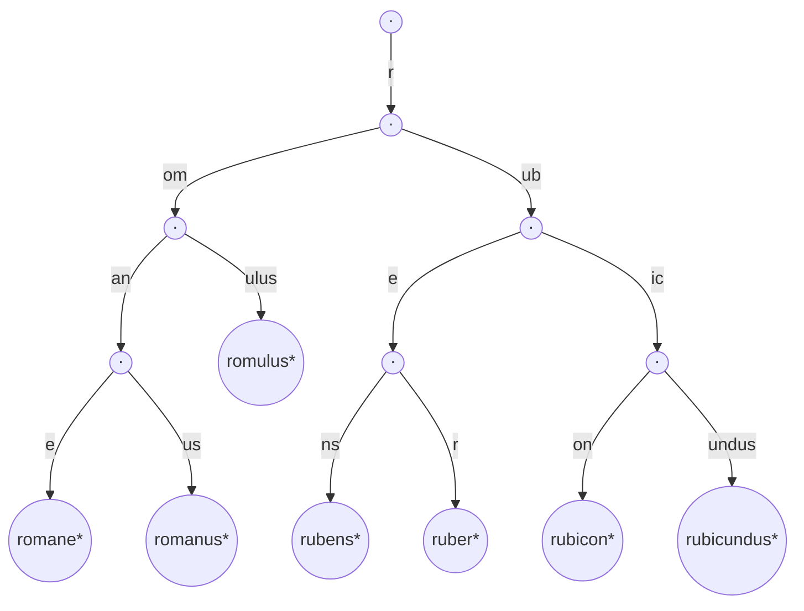

# PATRICIA Trie / Radix Tree (Compressed Trie) — Junior Level

> **Read time: ~40 minutes** · **Audience:** Students who have already met the plain trie (see [`09-trees/05-trie`](../../09-trees/05-trie/junior.md)) and want the memory-efficient variant that powers IP routing tables, in-memory database indexes, and Ethereum's state storage.

A **radix tree** — also called a **compressed trie**, **compact prefix tree**, or **radix trie** — is a plain [trie](../../09-trees/05-trie/junior.md) with one structural optimization: **every chain of single-child nodes is collapsed into a single edge labeled with a whole string** instead of a single character. The **PATRICIA trie** (Practical Algorithm To Retrieve Information Coded In Alphanumeric, Donald R. Morrison, 1968) is the **binary** flavor of the same idea: each node stores a *skip count* telling you which bit to test next, so the tree never wastes a node on a position where no key branches.

Why does this matter? A plain trie stores the word `"international"` in **13 nodes**, twelve of which have exactly one child and exist only to spell out letters nobody ever branches on. A radix tree stores the same word in **one node** with the edge label `"international"`. On real datasets — IP prefixes, URLs, dictionary words — this is a **10× to 50× memory reduction** while keeping every operation at **O(L)**, where `L` is the key length.

This document teaches the radix tree so concretely that by the end you can implement insert and search from memory in three languages, explain exactly how an insert *splits* an edge, and recognize the structure in the Linux kernel's routing table and in DuckDB's adaptive radix tree index.

---

## Table of Contents

1. [Introduction — Why Compress a Trie?](#introduction)
2. [Prerequisites](#prerequisites)
3. [Glossary](#glossary)
4. [Core Concepts — Path Compression](#core-concepts)
5. [Big-O Summary](#big-o-summary)
6. [Real-World Analogies](#analogies)
7. [Pros and Cons](#pros-and-cons)
8. [Step-by-Step Walkthrough — Insert and Edge Splitting](#walkthrough)
9. [Code Examples — Go, Java, Python](#code-examples)
10. [Coding Patterns — Search, Insert, Prefix](#patterns)
11. [Error Handling](#errors)
12. [Performance Tips](#performance-tips)
13. [Best Practices](#best-practices)
14. [Edge Cases](#edge-cases)
15. [Common Mistakes](#common-mistakes)
16. [Cheat Sheet](#cheat-sheet)
17. [Visual Animation Reference](#animation)
18. [Summary](#summary)
19. [Further Reading](#further-reading)

---

<a name="introduction"></a>
## 1. Introduction — Why Compress a Trie?

If you have read the [plain trie chapter](../../09-trees/05-trie/junior.md), you know its headline property: **search, insert, and prefix queries all run in O(L)**, where `L` is the length of the query string, **independent of how many keys are stored**. That property is wonderful. The cost is **memory**: a plain trie allocates **one node per character of every key**.

Consider inserting the single word `"international"` into an empty plain trie:

```
(root) → i → n → t → e → r → n → a → t → i → o → n → a → l*
```

Thirteen nodes. Twelve of them are **single-child** nodes that carry no branching information at all — they exist purely to spell out the letters. If each node is a 26-pointer array (208 bytes on a 64-bit machine), that one word costs ~2.7 KB.

The **radix tree** observes that a chain of single-child nodes is redundant. There is no decision to make while walking `i → n → t → e → r → n → a → t → i → o → n → a`; you only branch when a second key diverges. So **collapse the whole chain into one edge** and label that edge with the string `"international"`:

```
(root) ──"international"──> (•*)
```

One node, one edge. Now insert `"internet"`. The two words share the prefix `"intern"` and diverge at the 7th character (`a` vs `e`). The radix tree **splits** the existing edge at the divergence point:

```
(root) ──"intern"──> (•) ──"ational"──> (•*)
                          └──"et"──────> (•*)
```

The shared prefix `"intern"` is stored **once**. This is the entire idea: **store branching points as nodes, store the runs between them as edge labels**. The number of nodes is bounded by the number of keys, not the total number of characters.

The structure has many names because it was reinvented in many fields:

- **Radix tree / radix trie** — the database and Linux-kernel name.
- **Compressed trie / compact prefix tree** — the textbook name.
- **PATRICIA trie** — Morrison's 1968 *binary* version, where keys are bitstrings and each node stores a bit index to skip to. PATRICIA is the canonical structure for **IP routing** (longest-prefix match over 32-bit addresses).
- **Adaptive Radix Tree (ART)** — Leis, Kemper & Neumann's 2013 cache-optimized version used as the main-memory index in HyPer and DuckDB.

Today radix trees power:

- **IP routing / packet forwarding** — the Linux kernel FIB (`fib_trie`), BSD routing tables, and most hardware routers. This is the *canonical* application: **longest-prefix match**.
- **In-memory database indexes** — ART in HyPer, DuckDB, and many key-value stores.
- **HTTP routers** — Go's `httprouter`, `chi`, Gin all use radix trees to match URL paths.
- **String dictionaries and autocomplete** — memory-tight prefix lookup.
- **Ethereum** — the Merkle-Patricia trie that stores world state.

By the end of this document you will understand the structure well enough to read `net/ipv4/fib_trie.c`.

---

<a name="prerequisites"></a>
## 2. Prerequisites

To follow comfortably you need:

1. **The plain trie.** Read [`09-trees/05-trie/junior.md`](../../09-trees/05-trie/junior.md) first. The radix tree is *the plain trie plus path compression*; everything that document teaches (the terminal flag, O(L) walks, prefix queries) carries over unchanged.
2. **Strings as character sequences.** You know `"cat"[0] == 'c'`, substring slicing `s[2:]`, and that `len(s)` is the character count.
3. **Trees and recursion.** Root, node, child, leaf, edge — and how to walk a tree iteratively or recursively.
4. **Asymptotic notation (Big-O).** You can say "this is O(L)" where `L` is the key length.
5. **Hash maps.** We compare the radix tree to a hash set constantly. `HashMap.get(key)` is O(L) average because hashing reads the whole key.

If the plain trie is unfamiliar, stop and read it now — this chapter assumes it.

---

<a name="glossary"></a>
## 3. Glossary

| Term | Definition |
|---|---|
| **Radix tree / compressed trie** | A trie in which chains of single-child nodes are merged into one edge labeled with a string. |
| **Edge label** | The (possibly multi-character) string written on an edge. Walking the edge consumes that whole string. In a plain trie every edge label is exactly one character. |
| **PATRICIA trie** | Morrison's 1968 *binary* radix tree. Keys are bitstrings; each node stores a **skip/bit index** so it can jump past bits where no key branches. |
| **Skip bits / bit index** | The position of the next bit a PATRICIA node tests. Compresses runs of identical bits. |
| **Split** | The insert operation that breaks one edge into two when a new key diverges in the middle of an existing edge label. |
| **Merge** | The delete-side inverse of split: when a node drops to one child, fold its edge into the child's edge. |
| **Longest-prefix match (LPM)** | Find the *deepest* stored key that is a prefix of the query. The canonical operation for IP routing. |
| **isEnd / terminal flag** | A boolean marking that a stored key ends at this node. Still required, exactly as in a plain trie. |
| **Common prefix** | The longest leading run shared by two strings; the split point. |
| **ART** | Adaptive Radix Tree (2013) — a byte-wise radix tree whose node *type* (Node4 / Node16 / Node48 / Node256) adapts to fan-out for cache efficiency. Covered in `senior.md`. |
| **Radix r** | The branching base. r = 2 → binary (PATRICIA); r = 256 → byte-wise (ART, Linux). |

---

<a name="core-concepts"></a>
## 4. Core Concepts — Path Compression

### 4.1 The single invariant that defines a radix tree

A radix tree stores a set of strings such that:

> **Concatenating the edge labels along the path from the root to any node spells the prefix that node represents — and no node (except the root and terminal leaves) has fewer than two children.**

The second clause is the whole difference from a plain trie. A plain trie allows single-child internal nodes; a radix tree **forbids** them (a terminal node is exempt — it may have one child if a stored key is a prefix of another). Whenever an operation would create a single-child internal node, you must **merge** it away.

### 4.2 Path compression in one picture

Insert `"romane"`, `"romanus"`, `"romulus"` into a plain trie versus a radix tree:

```
Plain trie (16 nodes)          Radix tree (5 nodes)
(root)                         (root)
  │r                              │"rom"
 (r)                            (rom)
  │o                            /    \
 (ro)                       "an"      "ulus"*
  │m                         /  \
 (rom)                    "e"*   "us"*
 /    \
... 13 more single-child
nodes spelling the rest
```

The radix tree has **one node per branching point** (`rom`, `roman`), one node per terminal (`romane`, `romanus`, `romulus`), and the root. Five nodes total instead of sixteen. The shared run `"rom"` is stored exactly once, as an edge label.

### 4.3 Operations are still O(L) walks

The three primary operations look almost identical to the plain trie, except you compare **edge labels** (strings) instead of single characters:

- **search(key)** — from the root, repeatedly find the child whose edge label matches the next run of `key`; consume that run; stop when `key` is exhausted. Return that node's `isEnd`.
- **insert(key)** — walk as far as the labels match. If you stop *in the middle* of an edge label, **split** the edge at the divergence point and attach the new branch.
- **startsWith(prefix)** — like search, but the prefix may end *inside* an edge label, which still counts as a match.

Each operation consumes the key one run at a time, so the total work is **O(L)** — the same as a plain trie, because the sum of all edge-label lengths along a path equals the path's character depth.

### 4.4 The terminal flag is still non-negotiable

Just as in the plain trie, one stored key can be a prefix of another (`"roman"` and `"romane"`). The path to `"roman"` may continue down to `"romane"`, so you cannot use "is this a leaf?" to decide whether `"roman"` is stored. You **must** keep an `isEnd` boolean on each node.

### 4.5 PATRICIA — the binary special case

When keys are **bitstrings** (IP addresses, hashes), the radix tree's alphabet is `{0, 1}` and we call it a **PATRICIA trie**. Morrison's insight: even after compression, a binary radix tree can store, *inside each node*, the **bit index** of the next position where keys actually differ — a "skip count". Instead of walking bit by bit, you **jump** directly to the next decision bit. This makes IP-address lookup (32 or 128 bits) extremely fast and compact. We cover PATRICIA bit-skipping in detail in [`middle.md`](./middle.md).

### 4.6 Radix r — choosing the branching base

- **r = 2 (binary)** — PATRICIA. One bit per decision. Used in IP routing.
- **r = 256 (byte-wise)** — one byte per decision. Used by ART, Linux `fib_trie` (level-compressed), and most string radix trees.
- **r = 16 (nibble)** — Ethereum's Merkle-Patricia trie uses hex nibbles.

Larger radix → shorter trees but wider nodes. ART's clever trick is to make the **node width adapt** to how many children actually exist. More on that in `senior.md`.

---

<a name="big-o-summary"></a>
## 5. Big-O Summary

Let `L` = length of the key (in characters or bits), `N` = number of stored keys, `Σ` = alphabet size.

| Operation | Time | Space added | Notes |
|---|---|---|---|
| **Insert(key)** | O(L) | O(L) per new key (≤ 2 new nodes per insert) | A split adds at most 2 nodes |
| **Search(key)** | O(L) | O(1) | Independent of N |
| **StartsWith(prefix)** | O(L) | O(1) | Prefix may end mid-edge |
| **Delete(key)** | O(L) | frees ≤ 2 nodes | May trigger a merge |
| **Longest-prefix match** | O(L) | O(1) | Track deepest terminal on the way down |
| **Total nodes** | — | **O(N)** | At most `2N − 1` nodes for `N` keys |
| **Total space** | — | O(N + total key chars) | vs O(total key chars × Σ) for plain trie |

The **O(N) node bound** is the radix tree's defining advantage and is proved formally in [`professional.md`](./professional.md). Intuition: every internal node is a *branching* point, and a binary-style tree with `N` leaves has at most `N − 1` branching nodes, so at most `2N − 1` nodes total — **independent of how long the keys are**. A plain trie has no such bound; its node count grows with the total number of characters.

**Concrete comparison.** Storing one million random URLs (average 60 characters):

- **Plain trie**, 128-slot ASCII array children: tens of gigabytes — one node per character × 128 pointers.
- **Radix tree**, map children: a few hundred megabytes — one node per branching point.
- **ART** (`senior.md`): tens of megabytes — adaptive node sizing plus path compression.

---

<a name="analogies"></a>
## 6. Real-World Analogies

### 6.1 A road map with named highways

A plain trie is a map where every single intersection — even ones where the road just continues straight — is drawn as a junction. A radix tree only draws a junction where roads actually **fork**, and labels the straight stretch between forks with the highway name ("take I-90 for 200 miles, then fork"). You skip past everything that has no decision.

### 6.2 A table of contents that skips empty chapters

Imagine an index that says "Section 4.7.3.1" but every level until 4.7.3 has exactly one sub-entry. A compressed index just writes "4.7.3.1" as one entry. The radix tree compresses the same way: it skips levels where there is no choice.

### 6.3 ZIP codes / area codes (longest-prefix match)

Postal routing is the perfect analogy for **longest-prefix match**. A piece of mail to `100-0001` is routed by the most specific facility whose prefix matches: maybe a regional hub handles all of `10____`, but a local office handles `1000__`. You always pick the **deepest (most specific)** matching prefix. That is exactly what an IP router does with a destination address against its routing table — and exactly what a radix tree answers in O(L).

### 6.4 A filing cabinet that merges single-folder drawers

If a drawer has only one folder, and that folder has only one sub-folder, a tidy clerk merges them into a single labeled folder. The radix tree is that tidy clerk applied to a trie.

---

<a name="pros-and-cons"></a>
## 7. Pros and Cons

### Pros

- **O(N) node count**, independent of key length — the headline win over a plain trie.
- **10×–50× less memory** than a plain trie on real datasets (URLs, IP prefixes, dictionary words).
- **All trie operations remain O(L)** — search, insert, prefix, delete.
- **Native longest-prefix match** — the basis of IP routing; no extra machinery needed.
- **Better cache behavior** than a plain trie: fewer nodes means fewer pointer chases per lookup.
- **Sorted iteration for free**, just like a plain trie (DFS in label order).
- **No hashing** — immune to hash-collision denial-of-service.

### Cons

- **More complex code.** Edge splitting (insert) and edge merging (delete) are fiddlier than the plain trie's one-character-at-a-time loop.
- **Slower than a hash table for pure exact-match** at modest scale — each step is a pointer chase plus a substring compare, versus one hash computation.
- **Edge-label storage choices matter.** Storing labels as full strings vs. `(offset, length)` slices into the original keys changes the memory profile significantly.
- **Still cache-unfriendly in the naive pointer layout.** ART and Linux's level-compressed trie exist precisely to fix this (`senior.md`).
- **Not a substring index.** For "find pattern anywhere in text", use a [suffix tree / suffix automaton](../../09-trees/05-trie/middle.md), not a radix tree.

**When to use:** prefix-heavy keys (IPs, URLs, paths), longest-prefix match, tight memory budgets, in-memory DB indexes.
**When NOT to use:** pure exact-match on short keys (use a hash set), substring search (use a suffix structure), tiny datasets (a plain trie or even a sorted array is simpler).

---

<a name="walkthrough"></a>
## 8. Step-by-Step Walkthrough — Insert and Edge Splitting

Let's build a radix tree by inserting `"romane"`, `"romanus"`, `"romulus"`, `"rubens"`, `"ruber"`, `"rubicon"`, `"rubicundus"` — the classic example from Wikipedia. Watch how each insert either follows existing labels, splits an edge, or starts a fresh branch.

**Initial state:** just the root, no children.

```
(root)
```

### Insert "romane"

No child starts with `'r'`. Create a child with the whole word as its edge label, mark terminal.

```
(root) ──"romane"──> (•*)
```

### Insert "romanus"

Walk from root: the child labeled `"romane"` shares the prefix `"roman"` with `"romanus"`, then diverges (`e` vs `u`) at position 5. **Split** the edge `"romane"` at position 5:

1. Create a new branching node for the shared part `"roman"`.
2. The old node keeps the suffix `"e"` and stays terminal.
3. Add a new child `"us"` (terminal) for the new key.

```
(root) ──"roman"──> (•) ──"e"──> (•*)   [romane]
                        └─"us"──> (•*)   [romanus]
```

This is the **edge split**: one edge became two, with a new branching node in the middle. We did **not** re-store `"roman"`.

### Insert "romulus"

Walk from root: the edge `"roman"` shares only `"rom"` with `"romulus"` (then `a` vs `u` at position 3). Split `"roman"` at position 3:

```
(root) ──"rom"──> (•) ──"an"──> (•) ──"e"──> (•*)   [romane]
                     │              └─"us"─> (•*)   [romanus]
                     └─"ulus"──────────────> (•*)   [romulus]
```

### Insert "rubens"

Shares only `"r"` with the `"rom"` edge. Split `"rom"` at position 1:

```
(root) ──"r"──> (•) ──"om"──> (•) ──"an"──> (•) ──"e"──> (•*)
                   │             │              └"us"─> (•*)
                   │             └"ulus"──────────────> (•*)
                   └"ubens"────────────────────────────> (•*)
```

### Insert "ruber", "rubicon", "rubicundus"

These all share `"rub"`. Inserting them splits the `"ubens"` edge into `"ub"` then branches `"ens"`, `"er"`, and `"ic"` (which itself later splits into `"on"` and `"undus"`). The final tree:



Seven keys, **thirteen nodes** (`2N − 1`). A plain trie of the same words would need dozens of single-child nodes.

### Query: `search("romane")`

Walk `"rom"` → `"an"` → `"e"`, exhausting the key exactly at a terminal node. **Found.**

### Query: `search("roman")`

Walk `"rom"` → `"an"`, exhausting the key at the `"roman"` branching node. Its `isEnd` is **false** (we never inserted `"roman"`). **Not found** — but `startsWith("roman")` would return **true**.

### Query: longest-prefix match for `"rubicund"`

Walk `"r"` → `"ub"` → `"ic"`, then try `"undus"` but the query ends after `"und"`. The deepest **terminal** node we passed is... none below `"ic"` along this path is terminal except the leaves, and we didn't reach one. So the longest stored prefix is whatever terminal we last saw — in IP routing this is exactly how a default route or a less-specific prefix gets selected. We will make LPM precise in `middle.md`.

Every operation took O(L) steps — proportional to the query length, never to the number of stored keys.

---

<a name="code-examples"></a>
## 9. Code Examples — Go, Java, Python

Below is a complete byte/character radix tree with `insert`, `search`, and `startsWith`. Children are stored in a map keyed by the **first character** of each edge label, so finding the right child is O(1). The core trick is `commonPrefixLen`, which finds where two strings diverge.

### 9.1 Go

```go
package radix

// Node is a radix-tree node. The edge label leading INTO this node is stored
// on the node itself for simplicity. children is keyed by the first byte of
// each child's edge label.
type Node struct {
	label    string           // edge label leading into this node ("" for root)
	children map[byte]*Node
	isEnd    bool
}

type RadixTree struct{ root *Node }

func New() *RadixTree {
	return &RadixTree{root: &Node{children: map[byte]*Node{}}}
}

// commonPrefixLen returns the length of the longest common prefix of a and b.
func commonPrefixLen(a, b string) int {
	n := len(a)
	if len(b) < n {
		n = len(b)
	}
	i := 0
	for i < n && a[i] == b[i] {
		i++
	}
	return i
}

func (t *RadixTree) Insert(key string) {
	insertInto(t.root, key)
}

func insertInto(n *Node, key string) {
	if key == "" {
		n.isEnd = true
		return
	}
	head := key[0]
	child, ok := n.children[head]
	if !ok {
		// No matching child: attach the whole remaining key as a new leaf edge.
		n.children[head] = &Node{label: key, isEnd: true, children: map[byte]*Node{}}
		return
	}
	cp := commonPrefixLen(child.label, key)
	if cp == len(child.label) {
		// The child's full label matched; descend with the remainder.
		insertInto(child, key[cp:])
		return
	}
	// Partial match: SPLIT the child's edge at position cp.
	split := &Node{label: child.label[:cp], children: map[byte]*Node{}}
	child.label = child.label[cp:]               // child keeps the suffix
	split.children[child.label[0]] = child        // old child hangs under split
	n.children[head] = split                       // split replaces child
	if cp == len(key) {
		split.isEnd = true                         // the new key ends at the split
	} else {
		rest := key[cp:]
		split.children[rest[0]] = &Node{label: rest, isEnd: true, children: map[byte]*Node{}}
	}
}

func (t *RadixTree) Search(key string) bool {
	n := walk(t.root, key)
	return n != nil && n.isEnd
}

func (t *RadixTree) StartsWith(prefix string) bool {
	return walkPrefix(t.root, prefix)
}

// walk returns the node whose path spells exactly `key`, or nil.
func walk(n *Node, key string) *Node {
	for key != "" {
		child, ok := n.children[key[0]]
		if !ok {
			return nil
		}
		cp := commonPrefixLen(child.label, key)
		if cp < len(child.label) {
			return nil // diverged inside an edge -> exact key not present
		}
		key = key[cp:]
		n = child
	}
	return n
}

// walkPrefix returns true if `prefix` is a prefix of some stored key.
func walkPrefix(n *Node, prefix string) bool {
	for prefix != "" {
		child, ok := n.children[prefix[0]]
		if !ok {
			return false
		}
		cp := commonPrefixLen(child.label, prefix)
		if cp == len(prefix) {
			return true // prefix consumed (possibly mid-edge) -> match
		}
		if cp < len(child.label) {
			return false
		}
		prefix = prefix[cp:]
		n = child
	}
	return true
}
```

### 9.2 Java

```java
import java.util.HashMap;
import java.util.Map;

public final class RadixTree {

    private static final class Node {
        String label;                       // edge label leading into this node
        Map<Character, Node> children = new HashMap<>();
        boolean isEnd;
        Node(String label) { this.label = label; }
    }

    private final Node root = new Node("");

    private static int commonPrefixLen(String a, String b) {
        int n = Math.min(a.length(), b.length());
        int i = 0;
        while (i < n && a.charAt(i) == b.charAt(i)) i++;
        return i;
    }

    public void insert(String key) { insertInto(root, key); }

    private void insertInto(Node n, String key) {
        if (key.isEmpty()) { n.isEnd = true; return; }
        char head = key.charAt(0);
        Node child = n.children.get(head);
        if (child == null) {
            Node leaf = new Node(key);
            leaf.isEnd = true;
            n.children.put(head, leaf);
            return;
        }
        int cp = commonPrefixLen(child.label, key);
        if (cp == child.label.length()) {
            insertInto(child, key.substring(cp));
            return;
        }
        // Split the edge at position cp.
        Node split = new Node(child.label.substring(0, cp));
        child.label = child.label.substring(cp);
        split.children.put(child.label.charAt(0), child);
        n.children.put(head, split);
        if (cp == key.length()) {
            split.isEnd = true;
        } else {
            String rest = key.substring(cp);
            Node leaf = new Node(rest);
            leaf.isEnd = true;
            split.children.put(rest.charAt(0), leaf);
        }
    }

    public boolean search(String key) {
        Node n = walk(key);
        return n != null && n.isEnd;
    }

    public boolean startsWith(String prefix) {
        Node n = root;
        while (!prefix.isEmpty()) {
            Node child = n.children.get(prefix.charAt(0));
            if (child == null) return false;
            int cp = commonPrefixLen(child.label, prefix);
            if (cp == prefix.length()) return true;      // consumed, maybe mid-edge
            if (cp < child.label.length()) return false;
            prefix = prefix.substring(cp);
            n = child;
        }
        return true;
    }

    private Node walk(String key) {
        Node n = root;
        while (!key.isEmpty()) {
            Node child = n.children.get(key.charAt(0));
            if (child == null) return null;
            int cp = commonPrefixLen(child.label, key);
            if (cp < child.label.length()) return null;  // diverged mid-edge
            key = key.substring(cp);
            n = child;
        }
        return n;
    }
}
```

### 9.3 Python

```python
class _Node:
    __slots__ = ("label", "children", "is_end")

    def __init__(self, label=""):
        self.label = label                 # edge label leading into this node
        self.children = {}                 # first char -> _Node
        self.is_end = False


def _common_prefix_len(a: str, b: str) -> int:
    n = min(len(a), len(b))
    i = 0
    while i < n and a[i] == b[i]:
        i += 1
    return i


class RadixTree:
    def __init__(self):
        self.root = _Node("")

    def insert(self, key: str) -> None:
        self._insert(self.root, key)

    def _insert(self, node: _Node, key: str) -> None:
        if key == "":
            node.is_end = True
            return
        head = key[0]
        child = node.children.get(head)
        if child is None:
            leaf = _Node(key)
            leaf.is_end = True
            node.children[head] = leaf
            return
        cp = _common_prefix_len(child.label, key)
        if cp == len(child.label):
            self._insert(child, key[cp:])
            return
        # Split the edge at position cp.
        split = _Node(child.label[:cp])
        child.label = child.label[cp:]
        split.children[child.label[0]] = child
        node.children[head] = split
        if cp == len(key):
            split.is_end = True
        else:
            rest = key[cp:]
            leaf = _Node(rest)
            leaf.is_end = True
            split.children[rest[0]] = leaf

    def search(self, key: str) -> bool:
        n = self._walk(key)
        return n is not None and n.is_end

    def starts_with(self, prefix: str) -> bool:
        n = self.root
        while prefix:
            child = n.children.get(prefix[0])
            if child is None:
                return False
            cp = _common_prefix_len(child.label, prefix)
            if cp == len(prefix):
                return True              # consumed, possibly mid-edge
            if cp < len(child.label):
                return False
            prefix = prefix[cp:]
            n = child
        return True

    def _walk(self, key: str):
        n = self.root
        while key:
            child = n.children.get(key[0])
            if child is None:
                return None
            cp = _common_prefix_len(child.label, key)
            if cp < len(child.label):
                return None             # diverged mid-edge
            key = key[cp:]
            n = child
        return n
```

### 9.4 Quick demo (Python)

```python
t = RadixTree()
for w in ["romane", "romanus", "romulus", "rubens", "ruber", "rubicon", "rubicundus"]:
    t.insert(w)

assert t.search("romane")
assert t.search("rubicundus")
assert not t.search("roman")          # prefix only, never inserted
assert t.starts_with("roman")          # but it IS a prefix
assert t.starts_with("rubic")          # ends mid-edge, still a valid prefix
assert not t.search("rubble")
```

---

<a name="patterns"></a>
## 10. Coding Patterns — Search, Insert, Prefix

### 10.1 The `commonPrefixLen` helper is the heart of everything

Every radix-tree operation reduces to: *find the child keyed by the next character, compute how much of its edge label matches, and act on the three cases* — full match (descend), partial match (split or fail), prefix-of-label (matched). Internalize these three cases and the whole structure follows.

```text
cp = commonPrefixLen(child.label, remaining_key)
case cp == len(child.label):   full label matched -> descend with key[cp:]
case cp == len(remaining_key): key ended inside the label -> prefix match / split point
case cp <  both:               genuine divergence -> split (insert) or fail (search)
```

### 10.2 Enumerate all keys with a prefix

Walk to the node where `prefix` is consumed (possibly mid-edge), then DFS collecting terminals. Because each edge carries a string, you accumulate labels, not single characters.

#### Python

```python
def keys_with_prefix(tree: RadixTree, prefix: str) -> list[str]:
    n = tree.root
    consumed = ""               # path spelled so far
    rest = prefix
    while rest:
        child = n.children.get(rest[0])
        if child is None:
            return []
        cp = _common_prefix_len(child.label, rest)
        if cp == len(rest):     # prefix ends inside (or at end of) this edge
            consumed += child.label
            n = child
            break
        if cp < len(child.label):
            return []
        consumed += child.label
        rest = rest[cp:]
        n = child
    out = []
    _collect(n, consumed, out)
    return out


def _collect(node, path, out):
    if node.is_end:
        out.append(path)
    for ch in sorted(node.children):
        child = node.children[ch]
        _collect(child, path + child.label, out)
```

### 10.3 Longest-prefix match (the IP-routing pattern)

Track the deepest terminal node seen while descending. Whenever a label only partially matches you stop, but the best terminal you have already recorded is the answer.

#### Go

```go
// LongestPrefix returns the longest stored key that is a prefix of `key`.
func (t *RadixTree) LongestPrefix(key string) (string, bool) {
	n := t.root
	best, bestOK := "", false
	spelled := ""
	for {
		if n.isEnd {
			best, bestOK = spelled, true
		}
		if key == "" {
			break
		}
		child, ok := n.children[key[0]]
		if !ok {
			break
		}
		cp := commonPrefixLen(child.label, key)
		if cp < len(child.label) {
			break // can't fully follow this edge
		}
		spelled += child.label
		key = key[cp:]
		n = child
	}
	return best, bestOK
}
```

We build the full IP-routing version in `tasks.md`.

### 10.4 Delete with merge

Deletion mirrors insertion: clear `isEnd`; if a node then has **one child and is not terminal**, fold its edge into that child (the inverse of split); if it has zero children and is not terminal, remove it from its parent. We work this out fully in `middle.md` and `tasks.md`.

---

<a name="errors"></a>
## 11. Error Handling

### 11.1 Off-by-one in `commonPrefixLen`

The single most common bug. Always loop while `i < min(len(a), len(b))` **and** `a[i] == b[i]`. Returning the wrong split position corrupts the tree silently — a later search fails for a key you definitely inserted.

### 11.2 Forgetting the `cp == len(key)` case on insert

If the new key is a **prefix** of an existing edge label (insert `"rom"` when `"roman"` exists), the split point lands at the end of the new key. You must mark the **split node** terminal, not create a child. Forgetting this loses the key.

### 11.3 Edge labels and Unicode

If you store labels as byte slices, a multibyte UTF-8 character can be split across an edge boundary, producing invalid UTF-8 fragments. Either operate on **runes/code points** consistently, or treat the tree as a pure byte structure and normalize at the boundary (NFC) before insertion — exactly as in the [plain trie](../../09-trees/05-trie/junior.md).

### 11.4 Case sensitivity

`"Rome"` and `"rome"` follow different edges. Lowercase once at the boundary (`insert`/`search`), using `Locale.ROOT` in Java to avoid the Turkish-I problem.

### 11.5 Empty key

The empty string is valid: it sets `root.isEnd = true`. The walk loops zero times and returns the root. Make sure your code handles this without special-casing — correctly written, it does.

---

<a name="performance-tips"></a>
## 12. Performance Tips

1. **Store edge labels as `(offset, length)` slices** into the original key bytes instead of copying substrings. This eliminates per-edge string allocation — critical at million-key scale.
2. **Key children by first byte, not by full label.** Lookup is then one map probe, O(1), regardless of fan-out.
3. **Avoid `substring` churn in Java/Python.** Pass `(string, index)` pairs through the recursion instead of slicing, so you don't allocate a new string per level.
4. **Prefer iterative walks** over recursion for very deep trees — one register update per edge.
5. **Batch-insert in sorted order** to improve branch prediction and cache locality.
6. **For small fan-out, a sorted array of children beats a hash map** — fewer cache misses. ART formalizes this (`senior.md`).
7. **Profile before optimizing.** A map-children radix tree answering in 200 ns is fine for most applications.

---

<a name="best-practices"></a>
## 13. Best Practices

- **Always keep `isEnd`** — never use "leaf = stored key."
- **Maintain the no-single-child-internal-node invariant** by merging on delete.
- **Document the alphabet and radix** in the type ("byte-wise, radix 256", "binary PATRICIA over 32-bit keys").
- **Normalize input** (case + Unicode NFC) at the boundary.
- **Test split and merge in isolation** — they are where bugs live. Property-test against a reference `set`.
- **Use `__slots__`** for Python nodes; the memory savings are large at scale.
- **Reach for an existing library** for production routing (Linux FIB, `go-radix`, ART implementations) rather than rolling your own.
- **Pick the right variant**: PATRICIA for bitstrings/IP, ART for in-memory DB indexes, plain radix for URL/path routers.

---

<a name="edge-cases"></a>
## 14. Edge Cases

| Case | Expected behavior |
|---|---|
| Empty tree, search any key | `false` |
| Empty tree, `startsWith("")` | `true` (empty prefix matches root) |
| Insert `""`, then search `""` | `true` (root becomes terminal) |
| Insert `"roman"`, search `"rom"` | `false`; `startsWith("rom")` is `true` |
| Insert `"roman"`, then `"romane"` | Splits nothing; descends and adds `"e"` child |
| Insert `"romane"`, then `"roman"` | Splits `"romane"` into `"roman"` + `"e"`, marks split terminal |
| Insert the same key twice | Idempotent — only the terminal flag matters |
| `startsWith` ending mid-edge | `true` (e.g., `startsWith("rubic")` when only `"rubicon"` exists) |
| Delete a key that is a prefix of another | Clear `isEnd` only; node stays because it has a child |
| Delete causing single-child node | Merge the edge into the child |
| Key with characters outside the alphabet | Reject or use a wider/byte alphabet |

---

<a name="common-mistakes"></a>
## 15. Common Mistakes

1. **Comparing only the first character of the edge label** instead of the whole common prefix. Works on tiny inputs, corrupts on the first real split.
2. **Forgetting to split** — descending into a child whose label only partially matches, instead of splitting at the divergence point.
3. **Marking the wrong node terminal after a split.** When the new key ends at the split point, the **split node** is terminal, not a new child.
4. **Creating single-child internal nodes on delete** by failing to merge — the tree slowly degrades into a plain trie.
5. **Copying substrings everywhere**, allocating O(L) strings per operation. Use slices/indices.
6. **Confusing `search` and `startsWith`** — `search` requires `isEnd` and full consumption at a node boundary; `startsWith` accepts ending mid-edge.
7. **Off-by-one in `commonPrefixLen`** — the classic corruption bug.
8. **Splitting a multibyte UTF-8 character** when labels are raw bytes.
9. **Using a radix tree for pure exact-match on short keys** where a hash set is smaller and faster.
10. **Forgetting `isEnd`** entirely — `"rom"` reports as stored after inserting `"romane"`.

---

<a name="cheat-sheet"></a>
## 16. Cheat Sheet

```
NODE
    label:    string   (edge label leading INTO this node)
    children: map[firstChar] -> Node
    isEnd:    bool

COMMON_PREFIX_LEN(a, b):
    i = 0
    while i < min(len a, len b) and a[i] == b[i]: i++
    return i

INSERT(node, key):
    if key == "": node.isEnd = true; return
    child = node.children[key[0]]
    if child is null: attach leaf(label=key, isEnd=true); return
    cp = commonPrefixLen(child.label, key)
    if cp == len(child.label): INSERT(child, key[cp:]); return
    SPLIT child at cp:
        split = node(label = child.label[:cp])
        child.label = child.label[cp:]
        split.children[child.label[0]] = child
        node.children[key[0]] = split
        if cp == len(key): split.isEnd = true
        else: attach leaf(label = key[cp:], isEnd = true) under split

SEARCH(key):
    walk consuming whole labels; fail if a label diverges mid-way;
    return reached-node.isEnd

LONGEST_PREFIX_MATCH(key):
    descend, remembering the deepest terminal node passed

COMPLEXITY
    insert / search / startsWith / delete / LPM:  O(L)
    total nodes:                                  O(N)   (<= 2N-1)
```

---

<a name="animation"></a>
## 17. Visual Animation Reference

See [`animation.html`](./animation.html) in this folder. It draws the radix tree with **string-labeled edges**, animates an insert that **splits an edge** (the old edge breaks into two, a new branching node appears in green), animates an exact **search** descending edge by edge (yellow path, green = found, red = diverged), and animates a **longest-prefix-match** descent that highlights the deepest terminal node reached. A stats panel shows node count vs. the equivalent plain-trie node count so you can watch the compression savings. Build intuition by inserting `romane`, `romanus`, `romulus` and watching `"roman"` split.

---

<a name="summary"></a>
## 18. Summary

- A **radix tree / compressed trie** is a [plain trie](../../09-trees/05-trie/junior.md) with **single-child chains collapsed into string-labeled edges**.
- It keeps every operation at **O(L)** but reduces the node count to **O(N)** (≤ `2N − 1`), independent of key length — typically a 10×–50× memory win.
- **Insert may split an edge** at the divergence point; **delete may merge** an edge back. These two operations are the only real added complexity over a plain trie.
- The **terminal flag (`isEnd`) is still mandatory** — one key can be a prefix of another.
- **PATRICIA** is the binary variant (keys are bitstrings, nodes store skip bits) and is the canonical structure for **longest-prefix match in IP routing**.
- **ART (Adaptive Radix Tree)** is the cache-optimized byte-wise variant used in DuckDB and HyPer.
- Radix trees power IP routing (Linux FIB), HTTP routers, in-memory DB indexes, and Ethereum's Merkle-Patricia trie.

---

<a name="further-reading"></a>
## 19. Further Reading

- **Morrison, Donald R.** (1968), *"PATRICIA — Practical Algorithm To Retrieve Information Coded In Alphanumeric"*, Journal of the ACM 15:4, pp. 514–534. The original PATRICIA paper.
- **Knuth, Donald E.**, *The Art of Computer Programming, Volume 3*, §6.3 "Digital Searching" — covers PATRICIA and digital trees.
- **Sedgewick, R. & Wayne, K.**, *Algorithms*, 4th ed., §5.2 — tries and radix-based structures.
- **Leis, V., Kemper, A. & Neumann, T.** (2013), *"The Adaptive Radix Tree: ARTful Indexing for Main-Memory Databases"*, ICDE — the ART paper (see `senior.md`).
- **`linux/net/ipv4/fib_trie.c`** — the kernel's IPv4 routing trie. Read it next to Nilsson & Karlsson's LC-trie paper.
- The plain trie this chapter builds on: [`09-trees/05-trie`](../../09-trees/05-trie/junior.md).
- Continue with [`middle.md`](./middle.md) for edge-splitting in depth, longest-prefix match, PATRICIA bit-skipping, and comparison against the plain trie, hash table, and ternary search tree.

---

Next step: [`middle.md`](./middle.md) — edge splitting, longest-prefix match, PATRICIA bit-skipping, and when to choose a radix tree over a plain trie or hash table.
