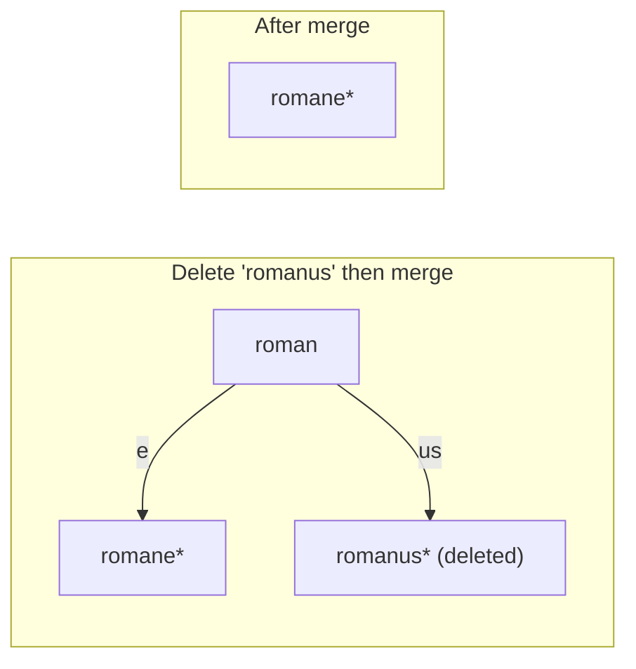
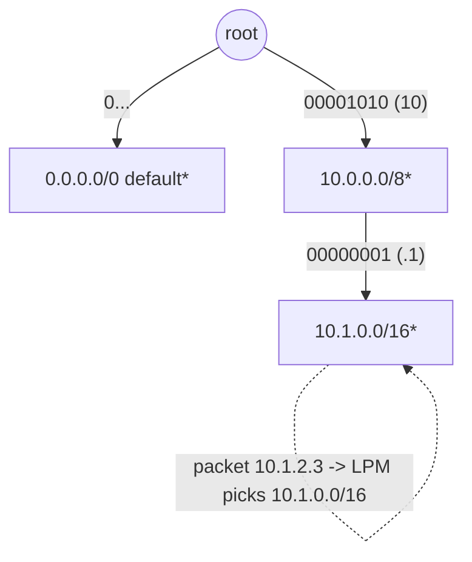

# PATRICIA Trie / Radix Tree — Middle Level

> **Audience:** Engineers who have implemented the basic radix tree from [`junior.md`](./junior.md) and want to understand *why* edge splitting is correct, how longest-prefix match works, how Morrison's PATRICIA squeezes out skip bits, and exactly when a radix tree beats a plain trie, a hash table, or a ternary search tree.

The junior chapter showed *how* a radix tree compresses single-child chains and *how* an insert splits an edge. This chapter answers the *why* and *when*: the invariants that keep splitting correct, the longest-prefix-match algorithm that makes radix trees the backbone of IP routing, Morrison's bit-skipping PATRICIA encoding, deletion-with-merge, and a careful comparison against the alternatives so you can choose deliberately.

---

## Table of Contents

1. [Introduction — Why and When](#introduction)
2. [Deeper Concepts — The Compression Invariant](#deeper-concepts)
3. [Edge Splitting and Merging, Formally](#splitting-merging)
4. [Longest-Prefix Match](#lpm)
5. [PATRICIA — Binary Radix with Skip Bits](#patricia)
6. [Comparison with Alternatives](#comparison)
7. [Advanced Patterns](#advanced-patterns)
8. [Code Examples — Full Mutable Radix Tree](#code-examples)
9. [Error Handling](#error-handling)
10. [Performance Analysis](#performance-analysis)
11. [Best Practices](#best-practices)
12. [Visual Animation](#visual-animation)
13. [Summary](#summary)

---

<a name="introduction"></a>
## 1. Introduction — Why and When

A plain trie is wasteful in exactly one way: it spends a node on every character, even where no key ever branches. The radix tree fixes that by **storing only branching points as nodes and the runs between them as string-labeled edges**. The payoff is a node count bounded by `O(N)` instead of by the total number of characters.

But the radix tree earns its keep for a second, less obvious reason: it answers **longest-prefix match (LPM)** — "of all stored keys, which is the longest one that is a prefix of my query?" — in O(L). LPM is the operation that routes every packet on the Internet, and the radix tree (in its binary PATRICIA form) is the structure that does it.

So the two questions this chapter answers are:

- **Why is path compression correct?** Because the invariant "no single-child internal nodes" is preserved by split (insert) and merge (delete), and the concatenation-of-labels-equals-prefix property never breaks.
- **When do you choose it?** When keys share prefixes (IPs, URLs, paths), when you need longest-prefix match or sorted iteration, and when memory matters. *Not* when you only need exact-match on short keys — a hash table wins there.

---

<a name="deeper-concepts"></a>
## 2. Deeper Concepts — The Compression Invariant

### Invariant: no single-child internal node

The defining structural invariant of a radix tree is:

> **Every internal node either is terminal (`isEnd == true`) or has at least two children.**

A node with exactly one child and `isEnd == false` carries no information — its edge could be fused with its child's edge. The radix tree forbids such nodes. Two operations could create one:

- **Insert** never creates a single-child non-terminal node *as long as the split logic is correct* — a split always produces a node with two children, or a terminal node.
- **Delete** can: clearing `isEnd` on a node that has one child leaves a single-child non-terminal node, which must be **merged** away.

If you violate the invariant, correctness is unaffected (queries still work) but you lose the memory guarantee — the tree drifts back toward a plain trie. Maintaining it is a *space* concern, not a *correctness* concern, but it is the whole point.

### The path-label invariant

> **Concatenating the edge labels from the root to any node spells exactly the prefix that node represents.**

This is what makes search a simple consume-the-labels walk. Every operation must preserve it. A split, for example, breaks `child.label = "romane"` into `split.label = "roman"` and `child.label = "e"`; concatenation still yields `"romane"`, so the path to the old `child` is unchanged.

### Why the node count is O(N)

Treat each stored key as a leaf (or terminal node). A tree in which every internal node has ≥ 2 children and there are `N` leaves has at most `N − 1` internal nodes (a standard binary-tree counting argument generalizes to any branching factor ≥ 2). Total nodes ≤ `2N − 1`, **independent of key length L**. Contrast the plain trie, whose node count is `Θ(total characters)` and therefore unbounded by N alone. The formal proof is in [`professional.md`](./professional.md).

### Recurrence for tree height

```text
Height of a radix tree <= number of distinct branching positions along any key
                       <= L  (key length)
In the binary (PATRICIA) case, height <= number of bits, e.g. 32 for IPv4.
With N keys, expected height for random keys is O(log_r N) for radix r.
```

---

<a name="splitting-merging"></a>
## 3. Edge Splitting and Merging, Formally

### Split (the insert primitive)

When inserting `key` you walk down matching edges. At some child you find that `commonPrefixLen(child.label, remaining) = cp` is **strictly less than** `len(child.label)`. You must split:

```text
Before:   parent --[child.label]--> child(subtree, isEnd?)

After (cp < len(key)):
          parent --[child.label[:cp]]--> split
          split  --[child.label[cp:]]--> child   (unchanged subtree)
          split  --[key[cp:]]---------> newLeaf  (isEnd = true)

After (cp == len(key)):       (new key is a prefix of child.label)
          parent --[child.label[:cp]]--> split(isEnd = true)
          split  --[child.label[cp:]]--> child   (unchanged subtree)
```

Two cases, distinguished by whether the new key ends *at* the split point or *past* it. The first case adds one new node (`split`) and one leaf; the second adds only `split`. Either way, **at most 2 nodes per insert**, hence O(L) time and O(L) added space.

### Merge (the delete primitive)

Deletion is the mirror image:

1. Walk to the node `n` spelling `key`. If it isn't terminal, the key isn't present — stop.
2. Set `n.isEnd = false`.
3. **If `n` now has zero children** and is non-terminal, remove it from its parent. Then the *parent* may have become single-child — recurse the merge check upward.
4. **If `n` now has exactly one child** and is non-terminal, **fuse**: `child.label = n.label + child.label`, and replace `n` with `child` in the grandparent.

Step 4 is the inverse of split. It restores the invariant. Forgetting it is the classic "my radix tree slowly turns into a plain trie" bug.



After deleting `romanus`, the `roman` node has a single child `e` and is non-terminal, so it fuses into `romane`.

---

<a name="lpm"></a>
## 4. Longest-Prefix Match

**Longest-prefix match (LPM)** is the radix tree's marquee operation and the reason it dominates IP routing.

> Given a query `q`, return the **longest stored key that is a prefix of `q`**.

### Algorithm

Descend from the root following matching edges. Every time you pass a **terminal** node, remember it as the current best. Stop when you can no longer follow an edge (either no child for the next character, or the child's label diverges mid-way). The last remembered terminal is the answer.

```text
LPM(q):
    node = root
    best = none
    spelled = ""
    loop:
        if node.isEnd: best = spelled
        if q is empty: return best
        child = node.children[q[0]]
        if child is none: return best
        cp = commonPrefixLen(child.label, q)
        if cp < len(child.label): return best   # cannot fully follow this edge
        spelled += child.label
        q = q[cp:]
        node = child
```

### Why it is correct

The set of prefixes of `q` that are stored keys corresponds exactly to the terminal nodes on the **single root-to-q path**. Because the radix tree has a unique path per string, that path visits those terminals in increasing length order. Taking the deepest one visited yields the longest. The formal correctness proof (uniqueness of the path + monotonicity of depth) is in [`professional.md`](./professional.md).

### IP routing concretely

A routing table maps CIDR prefixes (`10.0.0.0/8`, `10.1.0.0/16`, `0.0.0.0/0` default) to next hops. A packet for `10.1.2.3` must take the route with the **most specific** (longest) matching prefix. Encode each prefix as a bitstring of its significant bits and store it in a binary radix (PATRICIA) tree. LPM over the 32 bits of the destination address returns the most specific route in O(32). This is literally what the Linux kernel's `fib_trie` does for every forwarded packet.



---

<a name="patricia"></a>
## 5. PATRICIA — Binary Radix with Skip Bits

Morrison's **PATRICIA** (1968) is the radix tree specialized to a **binary alphabet** with one extra trick: each node stores the **bit index** of the next position where stored keys differ, so the walk **skips** runs of identical bits without visiting a node per bit.

### The idea

Consider keys as bitstrings. A plain binary trie tests one bit per node — 32 nodes deep for a 32-bit key, mostly single-child. A binary *radix* tree already merges those into edges. PATRICIA goes further: instead of storing the skipped bits as an edge label, it stores **only the index of the next differing bit**. Each PATRICIA node holds:

- `bit` — the bit index to test next.
- `left`, `right` — children for that bit being 0 or 1.
- a pointer to (or copy of) the actual key, used to verify the match at the end.

Because the skipped bits aren't stored on the edge, you must **compare the full key once at the leaf** to confirm the match (the walk may have skipped bits that happen to differ from the query). This is the price of the maximal compression: one final full comparison.

### Walk

```text
search(key):
    node = root
    prev = root
    while node.bit > prev.bit:        # descending (back-edges point upward)
        prev = node
        node = (bit(key, node.bit) == 0) ? node.left : node.right
    return key == node.key            # one full comparison confirms the hit
```

PATRICIA tries are often drawn with **upward back-edges**: a leaf's child pointer loops back to an ancestor, and the test `node.bit > prev.bit` detects when you've stopped descending. This lets a PATRICIA tree with `N` keys use exactly `N` nodes (no separate internal/leaf distinction) — the most compact binary form.

### Skip-bit example

Keys `0000`, `0011`, `0100`. The first two share bits 0–1 (`00`) and differ at bit 2. The third differs at bit 1. A PATRICIA tree stores:

```
node(bit=1) --0--> node(bit=2) --0--> leaf 0000
            |                  \--1--> leaf 0011
            \--1--> leaf 0100
```

No node is wasted on bit 0 (all keys agree there) or on bit 3 (no key branches there). The `bit` fields *skip* directly to decisions.

### Where PATRICIA is used

- **BSD kernel routing** (`sys/net/radix.c`, Sklower's radix tree) — the original IP-routing PATRICIA.
- **Linux** `fib_trie` is a level-compressed descendant.
- **`Map<K,V>`/`Set` libraries** keyed on integer/bitstring keys (e.g., functional `IntMap` in Haskell/Scala via "Fast Mergeable Integer Maps", Okasaki & Gill 1998 — a PATRICIA variant).
- **Ethereum's Merkle-Patricia trie** combines PATRICIA path compression with Merkle hashing.

---

<a name="comparison"></a>
## 6. Comparison with Alternatives

### Radix tree vs. plain trie vs. hash table vs. ternary search tree

| Attribute | Radix tree (compressed trie) | Plain trie | Hash table | Ternary search tree |
|---|---|---|---|---|
| Search time | O(L) | O(L) | O(L) avg, O(L·n) worst (collisions) | O(L + log Σ) |
| Insert time | O(L) | O(L) | O(L) avg | O(L + log Σ) |
| Longest-prefix match | **O(L)** ✓ | O(L) ✓ | ✗ not supported | O(L) ✓ |
| Prefix enumeration | O(L + answer) ✓ | O(L + answer) ✓ | ✗ full scan | O(L + answer) ✓ |
| Sorted iteration | ✓ free | ✓ free | ✗ | ✓ free |
| Node count | **O(N)** | O(total chars) | O(N) buckets | O(total chars) |
| Memory | Low–medium | High (single-child waste) | Low (just keys+buckets) | Medium |
| Cache friendliness | Medium (ART improves) | Poor | Good | Medium |
| Worst-case search | O(L) | O(L) | O(L·n) | O(L·Σ) degenerate |
| DoS via collisions | Immune | Immune | Vulnerable | Immune |

**Choose the radix tree when:** keys share prefixes, you need longest-prefix match or sorted/prefix queries, and memory matters (IPs, URLs, paths, DB index keys).
**Choose a plain trie when:** the alphabet is tiny and dense, the code simplicity matters more than memory, or keys are short with little single-child waste.
**Choose a hash table when:** you only need exact-match on whole keys and never prefix/range/LPM queries — it is smaller and faster for that.
**Choose a TST when:** the alphabet is medium-to-large, you want BST-like memory with trie-like prefix queries, and a small O(log Σ) factor is acceptable. (TST is covered in the [plain trie middle chapter](../../09-trees/05-trie/middle.md).)

### Memory illustration

Storing 1M random 60-char URLs:

| Structure | Approx. memory | Why |
|---|---|---|
| Plain trie (256-array children) | tens of GB | one node × 256 pointers per char |
| Plain trie (map children) | ~few GB | one node per char, map per node |
| **Radix tree (map children)** | **~few hundred MB** | one node per branch point |
| **ART** (see `senior.md`) | **tens of MB** | adaptive nodes + path compression |
| Hash set of strings | ~100 MB | keys + bucket overhead (but no prefix queries) |

---

<a name="advanced-patterns"></a>
## 7. Advanced Patterns

### Pattern: lazy edge labels via `(offset, length)`

Instead of copying substrings into each edge, store `(keyRef, start, end)` referencing the original key bytes. Saves an allocation per edge and a large fraction of memory. The cost: you must keep the backing keys alive and handle the case where a split needs to re-slice.

### Pattern: level compression (LC-trie)

Linux's `fib_trie` doesn't just compress single-child chains (path compression); it also **level-compresses** dense subtrees: where a binary subtree of height `k` is full, replace it with one node of `2^k` children. This shortens the typical lookup from 32 hops to ~8 and improves cache behavior. Path compression + level compression = LC-trie (Nilsson & Karlsson 1998).

### Pattern: Merkle-Patricia (authenticated radix)

Augment each node with `hash = H(node contents ‖ child hashes)`. The root hash commits to the whole key-value set; a path from root to a key is a compact **inclusion proof**. This is Ethereum's state trie. Lookups are O(L); proofs are O(L) hashes.

### Pattern: prefix-delete (subtree removal)

To delete *all* keys with a given prefix (e.g., evict a whole CIDR block, or `rmdir -r` a path subtree), walk to the prefix node and detach its subtree in O(L). Plain hash tables can't do this without a full scan.

---

<a name="code-examples"></a>
## 8. Code Examples — Full Mutable Radix Tree

A complete radix tree with `insert`, `search`, `delete` (with merge), and `longestPrefix`. Children are keyed by first character.

### Go

```go
package radix

type node struct {
	label    string
	children map[byte]*node
	isEnd    bool
}

type Tree struct{ root *node }

func New() *Tree { return &Tree{root: &node{children: map[byte]*node{}}} }

func cpl(a, b string) int {
	n := len(a)
	if len(b) < n {
		n = len(b)
	}
	i := 0
	for i < n && a[i] == b[i] {
		i++
	}
	return i
}

func (t *Tree) Insert(key string) {
	n := t.root
	for {
		if key == "" {
			n.isEnd = true
			return
		}
		child, ok := n.children[key[0]]
		if !ok {
			n.children[key[0]] = &node{label: key, isEnd: true, children: map[byte]*node{}}
			return
		}
		k := cpl(child.label, key)
		if k == len(child.label) {
			key = key[k:]
			n = child
			continue
		}
		// split
		split := &node{label: child.label[:k], children: map[byte]*node{}}
		child.label = child.label[k:]
		split.children[child.label[0]] = child
		n.children[key[0]] = split
		if k == len(key) {
			split.isEnd = true
		} else {
			rest := key[k:]
			split.children[rest[0]] = &node{label: rest, isEnd: true, children: map[byte]*node{}}
		}
		return
	}
}

func (t *Tree) Search(key string) bool {
	n := t.root
	for key != "" {
		child, ok := n.children[key[0]]
		if !ok {
			return false
		}
		k := cpl(child.label, key)
		if k < len(child.label) {
			return false
		}
		key = key[k:]
		n = child
	}
	return n.isEnd
}

// LongestPrefix returns the longest stored key that is a prefix of key.
func (t *Tree) LongestPrefix(key string) (string, bool) {
	n := t.root
	best, ok := "", false
	spelled := ""
	for {
		if n.isEnd {
			best, ok = spelled, true
		}
		if key == "" {
			break
		}
		child, present := n.children[key[0]]
		if !present {
			break
		}
		k := cpl(child.label, key)
		if k < len(child.label) {
			break
		}
		spelled += child.label
		key = key[k:]
		n = child
	}
	return best, ok
}

// Delete removes key and merges a resulting single-child node.
func (t *Tree) Delete(key string) bool {
	return del(t.root, key)
}

func del(n *node, key string) bool {
	if key == "" {
		if !n.isEnd {
			return false
		}
		n.isEnd = false
		return true
	}
	child, ok := n.children[key[0]]
	if !ok {
		return false
	}
	k := cpl(child.label, key)
	if k < len(child.label) {
		return false
	}
	if !del(child, key[k:]) {
		return false
	}
	// post-delete cleanup of `child`
	if len(child.children) == 0 && !child.isEnd {
		delete(n.children, key[0])
	} else if len(child.children) == 1 && !child.isEnd {
		// merge child into its single grandchild
		var only *node
		for _, c := range child.children {
			only = c
		}
		only.label = child.label + only.label
		n.children[key[0]] = only
	}
	return true
}
```

### Java

```java
import java.util.HashMap;
import java.util.Map;

public final class RadixTree {
    private static final class Node {
        String label;
        Map<Character, Node> children = new HashMap<>();
        boolean isEnd;
        Node(String l) { label = l; }
    }
    private final Node root = new Node("");

    private static int cpl(String a, String b) {
        int n = Math.min(a.length(), b.length()), i = 0;
        while (i < n && a.charAt(i) == b.charAt(i)) i++;
        return i;
    }

    public void insert(String key) {
        Node n = root;
        while (true) {
            if (key.isEmpty()) { n.isEnd = true; return; }
            Node child = n.children.get(key.charAt(0));
            if (child == null) {
                Node leaf = new Node(key); leaf.isEnd = true;
                n.children.put(key.charAt(0), leaf); return;
            }
            int k = cpl(child.label, key);
            if (k == child.label.length()) { key = key.substring(k); n = child; continue; }
            Node split = new Node(child.label.substring(0, k));
            child.label = child.label.substring(k);
            split.children.put(child.label.charAt(0), child);
            n.children.put(key.charAt(0), split);
            if (k == key.length()) split.isEnd = true;
            else {
                String rest = key.substring(k);
                Node leaf = new Node(rest); leaf.isEnd = true;
                split.children.put(rest.charAt(0), leaf);
            }
            return;
        }
    }

    public boolean search(String key) {
        Node n = root;
        while (!key.isEmpty()) {
            Node child = n.children.get(key.charAt(0));
            if (child == null) return false;
            int k = cpl(child.label, key);
            if (k < child.label.length()) return false;
            key = key.substring(k); n = child;
        }
        return n.isEnd;
    }

    public String longestPrefix(String key) {
        Node n = root; String best = null, spelled = "";
        while (true) {
            if (n.isEnd) best = spelled;
            if (key.isEmpty()) break;
            Node child = n.children.get(key.charAt(0));
            if (child == null) break;
            int k = cpl(child.label, key);
            if (k < child.label.length()) break;
            spelled += child.label; key = key.substring(k); n = child;
        }
        return best;
    }
}
```

### Python

```python
class _Node:
    __slots__ = ("label", "children", "is_end")
    def __init__(self, label=""):
        self.label, self.children, self.is_end = label, {}, False


def _cpl(a, b):
    n = min(len(a), len(b)); i = 0
    while i < n and a[i] == b[i]:
        i += 1
    return i


class RadixTree:
    def __init__(self):
        self.root = _Node("")

    def insert(self, key):
        n = self.root
        while True:
            if key == "":
                n.is_end = True; return
            child = n.children.get(key[0])
            if child is None:
                leaf = _Node(key); leaf.is_end = True
                n.children[key[0]] = leaf; return
            k = _cpl(child.label, key)
            if k == len(child.label):
                key = key[k:]; n = child; continue
            split = _Node(child.label[:k])
            child.label = child.label[k:]
            split.children[child.label[0]] = child
            n.children[key[0]] = split
            if k == len(key):
                split.is_end = True
            else:
                rest = key[k:]
                leaf = _Node(rest); leaf.is_end = True
                split.children[rest[0]] = leaf
            return

    def search(self, key):
        n = self.root
        while key:
            child = n.children.get(key[0])
            if child is None:
                return False
            k = _cpl(child.label, key)
            if k < len(child.label):
                return False
            key = key[k:]; n = child
        return n.is_end

    def longest_prefix(self, key):
        n, best, spelled = self.root, None, ""
        while True:
            if n.is_end:
                best = spelled
            if not key:
                break
            child = n.children.get(key[0])
            if child is None:
                break
            k = _cpl(child.label, key)
            if k < len(child.label):
                break
            spelled += child.label; key = key[k:]; n = child
        return best
```

---

<a name="error-handling"></a>
## 9. Error Handling

| Scenario | What goes wrong | Correct approach |
|---|---|---|
| New key is a prefix of an existing edge | Split point at end of key; forgetting to mark split terminal loses the key | When `cp == len(key)`, set `split.isEnd = true` |
| Delete leaves single-child non-terminal node | Tree degrades toward plain trie | Merge: fuse the node's edge into its single child |
| Multibyte UTF-8 split across edge boundary | Invalid fragments | Operate on runes, or treat as bytes + normalize at boundary |
| `commonPrefixLen` off-by-one | Silent corruption — inserted key not found later | Loop `i < min(len) && a[i]==b[i]` |
| LPM forgetting the root/default | No default route matched | Allow the root (or `0.0.0.0/0`) to be terminal |

---

<a name="performance-analysis"></a>
## 10. Performance Analysis

```python
import timeit, random, string

def rand_key():
    return "".join(random.choice(string.ascii_lowercase) for _ in range(12))

sizes = [1_000, 10_000, 100_000]
for n in sizes:
    keys = [rand_key() for _ in range(n)]
    t = RadixTree()
    build = timeit.timeit(lambda: [t.insert(k) for k in keys], number=1)
    q = keys[: min(1000, n)]
    look = timeit.timeit(lambda: [t.search(k) for k in q], number=1)
    print(f"n={n:>7}: build {build*1000:.1f} ms, "
          f"{look/len(q)*1e6:.2f} us/lookup")
```

Expect roughly constant microseconds-per-lookup as `n` grows tenfold — the O(L) property in action. Build time grows linearly with `n`. The radix tree's per-lookup cost is dominated by **pointer chases and substring compares**; ART (`senior.md`) reduces both by shrinking nodes to fit cache lines and replacing pointer chases with array indexing.

For IP routing benchmarks specifically, lookups are measured in **nanoseconds** because the alphabet is binary, the tree is shallow (≤ 32), and level compression keeps it cache-resident.

---

<a name="best-practices"></a>
## 11. Best Practices

- **Maintain the no-single-child-internal-node invariant** by merging on delete — it is the whole point of the structure.
- **When `cp == len(key)` during insert, mark the split node terminal.** The most common correctness slip.
- **Use `(offset, length)` edge labels** to avoid per-edge string allocation at scale.
- **Make the root (or default route) capable of being terminal** so LPM has a fallback.
- **Choose radix r deliberately**: 2 for IP/bitstrings (PATRICIA), 256 for byte/string keys (ART, routers), 16 for Ethereum nibbles.
- **Property-test split/merge** against a reference `set`/`map`.
- **Profile vs. a hash table** — if you never use prefix/LPM/range queries, the hash table likely wins.
- **For production IP routing, use the kernel/library implementation** (LC-trie, DPDK LPM) rather than rolling your own.

---

<a name="visual-animation"></a>
## 12. Visual Animation

See [`animation.html`](./animation.html). The middle-level scenarios to step through:

- **Insert with edge split**: insert `romane`, then `romanus` and watch the `romane` edge split into `roman` + `e` with a new branching node.
- **Longest-prefix match**: search a query and watch the descent highlight the deepest terminal node reached (the LPM answer), even when the query continues past it.
- **Compression counter**: the panel shows radix-tree node count vs. the equivalent plain-trie node count, so you can quantify the savings as you insert.

---

<a name="summary"></a>
## 13. Summary

- A radix tree's correctness rests on two invariants: **no single-child internal node** (the space guarantee) and **labels-concatenate-to-prefix** (the search guarantee). Split and merge preserve both.
- **Insert splits** an edge at the divergence point (≤ 2 new nodes); **delete merges** a single-child node back. These are the only operations more complex than a plain trie.
- **Longest-prefix match** descends remembering the deepest terminal — the operation behind IP routing — in O(L).
- **PATRICIA** is the binary radix tree with **skip bits**: nodes store the next differing bit index and confirm with one full comparison at the leaf, giving the most compact form for bitstring keys.
- Versus alternatives: pick a radix tree for prefix-heavy keys, LPM, sorted/prefix queries, and memory; pick a hash table for pure exact-match.
- Next: [`senior.md`](./senior.md) covers production systems — Linux FIB, ART in DuckDB/HyPer, cache efficiency, and memory at scale.

---

Next step: [`senior.md`](./senior.md) — IP routing/FIB and in-memory DB index systems, the Adaptive Radix Tree (ART), cache efficiency, and memory engineering.
