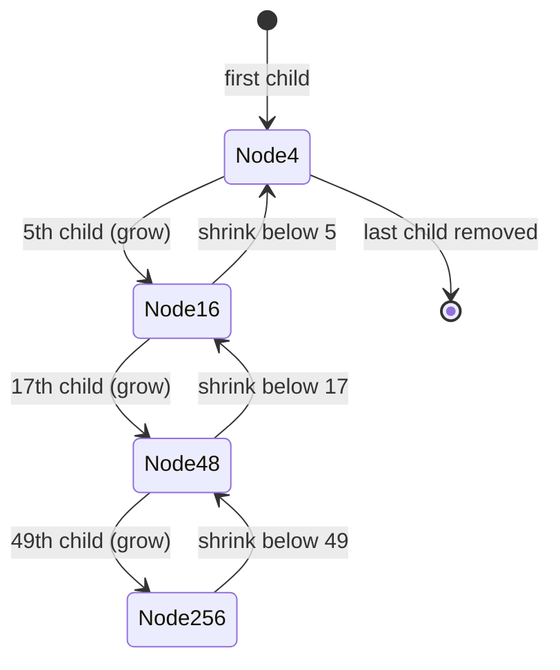

# PATRICIA Trie / Radix Tree — Mathematical Foundations and Complexity Theory

> **Audience:** Library and infrastructure authors who need the radix tree's guarantees stated and *proved*: O(L) operations, the O(N) node bound, longest-prefix-match correctness, and a formal space analysis of the Adaptive Radix Tree's node types. Prerequisite: [`senior.md`](./senior.md).

The senior chapter asserted that radix-tree operations are O(L), that the node count is O(N), and that longest-prefix match is correct. This chapter discharges those debts with definitions, loop invariants, induction, and worst-case bounds, then formalizes ART's node-type space trade-off.

---

## Table of Contents

1. [Formal Definition](#formal-definition)
2. [O(L) Operation Bound — Proof](#ol-bound)
3. [O(N) Node Bound — Proof](#on-bound)
4. [Correctness of Insert (Edge Splitting) — Loop Invariant](#insert-correctness)
5. [Longest-Prefix-Match Correctness](#lpm-correctness)
6. [PATRICIA Skip-Bit Correctness](#patricia-correctness)
7. [ART Node-Type Space Analysis](#art-analysis)
8. [Delete-and-Merge Correctness](#delete-correctness)
9. [Expected Height and Average-Case Analysis](#expected-height)
10. [Information-Theoretic Lower Bounds](#lower-bounds)
11. [Amortized and Cache Analysis](#amortized-cache)
12. [Comparison with Alternatives](#comparison)
13. [Summary](#summary)

---

<a name="formal-definition"></a>
## 1. Formal Definition

```text
Definition (Radix Tree). Let Σ be a finite alphabet and S ⊆ Σ* a finite set of keys.
A radix tree for S is a rooted tree T = (V, E, root, label, isEnd) where:

  - label: E → Σ⁺ assigns a NON-EMPTY string to each edge.
  - isEnd: V → {true, false} marks terminal nodes.
  - For each node v, the strings { label(v, c) : c child of v } have
    DISTINCT first characters  (determinism).
  - word(v) := concatenation of edge labels on the path root ⇝ v.
  - S = { word(v) : isEnd(v) = true }   (the stored set).

Compression invariant I_comp:
  Every node v with isEnd(v) = false and v ≠ root has degree(v) ≥ 2.
  (No single-child non-terminal internal nodes.)

Path invariant I_path:
  For every v, word(v) is the unique string spelled by the root⇝v path,
  and the map v ↦ word(v) is injective.
```

A **PATRICIA trie** is the special case Σ = {0,1} with each internal node annotated by a `bit` index (the next position where its subtrees differ), and skipped bits omitted from edge labels (verified by one full key comparison at a leaf).

The **Adaptive Radix Tree (ART)** is the special case Σ = bytes (|Σ| = 256) with inner nodes drawn from four representations {Node4, Node16, Node48, Node256} chosen by fan-out, plus an inline path-compression prefix.

---

<a name="ol-bound"></a>
## 2. O(L) Operation Bound — Proof

```text
Claim. search(q), insert(q), and longestPrefix(q) each run in O(|q|) time,
       assuming O(1) child-by-first-character lookup and O(1)-per-char
       label comparison.

Proof (search). Each loop iteration consumes a nonempty prefix of the
remaining query by matching one full edge label of length ℓ ≥ 1, doing
O(ℓ) character comparisons via commonPrefixLen, then advancing the query
pointer by ℓ. Let the matched labels along the path be ℓ₁, ℓ₂, …, ℓ_k.

  Total comparison work = Σ ℓ_i.
  By I_path, the labels are disjoint substrings tiling a prefix of q, so
  Σ ℓ_i ≤ |q|.
  Child lookup is O(1) per iteration; there are k ≤ |q| iterations.
  ⇒ total time = O(Σ ℓ_i + k) = O(|q|).                              ∎

Proof (insert). Identical descent, plus at most ONE split. A split does
O(1) pointer surgery and slices two labels in O(ℓ_split) ≤ O(|q|) time.
⇒ O(|q|).                                                            ∎

Proof (longestPrefix). Same descent; the only extra work is recording the
deepest terminal in O(1) per node. ⇒ O(|q|).                          ∎
```

In the binary (PATRICIA) case `|q|` is the number of key bits, e.g., 32 for IPv4, so every operation is O(32) = **O(1) in the address width** — constant per packet.

---

<a name="on-bound"></a>
## 3. O(N) Node Bound — Proof

```text
Claim. A radix tree storing N keys (satisfying I_comp) has at most 2N − 1
       nodes, independent of key lengths.

Proof. Classify nodes:
  - Terminal nodes: by definition, exactly N nodes have isEnd = true
    (one per key, by injectivity of word(·)).  Call this count T = N.
  - Non-terminal internal nodes: by I_comp each has degree ≥ 2.

Build an auxiliary forest by contracting: treat terminal nodes and the
root as "marked". Consider the tree's leaves L. Every leaf must be
terminal (a non-terminal leaf would have degree 0 < 2, violating I_comp
unless it is the root of an empty tree). So #leaves ≤ N.

In any rooted tree where every internal node has ≥ 2 children, the number
of internal nodes is < number of leaves. Hence:

  #internal ≤ #leaves − 1 ≤ N − 1   (when the root is counted among
                                      internal/branching nodes)

Total nodes = #leaves + #internal ≤ N + (N − 1) = 2N − 1.            ∎

Corollary. Total space is O(N + Σ_{k∈S} |k|) when edge labels are stored
as (offset,length) slices into the keys (no copying), i.e., O(N) nodes
plus the keys themselves. A PLAIN trie has Θ(Σ_{k∈S}|k|) nodes with no
N-only bound — the asymptotic separation that motivates compression.
```

The bound `2N − 1` is tight: `N` keys that pairwise diverge at distinct positions yield a binary-shaped tree with exactly `N` leaves and `N − 1` internal nodes.

---

<a name="insert-correctness"></a>
## 4. Correctness of Insert (Edge Splitting) — Loop Invariant

```text
Claim. insert(q) terminates with q ∈ S and preserves I_path and I_comp.

Invariant I (maintained at the top of each descent iteration):
  Let (node, rest) be the current state. Then
    word(node) · rest = q,           (we have consumed q's prefix exactly)
  and the tree restricted to all OTHER keys is unchanged and valid.

Base case. Initially node = root, rest = q, word(root) = "" ⇒ "" · q = q. ✓

Inductive step. Three cases on the child c keyed by rest[0]:

 (a) No such child. Attach a leaf with label = rest, isEnd = true.
     Then word(leaf) = word(node)·rest = q, so q ∈ S. The new node is a
     terminal leaf — I_comp unaffected (leaves may be terminal). I_path
     holds: the new label is nonempty (rest ≠ "" in this branch). HALT. ✓

 (b) cp = commonPrefixLen(c.label, rest) == |c.label|.
     The whole label matched. Recurse with node ← c, rest ← rest[cp:].
     word(c) = word(node)·c.label, and word(c)·rest[cp:] =
     word(node)·c.label·rest[cp:] = word(node)·rest = q  (since c.label
     is a prefix of rest). I preserved. ✓

 (c) cp < |c.label|  (genuine divergence inside the edge). Split:
       split.label   = c.label[:cp]      (nonempty? if cp=0 the child
                       would not have been selected, so cp ≥ 1) ✓
       c.label       = c.label[cp:]      (nonempty since cp < |c.label|) ✓
       split.children[c.label[0]] = c
       node.children[rest[0]] = split
     Sub-case cp == |rest|: q ends at split ⇒ split.isEnd = true ⇒ q ∈ S.
       split has child c (degree ≥ 1) AND isEnd ⇒ I_comp ok (terminal).
     Sub-case cp <  |rest|: attach leaf(label = rest[cp:], isEnd = true)
       under split. Now split has TWO children (c and the new leaf),
       degree = 2 ⇒ I_comp ok even though split.isEnd = false.
     I_path: word(c) and word(leaf) are unchanged/correct because
       word(split) · (old c.label) = word(node)·c.label[:cp]·c.label[cp:]
                                    = word(node)·(old c.label). HALT. ✓

Termination. Each (a)/(c) branch halts; each (b) strictly shortens rest by
cp ≥ 1, so after ≤ |q| iterations rest = "" or we halt. At rest = "" we
set node.isEnd = true ⇒ q ∈ S. ∎
```

The crucial subtlety proved above: case (c) **never creates a single-child non-terminal internal node**, because either `split` becomes terminal (sub-case cp == |rest|) or it gets two children. Thus insert alone preserves `I_comp`; only delete can violate it, which is why delete must merge.

---

<a name="lpm-correctness"></a>
## 5. Longest-Prefix-Match Correctness

```text
Claim. longestPrefix(q) returns the longest key k ∈ S with k a prefix of q,
       or "none" if no such k exists.

Lemma (unique path). For any string x, there is at most one node v with
  word(v) reachable while consuming x edge-by-edge, and the set of stored
  prefixes of q equals { word(v) : v terminal AND v lies on the root⇝
  (deepest reachable for q) path }.
Proof of lemma. By determinism (distinct first characters per node) the
  descent for q is unique: at each step at most one child matches q's next
  character, and its label either fully matches (advance) or diverges
  (stop). Hence a single path P = v₀(root), v₁, …, v_m is followed. A key
  k ∈ S is a prefix of q  ⟺  k = word(v_j) for some terminal v_j on P,
  because word(·) is injective and any prefix of q must be spelled by the
  unique descent for q. ∎(lemma)

Main proof. The algorithm walks exactly P, and at each v_j sets
  best ← word(v_j) iff isEnd(v_j). Because depth (and thus |word(v_j)|)
  strictly increases along P, the FINAL assignment is the terminal v_j of
  greatest depth = the longest stored prefix. Stopping conditions (no
  child / mid-edge divergence) end the walk precisely at v_m, after which
  no deeper node could spell a prefix of q. Hence best = the longest
  stored prefix of q, or "none" if no v_j on P is terminal.            ∎
```

This is exactly the IP-routing guarantee: among all CIDR prefixes covering a destination address, the **most specific (longest)** is returned, deterministically, in O(address width).

---

<a name="patricia-correctness"></a>
## 6. PATRICIA Skip-Bit Correctness

```text
Setup. PATRICIA stores keys as bitstrings. Each internal node n has a bit
index n.bit and two children; edges carry NO labels (skipped bits are
omitted). A leaf stores the full key. Descent:

  prev ← root; n ← root.child
  while n.bit > prev.bit:                 # still descending
      prev ← n
      n ← (bit(q, n.bit) == 0) ? n.left : n.right
  return q == n.key

Claim. The procedure returns true iff q ∈ S.

Proof. Invariant J: at each step, q agrees with EVERY key in the subtree
rooted at n on all bit positions tested so far (the positions {prev'.bit}
visited on the way down). This holds because we always branch by q's bit
at n.bit, descending into the subtree whose keys share that bit value
with q.

The test n.bit > prev.bit detects the first BACK-EDGE (a child pointer
that loops up to an ancestor, by construction of PATRICIA), i.e., the
moment we reach a leaf candidate. At that point, by J, q agrees with
n.key on all tested decision bits — but the SKIPPED bits were never
checked. Therefore a single full comparison q == n.key is REQUIRED and
SUFFICIENT:
  - sufficient: if equal, q is exactly the stored key ⇒ q ∈ S.
  - necessary: skipped bits could differ; only the full compare detects it.
If q ∈ S, the unique descent for q reaches q's own leaf (J guarantees no
wrong turn), so q == n.key holds. If q ∉ S, the reached leaf's key differs
from q in at least one bit (tested or skipped), caught by the compare. ∎

Node-count corollary. A PATRICIA trie over N keys uses exactly N nodes
(internal nodes double as the N leaves via back-edges) — the most compact
binary radix form, beating the 2N−1 of the general construction.
```

---

<a name="art-analysis"></a>
## 7. ART Node-Type Space Analysis

ART's adaptivity is a space optimization over a fixed radix-256 tree. We quantify it.

```text
Fixed radix-256 inner node: 256 child pointers × 8 bytes = 2048 bytes,
  regardless of how many children are present. For a node with f children,
  utilization = f / 256; for f = 2 this is < 1% — catastrophic waste.

ART chooses the node type by fan-out f:

  Node4   (1 ≤ f ≤ 4):   keys[4] (4 B) + children[4] (32 B) + hdr ≈ 36 B
  Node16  (5 ≤ f ≤ 16):  keys[16](16 B) + children[16](128 B) + hdr ≈ 150 B
  Node48  (17 ≤ f ≤ 48):  index[256](256 B) + children[48](384 B) + hdr ≈ 660 B
  Node256 (49 ≤ f ≤ 256): children[256](2048 B) + hdr ≈ 2064 B

Per-child amortized bytes B(f):
  Node4:   ~36/f       (≈ 9–36 B/child)
  Node16:  ~150/16     (≈ 9.4 B/child at full)
  Node48:  ~660/48     (≈ 13.75 B/child at full)
  Node256: ~2064/f     (≈ 8 B/child at f=256, but ≈ 42 B/child at f=49)

Worst-case over all types and fan-outs: bounded by ~52 bytes/child
(the Node48 boundary and Node256-at-49 boundary). Contrast the fixed
node's UNBOUNDED bytes/child as f → 1 (2048/1).
```

```text
Theorem (ART space). The total inner-node space of an ART over N keys is
  O(N) bytes (not O(N·256)), because:
    (1) #inner nodes ≤ N − 1 (radix O(N) node bound),
    (2) each inner node costs O(1) bytes-per-child with the bound above,
    (3) Σ children over all inner nodes = #edges = O(N).
  Hence Σ node bytes = O(N).                                          ∎
```

```text
Type-transition amortization. Growing a node (Node4→16→48→256) copies its
contents once per promotion. A node is promoted at most 3 times over its
life and demoted symmetrically on deletion. Using the accounting method,
charge each insertion O(1) credit per child added; the credits pay for the
O(f) copy at the next promotion threshold. ⇒ O(1) AMORTIZED resize cost
per insert/delete.                                                     ∎
```

The practical consequence (measured in the ART paper and in DuckDB): real key distributions are dominated by **Node4 and Node16**, so the average inner node is ~36–150 bytes, and total index memory is **competitive with a hash table** while supporting ordered range scans — the property hash tables lack.

The state machine of node-type transitions (each an O(1) amortized resize) is:



Each transition copies O(f) entries but happens at most a constant number of times over a node's life, so the amortized cost is O(1) per child added or removed — the bound proved above.

---

<a name="delete-correctness"></a>
## 8. Delete-and-Merge Correctness

Insert was shown (§4) to preserve `I_comp` on its own. Delete is the operation that *can* break `I_comp`, so its merge step is what restores the structural guarantee. We prove delete is correct and re-establishes the invariant.

```text
Claim. delete(q) removes q from S (if present), preserves I_path, and
       re-establishes I_comp, in O(|q|) time.

Procedure (recursive, returns true if a structural change must be propagated):
  del(node, key):
    if key == "":
        if not node.isEnd: return false        # q ∉ S, no change
        node.isEnd = false                      # q removed from S
        return true
    c = node.children[key[0]]
    if c is none OR cpl(c.label, key) < len(c.label): return false
    if not del(c, key[len(c.label):]): return false
    # cleanup of c, restoring I_comp:
    if c has 0 children and not c.isEnd:
        remove c from node.children             # drop dead leaf
    elif c has 1 child and not c.isEnd:
        g = c's single child
        g.label = c.label · g.label             # MERGE (inverse of split)
        node.children[key[0]] = g
    return true

Correctness of removal. By I_path the descent for q is unique; del follows
it. The recursion bottoms out exactly at word(node) = q and clears isEnd,
so q ∉ S afterward and no other key's terminal flag is touched.        ✓

I_path preservation. The merge sets g.label = c.label · g.label, so
word(g) = word(parent_of_c) · c.label · (old g.label) = the SAME string
as before the merge. Every descendant's word(·) is unchanged.          ✓

I_comp re-establishment. After clearing isEnd on the deletion target,
the only node that can violate I_comp is one that became
(non-terminal AND single-child). The cleanup handles exactly two cases:
  - 0 children, non-terminal  → it is a dead node, removed. Its parent
    may now be single-child non-terminal; the return value propagates the
    check one level up the recursion (so the fix cascades).
  - 1 child,  non-terminal  → merged into that child, eliminating the
    single-child node. The merged node g inherits c's children count
    (g keeps its own children), so g satisfies I_comp.
A node with ≥ 2 children, or any terminal node, already satisfies I_comp
and is left untouched.                                                  ✓

Termination & time. The recursion depth is the number of edges on q's
path ≤ |q|; each level does O(1) cleanup plus an O(|merged label|) string
concat. Summed label work telescopes to O(|q|). ⇒ O(|q|).             ∎
```

The subtle point proved above is the **cascade**: deleting a key can leave a chain of nodes that each drop to a single child; the recursive return value carries the merge obligation back up so the invariant is restored along the *entire* affected path, not just at the leaf. A common production bug is fixing only the immediate parent and leaving an ancestor in violation — the tree then slowly drifts toward a plain trie (the "compression drift" failure mode from `senior.md`).

---

<a name="expected-height"></a>
## 9. Expected Height and Average-Case Analysis

The worst-case height of a radix tree is `L` (or the bit width `W` for PATRICIA), but for *random* keys the expected height is logarithmic, which is what makes lookups fast in practice.

```text
Model. N keys drawn i.i.d. from an alphabet of size r, each symbol uniform.
A radix tree over these keys has expected height H with:

  E[H] = log_r N + O(1)           (Devroye 1992; Szpankowski 2001)

Intuition (the "birthday" argument). Two random keys agree on a prefix of
expected length Σ_{i≥1} r^{-i} = 1/(r−1) before diverging — O(1) symbols.
With N keys, the deepest pair shares ≈ log_r N symbols before all N have
branched apart (each additional symbol r-partitions the surviving set,
so after ~log_r N symbols each group has O(1) keys). Hence:

  E[height]      = log_r N + O(1)
  E[depth of a   = log_r N + O(1)
   random key]

Variance (Szpankowski). The height concentrates: Var[H] = O(1), so with
high probability H = log_r N ± O(1). For r = 256 (byte-wise) and
N = 10⁹, log_256(10⁹) ≈ 3.7 — fewer than 4 expected branch levels, plus
path-compression hops for shared prefixes.
```

Consequences:

- **PATRICIA over random bitstrings (r = 2):** expected height `log₂ N`. For N = 10⁶ routing prefixes, ≈ 20 — and level compression cuts the *traversed* depth further by widening dense nodes.
- **ART (r = 256):** expected branch height `log₂₅₆ N` is tiny (≤ ~4 for a billion keys); the practical lookup cost is dominated by key length / path-compression hops, not by branching depth.
- **Skewed key distributions** (real data: timestamps, sequential IDs, URLs) can deepen the tree; this is why production variants cap edge-label length and monitor the depth histogram (`senior.md`).

The average-case `O(log_r N)` height, combined with the worst-case `O(L)` per-operation bound, is the formal reason radix trees deliver both *good typical* and *bounded worst-case* latency — the determinism that hash tables lack.

---

<a name="lower-bounds"></a>
## 10. Information-Theoretic Lower Bounds

How close to optimal is a radix tree's space and time?

```text
Space lower bound. To store an arbitrary set S of N keys with total
length M = Σ|k|, you must store the keys themselves: M·log₂(r) bits is
a lower bound (the keys are the information content). A radix tree with
SLICE edge labels uses O(N·log N) bits of structure (pointers) + the M
symbols of keys. The structural overhead O(N log N) is dominated by M
when keys are long; succinct radix trees (LOUDS, §see plain-trie pro)
push structure to 2N + o(N) bits, near the information-theoretic floor.

Operation lower bound. Any data structure that answers exact membership
for length-L keys must, in the worst case, EXAMINE Ω(L) bits of the query
(it cannot conclude membership without reading the key). Hence O(L)
search is OPTIMAL up to constants — a radix tree matches the lower bound.

Longest-prefix-match lower bound. LPM over a static set of prefixes has a
cell-probe lower bound (Beame & Fich 1999) tying query time to word size
and key length; the O(L) radix-tree walk is optimal in the comparison/
pointer model. Sub-O(L) LPM is only possible by precomputing flattened
tables (DIR-24-8), trading Ω(2^k) space for O(1) probes — a space/time
trade-off, not a free improvement.
```

So the radix tree is **time-optimal** for membership and LPM in the pointer model (you must read the key), and its space is within a `log N` factor of optimal — closable to near-optimal with succinct encodings. There is no asymptotically faster comparison-based structure for these operations; improvements come only from cache-layout constants (ART) or from precomputed lookup tables that buy O(1) probes with large space (DIR-24-8).

---

<a name="amortized-cache"></a>
## 11. Amortized and Cache Analysis

```text
Aggregate (build cost). Inserting N keys does Σ O(|k_i|) work plus at most
N splits and (in ART) O(N) amortized resizes:
  Total = O(Σ |k_i|) + O(N) = O(total key length).               ⇒ linear.

Cache-oblivious view. Naive pointer radix tree: a lookup of an L-byte key
chases up to L pointers, each a potential cache miss ⇒ O(L) misses.
ART reduces this: height ≤ L bytes but path compression + lazy expansion
makes effective height ≈ log_256(N)+prefix-hops, and small nodes
(Node4/16) fit in one cache line ⇒ ≈ O(log_256 N) misses on dense data.

LC-trie (FIB) view. Level compression replaces k binary levels with one
2^k-ary node ⇒ lookup misses drop from 32 (per-bit) to ≈ depth of the
LC-trie (~6–8 on BGP tables). The DIR-24-8 (DPDK) layout flattens further
to a GUARANTEED ≤ 2 memory accesses, trading O(2^24) array space for O(1)
miss count — the cache-time/space trade-off taken to its limit.

Optimistic concurrency (ART, OLC). Each read validates a per-node version;
expected retries under contention rate p over a path of length h is
≈ h·p/(1−p), giving amortized O(h) read cost with no locks — formally
analyzed in Leis et al. 2016.
```

### Potential-method bound for the split sequence

```text
Lemma (insert work via potential). Define Φ(T) = (number of nodes in T).
A non-splitting insert adds 1 leaf: ΔΦ = +1, actual cost O(L) for the
descent, amortized = O(L) + 1 = O(L).
A splitting insert adds at most 2 nodes (split + leaf): ΔΦ ≤ +2, actual
cost O(L), amortized = O(L) + 2 = O(L).
Since Φ ≥ 0 and Φ(∅) = 1, summing over N inserts:

  Σ actual_cost_i ≤ Σ amortized_i + Φ(∅) − Φ(final)
                  ≤ Σ O(L_i) + 1
                  = O(total key length).

⇒ Building a radix tree of N keys is O(Σ|k_i|) total — LINEAR in input
size — and the node potential Φ never exceeds 2N+1, re-deriving the §3
bound from the amortized side.                                        ∎
```

This dovetails with the aggregate result above: whether you count work top-down (each operation O(L)) or via the node-potential Φ, you reach the same linear build cost and the same `O(N)` node ceiling — two independent confirmations of the structure's efficiency.

---

<a name="comparison"></a>
## 12. Comparison with Alternatives

| Attribute | Radix tree / ART | Plain trie | Hash table | B+ tree |
|---|---|---|---|---|
| Search worst-case | O(L) | O(L) | O(L·n) collisions | O(L·log N) |
| Node count | O(N) (≤ 2N−1) | Θ(total chars) | O(N) buckets | O(N) |
| Cache misses / lookup | O(log_r N) (ART) | O(L) | O(1) avg | O(log_B N) |
| Longest-prefix match | O(L), correct (§5) | O(L) | not supported | with markers |
| Ordered range scan | ✓ | ✓ | ✗ | ✓ (best) |
| Deterministic latency | ✓ | ✓ | ✗ (collision tail) | ✓ |
| Space proof | O(N) nodes (§3) | unbounded by N | O(N) | O(N) |

### Worked numerical example — verifying the bounds

Take the 7-key set from `junior.md`: `{romane, romanus, romulus, rubens, ruber, rubicon, rubicundus}`.

```text
N = 7 keys, total characters M = 6+7+7+6+5+7+10 = 48.

Radix tree (measured in junior.md): 13 nodes.
Bound check:   13 ≤ 2N − 1 = 13.   ✓ TIGHT (every internal node branches).

Plain trie:    one node per character of the distinct paths.
Shared prefixes: "rom" (3) shared by 3 keys, "roman" (+2) by 2,
                 "rub" (3) shared by 4 keys, "rubic" (+2) by 2.
Distinct characters stored ≈ 48 − (shared overlaps) ≈ 33 internal char
nodes + root ≈ 34 nodes.
Compression ratio ≈ 34 / 13 ≈ 2.6×  on this tiny, prefix-rich set; the
ratio GROWS with key length and prefix overlap (10×–50× on real URLs).

Height: deepest path is root→rub→ic→undus = 3 edges (labels "rub","ic",
"undus"). Spelling depth = 3+2+5 = 10 = |rubicundus|, so per-operation
work for that key is O(10) = O(L), while NODE-traversal depth is only 3.
This separation — character depth L vs node-hop depth O(log_r N) — is the
crux: time-per-op is O(L), but cache-miss-count tracks the smaller node
depth.
```

This single example exhibits all three proved properties at once: the **tight `2N−1` node bound**, the **O(L) per-operation character work**, and the **`O(log_r N)` node-hop depth** that governs cache misses. Any production radix tree should reproduce these numbers on a synthetic dataset as a sanity check before deployment.

### Why succinct encodings can beat the pointer bound

The `O(N log N)`-bit structural cost of a pointer radix tree (each of O(N) pointers is `log N` bits) is *not* a lower bound. LOUDS-encoded radix trees (Jacobson 1989; see the [plain-trie professional chapter](../../09-trees/05-trie/professional.md)) represent the tree shape in `2N + o(N)` bits with O(1) rank/select navigation — within a constant of the information-theoretic minimum for the *shape*. For read-only dictionaries (on-device spell-check, static FIB snapshots, tokenizer vocabularies) this turns a few hundred MB of pointer trie into tens of MB, `mmap`-able with zero allocation. The cost is immutability: succinct tries are built once, queried forever.

---

<a name="summary"></a>
## 13. Summary

- **O(L) operations** follow because each descent step consumes a disjoint piece of the query; the matched labels tile a prefix of the key, so total work is O(|q|).
- **O(N) nodes (≤ 2N − 1)** follows from the compression invariant: every internal node branches (degree ≥ 2) or is terminal, so internal nodes < leaves ≤ N. PATRICIA tightens this to exactly N nodes via back-edges.
- **Insert correctness** is a clean induction: edge splitting preserves both `I_path` and `I_comp`, and crucially never manufactures a single-child non-terminal node — only delete can, which is why delete must merge.
- **Longest-prefix match is correct** because the descent for `q` is unique, the stored prefixes of `q` are exactly the terminal nodes on that path, and depth increases monotonically, so the deepest terminal is the longest prefix — the IP-routing guarantee.
- **PATRICIA's skip bits** are sound provided one full key comparison is made at the leaf to catch differences in the omitted bits.
- **ART's node types** keep total space at O(N) bytes with O(1) amortized resize, dominated in practice by tiny Node4/Node16, giving hash-table-class memory plus ordered scans.

---

Next step: [`interview.md`](./interview.md) — tiered Q&A and a longest-prefix-match coding challenge in Go, Java, and Python.
