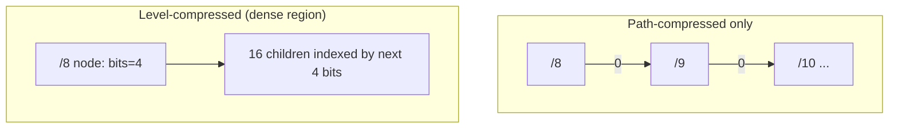
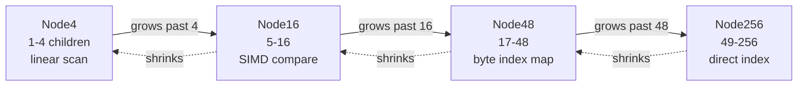
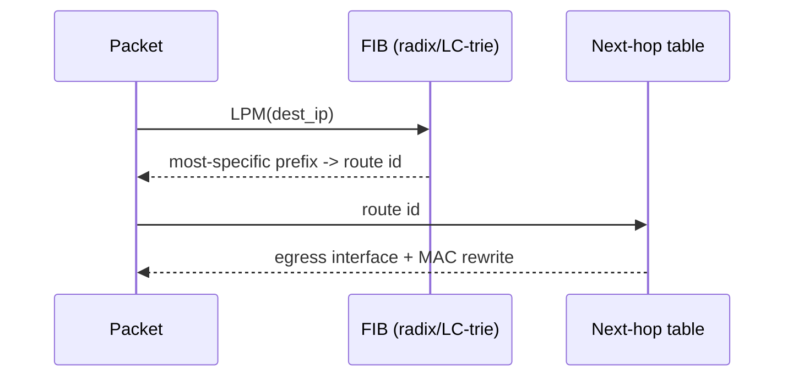
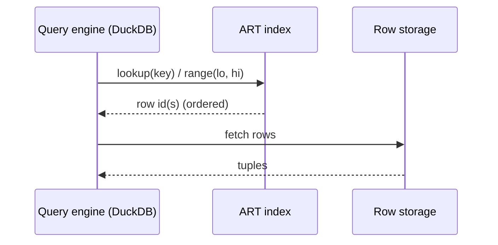
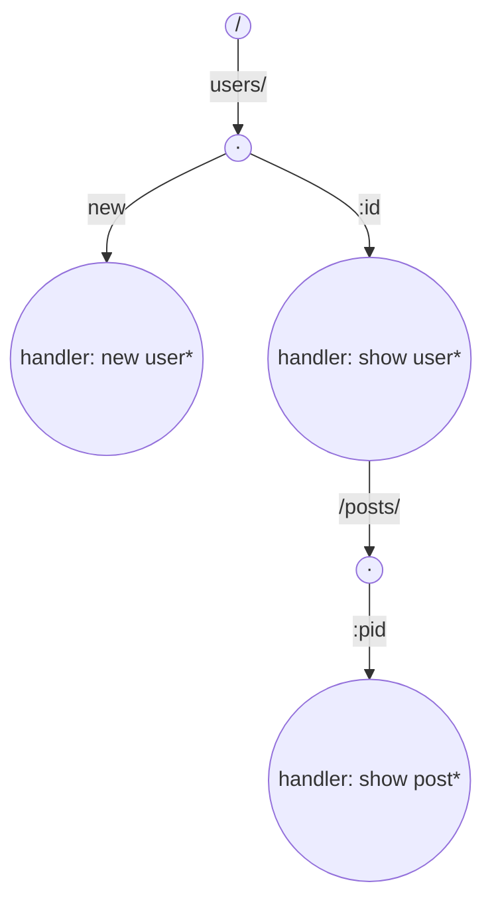

# PATRICIA Trie / Radix Tree — Senior Level

> **Audience:** Engineers and architects who must reason about radix trees at production scale — IP forwarding at line rate, main-memory database indexes, cache behavior, and memory budgets. Prerequisite: [`middle.md`](./middle.md).

The radix tree is not an academic curiosity; it is on the critical path of every packet your router forwards and every point-lookup a modern in-memory database serves. This chapter tours the two dominant production families — **IP routing / FIB** and **in-memory DB indexes (ART)** — then digs into the cache-efficiency and memory engineering that separate a textbook radix tree from one that runs at hardware speed.

---

## Table of Contents

1. [Introduction — Where Radix Trees Earn Their Keep](#introduction)
2. [IP Routing and the Forwarding Information Base](#fib)
3. [Linux `fib_trie` — Path + Level Compression](#fib-trie)
4. [The Adaptive Radix Tree (ART)](#art)
5. [ART Node Types and Cache Efficiency](#art-nodes)
6. [Comparison with Alternatives at Scale](#comparison)
7. [Memory Engineering](#memory)
8. [Architecture Patterns](#architecture)
9. [HTTP Routers — URL Path Matching](#http-routers)
10. [Ethereum's Merkle-Patricia Trie](#ethereum)
11. [A Concurrent Read-Optimized Radix Tree (Code)](#code)
12. [Capacity Planning and Back-of-Envelope Sizing](#capacity)
13. [Concurrency](#concurrency)
14. [Observability and Failure Modes](#observability)
15. [Summary](#summary)

---

<a name="introduction"></a>
## 1. Introduction — Where Radix Trees Earn Their Keep

Senior engineers choose a radix tree for one of three system-level reasons:

1. **Longest-prefix match at line rate** — IP forwarding tables (FIB) must answer LPM for millions of packets per second, with a routing table of hundreds of thousands of prefixes. The binary radix tree (PATRICIA / LC-trie) is the structure.
2. **Memory-resident point and range indexes** — main-memory databases (HyPer, DuckDB) need an index that is small enough to fit in RAM/cache and fast enough to keep up with an OLAP engine. The Adaptive Radix Tree (ART) is the answer.
3. **Authenticated key-value state** — Ethereum's Merkle-Patricia trie commits a hundred-million-account state to a single root hash with O(L) proofs.

In all three, the wins are the radix tree's two structural properties — **O(L) operations** and **O(N) node count** — combined with engineering to make those nodes **cache-resident**. The rest of this chapter is about that engineering.

---

<a name="fib"></a>
## 2. IP Routing and the Forwarding Information Base

A router's **Forwarding Information Base (FIB)** maps destination IP prefixes (CIDR blocks like `10.0.0.0/8`) to next-hop interfaces. For each arriving packet, the router performs a **longest-prefix match** of the destination address against the FIB and forwards via the most specific route.

The requirements are brutal:

- **Throughput**: a 100 Gbps link at 64-byte packets is ~148 million lookups/second.
- **Table size**: the global IPv4 BGP table is ~1M prefixes; IPv6 adds hundreds of thousands more.
- **Update rate**: BGP churn means thousands of prefix insert/delete operations per second, concurrent with lookups.
- **Determinism**: worst-case lookup latency must be bounded (no hash-collision tail).

A binary radix tree over the bits of the address answers LPM in O(32) for IPv4 (O(128) for IPv6) bit comparisons, deterministically, with O(prefix count) memory. That is why **every serious router** — kernel software routers, DPDK userspace stacks, and the control plane of hardware routers — uses a radix/PATRICIA variant for the FIB. (The hardware data plane often uses TCAM for the actual per-packet lookup, but the control-plane FIB that programs the TCAM is a radix tree.)

### Why not a hash table for routing?

A hash table can do exact-match on a fixed prefix length, but LPM requires trying **all** prefix lengths (0–32). The classic hash-based approach (Waldvogel's binary search on prefix lengths) needs `log(33)` hash probes plus careful marker management. A radix tree does it in one descent and supports prefix updates naturally. Hash tables also have collision tails that violate the determinism requirement.

---

<a name="fib-trie"></a>
## 3. Linux `fib_trie` — Path + Level Compression

The Linux kernel's IPv4 FIB is implemented in `net/ipv4/fib_trie.c` as an **LC-trie** (Level-Compressed trie, Nilsson & Karlsson 1998–1999). It applies two compressions:

- **Path compression** (the radix tree idea): collapse single-child chains. Each `tnode` stores `pos` (bit offset) and `bits` (how many bits this node consumes).
- **Level compression**: where a binary subtree is *dense* (close to full), replace `k` levels with a single node of `2^k` children, indexed by `k` bits at once. A full /24 region under a /8 becomes one wide node rather than 16 levels of binary nodes.

The effect: the average lookup depth for a real BGP table drops from 32 (naive bit trie) to roughly **6–8** node hops, and those wide nodes are contiguous arrays — cache-friendly.



Key engineering choices in `fib_trie`:

- **Resize heuristic**: nodes grow (`halve`/`double`) based on child-occupancy thresholds to keep the dense-vs-sparse trade-off near optimal. The code computes whether inflating a node (more bits, more children) or halving it (fewer bits) reduces total memory × depth.
- **RCU (Read-Copy-Update)**: lookups are lock-free; updates publish new nodes and retire old ones after a grace period, so packet forwarding never blocks on a route update.
- **Statistics** exposed via `/proc/net/fib_trie` and `/proc/net/fib_triestat` — node counts, depth histogram, prefixes per length.

Reading `fib_trie.c` alongside Nilsson's paper is one of the best ways to understand a production radix tree. BSD's older `sys/net/radix.c` (Sklower's PATRICIA) is the historical counterpart and still used in some stacks.

### DPDK LPM

For userspace packet processing, **DPDK's `rte_lpm`** library uses a different layout (a flat **DIR-24-8** table: a 16M-entry array for the first 24 bits plus 8-bit second-level tables) rather than a pointer trie, trading memory (tens of MB) for a guaranteed **1–2 memory accesses per lookup**. This is the radix idea taken to its hardware-friendly extreme: instead of pointer-chasing a tree, you index a precomputed array. The conceptual model is still longest-prefix match over a radix structure; the implementation is flattened for the cache.

---

<a name="art"></a>
## 4. The Adaptive Radix Tree (ART)

The **Adaptive Radix Tree (ART)**, by Viktor Leis, Alfons Kemper, and Thomas Neumann ("The Adaptive Radix Tree: ARTful Indexing for Main-Memory Databases", ICDE 2013), is the radix tree re-engineered to be the **primary index of an in-memory database**. It is used in:

- **HyPer** — the academic main-memory DBMS where ART originated (later acquired by Tableau/Salesforce).
- **DuckDB** — ART is its index structure for `ART` indexes and primary-key/unique constraints.
- **Many KV stores and research engines** — `libart`, the Rust `art-tree`, etc.

ART is a **byte-wise radix tree (radix 256)** with two key innovations:

1. **Adaptive node types.** A naive radix-256 tree wastes memory: most nodes have far fewer than 256 children, but a 256-pointer array per node is 2 KB. ART uses **four node sizes** — Node4, Node16, Node48, Node256 — and **grows/shrinks a node's type to match its actual fan-out**. A node with 3 children uses Node4 (tiny); one with 200 children uses Node256.
2. **Path compression + lazy expansion.** ART compresses single-child chains (like any radix tree) and additionally uses **lazy leaf expansion** — a leaf stores the full key suffix inline and only expands into inner nodes when a second key forces a branch. This keeps the tree shallow.

The result: ART matches or beats hash tables on point lookups, supports **range scans and ordered iteration** (which hash tables cannot), and uses memory comparable to a well-tuned hash table — all while being a radix tree.

---

<a name="art-nodes"></a>
## 5. ART Node Types and Cache Efficiency

The four node types are the heart of ART. Each handles a different fan-out range, sized to fit cache lines.

| Node type | Children range | Layout | Lookup method | Size (approx.) |
|---|---|---|---|---|
| **Node4** | 1–4 | parallel arrays: `keys[4]`, `children[4]` | linear scan (≤ 4 compares) | ~36 bytes |
| **Node16** | 5–16 | sorted `keys[16]` + `children[16]` | **SIMD** compare (SSE `_mm_cmpeq_epi8`) or binary search | ~150 bytes |
| **Node48** | 17–48 | 256-entry `childIndex[]` byte map → `children[48]` | index `childIndex[byte]`, then dereference | ~660 bytes |
| **Node256** | 49–256 | direct `children[256]` array | `children[byte]` direct index, O(1) | ~2 KB |

The progression is deliberate:

- **Node4 / Node16** are small enough to scan with a few comparisons; Node16 fits in one cache line and a single SIMD instruction compares all 16 key bytes against the search byte.
- **Node48** avoids a 256-pointer array (too big for low fan-out) by keeping a compact 256-byte index into a 48-slot child array — one extra indirection but 4× smaller than Node256.
- **Node256** is the dense case: direct array indexing, no search.



### Why this matters for cache

A B-tree node is hundreds of bytes and a lookup touches `log_B(N)` of them with binary search inside each. An ART lookup touches one node **per key byte** (e.g., 8 nodes for an 8-byte integer key), but each node is tiny (Node4/Node16 dominate real workloads) and the per-node work is a SIMD compare or a direct index — far cheaper than a B-tree's intra-node binary search. On modern CPUs ART beats B-trees and hash tables on mixed point/range workloads, which is exactly what an OLAP engine like DuckDB needs.

### Lazy expansion and path compression in ART

ART stores a **prefix** (the compressed path) inside each inner node, up to a fixed length, with an overflow scheme for longer prefixes ("pessimistic" vs "optimistic" path compression). A single-key subtree is just a leaf holding the remaining key bytes — no inner nodes until a second key forces a split (lazy expansion). This keeps the tree height at most the key length and usually much less.

---

<a name="comparison"></a>
## 6. Comparison with Alternatives at Scale

| Attribute | ART | B+ tree | Hash table | Plain radix (pointer) |
|---|---|---|---|---|
| Point lookup | O(L) bytes, cache-tight | O(log N) cache misses | O(1) avg | O(L) pointer chases |
| Range scan / ordered iter | ✓ | ✓ (best) | ✗ | ✓ |
| Longest-prefix match | ✓ | with effort | ✗ | ✓ |
| Memory | ~hash-table level | medium | low | high |
| Cache behavior | excellent (adaptive nodes) | good (wide nodes) | good | poor |
| Concurrency | OLC / ROWEX | latch coupling | striped locks | tricky |
| Used by | DuckDB, HyPer | most disk DBs | Redis, memcached | Linux FIB, routers |

**Choose ART when:** you need an in-memory index with both point lookups *and* ordered range scans, and memory matters (analytical DBs, KV stores).
**Choose a hash table when:** you only ever do point lookups and never need ordering or prefix queries.
**Choose a B+ tree when:** the index lives on disk/SSD and you need large fan-out to minimize I/O.
**Choose a binary PATRICIA / LC-trie when:** keys are bitstrings and you need longest-prefix match (IP routing).

---

<a name="memory"></a>
## 7. Memory Engineering

The radix tree's `O(N)` node bound is only half the story; the constant factor decides whether it fits in cache.

1. **Edge labels as slices.** Storing `(keyPtr, start, len)` instead of copied substrings eliminates per-edge allocation. ART's inline prefix does the same within a fixed budget.
2. **Adaptive node sizing (ART).** The single biggest memory lever: don't pay for 256 slots when a node has 3 children. Real datasets are dominated by Node4/Node16.
3. **Pointer tagging.** ART tags child pointers (low bits) to distinguish leaves from inner nodes without a separate type field, saving a word per child and a branch per dereference.
4. **Arena / pool allocation.** Allocate nodes from a contiguous arena so siblings are near each other in memory; reduces TLB and cache misses on traversal. Critical at million-key scale.
5. **Alphabet remapping.** If keys only use a small subset of byte values, remap to a dense range and shrink nodes accordingly (e.g., DNA tries: 4 symbols).
6. **Level compression (FIB).** Trades a little memory for far fewer hops and better cache residency on dense regions.
7. **Succinct / static layout for read-only tries.** Serialize an immutable radix tree to flat arrays (CSR-style) and `mmap` it; lookups become array indexing with zero allocation. Used in on-device dictionaries and tokenizers (see the [plain trie professional chapter](../../09-trees/05-trie/professional.md)).

A rule of thumb: a well-engineered ART index over 100M 8-byte keys lands in the low **gigabytes**, competitive with a hash table, while *also* supporting range scans — which is why DuckDB ships it.

These levers compose. A production ART index typically combines slice/inline labels (1), adaptive node sizing (2), pointer tagging (3), and arena allocation (4) simultaneously; a static on-device dictionary combines alphabet remapping (5) with a succinct/static layout (7). The discipline is to identify your dominant cost — pointer overhead, node-fill waste, allocation churn, or cache misses — and apply the matching lever, then *re-measure*. Memory engineering on radix trees is iterative: each lever shifts the bottleneck to the next one, and the order in which they bind depends entirely on your key distribution and read/write mix.

---

<a name="architecture"></a>
## 8. Architecture Patterns





- **Control plane vs data plane.** In routers, the radix tree lives in the control plane (slow path, flexible) and programs a TCAM/DIR-24-8 in the data plane (fast path, fixed). Keep the two in sync via RCU-style publication.
- **Index + heap separation (DBs).** ART maps keys → row-ids; the actual tuples live elsewhere. The index stays small and cache-resident.
- **Authenticated trie (blockchain).** Merkle-Patricia: every node hashes its children; the root commits state; proofs are root-to-leaf paths.

---

<a name="http-routers"></a>
## 9. HTTP Routers — URL Path Matching

A web framework's router maps an incoming request path (`/users/42/posts/7`) to a handler, often with **path parameters** (`/users/:id/posts/:pid`) and **wildcards** (`/static/*filepath`). The dominant implementation across the Go ecosystem — `julienschmidt/httprouter`, `go-chi/chi`, Gin, Echo — is a **radix tree of path segments**.

Why a radix tree fits so well:

- **Shared prefixes are everywhere.** `/users`, `/users/:id`, `/users/:id/posts` all share `/users`. The radix tree stores that prefix once.
- **Longest-prefix match is the routing rule.** The most specific registered route wins, exactly the LPM operation.
- **O(L) per request**, where L is the path length — independent of how many routes are registered. A service with 5,000 routes matches in the same time as one with 5.

The twist over a plain string radix tree is **typed edges**:

| Edge kind | Example | Match rule |
|---|---|---|
| Static | `/users` | exact substring match |
| Param | `:id` | matches one segment, binds a variable |
| Catch-all | `*filepath` | matches the rest of the path |

`httprouter` keeps static, param, and catch-all children separated per node and tries them in **priority order** (static beats param beats catch-all) so the most specific route always wins. Inserting `/users/:id` next to `/users/new` correctly routes `/users/new` to the static handler and `/users/42` to the param handler — a longest/most-specific-prefix decision applied per segment.



The lesson for senior engineers: when you see "match the most specific registered pattern, fast, regardless of pattern count," reach for a radix tree. It is why every high-performance Go router is built on one.

---

<a name="ethereum"></a>
## 10. Ethereum's Merkle-Patricia Trie

Ethereum stores its entire world state — every account balance, contract code, and contract storage slot — in a **Merkle-Patricia Trie (MPT)**, the single most consequential production radix tree in cryptocurrency. It fuses three ideas:

1. **PATRICIA path compression** over the **hex-nibble** encoding of keys (a 32-byte key becomes 64 nibbles; radix 16).
2. **Merkle hashing**: every node's identity is the hash of its serialized contents, so a node's hash transitively commits to its whole subtree.
3. **Persistence**: nodes are content-addressed and stored in a key-value DB (LevelDB/Pebble in go-ethereum), so identical subtrees are shared and historical states remain reconstructable.

The MPT uses three node types to balance compression and hashing:

| MPT node | Role | Analogy to this chapter |
|---|---|---|
| **Branch node** | 16 child slots (one per nibble) + a value | a radix-16 inner node |
| **Extension node** | a shared nibble path + one child | a compressed single-child edge (path compression!) |
| **Leaf node** | the remaining key nibbles + the value | a terminal edge with the key suffix inline |

The **extension node is literally the path-compression mechanism** from this chapter: instead of 1 branch node per nibble, a run of single-child nibbles collapses into one extension node carrying the shared nibble string. Without it the state trie would be 64 levels deep and astronomically large.

What the MPT buys Ethereum:

- **O(L) state access** — read or write any account in ~64 nibble hops (usually far fewer after compression).
- **Constant-size state commitment** — the 32-byte **state root** in each block header commits to the entire state.
- **O(L) Merkle proofs** — a light client proves "account X has balance Y" by sending the root-to-leaf path (~a few KB of node hashes), verifiable against the state root without downloading the chain. This is the foundation of light clients, rollup state proofs, and cross-chain bridges.

The trade-off is **hashing cost on every update**: changing one account rehashes every node on its root-to-leaf path (~64 hashes). Ethereum mitigates this with caching, trie-node batching, and (in newer designs) flat state layouts plus a verkle-trie migration to shrink proofs further. But the structural backbone remains a PATRICIA radix tree.

---

<a name="code"></a>
## 11. A Concurrent Read-Optimized Radix Tree (Code)

A production radix tree in a read-heavy system (router, index, FIB) must let many readers proceed without locking. The simplest robust technique is **copy-on-write at the modified path with atomic root publication** (an RCU-flavored approach): a writer rebuilds only the O(L) nodes it touches and atomically swaps the root pointer; readers always observe a consistent immutable snapshot.

#### Go

```go
package radix

import "sync/atomic"

type node struct {
	label    string
	children map[byte]*node // treated as immutable once published
	isEnd    bool
}

// Tree holds an atomically-swappable root. Readers load it lock-free.
type Tree struct {
	root atomic.Pointer[node]
}

func New() *Tree {
	t := &Tree{}
	t.root.Store(&node{children: map[byte]*node{}})
	return t
}

func cpl(a, b string) int {
	n := len(a)
	if len(b) < n {
		n = len(b)
	}
	i := 0
	for i < n && a[i] == b[i] {
		i++
	}
	return i
}

// Search is lock-free: it reads an immutable snapshot of the tree.
func (t *Tree) Search(key string) bool {
	n := t.root.Load()
	for key != "" {
		c, ok := n.children[key[0]]
		if !ok {
			return false
		}
		k := cpl(c.label, key)
		if k < len(c.label) {
			return false
		}
		key = key[k:]
		n = c
	}
	return n.isEnd
}

// clone shallow-copies a node so writers never mutate published state.
func clone(n *node) *node {
	cp := &node{label: n.label, isEnd: n.isEnd, children: make(map[byte]*node, len(n.children))}
	for k, v := range n.children {
		cp.children[k] = v
	}
	return cp
}

// Insert builds new versions of the touched path and publishes a new root.
// Callers must serialize writers (single writer or an external mutex).
func (t *Tree) Insert(key string) {
	old := t.root.Load()
	newRoot := insertCOW(old, key)
	t.root.Store(newRoot) // atomic publish; readers see all-or-nothing
}

func insertCOW(n *node, key string) *node {
	n = clone(n)
	if key == "" {
		n.isEnd = true
		return n
	}
	c, ok := n.children[key[0]]
	if !ok {
		n.children[key[0]] = &node{label: key, isEnd: true, children: map[byte]*node{}}
		return n
	}
	k := cpl(c.label, key)
	if k == len(c.label) {
		n.children[key[0]] = insertCOW(c, key[k:])
		return n
	}
	// split, all on fresh nodes
	cChild := clone(c)
	cChild.label = c.label[k:]
	split := &node{label: c.label[:k], children: map[byte]*node{}}
	split.children[cChild.label[0]] = cChild
	if k == len(key) {
		split.isEnd = true
	} else {
		rest := key[k:]
		split.children[rest[0]] = &node{label: rest, isEnd: true, children: map[byte]*node{}}
	}
	n.children[key[0]] = split
	return n
}
```

Readers call `Search` with zero synchronization; a writer rebuilds at most `O(L)` nodes (everything else is structurally shared with the previous version) and makes the change visible with a single atomic store. This is the same principle behind Linux FIB's RCU and persistent HAMTs — the radix tree's small per-update footprint (one root-to-leaf path) is exactly what makes copy-on-write cheap here.

---

<a name="capacity"></a>
## 12. Capacity Planning and Back-of-Envelope Sizing

Senior work means estimating memory and latency before building. The three numbers that drive every radix-tree estimate are: **(1) node count ≈ O(N)** (not O(N·L) — this is the whole point), **(2) bytes per node** set by the variant (fixed-width vs adaptive), and **(3) miss count per lookup** set by the compressed height and node width. Nail those three and any deployment sizes itself. Two worked examples follow.

### Example A — IP routing FIB

- **Table:** 1,000,000 IPv4 prefixes (full BGP table).
- **Structure:** LC-trie, ≤ `2N − 1 ≈ 2M` nodes; with level compression, far fewer pointer-nodes plus wide arrays.
- **Per node:** ~32–64 bytes (bit position, child array pointer, next-hop index).
- **Memory:** order of **64–128 MB** — fits in L3 + RAM comfortably.
- **Latency:** ~6–8 node hops × ~one cache miss each ≈ tens of nanoseconds; DIR-24-8 flattening guarantees ≤ 2 accesses if you trade ~33 MB of array.
- **Throughput target:** 148 Mpps at 100 Gbps ⇒ ~7 ns/lookup budget ⇒ DIR-24-8 or heavily cache-resident LC-trie required.

### Example B — In-memory DB index (ART)

- **Keys:** 100,000,000 8-byte integer keys.
- **Nodes:** ≤ `2N − 1`, but ART path compression + lazy expansion collapses most → effective inner nodes ≈ tens of millions, dominated by **Node4/Node16** (~36–150 bytes each).
- **Leaves:** 100M × (8-byte key + 8-byte row-id) ≈ **1.6 GB** unavoidable key/value payload.
- **Inner-node overhead:** order of **1–3 GB** depending on key distribution.
- **Total:** a few GB — competitive with a hash table over the same keys, **plus** ordered range scans the hash table cannot do.
- **Latency:** ~8 byte-hops, mostly tiny cache-resident nodes ⇒ point lookup in the **100–300 ns** range; range scan amortizes node traversal across many results.

The estimation discipline: `nodes ≈ O(N)` (not O(N·L)), per-node bytes set by the variant (fixed vs adaptive), and miss-count set by height (compressed) and node width (cache lines). Get those three numbers and you can size any radix-tree deployment.

---

<a name="comparison2"></a>
## 12b. Choosing Among Routing/Index Structures in Practice

Senior decisions are rarely "radix tree: yes/no" — they are "which radix variant, or which competitor, for *this* workload." A decision guide:

| Workload | Recommended structure | Why |
|---|---|---|
| Kernel IPv4 FIB, mutable, BGP churn | LC-trie (`fib_trie`) | path + level compression, RCU updates, deterministic LPM |
| Userspace packet forwarding, fixed table | DIR-24-8 (DPDK `rte_lpm`) | ≤ 2 memory accesses; trade ~33 MB for guaranteed latency |
| In-memory DB primary/secondary index | ART | point + range, hash-table memory, ordered scans |
| Read-only embedded dictionary | Succinct/double-array trie (`mmap`) | zero allocation, tiny, fast boot |
| HTTP route table | Segment radix tree (httprouter/chi) | most-specific match, O(path length) |
| Authenticated key-value state | Merkle-Patricia | root-hash commitment + O(L) proofs |
| Persistent immutable map | HAMT/CHAMP (hash radix) | structural sharing, O(log₃₂ n) updates |
| Pure exact-match, no ordering | Hash table | smaller and faster when you never need prefix/range/LPM |

Two anti-patterns to call out in a design review:

- **Using a radix tree where a hash table suffices.** If the access pattern is "lookup full key, never prefix/range/LPM," the radix tree adds code complexity and pointer chasing for no benefit. Push back.
- **Rolling your own LPM for production routing.** Mature implementations (kernel LC-trie, DPDK, vendor SDKs) handle the cache layout, concurrency, and corner cases (overlapping prefixes, default routes, IPv6 128-bit keys). Reuse them.

### ART vs B-tree vs hash table — the measured picture

The ART paper and subsequent DuckDB experience report, for in-memory integer/string keys:

- **Point lookups:** ART ≈ hash table, both well ahead of B+ tree (which pays `log_B N` cache misses with intra-node binary search).
- **Range scans:** ART ≈ B+ tree; hash table cannot do them at all.
- **Memory:** ART ≈ hash table (adaptive nodes), B+ tree slightly higher per key due to fill-factor slack.
- **Inserts:** ART competitive; the amortized resize cost (proved O(1) in `professional.md`) keeps it from dominating.

The senior takeaway: ART is the structure you reach for when you need **both** hash-table-speed point lookups **and** B-tree-style ordered scans in memory — which is exactly the requirement of a modern analytical engine, and why DuckDB ships it.

---

<a name="concurrency"></a>
## 13. Concurrency

Radix trees are read-heavy in both flagship use cases (packet forwarding, OLAP point lookups), so concurrency strategies favor lock-free or optimistic reads:

- **RCU (Linux FIB).** Readers never lock; writers build new node versions and free old ones after a grace period. Perfect for the read-mostly FIB with bursty BGP updates.
- **Optimistic Lock Coupling (OLC).** ART's concurrency scheme (Leis et al., "The ART of Practical Synchronization", 2016): each node has a version counter; readers validate the version after reading (retry on conflict), writers lock only the nodes they modify. Scales to many cores without read locks.
- **ROWEX (Read-Optimized Write EXclusion).** A variant where reads never block and never retry; writers exclude each other but coordinate with readers via atomic operations. Used where read latency tails must be tight.
- **Sharding.** Partition the key space across independent radix trees (e.g., by first byte) so writers rarely contend.

The general lesson: because the structure is read-dominated and updates touch a small `O(L)` path, optimistic schemes (validate-or-retry) outperform pessimistic locking.

---

<a name="ipv6"></a>
## 13b. IPv6 and the Pressure of Wider Keys

IPv6 doubles down on every radix-tree property because its keys are **128 bits** instead of 32. This stresses the design in three ways and showcases why path/level compression is not optional at scale:

- **Depth.** A naive binary trie would be 128 levels deep per lookup — 128 potential cache misses per forwarded packet, untenable at line rate. Path compression collapses the long runs of identical high-order bits in aggregated prefixes (a `/48` allocation shares 48 bits with all its sub-prefixes), and level compression widens dense regions, keeping the *traversed* depth in the single digits.
- **Sparsity.** The IPv6 address space is astronomically sparse — real routing tables use a tiny fraction of the 128-bit space, so most internal nodes have very low fan-out. This is exactly where adaptive/small nodes (the ART idea, or Linux's resizing tnodes) pay off; a fixed wide node would waste enormous memory.
- **Memory.** Even with hundreds of thousands of IPv6 prefixes, the `O(N)` node bound keeps the FIB in the tens-of-MB range — but only because the structure is `O(N)`, not `O(N × 128)`. A plain trie would be hopeless here.

The practical upshot: the wider the key, the *more* the radix tree's `O(N)`-nodes-not-`O(N·L)`-nodes guarantee matters. IPv6 is the clearest argument for compression — and Linux's `ip6_fib.c` mirrors `fib_trie.c`'s compression strategy precisely for this reason.

---

<a name="observability"></a>
## 14. Observability and Failure Modes

| Metric | Why it matters | Alert threshold |
|---|---|---|
| `lpm_lookup_latency_p99` | Forwarding/index tail latency | > a few µs (software FIB) |
| `node_count` vs `key_count` | Detects lost compression (drift toward plain trie) | ratio > ~2.5 |
| `tree_depth_max` / depth histogram | Long chains hurt cache | depth >> log_r(N) |
| `node_type_distribution` (ART) | Too many Node256 ⇒ memory blow-up | Node256 fraction unexpectedly high |
| `update_grace_period_backlog` (RCU) | Old nodes not reclaimed | growing unbounded |

**Failure modes and mitigations:**

- **Compression drift.** Delete without merge slowly turns the radix tree into a plain trie — node count climbs, cache suffers. *Mitigation:* always merge on delete; monitor node/key ratio.
- **Pathological keys.** Adversarial keys with maximal shared prefixes create deep chains (e.g., `aaaa...a`). *Mitigation:* path compression already collapses the chain into one edge; cap edge-label length and overflow gracefully.
- **Memory blow-up from full nodes.** A workload that fills many nodes to Node256 inflates memory. *Mitigation:* this is usually correct (dense key space), but monitor and consider hashing the key prefix if the density is incidental.
- **Update/read contention.** Heavy concurrent writes stall readers under pessimistic locks. *Mitigation:* OLC/ROWEX/RCU as above.
- **TLB/cache misses on traversal.** Scattered node allocation. *Mitigation:* arena allocation, level compression, ART adaptive nodes.
- **Default-route / fallthrough bugs.** An LPM with no matching prefix and no default returns "none," which in a router silently drops packets. *Mitigation:* always install a `0.0.0.0/0` (or empty-string) terminal so LPM has a guaranteed fallback; assert non-null results in the lookup path.
- **Proof bloat (Merkle-Patricia).** Deep, uncompressed paths make inclusion proofs large and verification slow. *Mitigation:* the extension/path-compression node keeps proofs short; monitor average proof size and migrate to flatter encodings (verkle) if it grows.

The throughline of these failure modes: a radix tree degrades **gracefully but silently**. It keeps answering queries correctly even as compression drifts or nodes bloat — the symptom is rising memory and latency, not wrong answers. That makes the `node_count / key_count` ratio and the depth histogram your most valuable early-warning signals; wire them into dashboards before the structure reaches production scale.

---

<a name="summary"></a>
## 15. Summary

- Radix trees dominate two production domains: **IP routing/FIB** (binary PATRICIA / LC-trie, longest-prefix match at line rate) and **in-memory DB indexes** (ART in DuckDB/HyPer).
- **Linux `fib_trie`** combines path compression with **level compression** to cut lookup depth from 32 to ~8 and keep nodes cache-resident; updates use RCU so reads never block.
- **ART** makes the radix tree a first-class DB index via **adaptive node types** (Node4/16/48/256) sized to fan-out and cache lines, plus path compression and lazy leaf expansion — matching hash tables on point lookups while supporting range scans.
- **Cache efficiency and memory engineering** (slice labels, adaptive nodes, pointer tagging, arena allocation, level compression) are what separate a production radix tree from a textbook one.
- **Concurrency** favors optimistic/lock-free schemes (RCU, OLC, ROWEX) because the workload is read-dominated and updates touch only an O(L) path.
- Next: [`professional.md`](./professional.md) proves the O(L) operation bounds, the O(N) node bound, longest-prefix-match correctness, and analyzes ART node-type space formally.

---

Next step: [`professional.md`](./professional.md) — formal proofs of O(L) operations, the O(N) node bound, longest-prefix-match correctness, and ART node-type space analysis.
