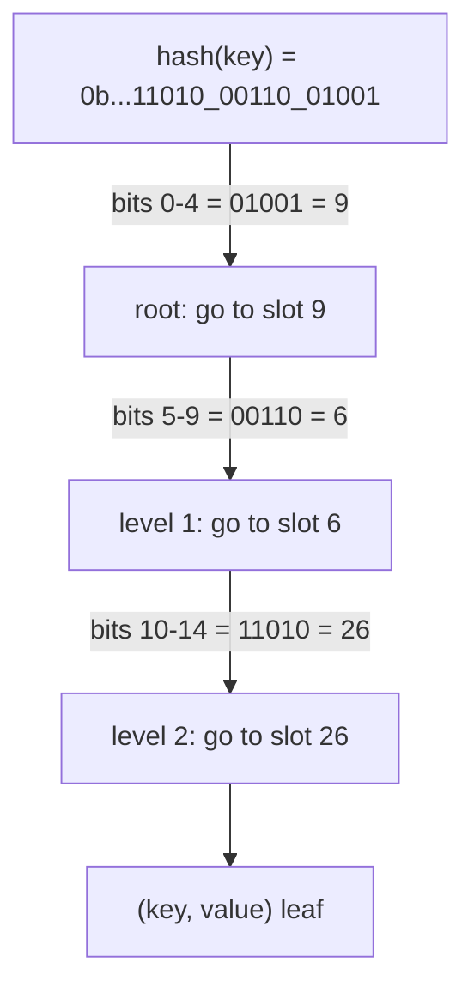
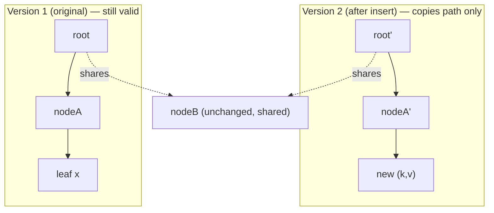
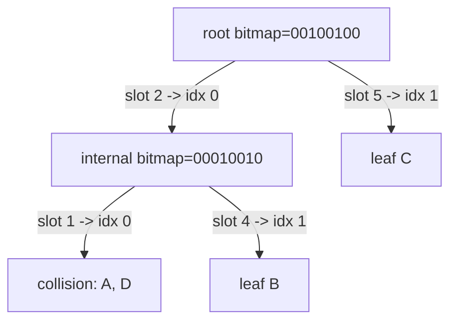
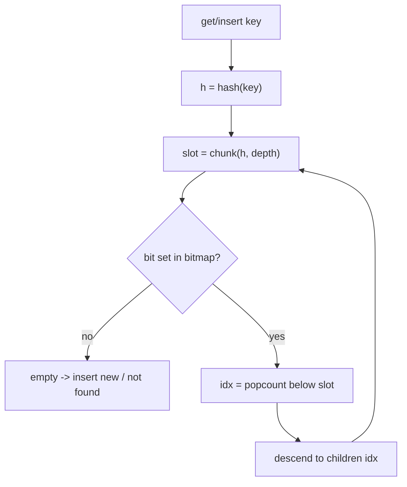

# Hash Array Mapped Trie (HAMT) — Junior Level

> **Read time: ~55 minutes** · **Audience:** Students who already know a [hash table](../../05-basic-data-structures/05-hash-tables/junior.md) (buckets + a hash function) and a [trie](../../09-trees/05-trie/junior.md) (a tree keyed on pieces of a key) and now want to see how they combine into a single map that is both **fast** and **immutable**.

A **Hash Array Mapped Trie** — almost always abbreviated **HAMT** — is a key/value map (a dictionary) that stores its entries in a **trie keyed on chunks of the key's hash code** instead of on the characters of the key. At each level of the tree it looks at **5 bits of the hash** (giving a number 0–31), and uses that number to pick one of up to **32 children**. Because 32 is large, the tree is extremely shallow: even a billion keys live at depth ~6. That makes `get`, `insert`, and `delete` run in **O(log₃₂ n)** time — which for any realistic `n` is "effectively constant", just a handful of array hops.

The HAMT has one more trick that makes it special. A node that *could* have 32 children almost never has all 32. Storing a full 32-slot array at every node would waste enormous memory. So a HAMT node keeps a **32-bit bitmap** that marks which child slots are actually present, plus a **small dense array** holding only those present children. A CPU instruction called **popcount** (population count = "how many 1-bits") converts a sparse slot number into the right index in the small array. This **bitmap + popcount compression** is the heart of the data structure and the thing most beginners have never seen before.

Finally, HAMTs are usually **immutable / persistent**: an `insert` does not modify the existing map, it returns a **new** map that shares almost all of its memory with the old one. Only the nodes on the path from the root down to the change are copied — exactly the **path-copying** idea from the [persistent segment tree](../11-persistent-segment-tree/junior.md). This is why functional languages (Clojure, Scala, Haskell) build their standard immutable maps on top of HAMTs.

This document teaches the HAMT from scratch on tiny examples. We hash a key, chop the hash into 5-bit chunks, walk the trie, and watch the bitmap + popcount turn a sparse index into a dense array index. Then we do a full `insert` and see exactly which nodes get copied and which get shared.

---

## Table of Contents

1. [Introduction — Hash Table Meets Trie](#introduction)
2. [Prerequisites](#prerequisites)
3. [Glossary](#glossary)
4. [Core Concepts — Hash Chunks, Bitmap, Popcount, Sharing](#core-concepts)
5. [Big-O Summary](#big-o)
6. [Real-World Analogies](#analogies)
7. [Pros and Cons (vs hash table, vs ordinary trie)](#pros-cons)
8. [Step-by-Step Walkthrough — Inserting Four Keys](#walkthrough)
9. [Code Examples — Go, Java, Python](#code-examples)
10. [Coding Patterns — Bitmap Index, Path Copy](#patterns)
11. [Error Handling](#errors)
12. [Performance Tips](#performance-tips)
13. [Best Practices](#best-practices)
14. [Edge Cases and Pitfalls](#edge-cases)
15. [Common Mistakes](#common-mistakes)
16. [Cheat Sheet](#cheat-sheet)
17. [Visual Animation Reference](#animation)
18. [Summary](#summary)
19. [Further Reading](#further-reading)

---

<a name="introduction"></a>
## 1. Introduction — Hash Table Meets Trie

You already know two ways to store a map:

- A **hash table** hashes the key to a number, takes it modulo the bucket count, and stores the entry in that bucket. It is O(1) on average but it is **mutable** (you overwrite the slot in place), it has to **resize and re-hash** when it gets full, and keeping an old copy means copying the *whole* table.
- A **trie** stores keys as paths in a tree, one tree level per piece of the key (e.g. one character of a string). It shares common prefixes and never needs resizing, but a plain trie keyed on raw keys can get tall and its nodes are sparse.

A **HAMT** takes the best of both. It uses a **hash** (like a hash table) but then it builds a **trie on the bits of that hash** (like a trie). Because the hash is uniformly random, the trie stays balanced and shallow without any rebalancing logic. And because it is a tree of small immutable nodes, you can make a **new version** cheaply by copying only the path you touched — you never re-hash or copy the whole structure.

Here is the one-sentence summary to keep in your head:

> A HAMT is a trie whose levels are **5-bit chunks of the key's hash**, whose nodes are **compressed with a bitmap + popcount** so they store only present children, and whose updates are **immutable** via path copying.

Three properties fall out of that sentence, and the rest of this file unpacks them:

1. **Shallow tree → fast.** 5 bits per level means up to 32 children per node, so depth is `⌈(hash bits)/5⌉`. For a 32-bit hash that is at most 7 levels; for a 64-bit hash at most 13. `get`/`insert`/`delete` are O(log₃₂ n), effectively O(1).
2. **Bitmap + popcount → compact.** A node with only 3 children stores a 3-element array, not a 32-element array, and uses popcount to map slot numbers to array positions.
3. **Immutable → persistent.** `insert` returns a new map; the old map still works; they share everything except the copied path.

HAMTs were introduced by **Phil Bagwell** in his 2001 paper *Ideal Hash Trees*. Rich Hickey then used them as the foundation of **Clojure's** persistent maps and vectors, after which Scala, Haskell's `unordered-containers`, and many other libraries adopted the design.

---

<a name="prerequisites"></a>
## 2. Prerequisites

You should be comfortable with:

1. **Hash functions and hash tables.** What a hash code is, that good hashes spread keys uniformly, and what a *collision* (two keys, same hash) is. See [`05-hash-tables`](../../05-basic-data-structures/05-hash-tables/junior.md).
2. **Tries.** A tree keyed on pieces of a key, where you descend one level per piece. See [`09-trees/05-trie`](../../09-trees/05-trie/junior.md).
3. **Binary and bit operations.** Reading a number as bits, masking with `& 0x1F`, shifting with `>>`, testing a bit with `& (1 << k)`, and setting a bit with `| (1 << k)`.
4. **Popcount.** "How many 1-bits are in this integer." Most languages have a built-in (`bits.OnesCount32`, `Integer.bitCount`, `bin(x).count("1")` or `int.bit_count()`).
5. **Immutability / pointers.** That a node, once built, is never edited; to "change" something you build new nodes and reuse (share) the old unchanged ones — exactly like the [persistent segment tree](../11-persistent-segment-tree/junior.md).

You do **not** need balanced-BST theory, amortized analysis, or the CHAMP optimization — those come in later files.

---

<a name="glossary"></a>
## 3. Glossary

| Term | Definition |
|---|---|
| **HAMT** | Hash Array Mapped Trie — a map storing entries in a trie keyed on chunks of the key's hash. |
| **Hash code** | An integer derived from the key by a hash function; the HAMT navigates on its bits. |
| **Chunk / fragment** | A fixed-width slice of the hash (here **5 bits**) consumed at one trie level. |
| **Branching factor** | Children per node — `2^5 = 32` for 5-bit chunks. |
| **Bitmap** | A 32-bit integer in each node; bit `i` is 1 iff slot `i` has a child. |
| **Popcount** | Population count: the number of 1-bits in an integer. Maps a sparse slot to a dense array index. |
| **Dense array** | The node's compact child array, holding only present children (length = popcount of bitmap). |
| **Sparse index** | The 0–31 slot number computed from a 5-bit hash chunk. |
| **Dense index** | The actual array position = popcount of the bitmap bits *below* the target slot. |
| **Structural sharing** | Two map versions pointing at the *same* physical node because that subtree didn't change. |
| **Path copying** | On update, clone only the nodes from the root to the change; share everything else. |
| **Persistent / immutable** | After an update the old version is still fully usable. |
| **Leaf / entry node** | A node holding an actual `(key, value)` pair at the bottom of a path. |
| **Collision node** | A special leaf holding several entries whose **full hashes are equal** (or equal in all used bits). |

---

<a name="core-concepts"></a>
## 4. Core Concepts — Hash Chunks, Bitmap, Popcount, Sharing

### 4.1 Step one: hash the key, then chop the hash into 5-bit chunks

Everything starts by computing `h = hash(key)`, a 32-bit (or 64-bit) integer. We then read `h` **5 bits at a time, from the bottom up**. At depth `d` (starting at 0) the chunk is:

```
chunk(d) = (h >> (5 * d)) & 0x1F      // 0x1F = 31 = five 1-bits = 0b11111
```

So depth 0 uses bits 0–4, depth 1 uses bits 5–9, depth 2 uses bits 10–14, and so on. Each chunk is a number 0–31 that selects one of the node's 32 possible child slots. A 32-bit hash gives `⌈32/5⌉ = 7` chunks, so the trie is at most 7 levels deep.



### 4.2 Step two: the bitmap — which slots are present

A node *could* have 32 children, but it almost never does. Instead of a 32-slot array (which would be 32 pointers ≈ 256 bytes mostly empty), each node stores:

- a **32-bit bitmap** `bm`: bit `i` is 1 exactly when slot `i` is occupied;
- a **dense array** of children, holding only the present ones, in slot order.

To check whether slot `s` is present you test one bit:

```
present = (bm & (1 << s)) != 0
```

If the bit is 0, there is no child there — for `get` that means "key not found", for `insert` that means "add a brand-new child here".

### 4.3 Step three: popcount — turning a sparse slot into a dense index

When slot `s` *is* present, where is it in the small dense array? It is at the position equal to **the number of present slots below `s`** — that is, the popcount of the bitmap bits in positions `0..s-1`:

```
mask  = (1 << s) - 1          // all 1-bits below position s
index = popcount(bm & mask)   // how many present children come before slot s
child = node.children[index]
```

**Worked example.** Say a node has children only in slots 1, 4, and 9. Then:

```
bitmap  = 0b...0010010010   (bits 1, 4, 9 set)
dense    = [ childForSlot1, childForSlot4, childForSlot9 ]   // length 3
```

To find slot 4: `mask = (1<<4)-1 = 0b1111`, `bm & mask = 0b...0010` (only bit 1 survives), `popcount = 1`, so slot 4's child is at `dense[1]`. Correct — slot 4 is the second present child.

This is the single most important mechanism in the HAMT: **popcount maps a sparse 0–31 slot onto a tight, gap-free array index.** No wasted space, and the lookup is two cheap bit operations plus one popcount.

### 4.4 Step four: immutability via path copying

A HAMT update never edits a node in place. To `insert` a key it:

1. walks down using the chunks, remembering the path;
2. builds a **new leaf** (or splits an existing one);
3. rebuilds **each node on the path** as a fresh copy with one child pointer changed;
4. returns the **new root**.

Every node *off* the path is shared by pointer between the old and the new map — this is **structural sharing**. Because the path is only O(log₃₂ n) nodes long, an insert copies only ~6 small nodes regardless of how big the map is. The old map is untouched and still valid.



### 4.5 Collisions at the bottom

Because the hash has only so many bits, two different keys can hash to the **same full value** (a true collision). When that happens the keys would want the exact same path forever, so the HAMT stores them together in a **collision node**: a small list of `(key, value)` entries that all share that hash. Lookups in a collision node compare keys one by one (it is tiny, so this is fine). Good hash functions make collision nodes vanishingly rare.

---

<a name="big-o"></a>
## 5. Big-O Summary

Let `n` be the number of entries. The branching factor is `B = 32`, so the trie depth is at most `log_B n ≈ log₃₂ n`.

| Operation | Time | Space (extra per update) | Notes |
|---|---|---|---|
| `get(key)` | O(log₃₂ n) | O(1) | ~6 node hops for billions of keys |
| `insert(key, value)` | O(log₃₂ n) | O(log₃₂ n) | copies the path; shares the rest |
| `delete(key)` | O(log₃₂ n) | O(log₃₂ n) | copies the path; may collapse nodes |
| `popcount index` | O(1) | O(1) | one hardware instruction |
| Whole-map memory | — | O(n) | dense arrays, no 32-wide waste |

Because `log₃₂(10⁹) ≈ 6`, people describe HAMT operations as **effectively O(1)**. The honest answer in an interview is **O(log₃₂ n)** with a tiny constant.

---

<a name="analogies"></a>
## 6. Real-World Analogies

| Concept | Analogy | Where it breaks |
|---|---|---|
| **5-bit chunks of the hash** | A postal address read part by part: country → region → city → street → house. Each part narrows the search. | Address parts are meaningful; hash chunks are random noise (which is exactly what keeps the tree balanced). |
| **Bitmap + popcount** | A hotel floor with 32 room numbers but only 3 rooms actually built. A small directory ("rooms 1, 4, 9 exist") plus counting how many built rooms precede yours tells you which physical door to open. | A real hotel renumbers awkwardly; popcount renumbers instantly with one instruction. |
| **Structural sharing** | A Git commit: a new commit reuses every unchanged file and only stores what changed. | Git diffs are content-based; HAMT sharing is pointer-based at node granularity. |
| **Immutability** | A photocopy where you only re-photocopy the one page you edited and staple it onto the old stack. | Real paper can't share a page between two stacks; pointers can. |

---

<a name="pros-cons"></a>
## 7. Pros and Cons

| Pros | Cons |
|---|---|
| Effectively O(1) get/insert/delete (O(log₃₂ n)) | Slightly slower per-op than a tuned mutable hash table |
| Immutable: cheap new versions via path copying | More pointer-chasing → more cache misses than a flat array |
| No global resize / re-hash ever needed | Each update allocates ~6 small nodes (GC pressure) |
| Structural sharing → many versions share memory | More complex to implement than a plain hash map |
| Compact nodes (bitmap + popcount), no 32-wide waste | Worst case degrades on bad/adversarial hashes (collision nodes) |
| Naturally thread-safe for readers (nodes never mutate) | No ordering of keys (it's a hash structure, not sorted) |

**When to use:** you need an **immutable / persistent** map, many cheap snapshots, or lock-free shared reads (functional-language collections, copy-on-write config, undo history).

**When NOT to use:** a single-threaded hot loop that mutates one map and never keeps old versions — a plain mutable hash map will be faster and lighter.

---

<a name="walkthrough"></a>
## 8. Step-by-Step Walkthrough — Inserting Four Keys

We will use a **toy 6-bit hash** with **3-bit chunks** (branching factor 8) so the numbers are small and easy to read. (Real HAMTs use 32-bit hashes and 5-bit chunks; the logic is identical.) A node's bitmap is therefore 8 bits.

Suppose four keys hash like this:

| Key | hash (6 bits) | chunk@d0 (bits 0–2) | chunk@d1 (bits 3–5) |
|---|---|---|---|
| `A` | `001 010` | `010 = 2` | `001 = 1` |
| `B` | `100 010` | `010 = 2` | `100 = 4` |
| `C` | `000 101` | `101 = 5` | `000 = 0` |
| `D` | `001 010` | `010 = 2` | `001 = 1` |

Note `A` and `D` have the **same full hash** → a real collision.

**Insert A.** Root is empty. chunk@d0 = 2. Set bit 2 in the root bitmap and store leaf `A` in the dense array.

```
root.bitmap = 0b00000100   (bit 2)
root.dense  = [ leaf(A) ]
```

**Insert B.** chunk@d0 = 2 — collides with `A` at the root slot, but their hashes differ deeper. So we **split**: replace the leaf at slot 2 with an internal node that distinguishes `A` and `B` by their next chunk. `A`'s chunk@d1 = 1, `B`'s chunk@d1 = 4.

```
root.dense[0] = internalNode {
    bitmap = 0b00010010   (bits 1 and 4)
    dense  = [ leaf(A), leaf(B) ]   // slot 1 -> index 0, slot 4 -> index 1
}
```

**Insert C.** chunk@d0 = 5. Bit 5 is not set in the root → brand-new child. Set bit 5; the dense index is `popcount(rootBitmap & ((1<<5)-1)) = popcount(0b00000100) = 1`, so `C` is inserted at dense index 1 (after the slot-2 child).

```
root.bitmap = 0b00100100   (bits 2 and 5)
root.dense  = [ internal(A,B), leaf(C) ]
```

**Insert D.** chunk@d0 = 2 → internal node; chunk@d1 = 1 → `A`'s slot. But `D`'s full hash equals `A`'s, and we've run out of distinguishing bits, so we convert that leaf into a **collision node** holding both:

```
internal.dense[0] = collisionNode { (A, valA), (D, valD) }
```

The final tree:



**Lookup `get(B)`:** chunk@d0 = 2 → present (bit 2), index 0 → internal. chunk@d1 = 4 → present (bit 4), index `popcount(0b00010010 & 0b1111) = popcount(0b00000010) = 1` → `dense[1] = leaf(B)`. Compare key → match. Found in 2 hops.

---

<a name="code-examples"></a>
## 9. Code Examples — Go, Java, Python

Below is a minimal, read-only-friendly **immutable HAMT** with `get` and `insert`, using a 32-bit hash and 5-bit chunks. Collision handling is simplified (a small list); production code is in `senior.md`/`professional.md`.

### Example 1: Bitmap index helper + get + insert

#### Go

```go
package main

import (
	"fmt"
	"math/bits"
)

const (
	bitsPerLevel = 5
	mask         = (1 << bitsPerLevel) - 1 // 0x1F
)

// A node is either an internal bitmap node or a leaf entry.
type node struct {
	bitmap   uint32  // present child slots (internal nodes)
	children []*node // dense array, len == popcount(bitmap)
	// leaf fields (used when children == nil and bitmap == 0):
	key   string
	value int
	leaf  bool
	hash  uint32
}

func chunk(h uint32, depth int) uint32 {
	return (h >> (uint(depth) * bitsPerLevel)) & mask
}

// denseIndex maps a sparse slot (0..31) to the position in children[].
func denseIndex(bitmap, slot uint32) int {
	return bits.OnesCount32(bitmap & ((1 << slot) - 1))
}

func newLeaf(h uint32, k string, v int) *node {
	return &node{leaf: true, hash: h, key: k, value: v}
}

func (n *node) get(h uint32, k string, depth int) (int, bool) {
	if n == nil {
		return 0, false
	}
	if n.leaf {
		if n.key == k {
			return n.value, true
		}
		return 0, false
	}
	slot := chunk(h, depth)
	if n.bitmap&(1<<slot) == 0 {
		return 0, false // slot empty -> not found
	}
	return n.children[denseIndex(n.bitmap, slot)].get(h, k, depth+1)
}

// insert returns a NEW node; the receiver is never mutated (path copying).
func (n *node) insert(h uint32, k string, v int, depth int) *node {
	if n == nil {
		return newLeaf(h, k, v)
	}
	if n.leaf {
		if n.key == k {
			return newLeaf(h, k, v) // overwrite value
		}
		// split: build an internal node distinguishing the two leaves
		inner := &node{}
		inner = inner.insert(n.hash, n.key, n.value, depth)
		return inner.insert(h, k, v, depth)
	}
	slot := chunk(h, depth)
	idx := denseIndex(n.bitmap, slot)
	cp := &node{bitmap: n.bitmap}
	cp.children = make([]*node, len(n.children))
	copy(cp.children, n.children) // copy the path node's child array
	if n.bitmap&(1<<slot) == 0 {
		// new child: insert into the dense array
		child := newLeaf(h, k, v)
		cp.bitmap |= 1 << slot
		cp.children = append(cp.children, nil)
		copy(cp.children[idx+1:], cp.children[idx:])
		cp.children[idx] = child
	} else {
		cp.children[idx] = n.children[idx].insert(h, k, v, depth+1)
	}
	return cp
}

func main() {
	var root *node
	root = root.insert(0b01001, "a", 1, 0)
	root = root.insert(0b00110, "b", 2, 0)
	v, ok := root.get(0b00110, "b", 0)
	fmt.Println(v, ok) // 2 true
}
```

#### Java

```java
import java.util.Arrays;

public class HAMT {
    static final int BITS = 5, MASK = (1 << BITS) - 1;

    static final class Node {
        int bitmap;          // present slots (internal)
        Node[] children;     // dense array
        boolean leaf;
        int hash; String key; int value;
    }

    static int chunk(int h, int depth) { return (h >>> (depth * BITS)) & MASK; }
    static int denseIndex(int bitmap, int slot) {
        return Integer.bitCount(bitmap & ((1 << slot) - 1));
    }
    static Node leaf(int h, String k, int v) {
        Node n = new Node(); n.leaf = true; n.hash = h; n.key = k; n.value = v; return n;
    }

    static Integer get(Node n, int h, String k, int depth) {
        if (n == null) return null;
        if (n.leaf) return n.key.equals(k) ? n.value : null;
        int slot = chunk(h, depth);
        if ((n.bitmap & (1 << slot)) == 0) return null;
        return get(n.children[denseIndex(n.bitmap, slot)], h, k, depth + 1);
    }

    static Node insert(Node n, int h, String k, int v, int depth) {
        if (n == null) return leaf(h, k, v);
        if (n.leaf) {
            if (n.key.equals(k)) return leaf(h, k, v);
            Node inner = new Node();
            inner = insert(inner, n.hash, n.key, n.value, depth);
            return insert(inner, h, k, v, depth);
        }
        int slot = chunk(h, depth), idx = denseIndex(n.bitmap, slot);
        Node cp = new Node(); cp.bitmap = n.bitmap;
        if ((n.bitmap & (1 << slot)) == 0) {
            cp.bitmap |= (1 << slot);
            cp.children = new Node[(n.children == null ? 0 : n.children.length) + 1];
            if (n.children != null) {
                System.arraycopy(n.children, 0, cp.children, 0, idx);
                System.arraycopy(n.children, idx, cp.children, idx + 1, n.children.length - idx);
            }
            cp.children[idx] = leaf(h, k, v);
        } else {
            cp.children = n.children.clone();
            cp.children[idx] = insert(n.children[idx], h, k, v, depth + 1);
        }
        return cp;
    }

    public static void main(String[] args) {
        Node root = null;
        root = insert(root, 0b01001, "a", 1, 0);
        root = insert(root, 0b00110, "b", 2, 0);
        System.out.println(get(root, 0b00110, "b", 0)); // 2
    }
}
```

#### Python

```python
class Node:
    __slots__ = ("bitmap", "children", "leaf", "hash", "key", "value")
    def __init__(self):
        self.bitmap = 0
        self.children = []
        self.leaf = False
        self.hash = 0
        self.key = None
        self.value = None

BITS, MASK = 5, (1 << 5) - 1

def chunk(h, depth):
    return (h >> (depth * BITS)) & MASK

def dense_index(bitmap, slot):
    return bin(bitmap & ((1 << slot) - 1)).count("1")  # popcount below slot

def leaf(h, k, v):
    n = Node(); n.leaf = True; n.hash = h; n.key = k; n.value = v; return n

def get(n, h, k, depth):
    if n is None:
        return None
    if n.leaf:
        return n.value if n.key == k else None
    slot = chunk(h, depth)
    if not (n.bitmap & (1 << slot)):
        return None
    return get(n.children[dense_index(n.bitmap, slot)], h, k, depth + 1)

def insert(n, h, k, v, depth):
    if n is None:
        return leaf(h, k, v)
    if n.leaf:
        if n.key == k:
            return leaf(h, k, v)
        inner = Node()
        inner = insert(inner, n.hash, n.key, n.value, depth)
        return insert(inner, h, k, v, depth)
    slot = chunk(h, depth)
    idx = dense_index(n.bitmap, slot)
    cp = Node(); cp.bitmap = n.bitmap
    if not (n.bitmap & (1 << slot)):
        cp.bitmap |= (1 << slot)
        cp.children = n.children[:idx] + [leaf(h, k, v)] + n.children[idx:]
    else:
        cp.children = list(n.children)
        cp.children[idx] = insert(n.children[idx], h, k, v, depth + 1)
    return cp

if __name__ == "__main__":
    root = None
    root = insert(root, 0b01001, "a", 1, 0)
    root = insert(root, 0b00110, "b", 2, 0)
    print(get(root, 0b00110, "b", 0))  # 2
```

**What it does:** `denseIndex` is the popcount trick. `get` walks the trie chunk by chunk. `insert` copies only the path nodes and returns a new root — the old root still works.
**Run:** `go run main.go` | `javac HAMT.java && java HAMT` | `python hamt.py`

---

<a name="patterns"></a>
## 10. Coding Patterns

### Pattern 1: Bitmap presence test + dense index

**Intent:** Convert a 0–31 slot into "present?" and "where in the small array?".

```text
slot   = (hash >> (5*depth)) & 0x1F
present = bitmap & (1 << slot)
index   = popcount(bitmap & ((1 << slot) - 1))
```

### Pattern 2: Path copy on update

**Intent:** Build a new version that shares everything except the touched path.

```text
copy the node, copy its child array,
replace exactly one child pointer with the recursively-updated child,
return the copied node up the call stack.
```

### Pattern 3: Leaf split

**Intent:** When two distinct keys collide at a slot, replace the leaf with an internal node that distinguishes them by their next chunk (recurse until their chunks differ or hashes are equal → collision node).



---

<a name="errors"></a>
## 11. Error Handling

| Error | Cause | Fix |
|---|---|---|
| Wrong child found | Used the raw slot as array index instead of the popcount index | Always `index = popcount(bitmap & ((1<<slot)-1))` |
| Off-by-one in mask | Used `(1<<slot)` instead of `(1<<slot)-1` | The mask must select bits **below** `slot`, exclusive |
| Lost old version | Mutated a node in place instead of copying | Never edit a node; build a fresh copy on the path |
| Infinite recursion on insert | Two equal hashes never separate | Stop at max depth and make a collision node |
| Negative shift / overflow | Depth exceeds hash bits | Cap depth at `⌈bits/5⌉`; switch to collision handling |

---

<a name="performance-tips"></a>
## 12. Performance Tips

- Use the **hardware popcount** (`bits.OnesCount32`, `Integer.bitCount`, `int.bit_count()`), not a manual bit loop.
- Keep nodes small: bitmap + a dense slice/array. Avoid storing the 5-bit chunk in the node — recompute it from the hash.
- Spread keys with a **good hash**; weak hashes create deep collision chains and kill the O(log₃₂ n) guarantee.
- For batch building, see **transients** in `senior.md` — they let you mutate locally during construction, then "freeze" to an immutable map.

---

<a name="best-practices"></a>
## 13. Best Practices

- Implement `get` and `insert` from scratch once, with a tiny hash, before using a library.
- Always compare the **full key** at a leaf — equal hashes do not mean equal keys.
- Make `insert`/`delete` return a new root; never expose in-place mutation in the public API.
- Test that an old version is **unchanged** after inserting into a derived version (the persistence property).
- Document the chunk width (5 bits) and hash width (32/64 bits) so depth bounds are clear.

---

<a name="edge-cases"></a>
## 14. Edge Cases and Pitfalls

- **Empty map:** `get` returns "not found"; the root is `nil`/`null`.
- **Single entry:** the root may itself be a leaf (no internal node yet).
- **Two keys, same full hash:** must go into a collision node, not infinite-split.
- **Overwriting an existing key:** return a new leaf with the new value; size does not change.
- **Deleting the last child of a node:** the node should collapse so the tree stays shallow (covered later).
- **All 32 slots full:** the dense array is length 32 — still fine, just no compression benefit at that node.

---

<a name="common-mistakes"></a>
## 15. Common Mistakes

- Indexing `children[slot]` directly (slot is 0–31; the array is dense and shorter).
- Forgetting `-1` in the mask, so popcount includes the target slot itself.
- Mutating a shared node, silently corrupting old versions.
- Comparing only hashes, never keys → returning the wrong value on a collision.
- Using a signed right shift on the hash in Java (use `>>>`, the unsigned shift).

---

<a name="cheat-sheet"></a>
## 16. Cheat Sheet

| Quantity | Formula / value |
|---|---|
| Chunk at depth d | `(hash >> (5*d)) & 0x1F` |
| Branching factor | `2^5 = 32` |
| Max depth (32-bit hash) | `⌈32/5⌉ = 7` |
| Present? | `bitmap & (1 << slot)` |
| Dense index | `popcount(bitmap & ((1 << slot) - 1))` |
| get / insert / delete | O(log₃₂ n) ≈ O(1) |
| Memory per update | O(log₃₂ n) copied nodes |
| Total memory | O(n) |

---

<a name="animation"></a>
## 17. Visual Animation Reference

> See [`animation.html`](./animation.html) for an interactive HAMT visualizer.
>
> It demonstrates:
> - Hashing a key and slicing the hash into 5-bit chunks (one per level).
> - The 32-bit **bitmap** lighting up the present slot, and **popcount** mapping it to the dense array index.
> - An `insert` that **copies only the path** while old nodes stay shared (structural sharing).
> - Controls (insert / get), an info panel, a Big-O table, and an operation log.

---

<a name="summary"></a>
## 18. Summary

A HAMT is a **trie keyed on 5-bit chunks of a key's hash**. Each node stores a **32-bit bitmap** of present slots plus a **dense array** of only those children; **popcount** turns a sparse 0–31 slot into the right dense index. The shallow tree gives **O(log₃₂ n) ≈ O(1)** `get`/`insert`/`delete`, and because nodes are immutable, updates **copy only the path** and **share** everything else — making HAMTs the natural backbone of immutable, persistent maps. Master three things: hashing into chunks, the bitmap + popcount index, and path copying.

---

<a name="further-reading"></a>
## 19. Further Reading

- Phil Bagwell, *Ideal Hash Trees* (2001) — the original HAMT paper.
- [Persistent Segment Tree](../11-persistent-segment-tree/junior.md) — the same path-copying / structural-sharing idea on a different tree.
- [Trie](../../09-trees/05-trie/junior.md) — tries keyed on key pieces.
- [Patricia / Radix Trie](../24-patricia-trie-radix/junior.md) — a different bit-trie compression (path compression vs bitmap compression).
- Clojure's `PersistentHashMap` source — a real, battle-tested HAMT.

---

**Next step:** [Middle Level →](./middle.md) — why structural sharing makes immutability cheap, how collisions are handled, the O(log₃₂ n) argument, and HAMT vs hash table vs persistent BST.
