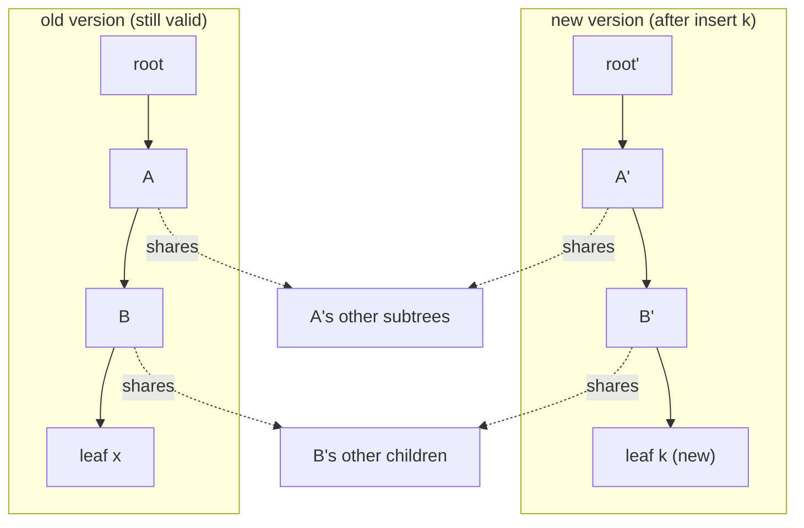
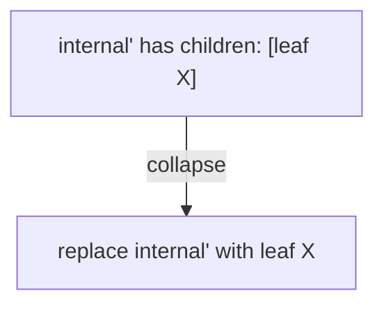
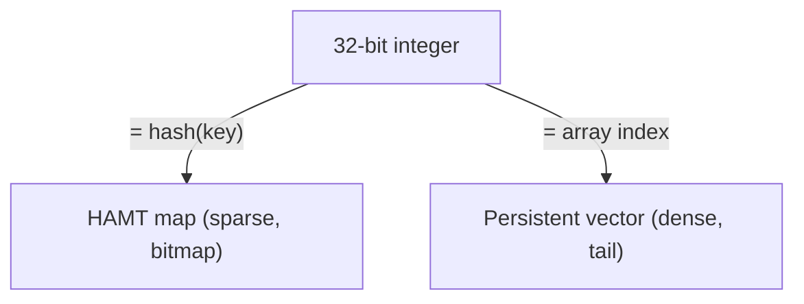
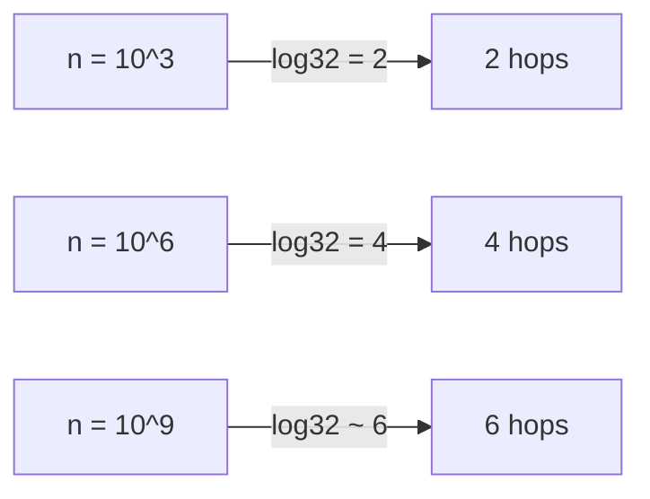

# Hash Array Mapped Trie (HAMT) — Middle Level

> **Read time: ~60 minutes** · **Audience:** Engineers who can already implement a HAMT `get`/`insert` (see [junior.md](./junior.md)) and now want to understand *why* the structure is correct and cheap, *when* to reach for it, and how it stacks up against a mutable hash table and a persistent balanced BST.

At the junior level we treated the HAMT mechanically: hash the key, slice it into 5-bit chunks, use a bitmap + popcount to find children, and copy the path on update. At the middle level we ask the harder questions. **Why** is path copying cheap enough to make immutability practical? **Why** does the tree stay shallow without any rebalancing? **How** exactly are hash collisions handled so the structure never breaks? **When** should you pick a HAMT over a plain hash table or over an immutable red-black tree? This file answers all four, with the invariants that make the HAMT correct, a careful O(log₃₂ n) argument, the full `delete` (including node collapse), and a head-to-head comparison table.

---

## Table of Contents

1. [Introduction — From Mechanics to Reasons](#introduction)
2. [Deeper Concepts — Invariants and Why Sharing Is Cheap](#deeper-concepts)
3. [Why the Tree Stays Shallow — the O(log₃₂ n) Argument](#why-shallow)
4. [Collision Handling in Full](#collisions)
5. [Delete with Node Collapse](#delete)
6. [Comparison with Alternatives](#comparison)
7. [Advanced Patterns — Iteration, Merge, Bulk Build](#patterns)
8. [Code Examples — Persistent insert/delete/iterate](#code-examples)
9. [Error Handling](#errors)
10. [Performance Analysis](#performance)
11. [Best Practices](#best-practices)
12. [Visual Animation](#animation)
13. [Summary](#summary)

---

<a name="introduction"></a>
## 1. Introduction — From Mechanics to Reasons

The defining promise of a HAMT is: **"give me a new map with this one change, but keep the old one alive, and do both cheaply."** A naive immutable map would copy the entire structure on every update — O(n) time and O(n) extra memory per change. That is unusable: a million-entry map updated a million times would do 10¹² work. The HAMT instead spends only **O(log₃₂ n)** per update, copying about six small nodes, because of two cooperating ideas:

1. **Path copying** — only the nodes between the root and the change are rebuilt; everything else is **shared by pointer**.
2. **A shallow, balanced trie** — randomized hashing keeps depth at ~`log₃₂ n` ≈ 6 with no rebalancing logic, so "the path" is always short.

Understanding *why* those two facts hold — and what invariants keep the structure correct under them — is the whole middle-level job.

---

<a name="deeper-concepts"></a>
## 2. Deeper Concepts — Invariants and Why Sharing Is Cheap

### 2.1 The structural invariants

A correct HAMT maintains these invariants after every operation:

| Invariant | Statement | What breaks if violated |
|---|---|---|
| **I1 — Bitmap/array agreement** | `len(node.children) == popcount(node.bitmap)`, and the *k*-th set bit corresponds to `children[k]`. | Wrong child returned; index out of range. |
| **I2 — Path determinism** | A key's path is fully determined by `chunk(hash, 0), chunk(hash, 1), …`. | A key could be reachable by two paths → duplicates/leaks. |
| **I3 — Immutability** | No node is ever mutated after it is published. | Old versions silently corrupt. |
| **I4 — Leaf uniqueness** | At most one leaf per distinct key; equal-hash distinct keys live in one collision node. | Duplicate keys; lost overwrites. |
| **I5 — No redundant internal nodes** | An internal node never has a single child that is itself a leaf reachable without branching (after delete, collapse). | Tree grows taller than `log₃₂ n`; wasted hops. |

I1 is the one beginners break most often: the dense array and the bitmap must always be kept in lockstep, because the bitmap *is* the index.

### 2.2 Why structural sharing is correct *and* cheap

**Correct** because of I3: since no published node is ever mutated, a pointer to a subtree is a pointer to an *immutable* value. Two versions can safely share it — neither can change it under the other. This is the same guarantee that makes immutable objects safe to share across threads.

**Cheap** because of path locality: an update touches exactly one leaf, and the only nodes whose *contents* change are the ancestors of that leaf — the root-to-leaf **path**. Every sibling subtree is untouched and is therefore reused by pointer. The number of rebuilt nodes equals the path length = depth = O(log₃₂ n). Concretely:

```text
old version: root -> A -> B -> leaf_x
insert k under B's subtree:
new version: root' -> A' -> B' -> leaf_k     (3 nodes copied)
             root' still points at A's OTHER children (shared)
             A'   still points at B's siblings? no — A' points at B'
             B'   still points at B's other children (shared)
```

Only `root`, `A`, `B` are copied; their *unchanged* children are shared. This is identical to the path-copying analysis of the [persistent segment tree](../11-persistent-segment-tree/middle.md), except the branching factor is 32 instead of 2, which is exactly what makes the path short.



### 2.3 The amortized "splitting" cost

When two keys collide at a slot, the HAMT must **split**: turn a leaf into an internal node that distinguishes them by their next chunk, possibly recursing several levels until their chunks differ. In the worst case two keys share a long hash prefix and you build several internal nodes in one insert. But because hashes are uniformly random, the expected number of shared chunks between any two keys is tiny (geometric with success probability 31/32 per level), so splits are O(1) expected. The professional file makes this precise.

---

<a name="why-shallow"></a>
## 3. Why the Tree Stays Shallow — the O(log₃₂ n) Argument

A HAMT does **no rebalancing**. So why is it balanced? Because the keys are placed by their **hash**, not by themselves. Two facts:

1. A node at depth `d` is reached only by keys whose first `d` chunks match a fixed sequence — that is, keys agreeing in `5d` hash bits. With a uniform hash, the probability a given key lands in a specific depth-`d` node is `1/32^d`.
2. So the expected number of keys under any depth-`d` node is `n / 32^d`. Once that drops below ~1, the subtree is a single leaf. That happens around `d* ≈ log₃₂ n`.

Therefore the expected depth — and the length of any root-to-leaf path — is **`Θ(log₃₂ n)`**. The constant is tiny: `log₃₂(10⁶) = 4`, `log₃₂(10⁹) ≈ 6`. With high probability no path exceeds a small multiple of this (a balls-into-bins / Chernoff argument, in `professional.md`). The only way to defeat it is a bad hash that funnels many keys down the same prefix — which is why **hash quality matters** and why adversarial inputs are a real concern (treated at the senior level).

> **Takeaway:** "balanced because random," not "balanced because rebalanced." The HAMT trades the rotations of a BST for the uniformity of a hash.

---

<a name="collisions"></a>
## 4. Collision Handling in Full

There are two distinct events people lump together as "collision," and they are handled differently:

| Event | Definition | Handling |
|---|---|---|
| **Slot collision (prefix collision)** | Two keys share the same chunk at some depth but have **different full hashes**. | **Split**: build an internal node and recurse on the next chunk. Resolves within a few levels. |
| **Full hash collision** | Two **distinct** keys have the **same full hash** (or are equal in every used bit). | Store both in a **collision node** — a small bucket of `(key, value)` entries compared by key equality. |

A collision node lives at the depth where the hash bits run out. Its operations are linear in its (tiny) size:

```text
get(collision, key):    scan entries, return value where entry.key == key
insert(collision, k, v): replace matching entry, or append a new one
delete(collision, k):    drop matching entry; if one entry remains, collapse back to a plain leaf
```

Because a good 32-bit hash gives a full collision with probability ~`1/2³²` per pair, real collision nodes are essentially never larger than two entries unless the hash is weak or an attacker is choosing keys. (Defending against deliberate collisions is a senior-level security topic — randomized/seeded hashes.)

---

<a name="delete"></a>
## 5. Delete with Node Collapse

`delete` is `insert`'s mirror, plus a cleanup step to honor invariant I5 (no taller-than-necessary tree):

1. Walk down by chunks to the leaf/collision node.
2. Remove the key. If it was in a collision node and one entry remains, **demote** the collision node to a plain leaf.
3. Clear the slot's bit in the parent's bitmap and **remove** that child from the dense array.
4. **Collapse:** if a copied internal node is left with exactly **one** child and that child is a leaf, replace the internal node with the leaf — pull it up a level. Repeat up the path.

Each step copies only path nodes, so `delete` is also O(log₃₂ n) time and copies O(log₃₂ n) nodes. Without the collapse step, a sequence of insert/delete churn would leave the tree littered with single-child internal nodes, slowly making it deeper than `log₃₂ n` and defeating the whole point.



---

<a name="comparison"></a>
## 6. Comparison with Alternatives

| Attribute | HAMT | Mutable hash table | Persistent balanced BST (e.g. red-black) |
|---|---|---|---|
| get / insert / delete (avg) | O(log₃₂ n) ≈ O(1) | O(1) amortized | O(log₂ n) |
| Worst case | O(log₃₂ n)\* | O(n) on resize / bad hash | O(log₂ n) |
| Immutable / persistent? | **Yes** (path copy) | No (mutate in place) | Yes (path copy) |
| Cost of a new version | O(log₃₂ n) | O(n) (full copy) | O(log₂ n) |
| Resize / rehash needed? | **Never** | Yes (amortized O(n) spikes) | No |
| Keys sorted? | No | No | **Yes** |
| Cache friendliness | Medium (pointer chasing) | High (flat array) | Low (deeper tree, log₂ n) |
| Tree height | ~log₃₂ n ≈ 6 | n/a | ~1.44·log₂ n ≈ 30 for 10⁶ |
| Concurrency for readers | Lock-free (immutable) | Needs locks / special design | Lock-free (immutable) |

\* Assuming a good hash; a pathological hash degrades a node to a collision bucket.

**Choose HAMT when:** you need an **immutable map with cheap versions** and near-constant operations — functional collections, copy-on-write config, snapshotting, lock-free shared reads.

**Choose a mutable hash table when:** you have a single owner, mutate in place, never keep old versions, and want the lowest possible per-op constant and best cache behavior.

**Choose a persistent balanced BST when:** you need the same persistence **and** ordered iteration / range queries / predecessor-successor — the HAMT gives you no ordering.

The key structural insight: a HAMT is shallower than a persistent BST (`log₃₂` vs `log₂`, ~5× fewer levels) and never rehashes like a hash table — but it gives up key ordering, which the BST keeps.

---

<a name="patterns"></a>
## 7. Advanced Patterns — Iteration, Merge, Bulk Build

### Pattern: Iteration

Iterate by a DFS over the trie, expanding each node's dense array in bit order. Order is **hash-defined**, not key-sorted. Because nodes are immutable, iteration over an old version is unaffected by concurrent inserts that produced new versions.

### Pattern: Structural merge of two maps

To merge map `A` into map `B`, recurse over both in lockstep: where their subtrees are the **same pointer**, you can skip entire subtrees (they're identical) — a huge speedup that flat hash tables can't do. This is why immutable HAMT-based maps support fast `union`/`merge`.

### Pattern: Snapshot-and-diff

Because every version is an immutable root pointer, taking a "snapshot" is free — just keep the current root. Later, you can compute *what changed* between two versions by recursing in lockstep and skipping pointer-equal subtrees, visiting only the O(changes · log₃₂ n) nodes that actually differ. This is the basis for efficient change feeds, audit logs, and reactive recomputation over immutable state.

### Pattern: Bulk build with a local mutable buffer (transients preview)

Building a map by `n` immutable inserts allocates `O(n log₃₂ n)` throwaway nodes. **Transients** (senior level) let you mutate one private copy during construction and freeze it at the end, cutting allocations to O(n). For now, know that batch construction has a faster path.

---

<a name="code-examples"></a>
## 8. Code Examples — Persistent insert / delete / iterate

### Example: insert, delete (with collapse), and an iterator

#### Go

```go
package main

import (
	"fmt"
	"math/bits"
)

const bpl = 5
const mask = (1 << bpl) - 1

type Node struct {
	bitmap   uint32
	children []*Node
	leaf     bool
	hash     uint32
	key      string
	value    int
}

func idx(bm, slot uint32) int { return bits.OnesCount32(bm & ((1 << slot) - 1)) }
func chunk(h uint32, d int) uint32 { return (h >> (uint(d) * bpl)) & mask }

func leaf(h uint32, k string, v int) *Node {
	return &Node{leaf: true, hash: h, key: k, value: v}
}

func insert(n *Node, h uint32, k string, v, d int) *Node {
	if n == nil {
		return leaf(h, k, v)
	}
	if n.leaf {
		if n.key == k {
			return leaf(h, k, v)
		}
		inner := insert(nil, n.hash, n.key, n.value, d) // re-place old leaf
		return insert(inner, h, k, v, d)
	}
	s := chunk(h, d)
	i := idx(n.bitmap, s)
	cp := &Node{bitmap: n.bitmap, children: append([]*Node{}, n.children...)}
	if n.bitmap&(1<<s) == 0 {
		cp.bitmap |= 1 << s
		cp.children = append(cp.children, nil)
		copy(cp.children[i+1:], cp.children[i:])
		cp.children[i] = leaf(h, k, v)
	} else {
		cp.children[i] = insert(n.children[i], h, k, v, d+1)
	}
	return cp
}

func delete(n *Node, h uint32, k string, d int) *Node {
	if n == nil {
		return nil
	}
	if n.leaf {
		if n.key == k {
			return nil
		}
		return n
	}
	s := chunk(h, d)
	if n.bitmap&(1<<s) == 0 {
		return n
	}
	i := idx(n.bitmap, s)
	child := delete(n.children[i], h, k, d+1)
	cp := &Node{bitmap: n.bitmap, children: append([]*Node{}, n.children...)}
	if child == nil {
		cp.bitmap &^= 1 << s
		cp.children = append(cp.children[:i], cp.children[i+1:]...)
	} else {
		cp.children[i] = child
	}
	// collapse single leaf child
	if len(cp.children) == 1 && cp.children[0].leaf {
		return cp.children[0]
	}
	if len(cp.children) == 0 {
		return nil
	}
	return cp
}

func iterate(n *Node, f func(string, int)) {
	if n == nil {
		return
	}
	if n.leaf {
		f(n.key, n.value)
		return
	}
	for _, c := range n.children {
		iterate(c, f)
	}
}

func main() {
	var r *Node
	r = insert(r, 0b01001, "a", 1, 0)
	r = insert(r, 0b00110, "b", 2, 0)
	r2 := delete(r, 0b00110, "b", 0)
	iterate(r, func(k string, v int) { fmt.Printf("v1 %s=%d\n", k, v) })  // a, b
	iterate(r2, func(k string, v int) { fmt.Printf("v2 %s=%d\n", k, v) }) // a only
}
```

#### Java

```java
import java.util.*;
import java.util.function.BiConsumer;

public class HAMT {
    static final int B = 5, M = (1 << B) - 1;
    static final class Node {
        int bitmap; Node[] children; boolean leaf; int hash; String key; int value;
    }
    static int idx(int bm, int s) { return Integer.bitCount(bm & ((1 << s) - 1)); }
    static int chunk(int h, int d) { return (h >>> (d * B)) & M; }
    static Node leaf(int h, String k, int v) {
        Node n = new Node(); n.leaf = true; n.hash = h; n.key = k; n.value = v; return n;
    }

    static Node insert(Node n, int h, String k, int v, int d) {
        if (n == null) return leaf(h, k, v);
        if (n.leaf) {
            if (n.key.equals(k)) return leaf(h, k, v);
            Node inner = insert(null, n.hash, n.key, n.value, d);
            return insert(inner, h, k, v, d);
        }
        int s = chunk(h, d), i = idx(n.bitmap, s);
        Node cp = new Node(); cp.bitmap = n.bitmap;
        if ((n.bitmap & (1 << s)) == 0) {
            cp.bitmap |= (1 << s);
            cp.children = new Node[n.children.length + 1];
            System.arraycopy(n.children, 0, cp.children, 0, i);
            System.arraycopy(n.children, i, cp.children, i + 1, n.children.length - i);
            cp.children[i] = leaf(h, k, v);
        } else {
            cp.children = n.children.clone();
            cp.children[i] = insert(n.children[i], h, k, v, d + 1);
        }
        return cp;
    }

    static Node delete(Node n, int h, String k, int d) {
        if (n == null) return null;
        if (n.leaf) return n.key.equals(k) ? null : n;
        int s = chunk(h, d);
        if ((n.bitmap & (1 << s)) == 0) return n;
        int i = idx(n.bitmap, s);
        Node child = delete(n.children[i], h, k, d + 1);
        Node cp = new Node(); cp.bitmap = n.bitmap;
        if (child == null) {
            cp.bitmap &= ~(1 << s);
            cp.children = new Node[n.children.length - 1];
            System.arraycopy(n.children, 0, cp.children, 0, i);
            System.arraycopy(n.children, i + 1, cp.children, i, n.children.length - i - 1);
        } else {
            cp.children = n.children.clone();
            cp.children[i] = child;
        }
        if (cp.children.length == 1 && cp.children[0].leaf) return cp.children[0];
        if (cp.children.length == 0) return null;
        return cp;
    }

    static void iterate(Node n, BiConsumer<String,Integer> f) {
        if (n == null) return;
        if (n.leaf) { f.accept(n.key, n.value); return; }
        for (Node c : n.children) iterate(c, f);
    }

    public static void main(String[] args) {
        Node r = null;
        r = insert(r, 0b01001, "a", 1, 0);
        r = insert(r, 0b00110, "b", 2, 0);
        Node r2 = delete(r, 0b00110, "b", 0);
        iterate(r,  (k,v) -> System.out.println("v1 " + k + "=" + v));
        iterate(r2, (k,v) -> System.out.println("v2 " + k + "=" + v));
    }
}
```

#### Python

```python
class Node:
    __slots__ = ("bitmap","children","leaf","hash","key","value")
    def __init__(self):
        self.bitmap = 0; self.children = []; self.leaf = False
        self.hash = 0; self.key = None; self.value = None

B, M = 5, (1 << 5) - 1
def idx(bm, s): return (bm & ((1 << s) - 1)).bit_count()
def chunk(h, d): return (h >> (d * B)) & M

def leaf(h, k, v):
    n = Node(); n.leaf = True; n.hash = h; n.key = k; n.value = v; return n

def insert(n, h, k, v, d):
    if n is None: return leaf(h, k, v)
    if n.leaf:
        if n.key == k: return leaf(h, k, v)
        inner = insert(None, n.hash, n.key, n.value, d)
        return insert(inner, h, k, v, d)
    s = chunk(h, d); i = idx(n.bitmap, s)
    cp = Node(); cp.bitmap = n.bitmap; cp.children = list(n.children)
    if not (n.bitmap & (1 << s)):
        cp.bitmap |= (1 << s)
        cp.children = n.children[:i] + [leaf(h, k, v)] + n.children[i:]
    else:
        cp.children[i] = insert(n.children[i], h, k, v, d + 1)
    return cp

def delete(n, h, k, d):
    if n is None: return None
    if n.leaf: return None if n.key == k else n
    s = chunk(h, d)
    if not (n.bitmap & (1 << s)): return n
    i = idx(n.bitmap, s)
    child = delete(n.children[i], h, k, d + 1)
    cp = Node(); cp.bitmap = n.bitmap; cp.children = list(n.children)
    if child is None:
        cp.bitmap &= ~(1 << s)
        cp.children = n.children[:i] + n.children[i+1:]
    else:
        cp.children[i] = child
    if len(cp.children) == 1 and cp.children[0].leaf: return cp.children[0]
    if len(cp.children) == 0: return None
    return cp

def iterate(n, f):
    if n is None: return
    if n.leaf: f(n.key, n.value); return
    for c in n.children: iterate(c, f)

if __name__ == "__main__":
    r = None
    r = insert(r, 0b01001, "a", 1, 0)
    r = insert(r, 0b00110, "b", 2, 0)
    r2 = delete(r, 0b00110, "b", 0)
    iterate(r,  lambda k, v: print("v1", k, "=", v))
    iterate(r2, lambda k, v: print("v2", k, "=", v))
```

**What it shows:** `r` (the old version) still contains `b` after `r2` deleted it — the persistence property. `delete` collapses single-leaf nodes to keep the tree shallow.

---

<a name="vectors"></a>
## 8b. The Same Trie, Keyed on Indices — Persistent Vectors

A subtle but important realization: the HAMT machinery is not specific to *hashing*. The trie navigates on **5-bit chunks of an integer** — and a hash is just one source of that integer. If you instead use the **array index** itself as the integer, the same 32-way trie becomes an **immutable (persistent) vector** with O(log₃₂ n) indexed access and near-O(1) append. This is exactly how Clojure's and Scala's persistent vectors work.

| Aspect | HAMT map | Persistent vector |
|---|---|---|
| Navigation key | `hash(key)` chunks | integer `index` chunks |
| Node compression | bitmap + popcount (sparse) | usually dense 32-arrays (indices are contiguous) |
| Lookup | `get(key)` | `nth(i)` |
| Update | `assoc(key, val)` | `assoc(i, val)` (path copy) |
| Growth | insert anywhere | append at the end (tail) |

Because vector indices are contiguous (0,1,2,…), the nodes are naturally full, so vectors often skip the bitmap and use plain 32-slot arrays plus a small **tail** buffer for the last partial block (so appends are amortized O(1)). The shared lesson: **a wide trie over chunked integers gives shallow, immutable, structurally-shared collections** — maps when the integer is a hash, vectors when it is an index. Keeping this duality in mind helps you recognize HAMTs in codebases that never use the word "HAMT."



### Worked complexity comparison: 1,000,000 entries

| Structure | Depth | Hops / op | Copied nodes / update | Snapshot cost |
|---|---|---|---|---|
| HAMT (32-way) | `log₃₂ 10⁶ ≈ 4` | ~4 | ~4 | O(1) (share root) |
| Persistent RB-tree | `1.44·log₂ 10⁶ ≈ 29` | ~29 | ~29 | O(1) |
| Mutable hash table | 1 (one bucket) | ~1 | n/a | O(n) full copy |

The HAMT's ~4 vs the RB-tree's ~29 is the concrete payoff of branching 32-wide instead of 2-wide: roughly `log₂ 32 = 5×` fewer levels, hence ~5× fewer copies per persistent update and ~5× fewer pointer hops per read.

---

<a name="errors"></a>
## 9. Error Handling

| Scenario | What goes wrong | Correct approach |
|---|---|---|
| Bitmap and array drift apart | Forgot to insert/remove the dense entry when flipping the bit | Always update bitmap and array together (I1) |
| Tree grows deeper over churn | Skipped node collapse on delete | Collapse single-leaf internal nodes (I5) |
| Equal hashes loop forever | Splitting two equal-hash keys | Stop at max depth → collision node (I4) |
| Old version mutated | Edited a node in place during insert | Copy the path node before changing it (I3) |
| Wrong key returned | Compared hashes only | Compare full keys at the leaf |

---

<a name="performance"></a>
## 10. Performance Analysis

- **Per operation:** `depth ≈ log₃₂ n` node hops; each hop is a bitmap test + a popcount + a pointer dereference. For `n = 10⁶`, that's ~4 hops.
- **Per update memory:** ~`depth` newly allocated small nodes. For a 32-wide node, copying its dense array is O(children-at-that-node), bounded by 32, so each path-node copy is O(32) in the worst case but usually far less.
- **Cache behavior:** worse than a flat hash table because each hop is a pointer chase to a possibly cold node. This is the main reason a mutable hash map beats a HAMT on raw single-thread throughput — and the motivation for **CHAMP** (senior level), which improves locality by grouping leaves and inner nodes.
- **Versus persistent BST:** ~5× fewer levels (`log₃₂` vs `log₂`) means ~5× fewer cache misses per operation and ~5× fewer copied nodes per update.



---

<a name="best-practices"></a>
## 11. Best Practices

- Keep invariants I1–I5 explicit in code comments and assert them in tests.
- Use a strong hash; for untrusted keys use a **seeded/randomized** hash to resist collision attacks.
- Return new roots from `insert`/`delete`; never expose mutation.
- Add a fast `merge` that short-circuits on pointer-equal subtrees.
- For mass construction, use a transient/builder (senior level) instead of N immutable inserts.
- Benchmark against a mutable hash map for your workload — only pay for persistence if you use it.

---

<a name="animation"></a>
## 12. Visual Animation

> See [`animation.html`](./animation.html).
>
> Middle-level focus: watch a `delete` clear a bitmap bit, remove a dense-array entry, and **collapse** a single-leaf node; and watch a `merge`/insert reuse shared subtrees while copying only the path.

---

<a name="summary"></a>
## 13. Summary

The HAMT is cheap to make immutable because **path copying** rebuilds only the O(log₃₂ n) nodes on the changed path and **shares** every other subtree by pointer — safe precisely because nodes are never mutated. It stays shallow without rebalancing because **uniform hashing** distributes keys so any subtree of `n` keys at depth `d` holds ~`n/32^d` of them, giving depth `Θ(log₃₂ n)`. Collisions split into deeper internal nodes (different hashes) or fall into small collision nodes (equal hashes), and `delete` collapses single-child nodes to keep the tree tight. Versus a mutable hash table you gain persistence and lose raw speed; versus a persistent BST you gain a 5× shallower tree and lose key ordering.

---

**Next step:** [Senior Level →](./senior.md) — persistent collections in Clojure/Scala/Haskell, the CHAMP optimization, memory and cache layout, and transients for fast batch updates.
