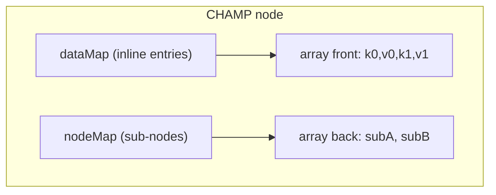
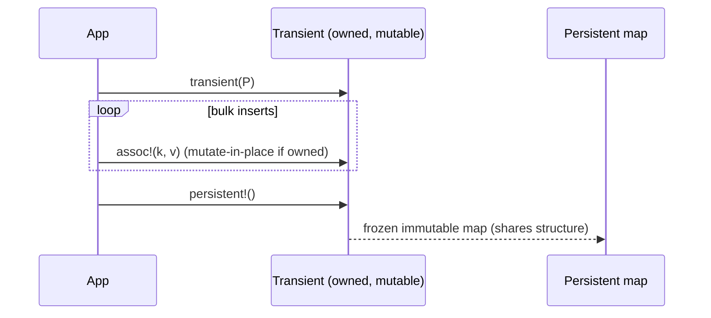
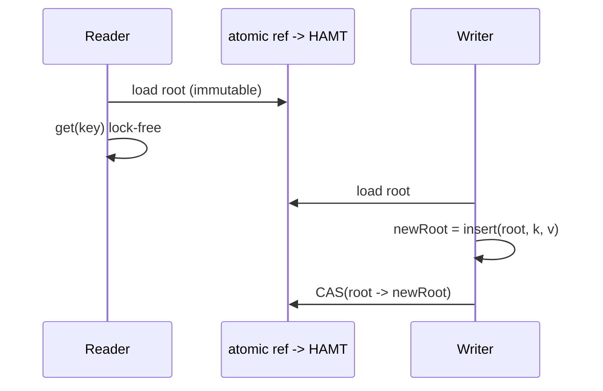

# Hash Array Mapped Trie (HAMT) — Senior Level

> **Read time: ~65 minutes** · **Audience:** Engineers designing or maintaining real systems on top of HAMTs — functional-language standard libraries, copy-on-write configuration stores, snapshotting state, lock-free shared maps — who need to reason about memory layout, cache behavior, the CHAMP optimization, and transients for batch performance.

By now you can implement and reason about a basic HAMT. The senior view is about the parts that decide whether a HAMT is fast *in production*: how Clojure, Scala, and Haskell actually build their persistent collections on this structure; the **CHAMP** redesign that fixes the original HAMT's cache and canonicality problems; the concrete **memory and cache** costs of pointer-chasing immutable nodes; and **transients**, the mutable escape hatch that lets you build or bulk-update a HAMT at near-mutable speed and then "freeze" it back to an immutable map. We also cover the failure modes that bite real systems: GC pressure, hash-flooding attacks, and the latency tail of allocation.

---

## Table of Contents

1. [Introduction — HAMTs in Production Systems](#introduction)
2. [Persistent Collections in Functional Languages](#functional)
3. [CHAMP — The Canonical, Cache-Friendly Redesign](#champ)
4. [Memory and Cache Behavior](#memory)
5. [Transients — Batch Updates at Mutable Speed](#transients)
6. [Comparison with Alternatives (production lens)](#comparison)
7. [Architecture Patterns — Copy-on-Write State, Snapshots](#patterns)
8. [Code Examples — Transient build, COW config store](#code-examples)
9. [Observability](#observability)
10. [Failure Modes](#failure-modes)
11. [Summary](#summary)

---

<a name="introduction"></a>
## 1. Introduction — HAMTs in Production Systems

A senior engineer rarely *writes* a HAMT from scratch; they **choose** one, **tune** its use, and **diagnose** it when it misbehaves. The reasons to choose a HAMT-backed map are almost always about **persistence**:

- **Immutable shared state.** A configuration map or routing table that many goroutines/threads read while one writer publishes new versions — no locks on the read path, because old versions never change.
- **Cheap snapshots.** "Give me the state as of right now" is a single pointer copy; the snapshot and the live map share all unchanged structure.
- **Undo / time travel / event sourcing.** Keep many historical versions cheaply; each costs only the O(log₃₂ n) nodes that changed.
- **Functional purity.** Languages that forbid mutation need a map whose "update" yields a new value — exactly what a HAMT provides.

The costs you manage in return are **allocation/GC pressure** (each update allocates a handful of nodes) and **cache misses** (pointer-chasing through immutable nodes). The senior toolkit — CHAMP and transients — exists precisely to attack those two costs.

---

<a name="functional"></a>
## 2. Persistent Collections in Functional Languages

The HAMT is the workhorse behind the immutable maps and sets of several language ecosystems:

| Language / library | Structure | Chunk / branching | Notes |
|---|---|---|---|
| **Clojure** `PersistentHashMap` | HAMT | 5 bits / 32-way | Rich Hickey's adaptation of Bagwell; also `PersistentVector` uses a 32-way trie indexed by integer position. |
| **Clojure** `PersistentVector` | 32-way array-mapped trie on indices | 5 bits / 32-way | Not hashed — the "key" is the integer index; same bitmap-free 32-wide nodes + tail optimization. |
| **Scala** `immutable.HashMap` | CHAMP (since 2.13) | 5 bits / 32-way | Rewritten from plain HAMT to CHAMP for speed and memory. |
| **Haskell** `unordered-containers` `HashMap` | HAMT | 5 bits / 16- or 32-way | Bit-mapped nodes; widely used as the de-facto fast immutable map. |
| **Java** (libraries, e.g. PCollections, Vavr, Paguro) | HAMT / CHAMP | 5 bits / 32-way | Not in the JDK; provided by third-party persistent-collection libraries. |
| **Erlang/Elixir** `map` (large maps) | HAMT | 4 bits / 16-way | The runtime switches small maps to flat arrays and large maps to a HAMT. |

Two recurring design choices worth noting:

1. **Vectors as integer-keyed tries.** Clojure/Scala persistent *vectors* use the same 32-way trie, but the navigation key is the **integer index** sliced into 5-bit chunks — so a vector is a HAMT whose "hash" is the position. This gives O(log₃₂ n) indexed access and O(1)-ish append, all immutable.
2. **A mutable "tail"/transient fast path.** Every serious implementation has a way to do many updates cheaply (Clojure's transients, Scala's builders), because N immutable inserts are wasteful.

---

<a name="champ"></a>
## 3. CHAMP — The Canonical, Cache-Friendly Redesign

The original Bagwell HAMT has two practical defects:

1. **Poor locality.** A node mixes inline `(key,value)` leaves and pointers to sub-nodes in one array; iterating or comparing means chasing pointers in a hard-to-predict order.
2. **Non-canonical structure.** Two HAMTs containing the *same* set of entries can have **different shapes** (because deletes don't always collapse identically). That makes structural equality and `==` expensive — you can't just compare pointers, and you can't short-circuit `equals`.

**CHAMP** (Compressed Hash-Array Mapped Prefix-tree, Steindorfer & Vinju, 2015) fixes both with three ideas:

| Idea | What it does | Benefit |
|---|---|---|
| **Two separate bitmaps** | One `dataMap` for inline `(key,value)` entries, one `nodeMap` for sub-node pointers. | Entries are grouped contiguously and sub-nodes are grouped contiguously → far better cache locality and faster iteration. |
| **Compact, canonical layout** | Data entries packed at the front of the array, sub-nodes packed at the back. | One node array, two regions, both popcount-indexed. |
| **Strict canonicalization on delete** | Always collapse a sub-node back into an inline entry as soon as it holds a single entry. | The shape depends only on the *set of entries*, not the insertion/deletion order → structural equality is fast (compare bitmaps, then recurse; short-circuit on pointer equality). |

The CHAMP node looks like:

```text
node {
    dataMap   : uint32   // slots holding inline (key,value) pairs
    nodeMap   : uint32   // slots holding sub-node pointers
    array     : [ k0, v0, k1, v1, ... , subNodeA, subNodeB, ... ]
                 ^-- data region (front)        ^-- node region (back)
}
index of data slot s   = 2 * popcount(dataMap & (mask below s))
index of node slot s    = array.length - 1 - popcount(nodeMap & (mask below s))
```



The payoff: Scala migrated `immutable.HashMap` to CHAMP in 2.13 and reported large improvements in memory footprint and iteration/equality speed. The lesson for a senior engineer: **canonicalization plus separating data from pointers turns a theoretically-fast structure into a practically-fast one.**

---

<a name="memory"></a>
## 4. Memory and Cache Behavior

A HAMT's reputation for being "slower than a hash map" is almost entirely about **memory access**, not algorithmic complexity. Three forces:

1. **Pointer chasing.** Each of the ~`log₃₂ n` hops dereferences a node that may be cold in cache. A flat open-addressed hash table touches one or two cache lines; a HAMT may touch one per level.
2. **Node overhead.** Each node carries object headers, a bitmap, and an array reference. For a map with many small nodes this adds up; CHAMP reduces it by inlining entries.
3. **Allocation churn.** Each update allocates path nodes that quickly become garbage, stressing the allocator/GC.

Mitigations a senior engineer reaches for:

| Problem | Mitigation |
|---|---|
| Cold pointer chases | Use CHAMP (groups data + nodes); keep maps in hot memory; avoid per-request fresh maps |
| Node overhead | CHAMP inlines small entries; choose a library with compact nodes |
| Allocation churn from many updates | **Transients** (next section) — one mutable buffer, freeze once |
| Tail latency from GC | Batch updates; reuse builders; tune GC; prefer arenas where the language allows |

The honest summary: a HAMT trades **a few extra cache misses per op** for **persistence and cheap versioning**. If you don't use persistence, you're paying for nothing — use a mutable hash map.

---

<a name="transients"></a>
## 5. Transients — Batch Updates at Mutable Speed

Building an immutable map with `n` individual inserts allocates `O(n · log₃₂ n)` nodes, almost all immediately garbage. **Transients** (Clojure's term; Scala/others use builders) solve this with a controlled, *temporarily mutable* HAMT:

- A transient is created from a persistent map and is **owned by one thread**.
- During the transient's lifetime, inserts/deletes **mutate nodes in place** *if* the node is owned by this transient (tagged with an "edit token"). Otherwise it path-copies once, then owns the copy and mutates it thereafter.
- When done, `persistent!` **freezes** the transient: it stops accepting mutations and the result is a fully immutable HAMT sharing structure with whatever it copied.

The win: a bulk build does O(n) work and allocates O(n) nodes instead of O(n log n), because once a path node is owned, subsequent updates reuse it in place. Correctness rests on a simple rule:

> **Ownership invariant:** a transient may mutate a node only if that node carries the transient's edit token; otherwise it must copy first. Published (persistent) nodes carry no token, so they're never mutated.

This is *unsafe* if you share a transient across threads or keep using the source after `persistent!`. The API enforces single-thread ownership and invalidation.



---

<a name="comparison"></a>
## 6. Comparison with Alternatives (production lens)

| Attribute | HAMT / CHAMP | Mutable open-addressed hash map | Persistent red-black tree |
|---|---|---|---|
| Read latency p50 | Low (few hops) | Lowest (1–2 cache lines) | Higher (log₂ n hops) |
| Read latency p99 | Stable | Spikes during resize | Stable |
| Write throughput | Good with transients | Highest | Lower (log₂ n copies) |
| New-version cost | O(log₃₂ n) | O(n) full copy | O(log₂ n) |
| Memory per entry | Medium (CHAMP: low) | Lowest | Higher (node + 2 ptrs + color) |
| Lock-free reads | **Yes** (immutable) | No | **Yes** |
| Ordered iteration | No | No | **Yes** |
| Production examples | Clojure, Scala, Haskell, Erlang | Go `map`, Java `HashMap`, Python `dict` | functional ordered maps |

**Senior decision rule:** if your workload keeps and reads many versions concurrently → HAMT/CHAMP. If you need ordering/range → persistent BST. If you have a single owner and never snapshot → mutable hash map.

---

<a name="patterns"></a>
## 7. Architecture Patterns — Copy-on-Write State, Snapshots

### Pattern: lock-free copy-on-write configuration

Hold the config in an atomic reference to a HAMT root. Readers load the reference and read freely — no locks, no torn reads, because the map they see never changes. A writer builds a new version (path copy) and atomically compare-and-swaps the reference. Old readers keep using their version until they reload.



### Pattern: cheap snapshots for event sourcing

Each event produces a new map version via path copy. Keep an array of roots = full history. Replaying or auditing "state as of event i" is just `roots[i]`. Memory is O(total distinct nodes), not O(events × n), because versions share structure — the same economics as the [persistent segment tree](../11-persistent-segment-tree/senior.md).

---

<a name="code-examples"></a>
## 8. Code Examples

### Example: a transient-style batch builder + lock-free COW store

#### Go

```go
package main

import (
	"fmt"
	"math/bits"
	"sync/atomic"
)

const bpl = 5
const mask = (1 << bpl) - 1

type Node struct {
	owner    *uint64 // edit token (nil => published/immutable)
	bitmap   uint32
	children []*Node
	leaf     bool
	hash     uint32
	key      string
	value    int
}

func idx(bm, s uint32) int { return bits.OnesCount32(bm & ((1 << s) - 1)) }
func chunk(h uint32, d int) uint32 { return (h >> (uint(d) * bpl)) & mask }
func leaf(h uint32, k string, v int) *Node {
	return &Node{leaf: true, hash: h, key: k, value: v}
}

// transient insert: mutate in place if owned, else copy-and-own.
func tinsert(n *Node, owner *uint64, h uint32, k string, v, d int) *Node {
	if n == nil {
		return leaf(h, k, v)
	}
	if n.leaf {
		if n.key == k {
			n.value = v
			return n
		}
		inner := &Node{owner: owner}
		inner = tinsert(inner, owner, n.hash, n.key, n.value, d)
		return tinsert(inner, owner, h, k, v, d)
	}
	editable := n.owner == owner && owner != nil
	cp := n
	if !editable {
		cp = &Node{owner: owner, bitmap: n.bitmap, children: append([]*Node{}, n.children...)}
	}
	s := chunk(h, d)
	i := idx(cp.bitmap, s)
	if cp.bitmap&(1<<s) == 0 {
		cp.bitmap |= 1 << s
		cp.children = append(cp.children, nil)
		copy(cp.children[i+1:], cp.children[i:])
		cp.children[i] = leaf(h, k, v)
	} else {
		cp.children[i] = tinsert(cp.children[i], owner, h, k, v, d+1)
	}
	return cp
}

// freeze: drop ownership so nothing can mutate this version again.
func freeze(n *Node) {
	if n == nil || !n.leaf && n.owner == nil {
		return
	}
	n.owner = nil
	for _, c := range n.children {
		freeze(c)
	}
}

func main() {
	token := uint64(1)
	var root *Node
	keys := []struct {
		h uint32
		k string
	}{{0b00001, "a"}, {0b00010, "b"}, {0b00011, "c"}}
	for i, e := range keys { // batch build with one owner — few allocations
		root = tinsert(root, &token, e.h, e.k, i, 0)
	}
	freeze(root)

	// lock-free COW: publish the immutable root via atomic pointer.
	var ref atomic.Pointer[Node]
	ref.Store(root)
	cur := ref.Load() // readers see an immutable snapshot
	fmt.Println(cur != nil)
}
```

#### Java

```java
import java.util.concurrent.atomic.AtomicReference;

public class HAMTTransient {
    static final int B = 5, M = (1 << B) - 1;
    static final class Node {
        Object owner;          // edit token; null => immutable
        int bitmap; Node[] children;
        boolean leaf; int hash; String key; int value;
    }
    static int idx(int bm, int s) { return Integer.bitCount(bm & ((1 << s) - 1)); }
    static int chunk(int h, int d) { return (h >>> (d * B)) & M; }
    static Node leaf(int h, String k, int v) {
        Node n = new Node(); n.leaf = true; n.hash = h; n.key = k; n.value = v; return n;
    }

    static Node tinsert(Node n, Object owner, int h, String k, int v, int d) {
        if (n == null) return leaf(h, k, v);
        if (n.leaf) {
            if (n.key.equals(k)) { n.value = v; return n; }
            Node inner = new Node(); inner.owner = owner;
            inner = tinsert(inner, owner, n.hash, n.key, n.value, d);
            return tinsert(inner, owner, h, k, v, d);
        }
        boolean editable = n.owner == owner && owner != null;
        Node cp = n;
        if (!editable) {
            cp = new Node(); cp.owner = owner; cp.bitmap = n.bitmap;
            cp.children = n.children == null ? new Node[0] : n.children.clone();
        }
        int s = chunk(h, d), i = idx(cp.bitmap, s);
        if ((cp.bitmap & (1 << s)) == 0) {
            cp.bitmap |= (1 << s);
            Node[] na = new Node[cp.children.length + 1];
            System.arraycopy(cp.children, 0, na, 0, i);
            System.arraycopy(cp.children, i, na, i + 1, cp.children.length - i);
            na[i] = leaf(h, k, v);
            cp.children = na;
        } else {
            cp.children[i] = tinsert(cp.children[i], owner, h, k, v, d + 1);
        }
        return cp;
    }

    static void freeze(Node n) {
        if (n == null || n.owner == null) return;
        n.owner = null;
        if (n.children != null) for (Node c : n.children) freeze(c);
    }

    public static void main(String[] args) {
        Object token = new Object();
        Node root = null;
        root = tinsert(root, token, 0b00001, "a", 0, 0);
        root = tinsert(root, token, 0b00010, "b", 1, 0);
        root = tinsert(root, token, 0b00011, "c", 2, 0);
        freeze(root);
        AtomicReference<Node> ref = new AtomicReference<>(root);
        Node cur = ref.get(); // immutable snapshot for lock-free reads
        System.out.println(cur != null);
    }
}
```

#### Python

```python
import threading

class Node:
    __slots__ = ("owner","bitmap","children","leaf","hash","key","value")
    def __init__(self):
        self.owner = None; self.bitmap = 0; self.children = []
        self.leaf = False; self.hash = 0; self.key = None; self.value = None

B, M = 5, (1 << 5) - 1
def idx(bm, s): return (bm & ((1 << s) - 1)).bit_count()
def chunk(h, d): return (h >> (d * B)) & M
def leaf(h, k, v):
    n = Node(); n.leaf = True; n.hash = h; n.key = k; n.value = v; return n

def tinsert(n, owner, h, k, v, d):
    if n is None: return leaf(h, k, v)
    if n.leaf:
        if n.key == k: n.value = v; return n
        inner = Node(); inner.owner = owner
        inner = tinsert(inner, owner, n.hash, n.key, n.value, d)
        return tinsert(inner, owner, h, k, v, d)
    editable = n.owner is owner and owner is not None
    cp = n
    if not editable:
        cp = Node(); cp.owner = owner; cp.bitmap = n.bitmap; cp.children = list(n.children)
    s = chunk(h, d); i = idx(cp.bitmap, s)
    if not (cp.bitmap & (1 << s)):
        cp.bitmap |= (1 << s)
        cp.children = cp.children[:i] + [leaf(h, k, v)] + cp.children[i:]
    else:
        cp.children[i] = tinsert(cp.children[i], owner, h, k, v, d + 1)
    return cp

def freeze(n):
    if n is None or n.owner is None: return
    n.owner = None
    for c in n.children: freeze(c)

if __name__ == "__main__":
    token = object()
    root = None
    for i, (h, k) in enumerate([(0b00001,"a"),(0b00010,"b"),(0b00011,"c")]):
        root = tinsert(root, token, h, k, i, 0)
    freeze(root)
    ref = root  # immutable snapshot; publish under a lock or atomic in real code
    print(ref is not None)
```

**What it shows:** the transient mutates owned nodes in place (cheap batch build), then `freeze` strips ownership so the result is a safely-shareable immutable snapshot suitable for lock-free copy-on-write publishing.

---

<a name="hashing"></a>
## 8b. Hashing Strategy and Equality Semantics

A HAMT is only as good as the `hash`/`equals` contract of its keys. Three production concerns:

### Hash spreading

Many real hash functions (e.g. small-integer identity hashes, or Java `String.hashCode`) have weak low bits or clustering. Because the HAMT navigates on the **low** chunk first, weak low bits funnel keys down the same early slots, deepening the tree. Production implementations apply a **spread/mix** step before slicing:

```text
spread(h):  h ^= (h >>> 16);          // mix high bits into low (Java HashMap style)
            return h;                  // or a full integer finalizer (murmur3 fmix)
```

This is cheap and dramatically improves chunk uniformity for hashes with poor entropy in the bits the trie reads first.

### Equality contract

At a leaf the HAMT compares full keys with `equals`. The contract `a.equals(b) => hash(a) == hash(b)` must hold, or two equal keys can land on different paths and create duplicates. Mutable keys are a footgun: if a key's hash changes after insertion, it becomes unreachable — treat HAMT keys as immutable, exactly like any hash-map key.

### Custom hashing for value-type keys

For composite keys (tuples, records) prefer a well-mixed combiner (e.g. `31*h + field` folded through a finalizer) rather than XOR-only combiners, which collide on field permutations. This directly controls collision-node frequency.

| Hash issue | Symptom in a HAMT | Fix |
|---|---|---|
| Weak low bits | Deep, lopsided early levels | Spread/mix before slicing |
| Order-insensitive combiner | Many full-hash collisions | Use a finalizer-based combiner |
| Mutable keys | Lost entries after key mutation | Require immutable keys |
| Untrusted keys | Collision flooding | Seeded hash (SipHash) |

---

<a name="observability"></a>
## 9. Observability

| Metric | Why | Alert threshold |
|---|---|---|
| `map_depth_max` | Detects hash-quality / collision problems | > 2× `log₃₂ n` |
| `collision_node_count` | Rising → weak hash or attack | sudden growth |
| `nodes_allocated_per_update` | Should be ~`log₃₂ n`; spikes mean missing transients | > 2× expected |
| `gc_pause_p99` | HAMT churn stresses GC | > SLA budget |
| `version_count` / retained roots | Memory leak if old versions never released | unbounded growth |

---

<a name="choosing"></a>
## 9b. Choosing and Integrating a HAMT in a Real Service

You rarely hand-roll a HAMT in production; you pick a library and integrate it well. A senior checklist:

| Decision | What to look for | Why it matters |
|---|---|---|
| **HAMT vs CHAMP** | Does the library use CHAMP (separate data/node maps, canonical shape)? | CHAMP gives faster iteration/equality and lower memory; matters for large maps and equality-heavy code. |
| **Transient/builder API** | Is there a batch-build path? | Avoids O(n log n) allocation on construction and bulk import. |
| **Hash seeding** | Can you supply a seeded/custom hash? | Required to defend untrusted keys against flooding. |
| **Iteration order stability** | Is order documented/stable across versions? | Affects reproducibility, snapshot diffs, and tests. |
| **Memory footprint** | Per-entry overhead vs your scale | At 10⁷+ entries, node overhead dominates; prefer compact CHAMP nodes. |
| **Equality/hashing of the map itself** | O(diff) structural equality? | Enables using maps as cache keys and fast change detection. |

### Integration patterns

- **Boundary conversion.** Convert to a plain mutable map only at boundaries that demand it (e.g. serialization), and back to a HAMT inside the service where persistence buys you snapshots and lock-free reads. Avoid converting on every request.
- **Single writer, many readers.** Hold the HAMT root in one atomic reference. Funnel all mutations through one writer (or a CAS retry loop); let readers read lock-free. This is the canonical actor/agent pattern in functional runtimes.
- **Bounded history.** If you keep versions for undo/audit, cap the retained roots (ring buffer) so old shared nodes can be collected. Unbounded history is the most common HAMT memory leak.
- **Serialization.** Serialize the *entries*, not the node structure; rebuild with a transient on load. Node layout is an internal detail and may differ across library versions.

### When the answer is "don't use a HAMT"

If profiling shows the map is single-owner, never snapshotted, and on the hot path, a mutable open-addressed hash table (Go `map`, Java `HashMap`, a flat Robin-Hood table) will beat the HAMT on both latency and memory. Persistence is a feature you pay for — only buy it if you use it.

---

<a name="failure-modes"></a>
## 10. Failure Modes

- **Hash flooding (DoS).** An attacker submits keys that collide, inflating collision nodes and depth, turning O(log₃₂ n) into O(n) per op. **Fix:** seeded/randomized per-process hashes; cap collision-node size.
- **GC storms.** A hot loop doing millions of single immutable inserts allocates millions of garbage nodes. **Fix:** transients / builders.
- **Version leak.** Holding references to every historical root prevents GC of shared-but-now-unreachable nodes. **Fix:** drop old roots you no longer need; keep a bounded window.
- **False "slowness."** Using a HAMT where no persistence is needed pays cache-miss tax for nothing. **Fix:** use a mutable hash map.
- **Broken canonicality (non-CHAMP).** Equality/`==` becomes O(n) and unreliable for caching. **Fix:** use a CHAMP implementation if you rely on fast structural equality.

### Incident playbook

| Symptom | Likely cause | First action |
|---|---|---|
| p99 read latency creeping up | Map depth growing → weak hash or no delete-collapse | Check `map_depth_max`; verify delete collapses; add hash spread |
| Sudden CPU + GC spike on writes | Bulk updates without transients | Switch the batch path to a transient/builder |
| Memory grows unboundedly | Old versions retained forever | Bound the history ring; drop unreachable roots |
| Latency cliff under traffic burst of new keys | Hash flooding / collision nodes | Enable seeded hash; cap bucket size; rotate seed |
| `equals`/cache-key lookups slow | Non-canonical (plain HAMT) shape | Migrate to a CHAMP-based library |

---

<a name="summary"></a>
## 11. Summary

In production, HAMTs power the immutable maps/sets (and integer-keyed vectors) of Clojure, Scala, Haskell, and Erlang. Their algorithmic O(log₃₂ n) is excellent; their real-world cost is **cache misses and allocation churn**. **CHAMP** attacks both by splitting `dataMap`/`nodeMap` for locality and enforcing canonical shape for fast structural equality; **transients** attack allocation by mutating an owned buffer during batch builds and freezing once. Architecturally, HAMTs shine as **lock-free copy-on-write state** and **cheap snapshots**, with failure modes centered on hash flooding, GC pressure, and version leaks — all manageable with seeded hashes, transients, and bounded history.

The senior takeaways, condensed:

- **Pick HAMT for versioned/snapshotted state**, not as a default map — the persistence is the feature you pay for.
- **Use transients for any batch build** (bulk insert/`into`) to collapse path-copy allocations into in-place writes.
- **Prefer a CHAMP-based library** when equality checks, iteration order, or cache locality matter.
- **Seed the hash** to neutralize adversarial collision flooding, and **bound retained versions** to keep the shared-structure heap from leaking.

A senior engineer's one-sentence rule of thumb: **reach for a HAMT when you need a map whose past versions stay cheaply alive, and reach for a mutable hash map otherwise.** Everything else — CHAMP for locality and equality, transients for batch speed, seeded hashing for safety, bounded history for memory — is tuning around that single decision. The structure earns its keep precisely in workloads that read many concurrent versions or snapshot frequently; outside those, its cache and allocation overhead is pure cost.

---

**Next step:** [Professional Level →](./professional.md) — the O(log₃₂ n) depth proof, bitmap + popcount space analysis, the cost of structural sharing/persistence, and CHAMP canonicalization formalized.
