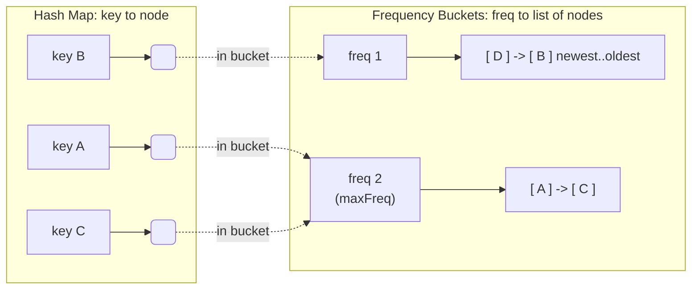

# MFU Cache — Junior Level

## Table of Contents

1. [Introduction](#introduction)
2. [What is a Cache?](#what-is-a-cache)
3. [What is an MFU Cache?](#what-is-an-mfu-cache)
4. [MFU vs LRU vs LFU in One Picture](#mfu-vs-lru-vs-lfu-in-one-picture)
5. [Real-World Analogies](#real-world-analogies)
6. [Core Operations](#core-operations)
   - [get(key)](#getkey)
   - [put(key, value)](#putkey-value)
7. [Counting Frequency: The Simple Idea](#counting-frequency-the-simple-idea)
8. [A Small Worked Example](#a-small-worked-example)
9. [Breaking Ties: Recency Inside a Frequency](#breaking-ties-recency-inside-a-frequency)
10. [A First (Slow) Implementation](#a-first-slow-implementation)
11. [Operations and Complexity](#operations-and-complexity)
12. [Common Mistakes](#common-mistakes)
13. [Summary](#summary)

---

## Introduction

An **MFU cache** (Most Frequently Used cache) is a fixed-capacity store that, when it runs out of room, throws away the item that has been **used the most times**. Read that twice — it is the **opposite** of the [LFU cache](../21-lfu-cache/junior.md), which evicts the *least* frequently used item. MFU keeps the rarely-touched items and discards the popular one.

That sounds backwards, and for most workloads it *is* the wrong choice. So why study it? Because there are real access patterns where "this item has already had its turn" is exactly true, and MFU is the policy that captures that intuition. We will be honest throughout: **MFU is niche.** But it is a sharp lens for understanding *why* eviction policies exist at all, and its O(1) design is a mirror image of the LFU design — the same machinery with one pointer flipped.

The idea is simple to state:

> Store a limited number of key-value pairs. Count how many times each key is *used* (read or written). When the cache is full and a new item must be added, **throw away the item with the largest use count**. If several items tie for the largest count, throw away the **least recently used** among them. Make both reading and writing take **constant time, O(1)**.

By the end of this page you will understand **what** an MFU cache is, **how** frequency counting drives eviction (in reverse), why it occasionally beats [LRU](../01-lru-cache/junior.md) and LFU, and you will be able to write a correct (if not yet optimal) MFU cache in Go, Java, and Python.

---

## What is a Cache?

A **cache** is a small, fast store that holds copies of data so you do not have to recompute or re-fetch that data from a slower source.

```
Slow source (database, disk, network, expensive computation)
        ^
        | on a "miss", go fetch it (slow)
        |
   +---------+
   |  CACHE  |  <-- small, fast (in memory)
   +---------+
        |
        | on a "hit", return instantly (fast)
        v
     Your program
```

- **Cache hit**: the data you asked for is already in the cache. Fast.
- **Cache miss**: the data is not in the cache. You must fetch it from the slow source, then (usually) store it in the cache for next time.

A cache is small *on purpose* — memory is limited and expensive. So the cache can only hold a fixed number of items, called its **capacity**. Once the cache is full, adding a new item means an old item has to go. The rule for *which* item to remove is the **eviction policy**.

MFU is one specific eviction policy: **remove the item that has been used the most times.**

---

## What is an MFU Cache?

MFU stands for **Most Frequently Used**. The policy is built on an assumption that is the reverse of LFU's:

> If an item has been used *many* times, it has probably **already served its purpose** and is unlikely to be needed again soon. The items used only once or twice may still be "fresh" and waiting for their next use, so we keep them. When we need space, we drop the heavyweight — the most frequently used key.

"Used" means either:
- We **read** the item (`get`), or
- We **wrote / updated** the item (`put`).

Every time we touch a key, its **frequency counter** goes up by one. The key with the **largest counter** is the **most frequently used** — it is the eviction victim. When several keys share the same largest counter, we use recency as a tie-breaker: among the equally-popular keys, the one that has not been touched for the longest time goes first.

So an MFU cache has to track exactly the same two things per key as an LFU cache:
1. **How many times** the key has been used (the frequency).
2. **In what order** keys of the same frequency were last used (for tie-breaking).

The only difference is the *direction* of eviction: LFU removes the smallest count, MFU removes the largest count. That one flip changes everything about which items survive.

---

## MFU vs LRU vs LFU in One Picture

These three policies often disagree about *what to evict*. Here is the core difference:

| | LRU (Least Recently Used) | LFU (Least Frequently Used) | MFU (Most Frequently Used) |
|---|---|---|---|
| Tracks | **When** each key was last used | **How many times** each key was used | **How many times** each key was used |
| Evicts | The key untouched the longest | The key used the **fewest** times | The key used the **most** times |
| Good when | Access pattern shifts over time | Some keys are reliably popular | A heavily-used item is "done" and won't return |
| Bets that | Recent → used again soon | Popular → used again soon | Popular → *already had its turn*, won't return |
| LeetCode | 146 | 460 | (no standard problem) |

Consider this access stream with **capacity 2**:

```
A A A A B C
```

- Key `A` was used 4 times; `B` and `C` once each.
- When `C` arrives and the cache holds `{A, B}`, **LFU** evicts `B` (count 1) and keeps `A` (count 4) — it trusts that the heavily-used `A` will be needed again.
- **MFU** does the **opposite**: it evicts `A` (count 4) and keeps `B` (count 1) — it bets that `A` has already done its work and `B` is the one still waiting to be used.

Notice that LFU and MFU read the *same counts* and reach *opposite conclusions*. They share all the bookkeeping; they differ only in whether they chase the minimum or the maximum count. LRU, by contrast, ignores counts entirely and looks only at recency.

---

## Real-World Analogies

### 1. A Reading List You Cross Off

Imagine a list of 5 articles you want to read, and a tally of how many times you have opened each one. Once you have opened an article many times, you have probably finished with it — you have extracted what you needed. So when a new article arrives and the list is full, you remove the one you have opened the **most** times, because you are most likely *done* with it. The article you opened once is still pending; you keep it.

### 2. A Buffet Tray That Gets Refilled

A buffet has room for a few trays. The dish that has been served the most has likely satisfied the crowd's appetite for it — interest is fading. When the kitchen brings out a new dish and all slots are full, the staff swap out the **most-served** dish to make room for something fresh that diners have not had yet.

### 3. A Looping Playlist (the pattern MFU is actually good at)

Here is where MFU genuinely shines. Suppose a program scans the same long sequence over and over: `1 2 3 4 5 1 2 3 4 5 ...`, but the cache only holds 4 of the 5 items. With **LRU or LFU**, every pass evicts exactly the item you are *about* to need next, so you miss on every single access — a pathological case called **sequential flooding**. **MFU** evicts the item that was just heavily used (and therefore is furthest away in the loop before you need it again), letting more of the cache survive each pass. For cyclic, looping scans, MFU can be **scan-resistant** where LRU and LFU collapse.

### 4. Database Join Inner Loops

In some database query plans, the inner relation of a nested-loop join is scanned repeatedly. The block just used is the one you will not touch again until the whole inner loop wraps around. Evicting the *most recently and most frequently* touched block can keep more of the working set resident. This is the kind of niche, well-understood pattern where MFU earns its place.

In every analogy notice the two repeated ideas: **touch something → increment its count**, and **need space → remove the *largest* count (oldest used on a tie)**. That is the heart of MFU — the same as LFU, but reaching for the top of the pile instead of the bottom.

---

## Core Operations

An MFU cache supports exactly two operations, just like LRU and LFU.

### get(key)

```
get(key):
  if key is in the cache:
      increment its frequency counter
      return its value
  else:
      return "not found"  (often represented as -1)
```

A `get` is not a passive read — it *counts as using* the key, so the key's frequency goes up by one.

### put(key, value)

```
put(key, value):
  if capacity is 0:
      do nothing
  if key already exists:
      update its value
      increment its frequency counter
  else:
      if the cache is full:
          evict the most-frequently-used key
                (ties broken by least-recently-used)
      insert the new key with frequency = 1
```

Two details that trip people up:
- A **new** key always starts at frequency **1** (the `put` that creates it counts as its first use).
- We check for eviction **only** when inserting a brand-new key. Updating an existing key never evicts anything.

The structure is identical to LFU. Only the word **most** (instead of *least*) in the eviction line is different.

---

## Counting Frequency: The Simple Idea

The simplest mental model: store, for every key, a `(value, count)` pair.

```
key 1 -> (value "A", count 3)
key 2 -> (value "B", count 1)
key 3 -> (value "C", count 5)
```

- On `get(1)` or `put(1, ...)`: bump key 1's count to 4.
- To evict: scan all entries, find the **largest** count (key 3, count 5), remove it.

This is correct, and it is exactly how you should *think* about MFU. The only problem is **speed**: scanning every entry to find the maximum count is **O(n)** per eviction, and finding ties needs even more bookkeeping. The middle level shows how to replace that O(n) scan with an O(1) lookup using **frequency buckets** and a **maxFreq** pointer (the mirror of LFU's `minFreq`). For now, focus on getting the *behavior* right.

---

## A Small Worked Example

Let us run an MFU cache with **capacity = 2**. We show each key's frequency count after every step. Compare this trace line-by-line with the [LFU worked example](../21-lfu-cache/junior.md#a-small-worked-example) — same inputs, opposite victims.

```
put(1, "A")        counts: {1:1}              cache {1:A}
put(2, "B")        counts: {1:1, 2:1}         cache {1:A, 2:B}, full now
get(1) -> "A"      counts: {1:2, 2:1}         (1 used, count 1->2)
put(3, "C")        counts: {2:1, 3:1}         full -> evict the MAX-count key.
                                              max count = 2, only key 1 has it -> evict 1
get(1) -> miss     counts: {2:1, 3:1}         (1 was evicted)
get(2) -> "B"      counts: {2:2, 3:1}         (2 used, count 1->2)
put(4, "D")        counts: {3:1, 4:1}         full -> max count = 2, only key 2 -> evict 2
get(2) -> miss     counts: {3:1, 4:1}         (2 was evicted)
get(3) -> "C"      counts: {3:2, 4:1}         (3 used)
get(4) -> "D"      counts: {3:2, 4:2}         (4 used, now a TIE at count 2)
```

Trace the eviction of key 1 carefully. After `get(1)`, key 1's count was 2 and key 2's was still 1. When `put(3)` overflowed, the **maximum** count was 2, held only by key 1, so key 1 was evicted. That is MFU dropping the popular key and keeping the quieter `B` — the exact opposite of what LFU did with the same input (LFU evicted key 2).

Now suppose the next step after the trace above were `put(5, "E")`. Keys 3 and 4 both have count 2 — a **tie at the maximum**. MFU breaks ties by recency: we most recently touched key 4 (the last `get(4)`), so key 3 is the *least recently used among the tied keys*, and key 3 would be evicted. This recency tie-break is what makes MFU's bookkeeping just as involved as LFU's.

---

## Breaking Ties: Recency Inside a Frequency

When two or more keys share the *largest* frequency, *which* one do we evict? The standard answer is: **the least recently used among the tied keys**. (This is the same tie-break LFU uses, just applied to the maximum bucket instead of the minimum one.)

A neat way to picture this: imagine the keys grouped into **buckets**, one bucket per frequency value. Inside each bucket, keys are ordered by recency, newest at the front and oldest at the back.

```
freq 1:  [ key D (newest) ] -> [ key B (oldest) ]
freq 2:  [ key A (newest) ] -> [ key C (oldest) ]
freq 5:  [ key Z ]
         ^
      maxFreq = 5  (largest non-empty bucket)
```

To evict, look at the **largest non-empty bucket** (`maxFreq`), and remove the **oldest** entry in it (the back of that bucket). Here that is key Z (the only one, so it is both newest and oldest). If `maxFreq` had been 2, we would evict key C — the oldest in the freq-2 bucket. This single idea — *frequency buckets, each ordered by recency, plus a pointer to the largest bucket* — is the entire secret to the O(1) MFU design. The middle level builds it out fully.



Compare this with the LFU diagram: there the pointer (`minFreq`) sits on the *smallest* non-empty bucket. Here `maxFreq` sits on the *largest*. Flip the pointer, flip the policy.

---

## A First (Slow) Implementation

Here is a correct, easy-to-read MFU cache. It is **not** O(1) — eviction scans for the maximum — but it gets the *behavior* exactly right, including recency tie-breaking. Treat it as the reference your faster version must match. We track a global `tick` counter that increases on every access; the smaller a key's `lastUsed` tick, the less recently it was used.

Watch the eviction comparison: it picks the entry with the **larger** `freq`, and on a tie the **smaller** `lastUsed` (least recently used). That single `>` (where LFU used `<`) is the whole difference.

### Go

```go
package mfu

// entry holds a value plus its frequency and a recency timestamp.
type entry struct {
	value    int
	freq     int // how many times this key has been used
	lastUsed int // global tick of the most recent access (for tie-breaking)
}

// SimpleMFU is a correct but O(n)-eviction MFU cache.
type SimpleMFU struct {
	capacity int
	tick     int
	data     map[int]*entry
}

// NewSimple creates an MFU cache with the given capacity.
func NewSimple(capacity int) *SimpleMFU {
	return &SimpleMFU{capacity: capacity, data: make(map[int]*entry)}
}

// touch records a use: bump frequency and stamp recency.
func (c *SimpleMFU) touch(e *entry) {
	c.tick++
	e.freq++
	e.lastUsed = c.tick
}

// Get returns the value for key, or -1 if absent. Counts as a use.
func (c *SimpleMFU) Get(key int) int {
	e, ok := c.data[key]
	if !ok {
		return -1
	}
	c.touch(e)
	return e.value
}

// Put inserts or updates a key, evicting the MFU entry on overflow.
func (c *SimpleMFU) Put(key, value int) {
	if c.capacity == 0 {
		return
	}
	if e, ok := c.data[key]; ok {
		e.value = value
		c.touch(e)
		return
	}
	if len(c.data) >= c.capacity {
		c.evict()
	}
	c.tick++
	c.data[key] = &entry{value: value, freq: 1, lastUsed: c.tick}
}

// evict removes the most-frequently-used key; ties go to least-recently-used.
func (c *SimpleMFU) evict() {
	var victimKey int
	var victim *entry
	for k, e := range c.data {
		if victim == nil ||
			e.freq > victim.freq || // MFU: pick the LARGER frequency
			(e.freq == victim.freq && e.lastUsed < victim.lastUsed) {
			victimKey, victim = k, e
		}
	}
	delete(c.data, victimKey)
}

// Usage:
// c := mfu.NewSimple(2)
// c.Put(1, 10); c.Put(2, 20)
// c.Get(1)            // count of key 1 -> 2
// c.Put(3, 30)        // evicts key 1 (count 2, the max)
// _ = c.Get(1)        // -1
```

### Java

```java
import java.util.HashMap;
import java.util.Map;

/** A correct but O(n)-eviction MFU cache (reference behavior). */
public class SimpleMFU {

    private static class Entry {
        int value;
        int freq;      // how many times used
        int lastUsed;  // global tick of last access (tie-break)

        Entry(int value, int freq, int lastUsed) {
            this.value = value;
            this.freq = freq;
            this.lastUsed = lastUsed;
        }
    }

    private final int capacity;
    private int tick = 0;
    private final Map<Integer, Entry> data = new HashMap<>();

    public SimpleMFU(int capacity) {
        this.capacity = capacity;
    }

    private void touch(Entry e) {
        tick++;
        e.freq++;
        e.lastUsed = tick;
    }

    public int get(int key) {
        Entry e = data.get(key);
        if (e == null) return -1;
        touch(e);
        return e.value;
    }

    public void put(int key, int value) {
        if (capacity == 0) return;
        Entry e = data.get(key);
        if (e != null) {
            e.value = value;
            touch(e);
            return;
        }
        if (data.size() >= capacity) evict();
        tick++;
        data.put(key, new Entry(value, 1, tick));
    }

    private void evict() {
        int victimKey = -1;
        Entry victim = null;
        for (Map.Entry<Integer, Entry> me : data.entrySet()) {
            Entry e = me.getValue();
            if (victim == null
                    || e.freq > victim.freq                 // MFU: pick the LARGER frequency
                    || (e.freq == victim.freq && e.lastUsed < victim.lastUsed)) {
                victimKey = me.getKey();
                victim = e;
            }
        }
        data.remove(victimKey);
    }

    // Usage:
    // SimpleMFU c = new SimpleMFU(2);
    // c.put(1, 10); c.put(2, 20);
    // c.get(1);          // key 1 count -> 2
    // c.put(3, 30);      // evicts key 1 (the max count)
    // c.get(1);          // -1
}
```

### Python

```python
"""A correct but O(n)-eviction MFU cache (reference behavior)."""


class Entry:
    __slots__ = ("value", "freq", "last_used")

    def __init__(self, value: int, freq: int, last_used: int):
        self.value = value
        self.freq = freq          # how many times used
        self.last_used = last_used  # global tick of last access (tie-break)


class SimpleMFU:
    def __init__(self, capacity: int):
        self.capacity = capacity
        self.tick = 0
        self.data: dict[int, Entry] = {}

    def _touch(self, e: Entry) -> None:
        self.tick += 1
        e.freq += 1
        e.last_used = self.tick

    def get(self, key: int) -> int:
        e = self.data.get(key)
        if e is None:
            return -1
        self._touch(e)
        return e.value

    def put(self, key: int, value: int) -> None:
        if self.capacity == 0:
            return
        e = self.data.get(key)
        if e is not None:
            e.value = value
            self._touch(e)
            return
        if len(self.data) >= self.capacity:
            self._evict()
        self.tick += 1
        self.data[key] = Entry(value, 1, self.tick)

    def _evict(self) -> None:
        # MFU: most frequent first; on a tie, least recently used first.
        # max by freq, then MIN last_used -> negate last_used inside the key.
        victim_key = max(
            self.data,
            key=lambda k: (self.data[k].freq, -self.data[k].last_used),
        )
        del self.data[victim_key]


# Usage:
# c = SimpleMFU(2)
# c.put(1, 10); c.put(2, 20)
# c.get(1)        # key 1 count -> 2
# c.put(3, 30)    # evicts key 1 (the max count)
# c.get(1)        # -1
```

All three behave identically to the worked example above. Note the Python tie-break trick: we want the **maximum** frequency but the **minimum** `last_used`, so we sort by `(freq, -last_used)` and take the `max`. The only weakness is `evict`, which is O(n). Everything else (`get`, `put` on existing keys) is already O(1).

---

## Operations and Complexity

This table is for the **simple** version above. The middle level replaces the O(n) eviction with O(1).

| Operation | Simple version | O(1) version (middle level) |
|-----------|----------------|-----------------------------|
| `get(key)` (hit) | O(1) average | O(1) average |
| `get(key)` (miss) | O(1) average | O(1) average |
| `put` (update existing) | O(1) average | O(1) average |
| `put` (new, no evict) | O(1) average | O(1) average |
| `put` (new, with evict) | **O(n)** (scan for max) | **O(1)** (maxFreq pointer) |
| Space | O(capacity) | O(capacity) |

The "average" qualifier comes from the hash map: hash-map lookups are O(1) on average. The interesting work, exactly as in LFU, is closing that O(n) gap on eviction — here by tracking a `maxFreq` pointer instead of `minFreq`.

---

## Common Mistakes

| Mistake | Why It Is Wrong | Fix |
|---------|-----------------|-----|
| Evicting the smallest count | That is LFU, not MFU; MFU drops the **largest** count | Compare with `>` (and keep the recency tie-break) |
| Not incrementing frequency on `get` | A read *is* a use; the counts drift and the wrong key gets evicted | Bump `freq` inside `get` on every hit |
| Starting a new key at frequency 0 | The creating `put` is the first use; count should be 1 | Initialize new entries with `freq = 1` |
| Ignoring the recency tie-break | When counts tie at the max, you must evict the *least recently used* among them | Track a recency stamp (tick) per key |
| Breaking ties by *most* recent | The tie-break is the same as LFU: drop the **least** recently used | Compare `lastUsed` with `<`, not `>` |
| Evicting when updating an existing key | Updates do not add an item, so nothing should be evicted | Only consider eviction on inserting a **new** key |
| Forgetting `capacity == 0` | A zero-capacity cache should silently store nothing | Return early when capacity is 0 |

---

## Summary

| Concept | Key Point |
|---------|-----------|
| **MFU cache** | Fixed-capacity store that evicts the *most frequently used* item |
| **Opposite of LFU** | Same counts, opposite victim: MFU drops the max, LFU drops the min |
| **Frequency counter** | Each key tracks how many times it was used (read or written) |
| **Tie-break by recency** | Among keys with the largest count, evict the least recently used |
| **New key starts at 1** | The creating `put` counts as the key's first use |
| **When it helps** | Looping/cyclic scans where a heavily-used item is "done" — scan-resistant |
| **Honest caveat** | Niche; for most workloads LRU or LFU is the better default |
| **Simple version** | `get`/`put` are O(1), but eviction scans for the maximum → O(n) |
| **The goal** | Make eviction O(1) too, using frequency buckets + a maxFreq pointer |

You now understand the *what* and *how* of an MFU cache: count uses, evict the **largest** count, break ties by recency. The next level explains the *why* and *when* — the full **O(1) design** with frequency buckets and a `maxFreq` pointer, exactly how it mirrors the LFU design, the specific access patterns (sequential flooding, cyclic scans, join inner loops) where MFU beats [LRU](../01-lru-cache/middle.md) and [LFU](../21-lfu-cache/middle.md), and the honest case for when *not* to reach for MFU at all.

**Next step:** Continue to [`middle.md`](./middle.md) to build the O(1) MFU design (frequency buckets + `maxFreq`), see it side-by-side with [LFU](../21-lfu-cache/middle.md), and understand precisely which workloads make MFU the right tool.
