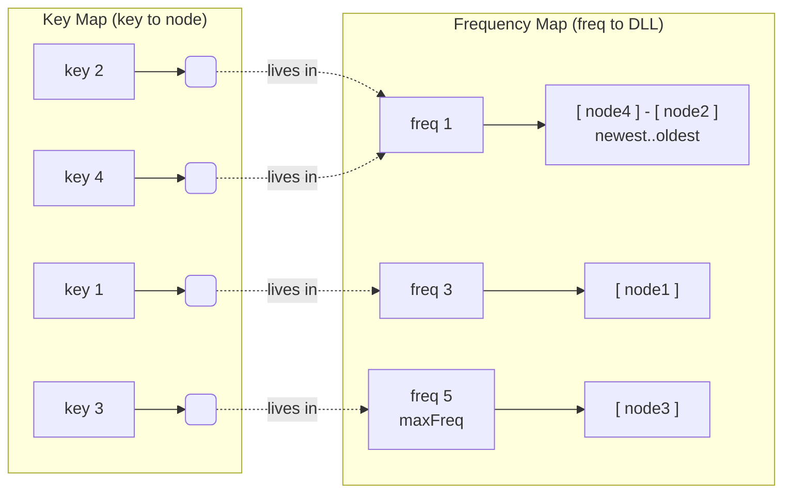

# MFU Cache — Middle Level

## Table of Contents

1. [Introduction](#introduction)
2. [Recap: What MFU Evicts](#recap-what-mfu-evicts)
3. [The O(1) Design: Three Cooperating Structures](#the-o1-design-three-cooperating-structures)
4. [Frequency Buckets and the maxFreq Pointer](#frequency-buckets-and-the-maxfreq-pointer)
5. [Walking Through get](#walking-through-get)
6. [Walking Through put](#walking-through-put)
7. [The maxFreq Bookkeeping Subtlety](#the-maxfreq-bookkeeping-subtlety)
8. [The State Machine](#the-state-machine)
9. [Tie-Breaking by Recency, in O(1)](#tie-breaking-by-recency-in-o1)
10. [Full O(1) Implementation](#full-o1-implementation)
11. [Complexity and Invariants](#complexity-and-invariants)
12. [Edge Cases](#edge-cases)
13. [MFU vs LFU vs LRU](#mfu-vs-lfu-vs-lru)
14. [Where MFU Actually Wins](#where-mfu-actually-wins)
15. [Common Implementation Pitfalls](#common-implementation-pitfalls)
16. [Key Takeaways](#key-takeaways)

---

## Introduction

> Focus: "How do I make MFU eviction O(1)?" and "When is evicting the *most* frequently used item ever the right call?"

At the [junior level](./junior.md) we built a correct MFU cache whose eviction was **O(n)**: to find the most-frequently-used key, we scanned every entry. This level closes that gap. We build the **O(1) MFU design** — every operation (`get`, `put`, update, insert, evict) runs in constant time — and we understand exactly *why* each step holds.

MFU is the mirror image of [LFU](../21-lfu-cache/middle.md). LFU evicts the key with the **lowest** access count; MFU evicts the key with the **highest** access count. The O(1) machinery is almost identical — a key map, frequency buckets, and a single integer pointer — but where LFU tracks `minFreq`, MFU tracks `maxFreq`. That one change of direction looks trivial and *is not*: the bookkeeping when a bucket empties is genuinely harder for MFU, and that asymmetry is the heart of this page.

MFU is a niche policy. We will be honest about that — most workloads want [LRU](../01-lru-cache/middle.md) or LFU — but there is a real class of workloads (cyclic scans, scan-resistant caching) where evicting the hot item is exactly correct, and we will pin down what they look like.

---

## Recap: What MFU Evicts

MFU is a fixed-capacity `key → value` store. The rule that defines it:

> When the cache is full and a new key must be inserted, evict the entry with the **highest access count**. Break ties within the highest-frequency group by **least recently used**.

So MFU keeps the *rarely* used items and discards the *heavily* used ones. The intuition — counter to almost everything else in caching — is that an item accessed many times has "had its turn" and is unlikely to be needed again soon, while a rarely touched item may be on its way up. That intuition is wrong for most workloads and right for a specific few (see [Where MFU Actually Wins](#where-mfu-actually-wins)).

Every access — a `get`, or a `put` on an existing key — increments that key's frequency by one. New keys enter at frequency 1. The victim on eviction is always the *most* frequent, recency-broken.

---

## The O(1) Design: Three Cooperating Structures

The O(1) MFU cache combines **three** structures, exactly mirroring O(1) LFU:

| Structure | Maps | Purpose |
|-----------|------|---------|
| **Key map** | `key → node` | O(1) lookup of a key's node (value + current frequency) |
| **Frequency map** | `freq → doubly linked list of nodes at that frequency` | Groups keys by use count; each list is recency-ordered |
| **`maxFreq` integer** | — | Names the **largest** non-empty frequency bucket (the eviction target) |

Each node stores `key`, `value`, and its current `freq`. The frequency map's value at `f` is a **doubly linked list (DLL)** of every node whose count is exactly `f`. Within a DLL, nodes are recency-ordered: most recently used at the front, least recently used at the back. That per-bucket order gives O(1) tie-breaking.

The single difference from LFU: eviction reads `freqMap[maxFreq]` instead of `freqMap[minFreq]`. Everything about promotion (a node moving from bucket `f` to `f+1` on each use) is identical.



To evict: go to bucket `maxFreq` (here, freq 5), remove its **oldest** node (the back of that DLL — node3), and delete its key from the key map. Constant time.

---

## Frequency Buckets and the maxFreq Pointer

The **frequency map** is the heart of the design. Picture it as a column of buckets, one per distinct frequency that currently has at least one key:

```
freq 1:  HEAD <-> [k4] <-> [k2] <-> TAIL      (k4 newest, k2 oldest at freq 1)
freq 3:  HEAD <-> [k1] <-> TAIL
freq 5:  HEAD <-> [k3] <-> TAIL               <- maxFreq (eviction looks here)
   ^
   maxFreq
```

Each bucket is a doubly linked list with dummy `HEAD`/`TAIL` sentinels (exactly like the [LRU list](../01-lru-cache/junior.md)), so insert-at-front and remove-any-node are O(1). The `maxFreq` integer points at the **largest** non-empty bucket — the only place eviction ever looks.

The crucial operation is **promoting a node** when it is used. If node `k2` (currently freq 1) is accessed:
1. Remove `k2` from the freq-1 bucket (O(1) DLL unlink).
2. Increment `k2.freq` to 2.
3. Insert `k2` at the **front** of the freq-2 bucket (creating it if needed). Front = most recent.
4. If the new freq 2 exceeds `maxFreq`, advance `maxFreq` to 2.

Step 4 is where MFU and LFU diverge. For LFU, a promotion can only *raise* a node's frequency, so it can only push the *minimum* away — and the new minimum is trivially `f+1`. For MFU, a promotion can only *raise* the maximum, so updating `maxFreq` on promotion is the easy direction: `maxFreq = max(maxFreq, node.freq)`. The hard direction for MFU is **eviction**, covered shortly.

---

## Walking Through get

```
get(key):
  if key not in keyMap: return -1
  node = keyMap[key]
  promote(node)         # remove from freq bucket, freq++, add to (freq+1) bucket
  return node.value
```

`promote(node)`:
```
oldFreq = node.freq
remove node from freqMap[oldFreq]
if freqMap[oldFreq] is now empty:
    delete freqMap[oldFreq]
node.freq = oldFreq + 1
add node to FRONT of freqMap[oldFreq + 1]   # most recent in its new bucket
if node.freq > maxFreq: maxFreq = node.freq  # the new bucket may be the new top
```

Every line is a hash-map operation or a constant number of pointer rewires. **O(1).** Note we do *not* try to recompute `maxFreq` downward here — promotion only ever pushes it up, and `max(maxFreq, oldFreq+1)` captures that in one comparison.

---

## Walking Through put

```
put(key, value):
  if capacity == 0: return

  if key in keyMap:                 # existing key -> update + promote
      node = keyMap[key]
      node.value = value
      promote(node)
      return

  if size == capacity:              # full -> evict the MFU victim first
      victim = back node of freqMap[maxFreq]   # oldest in the MAX bucket
      remove victim from freqMap[maxFreq]
      if freqMap[maxFreq] is now empty:
          delete freqMap[maxFreq]
          recompute maxFreq           # <-- the subtle part (next section)
      delete keyMap[victim.key]
      size--

  newNode = node(key, value, freq=1)   # new keys ALWAYS start at freq 1
  keyMap[key] = newNode
  add newNode to FRONT of freqMap[1]
  if maxFreq == 0: maxFreq = 1         # first key, or cache was empty
  size++
```

Two facts to internalize:
- **New keys start at freq 1.** On insert, `maxFreq` can only stay the same or — if the cache was empty — become 1. A fresh key never *raises* the maximum (1 is the smallest possible count). This is the opposite of LFU, where a new freq-1 key always resets `minFreq = 1`.
- **Eviction targets `freqMap[maxFreq]`**, taking its *back* node (least recently used within the largest bucket). That is both the most frequent *and*, on a tie, the least recently used — exactly the MFU policy.

---

## The maxFreq Bookkeeping Subtlety

This is the one place MFU is genuinely harder than LFU, and the most important paragraph on the page.

Recall how LFU keeps `minFreq` O(1): on insert, a freq-1 node appears, so `minFreq` snaps back to 1 — no search ever. The minimum has a *floor* (1) that every insert re-establishes for free.

MFU has **no such floor for its maximum**. When we evict the back of `freqMap[maxFreq]` and that bucket becomes empty, the new maximum is "the largest non-empty bucket below `maxFreq`" — and there is no O(1) way to know what that value is. The very next insert does *not* help: it creates a freq-1 node, which has no bearing on the top of the range. So after an MFU eviction empties the top bucket, we must find the new `maxFreq`, and the naive way is to scan downward:

```
recompute maxFreq:
    f = maxFreq - 1
    while f > 0 and freqMap[f] is empty/absent:
        f = f - 1
    maxFreq = f          # 0 if the cache is now empty
```

That loop is *not* O(1) in the worst case. So how do we keep MFU O(1)? Three honest options:

1. **Accept amortized / bounded cost.** In practice frequencies are dense near the bottom and the loop usually steps once. But adversarial traces (one node at a huge frequency, everything else at 1) make a single eviction O(maxFreq). Be explicit if you claim O(1) here — it is amortized at best, and not guaranteed.

2. **Track buckets in an ordered structure.** Keep the set of non-empty frequencies in a balanced BST or a max-heap keyed by frequency. Eviction reads the top in O(1)/O(log n) and removal of an emptied bucket is O(log n). This trades the scan for a logarithmic factor and is the clean way to *guarantee* sub-linear eviction.

3. **Maintain a back-pointer chain between buckets.** Give each bucket `prevFreq`/`nextFreq` links so the buckets themselves form an ordered doubly linked list. When `freqMap[maxFreq]` empties, follow `prevFreq` to the next non-empty bucket in **O(1)**. This is the textbook way to make MFU eviction strictly O(1) — it restores the constant-time guarantee LFU got for free.

The implementations below use option (1) — the downward scan — because it is the simplest correct version and mirrors the LFU code most closely. Comments mark exactly where you would swap in a bucket-chain (option 3) for a hard O(1) guarantee. The asymmetry is the lesson: **LFU's minimum is re-anchored to 1 by every insert; MFU's maximum is anchored to nothing, so emptying the top bucket forces real work.**

---

## The State Machine

```mermaid
stateDiagram-v2
    [*] --> Idle
    Idle --> Lookup: get(k) / put(k,v)
    Lookup --> Promote: key present
    Lookup --> Miss: key absent (get)
    Lookup --> CheckCapacity: key absent (put)
    Promote: freq++, move node to next bucket, maxFreq = max(maxFreq, freq)
    Promote --> Idle
    Miss --> Idle: return -1
    CheckCapacity --> Evict: size == capacity
    CheckCapacity --> Insert: room available
    Evict: remove back of freqMap[maxFreq]; if empty, recompute maxFreq
    Evict --> Insert
    Insert: new node freq=1, add to freqMap[1], maxFreq = max(maxFreq, 1)
    Insert --> Idle
```



Compare with the LFU state machine: the only structural change is the `Evict` state, which for MFU must **recompute `maxFreq` downward** when the top bucket empties, where LFU simply lets the next insert reset `minFreq = 1`.

---

## Tie-Breaking by Recency, in O(1)

The recency tie-break — "among keys with the **largest** frequency, evict the least recently used" — is handled *for free* by the per-bucket recency ordering, identically to LFU:

- When a node enters a bucket (on insert into bucket 1, or on promotion into bucket `f+1`), it goes to the **front** (most recent).
- The **back** of a bucket is therefore always the least recently used node *at that frequency*.
- Eviction removes the back of `freqMap[maxFreq]` → most frequent, and on ties, least recently used. Both criteria satisfied by a single `removeBack`.

No timestamps, no scanning *within* a bucket, no comparisons. The DLL ordering *is* the recency information. (The only scan MFU ever risks is the *across-bucket* `maxFreq` recompute from the previous section — never within a bucket.)

---

## Full O(1) Implementation

A complete MFU cache in each language. All three share the design: `keyMap` (key→node), `freqMap` (freq→DLL), and `maxFreq`. The eviction path uses the downward-scan recompute; the marked spot is where a bucket-chain would make it strictly O(1).

### Go

```go
package mfu

// node is one cache entry, living in exactly one frequency DLL.
type node struct {
	key, value, freq int
	prev, next       *node
}

// dll is a doubly linked list with sentinel head/tail; front = most recent.
type dll struct {
	head, tail *node
	size       int
}

func newDLL() *dll {
	h, t := &node{}, &node{}
	h.next, t.prev = t, h
	return &dll{head: h, tail: t}
}

func (l *dll) pushFront(n *node) {
	n.prev, n.next = l.head, l.head.next
	l.head.next.prev = n
	l.head.next = n
	l.size++
}

func (l *dll) remove(n *node) {
	n.prev.next = n.next
	n.next.prev = n.prev
	l.size--
}

func (l *dll) popBack() *node { // least recently used in this bucket
	n := l.tail.prev
	l.remove(n)
	return n
}

// MFUCache is a most-frequently-used cache.
type MFUCache struct {
	capacity int
	maxFreq  int
	keyMap   map[int]*node
	freqMap  map[int]*dll
}

func Constructor(capacity int) MFUCache {
	return MFUCache{
		capacity: capacity,
		keyMap:   make(map[int]*node),
		freqMap:  make(map[int]*dll),
	}
}

// promote moves a node from its current bucket to freq+1.
func (c *MFUCache) promote(n *node) {
	f := n.freq
	c.freqMap[f].remove(n)
	if c.freqMap[f].size == 0 {
		delete(c.freqMap, f)
	}
	n.freq++
	if c.freqMap[n.freq] == nil {
		c.freqMap[n.freq] = newDLL()
	}
	c.freqMap[n.freq].pushFront(n)
	if n.freq > c.maxFreq { // promotion can only raise the maximum
		c.maxFreq = n.freq
	}
}

func (c *MFUCache) Get(key int) int {
	n, ok := c.keyMap[key]
	if !ok {
		return -1
	}
	c.promote(n)
	return n.value
}

func (c *MFUCache) Put(key, value int) {
	if c.capacity == 0 {
		return
	}
	if n, ok := c.keyMap[key]; ok {
		n.value = value
		c.promote(n)
		return
	}
	if len(c.keyMap) >= c.capacity {
		victim := c.freqMap[c.maxFreq].popBack()
		if c.freqMap[c.maxFreq].size == 0 {
			delete(c.freqMap, c.maxFreq)
			c.maxFreq = c.recomputeMax() // <-- swap for a bucket-chain for strict O(1)
		}
		delete(c.keyMap, victim.key)
	}
	n := &node{key: key, value: value, freq: 1}
	c.keyMap[key] = n
	if c.freqMap[1] == nil {
		c.freqMap[1] = newDLL()
	}
	c.freqMap[1].pushFront(n)
	if c.maxFreq == 0 {
		c.maxFreq = 1
	}
}

// recomputeMax scans downward for the largest non-empty bucket. O(maxFreq) worst case.
func (c *MFUCache) recomputeMax() int {
	for f := c.maxFreq - 1; f > 0; f-- {
		if d, ok := c.freqMap[f]; ok && d.size > 0 {
			return f
		}
	}
	return 0
}
```

### Java

```java
import java.util.HashMap;
import java.util.Map;

/** Most-frequently-used cache. O(1) per op except maxFreq recompute on top-bucket emptying. */
public class MFUCache {

    private static class Node {
        int key, value, freq = 1;
        Node prev, next;
        Node() {}
        Node(int key, int value) { this.key = key; this.value = value; }
    }

    /** DLL with sentinels; front = most recent. */
    private static class DLL {
        final Node head = new Node(), tail = new Node();
        int size = 0;
        DLL() { head.next = tail; tail.prev = head; }
        void pushFront(Node n) {
            n.prev = head; n.next = head.next;
            head.next.prev = n; head.next = n; size++;
        }
        void remove(Node n) {
            n.prev.next = n.next; n.next.prev = n.prev; size--;
        }
        Node popBack() { Node n = tail.prev; remove(n); return n; }
    }

    private final int capacity;
    private int maxFreq = 0;
    private final Map<Integer, Node> keyMap = new HashMap<>();
    private final Map<Integer, DLL> freqMap = new HashMap<>();

    public MFUCache(int capacity) { this.capacity = capacity; }

    private void promote(Node n) {
        int f = n.freq;
        DLL list = freqMap.get(f);
        list.remove(n);
        if (list.size == 0) freqMap.remove(f);
        n.freq++;
        freqMap.computeIfAbsent(n.freq, k -> new DLL()).pushFront(n);
        if (n.freq > maxFreq) maxFreq = n.freq; // promotion can only raise the max
    }

    public int get(int key) {
        Node n = keyMap.get(key);
        if (n == null) return -1;
        promote(n);
        return n.value;
    }

    public void put(int key, int value) {
        if (capacity == 0) return;
        Node n = keyMap.get(key);
        if (n != null) {
            n.value = value;
            promote(n);
            return;
        }
        if (keyMap.size() >= capacity) {
            DLL top = freqMap.get(maxFreq);
            Node victim = top.popBack();
            if (top.size == 0) {
                freqMap.remove(maxFreq);
                maxFreq = recomputeMax(); // <-- swap for a bucket-chain for strict O(1)
            }
            keyMap.remove(victim.key);
        }
        Node fresh = new Node(key, value);
        keyMap.put(key, fresh);
        freqMap.computeIfAbsent(1, k -> new DLL()).pushFront(fresh);
        if (maxFreq == 0) maxFreq = 1;
    }

    /** Scan downward for the largest non-empty bucket. O(maxFreq) worst case. */
    private int recomputeMax() {
        for (int f = maxFreq - 1; f > 0; f--) {
            DLL d = freqMap.get(f);
            if (d != null && d.size > 0) return f;
        }
        return 0;
    }
}
```

### Python

```python
"""Most-frequently-used cache. O(1) per op except the maxFreq recompute on top-bucket emptying."""


class Node:
    __slots__ = ("key", "value", "freq", "prev", "next")

    def __init__(self, key=0, value=0):
        self.key = key
        self.value = value
        self.freq = 1
        self.prev = None
        self.next = None


class DLL:
    """Doubly linked list with sentinels; front = most recent."""

    def __init__(self):
        self.head = Node()
        self.tail = Node()
        self.head.next = self.tail
        self.tail.prev = self.head
        self.size = 0

    def push_front(self, n: Node) -> None:
        n.prev, n.next = self.head, self.head.next
        self.head.next.prev = n
        self.head.next = n
        self.size += 1

    def remove(self, n: Node) -> None:
        n.prev.next = n.next
        n.next.prev = n.prev
        self.size -= 1

    def pop_back(self) -> Node:
        n = self.tail.prev
        self.remove(n)
        return n


class MFUCache:
    def __init__(self, capacity: int):
        self.capacity = capacity
        self.max_freq = 0
        self.key_map: dict[int, Node] = {}
        self.freq_map: dict[int, DLL] = {}

    def _promote(self, n: Node) -> None:
        f = n.freq
        self.freq_map[f].remove(n)
        if self.freq_map[f].size == 0:
            del self.freq_map[f]
        n.freq += 1
        self.freq_map.setdefault(n.freq, DLL()).push_front(n)
        if n.freq > self.max_freq:  # promotion can only raise the max
            self.max_freq = n.freq

    def get(self, key: int) -> int:
        n = self.key_map.get(key)
        if n is None:
            return -1
        self._promote(n)
        return n.value

    def put(self, key: int, value: int) -> None:
        if self.capacity == 0:
            return
        n = self.key_map.get(key)
        if n is not None:
            n.value = value
            self._promote(n)
            return
        if len(self.key_map) >= self.capacity:
            top = self.freq_map[self.max_freq]
            victim = top.pop_back()
            if top.size == 0:
                del self.freq_map[self.max_freq]
                self.max_freq = self._recompute_max()  # swap for a bucket-chain for strict O(1)
            del self.key_map[victim.key]
        fresh = Node(key, value)
        self.key_map[key] = fresh
        self.freq_map.setdefault(1, DLL()).push_front(fresh)
        if self.max_freq == 0:
            self.max_freq = 1

    def _recompute_max(self) -> int:
        """Scan downward for the largest non-empty bucket. O(max_freq) worst case."""
        for f in range(self.max_freq - 1, 0, -1):
            d = self.freq_map.get(f)
            if d is not None and d.size > 0:
                return f
        return 0
```

In all three, `promote` is shared by `get` and `put`-on-existing-key — the single source of frequency increments — and `maxFreq` is raised there with one comparison. The only place that can exceed O(1) is `recomputeMax`, and only when an eviction empties the top bucket.

---

## Complexity and Invariants

| Operation | Cost | Note |
|-----------|------|------|
| `get` (hit) | O(1) | lookup + promote |
| `get` (miss) | O(1) | lookup only |
| `put` (update existing) | O(1) | lookup + promote |
| `put` (insert, no evict) | O(1) | insert into bucket 1 |
| `put` (insert, evict, top bucket survives) | O(1) | `popBack` only |
| `put` (insert, evict, top bucket empties) | **O(maxFreq)** with downward scan; **O(1)** with a bucket-chain | the asymmetry |

Space is O(n) for the `n` cached entries plus O(distinct frequencies) for the bucket map — bounded by O(n).

**Invariants** (true between operations; assert them while debugging):
- `keyMap.size == sum of all bucket sizes == size`.
- Every node appears in exactly one bucket, and `freqMap[f]` contains only nodes whose `freq == f`.
- `maxFreq` names a non-empty bucket, and no non-empty bucket has a frequency greater than `maxFreq` — *unless* the cache is empty, in which case `maxFreq == 0`.
- No empty bucket is left in `freqMap` (delete it the moment its size hits 0).
- Within each bucket, front = most recently used, back = least recently used.

---

## Edge Cases

- **Capacity 0.** `put` returns immediately; `get` always misses. The cache never holds anything. Guard this first or `freqMap[maxFreq]` will be read when `maxFreq == 0`.
- **Updating an existing key.** Treated as an access: update the value *and* promote (freq++). It must **not** trigger eviction — the size is unchanged. Evicting on update is a classic bug.
- **A single bucket (all keys at the same frequency).** `maxFreq` equals that frequency; eviction takes the back (LRU) of that one bucket. When it empties on the last eviction, the downward scan finds nothing and sets `maxFreq = 0`. This degenerates MFU into pure LRU-within-the-bucket — correct behavior.
- **Inserting the very first key into an empty cache.** `maxFreq` is 0; after inserting at freq 1 we set `maxFreq = 1`.
- **The hot key is the new key.** A key inserted at freq 1 and never re-accessed sits at the *bottom*, safe from MFU eviction, while heavily reused keys are evicted around it — the defining (and counter-intuitive) MFU behavior.

---

## MFU vs LFU vs LRU

| Attribute | MFU | LFU | LRU |
|-----------|-----|-----|-----|
| Eviction key | **Highest** use count (LRU tie-break) | **Lowest** use count (LRU tie-break) | Oldest access |
| Pointer tracked | `maxFreq` | `minFreq` | tail of one DLL |
| Structures | keyMap + freqMap + maxFreq | keyMap + freqMap + minFreq | keyMap + 1 DLL |
| Pointer re-anchor on insert | none (new key sits at freq 1, away from the max) | `minFreq = 1` (free, O(1)) | n/a |
| Cost when eviction empties the pointer's bucket | **O(maxFreq)** scan, or O(1) with a bucket-chain | O(1) — next insert resets `minFreq` | O(1) |
| Protects | rarely used keys | frequently used keys | recently used keys |
| Typical use | cyclic scans, scan resistance | stable skewed popularity | temporal-locality (the default) |

The structural takeaway: **MFU and LFU are the same machine pointed in opposite directions.** LFU's pointer (`minFreq`) is cheap to maintain because every insert re-anchors it to 1; MFU's pointer (`maxFreq`) has no such anchor, so the *eviction* path carries the cost LFU pushed onto the *insert* path (where it is free). If an interviewer says "MFU is just LFU with `<` flipped to `>`," the correct nuance is: *yes for promotion, no for the bucket-emptying bookkeeping.*

---

## Where MFU Actually Wins

Be honest: for almost every workload, evicting the most-used item is the *wrong* guess, and LRU or LFU wins. MFU pays off in a narrow set of patterns where a recently-hot item is the one *least* likely to be needed again:

- **Cyclic / looping scans just larger than the cache.** A program loops over `N+1` items with a cache of size `N`. Under LRU the hit ratio is **0%** — it always evicts the item needed next. MFU (and its cousin MRU) can *protect* the items about to be revisited by evicting the one just consumed, lifting the hit ratio dramatically. This is the textbook MFU/MRU win.
- **One-pass sequential reads (scan resistance).** When you stream a large file or table once, the block you *just* read is the one you will *not* read again. Evicting the most-recently-hammered block keeps the cache populated with blocks that still might be reused. Database systems use MRU-flavored eviction for exactly this in scan-heavy operators (e.g., large sort/join spills).
- **"Already consumed" semantics.** Where a high access count signals "this work item is done / this page has been fully processed," evicting the most frequent is a deliberate *expiry-by-completion* policy.

Outside these, reach for [LRU](../01-lru-cache/middle.md) (recency) or [LFU](../21-lfu-cache/middle.md) (stable popularity). MFU is a specialist tool — know that it exists, know the cyclic-scan case where it shines, and do not deploy it as a general-purpose policy.

---

## Common Implementation Pitfalls

| Pitfall | Symptom | Fix |
|---------|---------|-----|
| Not recomputing `maxFreq` when the top bucket empties on eviction | Next eviction reads an empty/absent bucket → crash | After `popBack`, if that bucket is empty, scan down (or follow a bucket-chain) to the new max; set 0 if empty |
| Trying to "snap `maxFreq` to 1" on insert (copying the LFU trick) | `maxFreq` collapses to 1; eviction targets the wrong (least-frequent) keys | Insert only raises `maxFreq` if the cache was empty; new keys never lower the max |
| Lowering `maxFreq` during promotion | `maxFreq` drifts below the true maximum; eviction misses the real MFU victim | Promotion can only *raise* `maxFreq`: `maxFreq = max(maxFreq, freq)` |
| Adding promoted/new nodes to the **back** of a bucket | Recency tie-break inverted; wrong victim on ties | Always `pushFront` so back = least recently used |
| Not deleting an emptied frequency bucket | `freqMap` grows unbounded with stale empty lists; downward scan slows | Delete `freqMap[f]` when its size hits 0 |
| Evicting on update of an existing key | Cache shrinks incorrectly; data loss | Only evict on inserting a **new** key over capacity |
| Reading `freqMap[maxFreq]` when capacity is 0 / cache empty | Nil/None dereference | Guard `capacity == 0` and `maxFreq == 0` before eviction |
| Reusing one DLL object for all frequencies | All keys collapse into one bucket; policy broken | One DLL **per** frequency value |

---

## Key Takeaways

- The O(1) MFU design mirrors LFU with **three** structures: a key map, a frequency map (`freq → recency-ordered DLL`), and a **`maxFreq`** integer naming the largest non-empty bucket — the eviction target.
- **Promotion** is identical to LFU: unlink, `freq++`, push to the front of the next bucket, all O(1). It only ever *raises* `maxFreq`, via a single `max` comparison.
- The asymmetry that matters: **LFU's `minFreq` is re-anchored to 1 by every insert (free); MFU's `maxFreq` has no anchor**, so when an eviction empties the top bucket the new max must be found — a downward scan (amortized, not guaranteed O(1)) or a per-bucket `prev/next` chain for strict O(1).
- **Recency tie-breaking is free**: the back of the `maxFreq` bucket is both most frequent and least recently used.
- **MFU is niche.** It wins on cyclic scans just over capacity and one-pass scan resistance, where the most-used item is the least likely to be reused. For everything else, prefer LRU or LFU.

**Next step:** Continue to [`senior.md`](./senior.md) for MFU/MRU inside real systems — scan-resistant database buffer eviction, where MRU-flavored policies appear in query operators, the strict-O(1) bucket-chain construction, and how MFU relates to ARC/2Q admission. Cross-reference [LFU](../21-lfu-cache/middle.md) for the mirror-image design and [LRU](../01-lru-cache/middle.md) for the default baseline.
