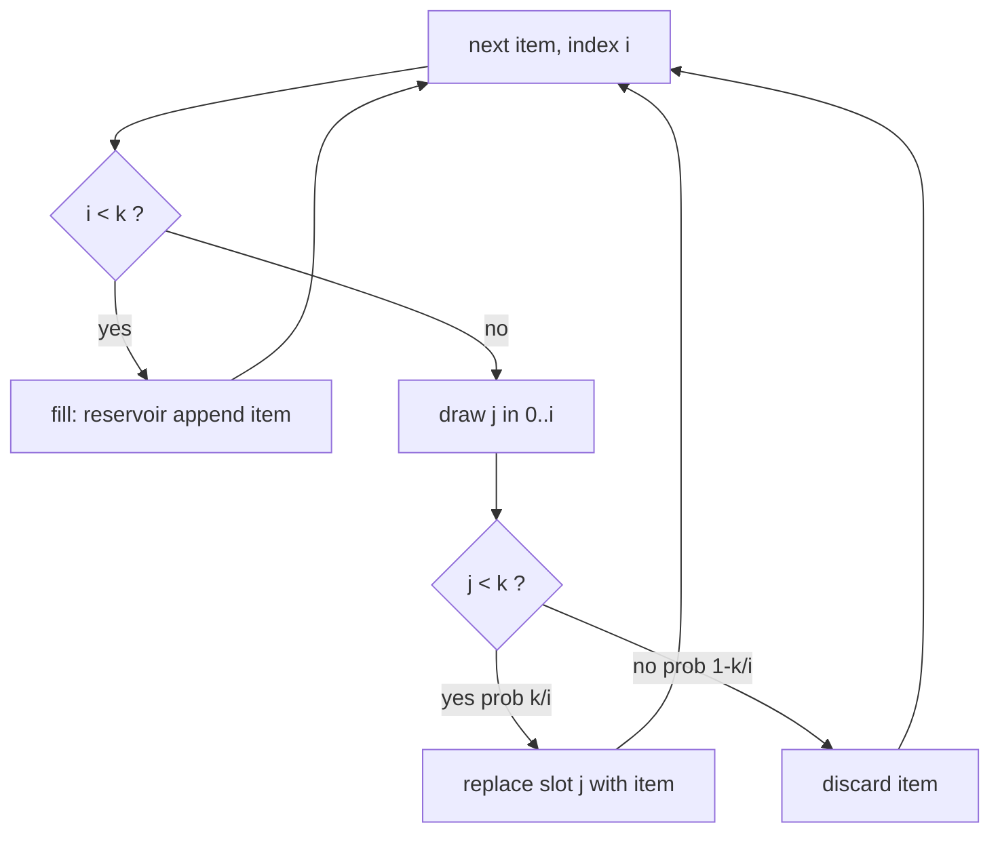

# Reservoir Sampling — Junior Level

> **One-line summary:** To pick `k` items uniformly at random from a stream whose length you do not know in advance, keep a small array (the **reservoir**) of `k` slots. Fill it with the first `k` items; then for the `i`-th item (`i > k`) keep it with probability `k/i`, and if you keep it, throw out one random slot to make room. When the stream ends, the reservoir is a uniform random sample of everything that went by — using only `O(k)` memory and a single pass.

---

## Table of Contents

1. [Introduction](#introduction)
2. [Prerequisites](#prerequisites)
3. [Glossary](#glossary)
4. [Core Concepts](#core-concepts)
5. [Big-O Summary](#big-o-summary)
6. [Real-World Analogies](#real-world-analogies)
7. [Pros & Cons](#pros--cons)
8. [Step-by-Step Walkthrough](#step-by-step-walkthrough)
9. [A Second Worked Example: k = 1 by hand](#a-second-worked-example-k--1-by-hand)
10. [Code Examples](#code-examples)
11. [Verifying Uniformity Empirically](#verifying-uniformity-empirically)
12. [Coding Patterns](#coding-patterns)
11. [Error Handling](#error-handling)
12. [Performance Tips](#performance-tips)
13. [Best Practices](#best-practices)
14. [Edge Cases & Pitfalls](#edge-cases--pitfalls)
15. [Common Mistakes](#common-mistakes)
16. [Cheat Sheet](#cheat-sheet)
17. [Visual Animation](#visual-animation)
18. [Summary](#summary)
19. [Further Reading](#further-reading)

---

## Introduction

Imagine items arriving one at a time on a conveyor belt: lines of a log file being written, rows streaming out of a database, tweets coming off a firehose, or numbers being generated by a sensor. You want a **random sample** of, say, `k = 10` of them. There are two annoying complications:

1. **You do not know how many items there will be.** The stream might have 50 items or 50 billion. You cannot ask "how many are there?" and then pick random indices, because the answer is not available until the stream ends.
2. **You cannot store all of them.** The stream might be far bigger than memory (or even infinite). You are only allowed to keep a tiny fixed amount of state.

The naive approach — *"collect everything into a giant array, then shuffle and take the first `k`"* — fails both conditions: it needs `O(n)` memory and a known `n`. We need something that works in **one pass** with **`O(k)` memory**, and that still gives every item an **equal chance** of ending up in the sample.

**Reservoir sampling** is the classic answer. The name comes from the picture: you keep a small "reservoir" of `k` slots. As items flow past, the reservoir occasionally swallows a new item and spits out an old one, in a carefully chosen way so that — no matter how long the stream turns out to be — when it finally stops, each of the `n` items that ever passed has **exactly probability `k/n`** of being in the reservoir, and every possible `k`-element subset is equally likely.

The core trick is one line. The first `k` items just fill the reservoir. For every later item (the `i`-th, with `i > k`):

> Pick a random integer `j` in `[1, i]`. If `j ≤ k`, replace reservoir slot `j` with the new item. Otherwise, discard the new item.

Picking `j ≤ k` happens with probability `k/i` — so the new item enters the reservoir with probability `k/i`, and when it does, it kicks out one uniformly chosen old slot. That is the whole algorithm (called **Algorithm R**). This file builds the full picture starting from the simplest case `k = 1`, then the general `k`, with a small worked example you can check by hand.

---

## Prerequisites

Before reading this file you should be comfortable with:

- **Arrays / slices / lists** — fixed-size storage you can index and overwrite.
- **A random number generator** — producing a uniform integer in a range `[0, m)` or `[1, m]`, and a uniform float in `[0, 1)`.
- **Loops over a sequence** — `for item := range stream`.
- **Probability basics** — what "probability `k/i`" means, and multiplying probabilities of independent events.
- **Big-O notation** — `O(n)` time, `O(k)` space.

Optional but helpful:

- The idea of a **uniform random sample**: every item equally likely, and (for `k > 1`) every subset of size `k` equally likely.
- The **Fisher-Yates shuffle**, which reservoir sampling is closely related to.

---

## Glossary

| Term | Meaning |
|------|---------|
| **Stream** | A sequence of items arriving one at a time; its total length `n` is unknown until it ends (or is unbounded). |
| **Reservoir** | The fixed-size array of `k` slots that holds the current sample. |
| **`k`** | The sample size you want (number of slots in the reservoir). |
| **`n`** | The total number of items the stream produced (only known at the end). |
| **`i`** | The 1-based index of the item currently being processed. |
| **One pass** | Each item is looked at exactly once, in order, and never revisited. |
| **Uniform sample** | Each item ends up in the reservoir with the same probability `k/n`. |
| **Algorithm R** | The classic reservoir-sampling algorithm (Vitter's name for it): keep item `i` with probability `k/i`. |
| **Replacement step** | When a new item is kept, it overwrites one randomly chosen reservoir slot. |
| **`randInt(a, b)`** | A uniform random integer in `[a, b]` (inclusive). |

---

## Core Concepts

### 1. The Problem: sample without knowing `n`

You are handed items `x_1, x_2, x_3, …` one at a time. You want `k` of them chosen uniformly at random. You may keep only `O(k)` memory, see each item once, and you do **not** know how many there will be. The goal: when the stream stops at some `n`, every item has probability `k/n` of being in your sample.

### 2. The simplest case: `k = 1`

Start with sampling a **single** item. Keep one variable `chosen`.

- Item 1: store it (`chosen = x_1`). Probability it is currently chosen: `1/1 = 1`.
- Item `i` (for `i ≥ 2`): with probability `1/i`, replace `chosen` with `x_i`. Otherwise keep the old `chosen`.

Why does this give every item probability `1/n` at the end? Item `i` is the final answer if (a) it was chosen when it arrived (probability `1/i`) **and** (b) no later item replaced it. Item `i+1` does not replace it with probability `1 - 1/(i+1) = i/(i+1)`, item `i+2` with probability `(i+1)/(i+2)`, and so on. Multiply:

```
P(x_i survives) = (1/i) · (i/(i+1)) · ((i+1)/(i+2)) · … · ((n-1)/n)
               =  1/i · i/n   (everything telescopes!)
               =  1/n.
```

Every item ends with probability `1/n`. That telescoping cancellation is the heart of why reservoir sampling works.

### 3. The general case: any `k`

For `k > 1` the reservoir is an array `R[0..k-1]`.

- **Fill phase:** put the first `k` items directly into the reservoir (`R[i] = x_{i+1}`).
- **Replace phase:** for the `i`-th item with `i > k`, draw `j = randInt(1, i)`. If `j ≤ k`, set `R[j-1] = x_i` (overwrite slot `j-1`); otherwise discard `x_i`.

Drawing `j ≤ k` happens with probability `k/i`. So the new item enters with probability `k/i`, and when it does it evicts one uniformly chosen old slot. We will prove in `professional.md` that this gives every item probability `k/n` at the end, but the intuition is the same telescoping idea as `k = 1`, scaled by `k`.

### 4. The replacement probability `k/i`

Why `k/i` specifically? When `i` items have gone by, a *uniform* sample of size `k` should contain each of those `i` items with probability `k/i`. The algorithm maintains exactly this as an **invariant**: after processing `i` items, the reservoir is a uniform `k`-sample of the first `i` items. Each new item arrives and "claims its fair share" `k/i`; if it gets in, it displaces a random current member so the others stay uniform too.

### 5. One pass, `O(k)` memory

The algorithm reads each item once and only ever stores `k` of them plus a counter `i`. It never needs the whole stream and never needs to know `n` ahead of time. That is what makes it usable on logs, firehoses, and databases too large to load.

### 6. Why not just shuffle?

If you *could* fit everything in memory and knew `n`, you would collect all `n` items, shuffle (Fisher-Yates), and take the first `k`. That is `O(n)` memory and needs `n`. Reservoir sampling gives the *same uniform result* using `O(k)` memory and no advance knowledge of `n`. (The connection runs deep: reservoir sampling is essentially a streaming, memory-bounded version of a partial shuffle.)

---

## Big-O Summary

| Operation | Time | Space | Notes |
|-----------|------|-------|-------|
| Process one item (Algorithm R) | **O(1)** | — | One RNG call + maybe one array write. |
| Whole stream of `n` items | **O(n)** | **O(k)** | Single pass; you must touch each item once. |
| Naive "collect all + shuffle" | O(n) | **O(n)** | Needs all items in memory and known `n`. |
| Random calls (Algorithm R) | O(n) | — | One random draw **per item** — the cost to optimize. |
| Random calls (Algorithm L) | **O(k·(1 + log(n/k)))** | O(k) | Skip-based; far fewer RNG calls (see `middle.md`). |

The headline is `O(n)` time and `O(k)` space, with each item handled in `O(1)`. The one thing Algorithm R "wastes" is a random draw for **every** item even though most are discarded — Algorithm L (covered at the middle level) fixes that by computing how many items to skip at once.

---

## Real-World Analogies

| Concept | Analogy |
|---------|---------|
| The reservoir | A small fish tank that holds exactly `k` fish. |
| Items streaming by | A river of fish swimming past the tank. |
| Replacement step `k/i` | Each passing fish gets a fair shot at jumping into the tank; if it jumps in, it bumps a random tank fish back into the river. |
| Uniform result | When the river dries up, every fish that ever swam by was equally likely to be one of the `k` left in the tank. |
| `k = 1` case | A single trophy spot: each new contestant has a `1/i` chance of taking the trophy from whoever holds it. |
| One pass / `O(k)` memory | You watch the river once and only ever have room for `k` fish — you never net the whole river. |
| Not knowing `n` | You have no idea how long the river is; the method works the same whether it is short or endless. |

Where the analogy breaks: real fish do not jump in with a mathematically precise probability `k/i` — that exactness is what guarantees uniformity. And the "bumped" fish is chosen perfectly uniformly, not by who is nearest the edge.

---

## Pros & Cons

| Pros | Cons |
|------|------|
| Works on streams of **unknown / unbounded** length. | Result is **random** — different runs give different samples (by design). |
| **`O(k)` memory** — independent of the stream size `n`. | Algorithm R calls the RNG `n` times even though it keeps far fewer items. |
| **One pass** — each item seen once, ideal for logs and firehoses. | Cannot "go back"; once an item is discarded it is gone. |
| Provably **uniform**: each item has probability `k/n`, each `k`-subset equally likely. | Plain version is **unweighted**; weights need the A-Res variant. |
| Tiny, simple code: fill `k`, then one `k/i` check per item. | Merging samples across machines needs care (count-weighted; see `senior.md`). |

**When to use:** sampling from a stream too big to store or of unknown length — log sampling, big-data/streaming analytics, picking a random subset of database rows in one scan, A/B test sampling.

**When NOT to use:** when `n` is small and known and you can just shuffle; when you need a *specific* (non-uniform unless weighted) distribution; when you need the *same* sample every run without seeding the RNG.

---

## Step-by-Step Walkthrough

Let us sample `k = 2` items from the stream `[A, B, C, D, E]` (so `n = 5`, but we *pretend not to know that*). Indices are 1-based.

**Fill phase (first `k = 2` items):**

```
i=1: A → R = [A, _]
i=2: B → R = [B... wait, fill both: R = [A, B]
```

After the fill phase `R = [A, B]`. Each of the first two items is in with probability 1 so far.

**Replace phase (items i = 3, 4, 5):**

```
i=3 (item C): draw j = randInt(1,3).
     P(j ≤ 2) = 2/3.  Say j = 2 (≤ 2) → replace R[1]: R = [A, C].
     (If j had been 3, we would discard C and keep R = [A, B].)

i=4 (item D): draw j = randInt(1,4).
     P(j ≤ 2) = 2/4 = 1/2.  Say j = 3 (> 2) → discard D. R = [A, C].

i=5 (item E): draw j = randInt(1,5).
     P(j ≤ 2) = 2/5.  Say j = 1 (≤ 2) → replace R[0]: R = [E, C].
```

Final reservoir: `R = [E, C]`. A different run with different random draws would give a different pair — but the *probabilities* are fixed: each of `A, B, C, D, E` has probability `k/n = 2/5` of being in the final reservoir.

**Quick sanity check on item C.** C entered at `i = 3` with probability `2/3`. It survives if D does not replace its slot and E does not replace its slot. The chance a later item `i` does *not* evict any particular reservoir slot is `1 - (k/i)·(1/k) = 1 - 1/i`. So:

```
P(C in final) = (2/3) · (1 - 1/4) · (1 - 1/5)
             = (2/3) · (3/4) · (4/5)
             = 2/5.   ✓  (telescopes to k/n = 2/5)
```

Exactly `k/n`, as promised — and the same calculation works for every item.

---

## A Second Worked Example: `k = 1` by hand

The `k = 1` case is the cleanest place to *feel* why the `1/i` rule produces uniformity, so let us trace it on the stream `[A, B, C, D]` (`n = 4`). We keep one variable `chosen`. At step `i` we replace `chosen` with the new item if a fresh draw `randInt(1, i)` equals `1` (probability `1/i`).

```
i=1 (A): randInt(1,1)=1 always → chosen = A.        chosen = A
i=2 (B): randInt(1,2)=1 with prob 1/2.
         say it is 1 → chosen = B.                  chosen = B
i=3 (C): randInt(1,3)=1 with prob 1/3.
         say it is 2 (≠1) → keep chosen = B.         chosen = B
i=4 (D): randInt(1,4)=1 with prob 1/4.
         say it is 1 → chosen = D.                   chosen = D
```

This particular run ended on `D`. Run it again with different coin flips and you might end on `A`, `B`, or `C`. The guarantee is about the *long run*: across infinitely many runs, each of `A, B, C, D` is the final answer exactly `1/4` of the time. Let us verify `B` directly. `B` becomes `chosen` at `i = 2` with probability `1/2`. It then must survive `C` and `D`:

```
P(B survives C) = 1 - 1/3 = 2/3   (C does not replace it)
P(B survives D) = 1 - 1/4 = 3/4   (D does not replace it)
P(B final)      = (1/2) · (2/3) · (3/4)
                = 1/4.    ✓
```

The `2`s and `3`s telescope and leave exactly `1/n = 1/4`. Notice every factor after the first is `(i-1)/i`, and the chain `(1/m) · (m/(m+1)) · ((m+1)/(m+2)) · … · ((n-1)/n)` always collapses to `1/n` no matter which step `m` the item first entered. That cancellation — not any special property of `B` — is why *every* item is equally likely. It is the single most important idea in this file, and it generalizes unchanged (just multiply by `k`) to the general reservoir.

### Reading the rule as "claim your fair share"

A second mental model that many people find sticky: when item `i` arrives, a *fair* sample of the `i` items seen so far should contain it with probability `k/i`. So the algorithm simply lets each arriving item "claim its fair share" `k/i` of the reservoir. If it gets in, it must evict someone — and to keep the survivors fair, it evicts a *uniformly random* current member. Every step the reservoir is a perfectly fair sample of everything seen *so far*; when the stream stops, "so far" is "everything," and you are done. There is no special end-of-stream step — the reservoir is always valid at every prefix.

---

## Code Examples

### Example: Algorithm R — sample `k` items from a stream

This reads items one by one and returns a uniform random sample of `k` of them. For `k = 1` it samples a single item.

#### Go

```go
package main

import (
	"fmt"
	"math/rand"
)

// ReservoirSample returns a uniform random sample of k items from stream.
// It is written to work even if you only had an iterator (here a slice is used
// for clarity). Time: O(n), Space: O(k).
func ReservoirSample(stream []int, k int) []int {
	reservoir := make([]int, 0, k)
	for i, item := range stream {
		if i < k {
			// Fill phase: take the first k items directly.
			reservoir = append(reservoir, item)
		} else {
			// Replace phase: keep item i (0-based) with probability k/(i+1).
			j := rand.Intn(i + 1) // uniform in [0, i]
			if j < k {
				reservoir[j] = item // evict slot j, insert new item
			}
		}
	}
	return reservoir
}

func main() {
	stream := []int{10, 20, 30, 40, 50, 60, 70}
	fmt.Println(ReservoirSample(stream, 3)) // e.g. [10 60 30] — varies per run
}
```

#### Java

```java
import java.util.*;

public class ReservoirSampling {
    // Uniform random sample of k items from a stream. Time O(n), Space O(k).
    static int[] reservoirSample(int[] stream, int k) {
        int[] reservoir = new int[k];
        Random rnd = new Random();
        for (int i = 0; i < stream.length; i++) {
            if (i < k) {
                reservoir[i] = stream[i];          // fill phase
            } else {
                int j = rnd.nextInt(i + 1);        // uniform in [0, i]
                if (j < k) {
                    reservoir[j] = stream[i];      // replace slot j
                }
            }
        }
        return reservoir;
    }

    public static void main(String[] args) {
        int[] stream = {10, 20, 30, 40, 50, 60, 70};
        System.out.println(Arrays.toString(reservoirSample(stream, 3)));
    }
}
```

#### Python

```python
import random


def reservoir_sample(stream, k):
    """Uniform random sample of k items from a stream. Time O(n), Space O(k)."""
    reservoir = []
    for i, item in enumerate(stream):
        if i < k:
            reservoir.append(item)          # fill phase
        else:
            j = random.randint(0, i)        # uniform in [0, i]
            if j < k:
                reservoir[j] = item         # replace slot j
    return reservoir


if __name__ == "__main__":
    stream = [10, 20, 30, 40, 50, 60, 70]
    print(reservoir_sample(stream, 3))      # varies per run
```

**What it does:** fills the reservoir with the first `k` items, then for each later item draws a uniform `j` in `[0, i]` and overwrites slot `j` if `j < k` (which happens with probability `k/(i+1)`). Note the 0-based code uses `i+1` where the math uses `i`.
**Run:** `go run main.go` | `javac ReservoirSampling.java && java ReservoirSampling` | `python reservoir.py`

---

## Verifying Uniformity Empirically

A great habit when you implement a randomized algorithm: do not just trust the math — *measure* it. Run the sampler many thousands of times and count how often each item appears. For a correct uniform sampler, every item should appear about `k/n` of the time, so the histogram should look roughly flat.

#### Python (the easiest to eyeball)

```python
import random
from collections import Counter


def reservoir_sample(stream, k):
    reservoir = []
    for i, item in enumerate(stream):
        if i < k:
            reservoir.append(item)
        else:
            j = random.randint(0, i)
            if j < k:
                reservoir[j] = item
    return reservoir


def check_uniformity(n, k, trials=200_000):
    counts = Counter()
    for _ in range(trials):
        for item in reservoir_sample(range(n), k):
            counts[item] += 1
    expected = trials * k / n          # each item should hit this often
    print(f"expected per item ≈ {expected:.0f}")
    for item in range(n):
        bar = "#" * round(counts[item] / expected * 20)
        print(f"{item}: {counts[item]:7d}  {bar}")


if __name__ == "__main__":
    check_uniformity(n=6, k=2)
```

Running this prints six rows whose counts are all close to `expected = trials·k/n`, with bars of nearly equal length. If one bar is consistently short or long, you have a bug — most likely drawing `j` from the wrong range, or replacing with a fixed probability instead of `k/i`. This little harness catches the classic mistakes in seconds and is worth keeping next to any reservoir implementation.

**What "close" means.** The counts will not be *exactly* equal — randomness wobbles. Each item's count is roughly a binomial with mean `trials·k/n` and a standard deviation of a few hundred for these settings, so a spread of ±1% between bars is normal and healthy. A *systematic* skew (the first item always highest, say) is the red flag, not the small jitter.

---

## Coding Patterns

### Pattern 1: Single-item reservoir (`k = 1`)

**Intent:** The simplest reservoir — keep one item, replace with probability `1/i`.

```python
def sample_one(stream):
    chosen = None
    for i, item in enumerate(stream, start=1):  # i is 1-based count seen so far
        if random.randint(1, i) == 1:           # probability 1/i
            chosen = item
    return chosen
```

### Pattern 2: Streaming interface (no slice needed)

**Intent:** Work on a true stream/iterator, not a pre-built array, so memory stays `O(k)`.

```python
def reservoir_from_iter(it, k):
    reservoir = []
    for i, item in enumerate(it):
        if i < k:
            reservoir.append(item)
        else:
            j = random.randint(0, i)
            if j < k:
                reservoir[j] = item
    return reservoir
```

### Pattern 3: The fill-then-replace shape



---

## Error Handling

| Error | Cause | Fix |
|-------|-------|-----|
| Reservoir has fewer than `k` items | Stream had fewer than `k` items total. | Document/return all available items; do not pad with garbage. |
| Biased sample (early items favored) | Random range wrong, e.g. `randInt(0, k)` instead of `randInt(0, i)`. | Always draw from the full seen-so-far range `[0, i]`. |
| Crash on empty stream | Looping over nothing, then indexing the reservoir. | Handle `n == 0` (return empty); never assume the reservoir is full. |
| Same sample every run | RNG not seeded / seeded with a constant. | Seed from a good entropy source (or seed deliberately for reproducible tests). |
| Off-by-one bias | Mixing 0-based code with 1-based math. | Be consistent: 0-based code keeps item `i` with prob `k/(i+1)`. |

---

## Performance Tips

- **Make per-item work `O(1)`** — exactly one RNG call and at most one array write per item.
- **Avoid building a list of all items** — iterate the stream directly so memory stays `O(k)`.
- **For huge `n` with small `k`, prefer Algorithm L** (middle level): it skips most items, doing `O(k log(n/k))` RNG calls instead of `O(n)`.
- **Use the language's fast RNG** — Go `math/rand`, Java `java.util.Random` / `ThreadLocalRandom`, Python `random` (not the slower `secrets` unless you need cryptographic randomness).
- **Reuse one RNG instance**; creating a new RNG per item is slow and can repeat values.

---

## Best Practices

- Implement and test the `k = 1` case first; it is the clearest place to see the `1/i` rule.
- Validate uniformity empirically: run the sampler many times and check each item appears about `k/n` of the time (a histogram should be roughly flat).
- Keep the fill phase and replace phase clearly separated in code.
- Document whether your sampler is **with or without replacement** (classic reservoir is *without* replacement — no item appears twice).
- State your memory guarantee (`O(k)`) and that the stream is read once.
- Decide up front whether you need a **seeded** (reproducible) RNG for tests vs a fresh one in production.

---

## Edge Cases & Pitfalls

- **`n < k`** — fewer items than slots; the reservoir holds them all (and that is correct — you cannot sample more than exists).
- **`n == k`** — the reservoir is exactly the whole stream; every replace check is skipped.
- **`k == 0`** — return an empty sample; guard against dividing or indexing by zero.
- **Empty stream (`n == 0`)** — return an empty reservoir; do not assume any item exists.
- **Single-item stream with `k = 1`** — trivially returns that item.
- **Very large `n`** — counter `i` must not overflow; use a 64-bit integer.
- **Duplicate values in the stream** — fine; reservoir sampling samples *positions*, so duplicates are treated as distinct items.

---

## Common Mistakes

1. **Drawing from the wrong range** — using `randInt(0, k)` or `randInt(0, n)` instead of `randInt(0, i)`; this destroys uniformity.
2. **Replacing with the wrong probability** — using a fixed probability instead of `k/i`; early items become over- or under-represented.
3. **Storing all items first** — defeating the whole point (`O(k)` memory) by collecting the stream into a list.
4. **Off-by-one between 0-based and 1-based** — the math uses `i` (1-based count), code often uses `i` as a 0-based index; keep the `+1` straight.
5. **Not handling `n < k`** — assuming the reservoir is always full and indexing past the end.
6. **Reseeding the RNG every item** — produces correlated or repeated draws and ruins uniformity.
7. **Confusing "uniform item probability" with "uniform subset"** — both hold for classic reservoir sampling, but only if the replace step evicts a *uniformly random* slot.

---

## Cheat Sheet

| Question | Tool | Key idea |
|----------|------|----------|
| Sample 1 item from a stream | `k = 1` reservoir | replace with probability `1/i` |
| Sample `k` items from a stream | Algorithm R | keep item `i` with probability `k/i`, evict a random slot |
| Don't know `n`? | reservoir sampling | works for unknown/unbounded length |
| Stream too big for memory? | reservoir sampling | `O(k)` memory, one pass |
| Too many RNG calls? | Algorithm L (middle) | skip ahead `O(k log(n/k))` draws |
| Need weighted picks? | A-Res / Efraimidis-Spirakis (middle) | keys `u^(1/w)`, keep top-`k` |

Core algorithm:

```
reservoir_sample(stream, k):
    R = []                          # the reservoir, capacity k
    for i, item in enumerate(stream):   # i is 0-based
        if i < k:
            R.append(item)          # fill phase
        else:
            j = randInt(0, i)       # uniform in [0, i]
            if j < k:               # happens with probability k/(i+1)
                R[j] = item         # evict slot j, insert item
    return R
# Time O(n), Space O(k); each item has final probability k/n.
```

---

## Visual Animation

> See [`animation.html`](./animation.html) for an interactive visualization.
>
> The animation demonstrates:
> - A stream of items flowing in one at a time, with the current index `i`
> - The reservoir of `k` slots filling up, then the probabilistic replace step
> - The live probability `k/i` shown for each incoming item
> - Whether each item is kept (and which slot it evicts) or discarded
> - Editable `k` plus Step / Run / Reset controls and a Big-O panel

---

## Summary

Reservoir sampling solves a deceptively hard problem: pick `k` items **uniformly at random** from a stream of **unknown or unbounded** length, in **one pass** with **`O(k)` memory**. The mechanism is one rule — fill the reservoir with the first `k` items, then keep the `i`-th item with probability `k/i`, evicting a uniformly random slot when you do. Starting from the `k = 1` case, the proof is a telescoping product that collapses to exactly `k/n` for every item: every item, no matter when it arrived, ends with the same chance of being sampled. The two rules never to forget: **draw `j` from the full range `[1, i]`** (not a fixed range), and **never store the whole stream** — that `O(k)` memory bound is the entire reason the technique exists.

---

## Further Reading

- *The Art of Computer Programming, Vol. 2* (Knuth) — Algorithm R for reservoir sampling.
- Jeffrey Vitter, "Random Sampling with a Reservoir" (1985) — the paper that named Algorithm R and introduced the faster Algorithm L/Z.
- Sibling level [`middle.md`](./middle.md) — weighted reservoir sampling and the skip-based Algorithm L.
- Go: `math/rand` docs; Java: `java.util.Random`, `ThreadLocalRandom`; Python: `random` module docs.
- Wikipedia — "Reservoir sampling" for the algorithm variants and history.

---

Next step: [middle.md](./middle.md)
